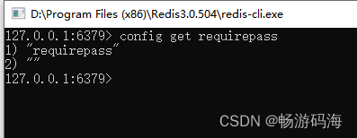

## windows环境下，查看redis密码和设置redis密码

1.先启动redis，然后在redis安装目录下打开redis-cli.exe输入config get requirepass，如下图所示



注：因为我的redis没有设置密码，所以返回为空

2.设置密码

输入命令：config set requirepass 自己的密码

3.设置完成后，重新查看报错：(error) NOAUTH Authentication required.

这个报错是需要重启redis服务

4.如果用命令设置密码没有生效，则在redis安装目录，如下图所示，打开下面的两个文件，搜索requirepass，requirepass后面就是redis密码，进行设置即可，设置完成后再重启redis服务

## Redis使用字符串和hash存储JSON，那个更高效？

最近在排查一个线上问题，发现redis使用了一个hash key里面存储了600w的field，为啥这么多就是因为他把一个结构体中的字段分成了多个field存储。下面来看看到底应该怎么设计比较合理。

### 一、问题

1. 一种使用简单的字符串键和值。 键：用户，值：payload（整个JSON，可以为100-200 KB）

```shell
SET user:1 payload
```

1. 使用哈希

```shell
HSET user:1 username "someone" 
HSET user:1 location "NY" 
HSET user:1 bio "STRING WITH OVER 100 lines"
```

请记住，如果使用哈希，则值长度是不可预测的。它们并不都是短的，例如上面的bio示例。哪个内存效率更高？使用字符串键和值，还是使用哈希？

### 二、讨论

1. 将整个对象作为JSON编码的字符串存储在单个键中，并使用一组（或列表，如果合适的话）跟踪所有对象。例如：

```shell
INCR id:users
SET user:{id} '{"name":"Fred","age":25}'
SADD users {id}
```

一般来说，在大多数情况下，这可能是最好的方法。如果对象中有很多字段，一个对象不会与其他对象嵌套，并且您一次只能访问一小部分字段，那么选择选项1可能不是很好。

**优点**：被认为是“良好实践”。每个对象都是具有用户信息的Redis key。JSON解析速度很快，尤其是当您需要一次访问此Object的多个字段时。

**缺点**：当您只需要访问一个字段时，速度较慢。

1. 将每个对象的属性存储在Redis哈希中。

```shell
INCR id:users
HMSET user:{id} name "Fred" age 25
SADD users {id}
```

**优点**：被认为是“良好实践”。每个对象都是具有用户信息的Redis key。无需解析JSON字符串。

**缺点**：当您需要访问对象中的所有/大多数字段时，速度可能会变慢。同样，嵌套对象（对象内的对象）也无法轻松存储。

1. 将每个对象作为JSON字符串存储在Redis哈希中。

```shell
INCR id:users
HMSET users {id} '{"name":"Fred","age":25}'
```

这使您可以进行合并，并且仅使用两个键，而不是很多键。明显的缺点是您不能在每个用户对象上设置TTL（以及其他内容），因为它只是Redis哈希中的一个字段，而不是具有用户信息的Redis key。

**优点**：JSON解析速度很快，尤其是当您需要一次访问此Object的多个字段时。减少主键名称空间的“污染”。

**缺点**：当您有很多对象时，内存使用量与＃1差不多。当您只需要访问单个字段时，速度比＃2慢。可能不被视为“良好做法”。

1. 将每个对象的每个属性存储在专用key中。

```shell
INCR id:users
SET user:{id}:name "Fred"
SET user:{id}:age 25
SADD users {id}
```

根据上面的解释，*几乎永远不会*选择此方案（除非Object的属性需要具有特定的[TTL](http://redis.io/commands/expire)或其他内容）。

**优点**：对象属性是具有用户信息的Redis key，对于您的应用程序来说可能并不算过大。

**缺点**：速度慢，占用更多内存，并且不被视为“最佳实践”。主键名称空间受到很多污染。

### 三、总结

方案4通常不是首选。方案1和2非常相似，而且都很常见。我更喜欢选项1（通常来说），因为它允许您存储更复杂的对象（具有多层嵌套等）。当您*真正关心*不污染主键名称空间时，可以使用方案3。

## 开发过程中redis为什么要序列化

​    **序列化最终的目的是为了对象可以跨平台存储，和进行网络传输。** 而我们进行跨平台存储和网络传输的方式就是IO，而我们的IO支持的数据格式就是字节数组。

​    通过上面我想你已经知道了凡是需要进行“跨平台存储”和”网络传输”的数据，都需要进行序列化。

​    本质上存储和网络传输 都需要经过 把一个对象状态保存成一种跨平台识别的字节格式，然后其他的平台才可以通过字节信息解析还原对象信息。

### redis序列化方式对比：

#### redis的默认方式是JdkSerializationRedisSerializer

​    JdkSerializationRedisSerializer: 使用JDK提供的序列化功能。

​    **优点是反序列化时不需要提供类型信息(class)，但缺点是需要实现Serializable接口，** 还有序列化后的结果非常庞大，是JSON格式的5倍左右，这样就会消耗redis服务器的大量内存。

#### Jackson2JsonRedisSerializer： 使用Jackson库将对象序列化为JSON字符串。

​    优点是速度快，序列化后的字符串短小精悍，不需要实现Serializable接口。

​    但缺点也非常致命，那就是此类的构造函数中有一个类型参数，必须提供要序列化对象的类型信息(.class对象)。 通过查看源代码，发现其只在反序列化过程中用到了类型信息。


​    问题：使用默认的JDK序列化方式，在RDM工具中查看k-v值时会出现“乱码”，不方便查看。

​    **解决：自定义系列化方式，使用Jackson2JsonRedisSerializer**

## Docker的redis容器报错：MISCONF Redis is configured to save RDB snapshots...

**报错原因**:

从Redis层面来分析错误的直接原因是： Redis被配置为保存[数据库](https://cloud.tencent.com/product/tencentdb-catalog?from_column=20065&from=20065)快照，但它目前不能持久化到硬盘。用来修改集合数据的命令不能用。请查看Redis日志的详细错误信息。 

也就是说，Redis无法将缓存中的数据写入本地磁盘。

**解决办法**：

```bash
#docker 进入redis容器中,其中"f0dd"为redis容器的id开始四位
[root@iZ2zeca7jric8sx4f3n7spZ ~]# docker exec -it f0dd /bin/bash

#进入客户端(redis client)
root@f0dd1681b64f:/data# redis-cli

#写入一个键值
127.0.0.1:6379> set name newfbin
#报错信息
(error) MISCONF Redis is configured to save RDB snapshots, but it is currently not able to persist on disk. Commands that may modify the data set are disabled, because this instance is configured to report errors during writes if RDB snapshotting fails (stop-writes-on-bgsave-error option). Please check the Redis logs for details about the RDB error.
#解决命令
127.0.0.1:6379> config set stop-writes-on-bgsave-error no
OK
#验证错误是否解决
127.0.0.1:6379> set name newfbin
OK
```

