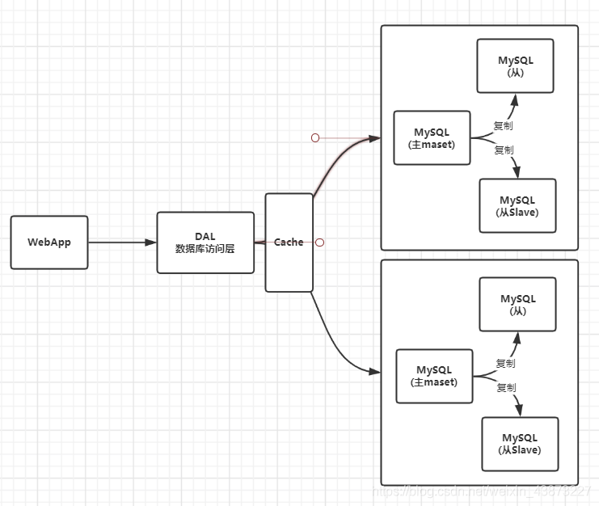
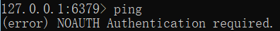
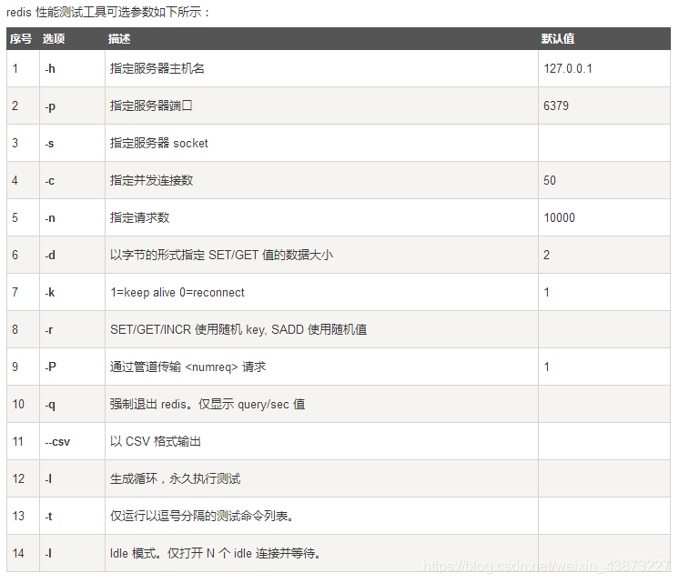
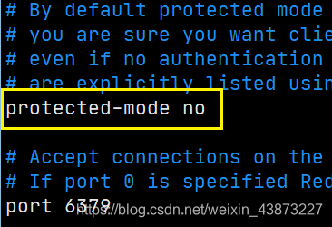
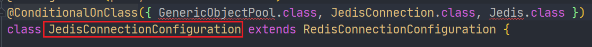
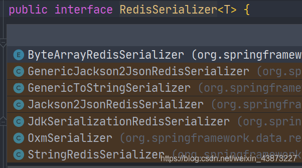

> 原文地址：https://blog.csdn.net/weixin_43873227/article/details/106107270

### 一、Nosql

#### 为什么使用Nosql

大数据时代！！普通的数据库无法进行数据分析！Hadoop(2006)。

历史发展：

> 1. **单机MySQL时代**（90年代）,一个网站的访问量一般不会太大，单个数据库完全够用
>
> 
>
> 问题：
>
> - 数据量增加到一定程度，单机数据库就放不下了
> - 数据的索引（B+ Tree）,一个机器内存也存放不下
> - 访问量变大后（读写混合），一台服务器承受不住。
>
> 1. **MySQL垂直拆分+MemCache**
>
> 
>
> 将当个数据库扩展成为多个“垂直”的数据库，同时满足读写分离和数据一致性。
> 但是当访问量过大时频繁去数据库查询速度和效率低下。这个优化过程经历了以下几个过程:
>
> - 优化数据库的数据结构和索引(难度大)
> - 文件缓存，通过IO流获取比每次都访问数据库效率略高，但是流量爆炸式增长时候，IO流也承受不了
> - MemCache,当时最热门的技术，通过在数据库和数据库访问层之间加上一层缓存，第一次访问时查询数据库，将结果保存到缓存，后续的查询先检查缓存，若有直接拿去使用，效率显著提升。
>
> 1. **分库分表、主从复制=>集群**
>
> 
>
> 1. 如今信息量井喷式增长，各种各样的数据出现（用户定位数据，图片数据等），大数据的背景下关系型数据库（RDBMS）无法满足大量数据要求。Nosql数据库就能轻松解决这些问题。

#### 什么是Nosql

**Not Only SQL、**不仅仅是数据库。泛指非关系型数据库。

关系型数据库：列+行，同一个表下数据的结构是一样的。

非关系型数据库：数据存储没有固定的格式，并且可以进行横向扩展。

#### Nosql特点

1. 数据之间没有关系，方便扩展
2. 大数据量下，性能高。（一秒写入8W次 读取11W次）
3. 数据类型是多样性（不需要事先设计数据库，感受一下Mysql设计表和库的痛苦）
4. 存储方式
   - 键值对存储
   - 列存储
   - 文档存储
   - 图形数据库
   - …
5. 没有固定的查询语言
6. CAP定理和 BASE
7. 高可用、高性能、高可扩

推荐阅读：阿里云的这群疯子https://yq.aliyun.com/articles/653511

```markdown
# 商品信息
- 一般存放在关系型数据库：Mysql,阿里巴巴使用的Mysql都是经过内部改动的。

# 商品描述、评论(文字居多)
- 文档型数据库：MongoDB

# 图片
- 分布式文件系统 FastDFS
- 淘宝：TFS
- Google: GFS
- Hadoop: HDFS
- 阿里云: oss

# 商品关键字 用于搜索
- 搜索引擎：solr,elasticsearch
- 阿里：Isearch 多隆

# 商品热门的波段信息
- 内存数据库：Redis，Memcache

# 商品交易，外部支付接口
- 第三方应用
```

所以企业中使用数据库，都是关系型数据库+Nosql一起使用。

#### NoSQL的四大分类

##### KV键值对

- sina：Redis
- 美团：Redis+Tair
- alibaba、baidu：Redis+Memcache

##### 文档型数据库（bson格式）

- MongoDB(掌握)

  > 基于分布式文件存储的数据库。C++编写，用于处理大量文档。

  MongoDB是RDBMS和NoSQL的中间产品。NoSQL中最像关系型数据库的数据库

- ConchDB

##### 列存储数据库

- HBase(大数据必学)
- 分布式文件系统

##### 图关系数据库

用于广告推荐，社交网络

- Neo4j、InfoGrid

| **分类**                | **Examples举例**                                   | **典型应用场景**                                             | **数据模型**                                    | **优点**                                                     | **缺点**                                                     |
| ----------------------- | -------------------------------------------------- | ------------------------------------------------------------ | ----------------------------------------------- | ------------------------------------------------------------ | ------------------------------------------------------------ |
| **键值对（key-value）** | Tokyo Cabinet/Tyrant, Redis, Voldemort, Oracle BDB | 内容缓存，主要用于处理大量数据的高访问负载，也用于一些日志系统等等。 | Key 指向 Value 的键值对，通常用hash table来实现 | 查找速度快                                                   | 数据无结构化，通常只被当作字符串或者二进制数据               |
| **列存储数据库**        | Cassandra, HBase, Riak                             | 分布式的文件系统                                             | 以列簇式存储，将同一列数据存在一起              | 查找速度快，可扩展性强，更容易进行分布式扩展                 | 功能相对局限                                                 |
| **文档型数据库**        | CouchDB, MongoDb                                   | Web应用（与Key-Value类似，Value是结构化的，不同的是数据库能够了解Value的内容） | Key-Value对应的键值对，Value为结构化数据        | 数据结构要求不严格，表结构可变，不需要像关系型数据库一样需要预先定义表结构 | 查询性能不高，而且缺乏统一的查询语法。                       |
| **图形(Graph)数据库**   | Neo4J, InfoGrid, Infinite Graph                    | 社交网络，推荐系统等。专注于构建关系图谱                     | 图结构                                          | 利用图结构相关算法。比如最短路径寻址，N度关系查找等          | 很多时候需要对整个图做计算才能得出需要的信息，而且这种结构不太好做分布式的集群 |

### 二、Redis入门


#### Redis是什么？

> Redis（Remote Dictionary Server )，即远程字典服务
>
> 一个开源的使用ANSI C语言编写、支持网络、可基于内存亦可持久化的日志型、**Key-Value数据库**，并提供多种语言的API。
>
> 与memcached一样，为了保证效率，**数据都是缓存在内存中**。区别的是redis会周期性的把更新的数据写入磁盘或者把修改操作写入追加的记录文件，并且在此基础上实现了master-slave(主从)同步。

#### Redis能干什么？

1. 内存存储，需要持久化（RDB、AOF）
2. 高效率、用于高速缓冲
3. 发布订阅系统
4. 地图信息分析
5. 计时器、计数器(eg：浏览量)
6. …

#### 环境搭建

官网：https://redis.io/

推荐使用Linux服务器学习。

windows版本的Redis已经停更很久了…

##### window搭建

下载压缩包后解压：


此时运行redis-server.exe 会创建一个临时服务，当窗口关闭，服务也会随之关闭。


然后我们启动运行redis-cli 就可以连接到redis-server，Redis的默认端口6379

输入ping命令，就会得到PONG的消息，证明连接成功。


Redis可以设置密码的噢：（这里主要讲解使用命令行设置。还可以通过配置文件设置。）

1. `config get requirepass =>`
2. 默认是`“”`，`config set requirepass 123456`设置密码为123456，执行成功返回消息OK
3. 现在进行ping，就要求身份认证
4. auth + 密码就可以完成身份认证
5. 然后就可以进行使用拉，由于是键值对存储，使用简单的get/set就可以


我们之前说到是使用的临时服务，那么肯定也能像mysql一样**安装常驻服务。**

1. 进入Redis解压目录

   `redis-server.exe --service-install redis.windows.conf --service-name 服务名 --loglevel verbose`

   就可以安装Redis服务了，这里使用 Redis-server 作为服务名

   

2. 然后我们启动服务

   `redis-server.exe --service-start --service-name 服务名`


1. 现在我们直接启动redis-cli.exe 也能进行连接

2. 如果不需要这个服务了，可以停止服务：

   `redis-server.exe --service-stop --service-name 服务名`

3. 或者卸载服务(需要先停止服务)

   `redis-server.exe --service-uninstall --service-name 服务名`

##### Linux搭建

解压：

```
tar -zxvf redis_xxx.tar.gz
```


`yum install gcc-c` 安装gcc环境，然后进入redis目录下执行`make`命令

然后执行`make install`确认执行完毕

redis默认安装路径`/usr/local/bin`


配置redis

将解压文件中的redis.conf 复制一份即可，在/usr/local/bin下创建一个myconf目录存放配置文件。


Redis 默认不是后台启动，修改配置文件：


将daemonize改为yes，就改为了后台启动。

回到/usr/local/bin目录 启动redis，并设置配置文件

```
redis-server myconf/redis.conf
```

然后启动客户端连接

`redis-cli -p 6379` (这里可以使用 -h 指定主机号， -p 指定端口号)

客户端中使用`shutdown`关闭server,`exit`退出客户端，此时客户端和server就完全退出了。

#### 性能测试工具—redis-benchmark

Redis官方提供的性能测试工具，参数选项如下：



简单测试

```markdown
redis-benchmark -h localhost -p 6379 -c 100 -n 100000
> 表示向localhost 6379端口也就是我们的redis-server 以100的并发数发送10,0000个请求进行性能测试
```

结果截图，像是对每个命令进行了测试包括（SET、GET、INCR、LPUSH等）


那么这些测试结果代表什么呢？


#### 基础知识

> **Redis默认有16个数据库**


16个数据库为：DB 0~DB 15
默认使用DB 0 ，可以使用`select n`切换到DB n，`dbsize`可以查看当前数据库的大小，与key数量相关。。

```shell
127.0.0.1:6379> config get databases # 命令行查看数据库数量databases
1) "databases"
2) "16"

127.0.0.1:6379> select 8 # 切换数据库 DB 8
OK
127.0.0.1:6379[8]> dbsize # 查看数据库大小
(integer) 0

# 不同数据库之间 数据是不能互通的，并且dbsize 是根据库中key的个数。
127.0.0.1:6379> set name sakura 
OK
127.0.0.1:6379> SELECT 8
OK
127.0.0.1:6379[8]> get name # db8中并不能获取db0中的键值对。
(nil)
127.0.0.1:6379[8]> DBSIZE
(integer) 0
127.0.0.1:6379[8]> SELECT 0
OK
127.0.0.1:6379> keys *
1) "counter:__rand_int__"
2) "mylist"
3) "name"
4) "key:__rand_int__"
5) "myset:__rand_int__"
127.0.0.1:6379> DBSIZE # size和key个数相关
(integer) 5
```

`keys *` ：查看当前数据库中所有的key。

`flushdb`：清空当前数据库中的键值对。

`flushall`：清空所有数据库的键值对。

> **Redis是单线程的，Redis是基于内存操作的。**
> 所以Redis的性能瓶颈不是CPU,而是机器内存和网络带宽。
>
> 那么为什么Redis的速度如此快呢，性能这么高呢？QPS达到10W+

1. 首先Redis的底层是使用C语言编写，所以性能有优势
2. 我们需要打破两个认知误区
   - 多线程与高性能之间 不是对等的。（多线程不一定高性能）
   - 多线程不一定比单线程效率高。由于多线程之间切换会导致CPU的上下文进行切换，也是费时操作。
3. Redis将所有数据存放在内存中，且是单线程的，CPU不用频繁切换上下文。

### 三、五大数据类型

> Redis是一个开源（BSD许可），内存存储的数据结构服务器，可用作数据库，高速缓存和消息队列代理。它支持[字符串](https://www.redis.net.cn/tutorial/3508.html)、[哈希表](https://www.redis.net.cn/tutorial/3509.html)、[列表](https://www.redis.net.cn/tutorial/3510.html)、[集合](https://www.redis.net.cn/tutorial/3511.html)、[有序集合](https://www.redis.net.cn/tutorial/3512.html)，[位图](https://www.redis.net.cn/tutorial/3508.html)，[hyperloglogs](https://www.redis.net.cn/tutorial/3513.html)等数据类型。内置复制、[Lua脚本](https://www.redis.net.cn/tutorial/3516.html)、LRU收回、[事务](https://www.redis.net.cn/tutorial/3515.html)以及不同级别磁盘持久化功能，同时通过Redis Sentinel提供高可用，通过Redis Cluster提供自动[分区](https://www.redis.net.cn/tutorial/3524.html)。

#### Redis-key

> 在redis中无论什么数据类型，在数据库中都是也key-value形式保存，通过进行对Redis-key的操作，来完成对数据库中数据的操作。

下面学习的命令：

- `exists key`
- `del key`
- `move key db`
- `expire key second`
- `type key`

```bash
127.0.0.1:6379> keys * # 查看当前数据库所有key
(empty list or set)
127.0.0.1:6379> set name sakura # set key
OK
127.0.0.1:6379> set age 20
OK
127.0.0.1:6379> keys *
1) "age"
2) "name"
127.0.0.1:6379> move age 1 # 将键值对移动到指定数据库
(integer) 1
127.0.0.1:6379> EXISTS age # 判断键是否存在
(integer) 0 # 不存在
127.0.0.1:6379> EXISTS name
(integer) 1 # 存在
127.0.0.1:6379> SELECT 1
OK
127.0.0.1:6379[1]> keys *
1) "age"
127.0.0.1:6379[1]> del age # 删除键值对
(integer) 1 # 删除个数


127.0.0.1:6379> set age 20
OK
127.0.0.1:6379> EXPIRE age 15 # 设置键值对的过期时间

(integer) 1 # 设置成功 开始计数
127.0.0.1:6379> ttl age # 查看key的过期剩余时间
(integer) 13
127.0.0.1:6379> ttl age
(integer) 11
127.0.0.1:6379> ttl age
(integer) 9
127.0.0.1:6379> ttl age
(integer) -2 # -2 表示key过期，-1表示key未设置过期时间

127.0.0.1:6379> get age # 过期的key 会被自动delete
(nil)
127.0.0.1:6379> keys *
1) "name"

127.0.0.1:6379> type name # 查看value的数据类型
string
```

关于`TTL`命令

Redis的key，通过TTL命令返回key的过期时间，一般来说有3种：

1. 当前key没有设置过期时间，所以会返回-1.
2. 当前key有设置过期时间，而且key已经过期，所以会返回-2.
3. 当前key有设置过期时间，且key还没有过期，故会返回key的正常剩余时间.

关于重命名`RENAME`和`RENAMENX`

- `RENAME key newkey`修改 key 的名称
- `RENAMENX key newkey`仅当 newkey 不存在时，将 key 改名为 newkey 。

更多：查阅官网教程：https://www.redis.net.cn/tutorial/3507.html

------

#### String(字符串)

普通的set、get直接略过。

| 命令                                 | 描述                                                       | 示例                                                         |
| ------------------------------------ | ---------------------------------------------------------- | ------------------------------------------------------------ |
| `APPEND key value`                   | 向指定的key的value后追加字符串                             | 127.0.0.1:6379> set msg hello OK 127.0.0.1:6379> append msg " world" (integer) 11 127.0.0.1:6379> get msg "hello world" |
| `DECR/INCR key`                      | 将指定key的value数值进行+1/-1(仅对于数字)                  | 127.0.0.1:6379> set age 20 OK 127.0.0.1:6379> incr age (integer) 21 127.0.0.1:6379> decr age (integer) 20 |
| `INCRBY/DECRBY key n`                | 按指定的步长对数值进行加减                                 | 127.0.0.1:6379> INCRBY age 5 (integer) 25 127.0.0.1:6379> DECRBY age 10 (integer) 15 |
| `INCRBYFLOAT key n`                  | 为数值加上浮点型数值                                       | 127.0.0.1:6379> INCRBYFLOAT age 5.2 "20.2"                   |
| `STRLEN key`                         | 获取key保存值的字符串长度                                  | 127.0.0.1:6379> get msg "hello world" 127.0.0.1:6379> STRLEN msg (integer) 11 |
| `GETRANGE key start end`             | 按起止位置获取字符串（闭区间，起止位置都取）               | 127.0.0.1:6379> get msg "hello world" 127.0.0.1:6379> GETRANGE msg 3 9 "lo worl" |
| `SETRANGE key offset value`          | 用指定的value 替换key中 offset开始的值                     | 127.0.0.1:6379> SETRANGE msg 2 hello (integer) 7 127.0.0.1:6379> get msg "tehello" |
| `GETSET key value`                   | 将给定 key 的值设为 value ，并返回 key 的旧值(old value)。 | 127.0.0.1:6379> GETSET msg test "hello world"                |
| `SETNX key value`                    | 仅当key不存在时进行set                                     | 127.0.0.1:6379> SETNX msg test (integer) 0 127.0.0.1:6379> SETNX name sakura (integer) 1 |
| `SETEX key seconds value`            | set 键值对并设置过期时间                                   | 127.0.0.1:6379> setex name 10 root OK 127.0.0.1:6379> get name (nil) |
| `MSET key1 value1 [key2 value2..]`   | 批量set键值对                                              | 127.0.0.1:6379> MSET k1 v1 k2 v2 k3 v3 OK                    |
| `MSETNX key1 value1 [key2 value2..]` | 批量设置键值对，仅当参数中所有的key都不存在时执行          | 127.0.0.1:6379> MSETNX k1 v1 k4 v4 (integer) 0               |
| `MGET key1 [key2..]`                 | 批量获取多个key保存的值                                    | 127.0.0.1:6379> MGET k1 k2 k3 1) "v1" 2) "v2" 3) “v3”        |
| `PSETEX key milliseconds value`      | 和 SETEX 命令相似，但它以毫秒为单位设置 key 的生存时间，   |                                                              |

------

#### List(列表)

> Redis列表是简单的字符串列表，按照插入顺序排序。你可以添加一个元素导列表的头部（左边）或者尾部（右边）
>
> 一个列表最多可以包含 232 - 1 个元素 (4294967295, 每个列表超过40亿个元素)。

首先我们列表，可以经过规则定义将其变为队列、栈、双端队列等


正如图Redis中List是可以进行双端操作的，所以命令也就分为了LXXX和RLLL两类，有时候L也表示List例如LLEN

| 命令                                    | 描述                                                         |
| --------------------------------------- | ------------------------------------------------------------ |
| `LPUSH/RPUSH key value1[value2..]`      | 从左边/右边向列表中PUSH值(一个或者多个)。                    |
| `LRANGE key start end`                  | 获取list 起止元素==（索引从左往右 递增）==                   |
| `LPUSHX/RPUSHX key value`               | 向已存在的列名中push值（一个或者多个）                       |
| `LINSERT key BEFORE|AFTER pivot value`  | 在指定列表元素的前/后 插入value                              |
| `LLEN key`                              | 查看列表长度                                                 |
| `LINDEX key index`                      | 通过索引获取列表元素                                         |
| `LSET key index value`                  | 通过索引为元素设值                                           |
| `LPOP/RPOP key`                         | 从最左边/最右边移除值 并返回                                 |
| `RPOPLPUSH source destination`          | 将列表的尾部(右)最后一个值弹出，并返回，然后加到另一个列表的头部 |
| `LTRIM key start end`                   | 截取指定范围内的列表                                         |
| `LREM key count value`                  | List中是允许value重复的 `count > 0`：从头部开始搜索 然后删除指定的value 至多删除count个 `count < 0`：从尾部开始搜索… `count = 0`：删除列表中所有的指定value。 |
| `BLPOP/BRPOP key1[key2] timout`         | 移出并获取列表的第一个/最后一个元素， 如果列表没有元素会阻塞列表直到等待超时或发现可弹出元素为止。 |
| `BRPOPLPUSH source destination timeout` | 和`RPOPLPUSH`功能相同，如果列表没有元素会阻塞列表直到等待超时或发现可弹出元素为止。 |

```shell
---------------------------LPUSH---RPUSH---LRANGE--------------------------------

127.0.0.1:6379> LPUSH mylist k1 # LPUSH mylist=>{1}
(integer) 1
127.0.0.1:6379> LPUSH mylist k2 # LPUSH mylist=>{2,1}
(integer) 2
127.0.0.1:6379> RPUSH mylist k3 # RPUSH mylist=>{2,1,3}
(integer) 3
127.0.0.1:6379> get mylist # 普通的get是无法获取list值的
(error) WRONGTYPE Operation against a key holding the wrong kind of value
127.0.0.1:6379> LRANGE mylist 0 4 # LRANGE 获取起止位置范围内的元素
1) "k2"
2) "k1"
3) "k3"
127.0.0.1:6379> LRANGE mylist 0 2
1) "k2"
2) "k1"
3) "k3"
127.0.0.1:6379> LRANGE mylist 0 1
1) "k2"
2) "k1"
127.0.0.1:6379> LRANGE mylist 0 -1 # 获取全部元素
1) "k2"
2) "k1"
3) "k3"

---------------------------LPUSHX---RPUSHX-----------------------------------

127.0.0.1:6379> LPUSHX list v1 # list不存在 LPUSHX失败
(integer) 0
127.0.0.1:6379> LPUSHX list v1 v2  
(integer) 0
127.0.0.1:6379> LPUSHX mylist k4 k5 # 向mylist中 左边 PUSH k4 k5
(integer) 5
127.0.0.1:6379> LRANGE mylist 0 -1
1) "k5"
2) "k4"
3) "k2"
4) "k1"
5) "k3"

---------------------------LINSERT--LLEN--LINDEX--LSET----------------------------

127.0.0.1:6379> LINSERT mylist after k2 ins_key1 # 在k2元素后 插入ins_key1
(integer) 6
127.0.0.1:6379> LRANGE mylist 0 -1
1) "k5"
2) "k4"
3) "k2"
4) "ins_key1"
5) "k1"
6) "k3"
127.0.0.1:6379> LLEN mylist # 查看mylist的长度
(integer) 6
127.0.0.1:6379> LINDEX mylist 3 # 获取下标为3的元素
"ins_key1"
127.0.0.1:6379> LINDEX mylist 0
"k5"
127.0.0.1:6379> LSET mylist 3 k6 # 将下标3的元素 set值为k6
OK
127.0.0.1:6379> LRANGE mylist 0 -1
1) "k5"
2) "k4"
3) "k2"
4) "k6"
5) "k1"
6) "k3"

---------------------------LPOP--RPOP--------------------------

127.0.0.1:6379> LPOP mylist # 左侧(头部)弹出
"k5"
127.0.0.1:6379> RPOP mylist # 右侧(尾部)弹出
"k3"

---------------------------RPOPLPUSH--------------------------

127.0.0.1:6379> LRANGE mylist 0 -1
1) "k4"
2) "k2"
3) "k6"
4) "k1"
127.0.0.1:6379> RPOPLPUSH mylist newlist # 将mylist的最后一个值(k1)弹出，加入到newlist的头部
"k1"
127.0.0.1:6379> LRANGE newlist 0 -1
1) "k1"
127.0.0.1:6379> LRANGE mylist 0 -1
1) "k4"
2) "k2"
3) "k6"

---------------------------LTRIM--------------------------

127.0.0.1:6379> LTRIM mylist 0 1 # 截取mylist中的 0~1部分
OK
127.0.0.1:6379> LRANGE mylist 0 -1
1) "k4"
2) "k2"

# 初始 mylist: k2,k2,k2,k2,k2,k2,k4,k2,k2,k2,k2
---------------------------LREM--------------------------

127.0.0.1:6379> LREM mylist 3 k2 # 从头部开始搜索 至多删除3个 k2
(integer) 3
# 删除后：mylist: k2,k2,k2,k4,k2,k2,k2,k2

127.0.0.1:6379> LREM mylist -2 k2 #从尾部开始搜索 至多删除2个 k2
(integer) 2
# 删除后：mylist: k2,k2,k2,k4,k2,k2


---------------------------BLPOP--BRPOP--------------------------

mylist: k2,k2,k2,k4,k2,k2
newlist: k1

127.0.0.1:6379> BLPOP newlist mylist 30 # 从newlist中弹出第一个值，mylist作为候选
1) "newlist" # 弹出
2) "k1"
127.0.0.1:6379> BLPOP newlist mylist 30
1) "mylist" # 由于newlist空了 从mylist中弹出
2) "k2"
127.0.0.1:6379> BLPOP newlist 30
(30.10s) # 超时了

127.0.0.1:6379> BLPOP newlist 30 # 我们连接另一个客户端向newlist中push了test, 阻塞被解决。
1) "newlist"
2) "test"
(12.54s)
```

------

#### Set(集合)

> Redis的Set是string类型的无序集合。集合成员是唯一的，这就意味着集合中不能出现重复的数据。
>
> Redis 中 集合是通过哈希表实现的，所以添加，删除，查找的复杂度都是O(1)。
>
> 集合中最大的成员数为 232 - 1 (4294967295, 每个集合可存储40多亿个成员)。

| 命令                                      | 描述                                                         |
| ----------------------------------------- | ------------------------------------------------------------ |
| `SADD key member1[member2..]`             | 向集合中无序增加一个/多个成员                                |
| `SCARD key`                               | 获取集合的成员数                                             |
| `SMEMBERS key`                            | 返回集合中所有的成员                                         |
| `SISMEMBER key member`                    | 查询member元素是否是集合的成员,结果是无序的                  |
| `SRANDMEMBER key [count]`                 | 随机返回集合中count个成员，count缺省值为1                    |
| `SPOP key [count]`                        | 随机移除并返回集合中count个成员，count缺省值为1              |
| `SMOVE source destination member`         | 将source集合的成员member移动到destination集合                |
| `SREM key member1[member2..]`             | 移除集合中一个/多个成员                                      |
| `SDIFF key1[key2..]`                      | 返回所有集合的差集 key1- key2 - …                            |
| `SDIFFSTORE destination key1[key2..]`     | 在SDIFF的基础上，将结果保存到集合中==(覆盖)==。不能保存到其他类型key噢！ |
| `SINTER key1 [key2..]`                    | 返回所有集合的交集                                           |
| `SINTERSTORE destination key1[key2..]`    | 在SINTER的基础上，存储结果到集合中。覆盖                     |
| `SUNION key1 [key2..]`                    | 返回所有集合的并集                                           |
| `SUNIONSTORE destination key1 [key2..]`   | 在SUNION的基础上，存储结果到及和张。覆盖                     |
| `SSCAN KEY [MATCH pattern] [COUNT count]` | 在大量数据环境下，使用此命令变量集合中元素，每次遍历部分     |

```shell
---------------SADD--SCARD--SMEMBERS--SISMEMBER--------------------

127.0.0.1:6379> SADD myset m1 m2 m3 m4 # 向myset中增加成员 m1~m4
(integer) 4
127.0.0.1:6379> SCARD myset # 获取集合的成员数目
(integer) 4
127.0.0.1:6379> smembers myset # 获取集合中所有成员
1) "m4"
2) "m3"
3) "m2"
4) "m1"
127.0.0.1:6379> SISMEMBER myset m5 # 查询m5是否是myset的成员
(integer) 0 # 不是，返回0
127.0.0.1:6379> SISMEMBER myset m2
(integer) 1 # 是，返回1
127.0.0.1:6379> SISMEMBER myset m3
(integer) 1

---------------------SRANDMEMBER--SPOP----------------------------------

127.0.0.1:6379> SRANDMEMBER myset 3 # 随机返回3个成员
1) "m2"
2) "m3"
3) "m4"
127.0.0.1:6379> SRANDMEMBER myset # 随机返回1个成员
"m3"
127.0.0.1:6379> SPOP myset 2 # 随机移除并返回2个成员
1) "m1"
2) "m4"
# 将set还原到{m1,m2,m3,m4}

---------------------SMOVE--SREM----------------------------------------

127.0.0.1:6379> SMOVE myset newset m3 # 将myset中m3成员移动到newset集合
(integer) 1
127.0.0.1:6379> SMEMBERS myset
1) "m4"
2) "m2"
3) "m1"
127.0.0.1:6379> SMEMBERS newset
1) "m3"
127.0.0.1:6379> SREM newset m3 # 从newset中移除m3元素
(integer) 1
127.0.0.1:6379> SMEMBERS newset
(empty list or set)

# 下面开始是多集合操作,多集合操作中若只有一个参数默认和自身进行运算
# setx=>{m1,m2,m4,m6}, sety=>{m2,m5,m6}, setz=>{m1,m3,m6}

-----------------------------SDIFF------------------------------------

127.0.0.1:6379> SDIFF setx sety setz # 等价于setx-sety-setz
1) "m4"
127.0.0.1:6379> SDIFF setx sety # setx - sety
1) "m4"
2) "m1"
127.0.0.1:6379> SDIFF sety setx # sety - setx
1) "m5"


-------------------------SINTER---------------------------------------
# 共同关注（交集）

127.0.0.1:6379> SINTER setx sety setz # 求 setx、sety、setx的交集
1) "m6"
127.0.0.1:6379> SINTER setx sety # 求setx sety的交集
1) "m2"
2) "m6"

-------------------------SUNION---------------------------------------

127.0.0.1:6379> SUNION setx sety setz # setx sety setz的并集
1) "m4"
2) "m6"
3) "m3"
4) "m2"
5) "m1"
6) "m5"
127.0.0.1:6379> SUNION setx sety # setx sety 并集
1) "m4"
2) "m6"
3) "m2"
4) "m1"
5) "m5"
```

------

#### Hash

> Redis hash 是一个string类型的field和value的映射表，hash特别适合用于存储对象。
>
> Set就是一种简化的Hash,只变动key,而value使用默认值填充。可以将一个Hash表作为一个对象进行存储，表中存放对象的信息。

| 命令                                             | 描述                                                         |
| ------------------------------------------------ | ------------------------------------------------------------ |
| `HSET key field value`                           | 将哈希表 key 中的字段 field 的值设为 value 。重复设置同一个field会覆盖,返回0 |
| `HMSET key field1 value1 [field2 value2..]`      | 同时将多个 field-value (域-值)对设置到哈希表 key 中。        |
| `HSETNX key field value`                         | 只有在字段 field 不存在时，设置哈希表字段的值。              |
| `HEXISTS key field value`                        | 查看哈希表 key 中，指定的字段是否存在。                      |
| `HGET key field value`                           | 获取存储在哈希表中指定字段的值                               |
| `HMGET key field1 [field2..]`                    | 获取所有给定字段的值                                         |
| `HGETALL key`                                    | 获取在哈希表key 的所有字段和值                               |
| `HKEYS key`                                      | 获取哈希表key中所有的字段                                    |
| `HLEN key`                                       | 获取哈希表中字段的数量                                       |
| `HVALS key`                                      | 获取哈希表中所有值                                           |
| `HDEL key field1 [field2..]`                     | 删除哈希表key中一个/多个field字段                            |
| `HINCRBY key field n`                            | 为哈希表 key 中的指定字段的整数值加上增量n，并返回增量后结果 一样只适用于整数型字段 |
| `HINCRBYFLOAT key field n`                       | 为哈希表 key 中的指定字段的浮点数值加上增量 n。              |
| `HSCAN key cursor [MATCH pattern] [COUNT count]` | 迭代哈希表中的键值对。                                       |

```shell
------------------------HSET--HMSET--HSETNX----------------
127.0.0.1:6379> HSET studentx name sakura # 将studentx哈希表作为一个对象，设置name为sakura
(integer) 1
127.0.0.1:6379> HSET studentx name gyc # 重复设置field进行覆盖，并返回0
(integer) 0
127.0.0.1:6379> HSET studentx age 20 # 设置studentx的age为20
(integer) 1
127.0.0.1:6379> HMSET studentx sex 1 tel 15623667886 # 设置sex为1，tel为15623667886
OK
127.0.0.1:6379> HSETNX studentx name gyc # HSETNX 设置已存在的field
(integer) 0 # 失败
127.0.0.1:6379> HSETNX studentx email 12345@qq.com
(integer) 1 # 成功

----------------------HEXISTS--------------------------------
127.0.0.1:6379> HEXISTS studentx name # name字段在studentx中是否存在
(integer) 1 # 存在
127.0.0.1:6379> HEXISTS studentx addr
(integer) 0 # 不存在

-------------------HGET--HMGET--HGETALL-----------
127.0.0.1:6379> HGET studentx name # 获取studentx中name字段的value
"gyc"
127.0.0.1:6379> HMGET studentx name age tel # 获取studentx中name、age、tel字段的value
1) "gyc"
2) "20"
3) "15623667886"
127.0.0.1:6379> HGETALL studentx # 获取studentx中所有的field及其value
 1) "name"
 2) "gyc"
 3) "age"
 4) "20"
 5) "sex"
 6) "1"
 7) "tel"
 8) "15623667886"
 9) "email"
10) "12345@qq.com"


--------------------HKEYS--HLEN--HVALS--------------
127.0.0.1:6379> HKEYS studentx # 查看studentx中所有的field
1) "name"
2) "age"
3) "sex"
4) "tel"
5) "email"
127.0.0.1:6379> HLEN studentx # 查看studentx中的字段数量
(integer) 5
127.0.0.1:6379> HVALS studentx # 查看studentx中所有的value
1) "gyc"
2) "20"
3) "1"
4) "15623667886"
5) "12345@qq.com"

-------------------------HDEL--------------------------
127.0.0.1:6379> HDEL studentx sex tel # 删除studentx 中的sex、tel字段
(integer) 2
127.0.0.1:6379> HKEYS studentx
1) "name"
2) "age"
3) "email"

-------------HINCRBY--HINCRBYFLOAT------------------------
127.0.0.1:6379> HINCRBY studentx age 1 # studentx的age字段数值+1
(integer) 21
127.0.0.1:6379> HINCRBY studentx name 1 # 非整数字型字段不可用
(error) ERR hash value is not an integer
127.0.0.1:6379> HINCRBYFLOAT studentx weight 0.6 # weight字段增加0.6
"90.8"
```

------

#### Zset(有序集合)

> 不同的是每个元素都会关联一个double类型的分数。redis正是通过分数来为集合中的成员进行从小到大的排序。
>
> score相同：按字典顺序排序
>
> 有序集合的成员是唯一的,但分数(score)却可以重复。

| 命令                                              | 描述                                                         |
| ------------------------------------------------- | ------------------------------------------------------------ |
| `ZADD key score member1 [score2 member2]`         | 向有序集合添加一个或多个成员，或者更新已存在成员的分数       |
| `ZCARD key`                                       | 获取有序集合的成员数                                         |
| `ZCOUNT key min max`                              | 计算在有序集合中指定区间score的成员数                        |
| `ZINCRBY key n member`                            | 有序集合中对指定成员的分数加上增量 n                         |
| `ZSCORE key member`                               | 返回有序集中，成员的分数值                                   |
| `ZRANK key member`                                | 返回有序集合中指定成员的索引                                 |
| `ZRANGE key start end`                            | 通过索引区间返回有序集合成指定区间内的成员                   |
| `ZRANGEBYLEX key min max`                         | 通过字典区间返回有序集合的成员                               |
| `ZRANGEBYSCORE key min max`                       | 通过分数返回有序集合指定区间内的成员==-inf 和 +inf分别表示最小最大值，只支持开区间()== |
| `ZLEXCOUNT key min max`                           | 在有序集合中计算指定字典区间内成员数量                       |
| `ZREM key member1 [member2..]`                    | 移除有序集合中一个/多个成员                                  |
| `ZREMRANGEBYLEX key min max`                      | 移除有序集合中给定的字典区间的所有成员                       |
| `ZREMRANGEBYRANK key start stop`                  | 移除有序集合中给定的排名区间的所有成员                       |
| `ZREMRANGEBYSCORE key min max`                    | 移除有序集合中给定的分数区间的所有成员                       |
| `ZREVRANGE key start end`                         | 返回有序集中指定区间内的成员，通过索引，分数从高到底         |
| `ZREVRANGEBYSCORRE key max min`                   | 返回有序集中指定分数区间内的成员，分数从高到低排序           |
| `ZREVRANGEBYLEX key max min`                      | 返回有序集中指定字典区间内的成员，按字典顺序倒序             |
| `ZREVRANK key member`                             | 返回有序集合中指定成员的排名，有序集成员按分数值递减(从大到小)排序 |
| `ZINTERSTORE destination numkeys key1 [key2 ..]`  | 计算给定的一个或多个有序集的交集并将结果集存储在新的有序集合 key 中，numkeys：表示参与运算的集合数，将score相加作为结果的score |
| `ZUNIONSTORE destination numkeys key1 [key2..]`   | 计算给定的一个或多个有序集的交集并将结果集存储在新的有序集合 key 中 |
| `ZSCAN key cursor [MATCH pattern\] [COUNT count]` | 迭代有序集合中的元素（包括元素成员和元素分值）               |

**关于`ZRANGEBYLEX key min max [LIMIT offset count]`命令**

> **注意点：**
>
> - 确保要搜索的成员score相同，否者影响结果。
> - 成员字符串作为二进制数组的字节数进行比较，按照ASCII字符集进行排序。
> - 默认情况下, “max” 和 “min” 参数前必须加 “`[`或`(`” 符号作为开头==(表示开闭和)==。后跟集合中成员，返回字典区间内的成员。
> - min,max也分别可以使用 `-` `+` 表示最小最大值
> - LIMIT是可选参数，可以用于对结果分页。

**所有获取成员的命令都可以在末尾加上withscores来附带显示score**

**关于ZINTERSTORE和ZUNIONSTORE的参数WEIGHTS和AGGREGATE`[WEIGHTS weight][AGGREGATE SUM|MIN|MAX]`**

> **注意点：**
>
> - WEIGHTS参数后接n个float参数作为n个集合的**权重** 默认都是1
> - AGGREGATE 有三个可选参数：SUM|MIN|MAX 缺省值是SUM
>
> 这两个参数就是决定结果的score如何得出，每个结合的score权重占多少。
>
> 例如：ZINTERSTORE setC 2 zsetA zsetB [WEIGHTS 1,2][AGGREGATE MIN]
>
> 例中命令表示：zsetA中score权重为1 zsetB权重为2 加权后，取最小值作为结果的成员score

```shell
-------------------ZADD--ZCARD--ZCOUNT--------------
127.0.0.1:6379> ZADD myzset 1 m1 2 m2 3 m3 # 向有序集合myzset中添加成员m1 score=1 以及成员m2 score=2..
(integer) 2
127.0.0.1:6379> ZCARD myzset # 获取有序集合的成员数
(integer) 2
127.0.0.1:6379> ZCOUNT myzset 0 1 # 获取score在 [0,1]区间的成员数量
(integer) 1
127.0.0.1:6379> ZCOUNT myzset 0 2
(integer) 2

----------------ZINCRBY--ZSCORE--------------------------
127.0.0.1:6379> ZINCRBY myzset 5 m2 # 将成员m2的score +5
"7"
127.0.0.1:6379> ZSCORE myzset m1 # 获取成员m1的score
"1"
127.0.0.1:6379> ZSCORE myzset m2
"7"

--------------ZRANK--ZRANGE-----------------------------------
127.0.0.1:6379> ZRANK myzset m1 # 获取成员m1的索引，索引按照score排序，score相同索引值按字典顺序顺序增加
(integer) 0
127.0.0.1:6379> ZRANK myzset m2
(integer) 2
127.0.0.1:6379> ZRANGE myzset 0 1 # 获取索引在 0~1的成员
1) "m1"
2) "m3"
127.0.0.1:6379> ZRANGE myzset 0 -1 # 获取全部成员
1) "m1"
2) "m3"
3) "m2"

#testset=>{abc,add,amaze,apple,back,java,redis} score均为0
------------------ZRANGEBYLEX---------------------------------
127.0.0.1:6379> ZRANGEBYLEX testset - + # 返回所有成员
1) "abc"
2) "add"
3) "amaze"
4) "apple"
5) "back"
6) "java"
7) "redis"
127.0.0.1:6379> ZRANGEBYLEX testset - + LIMIT 0 3 # 分页 按索引显示查询结果的 0,1,2条记录
1) "abc"
2) "add"
3) "amaze"
127.0.0.1:6379> ZRANGEBYLEX testset - + LIMIT 3 3 # 显示 3,4,5条记录
1) "apple"
2) "back"
3) "java"
127.0.0.1:6379> ZRANGEBYLEX testset (- [apple # 显示 (-,apple] 区间内的成员
1) "abc"
2) "add"
3) "amaze"
4) "apple"
127.0.0.1:6379> ZRANGEBYLEX testset [apple [java # 显示 [apple,java]字典区间的成员
1) "apple"
2) "back"
3) "java"

-----------------------ZRANGEBYSCORE---------------------
127.0.0.1:6379> ZRANGEBYSCORE myzset 1 10 # 返回score在 [1,10]之间的的成员
1) "m1"
2) "m3"
3) "m2"
127.0.0.1:6379> ZRANGEBYSCORE myzset 1 5
1) "m1"
2) "m3"

--------------------ZLEXCOUNT-----------------------------
127.0.0.1:6379> ZLEXCOUNT testset - +
(integer) 7
127.0.0.1:6379> ZLEXCOUNT testset [apple [java
(integer) 3

------------------ZREM--ZREMRANGEBYLEX--ZREMRANGBYRANK--ZREMRANGEBYSCORE--------------------------------
127.0.0.1:6379> ZREM testset abc # 移除成员abc
(integer) 1
127.0.0.1:6379> ZREMRANGEBYLEX testset [apple [java # 移除字典区间[apple,java]中的所有成员
(integer) 3
127.0.0.1:6379> ZREMRANGEBYRANK testset 0 1 # 移除排名0~1的所有成员
(integer) 2
127.0.0.1:6379> ZREMRANGEBYSCORE myzset 0 3 # 移除score在 [0,3]的成员
(integer) 2


# testset=> {abc,add,apple,amaze,back,java,redis} score均为0
# myzset=> {(m1,1),(m2,2),(m3,3),(m4,4),(m7,7),(m9,9)}
----------------ZREVRANGE--ZREVRANGEBYSCORE--ZREVRANGEBYLEX-----------
127.0.0.1:6379> ZREVRANGE myzset 0 3 # 按score递减排序，然后按索引，返回结果的 0~3
1) "m9"
2) "m7"
3) "m4"
4) "m3"
127.0.0.1:6379> ZREVRANGE myzset 2 4 # 返回排序结果的 索引的2~4
1) "m4"
2) "m3"
3) "m2"
127.0.0.1:6379> ZREVRANGEBYSCORE myzset 6 2 # 按score递减顺序 返回集合中分数在[2,6]之间的成员
1) "m4"
2) "m3"
3) "m2"
127.0.0.1:6379> ZREVRANGEBYLEX testset [java (add # 按字典倒序 返回集合中(add,java]字典区间的成员
1) "java"
2) "back"
3) "apple"
4) "amaze"

-------------------------ZREVRANK------------------------------
127.0.0.1:6379> ZREVRANK myzset m7 # 按score递减顺序，返回成员m7索引
(integer) 1
127.0.0.1:6379> ZREVRANK myzset m2
(integer) 4


# mathscore=>{(xm,90),(xh,95),(xg,87)} 小明、小红、小刚的数学成绩
# enscore=>{(xm,70),(xh,93),(xg,90)} 小明、小红、小刚的英语成绩
-------------------ZINTERSTORE--ZUNIONSTORE-----------------------------------
127.0.0.1:6379> ZINTERSTORE sumscore 2 mathscore enscore # 将mathscore enscore进行合并 结果存放到sumscore
(integer) 3
127.0.0.1:6379> ZRANGE sumscore 0 -1 withscores # 合并后的score是之前集合中所有score的和
1) "xm"
2) "160"
3) "xg"
4) "177"
5) "xh"
6) "188"

127.0.0.1:6379> ZUNIONSTORE lowestscore 2 mathscore enscore AGGREGATE MIN # 取两个集合的成员score最小值作为结果的
(integer) 3
127.0.0.1:6379> ZRANGE lowestscore 0 -1 withscores
1) "xm"
2) "70"
3) "xg"
4) "87"
5) "xh"
6) "93"
```

### 四、三种特殊数据类型

#### Geospatial(地理位置)

> 使用经纬度定位地理坐标并用一个**有序集合zset保存**，所以zset命令也可以使用

| 命令                                                         | 描述                                                         |
| ------------------------------------------------------------ | ------------------------------------------------------------ |
| `geoadd key longitud(经度) latitude(纬度) member [..]`       | 将具体经纬度的坐标存入一个有序集合                           |
| `geopos key member [member..]`                               | 获取集合中的一个/多个成员坐标                                |
| `geodist key member1 member2 [unit]`                         | 返回两个给定位置之间的距离。默认以米作为单位。               |
| `georadius key longitude latitude radius m|km|mi|ft [WITHCOORD][WITHDIST] [WITHHASH] [COUNT count]` | 以给定的经纬度为中心， 返回集合包含的位置元素当中， 与中心的距离不超过给定最大距离的所有位置元素。 |
| `GEORADIUSBYMEMBER key member radius...`                     | 功能与GEORADIUS相同，只是中心位置不是具体的经纬度，而是使用结合中已有的成员作为中心点。 |
| `geohash key member1 [member2..]`                            | 返回一个或多个位置元素的Geohash表示。使用Geohash位置52点整数编码。 |

**有效经纬度**

> - 有效的经度从-180度到180度。
> - 有效的纬度从-85.05112878度到85.05112878度。

指定单位的参数 **unit** 必须是以下单位的其中一个：

- **m** 表示单位为米。
- **km** 表示单位为千米。
- **mi** 表示单位为英里。
- **ft** 表示单位为英尺。

```shell
-----------------geoadd--------------------
127.0.0.1:6379> geoadd china:city 111.4 30.5 yichang # 将经纬度(111.4,30.5)的地理坐标加入china:city 并命名yichang
(integer) 1
127.0.0.1:6379> geoadd china:city 121.4 31.4 shanghai # ...
(integer) 1
127.0.0.1:6379> geoadd china:city 120.2 30.2 hangzhou
(integer) 1
127.0.0.1:6379> geoadd china:city 104.1 30.6 chengdu
(integer) 1

-----------------geopos--------------------
127.0.0.1:6379> geopos china:city shanghai
1) 1) "121.40000134706497" # 经度
   2) "31.400000253193539" # 纬度
   
-----------------geodist--------------------
127.0.0.1:6379> GEODIST china:city yichang shanghai # 获取yichang和shanghai两个地理坐标的距离(单位:m)
"958793.6834"
127.0.0.1:6379> GEODIST china:city shanghai yichang km # 单位：km
"958.7937"
```

看来距离计算还是比较靠谱，还不是那么精确。

**关于GEORADIUS的参数**

> 通过`georadius`就可以完成 **附近的人**功能
>
> withcoord:带上坐标
>
> withdist:带上距离，单位与半径单位相同
>
> COUNT n : 只显示前n个(按距离递增排序)

```shell
----------------georadius---------------------
127.0.0.1:6379> GEORADIUS china:city 120 30 500 km withcoord withdist # 查询经纬度(120,30)坐标500km半径内的成员
1) 1) "hangzhou"
   2) "29.4151"
   3) 1) "120.20000249147415"
      2) "30.199999888333501"
2) 1) "shanghai"
   2) "205.3611"
   3) 1) "121.40000134706497"
      2) "31.400000253193539"
     
------------geohash---------------------------
127.0.0.1:6379> geohash china:city yichang shanghai # 获取成员经纬坐标的geohash表示
1) "wmrjwbr5250"
2) "wtw6ds0y300"
```

#### Hyperloglog(基数统计)

> Redis HyperLogLog 是用来做基数统计的算法，HyperLogLog 的优点是，在输入元素的数量或者体积非常非常大时，计算基数所需的空间总是固定的、并且是很小的。
>
> 花费 12 KB 内存，就可以计算接近 2^64 个不同元素的基数。
>
> 因为 HyperLogLog 只会根据输入元素来计算基数，而不会储存输入元素本身，所以 HyperLogLog 不能像集合那样，返回输入的各个元素。
>
> 其底层使用string数据类型

**什么是基数？**

> 数据集中不重复的元素的个数。

**应用场景**

网页的访问量（UV）：一个用户多次访问，也只能算作一个人。

> 传统实现，存储用户的id,然后每次进行比较。当用户变多之后这种方式及其浪费空间，而我们的目的只是**计数**，Hyperloglog就能帮助我们利用最小的空间完成。

| 命令                                      | 描述                                      |
| ----------------------------------------- | ----------------------------------------- |
| `PFADD key element1 [elememt2..]`         | 添加指定元素到 HyperLogLog 中             |
| `PFCOUNT key [key]`                       | 返回给定 HyperLogLog 的基数估算值。       |
| `PFMERGE destkey sourcekey [sourcekey..]` | 将多个 HyperLogLog 合并为一个 HyperLogLog |

```shell
----------PFADD--PFCOUNT---------------------
127.0.0.1:6379> PFADD myelemx a b c d e f g h i j k # 添加元素
(integer) 1
127.0.0.1:6379> type myelemx # hyperloglog底层使用String
string
127.0.0.1:6379> PFCOUNT myelemx # 估算myelemx的基数
(integer) 11
127.0.0.1:6379> PFADD myelemy i j k z m c b v p q s
(integer) 1
127.0.0.1:6379> PFCOUNT myelemy
(integer) 11

----------------PFMERGE-----------------------
127.0.0.1:6379> PFMERGE myelemz myelemx myelemy # 合并myelemx和myelemy 成为myelemz
OK
127.0.0.1:6379> PFCOUNT myelemz # 估算基数
(integer) 17
```

虽然其底层使用String，但是get出来的值…


#### BitMaps(位图)

> 使用位存储，信息状态只有 0 和 1
>
> Bitmap是一串连续的2进制数字（0或1），每一位所在的位置为偏移(offset)，在bitmap上可执行AND,OR,XOR,NOT以及其它位操作。

**应用场景**

签到统计、状态统计

| 命令                                  | 描述                                                         |
| ------------------------------------- | ------------------------------------------------------------ |
| `setbit key offset value`             | 为指定key的offset位设置值                                    |
| `getbit key offset`                   | 获取offset位的值                                             |
| `bitcount key [start end]`            | 统计字符串被设置为1的bit数，也可以指定统计范围按字节         |
| `bitop operration destkey key[key..]` | 对一个或多个保存二进制位的字符串 key 进行位元操作，并将结果保存到 destkey 上。 |
| `BITPOS key bit [start] [end]`        | 返回字符串里面第一个被设置为1或者0的bit位。start和end只能按字节,不能按位 |

```shell
------------setbit--getbit--------------
127.0.0.1:6379> setbit sign 0 1 # 设置sign的第0位为 1 
(integer) 0
127.0.0.1:6379> setbit sign 2 1 # 设置sign的第2位为 1  不设置默认 是0
(integer) 0
127.0.0.1:6379> setbit sign 3 1
(integer) 0
127.0.0.1:6379> setbit sign 5 1
(integer) 0
127.0.0.1:6379> type sign
string

127.0.0.1:6379> getbit sign 2 # 获取第2位的数值
(integer) 1
127.0.0.1:6379> getbit sign 3
(integer) 1
127.0.0.1:6379> getbit sign 4 # 未设置默认是0
(integer) 0

-----------bitcount----------------------------
127.0.0.1:6379> BITCOUNT sign # 统计sign中为1的位数
(integer) 4
```

**bitmaps的底层**


这样设置以后你能get到的值是：**\xA2\x80**，所以bitmaps是一串从左到右的二进制串

### 五、事务

Redis的单条命令是保证原子性的，但是redis事务不能保证原子性

> Redis事务：一组命令的集合。
>
> 事务中每条命令都会被序列化，执行过程中按顺序执行，不允许其他命令进行干扰。
>
> - 一次性
> - 顺序性
> - 排他性

所以事务中的命令在加入时都没有被执行，直到提交时才会开始执行(Exec)一次性完成。

操作过程：开启事务(`multi`) >> 命令入队 >> 执行事务(`exec`)

```shell
127.0.0.1:6379> multi # 开启事务
OK
127.0.0.1:6379> set k1 v1 # 命令入队
QUEUED
127.0.0.1:6379> set k2 v2 # ..
QUEUED
127.0.0.1:6379> get k1
QUEUED
127.0.0.1:6379> set k3 v3
QUEUED
127.0.0.1:6379> keys *
QUEUED
127.0.0.1:6379> exec # 事务执行
1) OK
2) OK
3) "v1"
4) OK
5) 1) "k3"
   2) "k2"
   3) "k1"
```

取消事务(`discurd`)

```shell
127.0.0.1:6379> multi
OK
127.0.0.1:6379> set k1 v1
QUEUED
127.0.0.1:6379> set k2 v2
QUEUED
127.0.0.1:6379> DISCARD # 放弃事务
OK
127.0.0.1:6379> EXEC 
(error) ERR EXEC without MULTI # 当前未开启事务
127.0.0.1:6379> get k1 # 被放弃事务中命令并未执行
(nil)
```

#### 事务错误

> 代码语法错误（编译时异常）所有的命令都不执行

```shell
127.0.0.1:6379> multi
OK
127.0.0.1:6379> set k1 v1
QUEUED
127.0.0.1:6379> set k2 v2
QUEUED
127.0.0.1:6379> error k1 # 这是一条语法错误命令
(error) ERR unknown command `error`, with args beginning with: `k1`, # 会报错但是不影响后续命令入队 
127.0.0.1:6379> get k2
QUEUED
127.0.0.1:6379> EXEC
(error) EXECABORT Transaction discarded because of previous errors. # 执行报错
127.0.0.1:6379> get k1 
(nil) # 其他命令并没有被执行
```

> 代码逻辑错误 (运行时异常) **其他命令可以正常执行 **>> 不保证事务原子性

```shell
127.0.0.1:6379> multi
OK
127.0.0.1:6379> set k1 v1
QUEUED
127.0.0.1:6379> set k2 v2
QUEUED
127.0.0.1:6379> INCR k1 # 这条命令逻辑错误（对字符串进行增量）
QUEUED
127.0.0.1:6379> get k2
QUEUED
127.0.0.1:6379> exec
1) OK
2) OK
3) (error) ERR value is not an integer or out of range # 运行时报错
4) "v2" # 其他命令正常执行
```

#### 监控

使用`watch key`监控指定数据，相当于乐观锁加锁。

> 正常执行

```shell
127.0.0.1:6379> set money 100 # 设置余额:100
OK
127.0.0.1:6379> set use 0 # 支出使用:0
OK
127.0.0.1:6379> watch money # 监视money (上锁)
OK
127.0.0.1:6379> multi
OK
127.0.0.1:6379> DECRBY money 20
QUEUED
127.0.0.1:6379> INCRBY use 20
QUEUED
127.0.0.1:6379> exec # 监视值没有被中途修改，事务正常执行
1) (integer) 80
2) (integer) 20
```

> 线程插队，修改监视值。

我们启动另外一个客户端模拟插队线程。

线程1：

```shell
127.0.0.1:6379> watch money # money上锁
OK
127.0.0.1:6379> multi
OK
127.0.0.1:6379> DECRBY money 20
QUEUED
127.0.0.1:6379> INCRBY use 20
QUEUED
127.0.0.1:6379> 	# 此时事务并没有执行
```

模拟线程插队，线程2:

```shell
127.0.0.1:6379> INCRBY money 500 # 修改了线程一中监视的money
(integer) 600
```

回到线程1，执行事务：

```shell
127.0.0.1:6379> EXEC 
(nil) # 没有结果，说明事务执行失败

127.0.0.1:6379> get money # 线程2 修改生效
"600"
127.0.0.1:6379> get use # 线程1事务执行失败，数值没有被修改
"0"
```

> 解锁获取最新值，然后再加锁进行事务。
>
> `unwatch`进行解锁。

```shell
127.0.0.1:6379> UNWATCH # 解锁
OK
127.0.0.1:6379> WATCH money
OK
127.0.0.1:6379> multi # 重新进行事务
OK
127.0.0.1:6379> DECRBY money 200
QUEUED
127.0.0.1:6379> INCRBY use 200
QUEUED
127.0.0.1:6379> exec
1) (integer) 400
2) (integer) 200
```

注意：每次提交执行exec后都会自动释放锁，不管是否成功

### 六、Jedis

使用Java来操作Redis，Jedis是Redis官方推荐使用的Java连接redis的客户端。

1. 依赖导入:jedis、fastjson

   ```xml
   
   ```

redis.clients jedis 3.2.0 ```

1. 连接数据库

   > 连接远程：
   >
   > 开放端口6379
   >
   > ```shell
   > firewall-cmd --zone=public --add-port=6379/tcp --permanent
   > ```
   >
   > 需要修改配置文件：
   >
   > 1. 修改bind IP，默认是127.0.0.1 也就是localhost,只有本机可用。
   >
   >    修改为0.0.0.0 或者 本机的ip地址。
   >
   > 
   >
   > 1. 关闭保护模式
   >
   >    默认是yes,修改为no
   >
   > 
   >
   > 然后以此配置文件启动redis-server

   TestPing.java

   ```java
   public class TestPing {
       public static void main(String[] args) {
           Jedis jedis = new Jedis("192.168.52.134", 6379);
           String response = jedis.ping();
           System.out.println(response); // PONG
       }
   }
   ```

   **Java中操作Redis就需要 一个Jedis对象**，创建Jedis对象，需要主机号和端口号作为参数。

   其中的API与使用Redis原生的命令是一样的。

事务：

```java
public class TestTransaction {
    public static void main(String[] args) {
        Jedis jedis = new Jedis("localhost", 6379);
        JSONObject jsonObject = new JSONObject();
        jsonObject.put("name", "sakura");
        jsonObject.put("msg", "hello world");
        String info = jsonObject.toJSONString();
        // 开启事务
        Transaction transaction = jedis.multi();
        try {
            transaction.set("user1", info);
            transaction.set("user2", info);
            // 执行事务
            transaction.exec();
        } catch (Exception e) {
            e.printStackTrace();
            // 如果出错则放弃事务
            transaction.discard();
        } finally {
            System.out.println(jedis.get("user1"));
            System.out.println(jedis.get("user2"));
            // 关闭连接
            jedis.close();
        }
    }
}
```

### 七、SpringBoot整合Redis

需要的依赖项,在创建项目时选择，或者手动加入。

```xml
<dependency>
    <groupId>org.springframework.boot</groupId>
    <artifactId>spring-boot-starter-data-redis</artifactId>
</dependency>
```

springboot 2.x后 ，原来使用的 Jedis 被 lettuce 替换。

> Jedis：采用直连，多线程操作不安全。
>
> Lettuce：底层采用Netty


我们在学习SpringBoot自动配置的原理时，整合一个组件并进行配置一定会有一个自动配置类xxxAutoConfiguration,并且在spring.factories中也一定能找到这个类的完全限定名。Redis也不例外。


那么就一定还存在一个RedisProperties类


之前我们说SpringBoot2.x后默认使用Lettuce来替换Jedis，现在我们就能来验证了。

先看Jedis:



@ConditionalOnClass注解中有两个类是默认不存在的，所以Jedis是无法生效的

然后再看Lettuce：


完美生效。

现在我们回到RedisAutoConfiguration


只有两个简单的Bean

- RedisTemplate
- StringRedisTemplate

当看到xxTemplate时可以对比RestTemplat、SqlSessionTemplate,通过使用这些Template来间接操作组件。那么这俩也不会例外。分别用于操作Redis和Redis中的String数据类型。

在RedisTemplate上也有一个条件注解，说明我们是可以对其进行定制化的

说完这些，我们需要知道如何编写配置文件然后连接Redis，就需要阅读RedisProperties


这是一些基本的配置属性。


还有一些连接池相关的配置。注意使用时一定使用Lettuce的连接池。


配置文件:(基本不用写)

```properties
spring.redis.host=127.0.0.1
spring.redis.port=6379
# 以上俩个属性都有默认值 可以省略

# 默认使用 db0
spring.redis.database=0
```

测试使用：

1. 我们说过现在操作Redis需要用到RedisTemplate，所以需要自动注入。

   ```java
   @Autowired
   RedisTemplate redisTemplate;
   ```

2. 使用RedisTemplate


在操作Redis中数据时，需要先通过opsForxxx()方法来获取对应的Operations,然后才可以操作数据。

1. 以ValueOperations（操作String）为例


```java
@Autowired
RedisTemplate redisTemplate;

@Test
void contextLoads() {
   // 获取Redis连接对象
   RedisConnection connection = redisTemplate.getConnectionFactory().getConnection();
   // 清空数据库
   connection.flushDb();
   System.out.println(redisTemplate.keys("*"));

   ValueOperations operations = redisTemplate.opsForValue();
   // set
   operations.set("name", "sakura");
   // get
   System.out.println(operations.get("name"));
   // 事务支持开启
   redisTemplate.setEnableTransactionSupport(true);
   redisTemplate.multi();
   try {
      operations.set("msg", "hello world");
      System.out.println(operations.get("name"));
      // 事务执行
      redisTemplate.exec();
   } catch (Exception e) {
      e.printStackTrace();
      // 放弃事务
      redisTemplate.discard();
   } finally {
      // 关闭连接
      connection.close();
   }
}
```

此时我们回到Redis查看数据时候，惊奇发现全是乱码，可是程序中可以正常输出：


这时候就关系到存储对象的序列化问题，在网络中传输的对象也是一样需要序列化，否者就全是乱码。

我们转到看那个默认的RedisTemplate内部什么样子：


在最开始就能看到几个关于序列化的参数。

默认的序列化器是采用JDK序列化器


而默认的RedisTemplate中的所有序列化器都是使用这个序列化器：


后续我们定制RedisTemplate就可以对其进行修改。

**`RedisSerializer`**提供了很多种序列化方案：

- 我们可以直接调用RedisSerializer的方法来返回序列化器，然后set


- 也可以自己new 相应的实现类，然后set



**定制RedisTemplate的模板：**

我们创建一个Bean加入容器，就会触发RedisTemplate上的条件注解使默认的RedisTemplate失效。

```java
@Configuration
public class RedisConfig {

   @Bean
    public RedisTemplate<String, Object> redisTemplate(RedisConnectionFactory redisConnectionFactory) throws UnknownHostException {
        // 将template 泛型设置为 <String, Object>
        RedisTemplate<String, Object> template = new RedisTemplate();
        // 连接工厂，不必修改
        template.setConnectionFactory(redisConnectionFactory);
        /*
         * 序列化设置
         */
        // key、hash的key 采用 String序列化方式
        template.setKeySerializer(RedisSerializer.string());
        template.setHashKeySerializer(RedisSerializer.string());
        // value、hash的value 采用 Jackson 序列化方式
        template.setValueSerializer(RedisSerializer.json());
        template.setHashValueSerializer(RedisSerializer.json());
        template.afterPropertiesSet();
        
        return template;
    }
}
```

这样一来，只要实体类进行了序列化，我们存什么都不会有乱码的担忧了。


### 八、自定义Redis工具类

使用RedisTemplate需要频繁调用`.opForxxx`然后才能进行对应的操作，这样使用起来代码效率低下，工作中一般不会这样使用，而是将这些常用的公共API抽取出来封装成为一个工具类，然后直接使用工具类来间接操作Redis,不但效率高并且易用。

工具类参考博客：

https://www.cnblogs.com/zeng1994/p/03303c805731afc9aa9c60dbbd32a323.html、

https://www.cnblogs.com/zhzhlong/p/11434284.html