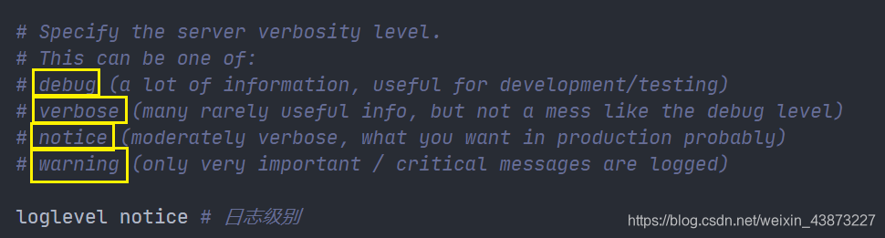
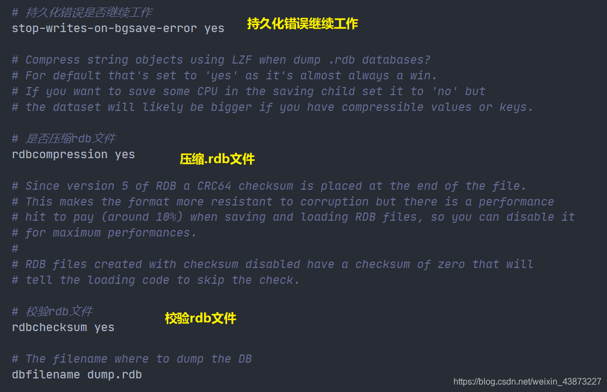
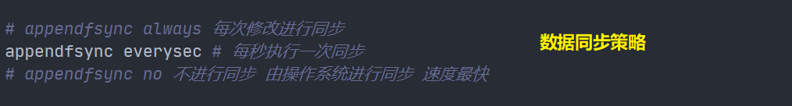
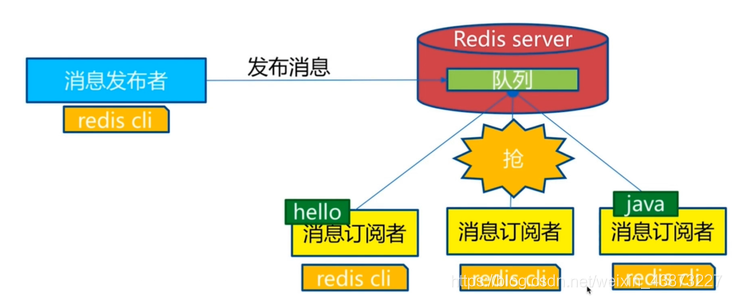
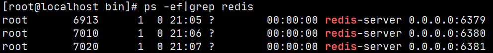
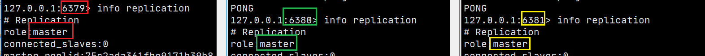
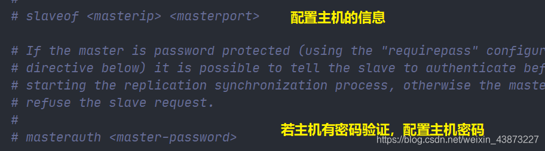

### 九、Redis.conf

1. 容量单位不区分大小写，G和GB有区别
   
2. 可以使用 include 组合多个配置问题


1. 网络配置


1. 日志输出级别



1. 日志输出文件


1. 持久化规则

   > 由于Redis是基于内存的数据库，需要将数据由内存持久化到文件中
   >
   > 持久化方式：
   >
   > - RDB
   > - AOF


1. RDB文件相关
   


1. 关于主从复制，稍后再提


1. Security模块中进行密码设置


1. 客户端连接相关

   ```txt
   maxclients 10000  最大客户端数量
   maxmemory <bytes> 最大内存限制
   maxmemory-policy noeviction # 内存达到限制值的处理策略
   ```

   redis 中的**默认**的过期策略是 **volatile-lru** 。

   **设置方式**

   ```
   config set maxmemory-policy volatile-lru 
   ```

   ##### **maxmemory-policy 六种方式**

   **1、volatile-lru：**只对设置了过期时间的key进行LRU（默认值）

   **2、allkeys-lru ：** 删除lru算法的key

   **3、volatile-random：**随机删除即将过期key

   **4、allkeys-random：**随机删除

   **5、volatile-ttl ：** 删除即将过期的

   **6、noeviction ：** 永不过期，返回错误

2. AOF相关部分


### 十、持久化——RDB

**RDB：Redis Databases**

#### 什么是RDB

在指定时间间隔后，将内存中的数据集快照写入数据库 ；在恢复时候，直接读取快照文件，进行数据的恢复 ；


默认情况下， Redis 将数据库快照保存在名字为 dump.rdb的二进制文件中。文件名可以在配置文件中进行自定义。

#### 工作原理

在进行 **`RDB`** 的时候，**`redis`** 的主线程是不会做 **`io`** 操作的，主线程会 **`fork`** 一个子线程来完成该操作；

1. Redis 调用forks。同时拥有父进程和子进程。
2. 子进程将数据集写入到一个临时 RDB 文件中。
3. 当子进程完成对新 RDB 文件的写入时，Redis 用新 RDB 文件替换原来的 RDB 文件，并删除旧的 RDB 文件。

这种工作方式使得 Redis 可以从写时复制（copy-on-write）机制中获益(因为是使用子进程进行写操作，而父进程依然可以接收来自客户端的请求。)


#### 触发机制

##### save

使用 `save` 命令，会立刻对当前内存中的数据进行持久化 ,但是会阻塞，也就是不接受其他操作了；

> 由于 `save` 命令是同步命令，会占用Redis的主进程。若Redis数据非常多时，`save`命令执行速度会非常慢，阻塞所有客户端的请求。


##### flushall命令

`flushall` 命令也会触发持久化 ；

##### 触发持久化规则

满足配置条件中的触发条件 ；

> 你可以通过配置文件对 Redis 进行设置， 让它在“ N 秒内数据集至少有 M 个改动”这一条件被满足时， 自动进行数据集保存操作。
>
> 


##### bgsave

`bgsave` 是异步进行，进行持久化的时候，`redis` 还可以将继续响应客户端请求 ；


1. 重新启动 `redis` ，也会触发，记进行加载持久化文件 ；

可以通过 `lastsave` 获取上一次 `save` 的时间 ；

**bgsave和save对比**

| 命令   | save               | bgsave                             |
| ------ | ------------------ | ---------------------------------- |
| IO类型 | 同步               | 异步                               |
| 阻塞？ | 是                 | 是（阻塞发生在fock()，通常非常快） |
| 复杂度 | O(n)               | O(n)                               |
| 优点   | 不会消耗额外的内存 | 不阻塞客户端命令                   |
| 缺点   | 阻塞客户端命令     | 需要fock子进程，消耗内存           |

#### 缺点

- 从子线程的工作方式，我们也可以看出，最后一次持久化操作以后的数据面临着丢失的风险；(如果子进程最后一次持久化操作失败，例如断电宕机，则导致整个持久化操作失败，临时文件不会覆盖原文件。)
- 耗时、耗性能。RDB 需要经常fork子进程来保存数据集到硬盘上，当数据集比较大的时候，fork的过程是非常耗时的，可能会导致Redis在一些毫秒级内不能响应客户端的请求。如果数据集巨大并且CPU性能不是很好的情况下，这种情况会持续1秒，AOF也需要fork，但是你可以调节重写日志文件的频率来提高数据集的耐久度。
- 不可控、丢失数据。如果你希望在redis意外停止工作（例如电源中断）的情况下丢失的数据最少的话，那么RDB不适合你。虽然你可以配置不同的save时间点(例如每隔5分钟并且对数据集有100个写的操作)，是Redis要完整的保存整个数据集是一个比较繁重的工作，你通常会每隔5分钟或者更久做一次完整的保存，万一在Redis意外宕机，你可能会丢失几分钟的数据。

#### 优点

- RDB是一个非常紧凑的文件，它保存了某个时间点得数据集，非常适用于数据集的备份，比如你可以在每个小时报保存一下过去24小时内的数据，同时每天保存过去30天的数据，这样即使出了问题你也可以根据需求恢复到不同版本的数据集。
- RDB是一个紧凑的单一文件，很方便传送到另一个远端数据中心或者亚马逊的S3（可能加密），非常适用于灾难恢复。
- RDB在保存RDB文件时父进程唯一需要做的就是fork出一个子进程，接下来的工作全部由子进程来做，父进程不需要再做其他IO操作，所以RDB持久化方式可以最大化redis的性能。
- 与AOF相比，在恢复大的数据集的时候，RDB方式会更快一些。

### 十一、持久化——AOF

#### 什么是AOF

快照功能（RDB）并不是非常耐久（durable）： 如果 Redis 因为某些原因而造成故障停机， 那么服务器将丢失最近写入、以及未保存到快照中的那些数据。 从 1.1 版本开始， Redis 增加了一种完全耐久的持久化方式： AOF 持久化。

如果要使用AOF，需要修改配置文件：


`appendonly no yes`则表示启用AOF

#### 工作原理

每当 Redis 执行一个改变数据集的命令时（比如 SET）， 这个命令就会被追加到 AOF 文件的末尾。这样的话， 当 Redis 重新启时， 程序就可以通过重新执行 AOF 文件中的命令来达到重建数据集的目的。

**创建**


**恢复**


#### AOF持久化的三种策略



##### always

每次有新命令追加到 AOF 文件时就执行一次同步，安全但是速度慢


##### everysec(default)

这种 fsync 策略可以兼顾速度和安全性，可能丢失一秒的数据。


##### no

将数据交给操作系统来处理，由操作系统来决定什么时候同步数据。更快，但是不安全。


**三者对比**

| 命令     | 优点                             | 缺点                              |
| -------- | -------------------------------- | --------------------------------- |
| always   | 不丢失数据                       | IO开销大，一般SATA磁盘只有几百TPS |
| everysec | 每秒进行与fsync，最多丢失1秒数据 | 可能丢失1秒数据                   |
| no       | 不用管                           | 不可控                            |

#### aof文件修复

当aof被人为破坏，redis就无法完成启动，可以通过官方提供的 redis-check-aof工具对aof文件进行修复,当然数据可能发生部分丢失。

```she
redis-check-aof --fix appendonly.aof
```

#### AOF重写

因为 AOF 的运作方式是不断地将命令追加到文件的末尾， 所以随着写入命令的不断增加， AOF 文件的体积也会变得越来越大。

举个例子， 如果你对一个计数器调用了 100 次 INCR ， 那么仅仅是为了保存这个计数器的当前值， AOF 文件就需要使用 100 条记录（entry）。然而在实际上， 只使用一条 SET 命令已经足以保存计数器的当前值了， 其余 99 条记录实际上都是多余的。

为了处理这种情况， Redis 支持一种有趣的特性： 可以在不打断服务客户端的情况下， 对 AOF 文件进行重建（rebuild）。执行 bgrewriteaof 命令， Redis 将生成一个新的 AOF 文件， 这个文件包含重建当前数据集所需的最少命令。

Redis 2.2 需要自己手动执行 bgrewriteaof 命令； Redis 2.4+ 则可以**通过配置自动触发 AOF 重写。**

##### AOF重写的作用

- 减少磁盘占用量
- 加速数据恢复

##### AOF重写的实现方式

- `bgrewriteaof` 命令

  用于异步执行一个 AOF（AppendOnly File）文件重写操作。重写会创建一个当前AOF文件的体积优化版本。
  即使 bgrewriteaof 执行失败，也不会有任何数据丢失，因为旧的AOF文件在 bgrewriteaof 成功之前不会被修改。

  AOF 重写由 Redis 自行触发，bgrewriteaof 仅仅用于手动触发重写操作。

##### AOF重写的配置

| 配置名                      | 含义                          |
| --------------------------- | ----------------------------- |
| auto-aof-rewrite-min-size   | 触发AOF文件执行重写的最小尺寸 |
| auto-aof-rewrite-percentage | 触发AOF文件执行重写的增长率   |

| 统计名           | 含义                                  |
| ---------------- | ------------------------------------- |
| aof_current_size | AOF文件当前尺寸（字节）               |
| aof_base_size    | AOF文件上次启动和重写时的尺寸（字节） |

触发自动重写有两个条件：

- 当前AOF文件大小超过触发重写的最小大小。

  即*aof_current_size > auto-aof-rewrite-min-size*

- 当前文件大小增长率超过触发重写的增长率

  即** ( a o f _ c u r r e n t _ s i z e − a o f _ b a s e _ s i z e ) a o f _ b a s e _ s i z e > a u t o − a o f − r e w r i t e − p e r c e n t a g e {(aof\_current\_size-aof\_base\_size) \over aof\_base\_size}>auto-aof-rewrite-percentage aof_base_size(aof_current_size−aof_base_size)>auto−aof−rewrite−percentage**

------

例如：

假设 Redis 的配置项为：

```
auto-aof-rewrite-min-size 64mb
auto-aof-rewrite-percentage 100
```

当

1. AOF文件的体积大于64Mb
2. 并且AOF文件的体积比上一次重写之久的体积大了至少一倍（100%）时

Redis将执行 bgrewriteaof 命令进行重写。

------

##### 相关配置

```shell
# 开启AOF持久化方式
appendonly yes

# AOF持久化文件名
appendfilename "appendonly.aof"

# 每秒把缓冲区的数据同步到磁盘
appendfsync everysec

# 数据持久化文件存储目录
dir /var/lib/redis

# 是否在执行重写时不同步数据到AOF文件 默认为no
# 这里的 yes，就是执行重写时不同步数据到AOF文件
no-appendfsync-on-rewrite yes

# 触发AOF文件执行重写的最小尺寸
auto-aof-rewrite-min-size 64mb

# 触发AOF文件执行重写的增长率
auto-aof-rewrite-percentage 100
```

##### 重写过程


1. 执行bgrewriteaof命令
2. 父进程fork出子进程
3. 将命令写入缓存，然后由缓存写入旧aof文件
4. 子进程创建新的aof临时文件
5. 1. 子进程通知父进程开始重写aof文件
   2. 将命令从缓存写入新aof文件
   3. 重写完成使用新aof文件替换旧的aof文件。

#### AOF的缺点

1. 对于相同的数据集来说，AOF 文件的体积通常要大于 RDB 文件的体积。
2. 根据所使用的 fsync 策略，AOF 的速度可能会慢于 RDB 。 在一般情况下， 每秒 fsync 的性能依然非常高， 而关闭 fsync 可以让 AOF 的速度和 RDB 一样快， 即使在高负荷之下也是如此。
3. 数据量较大时，恢复较慢

#### AOF优点

1. 使用AOF 会让你的Redis更加耐久: 你可以使用不同的fsync策略：无fsync，每秒fsync，每次写的时候fsync。使用默认的每秒fsync策略，Redis的性能依然很好(fsync是由后台线程进行处理的，主线程会尽力处理客户端请求)，一旦出现故障，你最多丢失1秒的数据。
2. AOF文件是一个只进行追加的日志文件，所以不需要写入seek，即使由于某些原因(磁盘空间已满，写的过程中宕机等等)未执行完整的写入命令，你也也可使用redis-check-aof工具修复这些问题。
3. Redis 可以在 AOF 文件体积变得过大时，自动地在后台对 AOF 进行重写： 重写后的新 AOF 文件包含了恢复当前数据集所需的最小命令集合。 整个重写操作是绝对安全的，因为 Redis 在创建新 AOF 文件的过程中，会继续将命令追加到现有的 AOF 文件里面，即使重写过程中发生停机，现有的 AOF 文件也不会丢失。 而一旦新 AOF 文件创建完毕，Redis 就会从旧 AOF 文件切换到新 AOF 文件，并开始对新 AOF 文件进行追加操作。
4. AOF 文件有序地保存了对数据库执行的所有写入操作， 这些写入操作以 Redis 协议的格式保存， 因此AOF 文件的内容非常容易被人读懂， 对文件进行分析（parse）也很轻松。 导出（export） AOF 文件也非常简单： 举个例子， 如果你不小心执行了 FLUSHALL 命令， 但只要 AOF 文件未被重写， 那么只要停止服务器， 移除 AOF 文件末尾的 FLUSHALL 命令， 并重启 Redis ， 就可以将数据集恢复到 FLUSHALL 执行之前的状态。

### 十二、RDB 和 AOF 选择

#### RDB 和 AOF 对比

|            | RDB    | AOF          |
| ---------- | ------ | ------------ |
| 启动优先级 | 低     | 高           |
| 体积       | 小     | 大           |
| 恢复速度   | 快     | 慢           |
| 数据安全性 | 丢数据 | 根据策略决定 |

#### 如何选择使用哪种持久化方式？

一般来说， 如果想达到足以媲美 PostgreSQL 的数据安全性， 你应该同时使用两种持久化功能。

如果你非常关心你的数据， 但仍然可以承受数分钟以内的数据丢失， 那么你可以只使用 RDB 持久化。

有很多用户都只使用 AOF 持久化， 但并不推荐这种方式： 因为定时生成 RDB 快照（snapshot）非常便于进行数据库备份， 并且 RDB 恢复数据集的速度也要比 AOF 恢复的速度要快。

### 十三、Redis发布与订阅

Redis 发布订阅(pub/sub)是一种消息通信模式：发送者(pub)发送消息，订阅者(sub)接收消息。



下图展示了频道 channel1 ， 以及订阅这个频道的三个客户端 —— client2 、 client5 和 client1 之间的关系：


当有新消息通过 PUBLISH 命令发送给频道 channel1 时， 这个消息就会被发送给订阅它的三个客户端：


#### 命令

| 命令                                     | 描述                               |
| ---------------------------------------- | ---------------------------------- |
| `PSUBSCRIBE pattern [pattern..]`         | 订阅一个或多个符合给定模式的频道。 |
| `PUNSUBSCRIBE pattern [pattern..]`       | 退订一个或多个符合给定模式的频道。 |
| `PUBSUB subcommand [argument[argument]]` | 查看订阅与发布系统状态。           |
| `PUBLISH channel message`                | 向指定频道发布消息                 |
| `SUBSCRIBE channel [channel..]`          | 订阅给定的一个或多个频道。         |
| `SUBSCRIBE channel [channel..]`          | 退订一个或多个频道                 |

#### 示例

```shell
------------订阅端----------------------
127.0.0.1:6379> SUBSCRIBE sakura # 订阅sakura频道
Reading messages... (press Ctrl-C to quit) # 等待接收消息
1) "subscribe" # 订阅成功的消息
2) "sakura"
3) (integer) 1
1) "message" # 接收到来自sakura频道的消息 "hello world"
2) "sakura"
3) "hello world"
1) "message" # 接收到来自sakura频道的消息 "hello i am sakura"
2) "sakura"
3) "hello i am sakura"

--------------消息发布端-------------------
127.0.0.1:6379> PUBLISH sakura "hello world" # 发布消息到sakura频道
(integer) 1
127.0.0.1:6379> PUBLISH sakura "hello i am sakura" # 发布消息
(integer) 1

-----------------查看活跃的频道------------
127.0.0.1:6379> PUBSUB channels
1) "sakura"
```

#### 原理

每个 Redis 服务器进程都维持着一个表示服务器状态的 redis.h/redisServer 结构， 结构的 pubsub_channels 属性是一个字典， 这个字典就用于保存订阅频道的信息，其中，字典的键为正在被订阅的频道， 而字典的值则是一个链表， 链表中保存了所有订阅这个频道的客户端。


客户端订阅，就被链接到对应频道的链表的尾部，退订则就是将客户端节点从链表中移除。

#### 缺点

1，如果一个客户端订阅了频道，但自己读取消息的速度却不够快的话，那么不断积压的消息会使redis输出缓冲区的体积变得越来越大，这可能使得redis本身的速度变慢，甚至直接崩溃。
2，这和数据传输可靠性有关，如果在订阅方断线，那么他将会丢失所有在短线期间发布者发布的消息。

#### 应用

1. 消息订阅：公众号订阅，微博关注等等（起始更多是使用消息队列来进行实现）
2. 多人在线聊天室。

### 十四、主从复制

#### 概念

主从复制，是指将一台Redis服务器的数据，复制到其他的Redis服务器。前者称为主节点（Master/Leader）,后者称为从节点（Slave/Follower），数据的复制是单向的！只能由主节点复制到从节点（主节点以写为主、从节点以读为主）。

默认情况下，每台Redis服务器都是主节点，一个主节点可以有0个或者多个从节点，但每个从节点只能由一个主节点。

#### 作用

1. 数据冗余：主从复制实现了数据的热备份，是持久化之外的一种数据冗余的方式。
2. 故障恢复：当主节点故障时，从节点可以暂时替代主节点提供服务，是一种服务冗余的方式
3. 负载均衡：在主从复制的基础上，配合读写分离，由主节点进行写操作，从节点进行读操作，分担服务器的负载；尤其是在多读少写的场景下，通过多个从节点分担负载，提高并发量。
4. 高可用基石：主从复制还是哨兵和集群能够实施的基础。

#### 为什么使用集群

1. 单台服务器难以负载大量的请求
2. 单台服务器故障率高，系统崩坏概率大
3. 单台服务器内存容量有限。

#### 环境配置

我们在讲解配置文件的时候，注意到有一个`replication`模块 (见Redis.conf中第8条)

查看当前库的信息：`info replication`

```shell
127.0.0.1:6379> info replication
# Replication
role:master # 角色
connected_slaves:0 # 从机数量
master_replid:3b54deef5b7b7b7f7dd8acefa23be48879b4fcff
master_replid2:0000000000000000000000000000000000000000
master_repl_offset:0
second_repl_offset:-1
repl_backlog_active:0
repl_backlog_size:1048576
repl_backlog_first_byte_offset:0
repl_backlog_histlen:0
```

既然需要启动多个服务，就需要多个配置文件。每个配置文件对应修改以下信息：

- 端口号
- pid文件名
- 日志文件名
- rdb文件名

启动单机多服务集群：



#### 一主二从配置

此时每个redis都是主节点，此时我们只需配置我们想要的从机即可。



使用`SLAVEOF host port`就可以为从机配置主机了。


然后主机上也能看到从机的状态：


我们这里是使用命令搭建，是暂时的，真实开发中应该在从机的配置文件中进行配置。



#### 使用规则

1. 从机只能读，不能写，主机可读可写但是多用于写。

   ```shell
   127.0.0.1:6381> set name sakura # 从机6381写入失败
   (error) READONLY You can't write against a read only replica.
   
   127.0.0.1:6380> set name sakura # 从机6380写入失败
   (error) READONLY You can't write against a read only replica.
   
   127.0.0.1:6379> set name sakura
   OK
   127.0.0.1:6379> get name
   "sakura"
   ```

2. 当主机断电宕机后，默认情况下从机的角色不会发生变化 ，集群中只是失去了写操作，当主机恢复以后，又会连接上从机恢复原状。

3. 当从机断电宕机后，若不是使用配置文件配置的从机，再次启动后作为主机是无法获取之前主机的数据的，若此时重新配置称为从机，又可以获取到主机的所有数据。这里就要提到一个同步原理。

4. 第二条中提到，默认情况下，主机故障后，不会出现新的主机，有两种方式可以产生新的主机：

   - 从机手动执行命令`slaveof no one`,这样执行以后从机会独立出来成为一个主机
   - 使用哨兵模式（自动选举）

#### 同步复制原理

##### 全量同步

Redis全量复制一般发生在Slave初始化阶段，这时Slave需要将Master上的所有数据都复制一份。

具体步骤如下：

- 从服务器连接主服务器，发送SYNC命令；
- 主服务器接收到SYNC命名后，开始执行BGSAVE命令生成RDB文件并使用缓冲区记录此后执行的所有写命令；
- 主服务器BGSAVE执行完后，向所有从服务器发送快照文件，并在发送期间继续记录被执行的写命令；
- 从服务器收到快照文件后丢弃所有旧数据，载入收到的快照；
- 主服务器快照发送完毕后开始向从服务器发送缓冲区中的写命令；
- 从服务器完成对快照的载入，开始接收命令请求，并执行来自主服务器缓冲区的写命令；


##### 增量同步

Redis增量复制是指Slave初始化后开始正常工作时，主服务器发生的写操作同步到从服务器的过程。

增量复制的过程主要：

- 主服务器每执行一个写命令就会向从服务器发送相同的写命令，从服务器接收并执行收到的写命令。

### 十五、哨兵模式

更多信息参考博客：https://www.jianshu.com/p/06ab9daf921d

**主从切换技术的方法是：当主服务器宕机后，需要手动把一台从服务器切换为主服务器，这就需要人工干预，费事费力，还会造成一段时间内服务不可用。\**这不是一种推荐的方式，更多时候，我们优先考虑\**哨兵模式**。

单机单个哨兵


哨兵的作用：

- 通过发送命令，让Redis服务器返回监控其运行状态，包括主服务器和从服务器。
- 当哨兵监测到master宕机，会自动将slave切换成master，然后通过**发布订阅模式**通知其他的从服务器，修改配置文件，让它们切换主机。

多哨兵模式


哨兵的核心配置

```
sentinel monitor mymaster 127.0.0.1 6379 1
```

- 数字1表示 ：当一个哨兵主观认为主机断开，就可以客观认为主机故障，然后开始选举新的主机。

完整的哨兵模式配置文件 sentinel.conf

```shell
# Example sentinel.conf
 
# 哨兵sentinel实例运行的端口 默认26379
port 26379
 
# 哨兵sentinel的工作目录
dir /tmp
 
# 哨兵sentinel监控的redis主节点的 ip port 
# master-name  可以自己命名的主节点名字 只能由字母A-z、数字0-9 、这三个字符".-_"组成。
# quorum 当这些quorum个数sentinel哨兵认为master主节点失联 那么这时 客观上认为主节点失联了
# sentinel monitor <master-name> <ip> <redis-port> <quorum>
sentinel monitor mymaster 127.0.0.1 6379 1
 
# 当在Redis实例中开启了requirepass foobared 授权密码 这样所有连接Redis实例的客户端都要提供密码
# 设置哨兵sentinel 连接主从的密码 注意必须为主从设置一样的验证密码
# sentinel auth-pass <master-name> <password>
sentinel auth-pass mymaster MySUPER--secret-0123passw0rd
 
 
# 指定多少毫秒之后 主节点没有应答哨兵sentinel 此时 哨兵主观上认为主节点下线 默认30秒
# sentinel down-after-milliseconds <master-name> <milliseconds>
sentinel down-after-milliseconds mymaster 30000
 
# 这个配置项指定了在发生failover主备切换时最多可以有多少个slave同时对新的master进行 同步，
这个数字越小，完成failover所需的时间就越长，
但是如果这个数字越大，就意味着越 多的slave因为replication而不可用。
可以通过将这个值设为 1 来保证每次只有一个slave 处于不能处理命令请求的状态。
# sentinel parallel-syncs <master-name> <numslaves>
sentinel parallel-syncs mymaster 1
 
 
 
# 故障转移的超时时间 failover-timeout 可以用在以下这些方面： 
#1. 同一个sentinel对同一个master两次failover之间的间隔时间。
#2. 当一个slave从一个错误的master那里同步数据开始计算时间。直到slave被纠正为向正确的master那里同步数据时。
#3.当想要取消一个正在进行的failover所需要的时间。  
#4.当进行failover时，配置所有slaves指向新的master所需的最大时间。不过，即使过了这个超时，slaves依然会被正确配置为指向master，但是就不按parallel-syncs所配置的规则来了
# 默认三分钟
# sentinel failover-timeout <master-name> <milliseconds>
sentinel failover-timeout mymaster 180000
 
# SCRIPTS EXECUTION
 
#配置当某一事件发生时所需要执行的脚本，可以通过脚本来通知管理员，例如当系统运行不正常时发邮件通知相关人员。
#对于脚本的运行结果有以下规则：
#若脚本执行后返回1，那么该脚本稍后将会被再次执行，重复次数目前默认为10
#若脚本执行后返回2，或者比2更高的一个返回值，脚本将不会重复执行。
#如果脚本在执行过程中由于收到系统中断信号被终止了，则同返回值为1时的行为相同。
#一个脚本的最大执行时间为60s，如果超过这个时间，脚本将会被一个SIGKILL信号终止，之后重新执行。
 
#通知型脚本:当sentinel有任何警告级别的事件发生时（比如说redis实例的主观失效和客观失效等等），将会去调用这个脚本，
#这时这个脚本应该通过邮件，SMS等方式去通知系统管理员关于系统不正常运行的信息。调用该脚本时，将传给脚本两个参数，
#一个是事件的类型，
#一个是事件的描述。
#如果sentinel.conf配置文件中配置了这个脚本路径，那么必须保证这个脚本存在于这个路径，并且是可执行的，否则sentinel无法正常启动成功。
#通知脚本
# sentinel notification-script <master-name> <script-path>
  sentinel notification-script mymaster /var/redis/notify.sh
 
# 客户端重新配置主节点参数脚本
# 当一个master由于failover而发生改变时，这个脚本将会被调用，通知相关的客户端关于master地址已经发生改变的信息。
# 以下参数将会在调用脚本时传给脚本:
# <master-name> <role> <state> <from-ip> <from-port> <to-ip> <to-port>
# 目前<state>总是“failover”,
# <role>是“leader”或者“observer”中的一个。 
# 参数 from-ip, from-port, to-ip, to-port是用来和旧的master和新的master(即旧的slave)通信的
# 这个脚本应该是通用的，能被多次调用，不是针对性的。
# sentinel client-reconfig-script <master-name> <script-path>
sentinel client-reconfig-script mymaster /var/redis/reconfig.sh
redis-sentinel xxx/sentinel.conf
```

成功启动哨兵模式


此时哨兵监视着我们的主机6379，当我们断开主机后：


### 十六、缓存穿透与雪崩

#### 缓存穿透

##### 概念

在默认情况下，用户请求数据时，会先在缓存(Redis)中查找，若没找到即缓存未命中，再在数据库中进行查找，数量少可能问题不大，可是一旦大量的请求数据（例如秒杀场景）缓存都没有命中的话，就会全部转移到数据库上，造成数据库极大的压力，就有可能导致数据库崩溃。网络安全中也有人恶意使用这种手段进行攻击被称为洪水攻击。

##### 解决方案

1. 布隆过滤器

   对所有可能查询的参数以Hash的形式存储，以便快速确定是否存在这个值，在控制层先进行拦截校验，校验不通过直接打回，减轻了存储系统的压力。


1. 缓存空对象

   一次请求若在缓存和数据库中都没找到，就在缓存中方一个空对象用于处理后续这个请求。


这样做有一个缺陷：存储空对象也需要空间，大量的空对象会耗费一定的空间，存储效率并不高。解决这个缺陷的方式就是设置较短过期时间

即使对空值设置了过期时间，还是会存在缓存层和存储层的数据会有一段时间窗口的不一致，这对于需要保持一致性的业务会有影响。

#### 缓存击穿

##### 概念

相较于缓存穿透，缓存击穿的目的性更强，一个存在的key，在缓存过期的一刻，同时有大量的请求，这些请求都会击穿到DB，造成瞬时DB请求量大、压力骤增。这就是缓存被击穿，只是针对其中某个key的缓存不可用而导致击穿，但是其他的key依然可以使用缓存响应。

比如热搜排行上，一个热点新闻被同时大量访问就可能导致缓存击穿。

##### 解决方案

1. 设置热点数据永不过期

   这样就不会出现热点数据过期的情况，但是当Redis内存空间满的时候也会清理部分数据，而且此种方案会占用空间，一旦热点数据多了起来，就会占用部分空间。

2. 加互斥锁(分布式锁)

   在访问key之前，采用SETNX（set if not exists）来设置另一个短期key来锁住当前key的访问，访问结束再删除该短期key。保证同时刻只有一个线程访问。这样对锁的要求就十分高。

#### 缓存雪崩

##### 概念

大量的key设置了相同的过期时间，导致在缓存在同一时刻全部失效，造成瞬时DB请求量大、压力骤增，引起雪崩。


##### 解决方案

- redis高可用

  这个思想的含义是，既然redis有可能挂掉，那我多增设几台redis，这样一台挂掉之后其他的还可以继续工作，其实就是搭建的集群

- 限流降级

  这个解决方案的思想是，在缓存失效后，通过加锁或者队列来控制读数据库写缓存的线程数量。比如对某个key只允许一个线程查询数据和写缓存，其他线程等待。

- 数据预热

  数据加热的含义就是在正式部署之前，我先把可能的数据先预先访问一遍，这样部分可能大量访问的数据就会加载到缓存中。在即将发生大并发访问前手动触发加载缓存不同的key，设置不同的过期时间，让缓存失效的时间点尽量均匀。