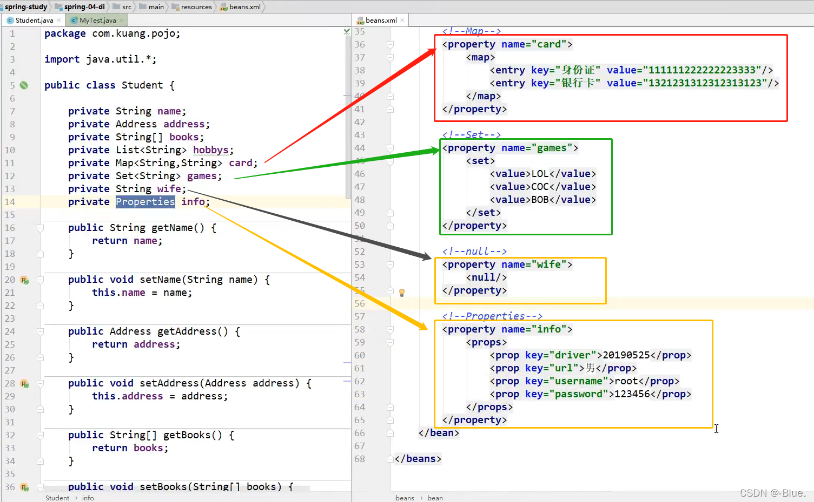

##  1、Spring

### 1.1、简介

- Spring:春天—>给软件行业带来了春天！
- 2002,首次推出了Spring框架的雏形：interface21框架！
- Spring框架即以interface21框架为基础，经过重新设计，并不断丰富其内涵，于2004年3月24日发布了1.0正式版。
- Rod Johnson,Spring Framework创始人，著名作者。很难想象Rod Johnson的学历，真的让好多人大吃一惊，他是悉屋然学的博士，然而他的专业不是计算机，而是音乐学。
- spring:理念：使现有的技术更加容易使用，本身是一个大杂烩，整合了现有的技术框架！

SSH：Struct2+Spring+Hibernate！
SSM： SpringMvc + Spring + Mybatis!

官网：[Spring Framework Documentation](https://docs.spring.io/spring-framework/docs/current/reference/html/)

网址：[Index of /spring-framework/docs/4.3.9.RELEASE/spring-framework-reference](https://docs.spring.io/spring-framework/docs/4.3.9.RELEASE/spring-framework-reference/)

官网下载地址：[repo.spring.io](https://repo.spring.io/ui/native/release/org/springframework/spring)

Github：[spring-projects/spring-framework: Spring Framework (github.com)](https://github.com/spring-projects/spring-framework)


导包：

[Maven Repository: org.springframework » spring-webmvc (mvnrepository.com)](https://mvnrepository.com/artifact/org.springframework/spring-webmvc)

```xml
<!-- https://mvnrepository.com/artifact/org.springframework/spring-webmvc -->
<dependency>
    <groupId>org.springframework</groupId>
    <artifactId>spring-webmvc</artifactId>
    <version>5.3.16</version>
</dependency>
<dependency>
    <groupId>org.springframework</groupId>
    <artifactId>spring-jdbc</artifactId>
    <version>5.3.16</version>
</dependency>
```

### 1.2、优点

- Spring是一个开源的免费的框架（容器）！
- Spring是一个轻量级的、r非入侵式的框架！
- 控制反转(IOC)，面向切面编程(AOP)！
- 支持事务的处理，对框架整合的支持！

总结一句话：Spring就是一个轻量级的控制反转(IOC)和面向切面编程（AOP）的框架！

### 1.3、组成

[Spring—七大核心模块 - 小白知浅 - 博客园 (cnblogs.com)](https://www.cnblogs.com/xiaobaizhiqian/p/7616453.html)


**核心容器（Spring Core）**

核心容器提供Spring框架的基本功能。Spring以bean的方式组织和管理Java应用中的各个组件及其关系。Spring使用BeanFactory来产生和管理Bean，它是工厂模式的实现。BeanFactory使用控制反转(IoC)模式将应用的配置和依赖性规范与实际的应用程序代码分开。

**应用上下文（Spring Context）**

Spring上下文是一个配置文件，向Spring框架提供上下文信息。Spring上下文包括企业服务，如JNDI、EJB、电子邮件、国际化、校验和调度功能。

**Spring面向切面编程（Spring AOP）**

通过配置管理特性，Spring AOP 模块直接将面向方面的编程功能集成到了 Spring框架中。所以，可以很容易地使 Spring框架管理的任何对象支持 AOP。Spring AOP 模块为基于 Spring 的应用程序中的对象提供了事务管理服务。通过使用 Spring AOP，不用依赖 EJB 组件，就可以将声明性事务管理集成到应用程序中。

**JDBC和DAO模块（Spring DAO）**

JDBC、DAO的抽象层提供了有意义的异常层次结构，可用该结构来管理异常处理，和不同数据库供应商所抛出的错误信息。异常层次结构简化了错误处理，并且极大的降低了需要编写的代码数量，比如打开和关闭链接。

**对象实体映射（Spring ORM）**

Spring框架插入了若干个ORM框架，从而提供了ORM对象的关系工具，其中包括了Hibernate、JDO和 IBatis SQL Map等，所有这些都遵从Spring的通用事物和DAO异常层次结构。

**Web模块（Spring Web）**

Web上下文模块建立在应用程序上下文模块之上，为基于web的应用程序提供了上下文。所以Spring框架支持与Struts集成，web模块还简化了处理多部分请求以及将请求参数绑定到域对象的工作。

**MVC模块（Spring Web MVC）**

MVC框架是一个全功能的构建Web应用程序的MVC实现。通过策略接口，MVC框架变成为高度可配置的。MVC容纳了大量视图技术，其中包括JSP、POI等，模型来有JavaBean来构成，存放于m当中，而视图是一个街口，负责实现模型，控制器表示逻辑代码，由c的事情。Spring框架的功能可以用在任何J2EE服务器当中，大多数功能也适用于不受管理的环境。Spring的核心要点就是支持不绑定到特定J2EE服务的可重用业务和数据的访问的对象，毫无疑问这样的对象可以在不同的J2EE环境，独立应用程序和测试环境之间重用。

### 1.4、拓展

在Spring的官网有这个介绍：现代化的Java开发！说白就是基于Spring的开发！

### 1.5、常用依赖

```xml
<dependencies>
        <dependency>
            <groupId>org.springframework</groupId>
            <artifactId>spring-webmvc</artifactId>
            <version>5.3.16</version>
        </dependency>
        <dependency>
            <groupId>org.springframework</groupId>
            <artifactId>spring-jdbc</artifactId>
            <version>6.1.11</version>
        </dependency>
    </dependencies>
```

**SpringBoot**

- 一个快速开发的脚手架。
- 基于SpringBoot可以快速的开发单个微服务。
- 约定大于配置！

**SpringCloud**

- SpringCloud是基于SpringBoots实现的。

因为现在大多数公司都在使用SpringBooti进行快速开发，学习SpringBoot的前提，需要完全掌握Spring及SpringMVC!

**弊端：发展了太久之后，违背了原来的理念！配置十分繁琐，人称：“配置地狱！”**

## 2、IOC理论推导

1.UserDao接口
2.UserDaolmpl实现类
3.UserService业务接☐
4.UserServicelmpl业务实现类

加配置

![[外链图片转存失败,源站可能有防盗链机制,建议将图片保存下来直接上传(./../../../../学习文件/自学/Java后端/04-Spring/08-01-Spring5-狂神/assets/08-01-Spring5-狂神/watermark,type_d3F5LXplbmhlaQ,shadow_50,text_Q1NETiBALUJsdWUu,size_20,color_FFFFFF,t_70,g_se,x_16-1721047329179-9.png)(C:\Users\dlmu\AppData\Roaming\Typora\typora-user-images\image-20220327094356877.png)]](./assets/08-01-Spring5-狂神/watermark,type_d3F5LXplbmhlaQ,shadow_50,text_Q1NETiBALUJsdWUu,size_20,color_FFFFFF,t_70,g_se,x_16-1721047329179-9.png)

接口

UserDao.java

![[外链图片转存失败,源站可能有防盗链机制,建议将图片保存下来直接上传(./../../../../学习文件/自学/Java后端/04-Spring/08-01-Spring5-狂神/assets/08-01-Spring5-狂神/watermark,type_d3F5LXplbmhlaQ,shadow_50,text_Q1NETiBALUJsdWUu,size_20,color_FFFFFF,t_70,g_se,x_16-1721047329179-10.png)(C:\Users\dlmu\AppData\Roaming\Typora\typora-user-images\image-20220327095239943.png)]](./assets/08-01-Spring5-狂神/watermark,type_d3F5LXplbmhlaQ,shadow_50,text_Q1NETiBALUJsdWUu,size_20,color_FFFFFF,t_70,g_se,x_16-1721047329179-10.png)

```java
package com.blue.dao;

public interface UserDao {
    void getUser();
}
```

UserDaoImpl.java

![[外链图片转存失败,源站可能有防盗链机制,建议将图片保存下来直接上传(./../../../../学习文件/自学/Java后端/04-Spring/08-01-Spring5-狂神/assets/08-01-Spring5-狂神/watermark,type_d3F5LXplbmhlaQ,shadow_50,text_Q1NETiBALUJsdWUu,size_20,color_FFFFFF,t_70,g_se,x_16-1721047329179-11.png)(C:\Users\dlmu\AppData\Roaming\Typora\typora-user-images\image-20220327094818408.png)]](./assets/08-01-Spring5-狂神/watermark,type_d3F5LXplbmhlaQ,shadow_50,text_Q1NETiBALUJsdWUu,size_20,color_FFFFFF,t_70,g_se,x_16-1721047329179-11.png)

```java
package com.blue.dao;

public class UserDaoImpl implements UserDao{
    @Override
    public void getUser() {
        System.out.println("默认获取用户的数据");
    }
}
```

业务层

UserService.java

![[外链图片转存失败,源站可能有防盗链机制,建议将图片保存下来直接上传(./../../../../学习文件/自学/Java后端/04-Spring/08-01-Spring5-狂神/assets/08-01-Spring5-狂神/watermark,type_d3F5LXplbmhlaQ,shadow_50,text_Q1NETiBALUJsdWUu,size_20,color_FFFFFF,t_70,g_se,x_16-1721047329179-12.png)(C:\Users\dlmu\AppData\Roaming\Typora\typora-user-images\image-20220327094844927.png)]](./assets/08-01-Spring5-狂神/watermark,type_d3F5LXplbmhlaQ,shadow_50,text_Q1NETiBALUJsdWUu,size_20,color_FFFFFF,t_70,g_se,x_16-1721047329179-12.png)

```java
package com.blue.service;

public interface UserService {
    void getUser();
}
```

UserServiceImpl.java

![[外链图片转存失败,源站可能有防盗链机制,建议将图片保存下来直接上传(./../../../../学习文件/自学/Java后端/04-Spring/08-01-Spring5-狂神/assets/08-01-Spring5-狂神/watermark,type_d3F5LXplbmhlaQ,shadow_50,text_Q1NETiBALUJsdWUu,size_20,color_FFFFFF,t_70,g_se,x_16-1721047329179-13.png)(C:\Users\dlmu\AppData\Roaming\Typora\typora-user-images\image-20220327095007855.png)]](./assets/08-01-Spring5-狂神/watermark,type_d3F5LXplbmhlaQ,shadow_50,text_Q1NETiBALUJsdWUu,size_20,color_FFFFFF,t_70,g_se,x_16-1721047329179-13.png)

```java
package com.blue.service;

import com.blue.dao.UserDao;
import com.blue.dao.UserDaoImpl;

public class UserServiceImpl implements UserService{

    private UserDao userDao = new UserDaoImpl();

    @Override
    public void getUser() {
        userDao.getUser();
    }
}
```

MyTest.java

![[外链图片转存失败,源站可能有防盗链机制,建议将图片保存下来直接上传(./../../../../学习文件/自学/Java后端/04-Spring/08-01-Spring5-狂神/assets/08-01-Spring5-狂神/watermark,type_d3F5LXplbmhlaQ,shadow_50,text_Q1NETiBALUJsdWUu,size_20,color_FFFFFF,t_70,g_se,x_16-1721047329180-14.png)(C:\Users\dlmu\AppData\Roaming\Typora\typora-user-images\image-20220327095129170.png)]](./assets/08-01-Spring5-狂神/watermark,type_d3F5LXplbmhlaQ,shadow_50,text_Q1NETiBALUJsdWUu,size_20,color_FFFFFF,t_70,g_se,x_16-1721047329180-14.png)

```java
package com.blue.dao;

import com.blue.service.UserService;
import com.blue.service.UserServiceImpl;

public class MyTest {
    public static void main(String[] args) {

        ///用户实际调用的是业务层，dao层他们不需要接触！
        UserService userService = new UserServiceImpl();

        userService.getUser();

    }
}
```

要获取其他业务的数据，如下：

UserDaoMysqlImpl.java

![[外链图片转存失败,源站可能有防盗链机制,建议将图片保存下来直接上传(./../../../../学习文件/自学/Java后端/04-Spring/08-01-Spring5-狂神/assets/08-01-Spring5-狂神/watermark,type_d3F5LXplbmhlaQ,shadow_50,text_Q1NETiBALUJsdWUu,size_20,color_FFFFFF,t_70,g_se,x_16-1721047329180-15.png)(C:\Users\dlmu\AppData\Roaming\Typora\typora-user-images\image-20220327095406022.png)]](./assets/08-01-Spring5-狂神/watermark,type_d3F5LXplbmhlaQ,shadow_50,text_Q1NETiBALUJsdWUu,size_20,color_FFFFFF,t_70,g_se,x_16-1721047329180-15.png)

```java
package com.blue.dao;

public class UserDaoMysqlImpl implements UserDao{
    @Override
    public void getUser() {
        System.out.println("Mysql获取用户数据");
    }
}
```

则需要更改如下地方：

这动了源码，如果代码很长，则会复杂

![[外链图片转存失败,源站可能有防盗链机制,建议将图片保存下来直接上传(./../../../../学习文件/自学/Java后端/04-Spring/08-01-Spring5-狂神/assets/08-01-Spring5-狂神/watermark,type_d3F5LXplbmhlaQ,shadow_50,text_Q1NETiBALUJsdWUu,size_20,color_FFFFFF,t_70,g_se,x_16-1721047329180-16.png)(C:\Users\dlmu\AppData\Roaming\Typora\typora-user-images\image-20220327103035924.png)]](./assets/08-01-Spring5-狂神/watermark,type_d3F5LXplbmhlaQ,shadow_50,text_Q1NETiBALUJsdWUu,size_20,color_FFFFFF,t_70,g_se,x_16-1721047329180-16.png)

![[外链图片转存失败,源站可能有防盗链机制,建议将图片保存下来直接上传(./../../../../学习文件/自学/Java后端/04-Spring/08-01-Spring5-狂神/assets/08-01-Spring5-狂神/c3ea7ea1d8fd4c189f989f9d4b9be7a6.png)(C:\Users\dlmu\AppData\Roaming\Typora\typora-user-images\image-20220327103201548.png)]](./assets/08-01-Spring5-狂神/c3ea7ea1d8fd4c189f989f9d4b9be7a6.png)

在我们之前的业务中，用户的需求可能会影响我们原来的代码，我们需要根据用户的需求去修改原代码！

我们使用一个Set接口实现.已经发生了革命性的变化！

- 之前，程序是主动创建对象！控制权在程序猿手上！
- 使用了set注入后，程序不再具有主动性，而是变成了被动的接受对象！

UserServiceImpl.java

![[外链图片转存失败,源站可能有防盗链机制,建议将图片保存下来直接上传(./../../../../学习文件/自学/Java后端/04-Spring/08-01-Spring5-狂神/assets/08-01-Spring5-狂神/watermark,type_d3F5LXplbmhlaQ,shadow_50,text_Q1NETiBALUJsdWUu,size_20,color_FFFFFF,t_70,g_se,x_16-1721047329180-17.png)(C:\Users\dlmu\AppData\Roaming\Typora\typora-user-images\image-20220327095941814.png)]](./assets/08-01-Spring5-狂神/watermark,type_d3F5LXplbmhlaQ,shadow_50,text_Q1NETiBALUJsdWUu,size_20,color_FFFFFF,t_70,g_se,x_16-1721047329180-17.png)

```java
package com.blue.service;

import com.blue.dao.UserDao;
import com.blue.dao.UserDaoImpl;
import com.blue.dao.UserDaoMysqlImpl;

public class UserServiceImpl implements UserService{

    private UserDao userDao;

    //利用set进行动态实现值的注入
    public void setUserDao(UserDao userDao) {
        this.userDao = userDao;
    }

    @Override
    public void getUser() {
        userDao.getUser();
    }
}
```

MyTest.java

![[外链图片转存失败,源站可能有防盗链机制,建议将图片保存下来直接上传(./../../../../学习文件/自学/Java后端/04-Spring/08-01-Spring5-狂神/assets/08-01-Spring5-狂神/watermark,type_d3F5LXplbmhlaQ,shadow_50,text_Q1NETiBALUJsdWUu,size_20,color_FFFFFF,t_70,g_se,x_16-1721047329180-18.png)(C:\Users\dlmu\AppData\Roaming\Typora\typora-user-images\image-20220327100221918.png)]](./assets/08-01-Spring5-狂神/watermark,type_d3F5LXplbmhlaQ,shadow_50,text_Q1NETiBALUJsdWUu,size_20,color_FFFFFF,t_70,g_se,x_16-1721047329180-18.png)

```java
package com.blue.dao;

import com.blue.service.UserService;
import com.blue.service.UserServiceImpl;

public class MyTest {
    public static void main(String[] args) {

        ///用户实际调用的是业务层，dao层他们不需要接触！
        UserServiceImpl userService = new UserServiceImpl();

        userService.setUserDao(new UserDaoMysqlImpl());
        userService.getUser();

    }
}
```

这种思想，从本质上解决了问题，我们程序猿不用再去管理对象的创建了。系统的耦合性大大降低~，可以更加专注的在业务的实现上！这是IOC的原型！

### 2.1、IOC本质控制反转

**IoC(Inversion of Control),是一种设计思想，DI(依赖注入)是实现Ioc的一种方法，**也有人认为DI只是oC的另一种说法。没有引oC的程序中，我们使用面向对象编程，对象的创建与对象间的依赖关系完全硬编码在程序中，对象的创建由程序自己控制，控制反转后将对象的创建转移给第三方，个人认为所谓控制反转就是：获得依赖对象的方式反转了。

采用XML方式配置Bean的时候，Bean的定义信息是和实现分离的，而采用注解的方式可以把两者合为一体，Bean的定义信息直接以注解的形式定义在实现类中，从而达到了零配置的目的。

**控制反转是一种通过描述(XML或注解)并通过第三方去生产或获取特定对象的方式。在Spring中实现控制反转的是IoC容器，其实现方法是依赖注入(Dependency Injection,Dl)。**

## 3、HelloSpring

[核心技术 (spring.io)](https://docs.spring.io/spring-framework/docs/current/reference/html/core.html#beans-basics)

#### 测试一

新建模块

![[外链图片转存失败,源站可能有防盗链机制,建议将图片保存下来直接上传(./../../../../学习文件/自学/Java后端/04-Spring/08-01-Spring5-狂神/assets/08-01-Spring5-狂神/watermark,type_d3F5LXplbmhlaQ,shadow_50,text_Q1NETiBALUJsdWUu,size_20,color_FFFFFF,t_70,g_se,x_16-1721047329180-19.png)(C:\Users\dlmu\AppData\Roaming\Typora\typora-user-images\image-20220327105726123.png)]](./assets/08-01-Spring5-狂神/watermark,type_d3F5LXplbmhlaQ,shadow_50,text_Q1NETiBALUJsdWUu,size_20,color_FFFFFF,t_70,g_se,x_16-1721047329180-19.png)

beans.xml

![[外链图片转存失败,源站可能有防盗链机制,建议将图片保存下来直接上传(./../../../../学习文件/自学/Java后端/04-Spring/08-01-Spring5-狂神/assets/08-01-Spring5-狂神/watermark,type_d3F5LXplbmhlaQ,shadow_50,text_Q1NETiBALUJsdWUu,size_20,color_FFFFFF,t_70,g_se,x_16-1721047329180-20.png)(C:\Users\dlmu\AppData\Roaming\Typora\typora-user-images\image-20220327111215289.png)]](./assets/08-01-Spring5-狂神/watermark,type_d3F5LXplbmhlaQ,shadow_50,text_Q1NETiBALUJsdWUu,size_20,color_FFFFFF,t_70,g_se,x_16-1721047329180-20.png)

![[外链图片转存失败,源站可能有防盗链机制,建议将图片保存下来直接上传(./../../../../学习文件/自学/Java后端/04-Spring/08-01-Spring5-狂神/assets/08-01-Spring5-狂神/watermark,type_d3F5LXplbmhlaQ,shadow_50,text_Q1NETiBALUJsdWUu,size_20,color_FFFFFF,t_70,g_se,x_16-1721047329181-21.png)(C:\Users\dlmu\AppData\Roaming\Typora\typora-user-images\image-20220327113241605.png)]](./assets/08-01-Spring5-狂神/watermark,type_d3F5LXplbmhlaQ,shadow_50,text_Q1NETiBALUJsdWUu,size_20,color_FFFFFF,t_70,g_se,x_16-1721047329181-21.png)

MyTest.java

![[外链图片转存失败,源站可能有防盗链机制,建议将图片保存下来直接上传(./../../../../学习文件/自学/Java后端/04-Spring/08-01-Spring5-狂神/assets/08-01-Spring5-狂神/watermark,type_d3F5LXplbmhlaQ,shadow_50,text_Q1NETiBALUJsdWUu,size_20,color_FFFFFF,t_70,g_se,x_16-1721047329181-22.png)(C:\Users\dlmu\AppData\Roaming\Typora\typora-user-images\image-20220327113312097.png)]](./assets/08-01-Spring5-狂神/watermark,type_d3F5LXplbmhlaQ,shadow_50,text_Q1NETiBALUJsdWUu,size_20,color_FFFFFF,t_70,g_se,x_16-1721047329181-22.png)

```java
ApplicationContext context = new ClassPathXmlApplicationContext("services.xml", "daos.xml");
```

结果：

![[外链图片转存失败,源站可能有防盗链机制,建议将图片保存下来直接上传(./../../../../学习文件/自学/Java后端/04-Spring/08-01-Spring5-狂神/assets/08-01-Spring5-狂神/6ee749d1bfe3455ea8f32fa4e52eb5e7.png)(C:\Users\dlmu\AppData\Roaming\Typora\typora-user-images\image-20220329204742952.png)]](./assets/08-01-Spring5-狂神/6ee749d1bfe3455ea8f32fa4e52eb5e7.png)

#### 测试二

新建beans.xml

```xml
<?xml version="1.0" encoding="UTF-8"?>
<beans xmlns="http://www.springframework.org/schema/beans"
       xmlns:xsi="http://www.w3.org/2001/XMLSchema-instance"
       xsi:schemaLocation="http://www.springframework.org/schema/beans http://www.springframework.org/schema/beans/spring-beans.xsd">

    <bean id="mysqlImpl" class="com.blue.dao.UserDaoMysqlImpl"/>
    <bean id="oracleImpl" class="com.blue.dao.UserDaoOracleImpl"/>

    <bean id="UserServiceImpl" class="com.blue.service.UserServiceImpl">
        <property name="userDao" ref="mysqlImpl"/>
    </bean>

    <!--
        ref:引Spring容器中创建好的对象
        value：具体的值，基本数据类型，！
    -->

</beans>
```

![[外链图片转存失败,源站可能有防盗链机制,建议将图片保存下来直接上传(./../../../../学习文件/自学/Java后端/04-Spring/08-01-Spring5-狂神/assets/08-01-Spring5-狂神/watermark,type_d3F5LXplbmhlaQ,shadow_50,text_Q1NETiBALUJsdWUu,size_20,color_FFFFFF,t_70,g_se,x_16-1721047329181-23.png)(C:\Users\dlmu\AppData\Roaming\Typora\typora-user-images\image-20220329122434736.png)]](./assets/08-01-Spring5-狂神/watermark,type_d3F5LXplbmhlaQ,shadow_50,text_Q1NETiBALUJsdWUu,size_20,color_FFFFFF,t_70,g_se,x_16-1721047329181-23.png)

```java
package com.blue.dao;


import com.blue.service.UserServiceImpl;
import org.springframework.context.ApplicationContext;
import org.springframework.context.support.ClassPathXmlApplicationContext;

public class MyTest {
    public static void main(String[] args) {

        ApplicationContext context = new ClassPathXmlApplicationContext("beans.xml");

        UserServiceImpl userServiceImpl = (UserServiceImpl) context.getBean("UserServiceImpl");
        userServiceImpl.getUser();
    }
}
```

结果

![[外链图片转存失败,源站可能有防盗链机制,建议将图片保存下来直接上传(./../../../../学习文件/自学/Java后端/04-Spring/08-01-Spring5-狂神/assets/08-01-Spring5-狂神/00dbb31621b142eabc836eedc4f886d9.png)(C:\Users\dlmu\AppData\Roaming\Typora\typora-user-images\image-20220329122443489.png)]](./assets/08-01-Spring5-狂神/00dbb31621b142eabc836eedc4f886d9.png)

调用换这里

![[外链图片转存失败,源站可能有防盗链机制,建议将图片保存下来直接上传(./../../../../学习文件/自学/Java后端/04-Spring/08-01-Spring5-狂神/assets/08-01-Spring5-狂神/watermark,type_d3F5LXplbmhlaQ,shadow_50,text_Q1NETiBALUJsdWUu,size_20,color_FFFFFF,t_70,g_se,x_16-1721047329181-24.png)(C:\Users\dlmu\AppData\Roaming\Typora\typora-user-images\image-20220329122545333.png)]](./assets/08-01-Spring5-狂神/watermark,type_d3F5LXplbmhlaQ,shadow_50,text_Q1NETiBALUJsdWUu,size_20,color_FFFFFF,t_70,g_se,x_16-1721047329181-24.png)

![[外链图片转存失败,源站可能有防盗链机制,建议将图片保存下来直接上传(./../../../../学习文件/自学/Java后端/04-Spring/08-01-Spring5-狂神/assets/08-01-Spring5-狂神/watermark,type_d3F5LXplbmhlaQ,shadow_50,text_Q1NETiBALUJsdWUu,size_20,color_FFFFFF,t_70,g_se,x_16-1721047329181-25.png)(C:\Users\dlmu\AppData\Roaming\Typora\typora-user-images\image-20220329122619167.png)]](./assets/08-01-Spring5-狂神/watermark,type_d3F5LXplbmhlaQ,shadow_50,text_Q1NETiBALUJsdWUu,size_20,color_FFFFFF,t_70,g_se,x_16-1721047329181-25.png)

## 4、IOC创建对象的方式

IOC核心是工厂模式，AOP核心是代理模式
![[外链图片转存失败,源站可能有防盗链机制,建议将图片保存下来直接上传(./../../../../学习文件/自学/Java后端/04-Spring/08-01-Spring5-狂神/assets/08-01-Spring5-狂神/watermark,type_d3F5LXplbmhlaQ,shadow_50,text_Q1NETiBALUJsdWUu,size_16,color_FFFFFF,t_70,g_se,x_16.png)(C:\Users\dlmu\AppData\Roaming\Typora\typora-user-images\image-20220329214547877.png)]](./assets/08-01-Spring5-狂神/watermark,type_d3F5LXplbmhlaQ,shadow_50,text_Q1NETiBALUJsdWUu,size_16,color_FFFFFF,t_70,g_se,x_16.png)

#### 1.使用无参构造创建对象，默认！

![[外链图片转存失败,源站可能有防盗链机制,建议将图片保存下来直接上传(./../../../../学习文件/自学/Java后端/04-Spring/08-01-Spring5-狂神/assets/08-01-Spring5-狂神/watermark,type_d3F5LXplbmhlaQ,shadow_50,text_Q1NETiBALUJsdWUu,size_20,color_FFFFFF,t_70,g_se,x_16-1721047329181-26.png)(C:\Users\dlmu\AppData\Roaming\Typora\typora-user-images\image-20220329212334531.png)]](./assets/08-01-Spring5-狂神/watermark,type_d3F5LXplbmhlaQ,shadow_50,text_Q1NETiBALUJsdWUu,size_20,color_FFFFFF,t_70,g_se,x_16-1721047329181-26.png)

```java
package com.blue.pojo;

public class User {
    private String name;

    public User() {
        System.out.println("User的无参参构造！");
    }

    public String getName() {
        return name;
    }

    public void setName(String name) {
        this.name = name;
    }
    public void show(){
        System.out.println("name="+name);
    }
}
```


```xml
<?xml version="1.0" encoding="UTF-8"?>
<beans xmlns="http://www.springframework.org/schema/beans"
       xmlns:xsi="http://www.w3.org/2001/XMLSchema-instance"
       xsi:schemaLocation="http://www.springframework.org/schema/beans http://www.springframework.org/schema/beans/spring-beans.xsd">

    <bean id="user" class="com.blue.pojo.User">
        <property name="name" value="blue"/>
    </bean>

</beans>
```

![[外链图片转存失败,源站可能有防盗链机制,建议将图片保存下来直接上传(./../../../../学习文件/自学/Java后端/04-Spring/08-01-Spring5-狂神/assets/08-01-Spring5-狂神/watermark,type_d3F5LXplbmhlaQ,shadow_50,text_Q1NETiBALUJsdWUu,size_20,color_FFFFFF,t_70,g_se,x_16-1721047329181-28.png)(C:\Users\dlmu\AppData\Roaming\Typora\typora-user-images\image-20220329212827654.png)]](./assets/08-01-Spring5-狂神/watermark,type_d3F5LXplbmhlaQ,shadow_50,text_Q1NETiBALUJsdWUu,size_20,color_FFFFFF,t_70,g_se,x_16-1721047329181-28.png)

```java
import com.blue.pojo.User;
import org.springframework.context.support.ClassPathXmlApplicationContext;

public class MyTest {
    public static void main(String[] args) {
        ClassPathXmlApplicationContext context = new ClassPathXmlApplicationContext("beans.xml");

        User user = (User) context.getBean("user");
        user.show();
    }
}
```

#### 2.假设我们要使用有参构造创建对象。

![[外链图片转存失败,源站可能有防盗链机制,建议将图片保存下来直接上传(./../../../../学习文件/自学/Java后端/04-Spring/08-01-Spring5-狂神/assets/08-01-Spring5-狂神/watermark,type_d3F5LXplbmhlaQ,shadow_50,text_Q1NETiBALUJsdWUu,size_20,color_FFFFFF,t_70,g_se,x_16-1721047329181-29.png)(C:\Users\dlmu\AppData\Roaming\Typora\typora-user-images\image-20220329214216925.png)]](./assets/08-01-Spring5-狂神/watermark,type_d3F5LXplbmhlaQ,shadow_50,text_Q1NETiBALUJsdWUu,size_20,color_FFFFFF,t_70,g_se,x_16-1721047329181-29.png)

```java
package com.blue.pojo;

public class User {
    private String name;

    public User(String name) {
        this.name = name;
    }

    public String getName() {
        return name;
    }

    public void setName(String name) {
        this.name = name;
    }
    public void show(){
        System.out.println("name="+name);
    }
}
```

##### 1、下标赋值

![[外链图片转存失败,源站可能有防盗链机制,建议将图片保存下来直接上传(./../../../../学习文件/自学/Java后端/04-Spring/08-01-Spring5-狂神/assets/08-01-Spring5-狂神/watermark,type_d3F5LXplbmhlaQ,shadow_50,text_Q1NETiBALUJsdWUu,size_20,color_FFFFFF,t_70,g_se,x_16-1721047329181-30.png)(C:\Users\dlmu\AppData\Roaming\Typora\typora-user-images\image-20220329213317463.png)]](./assets/08-01-Spring5-狂神/watermark,type_d3F5LXplbmhlaQ,shadow_50,text_Q1NETiBALUJsdWUu,size_20,color_FFFFFF,t_70,g_se,x_16-1721047329181-30.png)

```xml
<?xml version="1.0" encoding="UTF-8"?>
<beans xmlns="http://www.springframework.org/schema/beans"
       xmlns:xsi="http://www.w3.org/2001/XMLSchema-instance"
       xsi:schemaLocation="http://www.springframework.org/schema/beans http://www.springframework.org/schema/beans/spring-beans.xsd">

    <bean id="user" class="com.blue.pojo.User">
        <constructor-arg index="0" value="blueJava"/>
    </bean>

</beans>
```

![[外链图片转存失败,源站可能有防盗链机制,建议将图片保存下来直接上传(./../../../../学习文件/自学/Java后端/04-Spring/08-01-Spring5-狂神/assets/08-01-Spring5-狂神/watermark,type_d3F5LXplbmhlaQ,shadow_50,text_Q1NETiBALUJsdWUu,size_20,color_FFFFFF,t_70,g_se,x_16-1721047329181-31.png)(C:\Users\dlmu\AppData\Roaming\Typora\typora-user-images\image-20220329213307224.png)]](./assets/08-01-Spring5-狂神/watermark,type_d3F5LXplbmhlaQ,shadow_50,text_Q1NETiBALUJsdWUu,size_20,color_FFFFFF,t_70,g_se,x_16-1721047329181-31.png)

```java
import com.blue.pojo.User;
import org.springframework.context.support.ClassPathXmlApplicationContext;

public class MyTest {
    public static void main(String[] args) {
        ClassPathXmlApplicationContext context = new ClassPathXmlApplicationContext("beans.xml");

        User user = (User) context.getBean("user");
        user.show();
    }
}
```

![[外链图片转存失败,源站可能有防盗链机制,建议将图片保存下来直接上传(./../../../../学习文件/自学/Java后端/04-Spring/08-01-Spring5-狂神/assets/08-01-Spring5-狂神/2f871a401460409b9fb4dae05d7decfc.png)(C:\Users\dlmu\AppData\Roaming\Typora\typora-user-images\image-20220329213410478.png)]](./assets/08-01-Spring5-狂神/2f871a401460409b9fb4dae05d7decfc.png)

##### 2、类型

![[外链图片转存失败,源站可能有防盗链机制,建议将图片保存下来直接上传(./../../../../学习文件/自学/Java后端/04-Spring/08-01-Spring5-狂神/assets/08-01-Spring5-狂神/watermark,type_d3F5LXplbmhlaQ,shadow_50,text_Q1NETiBALUJsdWUu,size_20,color_FFFFFF,t_70,g_se,x_16-1721047329182-32.png)(C:\Users\dlmu\AppData\Roaming\Typora\typora-user-images\image-20220329213716026.png)]](./assets/08-01-Spring5-狂神/watermark,type_d3F5LXplbmhlaQ,shadow_50,text_Q1NETiBALUJsdWUu,size_20,color_FFFFFF,t_70,g_se,x_16-1721047329182-32.png)

```xml
    <bean id="user" class="com.blue.pojo.User">
        <constructor-arg type="java.lang.String" value="blue"/>
    </bean>
```


##### 3、参数名

![[外链图片转存失败,源站可能有防盗链机制,建议将图片保存下来直接上传(./../../../../学习文件/自学/Java后端/04-Spring/08-01-Spring5-狂神/assets/08-01-Spring5-狂神/watermark,type_d3F5LXplbmhlaQ,shadow_50,text_Q1NETiBALUJsdWUu,size_20,color_FFFFFF,t_70,g_se,x_16-1721047329182-33.png)(C:\Users\dlmu\AppData\Roaming\Typora\typora-user-images\image-20220329214109249.png)]](./assets/08-01-Spring5-狂神/watermark,type_d3F5LXplbmhlaQ,shadow_50,text_Q1NETiBALUJsdWUu,size_20,color_FFFFFF,t_70,g_se,x_16-1721047329182-33.png)

```xml
 	<bean id="user" class="com.blue.pojo.User">
        <constructor-arg name="name" value="blue"/>
    </bean>
```

总结：在配置文件加载的时候，容器中管理的对象就已经初始化了！

## 5、Spring配置

### 5.1、别名


### 5.2、Bean的配置

> id : bean 的唯一标识符，也就是相当于我们学的对象名
> cLass ：bean 对象所对应的全限定名 ：包名＋类
> name ：也是别名,而且name可以同时取多个别名

**UserT.java**

```java
package com.blue.pojo;

public class UserT {
    private String name;

    public UserT() {
        System.out.println("UserT的无参参构造！");
    }

    public String getName() {
        return name;
    }

    public void setName(String name) {
        this.name = name;
    }
    public void show(){
        System.out.println("name="+name);
    }
}
```

**beans.xml**


```xml
 <bean id="userT" class="com.blue.pojo.UserT" name="user2">
        
    </bean>
```

**test**


```java
import com.blue.pojo.UserT;
import org.springframework.context.support.ClassPathXmlApplicationContext;

public class MyTest {
    public static void main(String[] args) {
        ClassPathXmlApplicationContext context = new ClassPathXmlApplicationContext("beans.xml");

        UserT user = (UserT) context.getBean("user2");
        user.show();
    }
}
```

结果


### 5.3、import

这个`import`，一般用于团队开发使用，他可以将多个配置文件，导入合并为一个

假设，现在项目中有多个人开发，这三个人复制不同的类开发，不同的类需要注册在不同的bean中，我们可以利用`import`将所有人的`beans.xml`合并为一个总的

- 张三
- 李四
- 王五
- `applicationContext.xml`

使用的时候，直接使用总的配置就可以了


```xml
<?xml version="1.0" encoding="UTF-8"?>
<beans xmlns="http://www.springframework.org/schema/beans"
       xmlns:xsi="http://www.w3.org/2001/XMLSchema-instance"
       xsi:schemaLocation="http://www.springframework.org/schema/beans http://www.springframework.org/schema/beans/spring-beans.xsd">

    <import resource="beans.xml"/>
    <import resource="beans2.xml"/>
    <import resource="beans3.xml"/>

</beans>
```

**test**

```java
import com.blue.pojo.UserT;
import org.springframework.context.support.ClassPathXmlApplicationContext;

public class MyTest {
    public static void main(String[] args) {
        ClassPathXmlApplicationContext context = new ClassPathXmlApplicationContext("applicationContext.xml");

        UserT user = (UserT) context.getBean("u2");
        user.show();
    }
}
```

## 6、依赖注入


### 6.1、构造器注入

前面已经说过了

### 6.2、Set方式注入【重点】

依赖注入：`Set`注入！

- 依赖：bean对象的创建依赖于容器！
- 注入： 上bean对象中的所有属性，由容器来注入！

#### 【环境搭建】

1. 复杂类型


```java
package com.blue.pojo;

public class Address {

    private String address;

    public String getAddress() {
        return address;
    }

    public void setAddress(String address) {
        this.address = address;
    }
}
```

1. 真实测试对象


```java
public class Student {

    private String name;
    private Address address;
    private String[] books;
    private List<String> hobbies;
    private Map<String,String> card;
    private Set<String> games;
    private String wife;
    private Properties into;
```

1. beans.xml


```java
<?xml version="1.0" encoding="UTF-8"?>
<beans xmlns="http://www.springframework.org/schema/beans"
       xmlns:xsi="http://www.w3.org/2001/XMLSchema-instance"
       xsi:schemaLocation="http://www.springframework.org/schema/beans http://www.springframework.org/schema/beans/spring-beans.xsd">

    <bean id="student" class="com.blue.pojo.Student">
        <!-- 第一种，普通注入,value  -->
        <property name="name" value="blue"/>
    </bean>
</beans>
```

1. MyTest
   

```java
public class MyTest {
    public static void main(String[] args) {
        ApplicationContext context = new ClassPathXmlApplicationContext("beans.xml");
        Student student = (Student) context.getBean("student");
        System.out.println(student.getName());
    }
}
```

结果：


#### 其他方式




address+


结果：


### 6.3、拓展方式注入

我们可以使用P命令空间和C命令空间进行注入
官方解释：


注意点：p命名和c命名空间不能直接使用，需要导入xml约束！

```xml
xmlns:p="http://www.springframework.org/schema/p"
xmlns:c="http://www.springframework.org/schema/c"
```

#### 标签P

```xml
xmlns:p="http://www.springframework.org/schema/p"
```


```java
<?xml version="1.0" encoding="UTF-8"?>
<beans xmlns="http://www.springframework.org/schema/beans"
       xmlns:xsi="http://www.w3.org/2001/XMLSchema-instance"
       xmlns:p="http://www.springframework.org/schema/p"
       xsi:schemaLocation="http://www.springframework.org/schema/beans http://www.springframework.org/schema/beans/spring-beans.xsd">

    <bean id="user" class="com.blue.pojo.User" p:name="blue" p:age="18"/>
    
</beans>
```

加配置

test：


```java
public class MyTest {
    public static void main(String[] args) {
        ApplicationContext context = new ClassPathXmlApplicationContext("userbeans.xml");
        User user = context.getBean("user", User.class);
        System.out.println(user);
    }
}
```

结果：


#### 标签C

```xml
 xmlns:c="http://www.springframework.org/schema/c"
```


```java
public class User {
    private String name;
    private int age;

    public User() {
    }

    public User(String name, int age) {
        this.name = name;
        this.age = age;
    }
```


```xml
 <bean id="user" class="com.blue.pojo.User" p:name="blue" p:age="18"/>

 <bean id="user" class="com.blue.pojo.User" c:age="18" c:name="blue"/>
```


### 6.4、bean的作用域


#### 1.单例模式（Spring默认机制）重点

单线程用


#### 2. 原型模式：

多线程用
每次从容器中get的时候，都会产生一个新对象！


#### 3. 其余的

其余的 request、session、application、这些个只能在web开发中使用到!

## 7、Bean的自动装配

- 自动装配是Spring满足bean依赖一种方式！
- Spring会在上下文中自动寻找，并自动给bean装配属性！

在Spring中有三种装配的方式

1. 在xml中显示的配置
2. 在java中显示配置
3. 隐式 的自动装配bean【重要】

### 7.1、测试

#### 1.环境搭建：一个人有两个宠物！！


**cat**


```java
public class Cat {
    public void shout(){
        System.out.println("miao~");
    }
}
```

**dog**

**people**


```java
public class People {
    
    private Cat cat;
    private Dog dog;
    private String name;
}
```

beans


```xml
<?xml version="1.0" encoding="UTF-8"?>
<beans xmlns="http://www.springframework.org/schema/beans"
       xmlns:xsi="http://www.w3.org/2001/XMLSchema-instance"
       xsi:schemaLocation="http://www.springframework.org/schema/beans http://www.springframework.org/schema/beans/spring-beans.xsd">

    <bean id="cat" class="com.blue.pojo.Cat"/>
    <bean id="dog" class="com.blue.pojo.Dog"/>

    <bean id="people" class="com.blue.pojo.People">
        <property name="name" value="blue"/>
        <property name="cat" ref="cat"/>
        <property name="dog" ref="dog"/>
    </bean>
</beans>
```


```java
public class MyTest {
    @Test
    public void test1(){
        ApplicationContext context = new ClassPathXmlApplicationContext("beans.xml");

        People people = context.getBean("people", People.class);
        people.getCat().shout();
        people.getDog().shout();
    }
}
```

### 7.2、ByName自动装配

byName:根据属性名和id匹配，
byType：根据属性的类型和class匹配 全局唯一


### 7.3、ByType自动装配


#### 小结：

- byname的时候，需要保证所有bean的id唯一，并且这个bean需要和自动注入的属性的set方法的值一致!
- byType的时候，需要保证所有bean的class唯一，并且这个bean需要和自动注入的属性的类型一致！

### 7.4、使用注解实现自动装配

jdk1.5支持的注解，Spring2.5就支持注解了！
The introduction of annotation-based configuration raised the question of whether this approach is "better"than XML.

要使用注解须知：
1.导入约束 `context约束`

2. 配置注解的支持：`<context:annotation-config/>`

```xml
<?xml version="1.0" encoding="UTF-8"?>
<beans xmlns="http://www.springframework.org/schema/beans"
    xmlns:xsi="http://www.w3.org/2001/XMLSchema-instance"
    xmlns:context="http://www.springframework.org/schema/context"
    xsi:schemaLocation="http://www.springframework.org/schema/beans
        https://www.springframework.org/schema/beans/spring-beans.xsd
        http://www.springframework.org/schema/context
        https://www.springframework.org/schema/context/spring-context.xsd">

    <context:annotation-config/>

</beans>
```

#### @Autowired

直接在属性上使用即可!也可以在set方式上使用!
使用Autowired我们可以不用编写Set方法了，前提是你这个自动装配的属性在IOC（Spring）容器中存在，且符合名字byname！


@Autowired会先根据类型进行注入，如果容器中有多个满足类型的实例，就会根据ID进行注入。并不是单纯只根据类型注入


```xml
public class People {

    @Autowired
    private Cat cat;
    @Autowired
    private Dog dog;
    private String name;
}
```

如果`@Autowired`自动装配的环境比较复杂，自动装配无法通过一个注解`@Autowired`完成的时候、我们可以使用`@Qualifier(value = "XXX")`去配置`@Autowired`的使用，指定一个唯一的`bean`对象注入！

#### @Nullable

科普:

```xml
@Nullable   字段标记了这个注解，说明这个字段可以为nu11；
```

源码：

```java
public @interface Autowired {
    boolean required() default true;
}
```


```java
public class People {

    @Autowired
    @Qualifier(value = "cat22")
    private Cat cat;
    @Autowired
    private Dog dog;
    private String name;
 
}
```

#### @Resource


#### @Resource`和`@ Autowired的区别

------

##### 一、定义

- @Autowired

对类成员变量、方法及构造函数进行标注，完成自动装配的工作。

- @Resource

在语义上被定义为通过其唯一的名称来标识特定的目标组件，其中声明的类型与匹配过程无关。

> **如果没有明确指定名称，则默认名称是从字段名称或设置方法（get、set方法）派生的。 如果用在字段上，则采用字段名称; 如果用在在setter方法，它采用其属性名称（例如setProperty()方法，取property做为属性名称)。**


##### 二、区别

在Spring框架中，如果在Service层中需要注入其他依赖的对象，通常我们都会使用@Autowired或者@Resource注解，但是它们是有区别的，比如@Autowired跟Spring框架强耦合了， 如果换成其他框架，@Autowired就没作用了。而@Resource是JSR-250提供的，它是Java标准，绝大部分框架都支持。

接下来，我们总结一下@Autowired和@Resource的区别：

**(一)、包含的属性不同**
@Autowired只包含一个参数：required，表示是否开启自动注入，默认是true。而@Resource包含七个参数，其中最重要的两个参数是：name 和 type。如下：

```java
public @interface Autowired {

    /**
     * 是否开启自动注入,有些时候我们不想使用自动装配功能，可以将该参数设置成false。
     */
	boolean required() default true;

}


public @interface Resource {
    /**
     * bean的名称
     */
    String name() default "";

    String lookup() default "";

    /**
     * Java类,被解析为bean的类型
     */
    Class<?> type() default java.lang.Object.class;

    enum AuthenticationType {
            CONTAINER,
            APPLICATION
    }

    /**
     * 身份验证类型
     */
    AuthenticationType authenticationType() default AuthenticationType.CONTAINER;

    /**
     * 组件是否可以与其他组件之间共享
     */
    boolean shareable() default true;

    String mappedName() default "";

    /**
     * 描述
     */
    String description() default "";
}
```

**(二)、@Autowired默认按byType自动装配，而@Resource默认byName自动装配。**

@Autowired如果要使用byName，需要使用@Qualifier一起配合。而@Resource如果指定了name，则用byName自动装配，如果指定了type，则用byType自动装配。

**(三)、注解应用的地方不同**

@Autowired能够用在：构造器、方法、参数、成员变量和注解上，而@Resource能用在：类、成员变量和方法上。

**(四)、出处不同**

@Autowired是Spring定义的注解，而@Resource是JSR-250定义的注解。所以@Autowired只能在Spring框架下使用，而@Resource则可以与其他框架一起使用。

**(五)、装配顺序不同**

@Autowired的装配顺序如下：

**@Autowired默认先按byType进行匹配，如果发现找到多个bean，则又按照byName方式进行匹配，如果还有多个，则报出异常。**


 

**@Resource的装配顺序如下：**

- 如果同时指定了name和type，流程如下：


 

- 如果指定了name，流程如下：

只是指定了@Resource注解的name，则按name后的名字去bean元素里查找有与之相等的name属性的bean。


-  如果指定了type，流程如下：

只指定@Resource注解的type属性，则从上下文中找到类型匹配的唯一bean进行装配，找不到或者找到多个，都会抛出异常。


- 如果既没有指定name，也没有指定type，流程如下：

既不指定name属性，也不指定type属性，则自动按byName方式进行查找。如果没有找到符合的bean，则回退为一个原始类型进行进行查找，如果找到就注入。


 


## 8、使用注解开发

在Spring4之后，要使用注解开发，必须要保证 aop的包导入了

使用注解需要导入context约束，增加注解的支持！

```xml
<?xml version="1.0" encoding="UTF-8"?>
<beans xmlns="http://www.springframework.org/schema/beans"
       xmlns:xsi="http://www.w3.org/2001/XMLSchema-instance"
       xmlns:context="http://www.springframework.org/schema/context"
       xmlns:aop="http://www.springframework.org/schema/aop"
       xsi:schemaLocation="http://www.springframework.org/schema/beans
       http://www.springframework.org/schema/beans/spring-beans.xsd
       http://www.springframework.org/schema/context
       http://www.springframework.org/schema/context/spring-context.xsd
       http://www.springframework.org/schema/aop
       http://www.springframework.org/schema/conaoptext/spring-aop.xsd">

    <!-- 开启注解的支持-->
    <context:annotation-config/>

</beans>
```

模块


### 1.bean

**applicationContext**


### 2. 属性如何注入

**user**


```java
@Component
public class User {
    public String name = "blue";
}
```

#### @Component

组件，放在类上，说明这个类被Spring管理了，就是bean！

**test**


```java
public class MyTest {
    public static void main(String[] args) {
        ApplicationContext context = new ClassPathXmlApplicationContext("applicationContext.xml");
        User user = context.getBean("user", User.class);
        System.out.println(user.name);

    }
}
```

去掉名字内容，测试结果为`null`


#### @Value


### 3. 衍生的注解

@Component 有几个衍生注解，我们在web开发中，会按mvc三层架构分层

- dao 【@Repository】
- service 【Service】
- controller 【@Controller】

这四个注解功能都是一样的，都是代表将某个类注册到Spring中，装配Bean.


### 4.自动装配置

```
@Autowired：自动装配通过类型。名字
	如果Autowired不能唯一自动装配上属性，则需要通过@Qualifier（va1ue="xxx"）
@Nullable ：字段标记了这个注解，说明这个字段可以为null；
@Resource ：自动装配通过名字。类型。
```

当一个类Class A中需要一个B类型的变量时 在声明变量时加上这个注解 spring会在容器中寻找有没有

### 5.作用域


```java
@Component
@Scope("prototype")
public class User {
    public String name;

    @Value("blue2")
    public void setName(String name) {
        this.name = name;
    }
}
```

### 6.小结

**xml与注解：**

- xml更加万能，适用于任何场合！维护简单方便
- 注解 不是自己类使用不了，维护相对复杂！

**xml与 注解最佳实践：**

- xml 用来管理bean；
- 注解只负责完成属性的注入；
- 我们在使用的过程中，只需要注意一个问题：必须让注解生效，就需要开启注解的支持

```xml
<!-- 指定要扫描的包，这个包下的注解就会生效-->
    <context:component-scan base-package="com.blue"/>
    <context:annotation-config/>
```

## 9、使用Java的方式配置Spring

我们现在要完全不使用Spring的xml配置了，全权交给Java来做！

JavaConfig是Spring的一个子项目，在Spring4之后，它成为了一个核心功能！


注意：

1. 如果开启包扫描，加载配置类以后就可以通过反射拿到配置类中的对象了，
2. @Bean 可以用于通过方法获取数据库连接池Connection这种对象
3. @Bean只写在方法上，返回的是一个对象，但一般不获取已经在容器中的对象


```java
@Component
public class User {
    private String name;

    public String getName() {
        return name;
    }

    @Value("blue111")
    public void setName(String name) {
        this.name = name;
    }

    @Override
    public String toString() {
        return "User{" +
                "name='" + name + '\'' +
                '}';
    }
}
```


```java
@Configuration
@ComponentScan("com.blue.pojo")
public class BlueConfig {
    
    @Bean
    public User getUser(){
        return new User();
    }
}
```


方法
使用@configuration声明配置类时，有两种方法来生成Bean

1. 在配置类中定义一个方法，并使用@Bean注解声明
2. 在User类上用@Component注解，并在配置类上@ComponentScan(“User类的路径”)，这样会自动扫描，getBean的时候使用的id就是类名小写（user）
3. 如果两种方法都使用，会建两个对象，@Component建立的对象用getBean(“user”)获取，配置类中@Bean声明的用getBean(“getUser”)获取，这两个对象是不同的

这种纯Java的配置方式，在SpringBoot中随处可见！

## 10、代理模式

**为什么要学习代理模式？**

因为这就是SpringAOP的底层！【SpringAOP和SpringMVC】

**代理模式的分类：**

- 静态代理
- 动态代理


### 10.1、静态代理

**角色分析：**

- **抽象角色**：一般会使用接口或者抽象类来解决
- **真实角色**：被代理的角色
- **代理角色**：代理真实角色，代理真实角色后，我们一般会做一些附属操作
- **客户**：访问代理对象的人！

#### 代码步骤：

1.接口 ——`Rent`
2.真实角色——`Host`
3.代理角色——`Proxy`
4.客户端访问代理角色——`Client`


#### 1、测试-无中介

##### 抽象角色


##### 真实角色


##### 客户


#### 2、有中介


#### 小结

**代理模式的好处：**

- 可以使真实角色的操作更加纯粹！不用去关注一些公共的业务
- 公共也就就交给代理角色！实现了业务的分工！
- 公共业务发生扩展的时候，方便集中管理！

**缺点：**

- 一个真实角色就会产生一个代理角色；代码量会翻倍开发效率会变低

### 10.2、加深理解

代码：对应08-dmeo02;
聊聊AOP

**UserService**

```java
public interface UserService {
    public void add();
    public void delete();
    public void update();
    public void query();
}
```

**UserServiceImpl——真实对象**

```java
//真实对象
public class UserServiceImpl implements UserService{
    @Override
    public void add() {
        System.out.println("增加了一个用户");
    }

    @Override
    public void delete() {
        System.out.println("删除了一个用户");
    }

    @Override
    public void update() {
        System.out.println("修改了一个用户");
    }

    @Override
    public void query() {
        System.out.println("查询了一个用户");
    }
}
```

**UserServiceProxy——代理**


```java
public class UserServiceProxy implements UserService{

    private UserServiceImpl userService;

    public void setUserService(UserServiceImpl userService) {
        this.userService = userService;
    }

    @Override
    public void add() {
        log("add");
        userService.add();
    }

    @Override
    public void delete() {
        log("delete");
        userService.delete();
    }

    @Override
    public void update() {
        log("update");
        userService.update();
    }

    @Override
    public void query() {
        log("query");
        userService.query();
    }

    //日志方法
    public void log(String msg){
        System.out.println("使用了"+msg+"方法");
    }
}
```

**加粗样式**Client

```java
public class Client {
    public static void main(String[] args) {
        UserServiceImpl userService = new UserServiceImpl();
        UserServiceProxy proxy = new UserServiceProxy();
        proxy.setUserService(userService);
        proxy.add();
    }
}
```

**结果：**


### 10.3、动态代理

动态代理和静态代理角色一样
动态代理的代理类是动态生成的，不是我们直接写好的！

动态代理分为两大类：

- 基于接口-JDK 动态代理【我们在这里使用】
- 基于：cglib
- java字节码实现：javasist

需要了解两个类：

- **Proxy**：代理，
- **InvocationHandler**：调用处理程序，是由代理实例的调用处理程序实现的接口。


**ProxyInvocationHandler**


**Client**


```java
public class Client {
    public static void main(String[] args) {
        //真实角色
        Host host = new Host();

        //代理角色：现在没有
        ProxyInvocationHandler pih = new ProxyInvocationHandler();
        //通过调用程序处理角色 来处理我们要调用的接口对象
        pih.setRent(host);
        Rent proxy = (Rent) pih.getProxy();
        proxy.rent();
    }
}
```

#### demo04——真正动态

```java
public class ProxyInvocationHandler implements InvocationHandler {
    //被代理的接口
    private Object target;

    public void setTarget(Object target) {
        this.target = target;
    }

    //生成得到代理类
    public Object getProxy(){
        return Proxy.newProxyInstance(this.getClass().getClassLoader(), target.getClass().getInterfaces(),this);
    }

    //处理代理实例，返回结果
    @Override
    public Object invoke(Object proxy, Method method, Object[] args) throws Throwable {
        log(method.getName());
        Object result = method.invoke(target,args);
        return result;
    }

    public void log(String msg){
        System.out.println("执行了"+msg+"方法");

    }

}


package com.blue.demo04;

import com.blue.demo02.UserService;
import com.blue.demo02.UserServiceImpl;

public class Client {
    public static void main(String[] args) {
        //真实角色
        UserServiceImpl userService = new UserServiceImpl();

        //代理角色：现在没有
        ProxyInvocationHandler pih = new ProxyInvocationHandler();
        pih.setTarget(userService);

        //通过调用程序处理角色 来处理我们要调用的接口对象
        UserService proxy = (UserService) pih.getProxy();

        proxy.delete();

    }

}
```


#### 动态代理的好处：

- 可以使真实角色的操作更加纯粹！不用去关注一些公共的业务
- 公共业务交给代理角色！实现了业务的分工！
- 公共业务发生扩展的时候，方便集中管理！
- 一个动态代理类代理的是一个接口，一般就是对应的一类业务
- 一个动态代理类可以代理多个类，只要是实现了同一个接口即可

## 11、AOP

### 11.1、什么是AOP

AOP(Aspect Oriented Programming)意为：面向切面编程，通过预编译方式和运行期动态代理实现程序功能的统一维护的一种技术。AOP是OOP的延续，是软件开发中的一个热点，也是Sping框架中的一个重要内容，是函数式编程的一种衍生范型。利用AOP可以对业务逻辑的各个部分进行隔离，从而使得业务逻辑各部分之间的耦合度降低，提高程序的可重用性，同时提高了开发的效率。


### 11.2、Aop在Spring中的作用

提供声明式事务；允许用户自定义切面

- 横切关注点：跨越应用程序多个模块的方法或功能。即是，与我们业务逻辑无关的，但是我们需要关注的部分，就是横切关注点。如日志，安全，缓存，事务等等…
- 切面(ASPECT)：横切关注点被模块化的特殊对象。即，它是一个类。
- 通知(Advice)：切面必须要完成的工作。即，它是类中的一个方法。
- 目标(Target)：被通知对象。
- 代理(Proxy)：向目标对象应用通知之后创建的对象。
- 切入点(PointCut)：切面通知执行的"地点"的定义。
- 连接点(JointPoint):与切入点匹配的执行点。


SpringAOP中，通过Advice定义横切逻辑，Spring中支持5种类型的Advice：


### 11.3、使用Spring实现Aop

【重点】使用AOP织入，需要导入一依赖包！

```xml
<dependencies>
        <dependency>
            <groupId>org.aspectj</groupId>
            <artifactId>aspectjweaver</artifactId>
            <version>1.9.4</version>
        </dependency>
    </dependencies>
```

#### 模块


**service**

```java
public interface UserService {
    public void add();
    public void delete();
    public void update();
    public void select();
}
public class UserServiceImpl implements UserService{

    @Override
    public void add() {
        System.out.println("增加了一个用户");
    }

    @Override
    public void delete() {
        System.out.println("删除了一个用户");
    }

    @Override
    public void update() {
        System.out.println("更新了一个用户");
    }

    @Override
    public void select() {
        System.out.println("查询了一个用户");
    }
}
```

#### 方式一——使用原生Spring API接口【主要SpringAPI接口实现】


##### Spring配置——applicationContext.xml


**test**

```java
import com.blue.service.UserService;
import org.springframework.context.support.ClassPathXmlApplicationContext;

public class MyTest {
    public static void main(String[] args) {
        ClassPathXmlApplicationContext context = new ClassPathXmlApplicationContext("applicationContext.xml");
        //动态代理代理的是接口
        UserService userService = context.getBean("userService", UserService.class);
        
        userService.add();
    }
}
```

#### 方式二——自定义类【主要是切面定义】

```java
public class DiyPointCut {
    public void before(){
        System.out.println("=============方法执行前===========");
    }

    public void after(){
        System.out.println("=============方法执行后===========");
    }
}
<!-- 方式二：自定义类   -->
    <bean id="diy" class="com.blue.diy.DiyPointCut"/>

    <aop:config>
        <!--   自定义切面，ref 要因用的类     -->
        <aop:aspect ref="diy">
            <aop:pointcut id="point" expression="execution(* com.blue.service.UserServiceImpl.*(..))"/>
            <!--  通知  -->
            <aop:before method="before" pointcut-ref="point"/>
            <aop:before method="after" pointcut-ref="point"/>
        </aop:aspect>
    </aop:config>
```

**结果：**


#### 方式三：使用注解方式实现AOP

```xml
    <!--方式三-->
    <bean id="annotationPointOut" class="com.blue.diy.AnnotationPointCut"/>
    <!--开启注解支持-->
    <aop:aspectj-autoproxy/>
```

**AnnotationPointCut**

```java
package com.blue.diy;

import org.aspectj.lang.ProceedingJoinPoint;
import org.aspectj.lang.annotation.After;
import org.aspectj.lang.annotation.Around;
import org.aspectj.lang.annotation.Aspect;
import org.aspectj.lang.annotation.Before;

@Aspect
public class AnnotationPointCut {
    @Before("execution(* com.blue.service.UserServiceImpl.*(..))")
    public  void before(){
        System.out.println("=============方法执行前===========");
    }

    @After("execution(* com.blue.service.UserServiceImpl.*(..))")
    public void after(){
        System.out.println("=============方法执行后===========");
    }

}
```

扩展：


## 12、整合Mybatis

步骤：

1. 导入相关jar包

- junit
- mybatis
- mysql数据库
- spring相关的
- aop织入
- mybatis-.spring【new】

junit

```xml
  <dependencies>
        <dependency>
            <groupId>junit</groupId>
            <artifactId>junit</artifactId>
            <version>4.12</version>
            <scope>test</scope>
        </dependency>
        <dependency>
            <groupId>mysql</groupId>
            <artifactId>mysql-connector-java</artifactId>
            <version>5.1.47</version>
        </dependency>
        <dependency>
            <groupId>org.mybatis</groupId>
            <artifactId>mybatis</artifactId>
            <version>3.5.2</version>
        </dependency>
        <dependency>
            <groupId>org.springframework</groupId>
            <artifactId>spring-webmvc</artifactId>
            <version>5.3.16</version>
        </dependency>
        <dependency>
            <groupId>org.springframework</groupId>
            <artifactId>spring-jdbc</artifactId>
            <version>5.3.16</version>
        </dependency>	
        <dependency>
            <groupId>org.aspectj</groupId>
            <artifactId>aspectjweaver</artifactId>
            <version>1.8.14</version>
        </dependency>
        <dependency>
            <groupId>org.mybatis</groupId>
            <artifactId>mybatis-spring</artifactId>
            <version>2.0.2</version>
        </dependency>
        <dependency>
            <groupId>org.projectlombok</groupId>
            <artifactId>lombok</artifactId>
            <version>1.18.20</version>
        </dependency>

    </dependencies>
 <!--在build中配置resources,来防止我们资源导出失败的问题-->
    <build>
    <resources>
        <resource>
            <directory>src/main/resources</directory>
            <excludes>
                <exclude>**/*.properties</exclude>
                <exclude>**/*.xml</exclude>
            </excludes>
            <filtering>false</filtering>
        </resource>
        <resource>
            <directory>src/main/java</directory>
            <includes>
                <include>**/*.properties</include>
                <include>**/*.xml</include>
            </includes>
            <filtering>false</filtering>
        </resource>
    </resources>
    </build>
```

1. 编写配置文件
2. 测试

### 12.1、回忆mybatis


#### 1.编写实体类

```java
package com.blue.pojo;

import lombok.Data;

@Data
public class User {
    private int id;
    private String name;
    private String pwd;
}
```

#### 2.编写核心配置文件

```xml
<?xml version="1.0" encoding="UTF-8" ?>
<!DOCTYPE configuration
        PUBLIC "-//mybatis.org//DTD Config 3.0//EN"
        "http://mybatis.org/dtd/mybatis-3-config.dtd">

<configuration>
    
    <typeAliases>
        <package name="com.blue.pojo"/>
    </typeAliases>
    
    <environments default="development">
        <environment id="development">
            <transactionManager type="JDBC"/>
            <dataSource type="POOLED">
                <property name="driver" value="com.mysql.cj.jdbc.Driver"/>
                <property name="url" value="jdbc:mysql://localhost:3306/mybatis?serverTimezone=GMT&amp;useUnicode=true&amp;characterEncoding=utf8&amp;useSSL=false"/>
                <property name="username" value="root"/>
                <property name="password" value="123456"/>
            </dataSource>
        </environment>
    </environments>
    <mappers>
        <mapper class="com.blue.mapper.UserMapper"/>
    </mappers>
</configuration>
```

#### 3.编写接口

```xml
package com.blue.mapper;

import com.blue.pojo.User;

import java.util.List;

public interface UserMapper {
    public List<User> selectUser();
}
```

#### 4.编写Mapper.Xml

```xml
<?xml version="1.0" encoding="UTF-8" ?>
<!DOCTYPE mapper
        PUBLIC "-//mybatis.org//DTD Mapper 3.0//EN"
        "http://mybatis.org/dtd/mybatis-3-mapper.dtd">

<mapper namespace="com.blue.dao.UserMapper">

    <select id="selectUser" resultType="com.blue.pojo.User">
        select * from mybatis.user
    </select>
    
</mapper>
```

#### 5.测试

```java
import com.blue.mapper.UserMapper;
import com.blue.pojo.User;
import org.apache.ibatis.io.Resources;
import org.apache.ibatis.session.SqlSession;
import org.apache.ibatis.session.SqlSessionFactory;
import org.apache.ibatis.session.SqlSessionFactoryBuilder;
import org.junit.Test;

import java.io.IOException;
import java.io.InputStream;
import java.util.List;

import static java.lang.System.in;

public class MyTest {

    @Test
    public void test() throws IOException {
        String resources = "mybatis-config.xml";
        InputStream in = Resources.getResourceAsStream(resources);
        SqlSessionFactory sqlSessionFactory = new SqlSessionFactoryBuilder().build(in);
        SqlSession sqlSession = sqlSessionFactory.openSession(true);

        UserMapper mapper = sqlSession.getMapper(UserMapper.class);
        List<User> userList = mapper.selectUser();
        for (User user : userList) {
            System.out.println(user);
        }

        sqlSession.close();
    }
}
```

结果：


### 12.2、Mybatis-spring

#### 第一种方法


**spring-dao.xml**

```xml
<?xml version="1.0" encoding="UTF-8"?>
<beans xmlns="http://www.springframework.org/schema/beans"
       xmlns:xsi="http://www.w3.org/2001/XMLSchema-instance"
       xmlns:context="http://www.springframework.org/schema/context"
       xmlns:aop="http://www.springframework.org/schema/aop"
       xsi:schemaLocation="http://www.springframework.org/schema/beans
       http://www.springframework.org/schema/beans/spring-beans.xsd
       http://www.springframework.org/schema/context
       http://www.springframework.org/schema/context/spring-context.xsd
       http://www.springframework.org/schema/aop
       http://www.springframework.org/schema/conaoptext/spring-aop.xsd">

    <!-- DataSource:使用 Spring的数据源 Mybatis的配置 c3p0 dbcp druid
    我们这里使 Spring 提供的 JDBC:org.springframework.jdbc.datasource
    -->
    <bean id="dataSource" class="org.springframework.jdbc.datasource.DriverManagerDataSource">
        <property name="driverClassName" value="com.mysql.jdbc.Driver"/>
        <property name="url" value="jdbc:mysql://localhost:3306/mybatis?serverTimezone=GMT&amp;useUnicode=true&amp;characterEncoding=utf-8&amp;useSSL=false"/>
        <property name="username" value="root"/>
        <property name="password" value="123456"/>
    </bean>

    <!-- sqLSessionFactory-->
    <bean id="sqlSessionFactory" class="org.mybatis.spring.SqlSessionFactoryBean">
    	<!--  绑定Mybatis配置文件 -->
        <property name="dataSource" ref="dataSource"/>
        <property name="configLocation" value="classpath:mybatis-config.xml"/>
        <property name="mapperLocations" value="classpath*:com/blue/mapper/*.xml"/>
    </bean>

    <!--  SqLSessionTempLate:就是我们使用sqLSession  -->
    <bean id="sqlSession" class="org.mybatis.spring.SqlSessionTemplate">
        <constructor-arg index="0" ref="sqlSessionFactory"/>
    </bean>

    <bean id="userMapper" class="com.blue.mapper.UserMapperImpl">
        <property name="sqlSession" ref="sqlSession"/>
    </bean>

</beans>
```

**mybatis-config.xml**


**UserMapperImpl**

```java
public class UserMapperImpl implements UserMapper{
    
    // 我们所有的操作，原先都使用sqlSession来执行，现在使用SqlSessionTemplate;
    private SqlSessionTemplate sqlSession;

    public void setSqlSession(SqlSessionTemplate sqlSession) {
        this.sqlSession = sqlSession;
    }

    @Override
    public List<User> selectUser() {
        UserMapper mapper = sqlSession.getMapper(UserMapper.class);
        return mapper.selectUser();
    }
}
```

**MyTest**

```java
public class MyTest {
    @Test
    public void test(){
        ApplicationContext context = new ClassPathXmlApplicationContext("spring_dao.xml");
        UserMapper userMapper = context.getBean("userMapper", UserMapper.class);

        for (User user : userMapper.selectUser()) {
            System.out.println(user);
        }
    }

}
```

结果：


#### 第二种方法


**UserMapperImpl2**

```java
package com.blue.mapper;

import com.blue.pojo.User;
import org.mybatis.spring.support.SqlSessionDaoSupport;

import java.util.List;

public class UserMapperImpl2 extends SqlSessionDaoSupport implements UserMapper{

    @Override
    public List<User> selectUser() {
        return getSqlSession().getMapper(UserMapper.class).selectUser();
    }
}
```

**applicationContext.xml**

```xml
<?xml version="1.0" encoding="UTF-8"?>
<beans xmlns="http://www.springframework.org/schema/beans"
       xmlns:xsi="http://www.w3.org/2001/XMLSchema-instance"
       xmlns:context="http://www.springframework.org/schema/context"
       xmlns:aop="http://www.springframework.org/schema/aop"
       xsi:schemaLocation="http://www.springframework.org/schema/beans
       http://www.springframework.org/schema/beans/spring-beans.xsd
       http://www.springframework.org/schema/context
       http://www.springframework.org/schema/context/spring-context.xsd
       http://www.springframework.org/schema/aop
       http://www.springframework.org/schema/conaoptext/spring-aop.xsd">

    <import resource="spring_dao.xml"/>
    
    <bean id="userMapper" class="com.blue.mapper.UserMapperImpl">
        <property name="sqlSession" ref="sqlSession"/>
    </bean>
    
    <bean id="userMapper2" class="com.blue.mapper.UserMapperImpl2">
        <property name="sqlSessionFactory" ref="sqlSessionFactory"/>
    </bean>

</beans>


public class MyTest {
    @Test
    public void test(){
        ApplicationContext context = new ClassPathXmlApplicationContext("applicationContext.xml");
        UserMapper userMapper = context.getBean("userMapper2", UserMapper.class);

        for (User user : userMapper.selectUser()) {
            System.out.println(user);
        }
    }

}
```

**结果：**

**顺序：**

## 13、声明式事务

### 13.1、回顾事务

- 把一组业务当成一个业务来做；要么都成功，要么都失败！
- 事务在项目开发中，十分的重要，涉及到数据的一致性问题，不能马虎！
- 确保完整性和一致性；

**事务ACID原则：**

- 原子性
- 一致性
- 隔离性：多个业务可能操作同一个资源，防止数据损坏
- 持久性：事务一旦提交，无论系统发生什么问题，结果都不会再被影响，被持久化的写到存储器中！

#### spring-11-transaction


**粘过来**
`User、UserMapper、UserMapper.xml、UserMapperImpl、mybatis-config.xml、spring_dao.xml、applicationContext.xml`


**UserMapperImpl**

```java
package com.blue.mapper;

import com.blue.pojo.User;
import org.mybatis.spring.SqlSessionTemplate;
import org.mybatis.spring.support.SqlSessionDaoSupport;

import java.util.List;

public class UserMapperImpl extends SqlSessionDaoSupport implements UserMapper{

    // 我们所有的操作，都使用sqlSession来执行，在原来，现在使用SqlSessionTemplate;
    @Override
    public List<User> selectUser() {
        UserMapper mapper = getSqlSession().getMapper(UserMapper.class);
        return mapper.selectUser();
    }
}
```

**applicationContext.xml**

```java
<?xml version="1.0" encoding="UTF-8"?>
<beans xmlns="http://www.springframework.org/schema/beans"
       xmlns:xsi="http://www.w3.org/2001/XMLSchema-instance"
       xmlns:context="http://www.springframework.org/schema/context"
       xmlns:aop="http://www.springframework.org/schema/aop"
       xsi:schemaLocation="http://www.springframework.org/schema/beans
       http://www.springframework.org/schema/beans/spring-beans.xsd
       http://www.springframework.org/schema/context
       http://www.springframework.org/schema/context/spring-context.xsd
       http://www.springframework.org/schema/aop
       http://www.springframework.org/schema/conaoptext/spring-aop.xsd">

    <import resource="spring_dao.xml"/>

    <bean id="userMapper" class="com.blue.mapper.UserMapperImpl">
        <property name="sqlSessionFactory" ref="sqlSessionFactory"/>
    </bean>


</beans>
```

**Mytest**

```java
public class Mytest {
    public static void main(String[] args) {
        ApplicationContext context = new ClassPathXmlApplicationContext("applicationContext.xml");
        UserMapper userMapper = context.getBean("userMapper", UserMapper.class);
        for (User user : userMapper.selectUser()) {
            System.out.println(user);
        }

    }
}
```

**结果：**


**UserMapper 接口**

```java
public interface UserMapper {
    public List<User> selectUser();

    //添加一个用户
    public int addUser(User user);

    // 删除一个用户
    public int deleteUser(int id);
}
```

**User——主体**

```java
@Data
@AllArgsConstructor
@NoArgsConstructor
public class User {
    private int id;
    private String name;
    private String pwd;
}
```

**UserMapperImpl——实现方法**

```java
public class UserMapperImpl extends SqlSessionDaoSupport implements UserMapper{

    // 我们所有的操作，都使用sqlSession来执行，在原来，现在使用SqlSessionTemplate;
    @Override
    public List<User> selectUser() {
        User user = new User(5, "blue", "121334");
        UserMapper mapper = getSqlSession().getMapper(UserMapper.class);
        
        mapper.addUser(user);
        mapper.deleteUser(5);
        
        return mapper.selectUser();
    }

    @Override
    public int addUser(User user) {
        return getSqlSession().getMapper(UserMapper.class).addUser(user);
    }

    @Override
    public int deleteUser(int id) {
        return getSqlSession().getMapper(UserMapper.class).deleteUser(id);
    }
}
```

**UserMapper.xml——配置**

```xml
<?xml version="1.0" encoding="UTF-8" ?>
<!DOCTYPE mapper
        PUBLIC "-//mybatis.org//DTD Mapper 3.0//EN"
        "http://mybatis.org/dtd/mybatis-3-mapper.dtd">
<!--configuration核心配置文件-->
<mapper namespace="com.blue.mapper.UserMapper">

    <select id="selectUser" resultType="user">
        select * from mybatis.user;
    </select>

    <insert id="addUser" parameterType="user">
        insert into mybatis.user (id, name, pwd) values (#{id},#{name},#{pwd});
    </insert>

    <delete id="deleteUser" parameterType="int">
        delete from mybatis.user where id=#{id}
    </delete>

</mapper>
```

**Mytest**

```java
public class Mytest {
    public static void main(String[] args) {
        ApplicationContext context = new ClassPathXmlApplicationContext("applicationContext.xml");
        UserMapper userMapper = context.getBean("userMapper", UserMapper.class);
        for (User user : userMapper.selectUser()) {
            System.out.println(user);
        }

    }
}
```

**结果：**


### 13.2、spring中的事务管理

- 声明式事务：AOP
- 编程式事务：需要再代码中，进行事务的管理

#### spring_dao.xml

```java
<?xml version="1.0" encoding="UTF-8"?>
<beans xmlns="http://www.springframework.org/schema/beans"
       xmlns:xsi="http://www.w3.org/2001/XMLSchema-instance"
       xmlns:aop="http://www.springframework.org/schema/aop"
       xmlns:tx="http://www.springframework.org/schema/tx"
       xsi:schemaLocation="http://www.springframework.org/schema/beans
       http://www.springframework.org/schema/beans/spring-beans.xsd
       http://www.springframework.org/schema/tx
       http://www.springframework.org/schema/tx/spring-tx.xsd
       http://www.springframework.org/schema/aop
       http://www.springframework.org/schema/aop/spring-aop.xsd">

    <!-- DataSource:使用 Spring的数据源 Mybatis的配置 c3p0 dbcp druid
    我们这里使 Spring 提供的 JDBC:org.springframework.jdbc.datasource
    -->
    <bean id="dataSource" class="org.springframework.jdbc.datasource.DriverManagerDataSource">
        <property name="driverClassName" value="com.mysql.jdbc.Driver"/>
        <property name="url" value="jdbc:mysql://localhost:3306/mybatis?serverTimezone=GMT&amp;useUnicode=true&amp;characterEncoding=utf-8&amp;useSSL=false"/>
        <property name="username" value="root"/>
        <property name="password" value="123456"/>
    </bean>

    <!-- sqLSessionFactory-->
    <bean id="sqlSessionFactory" class="org.mybatis.spring.SqlSessionFactoryBean">
        <!-- 绑定Mybatis配置文件 -->
        <property name="dataSource" ref="dataSource"/>
        <property name="configLocation" value="classpath:mybatis-config.xml"/>
        <property name="mapperLocations" value="classpath*:com/blue/mapper/*.xml"/>
    </bean>

    <!--  SqLSessionTempLate:威是我M们使用sqLSession  -->
    <bean id="sqlSession" class="org.mybatis.spring.SqlSessionTemplate">
        <constructor-arg index="0" ref="sqlSessionFactory"/>
    </bean>

<!--    <bean id="userMapper" class="com.blue.mapper.UserMapperImpl">-->
<!--        <property name="sqlSession" ref="sqlSession"/>-->
<!--    </bean>-->
    <!-- 配置声明事务   -->
    <bean id="transactionManager" class="org.springframework.jdbc.datasource.DataSourceTransactionManager">
        <property name="dataSource" ref="dataSource"/>
    </bean>
    <!--  结合AOP实现事务的织入  -->
    <!-- 配置事务通知 -->
    <tx:advice id="txAdvice" transaction-manager="transactionManager">
        <tx:attributes>
            <tx:method name="add" propagation="REQUIRED"/>
            <tx:method name="delete" propagation="REQUIRED"/>
            <tx:method name="update" propagation="REQUIRED"/>
            <tx:method name="query" read-only="true"/>
            <tx:method name="*" propagation="REQUIRED"/>
        </tx:attributes>
    </tx:advice>

    <!--  配置事务切入  -->
    <aop:config>
        <aop:pointcut id="txPointCut" expression="execution(* com.blue.mapper.*.*(..))"/>
        <aop:advisor advice-ref="txAdvice" pointcut-ref="txPointCut"/>
    </aop:config>

</beans>
```

**Mytest**

```java
public class Mytest {
    public static void main(String[] args) {
        ApplicationContext context = new ClassPathXmlApplicationContext("applicationContext.xml");
        UserMapper userMapper = context.getBean("userMapper", UserMapper.class);
        List<User> userList = userMapper.selectUser();

        for (User user : userList) {
            System.out.println(user);
        }

    }
}
```

**思考：为什么需要事务？**

- 如果不配置事务，可能存在数据提交不一致的情况下；
- 如果我们不在SPRING中去配置声明式事务，我们就需要在代码中手动配置事务！
- 事务在项目的开发中十分重要，设计到数据的一致性和完整性问题，不容马虎！

## 总结

重点掌握，最好可以用java写

**动态代理：反射**


## 拓展

### @Bean与@Component有什么区别

> 回答来自ChatGPT

`@Bean` 和 `@Component` 是 Spring 框架中用于定义和管理 Spring 容器中的 Bean 的两种不同方式。它们的主要区别在于**定义 Bean 的方式**以及**使用场景**的不同。

#### `@Component`

- **用途**: `@Component` 是一个泛型的注解，用于将类标记为 Spring 管理的组件（即 Bean）。Spring 会自动扫描带有 `@Component` 注解的类并将其实例化为 Bean。
- **使用场景**: `@Component` 通常用于应用程序中标识那些逻辑上作为组件存在的类，如服务层、数据访问层的类。例如，带有 `@Service`, `@Repository`, 和 `@Controller` 的注解都是 `@Component` 的特化版本。
- **自动扫描**: Spring 容器通过类路径扫描自动检测并注册使用了 `@Component` 注解的类为 Spring Bean。

```java
@Component
public class MyService {
    // This class will be managed as a Spring Bean
}
```

#### `@Bean`

- **用途**: `@Bean` 注解通常用于标记在 `@Configuration` 类中的方法。这些方法的返回值会被作为一个 Bean 注册到 Spring 容器中。
- **使用场景**: `@Bean` 注解主要用于定义第三方库中的 Bean 或者需要在方法中进行一些自定义逻辑来构建 Bean 时。它提供了更高的灵活性，允许在方法中构造 Bean 实例，而不是简单地将类标记为组件。
- **手动定义**: 与 `@Component` 不同，`@Bean` 是手动定义的 Bean，而不是通过类路径扫描自动发现的。

```java
@Configuration
public class AppConfig {

    @Bean
    public MyService myService() {
        return new MyService();
    }
}
```

#### 总结

- `@Component` 用于自动发现和注册 Bean，适合于你自己编写的、主要逻辑较为简单的组件类。
- `@Bean` 用于手动定义和配置 Bean，适合于复杂的配置需求或当你需要将第三方库的类纳入 Spring 容器管理时。

两者可以结合使用，`@Component` 自动扫描类，而 `@Bean` 用于在需要时手动配置。