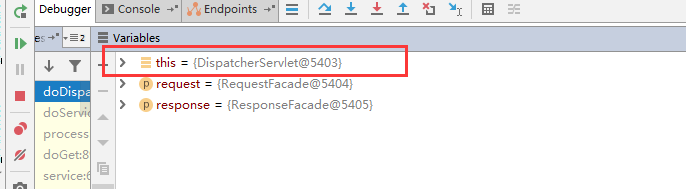
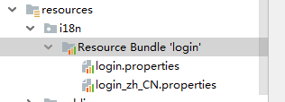
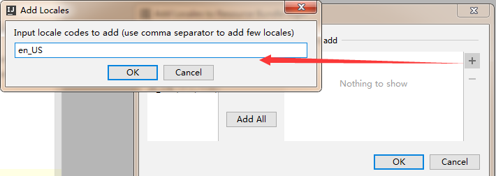
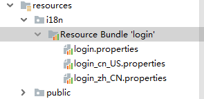
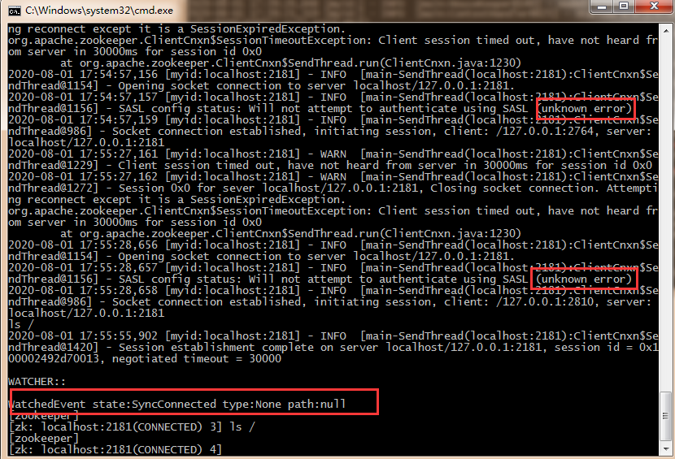
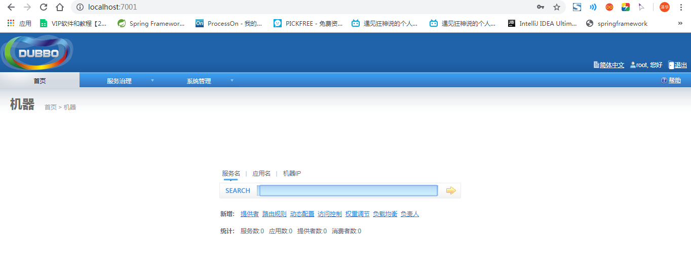

## 前情提要

[狂神SpringBoot](https://mp.weixin.qq.com/mp/homepage?__biz=Mzg2NTAzMTExNg==&hid=1&sn=3247dca1433a891523d9e4176c90c499&scene=1&devicetype=android-29&version=28001553&lang=zh_CN&nettype=3gnet&ascene=7&session_us=gh_1dd456f1d44d&wx_header=3)

微服务阶段

- javase:AOP
- mysql:持久化@RequestBody
- html+css+js+jquery-+框架：视图，框架不熟练，css不好；
- javaweb:独立开发MVC三层架构的网站了：原始
- ssm：框架：简化了我们的开发流程
- war:tomcati运行
- spring再简化：SpringBoot;微服务架构！
- 服务越来越多：springcloud;


## 一、什么是SpringBoot？什么是微服务？

[SpringBoot01：Hello,World！](https://mp.weixin.qq.com/s?__biz=Mzg2NTAzMTExNg==&mid=2247483724&idx=1&sn=77ce80187dbfdbaaafa0366f6a0c9151&scene=19#wechat_redirect)

### 环境准备

- jdk1.8
- maven 3.6.1
- springboot:最新
- IDEA

### 创建项目

官方：提供了一个快速生成的网站！IDEA集成了这个网站！
两种方法：

- 可以在官网直接下载后，导入idea开发（官网在哪）
- 直接使用idea创建一个springbootI项目（一般开发直接在IDEA中创建）

[SpringBoot官网](https://spring.io/projects/spring-boot)
[SpringBoot官网下载项目jar包](https://start.spring.io/)


默认模块（多余的删除）


#### IDEA创建步骤


把不用的文件删除

启动程序


加上依赖

```xml
        <dependency>
            <groupId>org.springframework.boot</groupId>
            <artifactId>spring-boot-starter-web</artifactId>
        </dependency>
```


运行


#### 小玩意

1. 改端口号


1. 更改banner艺术字


## 二、原理初探

运行原理
[SpringBoot02：运行原理初探](https://mp.weixin.qq.com/s?__biz=Mzg2NTAzMTExNg==&mid=2247483743&idx=1&sn=431a5acfb0e5d6898d59c6a4cb6389e7&scene=19#wechat_redirect)

自动配置：

### pom.xml

- `spring-boot-dependencies`:核心依赖在父工程中！
- 我们在写或者引入一些`Springboot`依赖的时候，不需要指定版本，就因为有这些版本仓库

### 启动器

```xml
<dependency>
            <groupId>org.springframework.boot</groupId>
            <artifactId>spring-boot-starter</artifactId>
        </dependency>
```

- 启动器：说白了就是`Springboot`的启动场景；
- 比如`spring-boot-starter-web`,他就会帮我们自动导入web环境所有的依赖！
- `springboot`会将所有的功能场景，都变成一个个的启动器
- 我们要使用什么功能，就只需要找到对应的启动器就可以了`starter`

```java
package com.blue;

import org.springframework.boot.SpringApplication;
import org.springframework.boot.autoconfigure.SpringBootApplication;

// @SpringBootAppLication：标注这个类是一个springboot的应用
@SpringBootApplication
public class Springboot01HellowordApplication {
    //将springboot.应用启动
    public static void main(String[] args) {
        SpringApplication.run(Springboot01HellowordApplication.class, args);
    }

}   
```

### 注解

```java
@SpringBootConfiguration:	springboot的配置
	@Configuration:	spring配置类
	@Component:	说明这也是一个spring的组件

@Enab1eAutoConfiguration:	自动配置
	@AutoConfigurationPackage:	自动配置包
		@Import(AutoConfigurationPackages.Registrar.class):	自动配置`包注册
	@Import(AutoConfigurationImportselector.class): 自动配置导入选择
```

> - 自动配置原理分析
>   - @SpringBootApplication
>     - @SpringBootConfiguration
>       - @Configuration
>         - @Component
>     - @EnableAutoConfiguration (自动导入包)
>       - @AutoConfigurationPackage
>         - @Import(AutoConfigurationPackages.Registrar.class) （自动注册包）
>       - @Import(AutoConfigurationImportSelector.class) （自动导入包的核心）
>         - AutoConfigurationImportSelector （选择了什么东西）
>           - getAutoConfigurationEntry() （获取自动配置的实体）
>           - getCandidateConfigurations() （获取了候选的配置）
>             - protected Class<?> getSpringFactoriesLoaderFactoryClass() { 	return EnableAutoConfiguration.class; //返回EnableAutoConfiguration这个注解 }
>           - public static List<String> loadFactoryNames(Class<?> factoryType, @Nullable ClassLoader classLoader) （获取所有的加载配置）
>           - loadSpringFactories(ClassLoader classLoader)
>             - classLoader.getResources("META-INF/spring.factories"); （从"META-INF/spring.factories"中获取配置）
>             - 遍历完所有从META-INF/spring.factories获取的配置后，封装为properties供我们使用
>     - @ComponentScan （扫描当前主启动类同级的包）

META-lNF/spring.factories:自动配置的核心文件


```java
Properties properties PropertiesLoaderutils.loadProperties(resource);
所有资源加载到配置类中！
```

### 结论：

`springboot`所有自动配置都是在启动的时候扫描并加载：`spring.factories`所有的自动配置类都在这里面，但是不一定生效，要判断条件是否成立，只要导入了对应的`start`，就有对应的启动器了，有了启动器，我们自动装配就会生效，然后就配置成功！

1. `springboot`在启动的时候，从类路径下`/META-INF/spring.factories`获取指定的值；
2. 将这些自动配置的类导入容器，自动配置就会生效，帮我进行自动配置！
3. 以前我们需要手动配置的东西，现在`springboot`帮我们做了！
4. 整合javaEE,解决方案和自动配置的东西都在`spring-boot-autoconfigure-.2.2.0.RELEASE.jar`这个包下
5. 它会把所有需要导入的组件，以类名的方式返回，这些组件就会被添加到容器；
6. 容器中也会存在非常多的`xxxAutoConfiguration`的文件(`@Bean`),就是这些类给容器中导入了这个场景需要的所有组件；并自动配置，`@Configuration`，`JavaConfig`!
7. 有了自动配置类，免去了我们手动编写配置文件的工作！


关于SpringBoot，谈谈你的理解：

- 自动装配
- run（）

## 三、yaml语法 & 属性赋值 & JSR303校验

[SpringBoot03：yaml配置注入](https://mp.weixin.qq.com/s?__biz=Mzg2NTAzMTExNg==&mid=2247483744&idx=1&sn=b4ec762e71b2ddf9403c035635299206&scene=19#wechat_redirect)

新建模块


```
# springboot这个配置文件中到底可以配置哪些东西呢？
# 官方的配置太多了
# 了解原理：一通百通
```


### 3.1、给属性赋值的几种方式

#### 1、@Value

**Dog**

```java
package com.blue.pojo;

import org.springframework.stereotype.Component;

@Component
public class Dog {
    private String name;
    private Integer age;

    public Dog() {
    }

    public Dog(String name, Integer age) {
        this.name = name;
        this.age = age;
    }

    public String getName() {
        return name;
    }

    public void setName(String name) {
        this.name = name;
    }

    public Integer getAge() {
        return age;
    }

    public void setAge(Integer age) {
        this.age = age;
    }

    @Override
    public String toString() {
        return "Dog{" +
                "name='" + name + '\'' +
                ", age=" + age +
                '}';
    }
}
```

**Person**

```java
package com.blue.pojo;

import java.util.Date;
import java.util.List;
import java.util.Map;

public class Person {
    private String name;
    private Integer age;
    private Boolean happy;
    private Date birth;
    private Map<String,Object> maps;
    private List<Object> lists;
    private Dog dog;

    public Person(String name, Integer age, Boolean happy, Date birth, Map<String, Object> maps, List<Object> lists, Dog dog) {
        this.name = name;
        this.age = age;
        this.happy = happy;
        this.birth = birth;
        this.maps = maps;
        this.lists = lists;
        this.dog = dog;
    }

    public Person() {
    }

    public String getName() {
        return name;
    }

    public void setName(String name) {
        this.name = name;
    }

    public Integer getAge() {
        return age;
    }

    public void setAge(Integer age) {
        this.age = age;
    }

    public Boolean getHappy() {
        return happy;
    }

    public void setHappy(Boolean happy) {
        this.happy = happy;
    }

    public Date getBirth() {
        return birth;
    }

    public void setBirth(Date birth) {
        this.birth = birth;
    }

    public Map<String, Object> getMaps() {
        return maps;
    }

    public void setMaps(Map<String, Object> maps) {
        this.maps = maps;
    }

    public List<Object> getLists() {
        return lists;
    }

    public void setLists(List<Object> lists) {
        this.lists = lists;
    }

    public Dog getDog() {
        return dog;
    }

    public void setDog(Dog dog) {
        this.dog = dog;
    }

    @Override
    public String toString() {
        return "Person{" +
                "name='" + name + '\'' +
                ", age=" + age +
                ", happy=" + happy +
                ", birth=" + birth +
                ", maps=" + maps +
                ", lists=" + lists +
                ", dog=" + dog +
                '}';
    }
}
```

注入`Dog`

```java
@Component
public class Dog {
    @Value("旺财")
    private String name;
    @Value("3")
    private Integer age;
```

测试

```java
package com.blue;

import com.blue.pojo.Dog;
import org.junit.jupiter.api.Test;
import org.springframework.beans.factory.annotation.Autowired;
import org.springframework.boot.test.context.SpringBootTest;

@SpringBootTest
class Springboot02ConfigApplicationTests {
    @Autowired
    private Dog dog;

    @Test
    void contextLoads() {
        System.out.println(dog);
    }

}
```

结果：


#### 2、yaml赋值（推荐）

**application.yaml**

```java
person:
  name: blue
  age: 23
  happy: false
  birth: 2022/04/27
  maps: {k1: v1,k2: v2}
  lists: 
    - code
    - music
    - girl
  dog: 
    name: 旺财
    age: 3
```

[使用注释处理器生成您自己的元数据](https://docs.spring.io/spring-boot/docs/2.6.7/reference/html/configuration-metadata.html#appendix.configuration-metadata.annotation-processor)
加上依赖

```xml
<dependency>
    <groupId>org.springframework.boot</groupId>
    <artifactId>spring-boot-configuration-processor</artifactId>
    <optional>true</optional>
</dependency>
```


#### 3、第三种——加载指定的配置文件（优先使用yaml）


#### 4、@Value和yaml赋值对比


### 3.2、配置文件占位符：

```yaml
person:
  name: blue${random.uuid}
  age: ${random.int}
  happy: false
  birth: 2022/04/27
  maps: {k1: v1,k2: v2}
  lists:
    - code
    - music
    - girl
  dog:
    name: ${person.hello:hello}_旺财
    age: 3
```

输出

```java
Person{name='blue7d31f176-1c34-4109-a66b-61edc3560202', age=-1360868911, happy=false, birth=Wed Apr 27 00:00:00 CST 2022, maps={k1=v1, k2=v2}, lists=[code, music, girl], dog=Dog{name='hello_旺财', age=3}}
```

#### 松散绑定：

> 什么是松散绑定？
>
> 假如在yaml中写了last-name，和类中的lastName是一样的，yaml中name首字母自动大写，这就是松散绑定

**application.yaml**

```yaml
dog:
  first-name: blue
  age: 1
```

**Dog**

```java
@Component
@ConfigurationProperties(prefix = "dog")
public class Dog {

    private String firstName;

    private Integer age;

    public Dog() {
    }

    public Dog(String firstName, Integer age) {
        this.firstName = firstName;
        this.age = age;
    }

    public String getFirstName() {
        return firstName;
    }

    public void setFirstName(String firstName) {
        this.firstName = firstName;
    }

    public Integer getAge() {
        return age;
    }

    public void setAge(Integer age) {
        this.age = age;
    }

    @Override
    public String toString() {
        return "Dog{" +
                "firstName='" + firstName + '\'' +
                ", age=" + age +
                '}';
    }
}
```

**测试**

```java
@SpringBootTest
class Springboot02ConfigApplicationTests {

    @Autowired
    private Dog dog;

    @Test
    void contextLoads() {
        System.out.println(dog);
    }
}
```

结果


### 3.3、结论（如何选择赋值方式）：

- 配置`yml`和配置`properties`都可以获取到值 ， 强烈推荐 yml；
- 如果我们在某个业务中，只需要获取配置文件中的某个值，可以使用一下 `@value`；
- 如果说，我们专门编写了一个`JavaBean`来和配置文件进行一一映射，就直接`@configurationProperties`，不要犹豫！

### 3.4、JSR-303数据校验

#### 一、JSR 303

##### 1、什么是 JSR 303？

　　JSR 是 Java Specification Requests 的缩写，即 Java 规范提案。
　　存在各种各样的 JSR，简单的理解为 JSR 是一种 Java 标准。
　　JSR 303 就是数据检验的一个标准（Bean Validation (JSR 303)）。
参考：
　　https://www.jianshu.com/p/554533f88370

##### 2、为什么使用 JSR 303？

　　处理一段业务逻辑，首先要确保数据输入的正确性，所以需要先对数据进行检查，保证数据在语义上的正确性，再根据数据进行下一步的处理。
　　前端可以通过 js 程序校验数据是否合法，后端同样也需要进行校验。而后端最简单的实现就是直接在业务方法中对数据进行处理，但是不同的业务方法可能会出现同样的校验操作，这样就出现了数据的冗余。为了解决这个情况，JSR 303 出现了。
　　JSR 303 使用 Bean Validation，即在 Bean 上添加相应的注解，去实现数据校验。这样在执行业务方法前，都会根据注解对数据进行校验，从而减少自定义的校验逻辑，减少代码冗余。

##### 3、JSR 303 常见操作？

（1）可以通过简单的注解校验 Bean 属性，比如 @NotNull、@Null 等。
（2）可以通过 Group 分组自定义需要执行校验的属性。
（3）可以自定义注解并指定校验规则。
（4）支持基于 JSR 303 的实现，比如 Hibernate Validator（额外添加一些注解）。

 

#### 二、演示 JSR303 的简单使用

##### 1、构建一个 SpringBoot 项目用来演示

（1）构建一个 SpringBoot 项目，以及使用 EasyCode 逆向生成相关的代码。
参考地址：
　　https://www.cnblogs.com/l-y-h/p/12781586.html
模板代码地址：
　　https://gitee.com/lyh-man/fast-template.git

（2）工具使用详情：
　　SpringBoot 2.2.6 + JDK 1.8 + mysql 1.8 搭建基本开发环境
　　IDEA + EasyCode + Lombok 插件 逆向生成基本代码
　　Postman 发送请求，测试接口

##### 2、未使用 JSR303 相关注解时

　　没用 JSR 303 相关注解时，需要手动在业务方法里写处理数据的逻辑。
　　修改 Controller ，简单测试一下未使用 JSR 303 相关注解时的做法。

```java
@RestController
@RequestMapping("api")
public class EmpController {
    @Resource
    private EmpService empService;

    @PostMapping("/emp")
    public Result createEmp(@RequestBody Emp emp) {
        if (emp.getId() == null || emp.getName() == null) {
            return Result.error().message("数据不存在");
        }
        return Result.ok().data("items", emp).message("数据插入成功");
    }
}
```


 

 

 

使用 postman 测试该接口，当 id 不存在时，会被检测到。


 

 

 

id，name 都存在时，不会被捕获。


 

 

 

　　这里只是简单的测试一下逻辑，真实的数据检测肯定比这复杂的多，然后每个方法都需要写不同的数据处理逻辑，这样就会造成数据的冗余。而使用 JSR303 的相关注解，就很简单，继续往下看。

 

##### 3、使用 JSR 303 相关注解处理逻辑

（1）使用步骤：
Step1：
　　在相关的 Bean 上标注需要处理的注解，并指定需要提示的信息（若不指定，会从默认配置文件中读取默认的信息）。

Step2：
　　在相关的方法上，使用 @Valid 注解（或者 @Validated 指定组名）标记需要被校验的数据，否则会不生效。
注意：
　　检测到数据异常后，系统会向外抛出异常，如果做了统一异常处理，可以根据 postman 测试的结果，找到控制台打印出的 相应的异常，并处理。

Step3：
　　处理异常。使用 BindingResult 可以获取到检测结果，然后进行处理。
　　也可以使用 全局统一异常 处理（@RestControllerAdvice 与 @ExceptionHandler），处理检测结果。
注：
　　统一异常处理参考：https://www.cnblogs.com/l-y-h/p/12781586.html#_label2

 

（2）使用：
Step1：
　　在相关的 Bean 上标注注解，并写上指定信息。

```
import lombok.Data;

import javax.validation.constraints.NotNull;
import java.io.Serializable;

@Data
public class Emp implements Serializable {
    private static final long serialVersionUID = 281903912367009575L;

    @NotNull(message = "id 不能为 null")
    private Integer id;

    @NotNull(message = "name 不能为 null")
    private String name;
    
    private Double salary;
    
    private Integer age;
    
    private String email;
}
```


 

 

Step2：
　　修改 Controller 方法，使用 @Valid 注解标记需要检测的数据。

```
@RestController
@RequestMapping("api")
public class EmpController {
    @Resource
    private EmpService empService;

    @PostMapping("/emp")
    public Result createEmp(@Valid @RequestBody Emp emp) {
        return Result.ok().data("items", emp).message("数据插入成功");
    }
}
```


 

 

Step3：
　　使用 postman 测试一下。会抛出 MethodArgumentNotValidException 异常。


 

 

控制台打印的信息：


 

 

Step4：
　　可以使用 BindingResult 去处理捕获到的数据并进行相关处理。

```
@RestController
@RequestMapping("api")
public class EmpController {
    @Resource
    private EmpService empService;

    @PostMapping("/emp")
    public Result createEmp(@Valid @RequestBody Emp emp, BindingResult result) {
        if (result.hasErrors()) {
            Map<String, String> map = new HashMap<>();
            // 获取校验结果，遍历获取捕获到的每个校验结果
            result.getFieldErrors().forEach(item ->{
                // 获取校验的信息
                String message = item.getDefaultMessage();
                String field = item.getField();
                // 存储得到的校验结果
                map.put(field, message);
            });
            return Result.error().message("数据不合法").data("items", map);
        }
        return Result.ok().data("items", emp).message("数据插入成功");
    }
}
```


 

 

使用 Postman 测试。


 

 

Step5：
　　通过上面的步骤，已经可以捕获异常、处理异常，但是每次都是在业务方法中手动处理逻辑，这样的实现，代码肯定会冗余。可以将其抽出，使用 统一异常处理，每次异常发生时，将其捕获。
　　根据 Step3 可以看到会抛出 MethodArgumentNotValidException 异常，所以需要将其捕获。
　　需要使用 @RestControllerAdvice 与 @ExceptionHandler。

```
@RestControllerAdvice
public class GlobalExceptionHandler {
    private Logger logger = LoggerFactory.getLogger(getClass());

    @ExceptionHandler(MethodArgumentNotValidException.class)
    public Result handlerValidException(MethodArgumentNotValidException e) {
        logger.error(e.getMessage(), e);
        BindingResult result = e.getBindingResult();
        Map<String, String> map = new HashMap<>();
        // 获取校验结果，遍历获取捕获到的每个校验结果
        result.getFieldErrors().forEach(item ->{
            // 存储得到的校验结果
            map.put(item.getField(), item.getDefaultMessage());
        });
        return Result.error().message("数据校验不合法").data("items", map);
    }
}
```


 

 

相应的业务方法里，不需要再用 BindingResult 去处理数据了（即 Step2 的状态）。

```
@RestController
@RequestMapping("api")
public class EmpController {
    @Resource
    private EmpService empService;

    @PostMapping("/emp")
    public Result createEmp(@Valid @RequestBody Emp emp) {
        return Result.ok().data("items", emp).message("数据插入成功");
    }
}
```


 

 

使用 Postman 测试。


 

 

##### 4、JSR 303 分组校验

（1）为什么使用 分组校验？
　　通过上面的过程，可以了解到单个方法的校验规则。
　　如果出现多个方法，都需要校验 Bean，且校验规则不同的时候，怎么办呢？
　　分组校验就可以去解决该问题，每个分组指定不同的校验规则，不同的方法执行不同的分组，就可以得到不同的校验结果。

（2）基本认识
　　JSR 303 的每个注解都默认具备三个属性：
　　　　message 用来定义数据校验失败后的提示消息，默认读取配置文件的内容。
　　　　　　全局搜索 ValidationMessages.properties，可以看到默认的信息。

　　　　groups 用来定义分组，其是一个 class 数组，可以指定多个分组。

```
String message() default "{javax.validation.constraints.NotNull.message}";

Class<?>[] groups() default { };

Class<? extends Payload>[] payload() default { };
```

 

（3）使用分组步骤：
Step1：
　　定义一个空接口，用于指定分组，内部不需要任何实现。

Step2：
　　指定 注解时，通过 groups 指定分组。用于指定在某个分组条件下，才去执行校验规则。

Step3：
　　在相关的业务方法上，通过 @Validated 注解指定分组，去指定校验。
注：
　　使用分组校验后，Bean 注解上若不指定分组，则不会执行校验规则。

（4）使用：
Step1：
　　创建分组接口。
　　创建两个分组接口 AddGroup、UpdateGroup。
其中：
　　AddGroup 用于指定 添加数据 时的校验规则（比如：id、name 均不为 null）。
　　UpdateGroup 用于指定 修改数据 时的校验规则（比如：name 不允许为 null）。


 

 

Step2：
　　给 Bean 添加注解，并指定分组信息。

```
@Data
public class Emp implements Serializable {
    private static final long serialVersionUID = 281903912367009575L;

    @NotNull(message = "id 不能为 null", groups = {AddGroup.class})
    private Integer id;

    @NotNull(message = "name 不能为 null", groups = {AddGroup.class, UpdateGroup.class})
    private String name;

    private Double salary;

    private Integer age;

    private String email;
}
```


 

 

Step3：
　　在业务方法上，通过 @Validated 注解指定分组，去指定校验。
如下例，定义两个方法，Post 请求会触发 createEmp 方法，Put 请求会触发 UpdateEmp 方法。

```
@RestController
@RequestMapping("api")
public class EmpController {
    @Resource
    private EmpService empService;

    @PostMapping("/emp")
    public Result createEmp(@Validated({AddGroup.class}) @RequestBody Emp emp) {
        return Result.ok().data("items", emp).message("数据插入成功");
    }

    @PutMapping("/emp")
    public Result UpdateEmp(@Validated({UpdateGroup.class}) @RequestBody Emp emp) {
        return Result.ok().data("items", emp).message("数据插入成功");
    }
}
```


 

 

Step4：
　　使用 Postman 测试，发送 Post 请求，触发 createEmp 方法，执行 AddGroup 校验规则。
　　检测 id、name 是否合法。


 

 

发送 Put 请求，触发 UpdateEmp 方法，执行 UpdateGroup 校验规则。
只检测 name 是否合法。


 

 

##### 5、JSR 303 自定义校验注解

（1）为什么使用自定义校验注解？
　　上面的注解满足不了业务需求时，可以自定义校验注解，自定义校验规则。

（2）步骤：
Step1：
　　需要自定义一个校验注解。
　　可以创建一个 ValidationMessages.properties 用于保存默认的 message 信息。

Step2：
　　需要自定义一个校验器，即自定义校验规则。
　　实现 ConstraintValidator 接口，并重写相关方法。
注：
　　initialize 方法用于初始化，可以获取 自定义的属性的值。
　　isValid 方法用于校验，可以获取到实际的值，然后与自定义的属性值进行比较。

Step3：
　　将校验注解 与 校验器 关联起来。
　　@Constraint(validatedBy = {TestValidConstraintValidator.class})

（3）使用：
　　如下例，自定义一个校验规则，判断数据长度是否合法。
　　默认为 String 属性，当 String 为 Null 或者 长度大于 5 时，校验不通过。
　　可以自定义 长度。
Step1：
　　自定义一个校验注解，@TestValid，用于判断一个值的长度是否合法。

```
import javax.validation.Constraint;
import javax.validation.Payload;
import java.lang.annotation.Documented;
import java.lang.annotation.Retention;
import java.lang.annotation.Target;

import static java.lang.annotation.ElementType.FIELD;
import static java.lang.annotation.RetentionPolicy.RUNTIME;

/**
 * 用于判断一个值的长度是否合法
 */
@Target({FIELD})
@Retention(RUNTIME)
@Documented
@Constraint(validatedBy = {TestValidConstraintValidator.class})
public @interface TestValid {
    String message() default "{com.lyh.test.TestValid.message}";

    Class<?>[] groups() default { };

    Class<? extends Payload>[] payload() default { };

    /**
     * 返回一个长度
     * @return 默认为 5
     */
    int length() default 5;
}
```


 

 

配置文件内容：


 

 

Step2：
　　自定义一个校验器TestValidConstraintValidator， 用于检测值是否合法。

```
import javax.validation.ConstraintValidator;
import javax.validation.ConstraintValidatorContext;

/**
 * 实现 ConstraintValidator 接口，
 * 其中 ConstraintValidator 的泛型，一个需要指定自定义的注解，一个需要指定需要获取的值的类型。
 * 比如：
 *  ConstraintValidator<TestValid, String> 中
 *      TestValid   表示自定义注解
 *      String      表示获取的值的类型
 * 即定义规则，判断一个 String 的值的长度是否满足条件
 */
public class TestValidConstraintValidator implements ConstraintValidator<TestValid, String> {

    /**
     * 用于保存自定义的（默认）长度
     */
    private int length;

    /**
     * 初始化方法，获取默认数据
     * @param constraintAnnotation 注解对象
     */
    @Override
    public void initialize(TestValid constraintAnnotation) {
        length = constraintAnnotation.length();
    }

    /**
     * 自定义校验规则，如果 String 为 Null 或者 长度大于 5，则校验失败（返回 false）
     * @param value 需要校验的值
     * @param context
     * @return true 表示校验成功，false 表示校验失败
     */
    @Override
    public boolean isValid(String value, ConstraintValidatorContext context) {
        return value == null ? false : length > value.length();
    }

}
```


 

 

Step3：
　　使用注解。

```
@Data
public class Emp implements Serializable {
    private static final long serialVersionUID = 281903912367009575L;

    @NotNull(message = "id 不能为 null", groups = {AddGroup.class})
    private Integer id;

    @TestValid(groups = {AddGroup.class})
    @NotNull(message = "name 不能为 null", groups = {AddGroup.class, UpdateGroup.class})
    private String name;

    private Double salary;

    private Integer age;

    @TestValid(length = 10, message = "值不能为 Null 且长度不超过 10", groups = {AddGroup.class})
    private String email;
}
```


 

 

使用 Postman 测试。
　　name、email 都不存在时，会被捕获数据异常。


 

 

name 数据不合法、email 数据合法时，name 会被捕获。


 

 

#### 三、JSR 303 相关注解

##### 1、空检查相关注解

```
注解                      注解详情
@Null                  被指定的注解元素必须为 Null
@NotNull               任意类型，不能为 Null，但可以为空，比如空数组、空字符串。
@NotBlank              针对字符串，不能为 Null，且去除前后空格后的字符串长度要大于 0。
@NotEmpty              针对字符串、集合、数组，不能为 Null，且长度要大于 0。
```


 

 

 

 

 

 

 

 

##### 2、长度检查

```
注解                      注解详情
@Size                   针对字符串、集合、数组，判断长度是否在给定范围内。
@Length                 针对字符串，判断长度是否在给定范围内。
```


 

 

 

 

##### 3、布尔值检查

```
注解                      注解详情
@AssertTrue             针对布尔值，用来判断布尔值是否为 true
@AssertFalse            针对布尔值，用来判断布尔值是否为 false
```


 

 

 

 

##### 4、日期检查

```
注解                      注解详情
@Past                  针对日期，用来判断当前日期是否为 过去的日期
@Future                针对日期，用来判断当前日期是否为 未来的日期
```

 

##### 5、数值检查

```
注解                      注解详情
@Max(value)         针对字符串、数值，用来判断是否小于等于某个指定值
@Min(value)         针对字符串、数值，用来判断是否大于等于某个指定值
```


 

 

 

 

##### 6、其他

```
注解                      注解详情
@Pattern             验证字符串是否满足正则表达式
@Email               验证字符串是否满足邮件格式
@Url                 验证是否满足 url 格式
```


### 3.5、多环境配置


#### 采用`.properties`文件


#### 采用`yml`文件

**application.yaml**

> 可以分为多个文件编写。也可以在一个文件中使用分割线分开，穿凿多文件环境

```yaml
server:
  port: 8080

spring:
  profiles:
    active: dev

---
spring:
  config:
    activate:
      on-profile: dev
server:
  port: 8081

---
spring:
  config:
    activate:
      on-profile: test
server:
  port: 8082
```


## 四、自动配置原理

[SpringBoot05：自动配置原理](https://mp.weixin.qq.com/s?__biz=Mzg2NTAzMTExNg==&mid=2247483766&idx=1&sn=27739c5103547320c505d28bec0a9517&scene=19#wechat_redirect)

### 精髓

**1**、`SpringBoot`启动会加载大量的自动配置类
**2**、我们看我们需要的功能有没有在`SpringBoot`默认写好的自动配置类当中；
**3**、我们再来看这个自动配置类中到底配置了哪些组件；（只要我们要用的组件存在在其中，我们就不需要再手动配置了）
**4**、给容器中自动配置类添加组件的时候，会从`properties`类中获取某些属性。我们只需要在配置文件中指定这些属性的值即可；

`xxxxAutoConfigurartion`：自动配置类；给容器中添加组件

`xxxxProperties`:封装配置文件中相关属性；

我们可以通过启用 `debug=true`属性；来让控制台打印自动配置报告，这样我们就可以很方便的知道哪些自动配置类生效；

```java
#开启springboot的调试类
debug=true
```


## 自定义Starter

### 启动器简介

Starter相当于模块,它能将所需的依赖整合起来，并对模块内的Bean进行自动配置

### 实现流程

功能类-自动配置类-测试工程-拦截器完善功能-增加配置项

### 开发功能类

功能描述:输出客户端(根据IP区分)的访问次数

功能类的目录结构:


IpCounterService

```java
package com.newfbin.service;

public interface IpCounterService {
    void record();
}

```

IpCounterServiceImpl

```java
package com.newfbin.service.impl;

import com.newfbin.service.IpCounterService;
import jakarta.servlet.http.HttpServletRequest;
import org.springframework.beans.factory.annotation.Autowired;

import java.util.HashMap;
import java.util.Map;
import java.util.Objects;

/**
 * @Author: newfbin
 * @Date: 2024/09/03 17:19
 * @Description:
 */
public class IpCounterServiceImpl implements IpCounterService {
    @Autowired
    HttpServletRequest request;

    private Map<String, Integer> map = new HashMap<>();

    @Override
    public void record() {
        String ip = request.getRemoteAddr();
        Integer i = map.get(ip);
        i = Objects.isNull(i) ? 1 : ++i;
        map.put(ip, i);
        map.forEach((key, value) -> {
            System.out.println("ip:" + key + "\tcount:" + value);
        });
    }
}

```

### 开发自动配置类

**创建IpAutoconfiguration类**


IpAutoConfiguration

```java
package com.newfbin.configure;

import com.newfbin.service.IpCounterService;
import com.newfbin.service.impl.IpCounterServiceImpl;
import org.springframework.context.annotation.Bean;

/**
 * @Author: newfbin
 * @Date: 2024/09/03 19:09
 * @Description:
 */
public class IpAutoConfiguration {
    @Bean
    public IpCounterService ipCounterService(){
        return new IpCounterServiceImpl();
    }
}

```

**创建配置文件**

由于上边创建的IpAutoconfigurationlei类仅仅是将功能类进行了实例化,并没有引入到Spring环境中去,所以接下来还需要制作一个配置文件.

> 不同SpringBoot版本配置文件的制作
>
> resources  -> META-INF -> spring.factories  	#SpringBoot 2.7废止，SpringBoot 3全面移除
> resources  -> META-INF -> spring -> org.springframework.boot.autoconfigure.AutoConfiguration.imports

在resources目录下新建这样的文件夹和文件


将自动配置类的全类名写入到新建的文件中


最后点击Maven中的clean和install选项进行安装 (安装到本地的Maven仓库)


### 测试工程

web工程，开发一个controller，调用自定义的starter


### 拦截器完善功能

我们的Starter到现在完成了一半,不足之处是现在还不能开箱即用.接下来进行改善:

首先新建一个interceptor类,


接下来将

```java
@Autowired
private IpCounterService ipCounterService;
```

和

```java
ipCounterService.record();
```

这两段测试类Controller的代码移动到拦截器Interceptor中,

IpCounterInterceptor

```java
package com.newfbin.interceptor;

import com.newfbin.service.IpCounterService;
import jakarta.servlet.http.HttpServletRequest;
import jakarta.servlet.http.HttpServletResponse;
import org.springframework.beans.factory.annotation.Autowired;
import org.springframework.web.servlet.HandlerInterceptor;

/**
 * @Author: newfbin
 * @Date: 2024/09/03 19:55
 * @Description:
 */
public class IpCounterInterceptor implements HandlerInterceptor {
    @Autowired
    private IpCounterService ipCounterService;

    @Override
    public boolean preHandle(HttpServletRequest request, HttpServletResponse response, Object handler) throws Exception {
        ipCounterService.record();
        return true;
    }
}

```

重新clean和install后,在Controller进行测试


### 增加配置项

新建一个IpCounterProperties文件,据配置文件决定显示的格式


IpCounterProperties

```java
package com.newfbin.properties;

import lombok.Data;
import org.springframework.boot.context.properties.ConfigurationProperties;
import org.springframework.stereotype.Component;

/**
 * @Author: newfbin
 * @Date: 2024/09/03 20:13
 * @Description:
 */
@Data
@ConfigurationProperties(prefix="tools.ip")
@Component
public class IpCounterProperties {

    private String display = DisplayMode.SIMPLE.value;

    public enum DisplayMode{
        SIMPLE("simple"),
        DETAIL("detail");

        private String value;

        public String getValue() {
            return value;
        }

        public void setValue(String value) {
            this.value = value;
        }

        DisplayMode(String value){
            this.value = value;
        }
    }

}

```

IpCounterServiceImpl


我们分析完毕了源码以及自动装配的过程，我们可以尝试自定义一个启动器来玩玩！

### ------------------

### 说明

启动器模块是一个 空 jar 文件，仅提供辅助性依赖管理，这些依赖可能用于自动装配或者其他类库；

**命名归约：**

官方命名：

- 前缀：spring-boot-starter-xxx
- 比如：spring-boot-starter-web....

自定义命名：

- xxx-spring-boot-starter
- 比如：mybatis-spring-boot-starter

### 编写启动器

1. 在IDEA中新建一个空项目 spring-boot-starter-diy

2. 新建一个普通Maven模块：kuang-spring-boot-starter

3. 新建一个Springboot模块：kuang-spring-boot-starter-autoconfigure

4. 点击apply即可，基本结构

5. 在我们的 starter 中 导入  autoconfigure 的依赖！

   ```xml
   <!-- 启动器 -->
   <dependencies>
       <!--  引入自动配置模块 -->
       <dependency>
           <groupId>com.kuang</groupId>
           <artifactId>kuang-spring-boot-starter-autoconfigure</artifactId>
           <version>0.0.1-SNAPSHOT</version>
       </dependency>
   </dependencies>
   ```

6. 将 autoconfigure 项目下多余的文件都删掉，Pom中只留下一个 starter，这是所有的启动器基本配置！

7. 我们编写一个自己的服务

   ```java
   package nuc.ss;
   
   public class HelloService {
   
       HelloProperties helloProperties;
   
       public HelloProperties getHelloProperties() {
           return helloProperties;
       }
   
       public void setHelloProperties(HelloProperties helloProperties) {
           this.helloProperties = helloProperties;
       }
   
       public String sayHello(String name){
           return helloProperties.getPrefix() + name + helloProperties.getSuffix();
       }
   
   }
   ```

8. 编写`HelloProperties` 配置类

   ```java
   package nuc.ss;
   
   import org.springframework.boot.context.properties.ConfigurationProperties;
   
   // 前缀 kuang.hello
   @ConfigurationProperties(prefix = "kuang.hello")
   public class HelloProperties {
   
       private String prefix;
       private String suffix;
   
       public String getPrefix() {
           return prefix;
       }
   
       public void setPrefix(String prefix) {
           this.prefix = prefix;
       }
   
       public String getSuffix() {
           return suffix;
       }
   
       public void setSuffix(String suffix) {
           this.suffix = suffix;
       }
   }
   ```

9. 编写我们的自动配置类并注入bean，测试！

   ```java
   package nuc.ss;
   
   import org.springframework.beans.factory.annotation.Autowired;
   import org.springframework.boot.autoconfigure.condition.ConditionalOnWebApplication;
   import org.springframework.boot.context.properties.EnableConfigurationProperties;
   import org.springframework.context.annotation.Bean;
   import org.springframework.context.annotation.Configuration;
   
   @Configuration
   @ConditionalOnWebApplication //web应用生效
   @EnableConfigurationProperties(HelloProperties.class)
   public class HelloServiceAutoConfiguration {
   
       @Autowired
       HelloProperties helloProperties;
   
       @Bean
       public HelloService helloService(){
           HelloService service = new HelloService();
           service.setHelloProperties(helloProperties);
           return service;
       }
   
   }
   ```

10. 在resources编写一个自己的 `META-INF\spring.factories`

    ```factories
    # Auto Configure
    org.springframework.boot.autoconfigure.EnableAutoConfiguration=\
    nuc.ss.HelloServiceAutoConfiguration
    ```

11. 编写完成后，可以安装到maven仓库中！


### 新建项目测试我们自己写的启动器

1. 新建一个SpringBoot 项目

2. 导入我们自己写的启动器

   ```xml
   <dependency>
       <groupId>nuc.ss</groupId>
       <artifactId>ss-spring-boot-starter</artifactId>
       <version>1.0-SNAPSHOT</version>
   </dependency>
   ```

3. 编写一个 `HelloController`  进行测试我们自己的写的接口！

   ```java
   package nuc.ss.controller;
   
   @RestController
   public class HelloController {
   
       @Autowired
       HelloService helloService;
   
       @RequestMapping("/hello")
       public String hello(){
           return helloService.sayHello("zxc");
       }
   
   }
   ```

4. 编写配置文件 `application.properties`

   ```prop
   ss.hello.prefix="ppp"
   ss.hello.suffix="sss"
   ```

5. 启动项目进行测试，结果成功 !

**学完的东西一定要多下去实践！**


## 五、静态资源处理

[SpringBoot10：Web开发静态资源处理](https://mp.weixin.qq.com/s?__biz=Mzg2NTAzMTExNg==&mid=2247483796&idx=1&sn=ea13e2858328a582338e89c3459021c1&scene=19#wechat_redirect)

### 5.1、webjars

第一种：

[网址](https://www.webjars.org/)

```xml
<dependency>
    <groupId>org.webjars</groupId>
    <artifactId>jquery</artifactId>
    <version>3.4.1</version>
</dependency>
```

导入完毕，查看webjars目录结构，并访问Jquery.js文件！


第二种：

```java
"classpath:/META-INF/resources/"
"classpath:/resources/"
"classpath:/static/"
"classpath:/public/"
```

### 5.2、首页定制

源码：


添加`index`


### 5.3、图标

老版本有，新版不一定 

## 六、Thymeleaf模板引擎

[SpringBoot11：Thymeleaf模板引擎](https://mp.weixin.qq.com/s?__biz=Mzg2NTAzMTExNg==&mid=2247483807&idx=1&sn=7e1d5df51cdeb046eb37dec7701af47b&scene=19#wechat_redirect)

### 6.1、引入Thymeleaf

[Thymeleaf文档](https://www.thymeleaf.org/doc/tutorials/3.0/usingthymeleaf.html)

- `Thymeleaf` 官网：https://www.thymeleaf.org/
- `Thymeleaf` 在`Github` 的主页：https://github.com/thymeleaf/thymeleaf
- `Spring`官方文档：找到我们[对应的版本](https://docs.spring.io/spring-boot/docs/2.2.5.RELEASE/reference/htmlsingle/#using-boot-starter)
- 找到对应的`pom`依赖：可以适当点进源码看下本来的包！

```xml
<!--thymeleaf-->
    <dependency>
        <groupId>org.springframework.boot</groupId>
        <artifactId>spring-boot-starter-thymeleaf</artifactId>
    </dependency>
```


### 6.2、模板引擎的作用

就是我们来写一个**页面模板**，比如有些值呢，是动态的，我们写一些表达式。而这些值从哪来呢，就是我们在后台封装一些数据。然后把这个模板和这个数据交给我们模板引擎，模板引擎按照我们这个数据帮你把这表达式解析、填充到我们指定的位置，然后把这个数据最终生成一个我们想要的内容给我们写出去，这就是我们这个模板引擎，不管是`jsp`还是其他模板引擎，都是这个思想。只不过呢，就是说不同模板引擎之间，他们可能这个语法有点不一样。其他的我就不介绍了，我主要来介绍一下`SpringBoot`给我们推荐的`Thymeleaf`模板引擎，这模板引擎呢，是一个高级语言的模板引擎，他的这个语法更简单。而且呢，功能更强大。

### 6.3、测试

```
Thymeleaf`的所有模板引擎都写在这个包下—`templates`

源码——`ThymeleafProperties
```


写一个`test.html`

```html
<!DOCTYPE html>
<html lang="en">
<head>
    <meta charset="UTF-8">
    <title>Title</title>
</head>
<body>
<h1>test</h1>
</body>
</html>
```

测试`HelloController`

```java
@RestController
public class HelloController {
    @RequestMapping("/test")
    public String test(){
        return "test";
    }
}
```

结果：


**结论：**
只要需要使用`thymeleaf`,只需要导入对应的依赖就可以了！我们将`html`放在我们的`templates`目录下即可！

#### 导入约束

```html
<!DOCTYPE html>

<html xmlns:th="http://www.thymeleaf.org">

  <head>
    <title>Good Thymes Virtual Grocery</title>
    <meta http-equiv="Content-Type" content="text/html; charset=UTF-8" />
    <link rel="stylesheet" type="text/css" media="all" 
          href="../../css/gtvg.css" th:href="@{/css/gtvg.css}" />
  </head>

  <body>
  
    <p th:text="#{home.welcome}">Welcome to our grocery store!</p>
  
  </body>

</html>
```

#### 编写Controller


#### test.html


#### 运行结果


### 6.4、语法

#### Simple expressions:

- Variable Expressions: `${...}`
- Selection Variable Expressions: `*{...}`
- Message Expressions: `#{...}`
- Link URL Expressions: `@{...}`
- Fragment Expressions: `~{...}`

#### Literals

- Text literals: `'one text'`, `'Another one!'`,…
- Number literals: `0`, `34`, `3.0`, `12.3`,…
- Boolean literals: `true`, `false`
- Null literal: `null`
- Literal tokens: `one`, `sometext`, `main`,…

#### Text operations:

- String concatenation: `+`
- Literal substitutions: `|The name is ${name}|`

#### Arithmetic operations:

- Binary operators: `+`, `-`, `*`, `/`, `%`
- Minus sign (unary operator): `-`

#### Boolean operations:

- Binary operators: `and`, `or`
- Boolean negation (unary operator): `!`, `not`

#### Comparisons and equality:

- Comparators: `>`, `<`, `>=`, `<=` (`gt`, `lt`, `ge`, `le`)
- Equality operators: `==`, `!=` (`eq`, `ne`)

#### Conditional operators:

- If-then: `(if) ? (then)`
- If-then-else: `(if) ? (then) : (else)`
- Default: `(value) ?: (defaultvalue)`

- Special tokens:
  - No-Operation: `_`

*All these features can be combined and nested:*

```html
'User is of type ' + (${user.isAdmin()} ? 'Administrator' : (${user.type} ?: 'Unknown'))
```

## MVC自动配置原理

### 官网阅读

在进行项目编写前，我们还需要知道一个东西，就是SpringBoot对我们的SpringMVC还做了哪些配置，包括如何扩展，如何定制。

只有把这些都搞清楚了，我们在之后使用才会更加得心应手。途径一：源码分析，途径二：官方文档！

地址 ：https://docs.spring.io/spring-boot/docs/2.2.5.RELEASE/reference/htmlsingle/#boot-features-spring-mvc-auto-configuration

```java
Spring MVC Auto-configuration
// Spring Boot为Spring MVC提供了自动配置，它可以很好地与大多数应用程序一起工作。
Spring Boot provides auto-configuration for Spring MVC that works well with most applications.
// 自动配置在Spring默认设置的基础上添加了以下功能：
The auto-configuration adds the following features on top of Spring’s defaults:
// 包含视图解析器
Inclusion of ContentNegotiatingViewResolver and BeanNameViewResolver beans.
// 支持静态资源文件夹的路径，以及webjars
Support for serving static resources, including support for WebJars 
// 自动注册了Converter：
// 转换器，这就是我们网页提交数据到后台自动封装成为对象的东西，比如把"1"字符串自动转换为int类型
// Formatter：【格式化器，比如页面给我们了一个2019-8-10，它会给我们自动格式化为Date对象】
Automatic registration of Converter, GenericConverter, and Formatter beans.
// HttpMessageConverters
// SpringMVC用来转换Http请求和响应的的，比如我们要把一个User对象转换为JSON字符串，可以去看官网文档解释；
Support for HttpMessageConverters (covered later in this document).
// 定义错误代码生成规则的
Automatic registration of MessageCodesResolver (covered later in this document).
// 首页定制
Static index.html support.
// 图标定制
Custom Favicon support (covered later in this document).
// 初始化数据绑定器：帮我们把请求数据绑定到JavaBean中！
Automatic use of a ConfigurableWebBindingInitializer bean (covered later in this document).

/*
如果您希望保留Spring Boot MVC功能，并且希望添加其他MVC配置（拦截器、格式化程序、视图控制器和其他功能），则可以添加自己
的@configuration类，类型为webmvcconfiguer，但不添加@EnableWebMvc。如果希望提供
RequestMappingHandlerMapping、RequestMappingHandlerAdapter或ExceptionHandlerExceptionResolver的自定义
实例，则可以声明WebMVCregistrationAdapter实例来提供此类组件。
*/
If you want to keep Spring Boot MVC features and you want to add additional MVC configuration 
(interceptors, formatters, view controllers, and other features), you can add your own 
@Configuration class of type WebMvcConfigurer but without @EnableWebMvc. If you wish to provide 
custom instances of RequestMappingHandlerMapping, RequestMappingHandlerAdapter, or 
ExceptionHandlerExceptionResolver, you can declare a WebMvcRegistrationsAdapter instance to provide such components.

// 如果您想完全控制Spring MVC，可以添加自己的@Configuration，并用@EnableWebMvc进行注释。
If you want to take complete control of Spring MVC, you can add your own @Configuration annotated with @EnableWebMvc.
```


我们来仔细对照，看一下它怎么实现的，它告诉我们SpringBoot已经帮我们自动配置好了SpringMVC，然后自动配置了哪些东西呢？

### 内容协商视图解析器

**ContentNegotiatingViewResolver**

- 自动配置了ViewResolver，就是我们之前学习的SpringMVC的视图解析器；

- 即根据方法的返回值取得视图对象（View），然后由视图对象决定如何渲染（转发，重定向）。

- 我们去看看这里的源码：我们找到 `WebMvcAutoConfiguration` ， 然后搜索`ContentNegotiatingViewResolver`。找到如下方法！

  ```java
  @Bean
  @ConditionalOnBean(ViewResolver.class)
  @ConditionalOnMissingBean(name = "viewResolver", value = ContentNegotiatingViewResolver.class)
  public ContentNegotiatingViewResolver viewResolver(BeanFactory beanFactory) {
      ContentNegotiatingViewResolver resolver = new ContentNegotiatingViewResolver();
      resolver.setContentNegotiationManager(beanFactory.getBean(ContentNegotiationManager.class));
      // ContentNegotiatingViewResolver使用所有其他视图解析器来定位视图，因此它应该具有较高的优先级
      resolver.setOrder(Ordered.HIGHEST_PRECEDENCE);
      return resolver;
  }
  ```

- 我们可以点进这类看看！找到对应的解析视图的代码；

  ```java
  @Nullable // 注解说明：@Nullable 即参数可为null
  public View resolveViewName(String viewName, Locale locale) throws Exception {
      RequestAttributes attrs = RequestContextHolder.getRequestAttributes();
      Assert.state(attrs instanceof ServletRequestAttributes, "No current ServletRequestAttributes");
      List<MediaType> requestedMediaTypes = this.getMediaTypes(((ServletRequestAttributes)attrs).getRequest());
      if (requestedMediaTypes != null) {
          // 获取候选的视图对象
          List<View> candidateViews = this.getCandidateViews(viewName, locale, requestedMediaTypes);
          // 选择一个最适合的视图对象，然后把这个对象返回
          View bestView = this.getBestView(candidateViews, requestedMediaTypes, attrs);
          if (bestView != null) {
              return bestView;
          }
      }
      // .....
  }
  ```

  

- 我们继续点进去看，他是怎么获得候选的视图的呢？

  getCandidateViews中看到他是把所有的视图解析器拿来，进行while循环，挨个解析！

  ```java
  Iterator var5 = this.viewResolvers.iterator();
  ```

  

  所以得出结论：**ContentNegotiatingViewResolver 这个视图解析器就是用来组合所有的视图解析器的**

- 我们再去研究下他的组合逻辑，看到有个属性viewResolvers，看看它是在哪里进行赋值的！

  ```java
  protected void initServletContext(ServletContext servletContext) {
      // 这里它是从beanFactory工具中获取容器中的所有视图解析器
      // ViewRescolver.class 把所有的视图解析器来组合的
      Collection<ViewResolver> matchingBeans = BeanFactoryUtils.beansOfTypeIncludingAncestors(this.obtainApplicationContext(), ViewResolver.class).values();
      ViewResolver viewResolver;
      if (this.viewResolvers == null) {
          this.viewResolvers = new ArrayList(matchingBeans.size());
      }
      // ...............
  }
  ```

- 既然它是在容器中去找视图解析器，我们是否可以猜想，我们就可以去实现一个视图解析器了呢？

**自定义视图解析器**

我们可以自己给容器中去添加一个视图解析器；这个类就会帮我们自动的将它组合进来；**我们去实现一下**

1. 我们在我们的主程序中去写一个视图解析器来试试；

   ```java
   //扩展 springmvc      DispatchServlet
   @Configuration
   public class MyMvcConfig implements WebMvcConfigurer {
       // public interface ViewResolver 实现了视图解析器接口的类，我们就可以吧它看做视图解析器
   
       @Bean
       public ViewResolver myViewResolver() {
           return new MyViewResolver();
       }
       // 自定义了一个自己的视图解析器
       public static class MyViewResolver implements ViewResolver {
   
           @Override
           public View resolveViewName(String s, Locale locale) throws Exception {
   
               return null;
           }
       }
   }
   ```

   

2. 我们给 DispatcherServlet 中的 doDispatch方法 加个断点进行调试一下，因为所有的请求都会走到这个方法中

   [](https://github.com/lzh66666/SpringB

   

3. 我们启动我们的项目，然后随便访问一个页面，看一下Debug信息；

   找到this(就是DispatcherServlet)

   

   找到视图解析器（viewResolvers），我们看到我们自己定义的就在这里了；

   

- 所以说，我们如果想要使用自己定制化的东西，我们只需要给容器中添加这个组件就好了！剩下的事情SpringBoot就会帮我们做了！

### 转换器和格式化器

- 在`WebMvcAutoConfiguration`中找到格式化转换器：

  ```java
  @Bean
  @Override
  public FormattingConversionService mvcConversionService() {
      // 拿到配置文件中的格式化规则
      WebConversionService conversionService = 
          new WebConversionService(this.mvcProperties.getDateFormat());
      addFormatters(conversionService);
      return conversionService;
  }
  ```

  

- 点击去：可以看到在我们的Properties文件中，我们可以进行自动配置它！

  - 2.2.x之前版本

    ```java
    public String getDateFormat() {
        return this.dateFormat;
    }
    
    /**
    * Date format to use. For instance, `dd/MM/yyyy`. 默认的
     */
    private String dateFormat;
    ```

    

  - 2.2.x之后的版本

  ```java
  public String getDateFormat() {
      return this.format.getDate();
  }
  
  public String getDate() {
      return this.date;
  }
  
  /**
  	* Date format to use, for example `dd/MM/yyyy`.默认的
  */
  private String date;
  ```

  

- 如果配置了自己的格式化方式，就会注册到Bean中生效，我们可以在配置文件中配置日期格式化的规则：

  - 2.2.x版本之前的

    配置文件

    ```properties
    # 配置文件
    spring.nvc.date-format=
    ```

    

    源码

    ```java
    @Deprecated
    public void setDateFormat(String dateFormat) {
        this.dateFormat = dateFormat;
    }
    ```

    

  - 2.2.x版本之后的

    配置文件

    ```properties
    spring.nvc.date=
    ```

    

    源码

    ```java
    @Deprecated
    public void setDateFormat(String dateFormat) {
        this.format.setDate(dateFormat);
    }
    
    public void setDate(String date) {
        this.date = date;
    }
    ```

    

其余的就不一一举例了，大家可以下去多研究探讨即可！

### 修改SpringBoot的默认配置

- 这么多的自动配置，原理都是一样的，通过这个WebMVC的自动配置原理分析，我们要学会一种学习方式，通过源码探究，得出结论；这个结论一定是属于自己的，而且一通百通。

- SpringBoot的底层，大量用到了这些设计细节思想，所以，没事需要多阅读源码！得出结论；

- SpringBoot在自动配置很多组件的时候，先看容器中有没有用户自己配置的（如果用户自己配置@bean），如果有就用用户配置的，如果没有就用自动配置的；

- 如果有些组件可以存在多个，比如我们的视图解析器，就将用户配置的和自己默认的组合起来！

- **扩展使用SpringMVC** 官方文档如下：

  If you want to keep Spring Boot MVC features and you want to add additional MVC configuration (interceptors, formatters, view controllers, and other features), you can add your own `@Configuration` class of type `WebMvcConfigurer` **but without** `@EnableWebMvc`. If you wish to provide custom instances of `RequestMappingHandlerMapping`, `RequestMappingHandlerAdapter`, or `ExceptionHandlerExceptionResolver`, you can declare a WebMvcRegistrationsAdapter instance to provide such components.

- 我们要做的就是编写一个`@Configuration`注解类，并且类型要为`WebMvcConfigurer`，还不能标注`@EnableWebMvc`注解；我们去自己写一个；

- 我们新建一个包叫config，写一个类MyMvcConfig；

  ```java
  // 如果我们要扩展springmvc，官方建议我们这样去做@Configuration
  //应为类型要求为WebMvcConfigurer，所以我们实现其接口
  //扩展 springmvc      DispatchServlet
  //@EnableWebMvc //这玩意就是导入了一个类，DelegatingWebMvcConfiguration，从容器中获取所有的webMvcConfig
  @Configuration
  public class MyMvcConfig implements WebMvcConfigurer {
  
      @Override
      public void addViewControllers(ViewControllerRegistry registry) {
          // 浏览器发送/test ， 就会跳转到test页面；
          registry.addViewController("/test2").setViewName("test");
      }
  }
  ```

  

- 我们去浏览器访问一下：

  

**确实也跳转过来了！所以说，我们要扩展SpringMVC，官方就推荐我们这么去使用，既保SpringBoot留所有的自动配置，也能用我们扩展的配置！**

我们可以去分析一下原理：

1. `WebMvcAutoConfiguration` 是 SpringMVC的自动配置类，里面有一个类`WebMvcAutoConfigurationAdapter`

2. 这个类上有一个注解，在做其他自动配置时会导入：`@Import(EnableWebMvcConfiguration.class)`

3. 我们点进`EnableWebMvcConfiguration`这个类看一下，它继承了一个父类：`DelegatingWebMvcConfiguration`

   这个父类中有这样一段代码：

   ```Java
   public class DelegatingWebMvcConfiguration extends WebMvcConfigurationSupport {
       private final WebMvcConfigurerComposite configurers = new WebMvcConfigurerComposite();
       
     // 从容器中获取所有的webmvcConfigurer
       @Autowired(required = false)
       public void setConfigurers(List<WebMvcConfigurer> configurers) {
           if (!CollectionUtils.isEmpty(configurers)) {
               this.configurers.addWebMvcConfigurers(configurers);
           }
       }
   }
   ```

   

4. 我们可以在这个类中去寻找一个我们刚才设置的viewController当做参考，发现它调用了一个

   ```java
   protected void addViewControllers(ViewControllerRegistry registry) {
       this.configurers.addViewControllers(registry);
   }
   ```

   

5. 我们点进去看一下

   ```java
   public void addViewControllers(ViewControllerRegistry registry) {
       Iterator var2 = this.delegates.iterator();
   
       while(var2.hasNext()) {
           // 将所有的WebMvcConfigurer相关配置来一起调用！包括我们自己配置的和Spring给我们配置的
           WebMvcConfigurer delegate = (WebMvcConfigurer)var2.next();
           delegate.addViewControllers(registry);
       }
   
   }
   ```

   

**得出结论**：所有的`WebMvcConfiguration`都会被作用，不止Spring自己的配置类，我们自己的配置类当然也会被调用；

### 全面接管SpringMVC


- 官方文档：

  ```
  If you want to take complete control of Spring MVC
  you can add your own @Configuration annotated with @EnableWebMvc.
  ```

  

- 全面接管即：SpringBoot对SpringMVC的自动配置不需要了，所有都是我们自己去配置！

- 只需在我们的配置类中要加一个`@EnableWebMvc`。

- 我们看下如果我们全面接管了SpringMVC了，我们之前SpringBoot给我们配置的静态资源映射一定会无效，我们可以去测试一下；

- 不加注解之前，访问首页：

  

- 给配置类加上注解：`@EnableWebMvc`

  我们发现所有的SpringMVC自动配置都失效了！回归到了最初的样子；

  [

**当然，我们开发中，不推荐使用全面接管SpringMVC**

思考问题？为什么加了一个注解，自动配置就失效了！我们看下源码：

1. 这里发现它是导入了一个类，我们可以继续进去看

   ```java
   @Import({DelegatingWebMvcConfiguration.class})
   public @interface EnableWebMvc {
   }
   ```

   

2. 它继承了一个父类 WebMvcConfigurationSupport

   ```java
   public class DelegatingWebMvcConfiguration extends WebMvcConfigurationSupport {
     // ......
   }
   ```

   

3. 我们来回顾一下Webmvc自动配置类

   ```java
   @Configuration(proxyBeanMethods = false)
   @ConditionalOnWebApplication(type = Type.SERVLET)
   @ConditionalOnClass({ Servlet.class, DispatcherServlet.class, WebMvcConfigurer.class })
   // 这个注解的意思就是：容器中没有这个组件的时候，这个自动配置类才生效
   @ConditionalOnMissingBean(WebMvcConfigurationSupport.class)
   @AutoConfigureOrder(Ordered.HIGHEST_PRECEDENCE + 10)
   @AutoConfigureAfter({ DispatcherServletAutoConfiguration.class, TaskExecutionAutoConfiguration.class,
       ValidationAutoConfiguration.class })
   public class WebMvcAutoConfiguration {
       
   }
   ```

   

**总结：**

- `@EnableWebMvc`将`WebMvcConfigurationSupport`组件导入进来了；
- 导入的`WebMvcConfigurationSupport`只是SpringMVC最基本的功能！
- **在springboot中，有非常多的xxxxconfiguration帮助我们进行扩展配置，只要看到这个东西就要注意了**

## 页面国际化

### 准备工作

先在IDEA中统一设置properties的编码问题！


编写国际化配置文件，抽取页面需要显示的国际化页面消息。我们可以去登录页面查看一下，哪些内容我们需要编写国际化的配置！

### 配置文件编写

1. 我们在resources资源文件下新建一个i18n（internationalization缩写）目录，存放国际化配置文件

2. 建立一个`login.properties`文件，还有一个`login_zh_CN.properties`；发现IDEA自动识别了我们要做国际化操作；文件夹变了！

   

3. 我们可以在这上面去新建一个文件；

   

   弹出如下页面：我们再添加一个英文的；

   

   这样就快捷多了！

   

4. **接下来，我们就来编写配置，我们可以看到idea下面有另外一个视图；**

   

   这个视图我们点击 + 号就可以直接添加属性了；我们新建一个login.tip，可以看到边上有三个文件框可以输入

   

   然后依次添加其他页面内容即可！

   

   然后去查看我们的配置文件；

   login.properties ：

   默认

    ```shell
   login.btn=登录
   login.password=密码
   login.remember=记住我
   login.tip=请登录
   login.username=用户名
    ```

   英文：

   ```shell
   login.btn=Sign in
   login.password=Password
   login.remember=Remember me
   login.tip=Please sign in
   login.username=Username
   ```

   中文：

   ```shell
   login.btn=登录
   login.password=密码
   login.remember=记住我
   login.tip=请登录
   login.username=用户名
   ```

   OK，配置文件步骤搞定！

### 配置文件生效探究

我们去看一下SpringBoot对国际化的自动配置！这里又涉及到一个类：`MessageSourceAutoConfiguration`

里面有一个方法，这里发现SpringBoot已经自动配置好了管理我们国际化资源文件的组件 `ResourceBundleMessageSource`；

```java
// 获取 properties 传递过来的值进行判断
@Bean
public MessageSource messageSource(MessageSourceProperties properties) {
    ResourceBundleMessageSource messageSource = new ResourceBundleMessageSource();
    if (StringUtils.hasText(properties.getBasename())) {
        // 设置国际化文件的基础名（去掉语言国家代码的）
        messageSource.setBasenames(
            StringUtils.commaDelimitedListToStringArray(
                                       StringUtils.trimAllWhitespace(properties.getBasename())));
    }
    if (properties.getEncoding() != null) {
        messageSource.setDefaultEncoding(properties.getEncoding().name());
    }
    messageSource.setFallbackToSystemLocale(properties.isFallbackToSystemLocale());
    Duration cacheDuration = properties.getCacheDuration();
    if (cacheDuration != null) {
        messageSource.setCacheMillis(cacheDuration.toMillis());
    }
    messageSource.setAlwaysUseMessageFormat(properties.isAlwaysUseMessageFormat());
    messageSource.setUseCodeAsDefaultMessage(properties.isUseCodeAsDefaultMessage());
    return messageSource;
}
```

我们真实 的情况是放在了i18n目录下，所以我们要去配置这个messages的路径；

```properties
spring.messages.basename=i18n.login
```

### 配置页面国际化值

去页面获取国际化的值，查看Thymeleaf的文档，找到message取值操作为：#{...}。我们去页面测试下：

IDEA还有提示，非常智能的！


我们可以去启动项目，访问一下，发现已经自动识别为中文的了！


**但是我们想要更好！可以根据按钮自动切换中文英文！**

### 配置国际化解析

在Spring中有一个国际化的Locale （区域信息对象）；里面有一个叫做`LocaleResolver `（获取区域信息对象）的解析器！

我们去我们webmvc自动配置文件，寻找一下！看到SpringBoot默认配置：

```java
@Bean
@ConditionalOnMissingBean
@ConditionalOnProperty(prefix = "spring.mvc", name = "locale")
public LocaleResolver localeResolver() {
    // 容器中没有就自己配，有的话就用用户配置的
    if (this.mvcProperties.getLocaleResolver() == WebMvcProperties.LocaleResolver.FIXED) {
        return new FixedLocaleResolver(this.mvcProperties.getLocale());
    }
    // 接收头国际化分解
    AcceptHeaderLocaleResolver localeResolver = new AcceptHeaderLocaleResolver();
    localeResolver.setDefaultLocale(this.mvcProperties.getLocale());
    return localeResolver;
}
```

`AcceptHeaderLocaleResolver` 这个类中有一个方法

```java
public Locale resolveLocale(HttpServletRequest request) {
    Locale defaultLocale = this.getDefaultLocale();
    // 默认的就是根据请求头带来的区域信息获取Locale进行国际化
    if (defaultLocale != null && request.getHeader("Accept-Language") == null) {
        return defaultLocale;
    } else {
        Locale requestLocale = request.getLocale();
        List<Locale> supportedLocales = this.getSupportedLocales();
        if (!supportedLocales.isEmpty() && !supportedLocales.contains(requestLocale)) {
            Locale supportedLocale = this.findSupportedLocale(request, supportedLocales);
            if (supportedLocale != null) {
                return supportedLocale;
            } else {
                return defaultLocale != null ? defaultLocale : requestLocale;
            }
        } else {
            return requestLocale;
        }
    }
}
```

那假如我们现在想点击链接让我们的国际化资源生效，就需要让我们自己的Locale生效！

我们去自己写一个自己的`LocaleResolver`，可以在链接上携带区域信息！

修改一下前端页面的跳转连接：

```html
<!-- 这里传入参数不需要使用 ？使用 （key=value）-->
<a class="btn btn-sm" th:href="@{/index.html(l='zh_CN')}">中文</a>
<a class="btn btn-sm" th:href="@{/index.html(l='en_US')}">English</a>
```

我们去写一个处理的组件类！

   ```java
package nuc.ss.component;

import org.springframework.util.StringUtils;
import org.springframework.web.servlet.LocaleResolver;

import javax.servlet.http.HttpServletRequest;
import javax.servlet.http.HttpServletResponse;
import java.util.Locale;

//可以在链接上携带区域信息
public class MyLocaleResolver implements LocaleResolver {

    //解析请求
    @Override
    public Locale resolveLocale(HttpServletRequest request) {

        String language = request.getParameter("l");
        Locale locale = Locale.getDefault(); // 如果没有获取到就使用系统默认的
        //如果请求链接不为空
        if (!StringUtils.isEmpty(language)){
            //分割请求参数
            String[] split = language.split("_");
            //国家，地区
            locale = new Locale(split[0],split[1]);
        }
        return locale;
    }

    @Override
    public void setLocale(HttpServletRequest httpServletRequest, HttpServletResponse httpServletResponse, Locale locale) {

    }
}
   ```

为了让我们的区域化信息能够生效，我们需要再配置一下这个组件！在我们自己的`MvcConofig`下添加`bean`；

```java
@Bean
public LocaleResolver localeResolver(){
    return new MyLocaleResolver();
}
```

**我们重启项目，来访问一下，发现点击按钮可以实现成功切换！搞定收工！**


### 小结：

1. 首页配置：
   - 注意点，所有页面的静态资源都需要使用thymeleaf接管
   - url:@{}
2. 页面国际化
   - 我们需要配置i18n文件
   - 我们如果需要在项目中进行按钮自动切换，我们需要定义一个组件`LocalResolver`
   - 记得将自己写的组件配置到spring容器`@Bean`
   - #{}


## 八、异步、定时、邮件任务

[SpringBoot15：异步、定时、邮件任务](https://mp.weixin.qq.com/s?__biz=Mzg2NTAzMTExNg==&mid=2247483918&idx=1&sn=afadfe906c5f15887fa8e7dad3c8980c&scene=19#wechat_redirect)

### 异步任务

1. 创建一个service包

2. 创建一个类AsyncService

   异步处理还是非常常用的，比如我们在网站上发送邮件，后台会去发送邮件，此时前台会造成响应不动，直到邮件发送完毕，响应才会成功，所以我们一般会采用多线程的方式去处理这些任务。

   编写方法，假装正在处理数据，使用线程设置一些延时，模拟同步等待的情况；

    ```java
    @Service
    public class AsyncService {
   
       public void hello(){
           try {
               Thread.sleep(3000);
          } catch (InterruptedException e) {
               e.printStackTrace();
          }
           System.out.println("业务进行中....");
      }
    }
    ```

3. 编写controller包

4. 编写AsyncController类

   我们去写一个Controller测试一下

    ```java
    @RestController
    public class AsyncController {
   
       @Autowired
       AsyncService asyncService;
   
       @GetMapping("/hello")
       public String hello(){
           asyncService.hello();
           return "OK";
      }
   
    }
    ```

5. 访问http://localhost:8080/hello进行测试，3秒后出现OK，这是同步等待的情况。

   问题：我们如果想让用户直接得到消息，就在后台使用多线程的方式进行处理即可，但是每次都需要自己手动去编写多线程的实现的话，太麻烦了，我们只需要用一个简单的办法，在我们的方法上加一个简单的注解即可，如下：

6. 给hello方法添加@Async注解；

   ```java
   //告诉Spring这是一个异步方法
   @Async
   public void hello(){
      try {
          Thread.sleep(3000);
     } catch (InterruptedException e) {
          e.printStackTrace();
     }
      System.out.println("业务进行中....");
   }
   ```

   SpringBoot就会自己开一个线程池，进行调用！但是要让这个注解生效，我们还需要在主程序上添加一个注解@EnableAsync ，开启异步注解功能；

   ```java
   @EnableAsync //开启异步注解功能
   @SpringBootApplication
   public class SpringbootTaskApplication {
   
      public static void main(String[] args) {
          SpringApplication.run(SpringbootTaskApplication.class, args);
     }
   
   }
   ```

7、重启测试，网页瞬间响应，后台代码依旧执行！

### 邮件任务

邮件发送，在我们的日常开发中，也非常的多，Springboot也帮我们做了支持

- 邮件发送需要引入spring-boot-start-mail
- SpringBoot 自动配置MailSenderAutoConfiguration
- 定义MailProperties内容，配置在application.yml中
- 自动装配JavaMailSender
- 测试邮件发送

**测试：**

1. 引入pom依赖

   ```xml
   <dependency>
      <groupId>org.springframework.boot</groupId>
      <artifactId>spring-boot-starter-mail</artifactId>
   </dependency>
   ```

   看它引入的依赖，可以看到 jakarta.mail

   ```xml
   <dependency>
      <groupId>com.sun.mail</groupId>
      <artifactId>jakarta.mail</artifactId>
      <scope>compile</scope>
   </dependency>
   ```

2. 查看自动配置类：MailSenderAutoConfiguration

   

   这个类中存在bean，JavaMailSenderImpl

   

   然后我们去看下配置文件

   ```java
   @ConfigurationProperties(prefix = "spring.mail")
   public class MailProperties {
   
   	private static final Charset DEFAULT_CHARSET = StandardCharsets.UTF_8;
   	private String host;
   	private Integer port;
   	private String username;
   	private String password;
   	private String protocol = "smtp";
   	private Charset defaultEncoding = DEFAULT_CHARSET;
   	private Map<String, String> properties = new HashMap<>();
   	private String jndiName;
   	//set、get方法省略。。。
   }
   
   ```

3. 配置文件：

   ```properties
   spring.mail.username=1710841251@qq.com
   spring.mail.password=你的qq授权码
   spring.mail.host=smtp.qq.com
   ### qq需要配置ssl
   spring.mail.properties.mail.smtp.ssl.enable=true
   ```

   获取授权码：在QQ邮箱中的设置->账户->开启pop3和smtp服务

   

4. Spring单元测试

   ```java
   @Autowired
   JavaMailSenderImpl javaMailSender;
   @Test//邮件设置1：一个简单的邮件
   void contextLoads() {
       SimpleMailMessage mailMessage = new SimpleMailMessage();
       mailMessage.setSubject("狂神，你好");
       mailMessage.setText("谢谢你的狂神说Java系列课程");
   
       mailMessage.setTo("24736743@qq.com");
       mailMessage.setFrom("1710841251@qq.com");
       javaMailSender.send(mailMessage);
   }
   
   @Test// 一个复杂的邮件
   void contextLoads2() throws MessagingException {
       MimeMessage mimeMessage = javaMailSender.createMimeMessage();
       //组装
       MimeMessageHelper helper = new MimeMessageHelper(mimeMessage, true);
   
       //正文
       helper.setSubject("狂神，你好~plus");
       helper.setText("<p style='color:red'>谢谢你的狂神说Java系列课程</p>", true);
   
       //附件
       helper.addAttachment("1.jpg", new File(""));
       helper.addAttachment("2.jpg", new File(""));
   
       helper.setTo("24736743@qq.com");
       helper.setFrom("1710841251@qq.com");
   
       javaMailSender.send(mimeMessage);
   
   }
   ```

   

查看邮箱，邮件接收成功！

我们只需要使用Thymeleaf进行前后端结合即可开发自己网站邮件收发功能了！

### 定时任务

项目开发中经常需要执行一些定时任务，比如需要在每天凌晨的时候，分析一次前一天的日志信息，Spring为我们提供了异步执行任务调度的方式，提供了两个接口。

- TaskExecutor接口（任务执行者）
- TaskScheduler接口（任务调度者）

两个注解：

- @EnableScheduling——开启定时功能的注解
- @Scheduled——什么时候执行

**cron表达式：**

| 字段 | 允许值                | 允许特殊字符    |
| ---- | --------------------- | --------------- |
| 秒   | 0-59                  | , - * /         |
| 分   | 0-59                  | , - * /         |
| 小时 | 0-23                  | , - * /         |
| 日期 | 1-31                  | , - * / ? L W C |
| 月份 | 1-12                  | , - * /         |
| 星期 | 0-1或SUN-SAT 0,7是SUN | , - * / ? L W C |

| 特殊字符 | 代表含义                   |
| -------- | -------------------------- |
| ,        | 枚举                       |
| -        | 区间                       |
| *        | 任意                       |
| /        | 步长                       |
| ?        | 日/星期冲突匹配            |
| L        | 最后                       |
| W        | 工作日                     |
| C        | 和calendar练习后计算过的值 |
| ###      | 星期，4###2 第二个星期三   |

**测试步骤：**

1、创建一个ScheduledService

我们里面存在一个hello方法，他需要定时执行，怎么处理呢？

```java
@Service
public class ScheduledService {

    // 在一个特定的时间执行这个方法——Timer
    //cron表达式
    // 秒 分 时 日 月 周几

    /*
        0 49 11 * * ?   每天的11点49分00秒执行
        0 0/5 11,12 * * ?   每天的11点和12点每个五分钟执行一次
        0 15 10 ? * 1-6     每个月的周一到周六的10点15分执行一次
        0/2 * * * * ?     每2秒执行一次
     */
    @Scheduled(cron = "0/2 * * * * ?")
    public void hello() {
        System.out.println("hello,你被执行了");
    }
}
```

2、这里写完定时任务之后，我们需要在主程序上增加@EnableScheduling 开启定时任务功能

```java
@EnableAsync //开启异步注解功能
@EnableScheduling //开启基于注解的定时任务
@SpringBootApplication
public class SpringbootTaskApplication {

   public static void main(String[] args) {
       SpringApplication.run(SpringbootTaskApplication.class, args);
  }

}
```

3、我们来详细了解下cron表达式；

[http://www.bejson.com/othertools/cron/](http://www.bejson.com/othertools/cron/)

4、常用的表达式

```
（1）0/2 * * * * ?   表示每2秒 执行任务
（1）0 0/2 * * * ?   表示每2分钟 执行任务
（1）0 0 2 1 * ?   表示在每月的1日的凌晨2点调整任务
（2）0 15 10 ? * MON-FRI   表示周一到周五每天上午10:15执行作业
（3）0 15 10 ? 6L 2002-2006   表示2002-2006年的每个月的最后一个星期五上午10:15执行作
（4）0 0 10,14,16 * * ?   每天上午10点，下午2点，4点
（5）0 0/30 9-17 * * ?   朝九晚五工作时间内每半小时
（6）0 0 12 ? * WED   表示每个星期三中午12点
（7）0 0 12 * * ?   每天中午12点触发
（8）0 15 10 ? * *   每天上午10:15触发
（9）0 15 10 * * ?     每天上午10:15触发
（10）0 15 10 * * ?   每天上午10:15触发
（11）0 15 10 * * ? 2005   2005年的每天上午10:15触发
（12）0 * 14 * * ?     在每天下午2点到下午2:59期间的每1分钟触发
（13）0 0/5 14 * * ?   在每天下午2点到下午2:55期间的每5分钟触发
（14）0 0/5 14,18 * * ?     在每天下午2点到2:55期间和下午6点到6:55期间的每5分钟触发
（15）0 0-5 14 * * ?   在每天下午2点到下午2:05期间的每1分钟触发
（16）0 10,44 14 ? 3 WED   每年三月的星期三的下午2:10和2:44触发
（17）0 15 10 ? * MON-FRI   周一至周五的上午10:15触发
（18）0 15 10 15 * ?   每月15日上午10:15触发
（19）0 15 10 L * ?   每月最后一日的上午10:15触发
（20）0 15 10 ? * 6L   每月的最后一个星期五上午10:15触发
（21）0 15 10 ? * 6L 2002-2005   2002年至2005年的每月的最后一个星期五上午10:15触发
（22）0 15 10 ? * 6###3   每月的第三个星期五上午10:15触发
```


## 九、Dubbo和Zookeeper集成

[SpringBoot17：Dubbo和Zookeeper集成](https://mp.weixin.qq.com/s?__biz=Mzg2NTAzMTExNg==&mid=2247483947&idx=1&sn=0c8efabbaf9b8ca835d862e6e0a2254f&scene=19#wechat_redirect)


### 分布式理论

#### **什么是分布式系统？**

在《分布式系统原理与范型》一书中有如下定义：“分布式系统是若干独立计算机的集合，这些计算机对于用户来说就像单个相关系统”；

分布式系统是由一组通过网络进行通信、为了完成共同的任务而协调工作的计算机节点组成的系统。分布式系统的出现是为了用廉价的、普通的机器完成单个计算机无法完成的计算、存储任务。其目的是**利用更多的机器，处理更多的数据**。

分布式系统（distributed system）是建立在网络之上的软件系统。

首先需要明确的是，只有当单个节点的处理能力无法满足日益增长的计算、存储任务的时候，且硬件的提升（加内存、加磁盘、使用更好的CPU）高昂到得不偿失的时候，应用程序也不能进一步优化的时候，我们才需要考虑分布式系统。因为，分布式系统要解决的问题本身就是和单机系统一样的，而由于分布式系统多节点、通过网络通信的拓扑结构，会引入很多单机系统没有的问题，为了解决这些问题又会引入更多的机制、协议，带来更多的问题。。。

#### Dubbo文档

随着互联网的发展，网站应用的规模不断扩大，常规的垂直应用架构已无法应对，分布式服务架构以及流动计算架构势在必行，急需**一个治理系统**确保架构有条不紊的演进。

在Dubbo的官网文档有这样一张图


#### 单一应用架构

当网站流量很小时，只需一个应用，将所有功能都部署在一起，以减少部署节点和成本。此时，用于简化增删改查工作量的数据访问框架(ORM)是关键。


适用于小型网站，小型管理系统，将所有功能都部署到一个功能里，简单易用。

**缺点：**

1、性能扩展比较难

2、协同开发问题

3、不利于升级维护

#### 垂直应用架构

当访问量逐渐增大，单一应用增加机器带来的加速度越来越小，将应用拆成互不相干的几个应用，以提升效率。此时，用于加速前端页面开发的Web框架(MVC)是关键。


通过切分业务来实现各个模块独立部署，降低了维护和部署的难度，团队各司其职更易管理，性能扩展也更方便，更有针对性。

缺点：公用模块无法重复利用，开发性的浪费

#### 分布式服务架构

当垂直应用越来越多，应用之间交互不可避免，将核心业务抽取出来，作为独立的服务，逐渐形成稳定的服务中心，使前端应用能更快速的响应多变的市场需求。此时，用于提高业务复用及整合的**分布式服务框架(RPC)**是关键。


#### 流动计算架构

当服务越来越多，容量的评估，小服务资源的浪费等问题逐渐显现，此时需增加一个调度中心基于访问压力实时管理集群容量，提高集群利用率。此时，用于**提高机器利用率的资源调度和治理中心**(SOA)[ Service Oriented Architecture]是关键。


### 什么是RPC

RPC【Remote Procedure Call】是指远程过程调用，是一种进程间通信方式，他是一种技术的思想，而不是规范。它允许程序调用另一个地址空间（通常是共享网络的另一台机器上）的过程或函数，而不用程序员显式编码这个远程调用的细节。即程序员无论是调用本地的还是远程的函数，本质上编写的调用代码基本相同。

也就是说两台服务器A，B，一个应用部署在A服务器上，想要调用B服务器上应用提供的函数/方法，由于不在一个内存空间，不能直接调用，需要通过网络来表达调用的语义和传达调用的数据。为什么要用RPC呢？就是无法在一个进程内，甚至一个计算机内通过本地调用的方式完成的需求，比如不同的系统间的通讯，甚至不同的组织间的通讯，由于计算能力需要横向扩展，需要在多台机器组成的集群上部署应用。RPC就是要像调用本地的函数一样去调远程函数；

推荐阅读文章：[https://www.jianshu.com/p/2accc2840a1b](https://www.jianshu.com/p/2accc2840a1b)

**RPC基本原理**


RPC两个核心模块：通讯，序列化。

### 测试环境搭建

#### Dubbo

Apache Dubbo |ˈdʌbəʊ| 是一款高性能、轻量级的开源Java RPC框架，它提供了三大核心能力：面向接口的远程方法调用，智能容错和负载均衡，以及服务自	动注册和发现。

dubbo官网 http://dubbo.apache.org/zh-cn/index.html

1.了解Dubbo的特性

2.查看官方文档

**dubbo基本概念**


**这张图非常重要**


**服务提供者**（Provider）：暴露服务的服务提供方，服务提供者在启动时，向注册中心注册自己提供的服务。

**服务消费者**（Consumer）：调用远程服务的服务消费方，服务消费者在启动时，向注册中心订阅自己所需的服务，服务消费者，从提供者地址列表中，基于软负载均衡算法，选一台提供者进行调用，如果调用失败，再选另一台调用。

**注册中心**（Registry）：注册中心返回服务提供者地址列表给消费者，如果有变更，注册中心将基于长连接推送变更数据给消费者

**监控中心**（Monitor）：服务消费者和提供者，在内存中累计调用次数和调用时间，定时每分钟发送一次统计数据到监控中心

**调用关系说明**

- 服务容器负责启动，加载，运行服务提供者。

- 服务提供者在启动时，向注册中心注册自己提供的服务。

- 服务消费者在启动时，向注册中心订阅自己所需的服务。

- 注册中心返回服务提供者地址列表给消费者，如果有变更，注册中心将基于长连接推送变更数据给消费者。

- 服务消费者，从提供者地址列表中，基于软负载均衡算法，选一台提供者进行调用，如果调用失败，再选另一台调用。

- 服务消费者和提供者，在内存中累计调用次数和调用时间，定时每分钟发送一次统计数据到监控中心。

#### Dubbo环境搭建

点进dubbo官方文档，推荐我们使用Zookeeper 注册中心


什么是zookeeper呢？可以查看[官方文档](https://zookeeper.apache.org/)

#### Window下安装zookeeper

1. 下载zookeeper ：[地址](https://mirror.bit.edu.cn/apache/zookeeper/)， 我们下载3.6.1， 最新版！解压zookeeper

   下载带bin的

   

2. 运行/bin/zkServer.cmd ，初次运行会报错，没有zoo.cfg配置文件；

   可能遇到问题：闪退 !

   <font color=red>解决方案</font>：编辑zkServer.cmd文件末尾添加pause 。这样运行出错就不会退出，会提示错误信息，方便找到原因。

   

   

3. 修改zoo.cfg配置文件

   - 将conf文件夹下面的zoo_sample.cfg复制一份改名为zoo.cfg即可。

   - 注意几个重要位置：

     dataDir=./  临时数据存储的目录（可写相对路径）

     <font color=red>clientPort=2181  zookeeper的端口号</font>

   - 修改完成后再次启动zookeeper

     

4. 使用zkCli.cmd测试

   - ls /：列出zookeeper根下保存的所有节点

     

     报错别着急，多试几次就好了，我试了三次o(╥﹏╥)o，看报错信息

     

   - create –e /kuangshen 123：创建一个kuangshen节点，值为123

     

   - get /kuangshen：获取/kuangshen节点的值

     

   - 我们再来查看一下节点：ls /

     

#### window下安装dubbo-admin

- dubbo本身并不是一个服务软件。它其实就是一个jar包，能够帮你的java程序连接到zookeeper，并利用zookeeper消费、提供服务。

- 但是为了让用户更好的管理监控众多的dubbo服务，官方提供了一个可视化的监控程序dubbo-admin，不过这个监控即使不装也不影响使用。

我们这里来安装一下：

**1、下载dubbo-admin**

地址 ：[https://github.com/apache/dubbo-admin/tree/master](https://github.com/apache/dubbo-admin/tree/master)

**2、解压进入目录**

修改 dubbo-admin\src\main\resources \application.properties 指定zookeeper地址

```java
server.port=7001
spring.velocity.cache=false
spring.velocity.charset=UTF-8
spring.velocity.layout-url=/templates/default.vm
spring.messages.fallback-to-system-locale=false
spring.messages.basename=i18n/message
spring.root.password=root
spring.guest.password=guest

dubbo.registry.address=zookeeper://127.0.0.1:2181
```

**3、在项目目录下**打包dubbo-admin

```
mvn clean package -Dmaven.test.skip=true
```

**第一次打包的过程有点慢，需要耐心等待！直到成功！**


4、执行 dubbo-admin\target 下的dubbo-admin-0.0.1-SNAPSHOT.jar

```
java -jar dubbo-admin-0.0.1-SNAPSHOT.jar
```

【注意：zookeeper的服务一定要打开！】

执行完毕，我们去访问一下 http://localhost:7001/ ， 这时候我们需要输入登录账户和密码，我们都是默认的root-root；


登录成功后，查看界面



安装完成！


**总结：**

- zookeeper :注册中心
- dubbo-admin:是一 个监控管理后台-查看我们注册了哪些服务，哪些服务被消费了（可以不用）
- Dubbo: jar包

### SpringBoot + Dubbo + zookeeper

#### 框架搭建

**1. 启动zookeeper ！**

**2. IDEA创建一个空项目；**

**3.创建一个模块，实现服务提供者：provider-server ， 选择web依赖即可**

**4.项目创建完毕，我们写一个服务，比如卖票的服务；**

编写接口

```java
package nuc.ss.service;

public interface TicketService {
   public String getTicket();
}
```

编写实现类

```java
package nuc.ss.service;

public class TicketServiceImpl implements TicketService {
    @Override
    public String getTicket() {
        return "《狂神说Java》";
    }
}
```

**5.创建一个模块，实现服务消费者：consumer-server ， 选择web依赖即可**

**6.项目创建完毕，我们写一个服务，比如用户的服务；**

编写service

```java
package nuc.ss.service;

public interface UserService {
   //我们需要去拿去注册中心的服务
}
```

**需求：现在我们的用户想使用买票的服务，这要怎么弄呢 ？**


#### 服务提供者

**1、将服务提供者注册到注册中心，我们需要整合Dubbo和zookeeper，所以需要导包**

**我们从dubbo官网进入github，看下方的帮助文档，找到dubbo-springboot，找到依赖包**

```xml
<!-- Dubbo Spring Boot Starter -->
<dependency>
   <groupId>org.apache.dubbo</groupId>
   <artifactId>dubbo-spring-boot-starter</artifactId>
   <version>2.7.3</version>
</dependency>    
```

**zookeeper的包我们去maven仓库下载，zkclient；**

```xml
<!-- https://mvnrepository.com/artifact/com.github.sgroschupf/zkclient -->
<dependency>
   <groupId>com.github.sgroschupf</groupId>
   <artifactId>zkclient</artifactId>
   <version>0.1</version>
</dependency>
```

**【新版的坑】zookeeper及其依赖包，解决日志冲突，还需要剔除日志依赖；**

```xml
<!-- 引入zookeeper -->
<dependency>
   <groupId>org.apache.curator</groupId>
   <artifactId>curator-framework</artifactId>
   <version>2.12.0</version>
</dependency>
<dependency>
   <groupId>org.apache.curator</groupId>
   <artifactId>curator-recipes</artifactId>
   <version>2.12.0</version>
</dependency>
<dependency>
   <groupId>org.apache.zookeeper</groupId>
   <artifactId>zookeeper</artifactId>
   <version>3.4.14</version>
   <!--排除这个slf4j-log4j12-->
   <exclusions>
       <exclusion>
           <groupId>org.slf4j</groupId>
           <artifactId>slf4j-log4j12</artifactId>
       </exclusion>
   </exclusions>
</dependency>
```

**2、在springboot配置文件中配置dubbo相关属性！**

```properties
server.port=8001

###当前应用名字
dubbo.application.name=provider-server
###注册中心地址
dubbo.registry.address=zookeeper://127.0.0.1:2181
###扫描指定包下服务
dubbo.scan.base-packages=nuc.ss.service
```

**3、在service的实现类中配置服务注解，发布服务！注意导包问题**

```java
package nuc.ss.service;

import org.apache.dubbo.config.annotation.Service;
import org.springframework.stereotype.Component;

@Service    //可以被扫描到，在项目一启动就自动注册到注册中心
@Component  //使用Dubbo后尽量不要用Service注解,因为dubbo中也有一个@Service注解，
public class TicketServiceImpl implements TicketService {
    @Override
    public String getTicket() {
        return "《狂神说Java》";
    }
}
```

**逻辑理解 ：应用启动起来，dubbo就会扫描指定的包下带有@component注解的服务，将它发布在指定的注册中心中！**

**4、运行测试**


#### 服务消费者

**1、导入依赖，和之前的依赖一样；**

```java
<!--dubbo-->
<!-- Dubbo Spring Boot Starter -->
<dependency>
   <groupId>org.apache.dubbo</groupId>
   <artifactId>dubbo-spring-boot-starter</artifactId>
   <version>2.7.3</version>
</dependency>
<!--zookeeper-->
<!-- https://mvnrepository.com/artifact/com.github.sgroschupf/zkclient -->
<dependency>
   <groupId>com.github.sgroschupf</groupId>
   <artifactId>zkclient</artifactId>
   <version>0.1</version>
</dependency>
<!-- 引入zookeeper -->
<dependency>
   <groupId>org.apache.curator</groupId>
   <artifactId>curator-framework</artifactId>
   <version>2.12.0</version>
</dependency>
<dependency>
   <groupId>org.apache.curator</groupId>
   <artifactId>curator-recipes</artifactId>
   <version>2.12.0</version>
</dependency>
<dependency>
   <groupId>org.apache.zookeeper</groupId>
   <artifactId>zookeeper</artifactId>
   <version>3.4.14</version>
   <!--排除这个slf4j-log4j12-->
   <exclusions>
       <exclusion>
           <groupId>org.slf4j</groupId>
           <artifactId>slf4j-log4j12</artifactId>
       </exclusion>
   </exclusions>
</dependency>
```

2、**配置参数**

```properties
server.port=8002

###当前应用名字
dubbo.application.name=consumer-server
###注册中心地址
dubbo.registry.address=zookeeper://127.0.0.1:2181
```

**3. 本来正常步骤是需要将服务提供者的接口打包，然后用pom文件导入，我们这里使用简单的方式，直接将服务的接口拿过来，路径必须保证正确，即和服务提供者相同；**


**4. 完善消费者的服务类**

```java
package nuc.ss.service;

import org.apache.dubbo.config.annotation.Reference;
import org.springframework.stereotype.Service;

@Service //注入到容器中
public class UserService {

    // 想拿到provider-server提供的票，要去注册中心拿到服务
    @Reference //引用，Pom坐标，可以定义路径相同的接口名
            TicketService ticketService;

    public void buyTicket(){
        String ticket = ticketService.getTicket();
        System.out.println("在注册中心买到"+ticket);
    }

}
```

**5. 测试类编写；**

```java
@SpringBootTest
public class ConsumerServerApplicationTests {

   @Autowired
   UserService userService;

   @Test
   public void contextLoads() {

       userService.buyTicket();

  }

}
```

#### 启动测试

**1. 开启zookeeper**

**2. 打开dubbo-admin实现监控【可以不用做】**

**3. 开启服务者**

**4. 消费者消费测试，结果：**


**监控中心 ：**


**ok , 这就是SpingBoot + dubbo + zookeeper实现分布式开发的应用，其实就是一个服务拆分的思想；**

## 跨域认证和跨域资源共享

### 跨域认证（身份认证）

#### Session认证

**互联网服务离不开用户认证。一般流程是下面这样。**

1. 用户向服务器发送用户名和密码。
2. 服务器验证通过后，在当前对话（session）里面保存相关数据，比如用户角色、登录时间等。
3. 服务器向用户返回一个 session_id，写入用户的 Cookie。
4. 用户随后的每一次请求，都会通过 Cookie，将 session_id 传回服务器。
5. 服务器收到 session_id，找到前期保存的数据，由此得知用户的身份。

**Session认证流程**


**session存在的问题和解决方案**

session 认证的方式应用非常普遍，但也存在一些问题，扩展性不好，如果是服务器集群，或者是跨域的服务导向架构，就要求 session 数据共享，每台服务器都能够读取 session，针对此种问题一般有两种方案：

-  一种解决方案是session 数据持久化，写入数据库或别的持久层。各种服务收到请求后，都向持久层请求数据。这种方案的优点是架构清晰，缺点是工程量比较大。
-  一种方案是服务器不再保存 session 数据，所有数据都保存在客户端，每次请求都发回服务器。Token认证就是这种方案的一个代表。

#### Token认证

**Token 是在服务端产生的一串字符串,是客户端访问资源接口（API）时所需要的资源凭证，流程如下：**

1. 客户端使用用户名跟密码请求登录，服务端收到请求，去验证用户名与密码
2. 验证成功后，服务端会签发一个 token 并把这个 token 发送给客户端
3. 客户端收到 token 以后，会把它存储起来，比如放在 cookie 里或者 localStorage 里
4. 客户端每次向服务端请求资源的时候需要带着服务端签发的 token
5. 服务端收到请求，然后去验证客户端请求里面带着的 token ，如果验证成功，就向客户端返回请求的数据 

**Token认证流程**


**Token认证的特点**

基于 token 的用户认证是一种服务端无状态的认证方式，服务端不用存放 token 数据。

用解析 token 的计算时间换取 session 的存储空间，从而减轻服务器的压力，减少频繁的查询数据库

token 完全由应用管理，所以它可以避开同源策略 

#### JWT的使用

JSON Web Token（简称 JWT）是一个token的具体实现方式，是目前最流行的跨域认证解决方案。

JWT 的原理是，服务器认证以后，生成一个 JSON 对象，发回给用户，具体如下：


用户与服务端通信的时候，都要发回这个 JSON 对象。服务器完全只靠这个对象认定用户身份。

为了防止用户篡改数据，服务器在生成这个对象的时候，会加上签名。

JWT 的由三个部分组成，依次如下：

- Header（头部）
- Payload（负载）
- Signature（签名）

三部分最终组合为完整的字符串，中间使用 . 分隔，如下：

- Header.Payload.Signature


##### Header

Header 部分是一个 JSON 对象，描述 JWT 的元数据


alg属性表示签名的算法（algorithm），默认是 HMAC SHA256（写成 HS256）

typ属性表示这个令牌（token）的类型（type），JWT 令牌统一写为JWT

最后，将上面的 JSON 对象使用 Base64URL 算法转成字符串。

##### Payload

Payload 部分也是一个 JSON 对象，用来存放实际需要传递的数据。JWT 规定了7个官方字段，供选用。


注意，JWT 默认是不加密的，任何人都可以读到，所以不要把秘密信息放在这个部分。

这个 JSON 对象也要使用 Base64URL 算法转成字符串。

##### Signature

Signature 部分是对前两部分的签名，防止数据篡改。

首先，需要指定一个密钥（secret）。这个密钥只有服务器才知道，不能泄露给用户

然后，使用 Header 里面指定的签名算法（默认是 HMAC SHA256），按照下面的公式产生签名。


客户端收到服务器返回的 JWT，可以储存在 Cookie 里面，也可以储存在 localStorage。

客户端每次与服务器通信，都要带上这个 JWT，可以把它放在 Cookie 里面自动发送，但是这样不能跨域。

更好的做法是放	在 HTTP 请求的头信息`Authorization`字段里面，单独发送。

**JWT依赖**


**生成Token**


**解析Token**


### 跨域资源共享

跨域问题指的是不同站点之间，使用 ajax 无法相互调用的问题。**跨域问题本质是浏览器的一种保护机制，它的初衷是为了保证用户的安全，防止恶意网站窃取数据。**但这个保护机制也带来了新的问题，它的问题是给不同站点之间的正常调用，也带来的阻碍，那怎么解决这个问题呢？接下来我们一起来看。

#### 跨域三种情况

在请求时，如果出现了以下情况中的任意一种，那么它就是跨域请求：

1. **协议不同，如 http 和 https；**
2. **域名不同；**
3. **端口不同。**

也就是说，**即使域名相同，如果一个使用的是 http，另一个使用的是 https，那么它们也属于跨域访问**。常见的跨域问题如下图所示：


#### 跨域问题演示

接下来，我们使用两个 Spring Boot 项目来演示跨域的问题，其中一个是端口号为 8080 的前端项目，另一个端口号为 9090 的后端接口项目。

##### 前端网站

前端项目只需要在 resources 下放两个文件，一个用于发送 ajax 请求的 jquery.js，另一个是 html 前端页面，工程目录如下图所示：


其中前端页面 index.html 的代码如下：

```html
<!DOCTYPE html>
<html lang="en">
<head>
    <meta charset="UTF-8">
    <meta http-equiv="X-UA-Compatible" content="IE=edge">
    <meta name="viewport" content="width=device-width, initial-scale=1.0">
    <title>跨域测试页面</title>
    <script src="js/jquery.min.js"></script>
</head>
<body>
<h1>跨域测试</h1>
<div>
    <input type="button" onclick="mySubmit()" value=" 发送跨域请求 ">
</div>
<script>
    function mySubmit() {
        // 发送跨域请求
        jQuery.ajax({
            url: "http://localhost:9090/test",
            type: "POST",
            data: {"name": "Java"},
            success: function (result) {
                alert("返回数据：" + result.data);
            }
        });
    }
</script>
</body>
</html>
```

##### 后端接口

后端接口项目首先先在 application.properties 配置文件中，设置项目的端口号为 9090，如下所示：

```properties
server.port=9090
```

然后创建一个后端控制器，返回一个 JSON 格式的数据，实现代码如下：

```java
import org.springframework.web.bind.annotation.RequestMapping;
import org.springframework.web.bind.annotation.RestController;
import java.util.HashMap;

@RestController
public class TestController {
    @RequestMapping("/test")
    public HashMap<String, Object> test() {
        return new HashMap<String, Object>() {{
            put("state", 200);
            put("data", "success");
            put("msg", "");
        }};
    }
}
```

以上两个项目创建并启动成功之后，使用前端项目访问后端接口，因为端口不一样，所以也属于跨域访问，运行结果如下图所示：


#### 解决跨域问题

在 Spring  Boot 中跨域问题有很多种解决方案，比如以下 5 个：

1. **使用 @CrossOrigin 注解实现跨域；**
2. **通过配置文件实现跨域；**
3. **通过 CorsFilter 对象实现跨域；**
4. **通过 Response 对象实现跨域；**
5. **通过实现 ResponseBodyAdvice 实现跨域。**

当然如果你愿意的话，还可以使用过滤器来实现跨域，但它的实现和第 5 种实现类似，所以本文就不赘述了。

##### 解决方案1：通过注解跨域

**使用 @CrossOrigin 注解可以轻松的实现跨域，此注解既可以修饰类，也可以修饰方法。当修饰类时，表示此类中的所有接口都可以跨域；当修饰方法时，表示此方法可以跨域**，它的实现如下：

```java
import org.springframework.web.bind.annotation.CrossOrigin;
import org.springframework.web.bind.annotation.RequestMapping;
import org.springframework.web.bind.annotation.RestController;
import java.util.HashMap;

@RestController
@CrossOrigin(origins = "*")
public class TestController {
    @RequestMapping("/test")
    public HashMap<String, Object> test() {
        return new HashMap<String, Object>() {{
            put("state", 200);
            put("data", "success");
            put("msg", "");
        }};
    }
}
```

以上代码的执行结果如下图所示：


从上图中可以看出，前端项目访问另一个后端项目成功了，也就说明它解决了跨域问题。**优缺点分析**此方式虽然虽然实现（跨域）比较简单，但细心的朋友也能发现，**使用此方式只能实现局部跨域，当一个项目中存在多个类的话，使用此方式就会比较麻烦（需要给所有类上都添加此注解）。**

##### 解决方案2：通过配置文件跨域

接下来我们**通过设置配置文件的方式就可以实现全局跨域**了，它的实现步骤如下：

- 创建一个新配置文件；
- 添加 @Configuration 注解，实现 WebMvcConfigurer 接口；
- 重写 addCorsMappings 方法，设置允许跨域的代码。

具体实现代码如下：

```java
import org.springframework.context.annotation.Configuration;
import org.springframework.web.servlet.config.annotation.CorsRegistry;
import org.springframework.web.servlet.config.annotation.WebMvcConfigurer;

@Configuration // 一定不要忽略此注解
public class CorsConfig implements WebMvcConfigurer {
    @Override
    public void addCorsMappings(CorsRegistry registry) {
        registry.addMapping("/**") // 所有接口
                .allowCredentials(true) // 是否发送 Cookie
                .allowedOriginPatterns("*") // 支持域
                .allowedMethods(new String[]{"GET", "POST", "PUT", "DELETE"}) // 支持方法
                .allowedHeaders("*")
                .exposedHeaders("*");
    }
}
```

##### 解决方案3：**通过 CorsFilter 跨域**

此实现方式和上一种实现方式类似，**它也可以实现全局跨域**，它的具体实现代码如下：

```java
import org.springframework.context.annotation.Bean;
import org.springframework.context.annotation.Configuration;
import org.springframework.web.cors.CorsConfiguration;
import org.springframework.web.cors.UrlBasedCorsConfigurationSource;
import org.springframework.web.filter.CorsFilter;

@Configuration // 一定不能忽略此注解
public class MyCorsFilter {
    @Bean
    public CorsFilter corsFilter() {
        // 1.创建 CORS 配置对象
        CorsConfiguration config = new CorsConfiguration();
        // 支持域
        config.addAllowedOriginPattern("*");
        // 是否发送 Cookie
        config.setAllowCredentials(true);
        // 支持请求方式
        config.addAllowedMethod("*");
        // 允许的原始请求头部信息
        config.addAllowedHeader("*");
        // 暴露的头部信息
        config.addExposedHeader("*");
        // 2.添加地址映射
        UrlBasedCorsConfigurationSource corsConfigurationSource = new UrlBasedCorsConfigurationSource();
        corsConfigurationSource.registerCorsConfiguration("/**", config);
        // 3.返回 CorsFilter 对象
        return new CorsFilter(corsConfigurationSource);
    }
}
```

##### 解决方案4：通过 Response 跨域

**此方式是解决跨域问题最原始的方式，但它可以支持任意的 Spring Boot 版本（早期的 Spring Boot 版本也是支持的）。但此方式也是局部跨域，它应用的范围最小，设置的是方法级别的跨域**，它的具体实现代码如下：

```java
import org.springframework.web.bind.annotation.RequestMapping;
import org.springframework.web.bind.annotation.RestController;

import javax.servlet.http.HttpServletResponse;
import java.util.HashMap;

@RestController
public class TestController {
    @RequestMapping("/test")
    public HashMap<String, Object> test(HttpServletResponse response) {
        // 设置跨域
        response.setHeader("Access-Control-Allow-Origin", "*");
        return new HashMap<String, Object>() {{
            put("state", 200);
            put("data", "success");
            put("msg", "");
        }};
    }
}
```

##### 解决方案5：ResponseBodyAdvice

通过重写 ResponseBodyAdvice 接口中的 beforeBodyWrite（返回之前重写）方法，我们可以对所有的接口进行跨域设置，它的具体实现代码如下：

```java
import org.springframework.core.MethodParameter;
import org.springframework.http.MediaType;
import org.springframework.http.server.ServerHttpRequest;
import org.springframework.http.server.ServerHttpResponse;
import org.springframework.web.bind.annotation.ControllerAdvice;
import org.springframework.web.servlet.mvc.method.annotation.ResponseBodyAdvice;

@ControllerAdvice
public class ResponseAdvice implements ResponseBodyAdvice {
    /**
     * 内容是否需要重写（通过此方法可以选择性部分控制器和方法进行重写）
     * 返回 true 表示重写
     */
    @Override
    public boolean supports(MethodParameter returnType, Class converterType) {
        return true;
    }
    /**
     * 方法返回之前调用此方法
     */
    @Override
    public Object beforeBodyWrite(Object body, MethodParameter returnType, MediaType selectedContentType,
                                  Class selectedConverterType, ServerHttpRequest request,
                                  ServerHttpResponse response) {
        // 设置跨域
        response.getHeaders().set("Access-Control-Allow-Origin", "*");
        return body;
    }
}
```

**此实现方式也是全局跨域，它对整个项目中的所有接口有效。**

#### 原理分析

为什么通过以上方法设置之后，就可以实现不同项目之间的正常交互呢？这个问题的答案也很简单，我们之前在说跨域时讲到：“**跨域问题本质是浏览器的行为，它的初衷是为了保证用户的访问安全，防止恶意网站窃取数据**”，那想要解决跨域问题就变得很简单了，**只需要告诉浏览器这是一个安全的请求，“我是自己人”就行了**，那怎么告诉浏览器这是一个正常的请求呢？只需要**在返回头中设置“Access-Control-Allow-Origin”参数即可解决跨域问题，此参数就是用来表示允许跨域访问的原始域名的，当设置为“\*”时，表示允许所有站点跨域访问**，如下图所示：

### 跨域认证和跨域资源共享对比

- **关注点不同**：CORS 解决的是浏览器端的**资源共享限制问题**，即允许不同域名之间的资源访问。而 JWT 主要解决的是**认证问题**，并且因为它是基于 token 的认证方式，可以更加灵活地适应跨域场景。
- **安全性与认证**：JWT 提供了内置的身份验证机制，可以携带用户身份数据，签名防篡改。而 CORS 解决方案没有涉及身份认证，只是允许跨域访问。
- **应用场景**：如果仅仅是为了**跨域资源共享**，使用 CORS 是合适的选择；但如果跨域请求同时需要进行**身份验证**，则 JWT 认证更适合。

## 拓展

见java后端/08-03