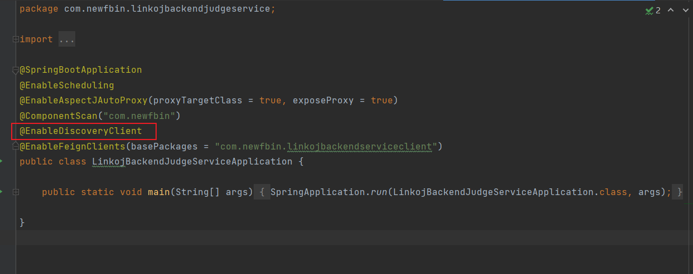

## @EnableDiscoveryClient 和 “配置文件” 的作用

在使用nacos时，需要在配置文件中添加下面的配置。

```yaml
spring:
  cloud:
    nacos:
      discovery:
        server-addr: 127.0.0.1:8848
```

还要在 Spring Boot 应用的主类上添加`@EnableDiscoveryClient`注解，如下图：



### 配置文件作用

配置主要是用于指定 Nacos 服务注册中心的地址。当程序进行**服务注册**和**服务发现**时，会配置文件中读取 Nacos 的地址。

### 注解作用

`@EnableDiscoveryClient` 是 Spring Cloud 提供的注解，其作用是启用 Spring Cloud 的服务发现功能。该注解的作用是激活**服务注册与服务发现**功能，该注解会触发 Spring Cloud 自动配置**服务发现客户端**，这个客户端负责与服务注册中心进行交互，将服务信息注册到 Nacos 上，同时自动发现注册中心的服务。

### 缺失配置文件的后果

确实配置文件的配置会导致**服务注册**和**服务发现**失败，因为没有Nacos的地址，无法实现服务注册和服务发现。

### 缺失注解的后果

缺失注解的话，Spring Cloud 将不会激活**服务发现客户端**。

这意味着微服务不会自动将自身注册到 Nacos 中，也无法从 Nacos 中发现其他服务的信息

即服务注册和服务发现功能都无法工作。