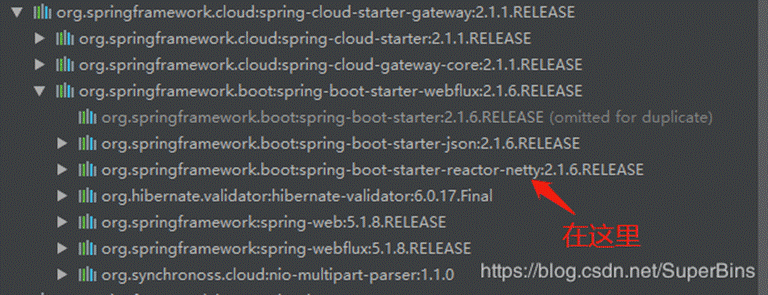
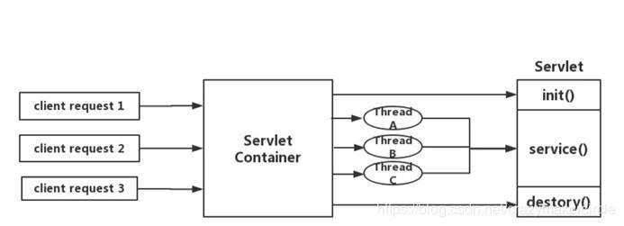
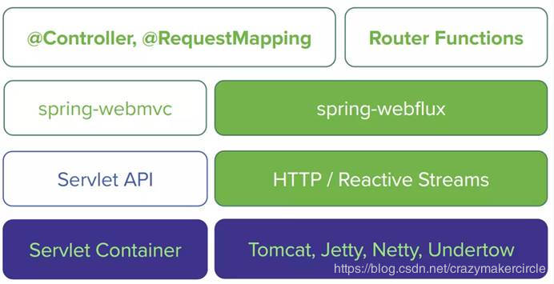
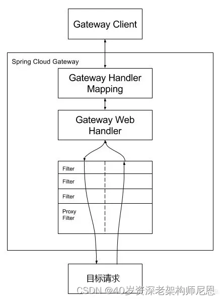

> 原文地址：https://www.cnblogs.com/crazymakercircle/p/17436191.html

## 1、SpringCloud Gateway 简介

网关是微服务架构中的一个关键的角色，用来保护、增强和控制对于微服务的访问。

网关是一个处于应用程序或服务之前的系统，用来管理授权、访问控制和流量限制等，这样微服务就会被微服务网关保护起来，对所有的调用者透明。因此，隐藏在微服务网关后面的业务系统就可以更加专注于业务本身。同时，微服务网关还可以为服务提供和沉淀更多附加功能。

下面是微服务网关的主要作用：

此类API网关的示例包括：

- Spring Cloud Gateway
- Solo.io Gloo
- Netflix Zuul
- IBM-Strongloop Loopback/Microgateway

SpringCloud Gateway 是 Spring Cloud 的一个全新项目，该项目是基于 Spring 5.0，Spring Boot 2.0 和 Project Reactor 等技术开发的网关，它旨在为微服务架构提供一种简单有效的统一的 API 路由管理方式。

SpringCloud Gateway 作为 Spring Cloud 生态系统中的网关，目标是替代 Zuul，在Spring Cloud 2.0以上版本中，没有对新版本的Zuul 2.0以上最新高性能版本进行集成，仍然还是使用的Zuul 2.0之前的非Reactor模式的老版本。而为了提升网关的性能，SpringCloud Gateway是基于WebFlux框架实现的，而WebFlux框架底层则使用了高性能的Reactor模式通信框架Netty。

Spring Cloud Gateway 的目标，不仅提供统一的路由方式，并且基于 Filter 链的方式提供了网关基本的功能，例如：安全，监控/指标，和限流。

**特别说明**：
Spring Cloud Gateway 底层使用了高性能的通信框架Netty。

Netty 是高性能中间件的通讯底座， rocketmq 、seata、nacos 、sentinel 、redission 、dubbo 等太多、太多的的大名鼎鼎的中间件，无一例外都是基于netty。

可以毫不夸张的说： **netty 是进入大厂、走向高端 的必备技能**。

要想深入了解springcloud gateway ，**最好是掌握netty 编程**。

有关 netty学习 具体请参见机工社出版 、尼恩的畅销书: [《**Java高并发核心编程 卷 1 加强版**》](https://www.cnblogs.com/crazymakercircle/p/14493539.html)

### 1.1 本文姊妹篇 《Flux 和 Mono 、reactor实战 （史上最全）》

另外，如果要掌握 springcloud gateway 的过滤器编程，或者 掌握 springcloud gateway 开发，还必须：
**具备 reactor 响应式编程的实战能力**

有关 reactor 响应式编程的实战， 具体请参考本文姊妹篇：

[《Flux 和 Mono 、reactor实战 （史上最全）》](https://www.cnblogs.com/crazymakercircle/p/16127013.html)

### 1.2 SpringCloud Gateway 特征

SpringCloud官方，对SpringCloud Gateway 特征介绍如下：

（1）基于 Spring Framework 5，Project Reactor 和 Spring Boot 2.0

（2）集成 Hystrix 断路器

（3）集成 Spring Cloud DiscoveryClient

（4）Predicates 和 Filters 作用于特定路由，易于编写的 Predicates 和 Filters

（5）具备一些网关的高级功能：动态路由、限流、路径重写

从以上的特征来说，和Zuul的特征差别不大。SpringCloud Gateway和Zuul主要的区别，还是在底层的通信框架上。

简单说明一下上文中的三个术语：

**（1）Filter（过滤器）**：

和Zuul的过滤器在概念上类似，可以使用它拦截和修改请求，并且对上游的响应，进行二次处理。过滤器为org.springframework.cloud.gateway.filter.GatewayFilter类的实例。

**（2）Route（路由）**：

网关配置的基本组成模块，和Zuul的路由配置模块类似。一个**Route模块**由一个 ID，一个目标 URI，一组断言和一组过滤器定义。如果断言为真，则路由匹配，目标URI会被访问。

**（3）Predicate（断言）**：

这是一个 Java 8 的 Predicate，可以使用它来匹配来自 HTTP 请求的任何内容，例如 headers 或参数。**断言的**输入参数类型是一个 ServerWebExchange。

### 1.3 SpringCloud Gateway和架构

Spring在2017年下半年迎来了Webflux，Webflux的出现填补了Spring在响应式编程上的空白，Webflux的响应式编程不仅仅是编程风格的改变，而且对于一系列的著名框架，都提供了响应式访问的开发包，比如Netty、Redis等等。

SpringCloud Gateway 使用的Webflux中的reactor-netty响应式编程组件，底层使用了Netty通讯框架。

#### 1.3.1 SpringCloud Zuul的IO模型

Springcloud中所集成的Zuul版本，采用的是Tomcat容器，使用的是传统的Servlet IO处理模型。

大家知道，servlet由servlet container进行生命周期管理。container启动时构造servlet对象并调用servlet init()进行初始化；container关闭时调用servlet destory()销毁servlet；container运行时接受请求，并为每个请求分配一个线程（一般从线程池中获取空闲线程）然后调用service()。

弊端：servlet是一个简单的网络IO模型，当请求进入servlet container时，servlet container就会为其绑定一个线程，在并发不高的场景下这种模型是适用的，但是一旦并发上升，线程数量就会上涨，而线程资源代价是昂贵的（上线文切换，内存消耗大）严重影响请求的处理时间。在一些简单的业务场景下，不希望为每个request分配一个线程，只需要1个或几个线程就能应对极大并发的请求，这种业务场景下servlet模型没有优势。

所以Springcloud Zuul 是基于servlet之上的一个阻塞式处理模型，即spring实现了处理所有request请求的一个servlet（DispatcherServlet），并由该servlet阻塞式处理处理。所以Springcloud Zuul无法摆脱servlet模型的弊端。虽然Zuul 2.0开始，使用了Netty，并且已经有了大规模Zuul 2.0集群部署的成熟案例，但是，Springcloud官方已经没有集成改版本的计划了。

#### 1.3.2 Webflux 服务器

Webflux模式替换了旧的Servlet线程模型。用少量的线程处理request和response io操作，这些线程称为Loop线程，而业务交给响应式编程框架处理，响应式编程是非常灵活的，用户可以将业务中阻塞的操作提交到响应式框架的work线程中执行，而不阻塞的操作依然可以在Loop线程中进行处理，大大提高了Loop线程的利用率。官方结构图：

Webflux虽然可以兼容多个底层的通信框架，但是一般情况下，底层使用的还是Netty，毕竟，Netty是目前业界认可的最高性能的通信框架。而Webflux的Loop线程，正好就是著名的Reactor 模式IO处理模型的Reactor线程，如果使用的是高性能的通信框架Netty，这就是Netty的EventLoop线程。

关于Reactor线程模型，和Netty通信框架的知识，是Java程序员的重要、必备的内功，个中的原理，具体请参见尼恩编著的《Netty、Zookeeper、Redis高并发实战》一书，这里不做过多的赘述。

### 1.3.3 Spring Cloud Gateway的处理流程

客户端向 Spring Cloud Gateway 发出请求。然后在 Gateway Handler Mapping 中找到与请求相匹配的路由，将其发送到 Gateway Web Handler。Handler 再通过指定的过滤器链来将请求发送到我们实际的服务执行业务逻辑，然后返回。过滤器之间用虚线分开是因为过滤器可能会在发送代理请求之前（“pre”）或之后（“post”）执行业务逻辑。

