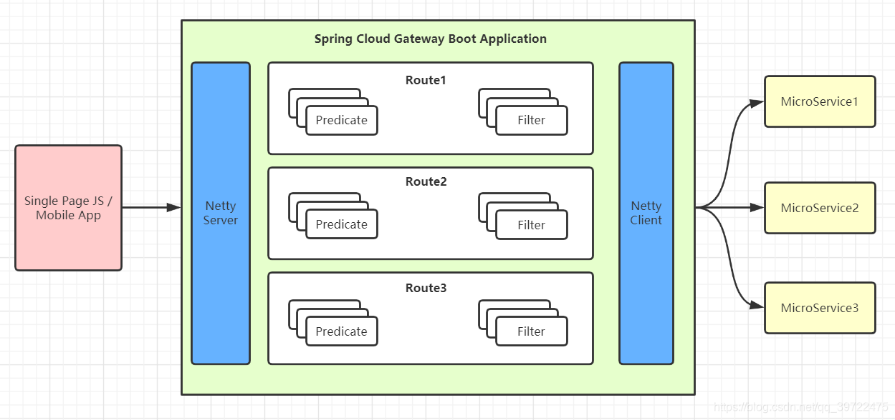

## 3、路由 匹配规则

Spring Cloud Gateway 的功能很强大，我们仅仅通过 Predicates 的设计就可以看出来，前面我们只是使用了 predicates 进行了简单的条件匹配，其实 Spring Cloud Gataway 帮我们内置了很多 Predicates 功能。

Spring Cloud Gateway 是通过 Spring WebFlux 的 HandlerMapping 做为底层支持来匹配到转发路由，Spring Cloud Gateway 内置了很多 Predicates 工厂，这些 Predicates 工厂通过不同的 HTTP 请求参数来匹配，多个 Predicates 工厂可以组合使用。



gateWay的主要功能之一是转发请求，转发规则的定义主要包含三个部分

|                         |                                                              |
| ----------------------- | ------------------------------------------------------------ |
| Route（路由）           | 路由是网关的基本单元，由ID、URI、一组Predicate、一组Filter组成，根据Predicate进行匹配转发。 |
| Predicate（谓语、断言） | 路由转发的判断条件，目前SpringCloud Gateway支持多种方式，常见如：Path、Query、Method、Header等，写法必须遵循 key=vlue的形式 |
| Filter（过滤器）        | 过滤器是路由转发请求时所经过的过滤逻辑，可用于修改请求、响应内容 |

> 其中Route和Predicate必须同时申明

例子：

```yaml
//通过配置文件配置
spring:
  cloud:
    gateway:
      routes:
        - id: gate_route
          uri: http://localhost:9023
          predicates:
          ## 当请求的路径为gate、rule开头的时，转发到http://localhost:9023服务器上
            - Path=/gate/**,/rule/**
        ### 请求路径前加上/app
          filters:
          - PrefixPath=/app
```

此文的配置，大部分在demo 工程中已经验证，在 写的过程中， 可能有格式错误

如果遇到问题，可以找尼恩

### 3.1 Predicate 断言条件(转发规则)介绍

Predicate 来源于 Java 8，是 Java 8 中引入的一个函数，Predicate 接受一个输入参数，返回一个布尔值结果。该接口包含多种默认方法来将 Predicate 组合成其他复杂的逻辑（比如：与，或，非）。可以用于接口请求参数校验、判断新老数据是否有变化需要进行更新操作。

在 Spring Cloud Gateway 中 Spring 利用 Predicate 的特性实现了各种路由匹配规则，有通过 Header、请求参数等不同的条件来进行作为条件匹配到对应的路由。网上有一张图总结了 Spring Cloud 内置的几种 Predicate 的实现。

[Spring Cloud Gateway](https://cloud.spring.io/spring-cloud-gateway/reference/html/#gateway-request-predicates-factories)


说白了 Predicate 就是为了实现一组匹配规则，方便让请求过来找到对应的 Route 进行处理，接下来我们接下 Spring Cloud GateWay 内置几种 Predicate 的使用。

- 转发规则（predicates），假设 转发uri都设定为`http://localhost:9023`

| 规则    | 实例                                                         | 说明                                                         |
| ------- | ------------------------------------------------------------ | ------------------------------------------------------------ |
| Path    | - Path=/gate/**,/rule/**                                     | ## 当请求的路径为gate、rule开头的时，转发到http://localhost:9023服务器上 |
| Before  | - Before=2017-01-20T17:42:47.789-07:00[America/Denver]       | 在某个时间之前的请求才会被转发到 http://localhost:9023服务器上 |
| After   | - After=2017-01-20T17:42:47.789-07:00[America/Denver]        | 在某个时间之后的请求才会被转发                               |
| Between | - Between=2017-01-20T17:42:47.789-07:00[America/Denver],2017-01-21T17:42:47.789-07:00[America/Denver] | 在某个时间段之间的才会被转发                                 |
| Cookie  | - Cookie=chocolate, ch.p                                     | 名为chocolate的表单或者满足正则ch.p的表单才会被匹配到进行请求转发 |
| Header  | - Header=X-Request-Id, \d+                                   | 携带参数X-Request-Id或者满足\d+的请求头才会匹配              |
| Host    | - Host=www.hd123.com                                         | 当主机名为www.hd123.com的时候直接转发到http://localhost:9023服务器上 |
| Method  | - Method=GET                                                 | 只有GET方法才会匹配转发请求，还可以限定POST、PUT等请求方式   |

#### 3.1.1 通过请求参数匹配

Query Route Predicate 支持传入两个参数，一个是属性名一个为属性值，属性值可以是正则表达式。

```yaml
server:
  port: 8080
spring:
  cloud:
    gateway:
      routes:
      - id: query_route
        uri: https://example.org
        predicates:
        - Query=smile
```

这样配置，只要请求中包含 smile 属性的参数即可匹配路由。

使用 curl 测试，命令行输入:

```
curl localhost:8080?smile=x&id=2
```

经过测试发现只要请求汇总带有 smile 参数即会匹配路由，不带 smile 参数则不会匹配。

还可以将 Query 的值以键值对的方式进行配置，这样在请求过来时会对属性值和正则进行匹配，匹配上才会走路由。

```yaml
server:
  port: 8080
spring:
  cloud:
    gateway:
      routes:
      - id: query_route
        uri: https://example.org
        predicates:
            - Query=keep, pu.
```

这样只要当请求中包含 keep 属性并且参数值是以 pu 开头的长度为三位的字符串才会进行匹配和路由。

使用 curl 测试，命令行输入:

```
curl localhost:8080?keep=pub
```

测试可以返回页面代码，将 keep 的属性值改为 pubx 再次访问就会报 404,证明路由需要匹配正则表达式才会进行路由。

#### 3.1.2 通过 Header 属性匹配

Header Route Predicate 和 Cookie Route Predicate 一样，也是接收 2 个参数，一个 header 中属性名称和一个正则表达式，这个属性值和正则表达式匹配则执行。

```yaml
server:
  port: 8080
spring:
  cloud:
    gateway:
      routes:
      - id: query_route
        uri: https://example.org
        predicates:
            - Header=X-Request-Id, \d+
```

使用 curl 测试，命令行输入:

```
curl http://localhost:8080 -H "X-Request-Id:88"
```

则返回页面代码证明匹配成功。将参数-H "X-Request-Id:88"改为-H "X-Request-Id:spring"再次执行时返回404证明没有匹配。

#### 3.1.3 通过 Cookie 匹配

Cookie Route Predicate 可以接收两个参数，一个是 Cookie name ,一个是正则表达式，路由规则会通过获取对应的 Cookie name 值和正则表达式去匹配，如果匹配上就会执行路由，如果没有匹配上则不执行。

```yaml
server:
  port: 8080
spring:
  application:
    name: api-gateway
  cloud:
    gateway:
      routes:
        -id: gateway-service
          uri: https://www.baidu.com
          order: 0
          predicates:
            - Cookie=sessionId, test
```

使用 curl 测试，命令行输入:

```
curl http://localhost:8080 --cookie "sessionId=test"
```

则会返回页面代码，如果去掉--cookie "sessionId=test"，后台汇报 404 错误。

#### 3.1.4 通过 Host 匹配

Host Route Predicate 接收一组参数，一组匹配的域名列表，这个模板是一个 ant 分隔的模板，用.号作为分隔符。它通过参数中的主机地址作为匹配规则。

```yaml
server:
  port: 8080
spring:
  cloud:
    gateway:
      routes:
      - id: query_route
        uri: https://example.org
        predicates:
          - Host=**.baidu.com
```

使用 curl 测试，命令行输入:

```
curl http://localhost:8080 -H "Host: www.baidu.com"
curl http://localhost:8080 -H "Host: md.baidu.com"
```

经测试以上两种 host 均可匹配到 host_route 路由，去掉 host 参数则会报 404 错误。

#### 3.1.5 通过请求方式匹配

可以通过是 POST、GET、PUT、DELETE 等不同的请求方式来进行路由。

```yaml
server:
  port: 8080
spring:
  cloud:
    gateway:
      routes:
      - id: query_route
        uri: https://example.org
        predicates:
            - Method=GET
```

使用 curl 测试，命令行输入:

\# curl 默认是以 GET 的方式去请求

```
curl http://localhost:8080
```

测试返回页面代码，证明匹配到路由，我们再以 POST 的方式请求测试。

\# curl 默认是以 GET 的方式去请求

```
curl -X POST http://localhost:8080
```

返回 404 没有找到，证明没有匹配上路由

#### 3.1.6 通过请求路径匹配

Path Route Predicate 接收一个匹配路径的参数来判断是否走路由。

```yaml
server:
  port: 8080
spring:
  cloud:
    gateway:
      routes:
      - id: query_route
        uri: https://example.org
        predicates:
            -Path=/foo/{segment}
```

如果请求路径符合要求，则此路由将匹配，例如：/foo/1 或者 /foo/bar。

使用 curl 测试，命令行输入:

```
curl http://localhost:8080/foo/1
curl http://localhost:8080/foo/xx
curl http://localhost:8080/boo/xx
```

经过测试第一和第二条命令可以正常获取到页面返回值，最后一个命令报404，证明路由是通过指定路由来匹配。

#### 3.1.7 通过请求 ip 地址进行匹配

Predicate 也支持通过设置某个 ip 区间号段的请求才会路由，RemoteAddr Route Predicate 接受 cidr 符号(IPv4 或 IPv6 )字符串的列表(最小大小为1)，例如 192.168.0.1/16 (其中 192.168.0.1 是 IP 地址，16 是子网掩码)。

```yaml
server:
  port: 8080
spring:
  cloud:
    gateway:
      routes:
      - id: query_route
        uri: https://example.org
        predicates:
            - RemoteAddr=192.168.1.1/24
```

可以将此地址设置为本机的 ip 地址进行测试。

curl localhost:8080

如果请求的远程地址是 192.168.1.10，则此路由将匹配。

#### 3.1.8 组合使用

```yaml
server:
  port: 8080
spring:
  application:
    name: api-gateway
  cloud:
    gateway:
      routes:
        - id: gateway-service
          uri: https://www.baidu.com
          order: 0
          predicates:
            - Host=**.foo.org
            - Path=/headers
            - Method=GET
            - Header=X-Request-Id, \d+
            - Query=foo, ba.
            - Query=baz
            - Cookie=chocolate, ch.p
```

各种 Predicates 同时存在于同一个路由时，请求必须同时满足所有的条件才被这个路由匹配。

一个请求满足多个路由的断言条件时，请求只会被首个成功匹配的路由转发

### 3.2 过滤器规则（Filter）

#### 过滤器规则（Filter）

| 过滤规则            | 实例                           | 说明                                                         |
| ------------------- | ------------------------------ | ------------------------------------------------------------ |
| PrefixPath          | - PrefixPath=/app              | 在请求路径前加上app                                          |
| RewritePath         | - RewritePath=/test, /app/test | 访问localhost:9022/test,请求会转发到localhost:8001/app/test  |
| SetPath             | SetPath=/app/                  | 通过模板设置路径，转发的规则时会在路径前增加app，{path}表示原请求路径 |
| RedirectTo          |                                | 重定向                                                       |
| RemoveRequestHeader |                                | 去掉某个请求头信息                                           |

注：当配置多个filter时，优先定义的会被调用，剩余的filter将不会生效

#### PrefixPath

对所有的请求路径添加前缀：

```yaml
spring:
  cloud:
    gateway:
      routes:
      - id: prefixpath_route
        uri: https://example.org
        filters:
        - PrefixPath=/mypath
```

访问/hello的请求被发送到`https://example.org/mypath/hello`。

#### RedirectTo

重定向，配置包含重定向的返回码和地址：

```yaml
spring:
  cloud:
    gateway:
      routes:
      - id: prefixpath_route
        uri: https://example.org
        filters:
        - RedirectTo=302, https://acme.org
```

#### RemoveRequestHeader

去掉某个请求头信息：

```yaml
spring:
  cloud:
    gateway:
      routes:
      - id: removerequestheader_route
        uri: https://example.org
        filters:
        - RemoveRequestHeader=X-Request-Foo
```

去掉请求头信息 X-Request-Foo

#### RemoveResponseHeader

去掉某个回执头信息：

```yaml
spring:
  cloud:
    gateway:
      routes:
      - id: removerequestheader_route
        uri: https://example.org
        filters:
        - RemoveResponseHeader=X-Request-Foo
```

#### RemoveRequestParameter

去掉某个请求参数信息：

```yaml
spring:
  cloud:
    gateway:
      routes:
      - id: removerequestparameter_route
        uri: https://example.org
        filters:
        - RemoveRequestParameter=red
```

#### RewritePath

改写路径：

```yaml
spring:
  cloud:
    gateway:
      routes:
      - id: rewrite_filter
        uri: http://localhost:8081
        predicates:
        - Path=/test/**
        filters:
        - RewritePath=/where(?<segment>/?.*), /test(?<segment>/?.*)
```

#### SetPath

设置请求路径，与RewritePath类似。

```yaml
spring:
  cloud:
    gateway:
      routes:
      - id: setpath_route
        uri: https://example.org
        predicates:
        - Path=/red/{segment}
        filters:
        - SetPath=/{segment}
```

如/red/blue的请求被转发到/blue。

#### SetRequestHeader

设置请求头信息。

```yaml
spring:
  cloud:
    gateway:
      routes:
      - id: setrequestheader_route
        uri: https://example.org
        filters:
        - SetRequestHeader=X-Request-Red, Blue
```

#### SetStatus

设置回执状态码。

```yaml
spring:
  cloud:
    gateway:
      routes:
      - id: setstatusint_route
        uri: https://example.org
        filters:
        - SetStatus=401
```

#### StripPrefix

跳过指定路径。

```yaml
spring:
  cloud:
    gateway:
      routes:
      - id: nameRoot
        uri: https://nameservice
        predicates:
        - Path=/name/**
        filters:
        - StripPrefix=2
```

请求/name/blue/red会转发到/red。

#### RequestSize

请求大小。

```yaml
spring:
  cloud:
    gateway:
      routes:
      - id: request_size_route
        uri: http://localhost:8080/upload
        predicates:
        - Path=/upload
        filters:
        - name: RequestSize
          args:
            maxSize: 5000000
```

超过5M的请求会返回413错误。

#### Default-filters

对所有请求添加过滤器。

```yaml
spring:
  cloud:
    gateway:
      default-filters:
      - AddResponseHeader=X-Response-Default-Red, Default-Blue
      - PrefixPath=/httpbin
```

### 3.3 通过代码进行配置

通过代码进行配置，将路由规则设置为一个Bean即可：

```java
    @Bean
    public RouteLocator customRouteLocator(RouteLocatorBuilder builder) {
        return builder.routes()
            .route("path_route", r -> r.path("/get")
                .uri("http://httpbin.org"))
            .route("host_route", r -> r.host("*.myhost.org")
                .uri("http://httpbin.org"))
            .route("rewrite_route", r -> r.host("*.rewrite.org")
                .filters(f -> f.rewritePath("/foo/(?<segment>.*)", "/${segment}"))
                .uri("http://httpbin.org"))
            .route("hystrix_route", r -> r.host("*.hystrix.org")
                .filters(f -> f.hystrix(c -> c.setName("slowcmd")))
                .uri("http://httpbin.org"))
            .route("hystrix_fallback_route", r -> r.host("*.hystrixfallback.org")
                .filters(f -> f.hystrix(c -> c.setName("slowcmd").setFallbackUri("forward:/hystrixfallback")))
                .uri("http://httpbin.org"))
            .route("limit_route", r -> r
                .host("*.limited.org").and().path("/anything/**")
                .filters(f -> f.requestRateLimiter(c -> c.setRateLimiter(redisRateLimiter())))
                .uri("http://httpbin.org"))
            .build();
    }
```

### 3.4 实现熔断降级

为什么要实现熔断降级？

在分布式系统中，网关作为流量的入口，因此会有大量的请求进入网关，向其他服务发起调用，其他服务不可避免的会出现调用失败（超时、异常），失败时不能让请求堆积在网关上，需要快速失败并返回给客户端，想要实现这个要求，就必须在网关上做熔断、降级操作。

为什么在网关上请求失败需要快速返回给客户端？

因为当一个客户端请求发生故障的时候，这个请求会一直堆积在网关上，当然只有一个这种请求，网关肯定没有问题（如果一个请求就能造成整个系统瘫痪，那这个系统可以下架了），但是网关上堆积多了就会给网关乃至整个服务都造成巨大的压力，甚至整个服务宕掉。因此要对一些服务和页面进行有策略的降级，以此缓解服务器资源的的压力，以保证核心业务的正常运行，同时也保持了客户和大部分客户的得到正确的相应，所以需要网关上请求失败需要快速返回给客户端。

```yaml
server.port: 8082

spring:
  application:
    name: gateway
  redis:
      host: localhost
      port: 6379
      password: 123456
  cloud:
    gateway:
      routes:
        - id: rateLimit_route
          uri: http://localhost:8000
          order: 0
          predicates:
            - Path=/test/**
          filters:
            - StripPrefix=1
            - name: Hystrix
              args:
                name: fallbackCmdA
                fallbackUri: forward:/fallbackA

  hystrix.command.fallbackCmdA.execution.isolation.thread.timeoutInMilliseconds: 5000
```

这里的配置，使用了两个过滤器：

（1）过滤器StripPrefix，作用是去掉请求路径的最前面n个部分截取掉。

StripPrefix=1就代表截取路径的个数为1，比如前端过来请求`/test/good/1/view`，匹配成功后，路由到后端的请求路径就会变成`http://localhost:8888/good/1/view`。

（2）过滤器Hystrix，作用是通过Hystrix进行熔断降级

当上游的请求，进入了Hystrix熔断降级机制时，就会调用fallbackUri配置的降级地址。需要注意的是，还需要单独设置Hystrix的commandKey的超时时间

fallbackUri配置的降级地址的代码如下：

```java
@RestController
public class FallbackController {

  @GetMapping("/fallbackA")
  public Mono<Void> fallbackA(ServerWebExchange exchange) {
    exchange.getResponse().setStatusCode(HttpStatus.NOT_ACCEPTABLE);
    ServerHttpResponse serverHttpResponse = exchange.getResponse();
    serverHttpResponse.getHeaders().add("Content-Type", "application/json;charset=UTF-8");
    RestOut<String> stringMasResponse = RestOut.error("服务不可用");
    byte[] jsonBytes = JsonUtil.object2JsonBytes(stringMasResponse);
    DataBuffer buffer = serverHttpResponse.bufferFactory().wrap(jsonBytes);
    return serverHttpResponse.writeWith(Mono.just(buffer));
  }
}
```

