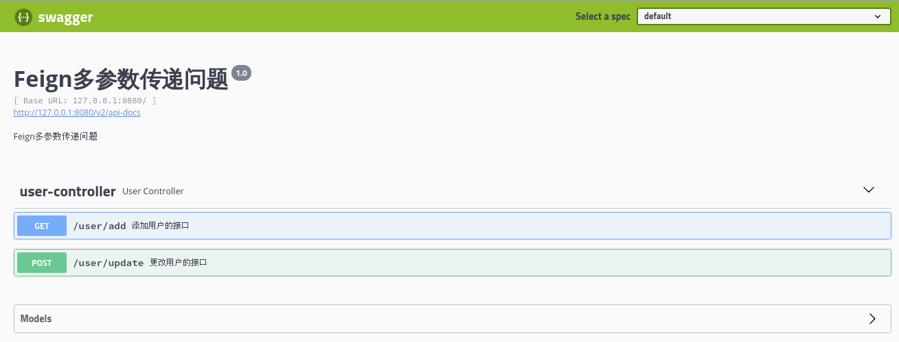
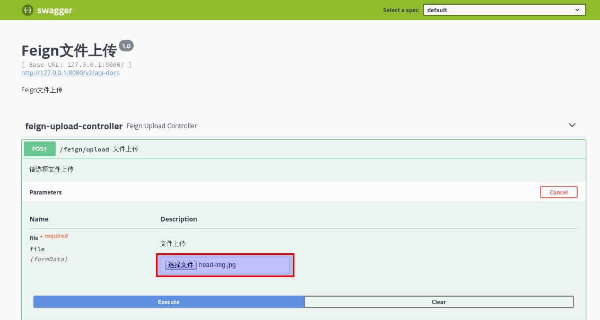

## Spring Cloud OpenFeign 介绍

### Feign 概述

在使用 Spring Cloud 开发微服务应用时，各个服务提供者都是以 HTTP 接口的形式对外提供服务，因此在服务消费者调用服务提供者时，底层通过 HTTP Client 的方式访问。此时可以使用 JDK 原生的 URLConnection、Apache 的 HTTP Client、Netty 的异步 HTTP Client 或者 Spring 的 RestTemplate 去实现服务间的调用。但是最方便、最优雅的方式是通过 Feign 进行服务间的调用。Feign 是由 Netflix 开发的一个声明式的 Web Service 客户端，它的出现使开发 Web Service 客户端变得很简单；Feign 同时也是一款声明式、模板化的 HTTP 客户端。更多介绍可参考：[Feign 项目](https://github.com/OpenFeign/feign)、[Spring Cloud Feign 官方中文教程](https://www.springcloud.cc/spring-cloud-dalston.html#spring-cloud-feign)

### Spring Cloud OpenFeign 概述

Spring Cloud OpenFeign 对 Feign 进行了二次封装，使得在 Spring Cloud 中使用 Feign 的时候，可以做到使用 HTTP 请求访问远程服务，就像调用本地方法一样的，开发者完全感知不到这是在调用远程访问，更感知不到在访问 HTTP 请求。Spring Cloud OpenFeign 增强了 Feign 的功能，使 Feign 有限支持 Spring MVC 的注解，如 `@RequestMapping` 等。OpenFeign 的 `@FeignClient` 注解可以解析 Spring MVC 的 `@RequestMapping` 注解下的接口，并通过动态代理的方式产生实现类，在实现类中做负载均衡并调用其他服务，默认集成了 Ribbon 与 Hystrix。更多介绍可参考：[Spring Cloud OpenFeign 项目](https://github.com/spring-cloud/spring-cloud-openfeign)

### Spring Cloud OpenFeign 的特性

- [Feign 最新特性一览图](https://www.techgrow.cn/asset/2020/03/feign-features.png)
- 支持 Hystrix 和 它的 Fallback
- 支持 HTTP 请求的响应和压缩
- 支持 Ribbon 的负载均衡客户端
- 支持可插拔的 HTTP 编码器和解码器
- 可插拔的注解支持，包括 Feign 注解 和 JAX-RS 注解

### Feign 与 Spring Cloud OpenFeign 的选择

Spring Cloud F 及 F 版本以上与 Spring Boot 2.0 以上一般使用 OpenFeign，如果从框架结构上看，OpenFeign 就是 2019 年 Feign 停更后出现的版本，也可以说大多数新项目都用 OpenFeign，而 2018 年以前的项目一般使用 Feign，大概可以这样粗率地划分。

## Spring Cloud OpenFeign 入门案例

### 1. 版本说明

在下面的的教程中，使用的 Spring Cloud 版本是 Finchley.RELEASE，对应的 Spring Boot 版本是 2.0.3，[点击下载](https://www.techgrow.cn/downloads/2020/04/feign-demo.zip)完整的案例代码。**由于篇幅有限，下文中若没特殊说明，Feign 一般指的就是 Spring Cloud OpenFeign。**

### 2. 创建 Maven 父级 Pom 工程

在父工程里面配置好工程需要的父级依赖，目的是为了更方便管理与简化配置，具体 Maven 配置如下：

```xml
<parent>
    <groupId>org.springframework.boot</groupId>
    <artifactId>spring-boot-starter-parent</artifactId>
    <version>2.0.3.RELEASE</version>
</parent> 
<!-- 利用传递依赖，公共部分 -->
<dependencies>
    <dependency>
        <groupId>org.springframework.boot</groupId>
        <artifactId>spring-boot-starter-web</artifactId>
    </dependency>
</dependencies> 
<!-- 管理依赖 -->
<dependencyManagement>
    <dependencies>
        <dependency>
            <groupId>org.springframework.cloud</groupId>
            <artifactId>spring-cloud-dependencies</artifactId>
            <version>Finchley.RELEASE</version>
            <type>pom</type>
            <scope>import</scope>
        </dependency>
    </dependencies>
</dependencyManagement> 
<!--注意：这里需要添加以下配置，否则可能会有各种依赖问题 -->
<repositories>
    <repository>
        <id>spring-milestones</id>
        <name>Spring Milestones</name>
        <url>https://repo.spring.io/libs-milestone</url>
        <snapshots>
            <enabled>false</enabled>
        </snapshots>
    </repository>
</repositories> 
```

### 3. 创建 Eureka Server 工程

创建 Eureka Server 的 Maven 工程，配置工程里的 `pom.xml` 文件，需要引入 `spring-cloud-starter-netflix-eureka-server`

```xml
<dependencies>
    <dependency>
        <groupId>org.springframework.cloud</groupId>
        <artifactId>spring-cloud-starter-netflix-eureka-server</artifactId>
    </dependency>
</dependencies> 
```

创建 Eureka Server 的启动主类，这里添加相应注解，作为程序的入口：

```java
@SpringBootApplication
@EnableEurekaServer
public class EurekaServerApplication {
    public static void main(String[] args) {
        SpringApplication.run(EurekaServerApplication.class, args);
    }
} 
```

添加 Eureka Server 需要的 `application.yml` 配置文件到工程中

```yaml
server:
  port: 8090
eureka:
  instance:
    hostname: 127.0.0.1
  client:
    registerWithEureka: false
    fetchRegistry: false
    serviceUrl:
      defaultZone: http://${eureka.instance.hostname}:${server.port}/eureka/
```

### 4. 创建 Provider 源服务工程

为了测试 Feign 的 Web 服务客户端的功能，必须要有一个源服务（服务提供者），并且可以选择启动多个实例，在每个实例中需要有一个标识（例如端口）来识别每次的调用是到了不同的服务实例上。这里可以使用一份代码，采取改变端口号的方式启动多次，就能启动多个相同的服务实例。

创建 Provider 的 Maven 工程后，由于需要将服务注册到 Eureka Server，工程下的 `pom.xml` 文件需要引入 `spring-cloud-starter-netflix-eureka-client`

```xml
<dependencies>
    <dependency>
        <groupId>org.springframework.cloud</groupId>
        <artifactId>spring-cloud-starter-netflix-eureka-client</artifactId>
    </dependency>
</dependencies> 
```

创建 Provider 的启动主类，添加注解 `@EnableDiscoveryClient`，将服务注册到 Eureka Server：

```java
@SpringBootApplication
@EnableDiscoveryClient
public class ProviderApplication {
    public static void main(String[] args) {
        SpringApplication.run(ProviderApplication.class, args);
    }
} 
```

在 `application.yml` 文件中指定**服务名称（`provider`）**、注册中心地址与端口号，后面启动多实例只需要修改这里的端口号即可：

```yaml
server:
  port: 9090
spring:
  application:
    name: provider
eureka:
  client:
    service-url:
      defaultZone: http://127.0.0.1:8090/eureka
  instance:
    prefer-ip-address: true
```

创建用于测试的 Controller 类：

```java
@RestController
public class ProviderController {
    @GetMapping("/provider/add")
    public String add(Integer a, Integer b, HttpServletRequest request) {
        return "From Port: " + request.getServerPort() + ", Result: " + (a + b);
    }
} 
```

### 5. 创建 Feign Client 工程

创建 Feign Client 的 Maven 工程，配置工程里的 pom.xml 文件，需要引入 `spring-cloud-starter-openfeign`；若是使用旧版的 Spring Cloud，则改为引入 `spring-cloud-starter-feign`。

另外由于需要从 Eureka Server 获取服务列表，即作为 Eureka 客户端，还需要引入 `spring-cloud-starter-netflix-eureka-client`。

```xml
<dependencies>
    <dependency>
        <groupId>org.springframework.cloud</groupId>
        <artifactId>spring-cloud-starter-openfeign</artifactId>
    </dependency>
    <dependency>
        <groupId>org.springframework.cloud</groupId>
        <artifactId>spring-cloud-starter-netflix-eureka-client</artifactId>
    </dependency>
</dependencies> 
```

创建启动主类，添加注解 `@EnableFeignClients`、`@EnableDiscoveryClient`

```java
@EnableFeignClients
@EnableDiscoveryClient
@SpringBootApplication
public class FeignApplication {
    public static void main(String[] args) {
        SpringApplication.run(FeignApplication.class, args);
    }
} 
```

创建服务接口类，用于调用 Provider 源服务：

```java
@FeignClient(value = "PROVIDER")
public interface ProviderClientService {
    @GetMapping("/provider/add")
    String add(@RequestParam("a") Integer a, @RequestParam("b") Integer b);
} 
```

创建用于测试的 Controller 类，因为需要创建一个 API 来供第三方调用 Provider 源服务的那个自定义 API：

```java
@RestController
public class CalculateController {
    @Autowired
    private ProviderClientService clientService;

    @GetMapping("/add")
    public String add(Integer a, Integer b) {
        return clientService.add(a, b);
    }
} 
```

在 `application.yml` 文件中配置端口号、注册中心地址：

```yaml
server:
  port: 8080
spring:
  application:
    name: feign-client
eureka:
  client:
    service-url:
      defaultZone: http://127.0.0.1:8090/eureka
  instance:
    prefer-ip-address: true
```

### 6. 测试

1. 启动 Eureka Server 后，更改 Provider 源服务的端口号为 9091 与 9092 后分别启动，浏览器访问 `http://127.0.0.1:8090`，查看 Eureka Server 的界面是否正常显示多个 Provider 源服务
2. 启动 Feign Client 应用，浏览器访问 `http://localhost:8080/add?a=3&b=9`，若正常返回计算结果，说明整个项目运行成功
3. 提示：由于 Feign 默认集成了 Ribbon（客户端负载均衡），当存在多个服务提供者时，Feign 默认会使用轮询的方式访问源服务，此外 Feign 对服务实例节点的增减也能动态感知

## Spring Cloud OpenFeign 基础功能

### Feign 的工作原理

- 开发微服务应用时，在主程序入口添加 `@EnableFeignClients` 注解开启对 Feign Client 扫描加载处理。根据 Feign Client 的开发规范，需要定义接口并添加 `@FeignClient` 注解。
- 当程序启动时，会进行包扫描，扫描所有标注了 `@FeignClient` 注解的类，并将这些信息注入 Spring IOC 容器中。
- 当定义的 Feign 接口中的方法被调用时，通过 JDK 的代理方式，来生成具体的 RequestTemplate。生成代理时，Feign 会为每个接口方法创建一个 RestTemplate 对象，该对象封装了 HTTP 请求需要的全部信息，如请求参数名、请求方法等信息都在这个过程中确定。
- 然后由 RestTemplate 生成 Request，接着把 Request 交给 Client 去处理，这里指的 Client 可以是 JDK 原生的 URLConnection、Apache 的 Http Client、也可以是 Okhttp。最后 Client 被封装到 LoadBalanceClient 类中，这个类结合 Ribbon 客户端负载均衡发起服务间的调用。

### @FeignClient 注解的属性

- name：指定 FeignClient 的名称，如果项目使用了 Ribbon，那么 name 属性会作为微服务的名称，用于服务发现
- url：一般用于调试，可以手动指定 `@FeignClient` 调用的服务地址
- decode404：当发生 404 错误时，如果该字段值为 true，会调用 decoder 进行解码，否则抛出 `FeignException`
- configuration：Feign 配置类，可以自定义 Feign 的 Encoder、Decoder、LogLevel、Contract
- fallback：定义容错的处理类，当调用远程接口失败或超时，会调用对应接口的容错逻辑，fallback 指定的类必须实现 `@FeignClient` 标记的接口
- fallbackFactory：工厂类，用于生成 fallback 类示例，通过这个属性可以实现每个接口通用的容错逻辑，减少重复的代码
- path：定义当前 FeignClient 的统一前缀

### Feign 属性文件配置

若希望对单个指定特定名称的 Feign 进行配置，此时可以将 `@FeignClient` 注解的属性配置写在 `application.yml` 或者 `application.properties`，配置示例如下：

```yaml
feign:
  client:
    config:
      feignName:
        # 需要配置的FeignName
        connectTimeout: 5000
        # 连接超时时间
        readTimeout: 5000
        # 读超时时间设置
        loggerLevel: full
        # 配置Feign的日志级别
        errorDecoder: com.example.SimpleErrorDecoder
        # Feign的错误解码器
        retryer: com.example.SimpleRetryer
        # 配置重试
        requestInterceptors:
          # 配置拦截器
          - com.example.FooRequestInterceptor
          - com.example.BarRequestInterceptor
        decode404: false
        encoder: com.example.SimpleEncoder
        # Feign的编码器
        decoder: com.example.SimpleDecoder
        # Feign的解码器
        contract: com.example.SimpleContract
        # Feign的Contract配置
```

作用于所有 Feign 的配置方式，如果想使用 `application.yml` 或者 `application.properties` 来配置所有 Feign，可以使用下述配置：

```yaml
feign:
  client:
    config:
      default:
        readTimeout: 5000
        loggerLevel: full
        connectTimeout: 5000
```

`@EnableFeignClients` 注解上有个 `defaultConfiguration` 属性，可以将默认配置统一写在一个配置类中，然后在主程序入口用 `defaultConfiguration` 来应用配置类，该配置方式同样可以作用于所有 Feign

```java
@SpringBootApplication
@EnableDiscoveryClient
@EnableFeignClients(defaultConfiguration = DefaultFeignConfiguration.class)
public class FeignApplication {
    public static void main(String[] args) {
        SpringApplication.run(FeignApplication.class, args);
    }
} 
```

**特别注意**：如果通过 Java 代码的方式配置过 Feign，然后又通过 `application.yml` 或者 `application.properties` 属性文件的方式配置 Feign，默认情况下属性文件中 Feign 的配置会覆盖 Java 代码的配置。但是可以通过使用参数 `feign.client.default-to-properties=false` 来改变 Feign 配置生效的优先级。

### Feign Client 开启日志

Feign 为每一个 FeignClient 都提供了一个 `feign.Logger` 实例，可以在配置中开启日志，开启方式比较简单，分为两步。

第一步：在 `application.yml` 中配置日志输出，默认情况下，记录器的名称是用于创建 Feign 客户端的接口的完整类名，Feign 日志记录仅响应 DEBUG 级别

```yaml
logging:
  level:
    com.springcloud.study.service.ProviderClientService: debug
```

第二步：通过 Java 代码的方式配置日志 Bean，可以配置在主程序入口类或者带有 `@Configuration` 注解的类，作用是通过配置的 `Logger.Level` 对象告诉 Feign 记录哪些日志内容

```java
@Configuration
public class FeignServiceConfig {
    /**
     * Logger.Level 的具体级别如下：
     * NONE：不记录任何信息
     * BASIC：仅记录请求方法、URL以及响应状态码和执行时间
     * HEADERS：除了记录 BASIC 级别的信息外，还会记录请求和响应的头信息
     * FULL：记录所有请求与响应的明细，包括头信息、请求体、元数据
     *
     * @return
     */
    @Bean
    Logger.Level feignLoggerLevel() {
        return Logger.Level.FULL;
    }
}
```

### Feign 开启 GZIP 压缩

Feign 支持对请求和响应进行 GZIP 压缩，以此提高通信效率，下述内容配置了 Consumer 通过 Feign 到 Provider 的请求与相应的 Gzip 压缩（在服务消费者端配置）

```yaml
feign:
  compression:
    request:
      enabled: true
      # 配置压缩支持的MIME TYPE
      mime-types: text/xml,application/xml,application/json
      # 配置压缩数据大小的下限
      min-request-size: 2048
    response:
      # 配置响应GZIP压缩
      enabled: true
```

由于开启 GZIP 压缩后，Feign 之间的调用是通过二进制协议进行传输的，若服务之间的调用结果出现了乱码，此时可以将返回值的类型修改为 `ResponseEntity<byte[]>`，其中的 Controller 类 与被 `@FeignClient` 注解标注的接口都要修改

```java
@FeignClient(value = "PROVIDER")
public interface ProviderClientService {
    @GetMapping("/provider/say")
    ResponseEntity<byte[]> String

    say(@RequestParam("msg") String msg);
} 
```

```java
@RestController
public class CalculateController {
    @Autowired
    private ProviderClientService clientService;

    @GetMapping("/say")
    public ResponseEntity<byte[]> say(String msg) {
        return clientService.say(msg);
    }
} 
```

验证压缩效果，首先开启 Feign 的日志输出，然后分别启用 Feign 压缩与关闭 Feign 压缩，观察前后输出的日志信息：

关闭 GZIP 压缩的 Request

```properties
---> GET http://PROVIDER/provider/say?msg=hello HTTP/1.1 ---> END HTTP (0-byte body) 
```

开启 GZIP 压缩的 Request，增加了 `Accept-Encoding: gzip`，证明 Request 开启了 GZIP 压缩

```properties
---> GET http://PROVIDER/provider/say?msg=hello HTTP/1.1 Accept-Encoding: gzip Accept-Encoding: deflate ---> END HTTP (0-byte body) 
```

### Feign 的超时设置

Feign 的调用分为两层，即 Ribbon 的调用和 Hystrix 的调用；其中高版本的 Feign 默认关闭了 Hystrix，而 Ribbon 默认是启用了。首先根据超时的异常日志信息，判断是 Ribbon 超时 还是 Hystrix 超时导致了异常的发生，然后根据判断结果添加 Ribbon 或者 Hystrix 的超时配置信息即可。例如：下述配置内容是针对 `provider` 服务添加与 Ribbon 超时相关的配置参数：

```yaml
PROVIDER:
  ribbon:
    ConnectTimeout: 3000
    ReadTimeout: 60000
```

### Feign 使用注意事项

- 在 Feign Client 接口中，不支持 GET 方法直接绑定 POJO 等复杂对象
- 在 Feign Client 接口中，如果使用到 `@PathVariable`，必须指定其 `value`
- 在 Feign Client 接口中，不能使用 `@GetMapping` 之类的组合注解，只支持使用 `@RequestMapping` 这类基础注解
- `@FeignClient` 的属性中，`serviceId` 属性已经失效，推荐使用 `name` 属性
- `@FeignClient` 的属性中，在老版本的 Spring Cloud 使用 `url` 属性时，不需要提供 `name` 属性；但在新版本中里必须提供 `name` 属性，并且 `name`、`url` 属性支持占位符
- 若需要自定义单个 Feign Client 的配置，此时被 `@Configuration` 注解标注的类，不允许被 `@ComponentScan` 注解扫描到，否则将会导致所有的 Feign Client 都会使用该配置

## Spring Cloud OpenFeign 实战应用

### Feign 默认 Client 的替换

Feign 在默认情况下使用的是 JDK 原生的 URLConnection 发送 HTTP 请求，没有使用连接池，但是对每个地址都会保持一个长连接，即利用 HTTP 的 `persistence connections`。

开发者可以用 Apache 的 HTTP Client 替换 Feign 原始的 HTTP Client，通过设置连接池、超时时间等对服务之间的调用进行调优。通过查看源码，在类 `feign.Client.Default` 中可以看到以下代码，默认执行 HTTP 请求的就是 URLConnection。

而在类 `org.springframework.cloud.openfeign.ribbon.FeignRibbonClientAutoConfiguration` 中，可以看到引入了三个类：`HttpClientFeignLoadBalancedConfiguration`、`OkHttpFeignLoadBalancedConfiguration`、`DefaultFeignLoadBalancedConfiguration`，其中可以看到在 `DefaultFeignLoadBalancedConfiguration` 中，使用的是 `feign.Client.Default`，即使用了 URLConnection。

```java
public static class Default implements Client {
    public Response execute(Request request, Options options) throws IOException {
        HttpURLConnection connection = this.convertAndSend(request, options);
        return this.convertResponse(connection).toBuilder().request(request).build();
    }
} 
```

```java
class DefaultFeignLoadBalancedConfiguration {
    @Bean
    @ConditionalOnMissingBean
    public Client feignClient(CachingSpringLoadBalancerFactory cachingFactory, SpringClientFactory clientFactory) {
        return new LoadBalancerFeignClient(new Default((SSLSocketFactory) null, (HostnameVerifier) null), cachingFactory, clientFactory);
    }
} 
```

#### 使用 HTTP Client 替换

使用 Apache HTTP Client 替换 Feign 默认的 Client，替换步骤非常简单，只需要在 `pom.xml` 与 `application.yml` 分别添加以下配置内容即可：

```xml
<!-- 引入 HTTP Client -->
<dependency>
    <groupId>org.apache.httpcomponents</groupId>
    <artifactId>httpclient</artifactId>
</dependency> 
<!-- 引入 Feign 对 Http Client 的支持 -->
<dependency>
    <groupId>com.netflix.feign</groupId>
    <artifactId>feign-httpclient</artifactId>
    <version>8.17.0</version>
</dependency> 
```

```yaml
feign:
  httpclient:
    enabled: true
```

验证默认 Client 的替换：

在类 `HttpClientFeignLoadBalancedConfiguration` 上，声明了注解 `@ConditionalOnClass(ApacheHttpClient.class)`、`@ConditionalOnProperty(value = "feign.httpclient.enabled", matchIfMissing = true)`，即只有在 `ApacheHttpClient` 类存在且 `feign.httpclient.enabled` 为 `true` 时才会启用配置。

此时可以在 `HttpClientFeignLoadBalancedConfiguration.feignClient()` 方法里打上断点（约第 43 行），重新启动项目，可以看到确实进行了 `ApacheHttpClient` 的声明；再将 `feign.httpclient.enabled` 设置为 `false` 后，断点就进不来了，由此可以验证 `ApacheHttpClient` 替换成功。

#### 使用 Okhttp 替换

使用 Okhttp 替换 Feign 默认的 Client，同样只需要在 `pom.xml` 与 `application.yml` 分别添加以下配置内容；验证是否替换成功，具体可以参考上述验证步骤，在 `OkHttpFeignLoadBalancedConfiguration.feignClient()` 方法里打断点调试。

```xml
<!-- 引入 Feign 对 Okhttp 的支持 -->
<dependency>
    <groupId>io.github.openfeign</groupId>
    <artifactId>feign-okhttp</artifactId>
</dependency> 
```

```yaml
feign:
  okhttp:
    enabled: true
```

若需要对 Okhttp 进行个性化的参数设置，可参考以下代码，其中 Okhttp 的特性有：

- 支持 SPDY，可以合并多个到同一个主机的请求
- 使用连接池技术减少请求的延迟（如果 SPDY 是可用的话）
- 使用 GZIP 压缩减少传输的数据量
- 缓存响应结果，避免重复的网络请求

```java
@Configuration
@ConditionalOnClass(Feign.class)
@AutoConfigureBefore(FeignAutoConfiguration.class)
public class FeignOkHttpConfig {

    @Bean
    public okhttp3.OkHttpClient okHttpClient() {
        return new okhttp3.OkHttpClient.Builder()
                // 设置连接超时
               .connectTimeout(60, TimeUnit.SECONDS)
                // 设置读超时
               .readTimeout(60, TimeUnit.SECONDS)
                // 设置写超时
               .writeTimeout(60, TimeUnit.SECONDS)
                // 是否自动重连
               .retryOnConnectionFailure(true)
               .connectionPool(new ConnectionPool())
                // 构建 OkHttpClient 对象
               .build();
    }
}
```

### Post 和 Get 的多参数传递

多参数传递方案介绍

在企业项目的开发过程中，使用 Feign 实现服务与服务之间的调用时，无法避免多参数的传递。众所周知，在 Web 开发中 Spring MVC 是支持 GET 方法直接绑定 POJO 的，但是 Feign 的实现并未覆盖所有 Spring MVC 的功能，目前解决方式很多，最常见的解决方式如下：

- 将方法参数封装成 Map 传递
- 通过 Feign 拦截器的方式处理（推荐）
- 将 POJO 拆散一个个单独的属性放在方法参数里
- 使用 GET 传递 `@RequestBody`，但此方式违反了 Restful 规范

多参数传递的示例代码

这里主要介绍通过 Feign 拦截器处理的方式，通过实现 Feign 的 `RequestInterceptor` 中的 `aplly` 方法，来进行统一拦截转换处理 Feign 中的 GET 方法多参数传递的问题。由于篇幅有限，下面只贴出核心代码，完整的示例代码可以[点击这里](https://www.techgrow.cn/downloads/2020/04/feign-params-demo.zip)下载。

为了方便测试服务之间的接口调用，在 Consumer 端（服务消费者）整合 Swagger2， `pom.xml` 加入以下配置：

```xml
<!-- Swagger2 -->
<dependency>
    <groupId>io.springfox</groupId>
    <artifactId>springfox-swagger2</artifactId>
    <version>2.9.2</version>
</dependency>
<dependency>
    <groupId>io.springfox</groupId>
    <artifactId>springfox-swagger-ui</artifactId>
    <version>2.9.2</version>
</dependency> 
```

在 Consumer 端（服务消费者）编写 Feign 拦截器代码，由于 Feign 不支持 GET 方法传 POJO，因此手动将 Json Body 转换为 Query：

```java
@Component
public class FeignRequestInterceptor implements RequestInterceptor {

    @Autowired
    private ObjectMapper objectMapper;

    @Override
    public void apply(RequestTemplate template) {
        // Feign 不支持 GET 方法传 POJO, 将 Json Body 转换为 Query
        if (template.method().equals("GET") && template.body() != null) {
            try {
                JsonNode jsonNode = objectMapper.readTree(template.body());
                template.body(null);

                Map<String, Collection<String>> queries = new HashMap<>();
                buildQuery(jsonNode, "", queries);
                template.queries(queries);
            } catch (IOException e) {
                // 根据实践项目情况处理此处异常
                e.printStackTrace();
            }
        }
    }

    private void buildQuery(JsonNode jsonNode, String path, Map<String, Collection<String>> queries) {
        // 叶子节点
        if (!jsonNode.isContainerNode()) {
            if (jsonNode.isNull()) {
                return;
            }
            Collection<String> values = queries.get(path);
            if (values == null) {
                values = new ArrayList<>();
                queries.put(path, values);
            }
            values.add(jsonNode.asText());
            return;
        }

        // 数组节点
        if (jsonNode.isArray()) {
            Iterator<JsonNode> it = jsonNode.elements();
            while (it.hasNext()) {
                buildQuery(it.next(), path, queries);
            }
        } else {
            Iterator<Map.Entry<String, JsonNode>> it = jsonNode.fields();
            while (it.hasNext()) {
                Map.Entry<String, JsonNode> entry = it.next();
                if (StringUtils.hasText(path)) {
                    buildQuery(entry.getValue(), path + "." + entry.getKey(), queries);
                } else {
                    // 根节点
                    buildQuery(entry.getValue(), entry.getKey(), queries);
                }
            }
        }
    }
}
```

编写 Consumer 端（服务消费者）的 Feign Client 接口类：

```java
@FeignClient(name = "PROVIDER")
public interface UserFeignService {
    /**
     * 默认情况下，Feign 不支持 GET 方法传 POJO
     * @param user
     * @return
     */
    @RequestMapping(value = "/user/add", method = RequestMethod.GET)
    String addUser(User user);

    @RequestMapping(value = "/user/update", method = RequestMethod.POST)
    String updateUser(@RequestBody User user);
}
```

使用 Swagger2，并编写 Consumer 端（服务消费者）的 Controller 类，用于调用 Feign Client 进行 GET 或者 POST 多参数传递

```java
@RestController
@Api("用户管理相关接口")
@RequestMapping("/user")
public class UserController {

    @Autowired
    private UserFeignService userFeignService;

    /**
     * 用于演示 Feign 的 Get 请求多参数传递
     * @param user
     * @return
     */
    @ApiOperation("添加用户的接口")
    @RequestMapping(value = "/add", method = RequestMethod.GET)
    public String addUser(@ApiParam(name = "用户", required = true) User user) {
        return userFeignService.addUser(user);
    }

    /**
     * 用于演示 Feign 的 Post 请求多参数传递
     * @param user
     * @return
     */
    @ApiOperation("更改用户的接口")
    @RequestMapping(value = "/update", method = RequestMethod.POST)
    public String updateUser(@RequestBody @ApiParam(name = "用户", value = "传入 json 格式", required = true) User user) {
        return userFeignService.updateUser(user);
    }
}
```

编写 Provider 端（服务提供者）的 Controller 类，用于接收 Feign Client 的 GET 请求传递过来的 User 对象：

```java
@RestController
@RequestMapping("/user")
public class UserController {

    @RequestMapping(value = "/add", method = RequestMethod.GET)
    public User addUser(User user) {
        System.out.println("==> add: " + user.getId() + '-' + user.getName() + "-" + user.getAge());
        return user;
    }

    @RequestMapping(value = "/update", method = RequestMethod.POST)
    public User updateUser(@RequestBody User user) {
        System.out.println("==> update: " + user.getId() + '-' + user.getName() + "-" + user.getAge());
        return user;
    }
}
```

分别启动各个应用后，浏览器访问 `http://127.0.0.1:8080/swagger-ui.html`，通过 Swagger2 提供的 UI 界面测试对应的接口即可。



### Feign 处理文件上传

Netflix 开发的 Feign 早先不支持文件上传，后来虽支持但仍有缺陷，需要一次性完整地将文件读到内存再编码发送。在早期的 Spring Cloud 中，Feign 本身是没有文件上传功能的，要想实现文件上传功能，需要自行编写 Encoder 去实现文件上传。后来 Netflix 官方提供了子项目 [feign-form](https://github.com/OpenFeign/feign-form)，其中实现了文件上传所需的 Encoder。由于篇幅有限，下面只贴出核心代码，完整的示例代码可以[点击这里](https://www.techgrow.cn/posts/downloads/2020/04/feign-file-upload.zip)下载。

在 Consumer 端（服务消费者）的 `pom.mxl` 文件添加以下内容：

```xml
<!-- Feign 文件上传-->
<dependency>
    <groupId>io.github.openfeign.form</groupId>
    <artifactId>feign-form</artifactId>
    <version>3.3.0</version>
</dependency>
<dependency>
    <groupId>io.github.openfeign.form</groupId>
    <artifactId>feign-form-spring</artifactId>
    <version>3.3.0</version>
</dependency> 
```

在 Consumer 端（服务消费者）中，指定 Feign Client 处理文件上传的编码器，**特别注意：该配置类不能被 `@ComponentScan` 注解扫描到，否则该配置将应用到所有 Feign Client**

```java
/**
 * Feign Client 配置（非全局生效）
 */
@Configuration
public class FeignMultipartSupportConfig {
    @Bean
    public Encoder multipartFormEncoder() {
        return new SpringFormEncoder();
    }
} 
```

编写 Consumer 端（服务提供者）的 Feign 文件上传的客户端：

```java
@FeignClient(name = "PROVIDER", configuration = FeignMultipartSupportConfig.class)
public interface FileUploadFeignService {

    /**
     * produces, consumes必填
     * @param file
     * @return
     */
    @RequestMapping(
        value = "/uploadFile",
        method = RequestMethod.POST,
        produces = {MediaType.APPLICATION_JSON_UTF8_VALUE},
        consumes = MediaType.MULTIPART_FORM_DATA_VALUE
    )
    String fileUpload(@RequestPart(value = "file") MultipartFile file);
}
```

使用 Swagger2，并编写 Consumer 端（服务提供者）的 Controller 类，用于上传文件：

```java
@RestController
@Api(value = "文件上传接口")
@RequestMapping("/feign")
public class FeignUploadController {

    @Autowired
    private FileUploadFeignService fileUploadFeignService;

    @ApiOperation(value = "文件上传", notes = "请选择文件上传")
    @PostMapping(value = "/upload", consumes = MediaType.MULTIPART_FORM_DATA_VALUE)
    public String imageUpload(
            @RequestPart(value = "file")
            @ApiParam(value = "文件上传", required = true) MultipartFile file
    ) throws Exception {
        return fileUploadFeignService.fileUpload(file);
    }
}
```

编写 Provider 端（服务提供者）的 Controller 类，用于接收 Feign Client 上传的文件:

```java
@RestController
public class FeignUploadController {
    @PostMapping(value = "/uploadFile", consumes = MediaType.MULTIPART_FORM_DATA_VALUE)
    public String fileUploadServer(@RequestPart(value = "file") MultipartFile file) throws Exception {
        return "file-name: " + file.getOriginalFilename() + " file-size: " + file.getSize();
    }
} 
```

分别启动各个应用后，浏览器访问 `http://127.0.0.1:8080/swagger-ui.html`，通过 Swagger2 提供的 UI 界面上传文件即可。



### Feign 处理首次请求失败

当 Feign 和 Ribbon 整合了 Hystrix 之后，可能会出现首次调用失败的问题。原因是 Hystrix 默认的超时时间是 1 秒，如果超过这个时间尚未作出响应，将会进入 fallback 代码。由于 Bean 的装配以及懒加载机制等，Feign 首次请求都会比较慢，如果这个响应时间超过 1 秒，就会出现请求失败的问题。此时可以采取以下三种方法处理：

- 使用 Feign 的时候直接关闭 Hystrix（不推荐）： `feign.hystrix.enabled=false`
- 禁用 Hystrix 的超时时间： `hystrix.command.default.execution.timeout.enabled=false`
- 将 Hystrix 的超时时间改为 5 秒： `hystrix.command.default.execution.isolation.thread.timeoutInMilliseconds=5000`

### Feign 调用传递 Token

在进行认证鉴权的时候，不管是 JWT 还是 Spring Security，当使用 Feign 时就会发现外部请求到 A 服务的时候，A 服务是可以拿到 Token 的；然而当 A 服务使用 Feign 调用 B 服务时，Token 就会丢失，从而导致认证失败。解决方法比较简单，可以利用 `RequestInterceptor` 拦截器，在 Feign 调用的时候，向请求头里面添加需要传递的 Token，示例代码如下：

```java
/**
 * Feign统一Token拦截器
 */
@Component
public class FeignTokenInterceptor implements RequestInterceptor {

    @Override
    public void apply(RequestTemplate requestTemplate) {
        if (null == getHttpServletRequest()) {
            // 此处省略日志记录
            return;
        }
        // 将获取Token对应的值往下面传
        requestTemplate.header("oauthToken", getHeaders(getHttpServletRequest()).get("oauthToken"));
    }

    private HttpServletRequest getHttpServletRequest() {
        try {
            return ((ServletRequestAttributes) RequestContextHolder.getRequestAttributes()).getRequest();
        } catch (Exception e) {
            return null;
        }
    }

    /**
     * Feign拦截器拦截请求获取Token对应的值
     * @param request
     * @return
     */
    private Map<String, String> getHeaders(HttpServletRequest request) {
        Map<String, String> map = new LinkedHashMap<>();
        Enumeration<String> enumeration = request.getHeaderNames();
        while (enumeration.hasMoreElements()) {
            String key = enumeration.nextElement();
            String value = request.getHeader(key);
            map.put(key, value);
        }
        return map;
    }
}
```

### Feign 返回图片流

在使用 Feign 的过程中，可以将图片流转换成字节数组来传递，但是因为 Controller 层不能直接返回 `byte`，因此需要将 Feign 的返回值修改为 `feign.Response`

```java
@RequestMapping(value = "/createImageCode") 
public Response createImageCode(@RequestParam("imageKey") String imageKey); 
```

## venus-cloud-feign 的使用

为了方便在 API 中使用 Feign 替代 RestTemplate 的手动调用，在写 Feign 接口的时候，想用 Spring MVC 注解只在 Feign 接口写一遍，然后实现类实现此接口即可。

但是 Spring MVC 不支持实现接口里的方法参数上的注解（支持继承类、方法上的注解），而且在 GET 请求多参数传递的问题上，需要通过拦截器的方式解决。

为了解决上述两个问题，Spring Cloud 中国社区对 Spring Cloud Feign 进行了增强，项目名为 [venus-cloud-feign](https://github.com/SpringCloud/venus-cloud-feign)，目前只支持 Spring Cloud 的 Finchley 版本，更多使用方式可以参考[官方文档](https://github.com/SpringCloud/venus-cloud-feign)，这里不再累述。