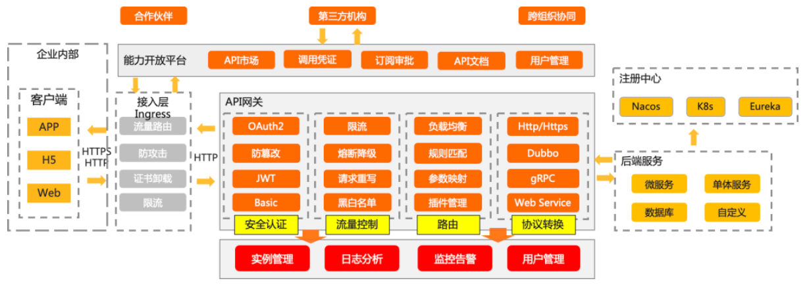
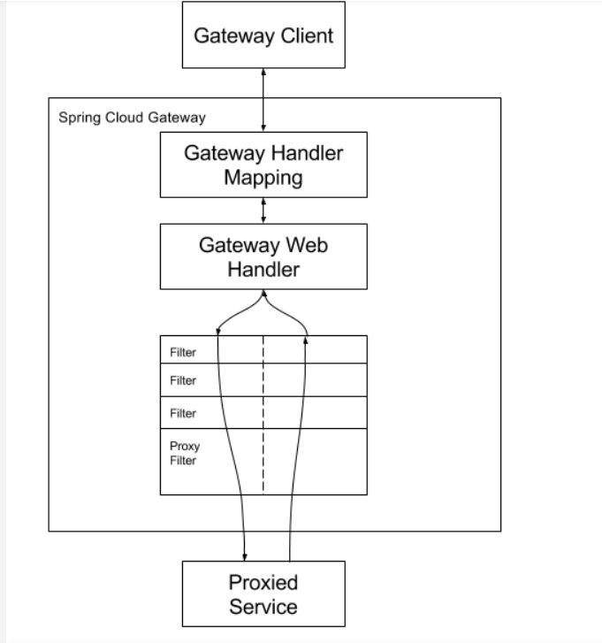
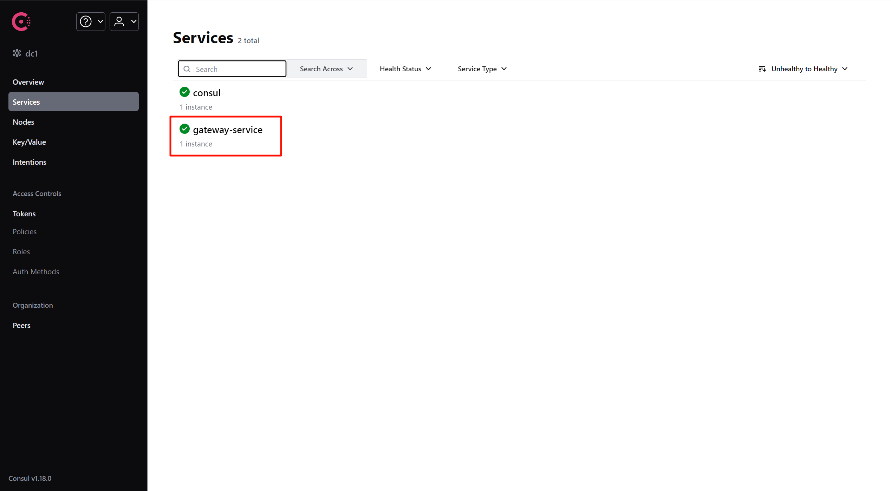
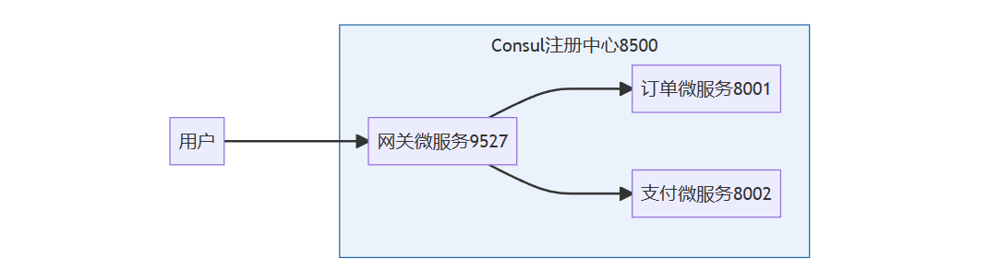
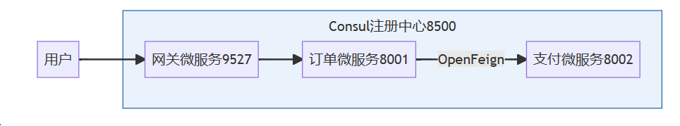
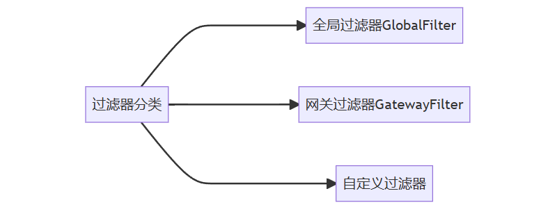
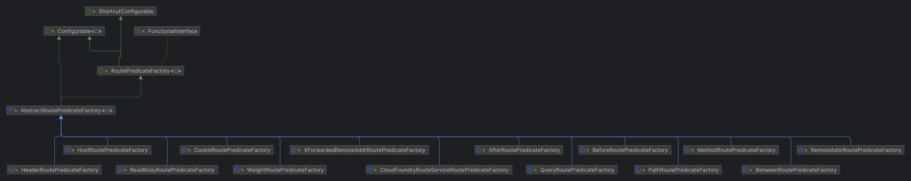
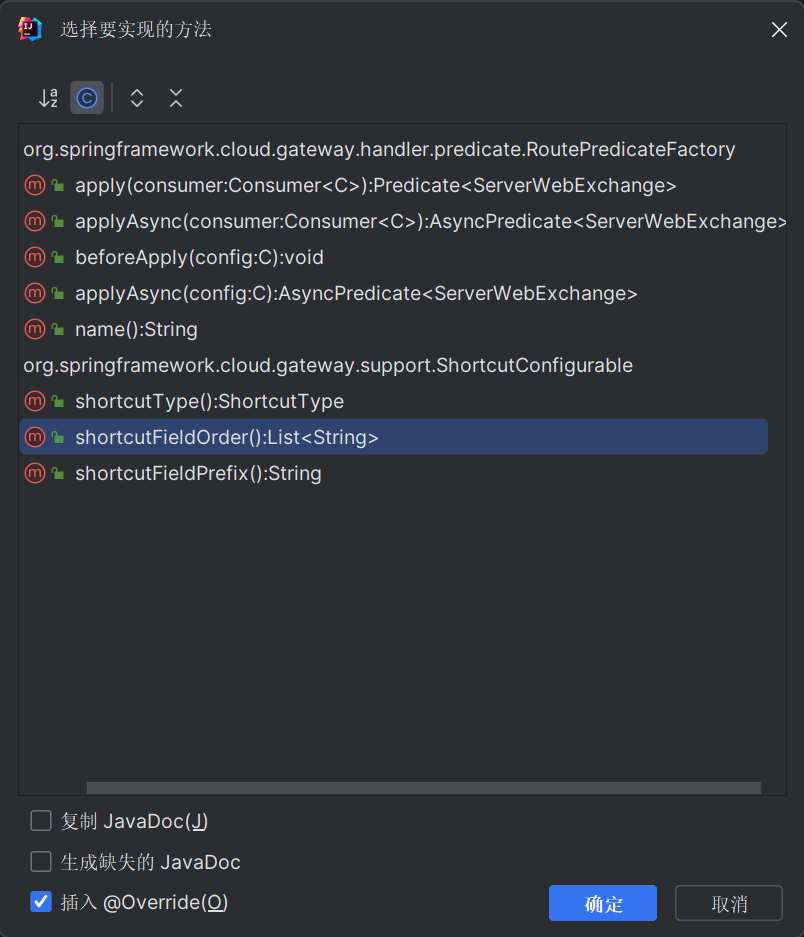

> 原文地址 :
>
> https://blog.csdn.net/gengduc/article/details/136871754
>
> https://blog.csdn.net/gengduc/article/details/136586220
>
> https://blog.csdn.net/gengduc/article/details/136571227

## 1 微服务网关概述



Spring Cloud Gateway是在 Spring 生态系统之上构建的API网关服务，旨在为微服务架构应用提供一种简单有效的统一的API路由管理方式。

Spring Cloud Gateway主要功能：

- 反向代理
- 认证鉴权
- 流量控制
- 熔断
- 日志监控

## 2 Spring Cloud Gateway三大核心概念

- **路由**（Route）：它由一个 ID、一个目标 URI、断言集合和过滤器集合。如果断言为真，则路由匹配。
- **断言**（Predicate）：参考的是 Java8 的 `java.util.function.Predicate`，开发人员可以匹配 HTTP 请求中的所有内容（例如请求头或请求参数），如果与断言相匹配则进行路由。
- **过滤器**（Filter）：指的是 GatewayFilter 实例，可以在请求被路由之前或之后修改请求和响应。

## 3 Spring Cloud Gateway工作流程



客户端向 Spring Cloud Gateway 发出请求。然后在 Gateway Handler Mapping 中找到与请求相匹配的路由，将其发送到 Gateway Web Handler。Handler 再通过指定的过滤器链来将请求发送到我们实际的服务执行业务逻辑，然后返回。

过滤器被虚线分开的原因是过滤器可以在发送代理请求之前（pre）和之后（post）运行逻辑。执行所有“pre”过滤器逻辑。然后发出代理请求。在发出代理请求之后，运行“post”过滤器逻辑。

> 总结：**断言判断–>路由转发–>执行过滤器链**

## 4 Spring Cloud Gateway网关微服务开发

1. 新建网关微服务模块
2. 修改pom文件，引入依赖
3. 修改yml文件和主启动类，在Consul中进行服务注册

### 4.1 引入依赖

```xml
<dependencies>
    <!--Spring Cloud Gateway-->
    <dependency>
        <groupId>org.springframework.cloud</groupId>
        <artifactId>spring-cloud-starter-gateway</artifactId>
    </dependency>
    <!--Consul服务注册-->
    <dependency>
        <groupId>org.springframework.cloud</groupId>
        <artifactId>spring-cloud-starter-consul-discovery</artifactId>
    </dependency>
    <!--指标监控健康检查的actuator-->
    <dependency>
        <groupId>org.springframework.boot</groupId>
        <artifactId>spring-boot-starter-actuator</artifactId>
    </dependency>
</dependencies>
```

### 4.2 网关微服务注册

```yml
server:
  port: 9527 # 网关服务端口

spring:
  application:
    name: gateway-service # 网关服务名称
  cloud:
    consul:
      host: 47.120.52.144 # Consul服务地址
      port: 8500 # Consul服务端口
      discovery:
        prefer-ip-address: true # 服务注册时优先使用IP地址而不是主机名
        service-name: ${spring.application.name} # 在Consul中注册的服务名称
        heartbeat:
          enabled: true # 启用心跳检测，定期检查服务健康状态
```

```java
@SpringBootApplication
@EnableDiscoveryClient // 服务注册
public class Gateway9527 {
    public static void main(String[] args) {
        SpringApplication.run(Gateway9527.class, args);
    }
}
```

> 服务注册使用了 Consul，如果要使用 Nacos 进行服务注册，修改 pom 文件中的依赖和 yml 文件中的配置！



### 4.3 路由配置

假设场景，商城系统用户下单支付。



网关微服务yml配置：

```yml
spring:
  gateway:
    routes:
      - id: order-route # 路由ID，没有固定规则但要求唯一，建议配合服务名
        uri: http://localhost:8001 # 路由转发地址
        predicates:
          - Path=/gateway/order/**/** # 断言，匹配请求路径
      - id: pay-route
        uri: http://localhost:8002
        predicates:
          - Path=/gateway/pay/**/**
```

如果要使用OpenFeign，订单微服务8001调用支付微服务8002，



服务调用链：

1. 用户调用网关微服务9527
2. 网关微服务9527根据配置的路由匹配到订单微服务8001
3. 订单微服务8001根据业务需要使用OpenFeign远程调用支付微服务8002
   1. 因为支付微服务8002也需要通过网关访问，因此也要通过网关微服务9527
   2. 网关微服务9527根据配置的路由匹配到支付微服务8002，到此完成服务调用

此时，网关微服务yml配置：

```yml
spring:
  gateway:
    routes:
      - id: order-route # 路由ID，没有固定规则但要求唯一，建议配合服务名
        uri: lb://order-service # 路由转发地址，负载均衡
        predicates:
          - Path=/order/**/** # 断言，匹配请求路径
      - id: pay-route
        uri: lb://pay-service
        predicates:
          - Path=/pay/**/**
```

> - @FeignClient(value = “gateway-service”)注解不再使用微服务名，而是使用网关服务名称！
> - 动态获取服务URI：根据微服务名称而不是固定IP+port的方式获取URI！

Spring Cloud Gateway支持丰富的路由匹配逻辑，以应对各种类型的业务诉求：

| 断言    | 示例                                                         | 说明                                                         |
| ------- | ------------------------------------------------------------ | ------------------------------------------------------------ |
| Path    | - Path=/httpbin/**                                           | 路径与/httpbin/**匹配的请求会被转发                          |
| Cookie  | - Cookie=chocolate, ch.p                                     | 携带Cookie且内容为chocolate=ch.p的请求会被转发               |
| Header  | - Header=X-Request-Id, \d+                                   | 请求有一个名为 `X-Request-Id` 的头，其值与 `\d+` 正则表达式匹配（即它的值为一位或多位），则此路由匹配。 |
| Method  | - Method=GET,POST                                            | 请求方法是 `GET` 或 `POST` ，则此路由匹配。                  |
| Before  | - Before=2017-01-20T17:42:47.789+08:00[Asia/Shanghai]        | 在2017年01月20日17时42分47.789秒之前的请求，才会被转发       |
| After   | - Before=2017-01-20T17:42:47.789+08:00[Asia/Shanghai]        | 在2017年01月20日17时42分47.789秒之后的请求，才会被转发       |
| Between | - Between=2017-01-20T17:42:47.789+08:00[Asia/Shanghai],2017-01-21T17:42:47.789+08:00[Asia/Shanghai] | 在2017年01月20日17时42分47.789秒到在2017年01月21日17时42分47.789秒之间的请求，才会被转发 |

### 4.4 过滤器配置



- **全局过滤器GlobalFilter**：作用在所有路由上，不需要在配置文件中配置，实现GlobalFilter接口即可
- **网关过滤器GatewayFilter**：作用在单一路由或某个路由分组上，通过spring.cloud.gateway.routes.filters配置在具体的路由上，也可以通过配置spring.cloud.gateway.default-filters让它作用于全局路由上。
- **自定义过滤器**： 见 4.4.3

#### 4.4.1 全局过滤器

```java
/**
 * Contract for interception-style, chained processing of gateway requests that may be
 * used to implement cross-cutting, application-agnostic requirements such as security,
 * timeouts, and others.
 *
 * Only applies to matched gateway routes.
 *
 * Copied from framework WebFilter
 *
 * @author Rossen Stoyanchev
 * @since 5.0
 */
public interface GlobalFilter {

	/**
	 * Process the Web request and (optionally) delegate to the next {@code GatewayFilter}
	 * through the given {@link GatewayFilterChain}.
	 * @param exchange the current server exchange
	 * @param chain provides a way to delegate to the next filter
	 * @return {@code Mono<Void>} to indicate when request processing is complete
	 */
	Mono<Void> filter(ServerWebExchange exchange, GatewayFilterChain chain);

}
```

#### 4.4.2 网关过滤器

官网地址：https://docs.spring.io/spring-cloud-gateway/docs/4.0.9/reference/html/#gatewayfilter-factories。这里只列举一些常见的网关过滤器。

1. 请求头（RequestHeader）相关

   1. AddRequestHeader
   2. RemoveRequestHeader
   3. SetRequestHeader

   ```yml
   spring:
     cloud:
       gateway:
         routes:
         - id: add_request_header_route
           uri: http://example.org
           filters:
           - AddRequestHeader=X-Request-red, blue
           - RemoveRequestHeader=X-Request-Foo
           - SetRequestHeader=X-Request-Red, Blue
   ```

2. 请求参数（RequestParameter）相关

   1. AddRequestParameter
   2. RemoveRequestParameter

   ```yml
   spring:
     cloud:
       gateway:
         routes:
         - id: add_request_parameter_route
           uri: http://example.org
           filters:
           - AddRequestParameter=red, blue
           - RemoveRequestParameter=red
   ```

3. 响应头（ResponseHeader）相关

   1. AddResponseHeader
   2. RemoveResponseHeader
   3. SetResponseHeader

   ```yml
   spring:
     cloud:
       gateway:
         routes:
         - id: add_response_header_route
           uri: http://example.org
           filters:
           - AddResponseHeader=X-Response-Red, Blue
           - RemoveResponseHeader=X-Response-Foo
           - SetResponseHeader=X-Response-Red, Blue
   ```

4. 前缀和路径相关

   1. PrefixPath

      ```yml
      spring:
        cloud:
          gateway:
            routes:
            - id: prefixpath_route
              uri: http://example.org
              predicates:
              - Path=/red
              filters:
              - PrefixPath=/mypath
      ```

      浏览器访问地址：http://example.org/red

      实际微服务地址：http://example.org/mypath/red

   2. SetPath

      ```yml
      spring:
        cloud:
          gateway:
            routes:
            - id: prefixpath_route
              uri: http://example.org
              predicates:
              - Path=/red
              filters:
              - SetPath=/blue
      ```

      浏览器访问地址：http://example.org/red

      实际微服务地址：http://example.org/blue

   3. RedirectTo

      ```yml
      spring:
        cloud:
          gateway:
            routes:
            - id: prefixpath_route
              uri: http://example.org
              predicates:
              - Path=/red
              filters:
              - RedirectTo=302, http://www.baidu.com
      ```

      浏览器访问地址：http://example.org/red

      实际微服务地址：http://www.baidu.com

5. 其他

   1. Default：添加过滤器用于所有路由，相当于全局过滤器。

      ```yml
      spring:
        cloud:
          gateway:
            default-filters:
            - AddResponseHeader=X-Response-Default-Red, Default-Blue
            - PrefixPath=/httpbin
      ```

> 如果调用链中再加入远程调用，调用链还是很复杂的！

#### 4.4.3 自定义过滤器

> 相关面试题：统计接口调用耗时，如何落地，谈谈设计思路？

##### 自定义统计接口耗时的全局过滤器

- https://docs.spring.io/spring-cloud-gateway/docs/4.0.9/reference/html/#gateway-combined-global-filter-and-gatewayfilter-ordering

```java
import lombok.extern.slf4j.Slf4j;
import org.springframework.cloud.gateway.filter.GatewayFilterChain;
import org.springframework.cloud.gateway.filter.GlobalFilter;
import org.springframework.core.Ordered;
import org.springframework.stereotype.Component;
import org.springframework.web.server.ServerWebExchange;
import reactor.core.publisher.Mono;

/**
 * 自定义全局过滤器，实现GlobalFilter和Ordered接口，统计接口耗时
 *
 * @author gengduc@qq.com
 * @since 2024-03-09
 */
@Component
@Slf4j
public class CustomGlobalFilter implements GlobalFilter, Ordered {
    public static final String BEGIN_VISIT_TIME = "begin_visit_time";

    @Override
    public Mono<Void> filter(ServerWebExchange exchange, GatewayFilterChain chain) {
        /* 1、保存请求开始时间 */
        exchange.getAttributes().put(BEGIN_VISIT_TIME, System.currentTimeMillis());
        return chain.filter(exchange).then(
                Mono.fromRunnable(() -> {
                    /* 2、获取请求开始时间 */
                    Long beginTime = exchange.getAttribute(BEGIN_VISIT_TIME);
                    if (beginTime != null) {
                        /* 3、计算接口耗时 */
                        log.info("==========访问接口耗时统计==========");
                        log.info("访问接口主机: " + exchange.getRequest().getURI().getHost());
                        log.info("访问接口端口: " + exchange.getRequest().getURI().getPort());
                        log.info("访问接口路径: " + exchange.getRequest().getURI().getPath());
                        log.info("访问接口参数: " + exchange.getRequest().getURI().getQuery());
                        log.info("访问接口时间: " + (System.currentTimeMillis() - beginTime) + "ms");
                        log.info("==============E N D==============");
                    }
                })
        );
    }

    /**
     * 设置过滤器的优先级，值越小优先级越高
     *
     * @return 优先级
     */
    @Override
    public int getOrder() {
        return 0;
    }
}
```

设计思路：

1. 实现`GlobalFilter`和`Orderd`接口。
2. 实现getOrder()方法，方法返回值代表过滤器的优先级，值越小，优先级越高。
3. 实现filter()方法。方法接收两个参数：ServerWebExchange和GatewayFilterChain。ServerWebExchange是一个接口，它提供了对HTTP请求-响应交互的全面访问。GatewayFilterChain是一个接口，它提供了对下一个过滤器的访问。
   1. 首先，方法将当前的系统时间（请求开始的时间）存储在ServerWebExchange的属性中。这是通过调用exchange.getAttributes().put(BEGIN_VISIT_TIME, System.currentTimeMillis())实现的。
   2. 然后，方法调用chain.filter(exchange)来处理请求。这个调用会将请求传递给过滤器链中的下一个过滤器。如果没有更多的过滤器，那么请求将被发送到目标服务。
   3. 当请求被处理完毕后，then方法会被调用。这个方法接收一个Runnable参数，这个参数是一个无参数的函数，它会在请求被处理完毕后被执行。
   4. 在这个Runnable函数中，首先从ServerWebExchange的属性中获取请求开始的时间。然后，计算处理请求所花费的时间（当前的系统时间减去请求开始的时间）。最后，将这些信息记录在日志中。

##### 自定义网关过滤器

要自定义网关过滤器，参考Spring Cloud Gateway自带的网关过滤器实现。

自定义网关过滤器的步骤如下：

1. 新建类名`CustomGatewayFilterFactory`（类名需要以GatewayFilterFactory结尾），并继承`AbstractGatewayFilterFactory`抽象类。
2. 新建`CustomGatewayFilterFactory.Config`静态内部类，这个Config类就是我们自定义的过滤器配置
3. 重写apply()方法，处理自定义逻辑，返回`GatewayFilter`对象。
4. 重写shortcutFieldOrder()方法，使yml配置支持快捷配置
5. 空参构造函数调用了父类的构造函数，传入了Config类的Class对象。

```java
import lombok.Getter;
import lombok.Setter;
import lombok.extern.slf4j.Slf4j;
import org.springframework.cloud.gateway.filter.GatewayFilter;
import org.springframework.cloud.gateway.filter.GatewayFilterChain;
import org.springframework.cloud.gateway.filter.factory.AbstractGatewayFilterFactory;
import org.springframework.http.HttpStatus;
import org.springframework.http.server.reactive.ServerHttpRequest;
import org.springframework.stereotype.Component;
import org.springframework.web.server.ServerWebExchange;
import reactor.core.publisher.Mono;

import java.util.Arrays;
import java.util.List;

/**
 * @author gengduc@qq.com
 * @since 2024-03-09
 */
@Component
@Slf4j
public class CustomGatewayFilterFactory extends AbstractGatewayFilterFactory<CustomGatewayFilterFactory.Config> {
    private static final String STATUS_KEY = "status";

    public CustomGatewayFilterFactory() {
        super(Config.class);
    }

    @Override
    public List<String> shortcutFieldOrder() {
        return Arrays.asList(STATUS_KEY);
    }

    @Override
    public GatewayFilter apply(Config config) {
        return new GatewayFilter() {
            @Override
            public Mono<Void> filter(ServerWebExchange exchange, GatewayFilterChain chain) {
                log.info("请求进入自定义网关过滤器，请求路径为: {}", exchange.getRequest().getURI().getPath());
                log.info("提示: 合法请求中请求参数必须包含\"custom\"参数, 否则请求将被拦截");
                ServerHttpRequest request = exchange.getRequest();
                if (request.getQueryParams().containsKey("custom")) {
                    log.info("请求参数中包含custom参数, 请求合法, 放行");
                    log.info("请求参数中custom参数的值为: {}", request.getQueryParams().get("custom"));
                    return chain.filter(exchange);
                } else {
                    log.info("请求参数中不包含custom参数, 请求非法, 拦截");
                    exchange.getResponse().setStatusCode(HttpStatus.BAD_REQUEST);
                    return exchange.getResponse().setComplete();
                }
            }
        };
    }

    @Setter
    @Getter
    public static class Config {
        // 自定义配置属性
        private String status;
    }
}
```

apply()方法是AbstractGatewayFilterFactory的抽象方法，子类需要实现这个方法来创建过滤器。在这个方法中，返回了一个新的GatewayFilter对象。

在返回的GatewayFilter对象中，重写了filter方法。这个方法在每个请求被处理之前都会被调用。在这个方法中，首先打印了一些日志，然后检查请求参数中是否包含"custom"这个键。如果包含，那么就继续处理请求，并打印出"custom"参数的值；如果不包含，那么就设置响应的状态码为BAD_REQUEST，并结束请求的处理。

```yml
spring:
  application:
    name: gateway-service # 网关服务名称
  cloud:
    consul:
      host: 47.120.52.144 # Consul服务地址
      port: 8500 # Consul服务端口
      discovery:
        prefer-ip-address: true # 服务注册时优先使用IP地址而不是主机名
        service-name: ${spring.application.name} # 在Consul中注册的服务名称
        heartbeat:
          enabled: true # 启用心跳检测，定期检查服务健康状态
    gateway:
      routes:
        - id: order-route
          uri: http://localhost:8001
          predicates:
            - Path=/pay/get/1
          filters:
            - Custom=custom
```

> 浏览器访问地址：
>
> - http://localhost:9527/pay/get/1?custom=1✅
> - http://localhost:9527/pay/get/1✖️

### 4.5 自定义断言

**问题**：Spring Cloud Gateway自带的断言（Predicate）不满足业务怎么办？可以自定义断言！

先看Spring Cloud Gateway是如何实现断言的

Gateway中断言的整体架构如下：



```java
public abstract class AbstractRoutePredicateFactory<C> extends AbstractConfigurable<C>
		implements RoutePredicateFactory<C> {

	public AbstractRoutePredicateFactory(Class<C> configClass) {
		super(configClass);
	}
}
```

可以看到Gateway的断言都是继承了`AbstractRoutePredicateFactory`抽象类。

自定义路由断言规则的步骤如下：

1. 新建类名`CustomRoutePredicateFactory`（类名需要以以RoutePredicateFactory结尾），并继承`AbstractRoutePredicateFactory`抽象类。
2. 重写apply()方法
3. 新建apply()方法所需的静态内部类`CustomRoutePredicateFactory.Config`，这个Config就是我们的断言规则
4. 空参构造方法，内部调用super()方法
5. 在Config类中配置自定义参数
6. apply()中编写自定义的逻辑

```java
import jakarta.validation.constraints.NotNull;
import org.springframework.cloud.gateway.handler.predicate.AbstractRoutePredicateFactory;
import org.springframework.cloud.gateway.handler.predicate.GatewayPredicate;
import org.springframework.web.server.ServerWebExchange;

import java.util.function.Predicate;

/**
 * 自定义路由断言工厂，指定的用户类型才能访问
 *
 * @author gengduc@qq.com
 * @since 2024-03-08
 */
@Component
public class CustomRoutePredicateFactory extends AbstractRoutePredicateFactory<CustomRoutePredicateFactory.Config> {
    public CustomRoutePredicateFactory() {
        super(CustomRoutePredicateFactory.Config.class);
    }

    @Override
    public Predicate<ServerWebExchange> apply(CustomRoutePredicateFactory.Config config) {
        return new GatewayPredicate() {
            @Override
            public boolean test(ServerWebExchange serverWebExchange) {
                // 这里可以编写自定义的逻辑
                // 获取请求中的信息，判断是否符合条件
                String userType = serverWebExchange.getRequest().getQueryParams().getFirst("userType");
                if (userType == null) {
                    return false;
                }
                // 判断用户类型是否符合
                return userType.equalsIgnoreCase(config.getUserType());
            }
        };
    }

    public static class Config {
        // 这里可以配置一些参数
        @NotNull
        private String userType;

        public String getUserType() {
            return userType;
        }

        public void setUserType(String userType) {
            this.userType = userType;
        }
    }
}
```

这个时候已经可以使用我们自定义的断言了。

> http://localhost:9527/order/gateway/get/1?userType=admin

在yml文件中配置：

```yml
spring:
  cloud:
    gateway:
      routes:
      - id: custom_route
        uri: https://example.org
        predicates:
        - name: Custom
          args:
            userType: admin # 当用户类型是admin的时候进行路由转发
```

可以看到我们使用的配置方式是完全展开的参数配置方式（Fully Expanded Arguments），这个时候还是不支持快捷配置的。

为了让自定义的断言支持快捷配置（Shortcut Configuration），还需要实现`shortcutFieldOrder()`方法。



完整的代码如下：

```java
import jakarta.validation.constraints.NotNull;
import org.springframework.cloud.gateway.handler.predicate.AbstractRoutePredicateFactory;
import org.springframework.cloud.gateway.handler.predicate.GatewayPredicate;
import org.springframework.web.server.ServerWebExchange;

import java.util.Collections;
import java.util.List;
import java.util.function.Predicate;

/**
 * 自定义路由断言工厂，指定的用户类型才能访问
 *
 * @author gengduc@qq.com
 * @since 2024-03-08
 */
@Component
public class CustomRoutePredicateFactory extends AbstractRoutePredicateFactory<CustomRoutePredicateFactory.Config> {
    public CustomRoutePredicateFactory() {
        super(CustomRoutePredicateFactory.Config.class);
    }
	
    // 快捷配置支持
    @Override
    public List<String> shortcutFieldOrder() {
        return Collections.singletonList("userType");
    }

    @Override
    public Predicate<ServerWebExchange> apply(CustomRoutePredicateFactory.Config config) {
        return new GatewayPredicate() {
            @Override
            public boolean test(ServerWebExchange serverWebExchange) {
                // 这里可以编写自定义的逻辑
                // 获取请求中的信息，判断是否符合条件
                String userType = serverWebExchange.getRequest().getQueryParams().getFirst("userType");
                if (userType == null) {
                    return false;
                }
                // 判断用户类型是否符合
                return userType.equalsIgnoreCase(config.getUserType());
            }
        };
    }


    public static class Config {
        // 这里可以配置一些参数
        @NotNull
        private String userType;

        public String getUserType() {
            return userType;
        }

        public void setUserType(String userType) {
            this.userType = userType;
        }
    }
}
```