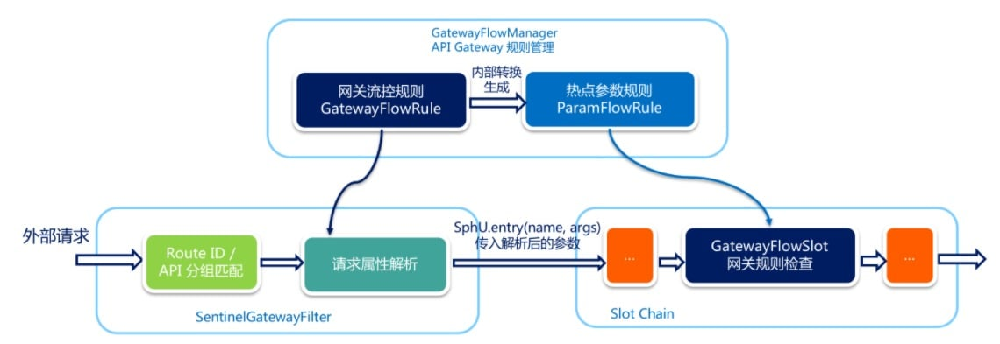

## 10、sentinel 网关流控实现的原理：

知道如何使用 sentinel-dashboard 对网关进行流控之后，我们接下来介绍 sentinel 网关流控的实现原理

当通过 GatewayRuleManager 加载网关流控规则（GatewayFlowRule）时，无论是否针对请求属性进行限流，Sentinel 底层都会将网关流控规则转化为热点参数规则（ParamFlowRule），存储在 GatewayRuleManager 中，与正常的热点参数规则相隔离。转换时 Sentinel 会根据请求属性配置，为网关流控规则设置参数索引（idx），并同步到生成的热点参数规则中。

外部请求进入 API Gateway 时会经过 Sentinel 实现的 filter，其中会依次进行 “路由/API 分组匹配 -> 请求属性解析 和 参数组装"。Sentinel 会根据配置的网关流控规则来解析请求属性，并依照参数索引顺序组装参数数组，最终传入 SphU.entry(res, args) 中。Sentinel API Gateway Adapter Common 模块向 Slot Chain 中添加了一个 GatewayFlowSlot，专门用来做网关规则的检查。GatewayFlowSlot 会从 GatewayRuleManager 中提取生成的热点参数规则，根据传入的参数依次进行规则检查。若某条规则不针对请求属性，则会在参数最后一个位置置入预设的常量，达到普通流控的效果。

### 作业：

1. 结合Jwt实现网关鉴权操作。
2. 自定义负债均衡策略，实现优先调用本地微服务。

