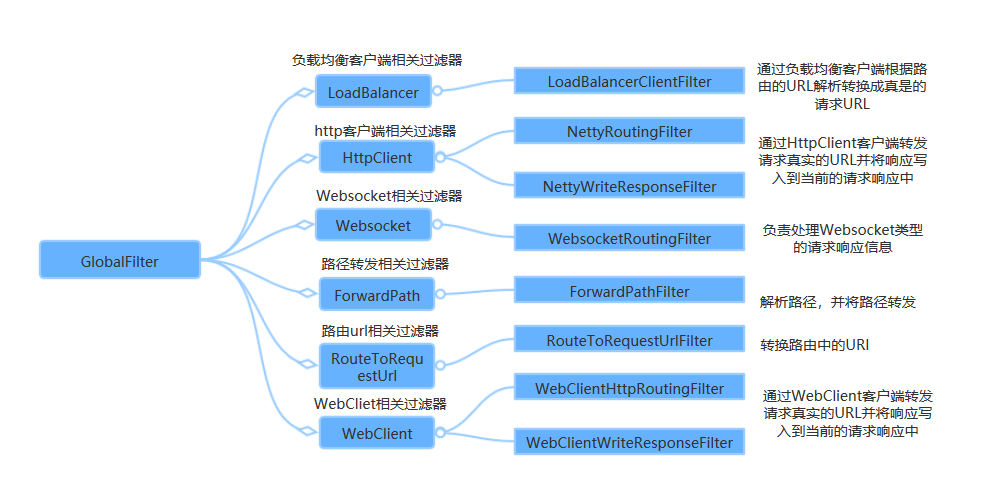

## 4、核心类详解

### ServerWebExchange

先看`ServerWebExchange`的注释：

> Contract for an HTTP request-response interaction.
>
> Provides access to the HTTP request and response and also exposes additional server-side processing related properties and features such as request attributes.

翻译一下大概是：

> ServerWebExchange是一个HTTP请求-响应交互的契约。
>
> 提供对HTTP请求和响应的访问，并公开额外的服务器端处理相关属性和特性，如请求属性。

其实，`ServerWebExchange`命名为**服务网络交换器**，存放着重要的请求-响应属性、请求实例和响应实例等等，有点像`Context`的角色。

#### ServerWebExchange接口

`ServerWebExchange`接口的所有方法：

```javascript
public interface ServerWebExchange {

    // 日志前缀属性的KEY，值为org.springframework.web.server.ServerWebExchange.LOG_ID
    // 可以理解为 attributes.set("org.springframework.web.server.ServerWebExchange.LOG_ID","日志前缀的具体值");
    // 作用是打印日志的时候会拼接这个KEY对饮的前缀值，默认值为""
    String LOG_ID_ATTRIBUTE = ServerWebExchange.class.getName() + ".LOG_ID";
    String getLogPrefix();

    // 获取ServerHttpRequest对象
    ServerHttpRequest getRequest();

    // 获取ServerHttpResponse对象
    ServerHttpResponse getResponse();

    // 返回当前exchange的请求属性，返回结果是一个可变的Map
    Map<String, Object> getAttributes();

    // 根据KEY获取请求属性
    @Nullable
    default <T> T getAttribute(String name) {
        return (T) getAttributes().get(name);
    }

    // 根据KEY获取请求属性，做了非空判断
    @SuppressWarnings("unchecked")
    default <T> T getRequiredAttribute(String name) {
        T value = getAttribute(name);
        Assert.notNull(value, () -> "Required attribute '" + name + "' is missing");
        return value;
    }

     // 根据KEY获取请求属性，需要提供默认值
    @SuppressWarnings("unchecked")
    default <T> T getAttributeOrDefault(String name, T defaultValue) {
        return (T) getAttributes().getOrDefault(name, defaultValue);
    } 

    // 返回当前请求的网络会话
    Mono<WebSession> getSession();

    // 返回当前请求的认证用户，如果存在的话
    <T extends Principal> Mono<T> getPrincipal();  

    // 返回请求的表单数据或者一个空的Map，只有Content-Type为application/x-www-form-urlencoded的时候这个方法才会返回一个非空的Map -- 这个一般是表单数据提交用到
    Mono<MultiValueMap<String, String>> getFormData();   

    // 返回multipart请求的part数据或者一个空的Map，只有Content-Type为multipart/form-data的时候这个方法才会返回一个非空的Map  -- 这个一般是文件上传用到
    Mono<MultiValueMap<String, Part>> getMultipartData();

    // 返回Spring的上下文
    @Nullable
    ApplicationContext getApplicationContext();   

    // 这几个方法和lastModified属性相关
    boolean isNotModified();
    boolean checkNotModified(Instant lastModified);
    boolean checkNotModified(String etag);
    boolean checkNotModified(@Nullable String etag, Instant lastModified);

    // URL转换
    String transformUrl(String url);    

    // URL转换映射
    void addUrlTransformer(Function<String, String> transformer); 

    // 注意这个方法，方法名是：改变，这个是修改ServerWebExchange属性的方法，返回的是一个Builder实例，Builder是ServerWebExchange的内部类
    default Builder mutate() {
         return new DefaultServerWebExchangeBuilder(this);
    }

    interface Builder {      

        // 覆盖ServerHttpRequest
        Builder request(Consumer<ServerHttpRequest.Builder> requestBuilderConsumer);
        Builder request(ServerHttpRequest request);

        // 覆盖ServerHttpResponse
        Builder response(ServerHttpResponse response);

        // 覆盖当前请求的认证用户
        Builder principal(Mono<Principal> principalMono);

        // 构建新的ServerWebExchange实例
        ServerWebExchange build();
    }
}    
```

#### ServerWebExchange#mutate() 方法

注意到`ServerWebExchange#mutate()`方法，`ServerWebExchange`实例可以理解为不可变实例，

如果我们想要修改它，需要通过`mutate()`方法生成一个新的实例，例如这样：

```javascript
public class CustomGlobalFilter implements GlobalFilter {

    @Override
    public Mono<Void> filter(ServerWebExchange exchange, GatewayFilterChain chain) {
        ServerHttpRequest request = exchange.getRequest();
        // 这里可以修改ServerHttpRequest实例
        ServerHttpRequest newRequest = ...
        ServerHttpResponse response = exchange.getResponse();
        // 这里可以修改ServerHttpResponse实例
        ServerHttpResponse newResponse = ...
        // 构建新的ServerWebExchange实例
        ServerWebExchange newExchange = exchange.mutate().request(newRequest).response(newResponse).build();
        return chain.filter(newExchange);
    }
}
```

#### ServerHttpRequest接口

`ServerHttpRequest`实例是用于承载请求相关的属性和请求体，

`Spring Cloud Gateway`中底层使用`Netty`处理网络请求，通过追溯源码，

可以从`ReactorHttpHandlerAdapter`中得知`ServerWebExchange`实例中持有的`ServerHttpRequest`实例的具体实现是`ReactorServerHttpRequest`。

之所以列出这些实例之间的关系，是因为这样比较容易理清一些隐含的问题，例如：

- **`ReactorServerHttpRequest`的父类`AbstractServerHttpRequest`中初始化内部属性headers的时候把请求的HTTP头部封装为只读的实例**：

```javascript
public AbstractServerHttpRequest(URI uri, @Nullable String contextPath, HttpHeaders headers) {
    this.uri = uri;
    this.path = RequestPath.parse(uri, contextPath);
    this.headers = HttpHeaders.readOnlyHttpHeaders(headers);
}

// HttpHeaders类中的readOnlyHttpHeaders方法，
// ReadOnlyHttpHeaders屏蔽了所有修改请求头的方法，直接抛出UnsupportedOperationException
public static HttpHeaders readOnlyHttpHeaders(HttpHeaders headers) {
    Assert.notNull(headers, "HttpHeaders must not be null");
    if (headers instanceof ReadOnlyHttpHeaders) {
        return headers;
    }
    else {
        return new ReadOnlyHttpHeaders(headers);
    }
}
```

所以, **不能直接从`ServerHttpRequest`实例中直接获取请求头`HttpHeaders`实例并且进行修改**。

`ServerHttpRequest`接口如下：

```javascript
public interface HttpMessage {

    // 获取请求头，目前的实现中返回的是ReadOnlyHttpHeaders实例，只读
    HttpHeaders getHeaders();
}    

public interface ReactiveHttpInputMessage extends HttpMessage {

    // 返回请求体的Flux封装
    Flux<DataBuffer> getBody();
}

public interface HttpRequest extends HttpMessage {

    // 返回HTTP请求方法，解析为HttpMethod实例
    @Nullable
    default HttpMethod getMethod() {
        return HttpMethod.resolve(getMethodValue());
    }

    // 返回HTTP请求方法，字符串
    String getMethodValue();    

    // 请求的URI
    URI getURI();
}    

public interface ServerHttpRequest extends HttpRequest, ReactiveHttpInputMessage {

    // 连接的唯一标识或者用于日志处理标识
    String getId();   

    // 获取请求路径，封装为RequestPath对象
    RequestPath getPath();

    // 返回查询参数，是只读的MultiValueMap实例
    MultiValueMap<String, String> getQueryParams();

    // 返回Cookie集合，是只读的MultiValueMap实例
    MultiValueMap<String, HttpCookie> getCookies();  

    // 远程服务器地址信息
    @Nullable
    default InetSocketAddress getRemoteAddress() {
       return null;
    }

    // SSL会话实现的相关信息
    @Nullable
    default SslInfo getSslInfo() {
       return null;
    }  

    // 修改请求的方法，返回一个建造器实例Builder，Builder是内部类
    default ServerHttpRequest.Builder mutate() {
        return new DefaultServerHttpRequestBuilder(this);
    } 

    interface Builder {

        // 覆盖请求方法
        Builder method(HttpMethod httpMethod);

        // 覆盖请求的URI、请求路径或者上下文，这三者相互有制约关系，具体可以参考API注释
        Builder uri(URI uri);
        Builder path(String path);
        Builder contextPath(String contextPath);

        // 覆盖请求头
        Builder header(String key, String value);
        Builder headers(Consumer<HttpHeaders> headersConsumer);

        // 覆盖SslInfo
        Builder sslInfo(SslInfo sslInfo);

        // 构建一个新的ServerHttpRequest实例
        ServerHttpRequest build();
    }         
}    
```

**注意：**

```
ServerHttpRequest`或者说`HttpMessage`接口提供的获取请求头方法`HttpHeaders getHeaders();
```

返回结果是一个只读的实例，具体是`ReadOnlyHttpHeaders`类型，

如果要修改`ServerHttpRequest`实例，那么需要这样做：

```java
ServerHttpRequest request = exchange.getRequest();
ServerHttpRequest newRequest = request.mutate().header("key","value").path("/myPath").build();
```

#### ServerHttpResponse接口

`ServerHttpResponse`实例是用于承载响应相关的属性和响应体，

`Spring Cloud Gateway`中底层使用`Netty`处理网络请求，通过追溯源码，可以从`ReactorHttpHandlerAdapter`中得知`ServerWebExchange`实例中持有的`ServerHttpResponse`实例的具体实现是`ReactorServerHttpResponse`。

之所以列出这些实例之间的关系，是因为这样比较容易理清一些隐含的问题，例如：

```javascript
// ReactorServerHttpResponse的父类
public AbstractServerHttpResponse(DataBufferFactory dataBufferFactory, HttpHeaders headers) {
    Assert.notNull(dataBufferFactory, "DataBufferFactory must not be null");
    Assert.notNull(headers, "HttpHeaders must not be null");
    this.dataBufferFactory = dataBufferFactory;
    this.headers = headers;
    this.cookies = new LinkedMultiValueMap<>();
}

public ReactorServerHttpResponse(HttpServerResponse response, DataBufferFactory bufferFactory) {
    super(bufferFactory, new HttpHeaders(new NettyHeadersAdapter(response.responseHeaders())));
    Assert.notNull(response, "HttpServerResponse must not be null");
    this.response = response;
}
```

可知`ReactorServerHttpResponse`构造函数初始化实例的时候，存放响应Header的是`HttpHeaders`实例，也就是响应Header是可以直接修改的。

`ServerHttpResponse`接口如下：

```javascript
public interface HttpMessage {

    // 获取响应Header，目前的实现中返回的是HttpHeaders实例，可以直接修改
    HttpHeaders getHeaders();
}  

public interface ReactiveHttpOutputMessage extends HttpMessage {

    // 获取DataBufferFactory实例，用于包装或者生成数据缓冲区DataBuffer实例(创建响应体)
    DataBufferFactory bufferFactory();

    // 注册一个动作，在HttpOutputMessage提交之前此动作会进行回调
    void beforeCommit(Supplier<? extends Mono<Void>> action);

    // 判断HttpOutputMessage是否已经提交
    boolean isCommitted();

    // 写入消息体到HTTP协议层
    Mono<Void> writeWith(Publisher<? extends DataBuffer> body);

    // 写入消息体到HTTP协议层并且刷新缓冲区
    Mono<Void> writeAndFlushWith(Publisher<? extends Publisher<? extends DataBuffer>> body);

    // 指明消息处理已经结束，一般在消息处理结束自动调用此方法，多次调用不会产生副作用
    Mono<Void> setComplete();
}

public interface ServerHttpResponse extends ReactiveHttpOutputMessage {

    // 设置响应状态码
    boolean setStatusCode(@Nullable HttpStatus status);

    // 获取响应状态码
    @Nullable
    HttpStatus getStatusCode();

    // 获取响应Cookie，封装为MultiValueMap实例，可以修改
    MultiValueMap<String, ResponseCookie> getCookies();  

    // 添加响应Cookie
    void addCookie(ResponseCookie cookie);  
}    
```

这里可以看到除了响应体比较难修改之外，其他的属性都是可变的。

#### ServerWebExchangeUtils和上下文属性

`ServerWebExchangeUtils`里面存放了很多静态公有的字符串KEY值

(**这些字符串KEY的实际值是**`org.springframework.cloud.gateway.support.ServerWebExchangeUtils.` + 下面任意的静态公有KEY)，

这些字符串KEY值一般是用于`ServerWebExchange`的属性(`Attribute`，见上文的`ServerWebExchange#getAttributes()`方法)的KEY，这些属性值都是有特殊的含义，在使用过滤器的时候如果时机适当可以直接取出来使用，下面逐个分析。

- `PRESERVE_HOST_HEADER_ATTRIBUTE`：是否保存Host属性，值是布尔值类型，写入位置是`PreserveHostHeaderGatewayFilterFactory`，使用的位置是`NettyRoutingFilter`，作用是如果设置为true，HTTP请求头中的Host属性会写到底层Reactor-Netty的请求Header属性中。
- `CLIENT_RESPONSE_ATTR`：保存底层Reactor-Netty的响应对象，类型是`reactor.netty.http.client.HttpClientResponse`。
- `CLIENT_RESPONSE_CONN_ATTR`：保存底层Reactor-Netty的连接对象，类型是`reactor.netty.Connection`。
- `URI_TEMPLATE_VARIABLES_ATTRIBUTE`：`PathRoutePredicateFactory`解析路径参数完成之后，把解析完成后的占位符KEY-路径Path映射存放在`ServerWebExchange`的属性中，KEY就是`URI_TEMPLATE_VARIABLES_ATTRIBUTE`。
- `CLIENT_RESPONSE_HEADER_NAMES`：保存底层Reactor-Netty的响应Header的名称集合。
- `GATEWAY_ROUTE_ATTR`：用于存放`RoutePredicateHandlerMapping`中匹配出来的具体的路由(`org.springframework.cloud.gateway.route.Route`)实例，通过这个路由实例可以得知当前请求会路由到下游哪个服务。
- `GATEWAY_REQUEST_URL_ATTR`：`java.net.URI`类型的实例，这个实例代表直接请求或者[负载均衡](https://cloud.tencent.com/product/clb?from=10680)处理之后需要请求到下游服务的真实URI。
- `GATEWAY_ORIGINAL_REQUEST_URL_ATTR`：`java.net.URI`类型的实例，需要重写请求URI的时候，保存原始的请求URI。
- `GATEWAY_HANDLER_MAPPER_ATTR`：保存当前使用的`HandlerMapping`具体实例的类型简称(一般是字符串"RoutePredicateHandlerMapping")。
- `GATEWAY_SCHEME_PREFIX_ATTR`：确定目标路由URI中如果存在schemeSpecificPart属性，则保存该URI的scheme在此属性中，路由URI会被重新构造，见`RouteToRequestUrlFilter`。
- `GATEWAY_PREDICATE_ROUTE_ATTR`：用于存放`RoutePredicateHandlerMapping`中匹配出来的具体的路由(`org.springframework.cloud.gateway.route.Route`)实例的ID。
- `WEIGHT_ATTR`：实验性功能(此版本还不建议在正式版本使用)存放分组权重相关属性，见`WeightCalculatorWebFilter`。
- `ORIGINAL_RESPONSE_CONTENT_TYPE_ATTR`：存放响应Header中的ContentType的值。
- `HYSTRIX_EXECUTION_EXCEPTION_ATTR`：`Throwable`的实例，存放的是Hystrix执行异常时候的异常实例，见`HystrixGatewayFilterFactory`。
- `GATEWAY_ALREADY_ROUTED_ATTR`：布尔值，用于判断是否已经进行了路由，见`NettyRoutingFilter`。
- `GATEWAY_ALREADY_PREFIXED_ATTR`：布尔值，用于判断请求路径是否被添加了前置部分，见`PrefixPathGatewayFilterFactory`。

`ServerWebExchangeUtils`提供的上下文属性用于`Spring Cloud Gateway`的`ServerWebExchange`组件处理请求和响应的时候，内部一些重要实例或者标识属性的安全传输和使用，使用它们可能存在一定的风险，

因为没有人可以确定在版本升级之后，原有的属性KEY或者VALUE是否会发生改变，如果评估过风险或者规避了风险之后，可以安心使用。

例如我们**在做请求和响应日志(类似Nginx的Access Log)的时候，可以依赖到`GATEWAY_ROUTE_ATTR`，因为我们要打印路由的目标信息。**举个简单例子：

```javascript
@Slf4j
@Component
public class AccessLogFilter implements GlobalFilter {

    @Override
    public Mono<Void> filter(ServerWebExchange exchange, GatewayFilterChain chain) {
        ServerHttpRequest request = exchange.getRequest();
        String path = request.getPath().pathWithinApplication().value();
        HttpMethod method = request.getMethod();
        // 获取路由的目标URI
        URI targetUri = exchange.getAttribute(ServerWebExchangeUtils.GATEWAY_REQUEST_URL_ATTR);
        InetSocketAddress remoteAddress = request.getRemoteAddress();
        return chain.filter(exchange.mutate().build()).then(Mono.fromRunnable(() -> {
            ServerHttpResponse response = exchange.getResponse();
            HttpStatus statusCode = response.getStatusCode();
            log.info("请求路径:{},客户端远程IP地址:{},请求方法:{},目标URI:{},响应码:{}",
                    path, remoteAddress, method, targetUri, statusCode);
        }));
    }
}
```

### Gateway filter

#### ServerWebExchange 与过滤器的关系：

Spring Cloud Gateway同zuul类似，有“pre”和“post”两种方式的filter。

客户端的请求先经过“pre”类型的filter，然后将请求转发到具体的业务服务，收到业务服务的响应之后，再经过“post”类型的filter处理，最后返回响应到客户端。

引用Spring Cloud Gateway官网上的一张图：


与zuul不同的是，filter除了分为“pre”和“post”两种方式的filter外，在Spring Cloud Gateway中，filter从作用范围可分为另外两种，

一种是**针对于单个路由的gateway filter**，它在配置文件中的写法同predict类似；

一种是**针对于所有路由的global gateway filer**。

现在从作用范围划分的维度来讲解这两种filter。

我们在使用`Spring Cloud Gateway`的时候，注意到过滤器（包括`GatewayFilter`、`GlobalFilter`和过滤器链`GatewayFilterChain`）。

Spring Cloud Gateway根据作用范围划分为GatewayFilter和GlobalFilter，二者区别如下：

- **GatewayFilter** : 需要通过spring.cloud.routes.filters 配置在具体路由下，只作用在当前路由上或通过spring.cloud.default-filters配置在全局，作用在所有路由上
- **GlobalFilter** : 全局过滤器，不需要在配置文件中配置，作用在所有的路由上，最终通过GatewayFilterAdapter包装成GatewayFilterChain可识别的过滤器，它为请求业务以及路由的URI转换为真实业务服务的请求地址的核心过滤器，不需要配置，系统初始化时加载，并作用在每个路由上。

#### GlobalFilter

Spring Cloud Gateway框架内置的GlobalFilter如下：



上图中每一个GlobalFilter都作用在每一个router上，能够满足大多数的需求。

但是如果遇到业务上的定制，可能需要编写满足自己需求的GlobalFilter。

过滤器都依赖到`ServerWebExchange`：

```java
public interface GlobalFilter {

    Mono<Void> filter(ServerWebExchange exchange, GatewayFilterChain chain);
}

public interface GatewayFilter extends ShortcutConfigurable {

    Mono<Void> filter(ServerWebExchange exchange, GatewayFilterChain chain);
}

public interface GatewayFilterChain {

    Mono<Void> filter(ServerWebExchange exchange);
}    
```

这里的设计和`Servlet`中的`Filter`是相似的，

当前过滤器可以决定是否执行下一个过滤器的逻辑，由`GatewayFilterChain#filter()`是否被调用来决定。

而`ServerWebExchange`就相当于当前请求和响应的上下文。

`ServerWebExchange`实例`不单`存储了`Request`和`Response`对象，还提供了一些扩展方法，如果想实现改造请求参数或者响应参数，就必须深入了解`ServerWebExchange`。

##### Forward Routing Filter

简单来说这个 Filter 是用来做本地 forward 的，将官方文档的描述翻译后大致如下：

当请求进来时，`ForwardRoutingFilter` 会查看一个 URL，该 URL 为 exchange 属性 `ServerWebExchangeUtils.GATEWAY_REQUEST_URL_ATTR` 的值，如果该 url 的 scheme 是 `forward`（例如：`forward://localendpoint`），那么该 Filter 会使用 Spirng 的 `DispatcherHandler` 来处理这个请求。该请求的 URL 路径部分，会被 forward URL 中的路径覆盖掉。而未修改过的原始 URL，会被追加到 `ServerWebExchangeUtils.GATEWAY_ORIGINAL_REQUEST_URL_ATTR` 属性中

注：所谓 url scheme 简单来说就是 url 中的协议部分，例如 http、https、ws 等。自定义的 scheme 通常用于标识该 url 的行为，例如 app 开发中通常使用 url scheme 来跳转页面

**Tips：**

- 这段文档实际上是描述了该 Filter 的实现原理，对使用者来说意义不大，对实现原理感兴趣的话可以直接查看源码，源码比文档描述好理解：`org.springframework.cloud.gateway.filter.ForwardRoutingFilter`

##### LoadBlancerClientFilter

这个 Filter 是用来整合 Ribbon 的，其核心就是解析 scheme 为`lb`的 url，以此获取微服务的名称，然后再通过 Ribbon 获取实际的调用地址。将官方文档的描述翻译后大致如下：

当请求进来时，`LoadBalancerClientFilter` 会查看一个 URL，该 URL 为 exchange 的属性 `ServerWebExchangeUtils.GATEWAY_REQUEST_URL_ATTR` 的值，如果该 url 的 scheme 是 `lb`，（例如：`lb://myservice` ），那么该 Filter 会使用 Spring Cloud 的 `LoadBalancerClient` 来将 `myservice` 解析成实际的 host 和 port ，并替换掉原本 `ServerWebExchangeUtils.GATEWAY_REQUEST_URL_ATTR` 属性的值。而原始 url 会追加到 `ServerWebExchangeUtils.GATEWAY_ORIGINAL_REQUEST_URL_ATTR` 属性中。该过滤器还会查看 `ServerWebExchangeUtils.GATEWAY_SCHEME_PREFIX_ATTR` 属性，如果发现该属性的值是 `lb` ，也会执行相同逻辑。

配置示例：

```yml
spring:
  cloud:
    gateway:
      routes:
      - id: myRoute
        uri: lb://service
        predicates:
        - Path=/service/**
```

默认情况下，如果无法通过 `LoadBalancer` 找到指定服务的实例，那么会返回 503（如上配置示例， 若 `LoadBalancer` 找不到名为 service 的实例时，就会返回 503）；可使用配置： `spring.cloud.gateway.loadbalancer.use404=true` ，让其返回 404。

`LoadBalancer` 返回的 `ServiceInstance` 的 `isSecure` 的值，会覆盖请求的 scheme。举个例子，如果请求打到 Gateway 上使用的是 HTTPS ，但 `ServiceInstance` 的 `isSecure` 是`false`，那么下游微服务接收到的则是 HTTP 请求，反之亦然。另外，如果该路由指定了 `GATEWAY_SCHEME_PREFIX_ATTR` 属性，那么前缀将会被剥离，并且路由 URL 中的 scheme 会覆盖 `ServiceInstance` 的配置

**Tips：**

- 这段文档实际上是描述了该 Filter 的实现原理，对使用者来说意义不大，对实现原理感兴趣的话可以直接查看源码，源码比文档描述好理解：`org.springframework.cloud.gateway.filter.LoadBalancerClientFilter`

##### NettyRoutingFilter

当请求进来时，`NettyRoutingFilter` 会查看一个 URL，该 URL 是 exchange 的属性 `ServerWebExchangeUtils.GATEWAY_REQUEST_URL_ATTR` 的值，如果该 url 的 scheme 是 `http` 或 `https` ，那么该 Filter 会使用 Netty 的 `HttpClient` 向下游的服务发送代理请求。获得的响应将放在 exchange 的 `ServerWebExchangeUtils.CLIENT_RESPONSE_ATTR` 属性中，以便在后面的 Filter 里使用。（有一个实验性的过滤器： `WebClientHttpRoutingFilter` 可实现相同功能，但无需 Netty）

```java
//必须保证是最后一个执行的过滤器
@Override
public int getOrder() {
    return Ordered.LOWEST_PRECEDENCE;
}

@Override
@SuppressWarnings("Duplicates")
public Mono<Void> filter(ServerWebExchange exchange, GatewayFilterChain chain) {
    //获取请求url
    URI requestUrl = exchange.getRequiredAttribute(GATEWAY_REQUEST_URL_ATTR);
    //获取请求模式
    String scheme = requestUrl.getScheme();
    //判断是否已经被路由过了，被路由过会添加标记
    if (isAlreadyRouted(exchange)//如果已经被路由过或者不是http和https就走其他过滤器
            || (!"http".equals(scheme) && !"https".equals(scheme))) {
        return chain.filter(exchange);
    }
    //标记为已经路由过，防止再次被其他过滤器使用
    setAlreadyRouted(exchange);
    //拿到请求
    ServerHttpRequest request = exchange.getRequest();
    //获取请求类型
    final HttpMethod method = HttpMethod.valueOf(request.getMethodValue());
    //处理URL地址编码，拿到想要的url
    final String url = requestUrl.toASCIIString();
    //拿到前置过滤器添加的header
    HttpHeaders filtered = filterRequest(getHeadersFilters(), exchange);
    //创建一个HttpHeaders对象，将所有的Header全都添加进去
    final DefaultHttpHeaders httpHeaders = new DefaultHttpHeaders();
    filtered.forEach(httpHeaders::set);
    //根据exchange里的属性，判断是否要保留header里的host属性
    boolean preserveHost = exchange
            .getAttributeOrDefault(PRESERVE_HOST_HEADER_ATTRIBUTE, false);//PreserveHostHeader是否发送原始主机信息
    //拿到请求（路由）
    Route route = exchange.getAttribute(GATEWAY_ROUTE_ATTR);
    /*开始发送请求*/
    //使用HttpClient发送请求

    Flux<HttpClientResponse> responseFlux = getHttpClient(route, exchange)                .headers(headers -> {
            //将前置的Header带入之后的请求
                headers.add(httpHeaders);
                // Will either be set below, or later by Netty
                //删除Host
                headers.remove(HttpHeaders.HOST);
                //判断是否要保留Host
                if (preserveHost) {
                    //拿到Host
                    String host = request.getHeaders().getFirst(HttpHeaders.HOST);
                    //将Host添加到Header中
                    headers.add(HttpHeaders.HOST, host);
                }
            }).request(method).uri(url).send((req, nettyOutbound) -> {
                //判断Trace是否激活
                if (log.isTraceEnabled()) {                        
                    nettyOutbound
                            .withConnection(connection -> log.trace("outbound route: "
                                    + connection.channel().id().asShortText()
                                    + ", inbound: " + exchange.getLogPrefix()));
                }
                //得到具体调用发送请求的位置
                return nettyOutbound.send(request.getBody().map(this::getByteBuf));
                //配置Response连接
            }).responseConnection((res, connection) -> {
                //NettyWriteResponseFilter就是通过这个连接拿到的数据
                // Defer committing the response until all route filters have run
                // Put client response as ServerWebExchange attribute and write
                // response later NettyWriteResponseFilter
                //将请求给到NettyWriteResponseFilter和连接
                exchange.getAttributes().put(CLIENT_RESPONSE_ATTR, res);                
                exchange.getAttributes().put(CLIENT_RESPONSE_CONN_ATTR, connection);
                //得到Response
                ServerHttpResponse response = exchange.getResponse();

                /*
                * 下边的代码就是发送请求了，Gateway的开发者已经给好注释了感觉没必要再去扒了
                */

                // put headers and status so filters can modify the response
                HttpHeaders headers = new HttpHeaders();

                res.responseHeaders().forEach(
                        entry -> headers.add(entry.getKey(), entry.getValue()));

                String contentTypeValue = headers.getFirst(HttpHeaders.CONTENT_TYPE);
                if (StringUtils.hasLength(contentTypeValue)) {
                    exchange.getAttributes().put(ORIGINAL_RESPONSE_CONTENT_TYPE_ATTR,
                            contentTypeValue);
                }

                setResponseStatus(res, response);

                // make sure headers filters run after setting status so it is
                // available in response
                HttpHeaders filteredResponseHeaders = HttpHeadersFilter.filter(
                        getHeadersFilters(), headers, exchange, Type.RESPONSE);

                if (!filteredResponseHeaders
                        .containsKey(HttpHeaders.TRANSFER_ENCODING)
                        && filteredResponseHeaders
                                .containsKey(HttpHeaders.CONTENT_LENGTH)) {
                    // It is not valid to have both the transfer-encoding header and
                    // the content-length header.
                    // Remove the transfer-encoding header in the response if the
                    // content-length header is present.
                    response.getHeaders().remove(HttpHeaders.TRANSFER_ENCODING);
                }

                exchange.getAttributes().put(CLIENT_RESPONSE_HEADER_NAMES,
                        filteredResponseHeaders.keySet());

                response.getHeaders().putAll(filteredResponseHeaders);

                return Mono.just(res);
            });

    Duration responseTimeout = getResponseTimeout(route);
    if (responseTimeout != null) {
        responseFlux = responseFlux
                .timeout(responseTimeout, Mono.error(new TimeoutException(
                        "Response took longer than timeout: " + responseTimeout)))
                .onErrorMap(TimeoutException.class,
                        th -> new ResponseStatusException(HttpStatus.GATEWAY_TIMEOUT,
                                th.getMessage(), th));
    }

    return responseFlux.then(chain.filter(exchange));
}
```

##### NettyWriteResponseFilter

`NettyWriteResponseFilter` 用于将代理响应写回网关的客户端侧，所以该过滤器会在所有其他过滤器执行完成后才执行，并且执行的条件是 exchange 中 `ServerWebExchangeUtils.CLIENT_RESPONSE_CONN_ATTR` 属性的值不为空，该值为 Netty 的 `Connection` 实例。（有一个实验性的过滤器： `WebClientWriteResponseFilter` 可实现相同功能，但无需 Netty）

##### RouteToRequestUrl Filter

这个过滤器用于将从 request 里获取的原始 url 转换成 Gateway 进行请求转发时所使用的 url。当请求进来时，`RouteToRequestUrlFilter` 会从 exchange 中获取 `ServerWebExchangeUtils.GATEWAY_ROUTE_ATTR` 属性的值，该值是一个 `Route` 对象。若该对象不为空的话，`RouteToRequestUrlFilter` 会基于请求 URL 及 `Route` 对象里的 URL 来创建一个新的 URL。新 URL 会被放到 exchange 的 `ServerWebExchangeUtils.GATEWAY_REQUEST_URL_ATTR` 属性中。

可能有点抽象，我们 debug 一下，看看这三个 url 的值就明白了，如下图：


如果 URL 具有 scheme 前缀，例如 `lb:ws://serviceid` ，该 `lb` scheme 将从 URL 中剥离，并放到 `ServerWebExchangeUtils.GATEWAY_SCHEME_PREFIX_ATTR` 中，方便后面的过滤器使用。

##### Websocket Routing Filter

该过滤器的作用与 `NettyRoutingFilter` 类似。当请求进来时，`WebsocketRoutingFilter` 会查看一个 URL，该 URL 是 exchange 中 `ServerWebExchangeUtils.GATEWAY_REQUEST_URL_ATTR` 属性的值，如果该 url 的 scheme 是 `ws` 或者 `wss`，那么该 Filter 会使用 Spring Web Socket 将 Websocket 请求转发到下游。

另外，如果 Websocket 请求需要负载均衡的话，可为 URL 添加 `lb` 前缀以实现负载均衡，例如 `lb:ws://serviceid` 。

如果你使用 [SockJS](https://github.com/sockjs) 作为普通 http 的后备，则应配置正常的 HTTP 路由以及 Websocket 路由。

配置示例：

```yaml
spring:
  cloud:
    gateway:
      routes:
      # SockJS route
      - id: websocket_sockjs_route
        uri: http://localhost:3001
        predicates:
        - Path=/websocket/info/**
      # Normwal Websocket route
      - id: websocket_route
        uri: ws://localhost:3001
        predicates:
        - Path=/websocket/**
```

##### Gateway Metrics Filter

想要启用 Gateway Metrics Filter，需在项目中添加 `spring-boot-starter-actuator` 依赖，然后在配置文件中配置 `spring.cloud.gateway.metrics.enabled` 的值为`true`。该过滤器会添加名为 `gateway.requests` 的时序度量（timer metric），其中包含以下标记：

- `routeId`：路由 ID
- `routeUri`：API 将路由到的 URI
- `outcome`：由 [HttpStatus.Series](https://docs.spring.io/spring-framework/docs/current/javadoc-api/org/springframework/http/HttpStatus.Series.html) 分类
- `status`：返回给客户端的 Http Status
- `httpStatusCode`：返回给客户端的请求的 Http Status
- `httpMethod`：请求所使用的 Http 方法

这些指标暴露在 `/actuator/metrics/gateway.requests` 端点中，并且可以轻松与 Prometheus 整合，从而创建一个 [Grafana dashboard](https://cloud.spring.io/spring-cloud-gateway/reference/html/gateway-grafana-dashboard.json)。

注：Prometheus 是一款监控工具，Grafana 是一款监控可视化工具；Spring Boot Actuator 可与这两款工具进行整合。

##### Marking An Exchange As Routed

当一个请求走完整条过滤器链后，负责转发请求到下游的那个过滤器会在 exchange 中添加一个 `gatewayAlreadyRouted` 属性，从而将 exchange 标记为 `routed`（已路由）。一旦请求被标记为 `routed` ，其他路由过滤器将不会再次路由该请求，而是直接跳过。

了解了以上所有内置的全局过滤器后，我们知道不同协议的请求会由不同的过滤器转发到下游。所以负责添加这个`gatewayAlreadyRouted` 属性的过滤器就是最终负责转发请求的过滤器：

- http、https 请求会由`NettyRoutingFilter`或`WebClientHttpRoutingFilter`添加这个属性
- forward 请求会由`ForwardRoutingFilter`添加这个属性
- websocket 请求会由`WebsocketRoutingFilter`添加这个属性

这些过滤器调用了以下方法将 exchange 标记为 `routed` ，或检查 exchange 是否是 `routed`：

- `ServerWebExchangeUtils.isAlreadyRouted`：检查 exchange 是否为 routed 状态
- `ServerWebExchangeUtils.setAlreadyRouted`：将 exchange 设置为 routed 状态

简单来说，就是 Gateway 通过 `gatewayAlreadyRouted` 属性表示这个请求已经转发过了，而无需其他过滤器重复路由，从而防止重复的路由转发。

这些全局过滤器都有对应的配置类，感兴趣的话可以查看相关源码：

- `org.springframework.cloud.gateway.config.GatewayAutoConfiguration`
- `org.springframework.cloud.gateway.config.GatewayMetricsAutoConfiguration`
- `org.springframework.cloud.gateway.config.GatewayLoadBalancerClientAutoConfiguration`

#### 自定义过滤器

例如我们**在做请求和响应日志(类似Nginx的Access Log)的时候，可以依赖到`GATEWAY_ROUTE_ATTR`，因为我们要打印路由的目标信息。**举个简单例子：

```java
@Slf4j
@Component
public class AccessLogFilter implements GlobalFilter {

    @Override
    public Mono<Void> filter(ServerWebExchange exchange, GatewayFilterChain chain) {
        ServerHttpRequest request = exchange.getRequest();
        String path = request.getPath().pathWithinApplication().value();
        HttpMethod method = request.getMethod();
        // 获取路由的目标URI
        URI targetUri = exchange.getAttribute(ServerWebExchangeUtils.GATEWAY_REQUEST_URL_ATTR);
        InetSocketAddress remoteAddress = request.getRemoteAddress();
        return chain.filter(exchange.mutate().build()).then(Mono.fromRunnable(() -> {
            ServerHttpResponse response = exchange.getResponse();
            HttpStatus statusCode = response.getStatusCode();
            log.info("请求路径:{},客户端远程IP地址:{},请求方法:{},目标URI:{},响应码:{}",
                    path, remoteAddress, method, targetUri, statusCode);
        }));
    }
}
```

##### 修改请求体和响应体

##### 修改请求体

修改请求体是一个比较常见的需求。

例如我们使用`Spring Cloud Gateway`实现网关的时候，要实现一个功能：

> 把存放在请求头中的JWT解析后，提取里面的用户ID，然后写入到请求体中。

我们简化这个场景，假设我们把userId明文存放在请求头中的accessToken中，请求体是一个JSON结构：

```json
{
    "serialNumber": "请求流水号",
    "payload" : {
        // ... 这里是有效载荷，存放具体的数据
    }
}
```

我们需要提取accessToken，也就是userId插入到请求体JSON中如下：

```json
{
    "userId": "用户ID",
    "serialNumber": "请求流水号",
    "payload" : {
        // ... 这里是有效载荷，存放具体的数据
    }
}
```

这里为了简化设计，用全局过滤器`GlobalFilter`实现，实际需要结合具体场景考虑：

```java
@Slf4j
@Component
public class ModifyRequestBodyGlobalFilter implements GlobalFilter {

    private final DataBufferFactory dataBufferFactory = new NettyDataBufferFactory(ByteBufAllocator.DEFAULT);

    @Autowired
    private ObjectMapper objectMapper;

    @Override
    public Mono<Void> filter(ServerWebExchange exchange, GatewayFilterChain chain) {
        ServerHttpRequest request = exchange.getRequest();
        String accessToken = request.getHeaders().getFirst("accessToken");
        if (!StringUtils.hasLength(accessToken)) {
            throw new IllegalArgumentException("accessToken");
        }
        // 新建一个ServerHttpRequest装饰器,覆盖需要装饰的方法
        ServerHttpRequestDecorator decorator = new ServerHttpRequestDecorator(request) {

            @Override
            public Flux<DataBuffer> getBody() {
                Flux<DataBuffer> body = super.getBody();
                InputStreamHolder holder = new InputStreamHolder();
                body.subscribe(buffer -> holder.inputStream = buffer.asInputStream());
                if (null != holder.inputStream) {
                    try {

                        // 解析JSON的节点
                        JsonNode jsonNode = objectMapper.readTree(holder.inputStream);
                        Assert.isTrue(jsonNode instanceof ObjectNode, "JSON格式异常");
                        ObjectNode objectNode = (ObjectNode) jsonNode;

                        // JSON节点最外层写入新的属性
                        objectNode.put("userId", accessToken);
                        DataBuffer dataBuffer = dataBufferFactory.allocateBuffer();
                        String json = objectNode.toString();
                        log.info("最终的JSON数据为:{}", json);
                        dataBuffer.write(json.getBytes(StandardCharsets.UTF_8));

                        return Flux.just(dataBuffer);
                    } catch (Exception e) {
                        throw new IllegalStateException(e);
                    }
                } else {
                    return super.getBody();
                }
            }
        };
        // 使用修改后的ServerHttpRequestDecorator重新生成一个新的ServerWebExchange
        return chain.filter(exchange.mutate().request(decorator).build());
    }

    private class InputStreamHolder {

        InputStream inputStream;
    }
}
```

测试一下：

```yaml
// HTTP
POST /order/json HTTP/1.1
Host: localhost:9090
Content-Type: application/json
accessToken: 10086
Accept: */*
Cache-Control: no-cache
Host: localhost:9090
accept-encoding: gzip, deflate
content-length: 94
Connection: keep-alive
cache-control: no-cache

{
    "serialNumber": "请求流水号",
    "payload": {
        "name": "doge"
    }
}

// 日志输出
最终的JSON数据为:{"serialNumber":"请求流水号","payload":{"name":"doge"},"userId":"10086"}
```

最重要的是用到了`ServerHttpRequest`装饰器`ServerHttpRequestDecorator`，主要覆盖对应获取请求体数据缓冲区的方法即可，至于怎么处理其他逻辑需要自行考虑，这里只是做一个简单的示范。

一般的代码逻辑如下：

```java
ServerHttpRequest request = exchange.getRequest();
ServerHttpRequestDecorator requestDecorator = new ServerHttpRequestDecorator(request) {

     @Override
     public Flux<DataBuffer> getBody() {
         // 拿到承载原始请求体的Flux
         Flux<DataBuffer> body = super.getBody();
         // 这里通过自定义方式生成新的承载请求体的Flux
         Flux<DataBuffer> newBody = ...
         return newBody;
     }            
}
return chain.filter(exchange.mutate().request(requestDecorator).build());    
```

##### 修改响应体

修改响应体的需求也是比较常见的，具体的做法和修改请求体差不多。

例如我们想要实现下面的功能：第三方服务请求经过网关，原始报文是密文，我们需要在网关实现密文解密，然后把解密后的明文路由到下游服务，下游服务处理成功响应明文，需要在网关把明文加密成密文再返回到第三方服务。

现在简化整个流程，用AES加密算法，统一密码为字符串"throwable"，假设请求报文和响应报文明文如下：

```json
// 请求密文
{
    "serialNumber": "请求流水号",
    "payload" : "加密后的请求消息载荷"
}

// 请求明文（仅仅作为提示）
{
    "serialNumber": "请求流水号",
    "payload" : "{\"name:\":\"doge\"}"
}

// 响应密文
{
    "code": 200,
    "message":"ok",
    "payload" : "加密后的响应消息载荷"
}

// 响应明文（仅仅作为提示）
{
    "code": 200,
    "message":"ok",
    "payload" : "{\"name:\":\"doge\",\"age\":26}"
}
```

为了方便一些加解密或者编码解码的实现，需要引入`Apache`的`commons-codec`类库：

```xml
<dependency>
    <groupId>commons-codec</groupId>
    <artifactId>commons-codec</artifactId>
    <version>1.12</version>
</dependency>
```

这里定义一个全局过滤器专门处理加解密，实际上最好结合真实的场景决定是否适合全局过滤器，这里只是一个示例：

```java
// AES加解密工具类
public enum AesUtils {

    // 单例
    X;

    private static final String PASSWORD = "throwable";
    private static final String KEY_ALGORITHM = "AES";
    private static final String SECURE_RANDOM_ALGORITHM = "SHA1PRNG";
    private static final String DEFAULT_CIPHER_ALGORITHM = "AES/ECB/PKCS5Padding";

    public String encrypt(String content) {
        try {
            Cipher cipher = Cipher.getInstance(DEFAULT_CIPHER_ALGORITHM);
            cipher.init(Cipher.ENCRYPT_MODE, provideSecretKey());
            return Hex.encodeHexString(cipher.doFinal(content.getBytes(StandardCharsets.UTF_8)));
        } catch (Exception e) {
            throw new IllegalArgumentException(e);
        }
    }

    public byte[] decrypt(String content) {
        try {
            Cipher cipher = Cipher.getInstance(DEFAULT_CIPHER_ALGORITHM);
            cipher.init(Cipher.DECRYPT_MODE, provideSecretKey());
            return cipher.doFinal(Hex.decodeHex(content));
        } catch (Exception e) {
            throw new IllegalArgumentException(e);
        }
    }

    private SecretKey provideSecretKey() {
        try {
            KeyGenerator keyGen = KeyGenerator.getInstance(KEY_ALGORITHM);
            SecureRandom secureRandom = SecureRandom.getInstance(SECURE_RANDOM_ALGORITHM);
            secureRandom.setSeed(PASSWORD.getBytes(StandardCharsets.UTF_8));
            keyGen.init(128, secureRandom);
            return new SecretKeySpec(keyGen.generateKey().getEncoded(), KEY_ALGORITHM);
        } catch (Exception e) {
            throw new IllegalArgumentException(e);
        }
    }
}

// EncryptionGlobalFilter
@Slf4j
@Component
public class EncryptionGlobalFilter implements GlobalFilter, Ordered {

    @Autowired
    private ObjectMapper objectMapper;

    @Override
    public int getOrder() {
        return -2;
    }

    @Override
    public Mono<Void> filter(ServerWebExchange exchange, GatewayFilterChain chain) {
        ServerHttpRequest request = exchange.getRequest();
        // 响应体
        ServerHttpResponse response = exchange.getResponse();
        DataBufferFactory bufferFactory = exchange.getResponse().bufferFactory();
        ServerHttpRequestDecorator requestDecorator = processRequest(request, bufferFactory);
        ServerHttpResponseDecorator responseDecorator = processResponse(response, bufferFactory);
        return chain.filter(exchange.mutate().request(requestDecorator).response(responseDecorator).build());
    }

    private ServerHttpRequestDecorator processRequest(ServerHttpRequest request, DataBufferFactory bufferFactory) {
        Flux<DataBuffer> body = request.getBody();
        DataBufferHolder holder = new DataBufferHolder();
        body.subscribe(dataBuffer -> {
            int len = dataBuffer.readableByteCount();
            holder.length = len;
            byte[] bytes = new byte[len];
            dataBuffer.read(bytes);
            DataBufferUtils.release(dataBuffer);
            String text = new String(bytes, StandardCharsets.UTF_8);
            JsonNode jsonNode = readNode(text);
            JsonNode payload = jsonNode.get("payload");
            String payloadText = payload.asText();
            byte[] content = AesUtils.X.decrypt(payloadText);
            String requestBody = new String(content, StandardCharsets.UTF_8);
            log.info("修改请求体payload,修改前:{},修改后:{}", payloadText, requestBody);
            rewritePayloadNode(requestBody, jsonNode);
            DataBuffer data = bufferFactory.allocateBuffer();
            data.write(jsonNode.toString().getBytes(StandardCharsets.UTF_8));
            holder.dataBuffer = data;
        });
        HttpHeaders headers = new HttpHeaders();
        headers.putAll(request.getHeaders());
        headers.remove(HttpHeaders.CONTENT_LENGTH);
        return new ServerHttpRequestDecorator(request) {

            @Override
            public HttpHeaders getHeaders() {
                int contentLength = holder.length;
                if (contentLength > 0) {
                    headers.setContentLength(contentLength);
                } else {
                    headers.set(HttpHeaders.TRANSFER_ENCODING, "chunked");
                }
                return headers;
            }

            @Override
            public Flux<DataBuffer> getBody() {
                return Flux.just(holder.dataBuffer);
            }
        };
    }

    private ServerHttpResponseDecorator processResponse(ServerHttpResponse response, DataBufferFactory bufferFactory) {
        return new ServerHttpResponseDecorator(response) {

            @SuppressWarnings("unchecked")
            @Override
            public Mono<Void> writeWith(Publisher<? extends DataBuffer> body) {
                if (body instanceof Flux) {
                    Flux<? extends DataBuffer> flux = (Flux<? extends DataBuffer>) body;
                    return super.writeWith(flux.map(buffer -> {
                        CharBuffer charBuffer = StandardCharsets.UTF_8.decode(buffer.asByteBuffer());
                        DataBufferUtils.release(buffer);
                        JsonNode jsonNode = readNode(charBuffer.toString());
                        JsonNode payload = jsonNode.get("payload");
                        String text = payload.toString();
                        String content = AesUtils.X.encrypt(text);
                        log.info("修改响应体payload,修改前:{},修改后:{}", text, content);
                        setPayloadTextNode(content, jsonNode);
                        return bufferFactory.wrap(jsonNode.toString().getBytes(StandardCharsets.UTF_8));
                    }));
                }
                return super.writeWith(body);
            }
        };
    }

    private void rewritePayloadNode(String text, JsonNode root) {
        try {
            JsonNode node = objectMapper.readTree(text);
            ObjectNode objectNode = (ObjectNode) root;
            objectNode.set("payload", node);
        } catch (Exception e) {
            throw new IllegalStateException(e);
        }
    }

    private void setPayloadTextNode(String text, JsonNode root) {
        try {
            ObjectNode objectNode = (ObjectNode) root;
            objectNode.set("payload", new TextNode(text));
        } catch (Exception e) {
            throw new IllegalStateException(e);
        }
    }

    private JsonNode readNode(String in) {
        try {
            return objectMapper.readTree(in);
        } catch (Exception e) {
            throw new IllegalStateException(e);
        }
    }

    private class DataBufferHolder {

        DataBuffer dataBuffer;
        int length;
    }
}  
```

先准备一份密文：

```java
Map<String, Object> json = new HashMap<>(8);
json.put("serialNumber", "请求流水号");
String content = "{\"name\": \"doge\"}";
json.put("payload", AesUtils.X.encrypt(content));
System.out.println(new ObjectMapper().writeValueAsString(json));

// 输出
{"serialNumber":"请求流水号","payload":"144e3dc734743f5709f1adf857bca473da683246fd612f86ac70edeb5f2d2729"}
```

模拟请求：

```yaml
POST /order/json HTTP/1.1
Host: localhost:9090
accessToken: 10086
Content-Type: application/json
User-Agent: PostmanRuntime/7.13.0
Accept: */*
Cache-Control: no-cache
Postman-Token: bda07fc3-ea1a-478c-b4d7-754fe6f37200,634734d9-feed-4fc9-ba20-7618bd986e1c
Host: localhost:9090
cookie: customCookieName=customCookieValue
accept-encoding: gzip, deflate
content-length: 104
Connection: keep-alive
cache-control: no-cache

{
    "serialNumber": "请求流水号",
    "payload": "FE49xzR0P1cJ8a34V7ykc9poMkb9YS+GrHDt618tJyk="
}

// 响应结果
{
    "serialNumber": "请求流水号",
    "payload": "oo/K1igg2t/S8EExkBVGWOfI1gAh5pBpZ0wyjNPW6e8="   # <--- 解密后：{"name":"doge","age":26}
}
```

遇到的问题：

- **必须实现`Ordered`接口，返回一个小于-1的order值，这是因为`NettyWriteResponseFilter`的order值为-1**，我们需要覆盖返回响应体的逻辑，自定义的`GlobalFilter`必须比`NettyWriteResponseFilter`优先执行。
- 网关每次重启之后，第一个请求总是无法从原始的`ServerHttpRequest`读取到有效的Body，准确来说出现的现象是`NettyRoutingFilter`调用`ServerHttpRequest#getBody()`的时候获取到一个空的对象，导致空指针；奇怪的是从第二个请求开始就能正常调用。**笔者把`Spring Cloud Gateway`的版本降低到`Finchley.SR3`，`Spring Boot`的版本降低到`2.0.8.RELEASE`，问题不再出现，初步确定是`Spring Cloud Gateway`版本升级导致的兼容性问题或者是BUG**。

最重要的是用到了`ServerHttpResponse`装饰器`ServerHttpResponseDecorator`，主要覆盖写入响应体数据缓冲区的部分，至于怎么处理其他逻辑需要自行考虑，这里只是做一个简单的示范。一般的代码逻辑如下：

```java
ServerHttpResponse response = exchange.getResponse();
ServerHttpResponseDecorator responseDecorator = new ServerHttpResponseDecorator(response) {

            @Override
            public Mono<Void> writeWith(Publisher<? extends DataBuffer> body) {
                if (body instanceof Flux) {
                    Flux<? extends DataBuffer> flux = (Flux<? extends DataBuffer>) body;
                    return super.writeWith(flux.map(buffer -> {
                        // buffer就是原始的响应数据的缓冲区
                        // 下面处理完毕之后返回新的响应数据的缓冲区即可
                        return bufferFactory.wrap(...);
                    }));
                }
                return super.writeWith(body);
            }
        };
return chain.filter(exchange.mutate().response(responseDecorator).build());    ###  
```

