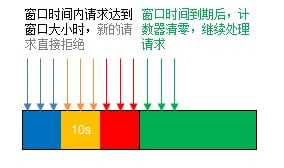
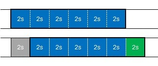
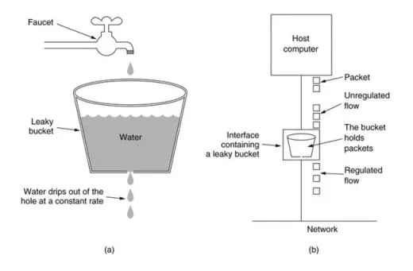
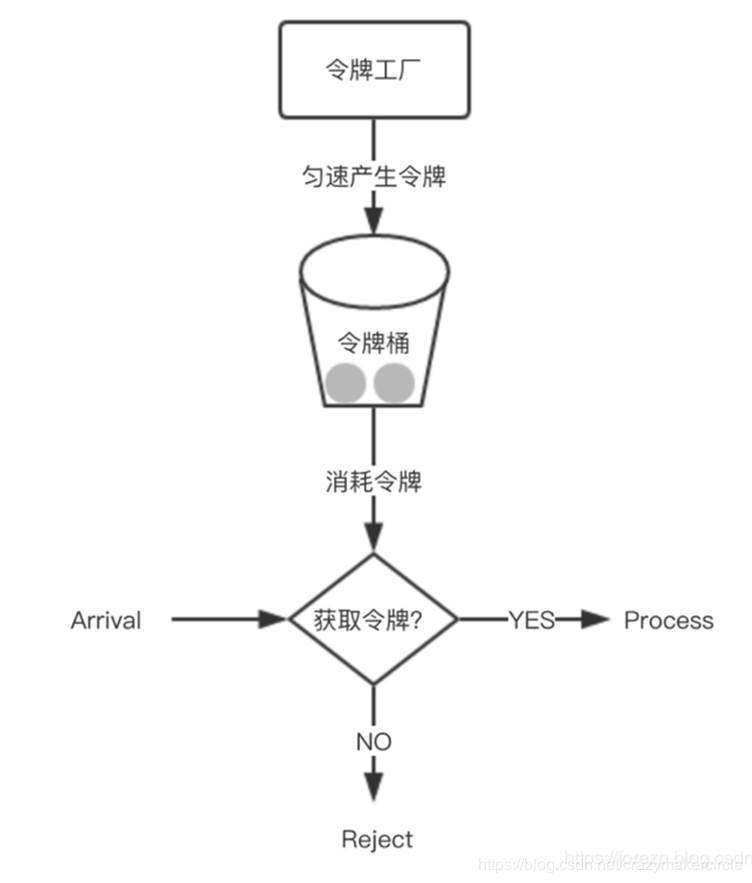
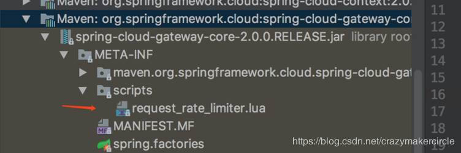

## 5、高级配置

### 5.1 统一配置跨域请求

现在的请求通过经过gateWay网关时，需要在网关统一配置跨域请求，需求所有请求通过

```yaml
spring:
  cloud:
    gateway:
      globalcors:
        cors-configurations:
          '[/**]':
            allowed-origins: "*"
            allowed-headers: "*"
            allow-credentials: true
            allowed-methods:
              - GET
              - POST
              - DELETE
              - PUT
              - OPTION
```

### 5.2 健康检查配置

admin-client、actuator健康检查配置，为之后的功能提供支持，此部分比较简单，不再赘述，加入以下maven依赖和配置

#### maven依赖

```xml
<dependency>
    <groupId>org.springframework.boot</groupId>
    <artifactId>spring-boot-starter-actuator</artifactId>
</dependency>
<dependency>
    <groupId>de.codecentric</groupId>
    <artifactId>spring-boot-admin-starter-client</artifactId>
    <version>2.1.0</version>
</dependency>
<dependency>
    <groupId>org.springframework.cloud</groupId>
    <artifactId>spring-cloud-starter-netflix-eureka-client</artifactId>
</dependency>
```

#### 配置文件

```yaml
spring:
  application:
    name: mas-cloud-gateway
  boot:
    admin:
      client:
      ### 本地搭建的admin-server
        url: http://localhost:8011
eureka:
  client:
    registerWithEureka: true
    fetchRegistry: true
    healthcheck:
      enabled: true
    serviceUrl:
      defaultZone: http://localhost:6887/eureka/
    enabled: true
feign:
  sentinel:
    enabled: true
management:
  endpoints:
    web:
      exposure:
        include: '*'
  endpoint:
    health:
      show-details: ALWAYS
```

若转发的目标地址为微服务中组件，不为具体ip:port形式的，应写成lb://mas-openapi-service形式，目标地址会从注册中心直接拉取

### 5.3 分布式限流

当无法控制流量入口时，我们就需要考虑流量控制，我们可以对系统整理进行流量控制，也可以对系统接入用户进行独立的流量控制，我们要结合实际业务场景选择合适的流控策略。

常见的几种流控算法如下：

- **固定窗口算法**
- **滑动窗口算法**
- **漏桶算法**
- **令牌桶算法**

**1.固定窗口算法**，就是指在固定的时间窗口内按照阈值进行流量控制的算法。这个算法具有以下特点：

- 原理简单，实现容易
- 当在时间窗口内突发流量，在时间窗口切换时阻塞请求同时涌入，产生流量踩踏，系统稳定性收到考验



**2.滑动窗口算法** ， 为了能够解决固定窗口算法在时间窗口切换时流量冲击的问题，我们可以将时间窗口划分成多个小的时间片段，每个小的时间片段有独立的计数器，当请求的时间点大于时间窗口的最大时间点时，整个窗口向右移动一个小的时间片段（丢弃最前面的时间片段，请求放在最新的时间片段上），这就是滑动窗口。时间片段划分的越多，滑动窗口的滑动就会越平滑，流量控制的也就越精确。



**3.漏桶算法**， 定义一个有一定容量的桶，如果桶的容量未满，新的请求就被放入桶内，如果桶的容量满了，新的请求就会被丢弃，漏桶算法通过控制输出速率，平滑网络流量，起到消峰填谷的作用。

漏桶算法由于漏出的速率是固定的，所以在突发流量的情况下，并不能够有效地使用网络资源，这种情况下对于请求的处理就缺乏效率。



**令牌桶算法**， 从某种意义上讲，令牌桶算法是对漏桶算法的一种改进，桶算法能够限制请求调用的速率，而令牌桶算法能够在限制调用的平均速率的同时还允许一定程度的突发调用。在令牌桶算法中，存在一个桶，用来存放固定数量的令牌。算法中存在一种机制，以一定的速率往桶中放令牌。每次请求调用需要先获取令牌，只有拿到令牌，才有机会继续执行，否则选择选择等待可用的令牌、或者直接拒绝。放令牌这个动作是持续不断的进行，如果桶中令牌数达到上限，就丢弃令牌，所以就存在这种情况，桶中一直有大量的可用令牌，这时进来的请求就可以直接拿到令牌执行，比如设置qps为100，那么限流器初始化完成一秒后，桶中就已经有100个令牌了，这时服务还没完全启动好，等启动完成对外提供服务时，该限流器可以抵挡瞬时的100个请求。所以，只有桶中没有令牌时，请求才会进行等待，最后相当于以一定的速率执行。



在Spring Cloud Gateway中，有Filter过滤器，因此可以在“pre”类型的Filter中自行实现上述三种过滤器。但是限流作为网关最基本的功能，Spring Cloud Gateway官方就提供了RequestRateLimiterGatewayFilterFactory这个类，适用在Redis内的通过执行Lua脚本实现了令牌桶的方式。具体实现逻辑在RequestRateLimiterGatewayFilterFactory类中，lua脚本在如下图所示的文件夹中：



首先在工程的pom文件中引入gateway的起步依赖和redis的reactive依赖，代码如下：

```xml
<dependency>
    <groupId>org.springframework.cloud</groupId>
    <artifactId>spring-cloud-starter-gateway</artifactId>
</dependency>
 
<dependency>
    <groupId>org.springframework.boot</groupId>
    <artifactId>spring-boot-starter-data-redis-reactive</artifactId>
</dependency>
```

配置如下：

```yaml
server:
  port: 8081
spring:
  cloud:
    gateway:
      routes:
      - id: limit_route
        uri: http://httpbin.org:80/get
        predicates:
        - After=2017-01-20T17:42:47.789-07:00[America/Denver]
        filters:
        # 限流过滤器
        - name: RequestRateLimiter
          args:
            #用于限流的键的解析器的 Bean 对象的名字。它使用 SpEL 表达式根据#{@beanName}从 Spring 容器中获取 Bean 对象
            key-resolver: '#{@userKeyResolver}'
            #令牌桶每秒填充平均速率
            redis-rate-limiter.replenishRate: 1
            #令牌桶总容量
            redis-rate-limiter.burstCapacity: 3
  application:
    name: cloud-gateway
  redis:
    host: localhost
    port: 6379
    database: 0
```

在上面的配置文件，指定程序的端口为8081，配置了 redis的信息，并配置了RequestRateLimiter的限流过滤器，该过滤器需要配置三个参数：

- burstCapacity，令牌桶总容量。
- replenishRate，令牌桶每秒填充平均速率。
- key-resolver，用于限流的键的解析器的 Bean 对象的名字。它使用 SpEL 表达式根据#{@beanName}从 Spring 容器中获取 Bean 对象。

这里根据用户ID限流，请求路径中必须携带userId参数

```java
@Bean
KeyResolver userKeyResolver() {
  return exchange -> Mono.just(exchange.getRequest().getQueryParams().getFirst("userId"));
}
```

KeyResolver需要实现resolve方法，比如根据userid进行限流，则需要用userid去判断。实现完KeyResolver之后，需要将这个类的Bean注册到Ioc容器中。

如果需要根据IP限流，定义的获取限流Key的bean为：

```java
@Bean
public KeyResolver ipKeyResolver() {
  return exchange -> Mono.just(exchange.getRequest().getRemoteAddress().getHostName());
}
```

通过exchange对象可以获取到请求信息，这边用了HostName，如果你想根据用户来做限流的话这边可以获取当前请求的用户ID或者用户名就可以了，比如：

如果需要根据接口的URI进行限流，则需要获取请求地址的uri作为限流key，定义的Bean对象为：

```java
@Bean
KeyResolver apiKeyResolver() {
  return exchange -> Mono.just(exchange.getRequest().getPath().value());
}
```

通过exchange对象可以获取到请求信息，这边用了HostName，如果你想根据用户来做限流的话这边可以获取当前请求的用户ID或者用户名就可以了，比如：

如果需要根据接口的URI进行限流，则需要获取请求地址的uri作为限流key，定义的Bean对象为：

```java
@Bean
KeyResolver apiKeyResolver() {
    return exchange -> Mono.just(exchange.getRequest().getPath().value());
}
```

