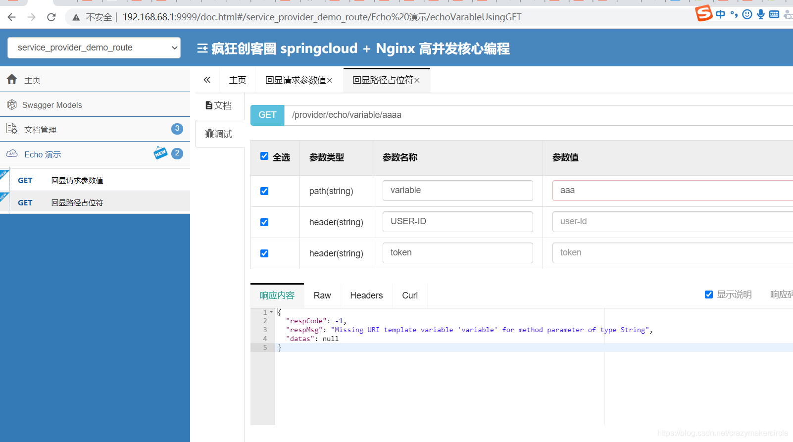

## 7、整合Swagger聚合微服务系统API文档

有关源码 具体请参见 疯狂创客圈的 crazy-springcloud 脚手架

### maven依赖

```xml
<?xml version="1.0" encoding="UTF-8"?>
<project xmlns="http://maven.apache.org/POM/4.0.0"
         xmlns:xsi="http://www.w3.org/2001/XMLSchema-instance"
         xsi:schemaLocation="http://maven.apache.org/POM/4.0.0 http://maven.apache.org/xsd/maven-4.0.0.xsd">
    <parent>
        <artifactId>cloud-center-alibaba</artifactId>
        <groupId>com.crazymaker.springcloud</groupId>
        <version>1.0-SNAPSHOT</version>
    </parent>
    <modelVersion>4.0.0</modelVersion>

    <groupId>com.crazymaker.springcloud</groupId>
    <artifactId>springcloud-gateway-demo</artifactId>
    <version>1.0-SNAPSHOT</version>
    <name>springcloud-gateway-demo</name>
    <packaging>jar</packaging>


    <dependencies>
        <!--gateway 网关依赖,内置webflux 依赖 -->
        <dependency>
            <groupId>org.springframework.cloud</groupId>
            <artifactId>spring-cloud-starter-gateway</artifactId>
        </dependency>
        <!--新增sentinel-->
        <dependency>
            <groupId>com.alibaba.csp</groupId>
            <artifactId>sentinel-spring-cloud-gateway-adapter</artifactId>
        </dependency>
        <dependency>
            <groupId>com.alibaba.csp</groupId>
            <artifactId>sentinel-transport-simple-http</artifactId>
        </dependency>

        <!-- nacos服务注册发现依赖-->
        <dependency>
            <groupId>com.alibaba.cloud</groupId>
            <artifactId>spring-cloud-starter-alibaba-nacos-discovery</artifactId>
            <exclusions>
                <exclusion>
                    <groupId>com.google.guava</groupId>
                    <artifactId>guava</artifactId>
                </exclusion>
            </exclusions>
        </dependency>
        <dependency>
            <groupId>mysql</groupId>
            <artifactId>mysql-connector-java</artifactId>
            <version>${mysql.connector.version}</version>
        </dependency>
        <!-- nacos配置服务依赖-->
        <dependency>
            <groupId>com.alibaba.cloud</groupId>
            <artifactId>spring-cloud-starter-alibaba-nacos-config</artifactId>
            <exclusions>
                <exclusion>
                    <groupId>com.google.guava</groupId>
                    <artifactId>guava</artifactId>
                </exclusion>
            </exclusions>
        </dependency>
        <dependency>
            <groupId>org.springframework.cloud</groupId>
            <artifactId>spring-cloud-starter-netflix-hystrix</artifactId>
        </dependency>
        <dependency>
            <groupId>org.springframework.boot</groupId>
            <artifactId>spring-boot-starter-actuator</artifactId>
        </dependency>


        <dependency>
            <groupId>org.projectlombok</groupId>
            <artifactId>lombok</artifactId>
            <optional>true</optional>
        </dependency>
        <dependency>
            <groupId>org.springframework.boot</groupId>
            <artifactId>spring-boot-starter-test</artifactId>
            <scope>test</scope>
        </dependency>


        <dependency>
            <groupId>org.projectlombok</groupId>
            <artifactId>lombok</artifactId>
            <optional>true</optional>
        </dependency>

        <dependency>
            <groupId>cn.hutool</groupId>
            <artifactId>hutool-all</artifactId>
            <version>${hutool.version}</version>
        </dependency>
        <dependency>
            <groupId>io.springfox</groupId>
            <artifactId>springfox-swagger2</artifactId>
            <version>${swagger.version}</version>
        </dependency>
        <dependency>
            <groupId>io.springfox</groupId>
            <artifactId>springfox-swagger-common</artifactId>
            <version>${swagger.version}</version>
        </dependency>
        <dependency>
            <groupId>com.github.xiaoymin</groupId>
            <artifactId>swagger-bootstrap-ui</artifactId>
            <version>${swagger-ui.version}</version>
        </dependency>
        <dependency>
            <groupId>org.springframework.cloud</groupId>
            <artifactId>spring-cloud-commons</artifactId>
        </dependency>
    </dependencies>
    <build>
        <plugins>

            <plugin>
                <groupId>org.springframework.boot</groupId>
                <artifactId>spring-boot-maven-plugin</artifactId>
                <configuration>
                    <mainClass>com.crazymaker.cloud.nacos.demo.gateway.starter.GatewayProviderApplication</mainClass>
                </configuration>
                <executions>
                    <execution>
                        <goals>
                            <goal>repackage</goal>
                        </goals>
                    </execution>
                </executions>
            </plugin>


            <plugin>
                <artifactId>maven-assembly-plugin</artifactId>
                <version>2.4.1</version>
                <configuration>
                    <descriptors>
                        <descriptor>src/main/assembly/assembly.xml</descriptor>
                    </descriptors>
                </configuration>
                <executions>
                    <execution>
                        <id>make-assembly</id>
                        <phase>package</phase>
                        <goals>
                            <goal>single</goal>
                        </goals>
                    </execution>
                </executions>
            </plugin>

            <!-- 添加docker-maven插件 -->

            <plugin>
                <groupId>com.spotify</groupId>
                <artifactId>docker-maven-plugin</artifactId>
                <version>1.1.1</version>
                <configuration>
                    <imageName>dockerlocal:5000/${project.artifactId}:${project.version}</imageName>
                    <baseImage>dockerlocal:5000/java</baseImage>
                    <entryPoint>["java", "-jar", "/${project.build.finalName}.jar"]</entryPoint>
                    <dockerDirectory>docker</dockerDirectory>
                    <resources>
                        <resource>
                            <targetPath>/</targetPath>
                            <directory>${project.build.directory}</directory>
                            <include>${project.build.finalName}.jar</include>
                        </resource>
                    </resources>
                </configuration>
            </plugin>

        </plugins>
    </build>
</project>
```

### 配置文件

```java
package com.crazymaker.cloud.nacos.demo.gateway.config;

import lombok.AllArgsConstructor;
import org.springframework.cloud.gateway.config.GatewayProperties;
import org.springframework.cloud.gateway.route.RouteLocator;
import org.springframework.cloud.gateway.support.NameUtils;
import org.springframework.context.annotation.Primary;
import org.springframework.stereotype.Component;
import springfox.documentation.swagger.web.SwaggerResource;
import springfox.documentation.swagger.web.SwaggerResourcesProvider;

import java.util.ArrayList;
import java.util.List;

/**
 * @ClassName SwaggerProvider
 * @PackageName com.ruoyi.gateway.config
 * @Description
 * @Author daiz
 * @Date 2019/8/16 10:04
 * @Version 1.0
 */
@Component
@Primary
@AllArgsConstructor
public class SwaggerConfig implements SwaggerResourcesProvider
{
    public static final String API_URI = "/v2/api-docs";

    private final RouteLocator routeLocator;

    private final GatewayProperties gatewayProperties;

    @Override
    public List<SwaggerResource> get()
    {
        /**
         * 网关应用名称,不需要在网关的swagger 上展示
         */
        String appName = "springcloud-gateway";

        List<SwaggerResource> resources = new ArrayList<>();
        List<String> routes = new ArrayList<>();
        // 取出gateway的route
        routeLocator.getRoutes().subscribe(route -> routes.add(route.getId()));
        // 结合配置的route-路径(Path)，和route过滤，只获取有效的route节点
        // 打开下面注释可以自动扫描接入gateway的服务，为了演示，只扫描system
        // gatewayProperties.getRoutes().stream().filter(routeDefinition ->
        // routes.contains(routeDefinition.getId()))
        gatewayProperties.getRoutes().stream()
                .filter(route -> route.getUri().getHost() != null)
                .filter(route -> !appName.equals(route.getUri().getHost()))
                .forEach(routeDefinition -> routeDefinition.getPredicates().stream()
                        .filter(predicateDefinition -> ("Path").equalsIgnoreCase(predicateDefinition.getName()))
                        .forEach(predicateDefinition -> resources
                                .add(swaggerResource(routeDefinition.getId(), predicateDefinition.getArgs()
                                        .get(NameUtils.GENERATED_NAME_PREFIX + "0").replace("/**", API_URI)))));
        return resources;
    }

    private SwaggerResource swaggerResource(String name, String location)
    {
        SwaggerResource swaggerResource = new SwaggerResource();
        swaggerResource.setName(name);
        swaggerResource.setLocation(location);
        swaggerResource.setSwaggerVersion("2.0");
        return swaggerResource;
    }
}
```

### 效果：



