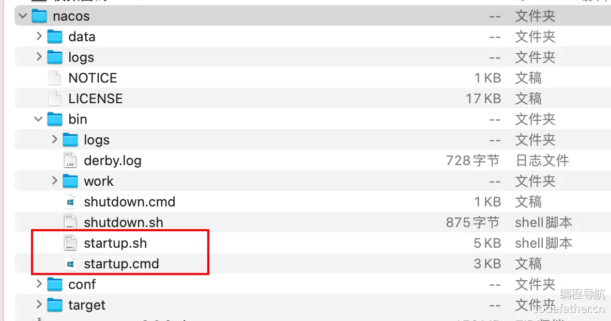
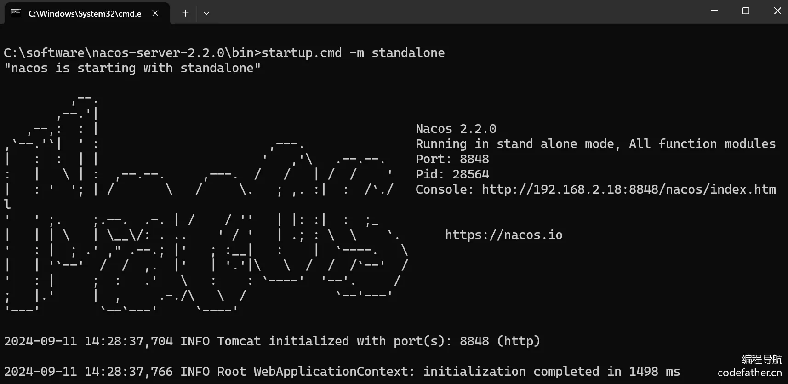
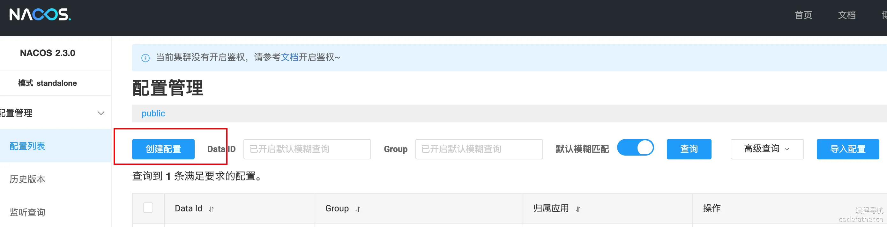
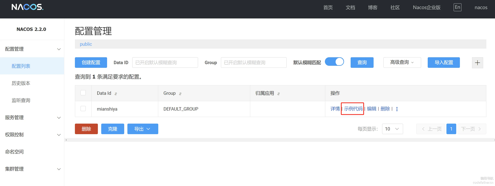
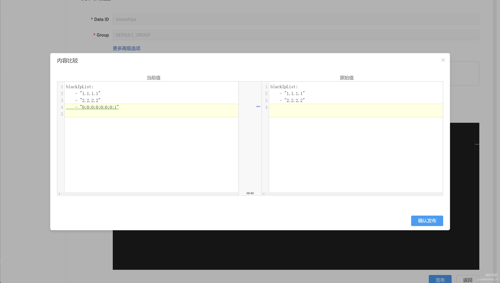
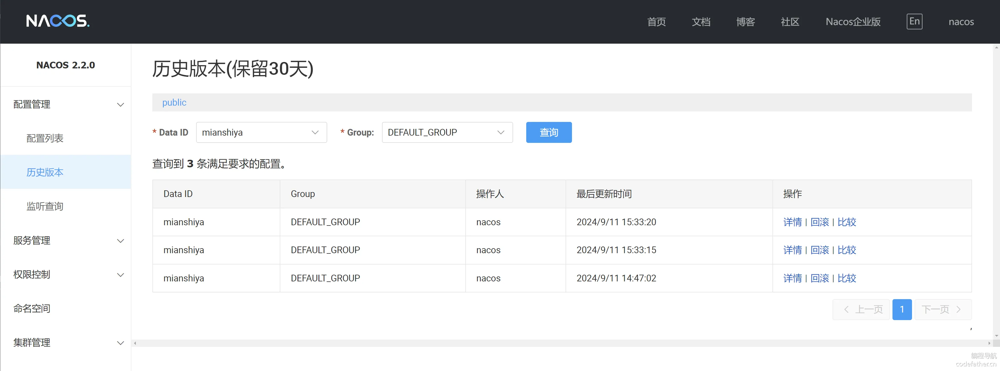
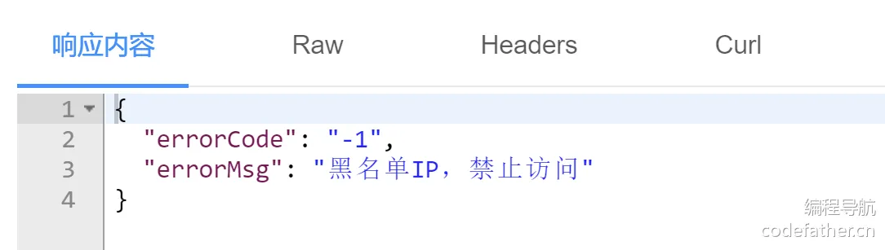

### 配置中心

#### 为什么需要配置中心？

在分布式系统中，应用的配置管理变得越来越复杂，特别是当系统规模和组件数量增加时。传统的手动配置（写固定配置文件）往往难以应对这些复杂的需求。

而配置中心的出现就是为了实现分布式系统中配置的 **集中化管理，**还提供动态更新、配置分组、版本控制、灰度发布、安全管理，简化了多环境和多实例的配置运维，确保系统的灵活性和稳定性。

一句话，专业的技术做专业的事。

#### 配置中心支持的功能

1）集中化配置管理：所有服务的配置可以在一个地方集中管理，运维人员和开发人员可以通过统一的接口修改和获取配置，避免了在每个实例中重复配置。

2）动态配置：配置中心允许在不重启应用的情况下动态更新配置，应用可以实时收到配置的修改，进行运行时的调整。

3）多环境配置管理：配置中心，可以为不同的环境配置不同的配置集，按需加载相应的环境配置文件，避免了环境间配置的混淆和出错。

4）配置的版本控制：配置中心一般都会提供版本管理功能，可以查看和回滚到之前的配置版本，这提高了系统的容错性和可恢复性。

5）配置的安全管理：配置中心一般会提供加密存储和权限控制功能，可以对敏感信息（如数据库密码、API 密钥等）进行加密处理，并限制访问权限，确保敏感配置信息的安全性。

#### 常见的配置中心

1）Spring Cloud Config：Spring Cloud 提供的配置中心解决方案，支持 Git 等版本管理系统存储配置，适合与 Spring Cloud 系统集成使用。

2）Nacos：阿里巴巴开源的服务注册中心和配置中心，支持动态配置、服务治理，适合微服务架构和 Dubbo、Spring Cloud 的深度集成。

3）Apollo：由携程开源的配置中心，支持多环境、多集群的配置管理，配置实时生效且具有权限控制，适合大规模分布式系统。

4）Consul：由 HashiCorp 提供的服务注册与配置中心，具有强一致性和健康检查功能，适用于服务网格和容器化应用。

一般业务上，我们会选择使用 Nacos 或 Apollo 来作为配置中心，因为这两个提供了比较丰富的控制台管理页面，便于我们修改维护配置。

**本项目使用 Nacos 作为配置中心的实现。**

### Nacos 入门

#### 什么是 Nacos？

[Nacos](https://nacos.io/) 是 Dynamic Naming and Configuration Service 的首字母简称，一个更易于构建云原生应用的动态服务发现、配置管理和服务管理平台。

它提供了一组简单易用的特性集，帮助我们快速实现动态服务发现、服务配置、服务元数据及流量管理。

实际上，Nacos 不仅支持配置管理，它还支持服务发现（作为注册中心），以下是官网总结的 Nacos 地图：


我们当前的项目主要使用它的配置管理功能。

#### Nacos 配置管理的核心概念

1、Namespace（命名空间）

命名空间用于隔离不同的配置集。它允许在同一个 Nacos 集群中将不同的环境（如开发、测试、生产）或者不同的业务线的配置进行隔离。（默认提供了一个 public 命名空间） 使用场景：在多租户系统中，或者需要区分不同的环境时，可以使用命名空间。例如，开发环境的配置和生产环境的配置完全隔离，可以通过不同的命名空间来管理。

2、Group（组）

配置组是用于将多个相关的配置项进行分类管理的逻辑分组机制。每个配置项可以属于不同的组，以便于配置管理。 使用场景：当一个应用有多个模块，且不同模块之间共享部分配置时，可以用组来对这些模块的配置进行分类和管理。例如，一个系统中的“支付服务”和“订单服务”可能需要用不同的组来存储各自的配置。

3、Data ID

Data ID 是一个唯一的配置标识符，通常与具体的应用程序相关。通过 Data ID，Nacos 知道如何获取特定应用的某个具体配置。 使用场景：每个应用的配置都会有一个独特的 Data ID。例如，一个支付系统可能有一个配置文件叫 `com.payment.pay-service.yaml`，这就是它的 Data ID。

4、Config Listener（配置监听器）

配置监听器用于让客户端实时监听 Nacos 配置中心中的配置变化，可以自动感知配置的更新并做出相应的处理。 使用场景：在需要动态调整配置的场景下使用，例如调整缓存大小、切换不同的服务端点等，应用可以通过监听器及时感知这些变化并应用新的配置。

#### 推送和监听

推送方法：

1. Nacos 控制台（推荐）
2. 应用程序 SDK。Nacos 支持和 Spring Boot 快速整合，可以参考 [官方文档](https://nacos.io/zh-cn/docs/quick-start-spring-boot.html)
3. [Open API](https://nacos.io/zh-cn/docs/open-api.html)

监听方法：使用 SDK 配置 Config Listener，[参考官方文档](https://nacos.io/zh-cn/docs/sdk.html) 。示例代码如下：

```java
String serverAddr = "{serverAddr}";
String dataId = "{dataId}";
String group = "{group}";
Properties properties = new Properties();
properties.put("serverAddr", serverAddr);
ConfigService configService = NacosFactory.createConfigService(properties);
String content = configService.getConfig(dataId, group, 5000);
System.out.println(content);
configService.addListener(dataId, group, new Listener() {
	@Override
	public void receiveConfigInfo(String configInfo) {
		System.out.println("recieve1:" + configInfo);
	}
	@Override
	public Executor getExecutor() {
		return null;
	}
});

// 测试让主线程不退出，因为订阅配置是守护线程，主线程退出守护线程就会退出。 正式代码中无需下面代码
while (true) {
    try {
        Thread.sleep(1000);
    } catch (InterruptedException e) {
        e.printStackTrace();
    }
}
```

或者直接通过注解读取 value，能够实时获取到最新的配置值：

```java
@Controller
@RequestMapping("config")
public class ConfigController {

    @NacosValue(value = "${useLocalCache:false}", autoRefreshed = true)
    private boolean useLocalCache;

    @RequestMapping(value = "/get", method = GET)
    @ResponseBody
    public boolean get() {
        return useLocalCache;
    }
}
```

#### 扩展知识 - Nacos 性能

在企业中，做技术选型时，性能是必不可少的考虑因素。

可以参考 Nacos 的 [官方文档](https://nacos.io/zh-cn/docs/nacos-config-benchmark.html) 了解。

写性能：

BsIfCdbcOxfxcrAyHoNumjhUY27lclYvZBP3TWJ21Ak=NlM19jOpdzoohJcm/GrGw+nMEUUssmqVWxgqzhb7Yyk=19lREw9lV3H3I+rK7vjxERQeWUOy0kwqtJjqK+R58cE=BsIfCdbcOxfxcrAyHoNumjhUY27lclYvZBP3TWJ21Ak=

| **单机**wt4tVNmXm8QgLQdra6I0fKvSrV47aw99prVO/cGe5fU= | **3节点**NlM19jOpdzoohJcm/GrGw+nMEUUssmqVWxgqzhb7Yyk= | **10节点**Zd4vN1X+Mu+cpkGy31rZ96a82qN0fwdgpTBxAm0Vg+g=zMgxcF7XAuB3MSprAFa9ecyIqm65CrajO2ECbq0kShk= | **100节点**BsIfCdbcOxfxcrAyHoNumjhUY27lclYvZBP3TWJ21Ak= |
| ---------------------------------------------------- | ----------------------------------------------------- | ------------------------------------------------------------ | ------------------------------------------------------- |
| 1400                                                 | 4214                                                  | 6863Ob+rrfxihs8C6cKC1R8DHHHNAFb3lGV+4N1WAXF+guU=             | 8626                                                    |

读性能：

bn5Rnq7vBWxb4thvZrORiI5bvPL2bO1+RwjSlYEQ2h0=NlM19jOpdzoohJcm/GrGw+nMEUUssmqVWxgqzhb7Yyk=Zd4vN1X+Mu+cpkGy31rZ96a82qN0fwdgpTBxAm0Vg+g=bn5Rnq7vBWxb4thvZrORiI5bvPL2bO1+RwjSlYEQ2h0=bn5Rnq7vBWxb4thvZrORiI5bvPL2bO1+RwjSlYEQ2h0=

| **单机**yXZ+wplD/Z/TIlcCXWQJ7meUSnldS+OOOCauQaPvvSE= | **3节点**NlM19jOpdzoohJcm/GrGw+nMEUUssmqVWxgqzhb7Yyk= | **10节点**zMgxcF7XAuB3MSprAFa9ecyIqm65CrajO2ECbq0kShk=bn5Rnq7vBWxb4thvZrORiI5bvPL2bO1+RwjSlYEQ2h0= | **100节点**19lREw9lV3H3I+rK7vjxERQeWUOy0kwqtJjqK+R58cE= |
| ---------------------------------------------------- | ----------------------------------------------------- | ------------------------------------------------------------ | ------------------------------------------------------- |
| 15000                                                | 23013                                                 | 45000zMgxcF7XAuB3MSprAFa9ecyIqm65CrajO2ECbq0kShk=            | 161099                                                  |

对 Nacos 有初步了解后，下面我们基于 Nacos 实现 IP 黑名单需求。

### 后端开发

#### 1、下载 Nacos Server

可以在 Nacos 官网下载对应版本的 Nacos 应用包，**此处使用和 Sentinel 兼容的 2.2.0 版本，一定不要使用其他版本！否则除了问题不好解决！**

可以在官方下载：https://nacos.io/download/release-history/

本教程为大家提供了软件包：https://pan.baidu.com/s/1u73-Nlolrs8Rzb1_b6X6HA ，提取码：c2sd

#### 2、启动 Nacos Server

解压下载好的压缩包：



Linux/Unix/Mac 启动命令如下（standalone 代表着单机模式运行，非集群模式）：

```bash
sh startup.sh -m standalone
```

Windows 启动命令：

```bash
startup.cmd -m standalone
```

启动成功，如图：



如果报找不到 Java，那就配置 JAVA_HOME、环境变量或者安装 Java：https://www.oracle.com/java/technologies/downloads/#java8

如何使用 Nacos 呢？其实比较简单，直接看教程和示例代码，拿来就能用！

- 文档：https://nacos.io/zh-cn/docs/quick-start.html
- 教程：https://sca.aliyun.com/zh-cn/docs/2021.0.5.0/user-guide/nacos/quick-start
- 示例代码：https://github.com/alibaba/spring-cloud-alibaba/tree/2022.x/spring-cloud-alibaba-examples/nacos-example

#### 3、通过 Nacos 控制台添加配置

1）访问：http://127.0.0.1:8848/nacos ，默认用户名和密码都是 nacos


2）点击创建配置：



填写配置，推荐 yaml 格式：

```yaml
blackIpList:
    - "1.1.1.1"
    - "2.2.2.2"
```

如图：


#### 4、项目引入 Nacos 依赖

可以直接使用 Spring Boot Starter 快速引入 Nacos，[参考文档](https://nacos.io/zh-cn/docs/quick-start-spring-boot.html)。

1）在项目 pom.xml 文件中，引入以下依赖配置：

```xml
<dependency>
    <groupId>com.alibaba.boot</groupId>
    <artifactId>nacos-config-spring-boot-starter</artifactId>
    <version>0.2.12</version>
</dependency>
```

注意：版本 0.2.x.RELEASE 对应的是 Spring Boot 2.x 版本，版本 0.1.x.RELEASE 对应的是 Spring Boot 1.x 版本。（经测试，本项目可使用 0.2.12 版本）

2）修改 application.yml 配置文件，添加 Nacos Server 地址等配置：

```yaml
# 配置中心
nacos:
  config:
    server-addr: 127.0.0.1:8848  # nacos 地址
    bootstrap:
      enable: true  # 预加载
    data-id: mianshiya # 控制台填写的 Data ID
    group: DEFAULT_GROUP # 控制台填写的 group
    type: yaml  # 选择的文件格式
    auto-refresh: true # 开启自动刷新
```

#### 5、创建黑名单过滤工具类

新建 blackfilter 包，黑名单过滤相关的代码都放到该包下，模块化。

可以用 Hutool 或 Guava 库自带的 bloomfilter，[参考文章](https://blog.csdn.net/asd051377305/article/details/139684962)，如果是分布式，还可以考虑 Redisson。

此处由于项目已经使用了 Hutool 工具库，就用其自带的 BitMapBloomFilter 即可。

示例代码如下：

```java
@Slf4j
public class BlackIpUtils {

    private static BitMapBloomFilter bloomFilter;

    // 判断 ip 是否在黑名单内
    public static boolean isBlackIp(String ip) {
        return bloomFilter.contains(ip);
    }

    // 重建 ip 黑名单
    public static void rebuildBlackIp(String configInfo) {
        if (StrUtil.isBlank(configInfo)) {
            configInfo = "{}";
        }
        // 解析 yaml 文件
        Yaml yaml = new Yaml();
        Map map = yaml.loadAs(configInfo, Map.class);
        // 获取 ip 黑名单
        List<String> blackIpList = (List<String>) map.get("blackIpList");
        // 加锁防止并发
        synchronized (BlackIpUtils.class) {
            if (CollectionUtil.isNotEmpty(blackIpList)) {
                // 注意构造参数的设置
                BitMapBloomFilter bitMapBloomFilter = new BitMapBloomFilter(958506);
                for (String ip : blackIpList) {
                    bitMapBloomFilter.add(ip);
                }
                bloomFilter = bitMapBloomFilter;
            } else {
                bloomFilter = new BitMapBloomFilter(100);
            }
        }
    }
}
```

注意，BitMapBloomFilter 接受的参数比较特殊，关于如何计算 BloomFilter 参数值，鱼皮在 GitHub 找到了一个说法，可以自行测试：https://github.com/dromara/hutool/issues/3356。

💡 注意，因为 Nacos 配置文件的监听的粒度比较粗，只能知晓配置有变更，无法知晓是新增、删除还是修改，因此不论是选择布隆过滤器还是 HashSet 最方便的处理逻辑就是重建。

#### 6、创建 Nacos 配置监听类

可以直接通过 Nacos 控制台获取示例代码：



在 blackfilter 包中新增监听器代码，追求性能的话可以自定义线程池：

```java
@Slf4j
@Component
public class NacosListener implements InitializingBean {

    @NacosInjected
    private ConfigService configService;

    @Value("${nacos.config.data-id}")
    private String dataId;

    @Value("${nacos.config.group}")
    private String group;

    @Override
    public void afterPropertiesSet() throws Exception {
        log.info("nacos 监听器启动");

        String config = configService.getConfigAndSignListener(dataId, group, 3000L, new Listener() {
            final ThreadFactory threadFactory = new ThreadFactory() {
                private final AtomicInteger poolNumber = new AtomicInteger(1);
                @Override
                public Thread newThread(@NotNull Runnable r) {
                    Thread thread = new Thread(r);
                    thread.setName("refresh-ThreadPool" + poolNumber.getAndIncrement());
                    return thread;
                }
            };
            final ExecutorService executorService = Executors.newFixedThreadPool(1, threadFactory);

            // 通过线程池异步处理黑名单变化的逻辑
            @Override
            public Executor getExecutor() {
                return executorService;
            }

            // 监听后续黑名单变化
            @Override
            public void receiveConfigInfo(String configInfo) {
                log.info("监听到配置信息变化：{}", configInfo);
                BlackIpUtils.rebuildBlackIp(configInfo);
            }
        });
        // 初始化黑名单
        BlackIpUtils.rebuildBlackIp(config);
    }
}
```

#### 7、创建黑名单过滤器

黑名单应该对所有请求生效（不止是 Controller 的接口），所以基于 WebFilter 实现而不是 AOP 切面。WebFilter 的优先级高于 @Aspect 切面，因为它在整个 Web 请求生命周期中更早进行处理。

请求进入时的顺序：

- WebFilter：首先，WebFilter 拦截 HTTP 请求，并可以根据逻辑决定是否继续执行请求。
- Spring AOP 切面（@Aspect）：如果请求经过过滤器并进入 Spring 管理的 Bean（例如 Controller 层），此时切面生效，对匹配的 Bean 方法进行拦截。
- Controller 层：如果 @Aspect 没有阻止执行，最终请求到达 @Controller 或 @RestController 的方法。

代码如下：

```java
@WebFilter(urlPatterns = "/*", filterName = "blackIpFilter")
public class BlackIpFilter implements Filter {

    @Override
    public void doFilter(ServletRequest servletRequest, ServletResponse servletResponse, FilterChain filterChain) throws IOException, ServletException {

        String ipAddress = NetUtils.getIpAddress((HttpServletRequest) servletRequest);
        if (BlackIpUtils.isBlackIp(ipAddress)) {
            servletResponse.setContentType("text/json;charset=UTF-8");
            servletResponse.getWriter().write("{\"errorCode\":\"-1\",\"errorMsg\":\"黑名单IP，禁止访问\"}");
            return;
        }
        filterChain.doFilter(servletRequest, servletResponse);
    }

}
```

需要在启动类上加上 `@ServletComponentScan`，这样过滤器才会被扫描到。

```java
@SpringBootApplication(exclude = {RedisAutoConfiguration.class})
@MapperScan("com.yupi.mianshiya.mapper")
@EnableScheduling
@EnableAspectJAutoProxy(proxyTargetClass = true, exposeProxy = true)
@ServletComponentScan
public class MainApplication {

    public static void main(String[] args) {
        SpringApplication.run(MainApplication.class, args);
    }

}
```

#### 8、测试效果

通过 Nacos 控制台修改配置，本地测试的话直接加入本机 IP 即可：

```java
blackIpList:
    - "1.1.1.1"
    - "2.2.2.2"
    - "0:0:0:0:0:0:0:1"
```

如图：



Nacos 控制台能看到改动记录：



在应用中可以实时接受到配置的修改，使得黑名单实时生效：


通过 Swagger 测试黑名单效果：


