### Sentinel 入门

https://sentinelguard.io/zh-cn/index.html

#### 1、核心概念

1）资源：表示要保护的业务逻辑或代码块。我们说的资源，可以是任何东西，服务、服务里的方法、甚至是一段代码。

使用 Sentinel 来进行资源保护，主要分为几个步骤:

1. 定义资源
2. 定义规则
3. 检验规则是否生效

**先把可能需要保护的资源定义好，之后再配置规则。**也可以理解为，只要有了资源，我们就可以在任何时候灵活地定义各种流量控制规则。在编码的时候，只需要考虑这个代码是否需要保护，如果需要保护，就将之定义为一个资源。

有多种定义资源的方法，比如编程式和注解式，[参考官方文档](https://sentinelguard.io/zh-cn/docs/basic-api-resource-rule.html) 。

2）规则：Sentinel 使用规则来定义对资源的保护策略。

可以 [参考官方文档](https://sentinelguard.io/zh-cn/docs/basic-api-resource-rule.html) 来了解规则，比如：

- 限流规则：用于控制流量的规则，设置 QPS（每秒查询量）等参数，防止系统过载。
- 熔断规则：用于实现熔断降级的规则，当某个资源的异常比例或响应时间超过阈值时，触发熔断，短时间内不再访问该资源。
- 系统规则：根据系统的整体负载（如 CPU 使用率、内存使用率等）进行保护，适合在系统级别进行流量控制。
- 热点参数规则：用于限制某个方法的某些热点参数的访问频率，避免某些参数导致流量过大。
- 授权规则：用于定义黑白名单的授权规则，控制资源访问的权限。

3）控制台： Sentinel 控制台是一个可视化的管理工具，主要用于监控、管理和配置 Sentinel 的流控规则、熔断规则等。它提供了一个友好的界面，让用户可以轻松地操作。这是 Sentinel 的核心优势，可以提升可观测性，没有 Sentinel 控制台，感觉就失去了使用它的灵魂。

4）客户端：是指集成了 Sentinel 的应用程序，通常是通过引入 Sentinel 的依赖来接入。客户端负责在本地对资源进行监控、限流、熔断，并将 **数据上报** 给控制台。

#### 2、架构设计

[参考官方文档的基本原理](https://sentinelguard.io/zh-cn/docs/basic-implementation.html)，总体架构设计如下：

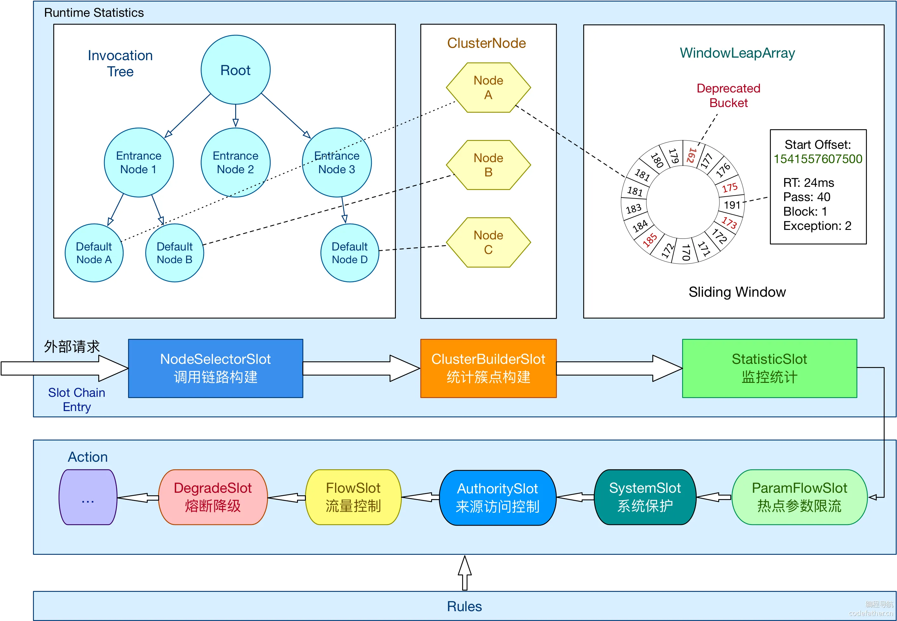

Sentinel 将 `ProcessorSlot` 作为 SPI 接口进行扩展，使得 Slot Chain 具备了扩展的能力。您可以自行加入自定义的 slot 并编排 slot 间的顺序，从而可以给 Sentinel 添加自定义的功能。

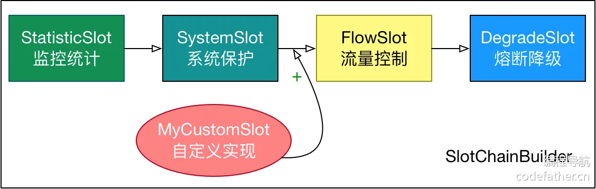

对于限流系统，指标的统计依然是实现关键，Sentinel 中使用高性能的环形计数器（滑动窗口）来实现：

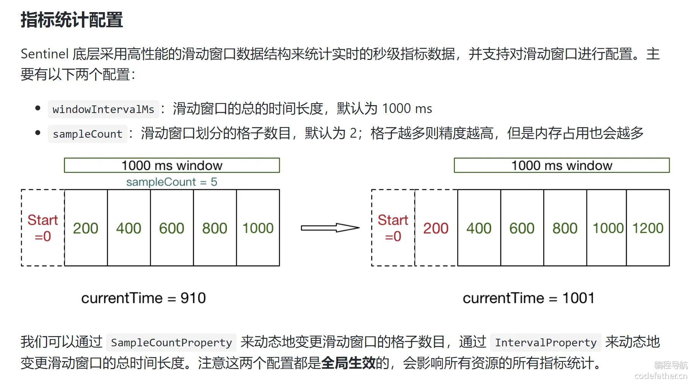

下面我们来安装和使用 Sentinel。

#### 3、Sentinel 入门 Demo

可以 [参考官网编写入门 Demo](https://sentinelguard.io/zh-cn/docs/quick-start.html)，在本地通过 Main 方法运行一个 Sentinel 客户端程序。

运行成功后，可以在当前用户根目录下（~/logs/csp/${appName}-metrics.log.xxx）看到输出：

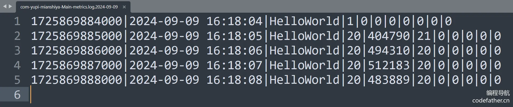

#### 4、下载并启动 Sentinel 控制台

可以 [参考官方文档](https://sentinelguard.io/zh-cn/docs/dashboard.html) 进行安装。

1）下载控制台 jar 包并在本地启动，可以访问从 [github](https://github.com/alibaba/Sentinel/releases) 上下载 release的 jar 包。

本教程为大家提供了软件包：https://pan.baidu.com/s/1u73-Nlolrs8Rzb1_b6X6HA ，提取码：c2sd

2）直接在命令行窗口启动 Sentinel 控制台：

注意：启动 Sentinel 控制台需要 JDK 版本为 1.8 及以上版本。

命令：

```java
java -Dserver.port=8131 -jar sentinel-dashboard-1.8.6.jar	
```

启动成功：


本地访问 http://localhost:8131/（你填的端口），即可访问控制台，**默认账号和密码都是 sentinel**


4）客户端接入控制台

引入 Maven 依赖，用于和 Sentinel 控制台通讯：

```xml
<dependency>
  <groupId>com.alibaba.csp</groupId>
  <artifactId>sentinel-transport-simple-http</artifactId>
  <version>1.8.6</version>
</dependency>
```

程序启动时需要加入 JVM 参数 `-Dcsp.sentinel.dashboard.server=consoleIp:port` 指定控制台地址和端口。若启动多个应用，则需要通过 `-Dcsp.sentinel.api.port=xxxx` 指定客户端监控 API 的端口（默认是 8719）。

Sentinel 非常贴心，提供了很多框架整合的依赖，便于开发，比如 Spring Web 项目支持将所有的接口自动识别为资源：


可以根据使用的框架引入适配依赖，[参考官方文档](https://sentinelguard.io/zh-cn/docs/open-source-framework-integrations.html)。

此处直接运行 Main 方法来演示效果，JVM 参数为：`-Dcsp.sentinel.dashboard.server=localhost:8131`

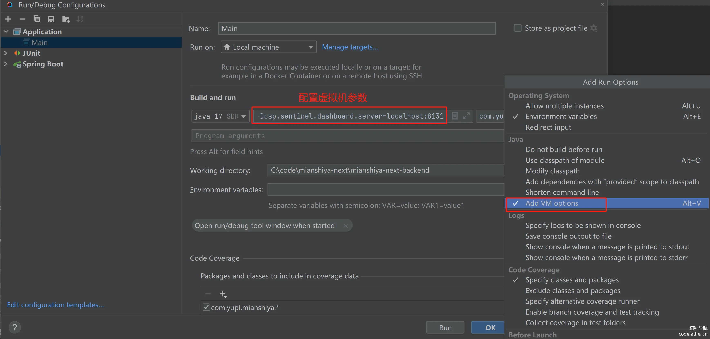

还有更多的配置，比如更改日志目录等，可以看 [官方文档](https://sentinelguard.io/zh-cn/docs/startup-configuration.html) 了解。

**确保客户端有访问量**，Sentinel 会在 **客户端首次调用的时候** 进行初始化，开始向控制台发送心跳包。通过控制台可以查看到实时访问情况：


查看机器列表和健康情况：

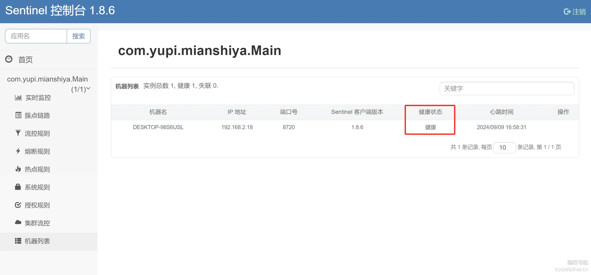

簇点链路（单机调用链路）页面实时的去拉取指定客户端资源的运行情况。它一共提供两种展示模式：一种用树状结构展示资源的调用链路，另外一种则不区分调用链路展示资源的运行情况。如图：

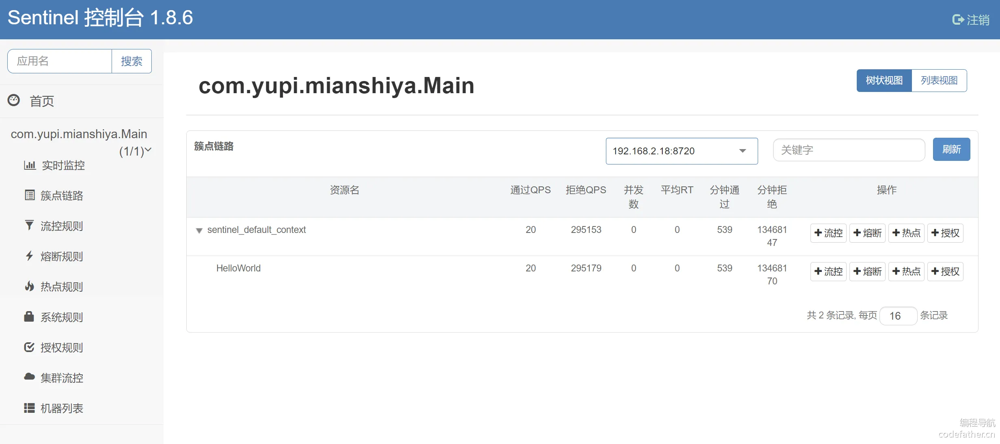

#### 5、规则管理和推送

问题：Sentinel 的规则存储在哪里呢？又是如何通过控制台修改规则之后，将规则同步给客户端进行限流熔断的呢？

[官方文档](https://sentinelguard.io/zh-cn/docs/dashboard.html) 有详细地介绍：Sentinel 控制台同时提供简单的规则管理以及推送的功能。规则推送分为 3 种模式，包括 "原始模式"、"Pull 模式" 和 "Push 模式"。

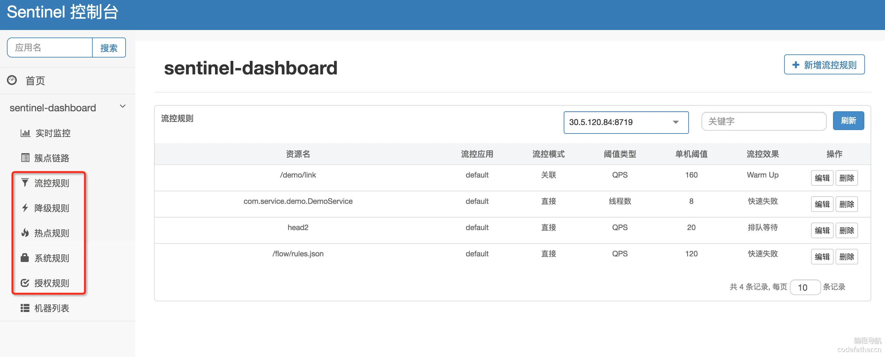

目前控制台的规则推送也是通过 [规则查询更改 HTTP API](https://github.com/alibaba/Sentinel/wiki/如何使用#查询更改规则) 来更改规则。**这也意味着这些规则仅在内存态生效，应用重启之后，该规则会丢失。**

以上是原始模式。当了解了原始模式之后，官方建议通过 [动态规则](https://sentinelguard.io/zh-cn/docs/dynamic-rule-configuration.html) 并结合各种外部存储来定制自己的规则源。我们推荐通过动态配置源的控制台来进行规则写入和推送，而不是通过 Sentinel 客户端直接写入到动态配置源中。

在生产环境中，官方推荐 push 模式，支持自定义存储规则的配置中心，控制台改变规则后，会 push 到配置中心。

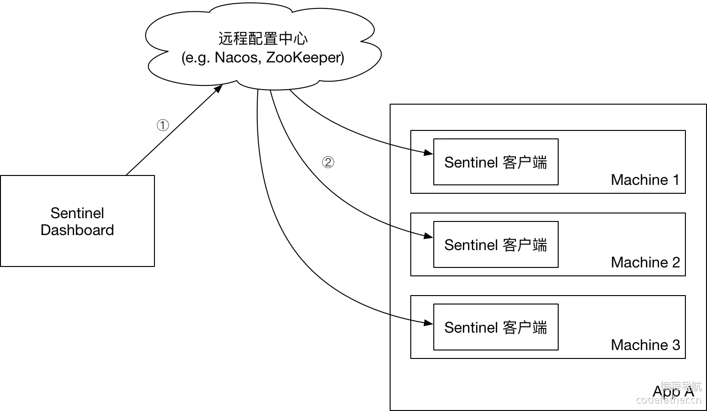

更多规则管理和推送规则可以阅读：[在生产环境使用 Sentinel](https://github.com/alibaba/Sentinel/wiki/在生产环境中使用-Sentinel)。

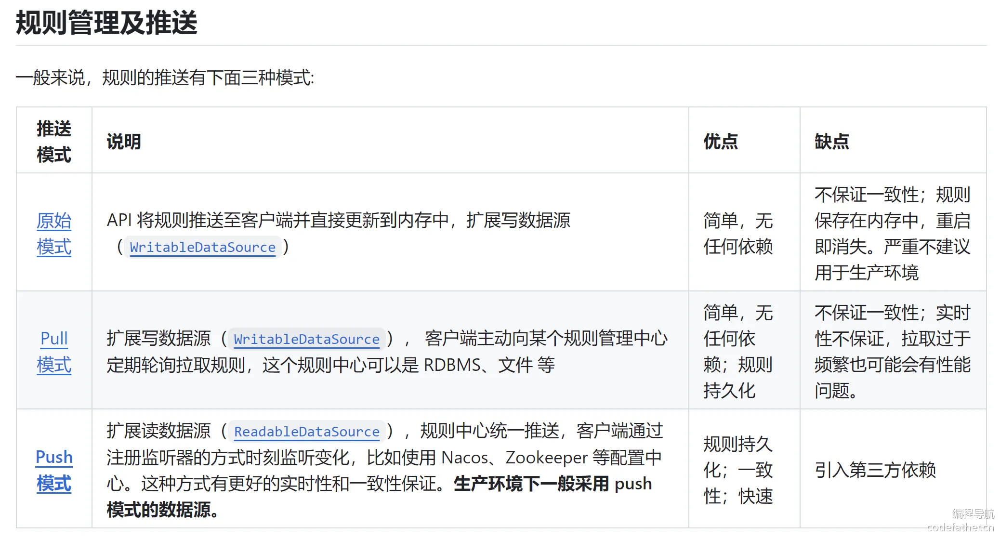

#### 6、整合 Spring Boot

基于 Spring Boot Starter + 注解模式开发 + 原始规则推送模式开发

Spring Boot 项目可以轻松和 Sentinel 集成，直接引入一个 starter，使用 [Spring Cloud Alibaba Sentinel](https://github.com/alibaba/spring-cloud-alibaba/wiki/Sentinel) 即可。

**在引入整合依赖时，一定要注意版本号！**

建议 [参考官方文档选择版本](https://github.com/alibaba/spring-cloud-alibaba/wiki/版本说明)。由于 Spring Boot 3.0，Spring Boot 2.7~2.4 和 2.4 以下版本之间变化较大，目前企业级客户老项目相关 Spring Boot 版本仍停留在 Spring Boot 2.4 以下，为了同时满足存量用户和新用户不同需求，社区以 Spring Boot 3.0 和 2.4 分别为分界线，同时维护 2022.x、2021.x、2.2.x 三个分支迭代。

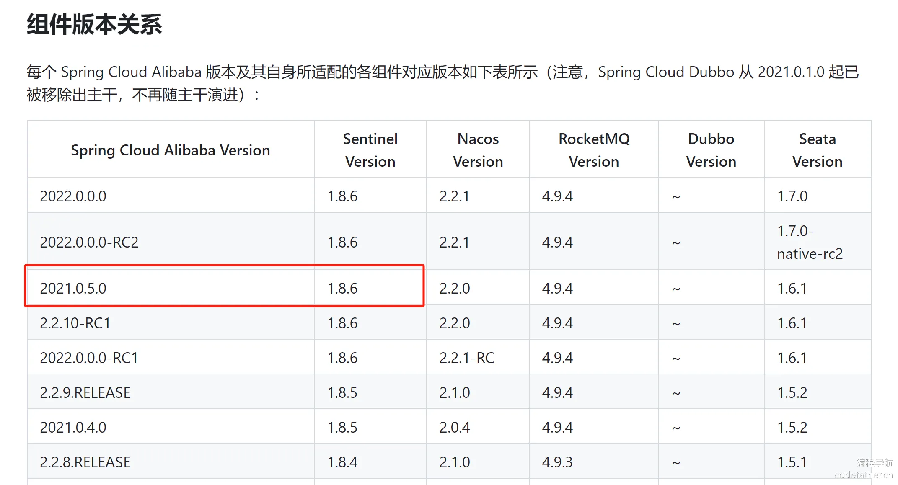

本项目 Spring Boot 用的是 2.7，因此使用 Sentinel Starter 的版本 2021.0.5.0。在项目中引入依赖：

```xml
<!-- https://mvnrepository.com/artifact/com.alibaba.cloud/spring-cloud-starter-alibaba-sentinel -->
<dependency>
    <groupId>com.alibaba.cloud</groupId>
    <artifactId>spring-cloud-starter-alibaba-sentinel</artifactId>
    <version>2021.0.5.0</version>
</dependency>
```

可以看到，该依赖自动整合了 Sentinel 的 core 包、客户端通讯包、注解开发包、webmvc 适配包、热点参数限流包等：

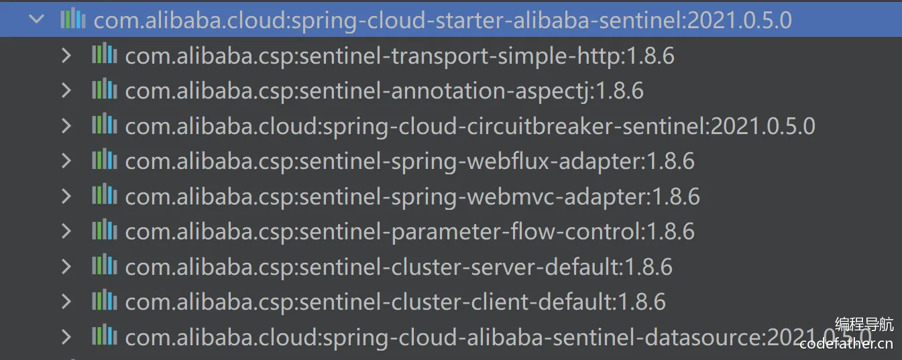

整合包支持自动将所有的接口根据 url 路径识别为资源。启动项目后，通过接口文档测试就能看到监控效果：

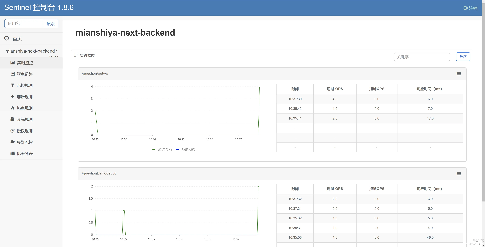


#### 7、开发模式

Sentinel 的开发主要包括定义资源和定义规则。

**1）定义资源**：支持通过代码、引入框架适配、[注解方式](https://sentinelguard.io/zh-cn/docs/annotation-support.html) 定义资源。

通过代码定义资源，更灵活：

```java
Entry entry = null;
// 务必保证finally会被执行
try {
  // 资源名可使用任意有业务语义的字符串
  entry = SphU.entry("自定义资源名");
  // 被保护的业务逻辑
  // do something...
} catch (BlockException e1) {
  // 资源访问阻止，被限流或被降级
  // 进行相应的处理操作
} finally {
  if (entry != null) {
    entry.exit();
  }
}
```

通过注解定义资源，更快捷可读：

```java
public class TestService {

    // 对应的 `handleException` 函数需要位于 `ExceptionUtil` 类中，并且必须为 static 函数.
    @SentinelResource(value = "test", blockHandler = "handleException", blockHandlerClass = {ExceptionUtil.class})
    public void test() {
        System.out.println("Test");
    }

    // 原函数
    @SentinelResource(value = "hello", blockHandler = "exceptionHandler", fallback = "helloFallback")
    public String hello(long s) {
        return String.format("Hello at %d", s);
    }
    
    // Fallback 函数，函数签名与原函数一致或加一个 Throwable 类型的参数.
    public String helloFallback(long s) {
        return String.format("Halooooo %d", s);
    }

    // Block 异常处理函数，参数最后多一个 BlockException，其余与原函数一致.
    public String exceptionHandler(long s, BlockException ex) {
        // Do some log here.
        ex.printStackTrace();
        return "Oops, error occurred at " + s;
    }
}
```

`@SentinelResource` 注解的配置优先于自动识别的配置。这意味着，如果注解中定义了特定的限流或熔断策略，这些策略将覆盖默认的或自动识别的配置。

推荐开发模式：优先使用适配包来自动识别资源，然后能运用注解尽量运用注解，最后再选择主动编码定义资源。

**2）定义规则：**支持通过代码、控制台（推荐）、配置文件来定义规则。

比如通过代码定义一个限流规则，更灵活：

```java
private static void initFlowQpsRule() {
    List<FlowRule> rules = new ArrayList<>();
    FlowRule rule1 = new FlowRule();
    rule1.setResource(resource);
    // Set max qps to 20
    rule1.setCount(20);
    rule1.setGrade(RuleConstant.FLOW_GRADE_QPS);
    rule1.setLimitApp("default");
    rules.add(rule1);
    FlowRuleManager.loadRules(rules);
}
```

通过控制台配置，更高效：

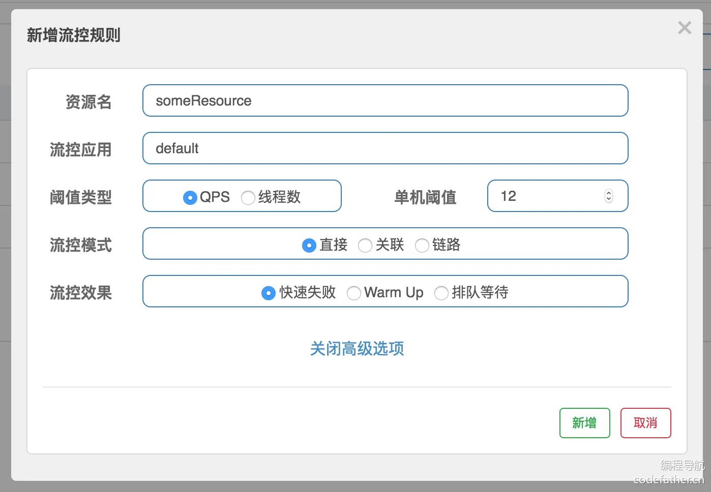

一般推荐使用控制台来配置规则，但如果希望开发者更快启动和学习项目，可以通过编码定义规则，这样不用搭建控制台、而且每次启动项目都会确保规则被创建。

#### 8、其他特性

除了限流外，Sentinel 还提供了多种规则，都可以通过官方文档来了解。

1. [熔断降级](https://sentinelguard.io/zh-cn/docs/circuit-breaking.html)：用于实现熔断降级的规则，当某个资源的异常比例或响应时间超过阈值时，触发熔断，短时间内不再访问该资源。
2. [系统自适应保护](https://sentinelguard.io/zh-cn/docs/system-adaptive-protection.html)：根据系统的整体负载（如 CPU 使用率、内存使用率等）进行保护，适合在系统级别进行流量控制。
3. [热点参数限流](https://sentinelguard.io/zh-cn/docs/parameter-flow-control.html)：用于限制某个方法的某些热点参数的访问频率，避免某些参数导致流量过大。
4. [来源访问控制](https://sentinelguard.io/zh-cn/docs/origin-authority-control.html)：用于定义黑白名单的授权规则，控制资源访问的权限。

接下来，我们通过本项目的需求实现，带大家实战 Sentinel 开发。

### 后端开发（Sentinel 实战）

#### 1、查看题库列表接口限流熔断

资源：listQuestionBankVOByPage 接口

目的：控制对耗时较长的、经常访问的接口的请求频率，防止过多请求导致系统过载。

限流规则：

- 策略：整个接口每秒钟不超过 10 次请求
- 阻塞操作：提示“系统压力过大，请耐心等待”

熔断规则：

- 熔断条件：如果接口异常率超过 10%，或者慢调用（响应时长 > 3 秒）的比例大于 20%，触发 60 秒熔断。
- 熔断操作：直接返回本地数据（缓存或空数据）

**开发模式：用注解定义资源 + 基于控制台定义规则**

1）定义资源。给需要限流的接口添加 @SentinelResource 注解：

```java
@PostMapping("/list/page/vo")
@SentinelResource(value = "listQuestionBankVOByPage",
        blockHandler = "handleBlockException",
        fallback = "handleFallback")
public BaseResponse<Page<QuestionBankVO>> listQuestionBankVOByPage(
    @RequestBody QuestionBankQueryRequest questionBankQueryRequest,
    HttpServletRequest request) {
}
```

上述代码中，参考 [注解使用官方文档](https://sentinelguard.io/zh-cn/docs/annotation-support.html) 指定了资源名称、阻塞处理器和降级处理器。

启动项目，注意需加入 JVM 参数 `-Dcsp.sentinel.dashboard.server=consoleIp:port` 指定控制台地址和端口。


启动项目成功并且访问接口后，可以在控制台看到刚定义的资源：

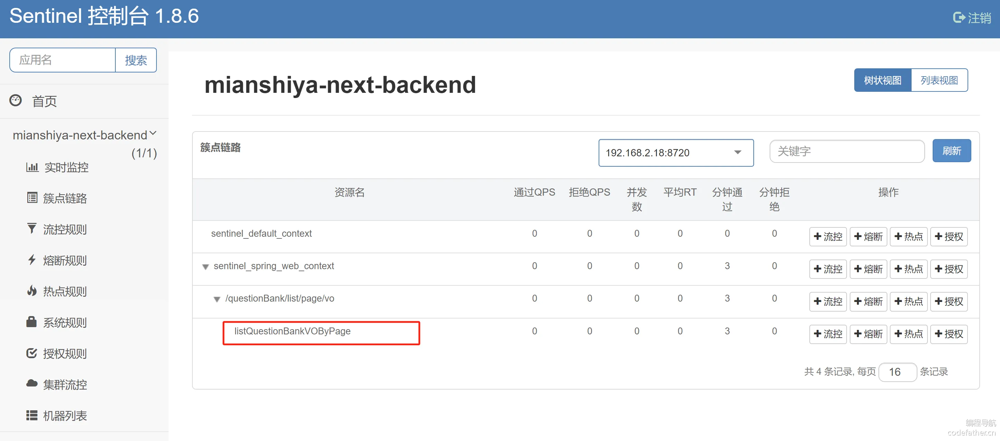

2）实现限流阻塞和熔断降级方法。注意遵循 [官方文档的方法定义规则](https://sentinelguard.io/zh-cn/docs/annotation-support.html)：

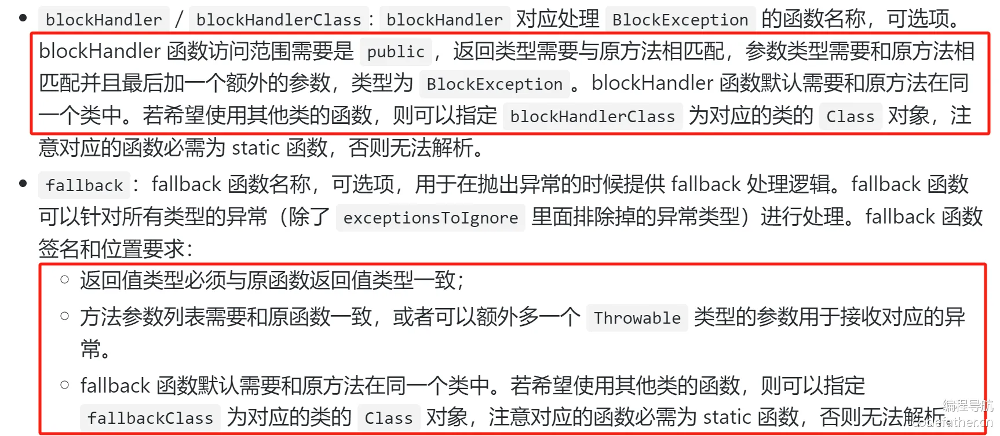

为了实现方便，尽快验证效果，我们先在接口相同的 Controller 中编写限流阻塞和降级方法：

```java
/**
 * listQuestionBankVOByPage 降级操作：直接返回本地数据
 */
public BaseResponse<Page<QuestionBankVO>> handleFallback(@RequestBody QuestionBankQueryRequest questionBankQueryRequest,
                                                         HttpServletRequest request, Throwable ex) {
    // 可以返回本地数据或空数据
    return ResultUtils.success(null);
}

/**
 * listQuestionBankVOByPage 流控操作
 * 限流：提示“系统压力过大，请耐心等待”
 */
public BaseResponse<Page<QuestionBankVO>> handleBlockException(@RequestBody QuestionBankQueryRequest questionBankQueryRequest,
                                                               HttpServletRequest request, BlockException ex) {
    // 限流操作
    return ResultUtils.error(ErrorCode.SYSTEM_ERROR, "系统压力过大，请耐心等待");
}
```

3）通过控制台定义规则

限流规则：根据需求配置即可

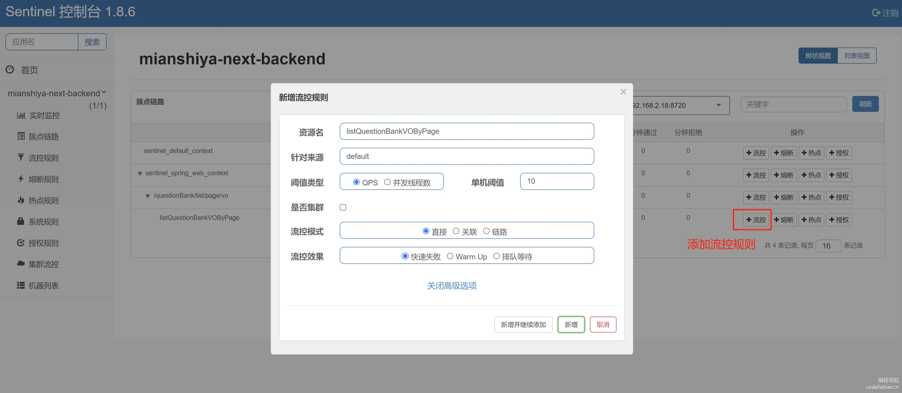

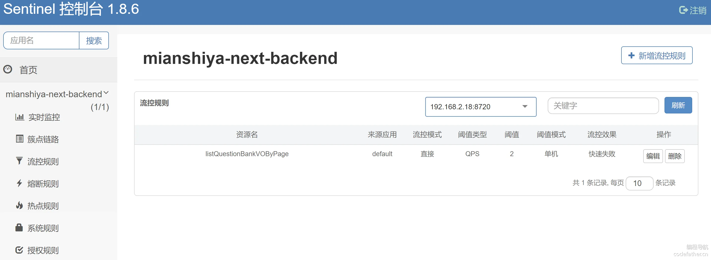

熔断规则：新增两条熔断规则，注意设置最小请求数、统计时长

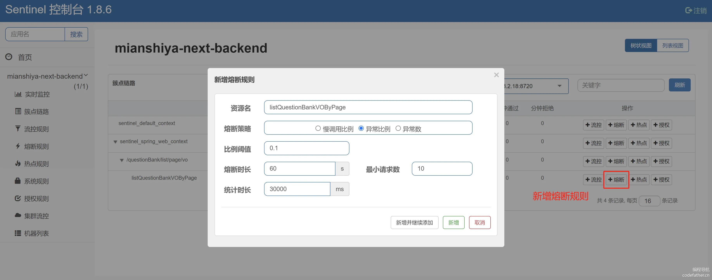


4）测试

为便于测试，可以先将限流熔断规则调整到容易触发的值，然后通过接口文档测试调用，查看效果。

连续快速发送多次请求，触发限流，执行了 `blockHandler` 处理器的逻辑：


注意，只有业务异常（比如请求参数错误、或者数据库操作失败等问题），才会算到熔断条件中，限流熔断本身的异常 BlockException 是不计算的。

测试熔断的时候，可以故意给 sortField 请求参数传一个不存在的字段，触发业务异常。可以尝试下熔断的触发和恢复：

1. 先通过传错业务参数触发异常，导致熔断
2. 等待熔断结束后，再触发一次异常，还会继续熔断
3. 过一段时间，再触发一次正常请求，则熔断解除

测试发现，任何业务异常（不仅仅是被熔断了），都会触发 `fallbackHandler`，该方法可作为一个通用的降级逻辑处理器。

测试发现，如果 `blockHandler` 和 `fallbackHandler` 同时配置，当熔断器打开后，仍然会进入 `blockHandler` 进行处理，因此需要在该方法中处理因为熔断触发的降级逻辑：

```java
/**
 * listQuestionBankVOByPage 流控操作
 * 限流：提示“系统压力过大，请耐心等待”
 * 熔断：执行降级操作
 */
public BaseResponse<Page<QuestionBankVO>> handleBlockException(@RequestBody QuestionBankQueryRequest questionBankQueryRequest,
                                                               HttpServletRequest request, BlockException ex) {
    // 降级操作
    if (ex instanceof DegradeException) {
        return handleFallback(questionBankQueryRequest, request, ex);
    }
    // 限流操作
    return ResultUtils.error(ErrorCode.SYSTEM_ERROR, "系统压力过大，请耐心等待");
}
```

Sentinel 的 `blockHandler` 处理的是`BlockException`，该异常表示系统受到流量控制限制（如限流或熔断），这些不是业务逻辑中的异常，因此 `fallback` 不会处理这些异常。如果不配置 `blockHandler`，才会在熔断时，进入到 `fallbackHandler` 中进行兜底。

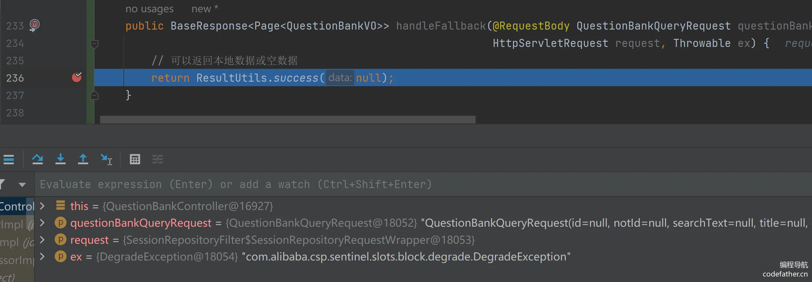

总结一下：

- `blockHandler` 处理 Sentinel 流量控制异常，如 `BlockException`。
- `fallback` 处理业务逻辑中的异常，比如我们自己的 `BusinessException`。

可以根据自己的实际情况配置。

#### **2、单 IP 查看题目列表限流熔断**

资源：listQuestionVoByPage 接口

限流规则：

- 策略：每个 IP 地址每分钟允许查看题目列表的次数不能超过 60 次。
- 阻塞操作：提示“访问过于频繁，请稍后再试”

熔断规则：

- 熔断条件：如果接口异常率超过 10%，或者慢调用（响应时长 > 3 秒）的比例大于 20%，触发 60 秒熔断。
- 熔断操作：直接返回本地数据（缓存或空数据）

由于需要针对每个用户进一步精细化限流，而不是整体接口限流，可以采用 [热点参数限流机制](https://sentinelguard.io/zh-cn/docs/parameter-flow-control.html)，允许根据参数控制限流触发条件。

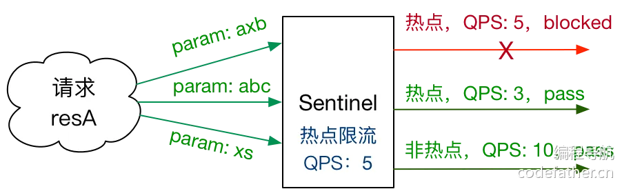

对于我们的需求，可以将 IP 地址作为热点参数。

1）定义资源

对于 `@SentinelResource` 注解方式定义的资源，若注解作用的方法上有参数，Sentinel 会将它们作为参数传入 `SphU.entry(res, args)`。比如以下的方法里面 `uid` 和 `type` 会分别作为第一个和第二个参数传入 Sentinel API，从而可以用于热点规则判断：

```java
@SentinelResource("myMethod")
public Result doSomething(String uid, int type) {
  // some logic here...
}
```

由于 Controller 接口参数较杂乱，使用编程式定义资源的方法。

💡 这里建议新写一个接口，不要污染原有接口，等测试稳定后，再进行切换。

代码如下：

```java
// 基于 IP 限流
String remoteAddr = request.getRemoteAddr();
Entry entry = null;
try  {
    entry = SphU.entry("listQuestionVOByPage", EntryType.IN, 1, remoteAddr);
    // 被保护的业务逻辑
    // 查询数据库
    Page<Question> questionPage = questionService.listQuestionByPage(questionQueryRequest);
    // 获取封装类
    return ResultUtils.success(questionService.getQuestionVOPage(questionPage, request));
} catch (BlockException ex) {
    // 资源访问阻止，被限流或被降级
    if (ex instanceof DegradeException) {
        return handleFallback(questionQueryRequest, request, ex);
    }
    // 限流操作
    return ResultUtils.error(ErrorCode.SYSTEM_ERROR, "访问过于频繁，请稍后再试");
} finally {
    if (entry != null) {
        entry.exit(1, remoteAddr);
    }
}
```

💡需要特别注意！

1. 若 entry 的时候传入了热点参数，那么 exit 的时候也一定要带上对应的参数（`exit(count, args)`），否则可能会有统计错误。**这个时候不能使用 try-with-resources 的方式。**
2. `SphU.entry(xxx)` 需要与 `entry.exit()` 方法成对出现，匹配调用，否则会导致调用链记录异常，抛出 `ErrorEntryFreeException` 异常。

注意 Sentinel 的降级仅针对业务异常，对 Sentinel 限流降级本身的异常 `BlockException` 不生效。为了统计异常比例或异常数，需要手动通过 `Tracer.trace(ex)` 记录业务异常。示例：

```java
Entry entry = null;
try {
  entry = SphU.entry(resource);

  // Write your biz code here.
  // <<BIZ CODE>>
} catch (Throwable t) {
  if (!BlockException.isBlockException(t)) {
    Tracer.trace(t);
  }
} finally {
  if (entry != null) {
    entry.exit();
  }
}
```

注意，通过 `Tracer.trace(ex)` 来统计异常信息时，由于 try-with-resources 语法中 catch 调用顺序的问题，会导致无法正确统计异常数，因此统计异常信息时也不能在 try-with-resources 的 catch 块中调用 `Tracer.trace(ex)`。

💡 为什么上一个需求中，我们不用手动调用 Tracer 上报异常呢？因为使用 Sentinel 的开源整合模块，如 Sentinel Dubbo Adapter, Sentinel Web Servlet Filter 或 `@SentinelResource` 注解会自动统计业务异常，无需手动调用。

需要给我们的资源定义增加异常统计代码：

```java
catch (Throwable ex) {
    // 业务异常
    if (!BlockException.isBlockException(ex)) {
        Tracer.trace(ex);
        return ResultUtils.error(ErrorCode.SYSTEM_ERROR, "系统错误");
    }
    // 降级操作
    if (ex instanceof DegradeException) {
        return handleFallback(questionQueryRequest, request, ex);
    }
    // 限流操作
    return ResultUtils.error(ErrorCode.SYSTEM_ERROR, "访问过于频繁，请稍后再试");
}
```

2）编写阻塞和降级操作代码

```java
try {
    entry = SphU.entry("listQuestionVOByPage", EntryType.IN, 1, remoteAddr);
    // 被保护的业务逻辑
    // 查询数据库
    Page<Question> questionPage = questionService.listQuestionByPage(questionQueryRequest);
    // 获取封装类
    return ResultUtils.success(questionService.getQuestionVOPage(questionPage, request));
} catch (Throwable ex) {
    // 业务异常
    if (!BlockException.isBlockException(ex)) {
        Tracer.trace(ex);
        return ResultUtils.error(ErrorCode.SYSTEM_ERROR, "系统错误");
    }
    // 降级操作
    if (ex instanceof DegradeException) {
        return handleFallback(questionQueryRequest, request, ex);
    }
    // 限流操作
    return ResultUtils.error(ErrorCode.SYSTEM_ERROR, "访问过于频繁，请稍后再试");
} finally {
    if (entry != null) {
        entry.exit(1, remoteAddr);
    }
}

/**
 * listQuestionVOByPage 降级操作：直接返回本地数据
 */
public BaseResponse<Page<QuestionVO>> handleFallback(QuestionQueryRequest questionQueryRequest,
                                                         HttpServletRequest request, Throwable ex) {
    // 可以返回本地数据或空数据
    return ResultUtils.success(null);
}
```

3）通过编码方式定义规则。可以新建 `sentinel` 包并定义一个单独的 Manager 作为 Bean，利用 @PostConstruct 注解，在 Bean 加载后创建规则。代码如下：

```java
@Component
public class SentinelRulesManager {

    @PostConstruct
    public void initRules() {
        initFlowRules();
        initDegradeRules();
    }

    // 限流规则
    public void initFlowRules() {
        // 单 IP 查看题目列表限流规则
        ParamFlowRule rule = new ParamFlowRule("listQuestionVOByPage")
                .setParamIdx(0) // 对第 0 个参数限流，即 IP 地址
                .setCount(60) // 每分钟最多 60 次
                .setDurationInSec(60); // 规则的统计周期为 60 秒
        ParamFlowRuleManager.loadRules(Collections.singletonList(rule));
    }

    // 降级规则
    public void initDegradeRules() {
        // 单 IP 查看题目列表熔断规则
        DegradeRule slowCallRule = new DegradeRule("listQuestionVOByPage")
                .setGrade(CircuitBreakerStrategy.SLOW_REQUEST_RATIO.getType())
                .setCount(0.2) // 慢调用比例大于 20%
                .setTimeWindow(60) // 熔断持续时间 60 秒
                .setStatIntervalMs(30 * 1000) // 统计时长 30 秒
                .setMinRequestAmount(10) // 最小请求数
                .setSlowRatioThreshold(3); // 响应时间超过 3 秒

        DegradeRule errorRateRule = new DegradeRule("listQuestionVOByPage")
                .setGrade(CircuitBreakerStrategy.ERROR_RATIO.getType())
                .setCount(0.1) // 异常率大于 10%
                .setTimeWindow(60) // 熔断持续时间 60 秒
                .setStatIntervalMs(30 * 1000) // 统计时长 30 秒
                .setMinRequestAmount(10); // 最小请求数

        // 加载规则
        DegradeRuleManager.loadRules(Arrays.asList(slowCallRule, errorRateRule));
    }
}
```

4）测试

启动项目就能看到规则：

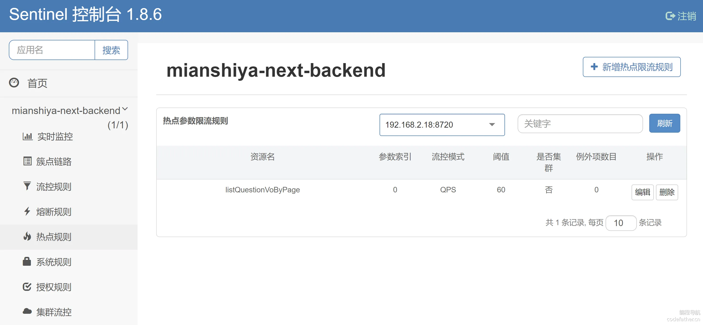

为了测试方便，可以先将规则的阈值调整小一点，然后通过接口文档验证效果。

限流效果：


测试降级效果的时候，可以故意将 sortField 传一个不存在的字段。效果如图，触发了 DegradeException：


### 扩展知识

#### 1、仅对部分 URL 进行统计（性能优化）

参考：[https://github.com/alibaba/spring-cloud-alibaba/wiki/Sentinel#%E9%85%8D%E7%BD%AE](https://github.com/alibaba/spring-cloud-alibaba/wiki/Sentinel#配置)‘

可以修改监听的 URL 规则配置：

```xml
spring.cloud.sentinel.filter.url-patterns=/*
```

#### 2、规则配置本地持久化

参考官方文档的配置：https://sentinelguard.io/zh-cn/docs/dynamic-rule-configuration.html

官方提供了 Demo，可以用文件来本地持久化配置，这样重启项目后配置就不会丢失了。

- [读写本地文件 Demo](https://github.com/alibaba/Sentinel/blob/master/sentinel-demo/sentinel-demo-dynamic-file-rule/src/main/java/com/alibaba/csp/sentinel/demo/file/rule/FileDataSourceInit.java)（先看这个）
- [读本地文件 Demo](https://github.com/alibaba/Sentinel/blob/master/sentinel-demo/sentinel-demo-dynamic-file-rule/src/main/java/com/alibaba/csp/sentinel/demo/file/rule/FileDataSourceDemo.java)


示例代码如下，可以在 SentinelManager 的初始化逻辑中调用：

```java
/**
 * 持久化配置为本地文件
 */
public void listenRules() throws Exception {
    // 获取项目根目录
    String rootPath = System.getProperty("user.dir");
    // sentinel 目录路径
    File sentinelDir = new File(rootPath, "sentinel");
    // 目录不存在则创建
    if (!FileUtil.exist(sentinelDir)) {
        FileUtil.mkdir(sentinelDir);
    }
    // 规则文件路径
    String flowRulePath = new File(sentinelDir, "FlowRule.json").getAbsolutePath();
    String degradeRulePath = new File(sentinelDir, "DegradeRule.json").getAbsolutePath();

    // Data source for FlowRule
    ReadableDataSource<String, List<FlowRule>> flowRuleDataSource = new FileRefreshableDataSource<>(flowRulePath, flowRuleListParser);
    // Register to flow rule manager.
    FlowRuleManager.register2Property(flowRuleDataSource.getProperty());
    WritableDataSource<List<FlowRule>> flowWds = new FileWritableDataSource<>(flowRulePath, this::encodeJson);
    // Register to writable data source registry so that rules can be updated to file
    WritableDataSourceRegistry.registerFlowDataSource(flowWds);

    // Data source for DegradeRule
    FileRefreshableDataSource<List<DegradeRule>> degradeRuleDataSource
            = new FileRefreshableDataSource<>(
            degradeRulePath, degradeRuleListParser);
    DegradeRuleManager.register2Property(degradeRuleDataSource.getProperty());
    WritableDataSource<List<DegradeRule>> degradeWds = new FileWritableDataSource<>(degradeRulePath, this::encodeJson);
    // Register to writable data source registry so that rules can be updated to file
    WritableDataSourceRegistry.registerDegradeDataSource(degradeWds);
}

private Converter<String, List<FlowRule>> flowRuleListParser = source -> JSON.parseObject(source,
        new TypeReference<List<FlowRule>>() {
        });
private Converter<String, List<DegradeRule>> degradeRuleListParser = source -> JSON.parseObject(source,
        new TypeReference<List<DegradeRule>>() {
        });

private <T> String encodeJson(T t) {
    return JSON.toJSONString(t);
}
```

然后可以测试读写效果。

#### 3、代码组织结构优化

限流阻塞和降级方法可以单独抽成独立的类，Sentinel 的资源名称也可以单独定义为常量，统一放到 sentinel 包中，更模块化。

常量类：

```java
/**
 * Sentinel 限流熔断常量
 */
public interface SentinelConstant {

    /**
     * 分页获取题库列表接口限流
     */
    String listQuestionBankVOByPage = "listQuestionBankVOByPage";

    /**
     * 分页获取题目列表接口限流
     */
    String listQuestionVOByPage = "listQuestionVOByPage";
}
```

#### 4、封装限流组件为 Spring Boot Starter

为了简化项目的配置和依赖管理，减少限流组件的接入成本，我们通过 Starter 封装限流组件，将多个相关的依赖打包成一个 Maven 依赖，用户只需引入一个依赖即可完成配置，而不需要手动引入每个模块的依赖。

1）创建一个 spring boot 项目

将无用的默认依赖都移除，例如默认的配置文件、启动文件、test 相关等。

2）引入需要的依赖。完整 pom 文件如下：

```xml
<?xml version="1.0" encoding="UTF-8"?>
<project xmlns="http://maven.apache.org/POM/4.0.0" xmlns:xsi="http://www.w3.org/2001/XMLSchema-instance"
         xsi:schemaLocation="http://maven.apache.org/POM/4.0.0 https://maven.apache.org/xsd/maven-4.0.0.xsd">
    <modelVersion>4.0.0</modelVersion>
    <parent>
        <groupId>org.springframework.boot</groupId>
        <artifactId>spring-boot-starter-parent</artifactId>
        <version>2.7.2</version>
        <relativePath/> <!-- lookup parent from repository -->
    </parent>
    <groupId>com.yupi</groupId>
    <artifactId>limit-spring-boot-starter</artifactId>
    <version>0.0.1-SNAPSHOT</version>
    <name>limit-spring-boot-starter</name>
    <description>limit-spring-boot-starter</description>
    <properties>
        <java.version>1.8</java.version>
    </properties>
    <dependencies>
        <dependency>
            <groupId>org.springframework.boot</groupId>
            <artifactId>spring-boot-starter</artifactId>
        </dependency>

        <dependency>
            <groupId>com.alibaba.csp</groupId>
            <artifactId>sentinel-core</artifactId>
            <version>1.8.6</version>
        </dependency>
        <dependency>
            <groupId>com.alibaba.csp</groupId>
            <artifactId>sentinel-transport-simple-http</artifactId>
            <version>1.8.6</version>
        </dependency>
        <dependency>
            <groupId>com.alibaba.csp</groupId>
            <artifactId>sentinel-annotation-aspectj</artifactId>
            <version>1.8.6</version>
        </dependency>
        <dependency>
            <groupId>com.alibaba.csp</groupId>
            <artifactId>sentinel-parameter-flow-control</artifactId>
            <version>1.8.6</version>
        </dependency>
    </dependencies>


</project>
```

3）创建配置文件

```java
@ConfigurationProperties(prefix = "spring")
public class LimitProperties {
    private String sentinelDashboard;
    private List<LimitRule> limitRules;

    public List<LimitRule> getLimitRules() {
        return limitRules;
    }

    public void setLimitRules(List<LimitRule> limitRules) {
        this.limitRules = limitRules;
    }

    public String getSentinelDashboard() {
        return sentinelDashboard;
    }

    public void setSentinelDashboard(String sentinelDashboard) {
        this.sentinelDashboard = sentinelDashboard;
    }

    public static class LimitRule {
        private String resource;
        private int grade;
        private int count;

        public String getResource() {
            return resource;
        }

        public void setResource(String resource) {
            this.resource = resource;
        }

        public int getGrade() {
            return grade;
        }

        public void setGrade(int grade) {
            this.grade = grade;
        }

        public int getCount() {
            return count;
        }

        public void setCount(int count) {
            this.count = count;
        }
    }

}
```

4）创建自动配置类

```java
@Configuration
@EnableConfigurationProperties(LimitProperties.class)
public class LimitAutoConfiguration {

    @Resource
    private LimitProperties properties;

    @Bean
    @ConditionalOnMissingBean
    public SentinelResourceAspect sentinelResourceAspect() {
        return new SentinelResourceAspect();
    }

    @PostConstruct
    public void initLimit() {
        initDefaultRule();
        initDashboard();
    }


    private void initDefaultRule() {
        List<LimitProperties.LimitRule> limitRules = properties.getLimitRules();
        if (CollectionUtils.isEmpty(limitRules)) {
            return;
        }

        List<FlowRule> rules = new ArrayList<>();
        for (LimitProperties.LimitRule limitRule : limitRules) {
            FlowRule rule = new FlowRule();
            rule.setResource(limitRule.getResource());
            rule.setGrade(limitRule.getGrade());
            rule.setCount(limitRule.getCount());
            rules.add(rule);
        }
        FlowRuleManager.loadRules(rules);
    }

    private void initDashboard() {
        SentinelConfig.setConfig("csp.sentinel.dashboard.server", properties.getSentinelDashboard());
    }
}
```

5）创建 spring.factories 文件。

在 src/main/resources/META-INF 目录下创建 spring.factories 文件，并在其中定义自动配置类。


文件内容：

```plain
org.springframework.boot.autoconfigure.EnableAutoConfiguration=\
  com.yupi.limitspringbootstarter.LimitAutoConfiguration
```

6）本地 install

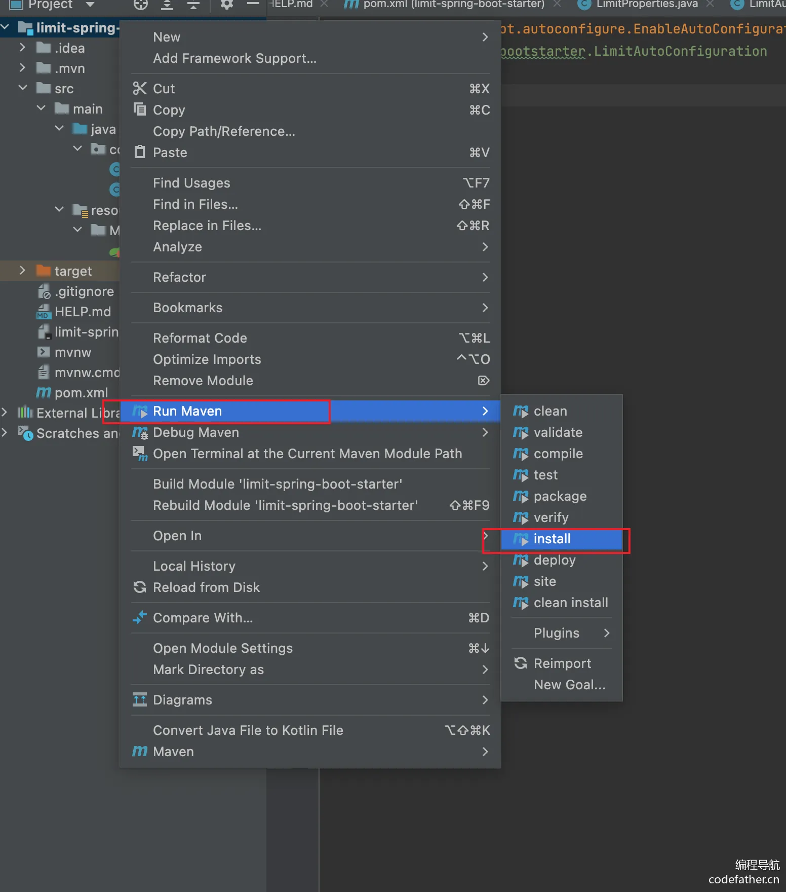

这样本地仓库就有了当前的 starter。

7）使用。后端项目引入此 starter：

```xml
  <dependency>
      <artifactId>limit-spring-boot-starter</artifactId>
      <groupId>com.yupi</groupId>
      <version>0.0.1-SNAPSHOT</version>
  </dependency>
```

application.yml 文件中填写对应限流配置：

```yaml
spring:
  # sentinel 控制台地址
  sentinelDashboard: localhost:7878 
  # 限流规则
  limitRules:
    - resource: "QuestionBank"
      count: 5
      grade: 1
```

项目中同样还是使用 `@SentinelResource`注解，也可以通过控制台动态配置限流。