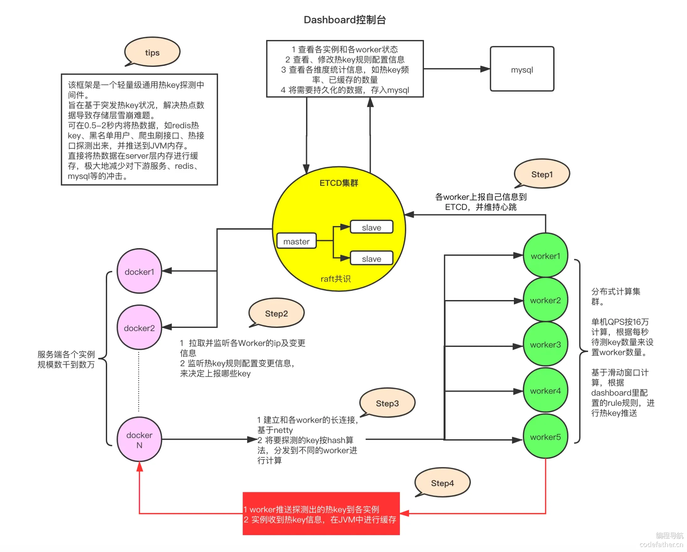
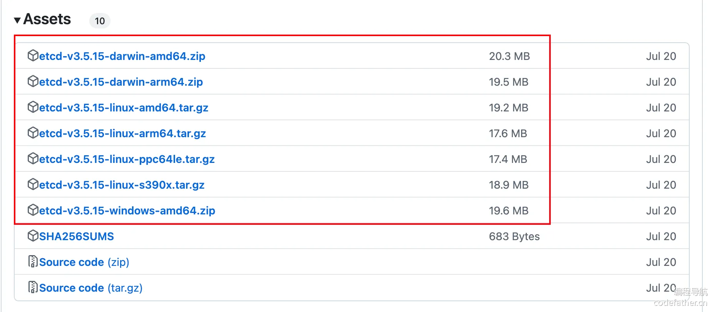
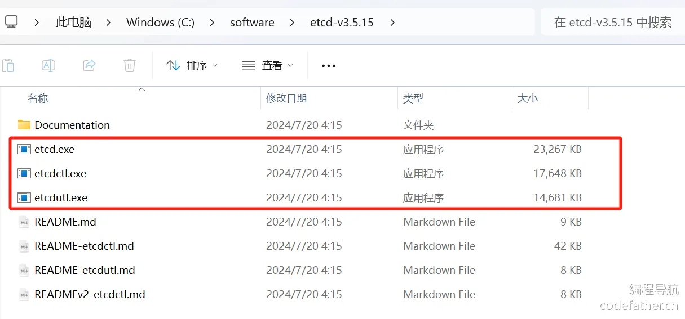
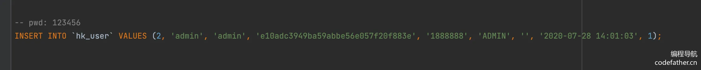
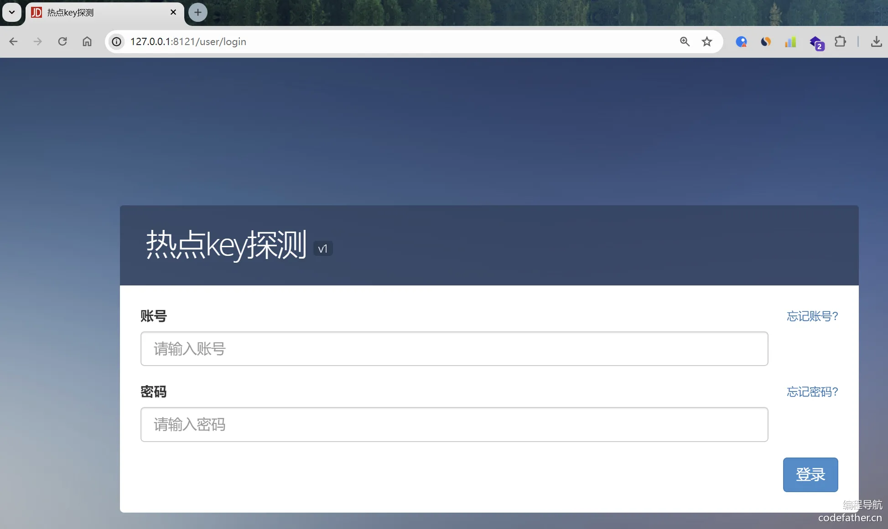
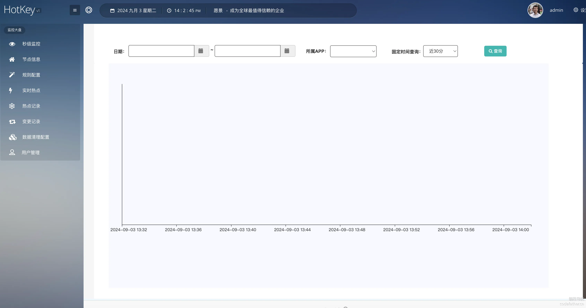
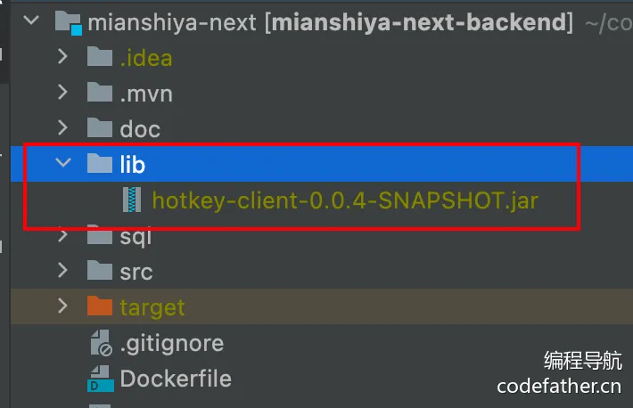
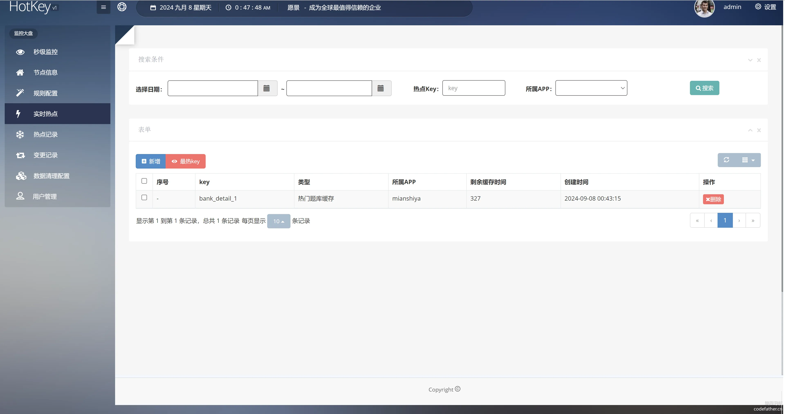

### hotkey 入门

京东提供了一个轻量级通用的热 key 探测中间件 [hotkey](https://gitee.com/jd-platform-opensource/hotkey)。

根据官方仓库描述：hotkey 是京东APP后台热数据探测框架，历经多次高压压测和京东 618、双 11 大促考验。

在上线运行的这段时间内，**每天探测的 key 数量数十亿计**，精准捕获了大量爬虫、刷子用户，另准确探测大量热门商品并毫秒级推送到各个服务端内存，大幅降低了热数据对数据层的查询压力，提升了应用性能。**在大促期间，hotkey 的 worker 集群秒级吞吐量达到 1500 万级别。**

根据官方压测：一台 8 核 8G 的机器，每秒可以处理来自于数千台服务器发来的高达 16 万个的待测 key，8 核单机吞吐量在 16 万，16 核机器每秒可达 30 万以上探测量，所以仅采用 10 台机器，即可完成每秒近 300 万次的 key 探测任务。

这是一个真正经历过实战的高性能热点 key 探测框架，整体架构如下：



#### 核心组件

它的主要核心组件如下：

1）Etcd 集群

Etcd 作为一个高性能的配置中心，可以以极小的资源占用，提供高效的监听订阅服务。主要用于存放规则配置，各 worker 的 ip 地址，以及探测出的热 key、手工添加的热 key 等。

Etcd 常用于配置中心和注册中心，鱼皮在 [编程导航的手写 RPC 项目](https://www.code-nav.cn/course/1768543954720022530) 中讲解过。

2）client 端 jar 包

就是在服务中添加的引用 jar，引入后，就可以便捷地去判断某 key 是否热 key。同时，该 jar 完成了 key 上报、监听 Etcd 里的 rule 变化、worker 信息变化、热 key 变化，对热 key 进行本地 Caffeine 缓存等。

3）worker 端集群

worker 端是一个独立部署的 Java 程序，启动后会连接 Etcd，并定期上报自己的 ip 信息，供 client 端获取地址并进行长连接。之后，主要就是对各个 client 发来的待测 key 进行 **累加计算**，当达到 Etcd 里设定的 rule 阈值后，将热 key 推送到各个 client。

4）dashboard 控制台

控制台是一个带可视化界面的 Java 程序，也是连接到 Etcd，之后在控制台设置各个 APP 的 key 规则，譬如 2 秒出现 20 次算热 key。然后当 worker 探测出来热 key 后，会将 key 发往 etcd，dashboard 也会监听热 key 信息，进行入库保存记录。同时，dashboard 也可以手工添加、删除热 key，供各个 client 端监听。

更详细的内容，可见京东技术团队 [官方的文章](https://mp.weixin.qq.com/s/xOzEj5HtCeh_ezHDPHw6Jw)，最具可信度。

### 后端开发（hotkey 实战）

hotkey 搭建可以直接参考 [官方的安装教程](https://gitee.com/jd-platform-opensource/hotkey#安装教程)。

#### 1、安装 Etcd

直接从[ github](https://github.com/etcd-io/etcd/releases) 上下载最新版本的 Etcd 即可，选择对应的操作系统版本：



或直接通过本教程提供的软件包下载：https://pan.baidu.com/s/1u73-Nlolrs8Rzb1_b6X6HA

提取码：c2sd

下载后解压压缩包，会得到 3 个脚本：

- etcd：etcd 服务本身
- etcdctl：客户端，用于操作 etcd，比如读写数据
- etcdutl：备份恢复工具



执行 etcd 脚本后，可以启动 etcd 服务，服务默认占用 2379 和 2380 端口，作用分别如下：

- 2379：提供 HTTP API 服务，和 etcdctl 交互
- 2380：集群中节点间通讯


#### 2、安装 hotkey worker

从 [hotkey 官方仓库](https://gitee.com/jd-platform-opensource/hotkey) 下载源码，注意，本教程使用的是 hotkey v0.0.4 版本，**JDK 的版本必须小于 17！否则会报找不到类的错误！**

项目导入 IDEA 后，打开 worker 模块。worker 是一个 Spring Boot 项目，启动前需要先修改 applicaiton.yml 中的配置。比如端口配置（本教程使用 8111）：


修改完配置后，直接点击 WorkerApplication 启动即可。

如下图，此时 worker 就已经正常启动，并且连接上 Etcd 了：


后续如果要打包部署，可以通过 Maven 打包得到 worker 的 jar 包，比如在整个 hotkey 项目根目录执行 mvn package，会依次对各模块打包。


也可以直接下载已经打包好的 jar，本教程为大家提供了软件包：https://pan.baidu.com/s/1u73-Nlolrs8Rzb1_b6X6HA ，提取码：c2sd

然后可以通过命令启动 worker，可以携带参数来修改配置：

```shell
java -jar worker-0.0.4-SNAPSHOT.jar --etcd.server=127.0.0.1:2379
```

#### 3、启动 hotkey 控制台

接着打开 dashboard 项目，执行 resource 目录下的 db.sql 文件，创建 dashboard 所需的库表。hotkey 依赖 MySQL 来存储用户账号信息、热点阈值规则等。

在执行脚本前，记得先配置好 MySQL 连接，并且在 SQL 脚本文件中创建和指定数据库：

```sql
create database hotkey_db;
use hotkey_db;
```

执行脚本过程如图：


从 db.sql 中可以看到内置了 admin 账号， 密码为 123456



然后修改下 application.yml 配置文件，包括 dashboard 占用端口号（本教程使用 8121）、数据库配置和 etcdServer 地址等：

```yaml
server:
  port: 8121
spring:
  datasource:
    username: ${MYSQL_USER:root}
    password: ${MYSQL_PASS:123456}
    url: jdbc:mysql://${MYSQL_HOST:localhost}:3306/hotkey_db?useUnicode=true&characterEncoding=utf-8&useSSL=true&serverTimezone=UTC&useTimezone=true&serverTimezone=GMT
    driver-class-name: com.mysql.cj.jdbc.Driver
etcd:
  server: ${etcdServer:http://127.0.0.1:2379}
```

dashboard 也是一个 SpringBoot 项目，直接在 IDEA 内执行 DashboardApplication 启动即可。

访问 [http://127.0.0.1:8121，即可看到界面：](http://127.0.0.1:8121，即可看到界面：/)



输入管理员的账号密码（admin，123456）后，即可成功登录：



初次使用时需要先添加 APP。建议先在用户管理菜单中，添加一个新用户，设置昵称为 APP 名称、并填写所属 APP，如 mianshiya，密码此处就设置为 123456。之后就可以登录这个新建的用户来给应用设置规则了 (当然也可以使用 admin 账户添加)，而且系统会自动创建一个 APP。


随后，在规则配置中，选择对应的 APP，新增对应的热点探测规则：


如下图就是一组规则：


我们解析下其中的第二条 rule： as__ 开头的热 key 的规则就是 interval-2 秒内出现了 threshold-10 次就认为它是热 key，它就会被推送到 jvm 内存中，并缓存 60 秒，prefix-true 代表前缀匹配。那么在应用中，就可以把一组 key，都用 as__ 开头，用来探测。

#### 4、引入 hotkey client

有 2 种引入 hotkey client 的方式：

1. 手动源码打包
2. 通过 [Maven 远程仓库](https://mvnrepository.com/artifact/io.github.ck-jesse/jd-hotkey-client) 引入

由于 Maven 远程仓库的包引用量过少，而且不具备官方权威性，所以更推荐通过 hotkey 源码手动打包。（经过鱼皮踩坑测试，果然引入远程仓库的包后出现了客户端和 worker 之间心跳失败的问题）

所以选择方式 1，手动将 hotkey 源码中的 client 模块通过 Maven 打成 jar 包：


从生成的 target 中找到 `with-dependencies` 的 jar 包，可以修改名称为 `hotkey-client-0.0.4-SNAPSHOT.jar`：


也可以直接下载已经打包好的 jar，本教程为大家提供了软件包：https://pan.baidu.com/s/1u73-Nlolrs8Rzb1_b6X6HA ，提取码：c2sd

接着在要引入 hotkey client 的项目中创建 lib 文件夹，放入 client 的 jar 包。注意要把该 jar 包添加到 Git 仓库中，否则其他人无法正常运行你的项目。



然后通过 Maven 引入即可：

```xml
<dependency>
  <artifactId>hotkey-client</artifactId>
  <groupId>com.jd.platform.hotkey</groupId>
  <version>0.0.4-SNAPSHOT</version>
  <scope>system</scope>
  <systemPath>${project.basedir}/lib/hotkey-client-0.0.4-SNAPSHOT.jar</systemPath>
</dependency>
```

但是在本项目中引入该依赖后，项目无法运行，因为 Hutool 依赖库版本冲突了。

💡 注意，使用 `system` 作用域并不是最佳实践，原因是 `system` 作用域的依赖具有 **最高优先级**。它会跳过 Maven 的依赖解析机制，直接使用你指定的本地 JAR 文件，因此它的优先级会高于其他任何来自依赖树中的传递依赖或外层依赖声明。

具体来说：

1. 跳过依赖管理：`system` 作用域会跳过 Maven 的依赖管理和版本解析。你必须手动管理依赖版本和路径，Maven 无法帮你解析冲突、升级版本或使用传递依赖。
2. 无法排除依赖：由于 `system` 作用域是强制性的，任何试图通过 `exclusions` 排除这个依赖的尝试都会失败。其他模块或依赖项中的冲突问题也无法通过正常的 `dependencyManagement` 或 `exclusions` 机制来解决。
3. 不可传递：`system` 作用域的依赖不会传递给其他模块。也就是说，如果你的项目被其他项目依赖，`system` 作用域的依赖不会自动传递给依赖你的项目。这可能导致构建或运行时的依赖问题。
4. 路径硬编码：`system` 作用域的依赖路径是硬编码的，并且指定为本地文件系统的绝对路径或相对路径。这使得项目在不同开发环境中变得难以移植，也不符合 Maven 的通用依赖管理原则。

所以一般建议将依赖包通过 Maven 安装（install）到本地仓库，或者上传包到 Maven 官方库，或者在团队内部使用 Maven 私服来管理依赖。

但这里我们不这么做，考虑到教程项目，要让开发者更容易地使用项目。所以还是直接拷贝 jar，开发者就不用自己 mvn install 来安装包了，否则还可能出现报错。

其实还有更粗暴的方法，直接爆改源码中使用的 hutool 版本，但是一般不建议这么做，毕竟你不了解别人的项目，还是该自己的方便一些。

所以我们的做法是，降低项目的 hutool 版本，改动点也不多，所以还好。

比如：

```java
if (StrUtil.isNotBlank(tagsStr)) {
    questionEsDTO.setTags(JSONUtil.toList(JSONUtil.parseArray(tagsStr), String.class));
}
String fileSuffix = FileNameUtil.getSuffix(multipartFile.getOriginalFilename());
```

引入依赖后，在代码中编写初始化 client 的配置类，会读取配置文件并执行初始化逻辑：

```java
@Configuration
@ConfigurationProperties(prefix = "hotkey")
@Data
public class HotKeyConfig {

    /**
     * Etcd 服务器完整地址
     */
    private String etcdServer = "http://127.0.0.1:2379";

    /**
     * 应用名称
     */
    private String appName = "app";

    /**
     * 本地缓存最大数量
     */
    private int caffeineSize = 10000;

    /**
     * 批量推送 key 的间隔时间
     */
    private long pushPeriod = 1000L;

    /**
     * 初始化 hotkey
     */
    @Bean
    public void initHotkey() {
        ClientStarter.Builder builder = new ClientStarter.Builder();
        ClientStarter starter = builder.setAppName(appName)
                .setCaffeineSize(caffeineSize)
                .setPushPeriod(pushPeriod)
                .setEtcdServer(etcdServer)
                .build();
        starter.startPipeline();
    }
}
```

💡 如何在 Spring Boot 启动时执行初始化代码？可以参考这道面试题：https://www.mianshiya.com/question/1800329866123747329

更改 application.yml 配置，注意应用名称必须和控制台创建的一致：

```yaml
# 热 key 探测
hotkey:
  app-name: mianshiya
  caffeine-size: 10000
  push-period: 1000
  etcd-server: http://localhost:2379
```

启动，能够看到 1 个客户端连接：


这样在项目中就能正常使用了。

#### 5、了解开发模式

只要使用 JdHotKeyStore 这个类即可非常方便地判断 key 是否成为热点和获取热点 key 对应的本地缓存。

这个类主要有如下 4 个方法可供使用：

```java
boolean JdHotKeyStore.isHotKey(String key)
Object JdHotKeyStore.get(String key)
void JdHotKeyStore.smartSet(String key, Object value)
Object JdHotKeyStore.getValue(String key)
```

1）boolean isHotKey(String key)

该方法会返回该 key 是否是热 key，如果是返回 true，如果不是返回 false，并且会将 key 上报到探测集群进行数量计算。该方法通常用于判断只需要判断 key 是否热、不需要缓存 value 的场景，如刷子用户、接口访问频率等。

2）Object get(String key)

该方法返回该 key 本地缓存的 value 值，可用于判断是热 key 后，再去获取本地缓存的 value 值，通常用于 redis 热 key 缓存。

3）void smartSet(String key, Object value)

方法给热 key 赋值 value，如果是热 key，该方法才会赋值，非热 key，什么也不做

4）Object getValue(String key)

该方法是一个整合方法，相当于 isHotKey 和 get 两个方法的整合，该方法直接返回本地缓存的 value。 如果是热 key，则存在两种情况

1. 是返回 value
2. 是返回 null

返回 null 是因为尚未给它 set 真正的 value，返回非 null 说明已经调用过 set 方法了，本地缓存 value 有值了。 如果不是热 key，则返回 null，并且将 key 上报到探测集群进行数量探测。

**官方推荐的最佳实践**

1）判断用户是否是刷子：

```java
if (JdHotKeyStore.isHotKey(“pin__” + thePin)) {
    // 进行限流
}
```

2）判断商品 id 是否是热点：

```java
Object skuInfo = JdHotKeyStore.getValue("skuId__" + skuId);
if(skuInfo == null) {
    JdHotKeyStore.smartSet("skuId__" + skuId, theSkuInfo);
} else {
    // 使用缓存好的 value 即可
}
```

个人更推荐这种写法，更加清晰：

```java
if (JdHotKeyStore.isHotKey(key)) {
    //注意是get，不是getValue。getValue会获取并上报，get是纯粹的本地获取
    Object skuInfo = JdHotKeyStore.get("skuId__" + skuId);
    if(skuInfo == null) {
        JdHotKeyStore.smartSet("skuId__" + skuId, theSkuInfo);
    } else {
        //使用缓存好的value即可
    }
}
```

#### 6、配置 hotkey 规则

根据我们的需求，判断 `bank_detail_` 开头的 key，如果 5 秒访问 10 次，就会被推送到 jvm 内存中，将这个热 key 缓存 10 分钟。

对应的规则配置如下：

```json
[
    {
        "duration": 600,
        "key": "bank_detail_",
        "prefix": true,
        "interval": 5,
        "threshold": 10,
        "desc": "热门题库缓存"
    }
]
```

在控制台新增规则：


#### 7、项目应用 hotkey

获取题库接口 getQuestionBankVOById，先通过 isHotKey 判断当前题目是否是热点题目，如果是，则从数据库获取后放入本地缓存；之后直接从本地缓存获取即可。

```java
@GetMapping("/get/vo")
public BaseResponse<QuestionBankVO> getQuestionBankVOById(QuestionBankQueryRequest questionBankQueryRequest, HttpServletRequest request) {
    ThrowUtils.throwIf(questionBankQueryRequest == null, ErrorCode.PARAMS_ERROR);
    Long id = questionBankQueryRequest.getId();
    ThrowUtils.throwIf(id <= 0, ErrorCode.PARAMS_ERROR);

    // 生成 key
    String key = "bank_detail_" + id;
    // 如果是热 key
    if (JdHotKeyStore.isHotKey(key)) {
        // 从本地缓存中获取缓存值
        Object cachedQuestionBankVO = JdHotKeyStore.get(key);
        if (cachedQuestionBankVO != null) {
            // 如果缓存中有值，直接返回缓存的值
            return ResultUtils.success((QuestionBankVO) cachedQuestionBankVO);
        }
    }

    // 原本查询数据的逻辑（查数据库）

    // 设置本地缓存
    JdHotKeyStore.smartSet(key, questionBankVO);
    
    // 获取封装类
    return ResultUtils.success(questionBankVO);
}
```

#### 8、测试验证

不设置规则的话，是不会判断为热 key 的：


通过接口文档 5 秒内先访问 10 次，能够看到实时热点：



debug 程序，第 11 次请求的时候虽然会判断为 hotkey，但还是不会走缓存，本次请求会设置缓存。后续就能查询缓存了。

### 扩展知识

#### 1、如何更新本地缓存

需要有一个入口让缓存失效，进行人工干预。

hotkey 提供了 `JdHotKeyStore.remove()` 方法，可以手动删除本地缓存并移除热点 key。

还可以利用控制台手动删除：


不过一般情况下，热点信息一般都是不太会变更的数据，过期时间设置短一点即可。

#### 2、是否能够和 redis 分布式缓存结合？

当然可以，热 key 探测 = 热 key 发现 + 本地缓存。可以只利用热 key 的判断方法，不利用热 key 的存储方法即可。

1. 不是热 key，就查数据库。对于热 key，写缓存时，再判断一下是否为热 key，是热 key 才设置 Redis 分布式缓存。后续的热 key 就可以从分布式缓存中获取值。（缓存存储的技术或者位置变了）
2. 利用热 key 探测的本地缓存，将原本查数据库的逻辑改为查 Redis，Redis 查不到才查询数据库，形成多级缓存。（获取原始数据的方法改变了）

#### 3、热 key 会自动续期么？否则可能出现缓存雪崩的问题？

可以先自己测试一下。比如针对某个热点 key 再多次发送请求查询缓存，发现在热 key 生效（缓存生效）期间，如果该 key 仍然被不断访问，并不会刷新缓存时间，直到过期。

然后看下源码，就知道为什么了。源码中的逻辑是，如果已经是热 key 则不会再 push，离过期还有 2 秒内的时候，会再次 push，这样这个 key 可能被继续设置为热 key。

```java
public static boolean isHotKey(String key) {
    try {
        if (!inRule(key)) {
            return false;
        } else {
            boolean isHot = isHot(key);
            if (!isHot) {
                HotKeyPusher.push(key, (KeyType)null);
            } else {
                ValueModel valueModel = getValueSimple(key);
                if (isNearExpire(valueModel)) {
                    HotKeyPusher.push(key, (KeyType)null);
                }
            }

            KeyHandlerFactory.getCounter().collect(new KeyHotModel(key, isHot));
            return isHot;
        }
    } catch (Exception var3) {
        return false;
    }
}

private static boolean isNearExpire(ValueModel valueModel) {
    if (valueModel == null) {
        return true;
    } else {
        return valueModel.getCreateTime() + (long)valueModel.getDuration() - System.currentTimeMillis() <= 2000L;
    }
}
```

也就是说，如果一个 key 持续被访问，很有可能在过期前一直被设置为热点，减少了出现雪崩问题的可能性。