# 14 强制登陆+队伍校验

## 鱼皮笔记

### 优化、上线

1、强制登录，自动跳转到登录页  
解决：axios 全局配置响应拦截、并且添加重定向  
2、区分公开和加密房间；加入有密码的房间，要指定密码  
3、展示已加入队伍人数  
4、重复加入队伍的问题（加锁、分布式锁）并发请求时可能出现问题  
**分布式锁**


### 上线


先区分多环境：前端区分开发和线上接口，后端 prod 改为用线上公网可访问的数据库  
前端：Vercel（免费）  
[https://vercel.com/](https://vercel.com/)  
后端：微信云托管（部署容器的平台，付费）  
[https://cloud.weixin.qq.com/cloudrun/service](https://cloud.weixin.qq.com/cloudrun/service)  
**（免备案！！！）**


## 一、todo


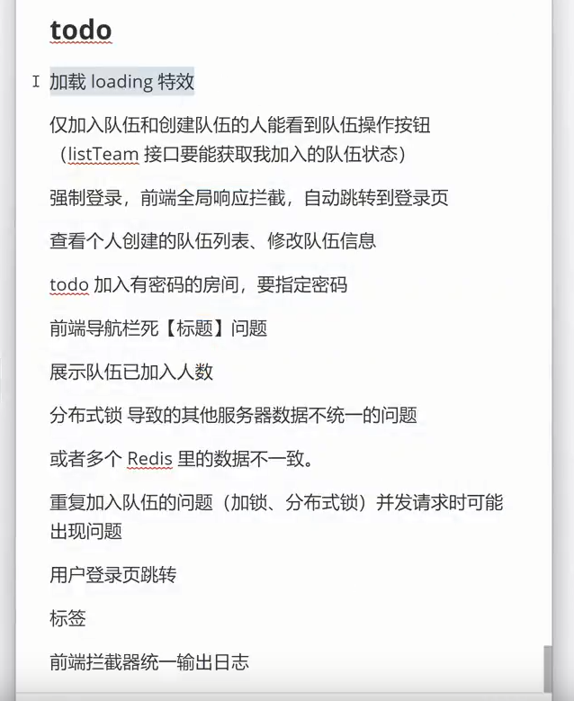


### 1、强制登录，自动跳转到登录页


解决：axios 全局配置响应拦截、并且添加重定向  
1.在myAxios里配置响应拦截


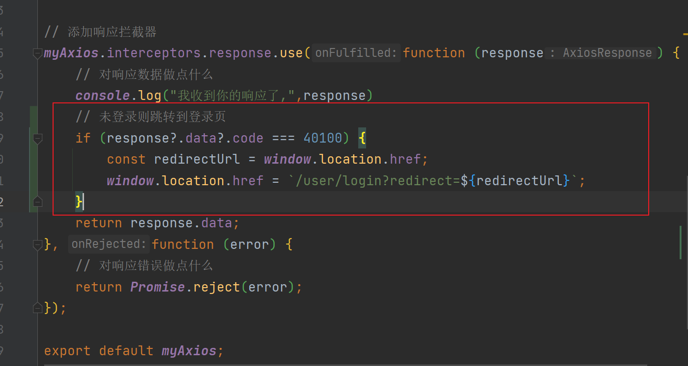


这里我们要改变history 模式的实现，在main.ts里修改  
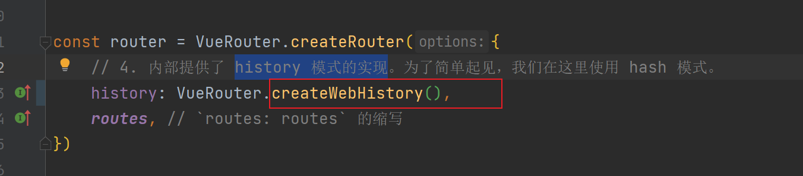


当登录成功后，重定向到个人用户页面  PS：别忘了引入route  
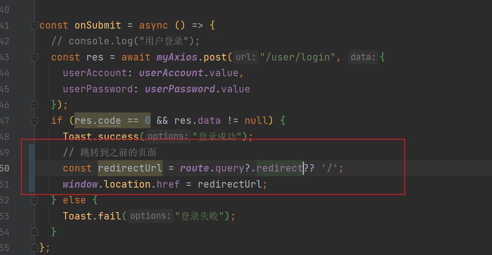


### 2.修改队伍页面的加入队伍按钮为创建队伍


在TeamPage页面，修改加入队伍为创建队伍（按钮部分）  
把doJoinTeam全局修改为toAddTeam  
这个按钮太丑了，我们更换它的样式，变成圆形放在右下角  
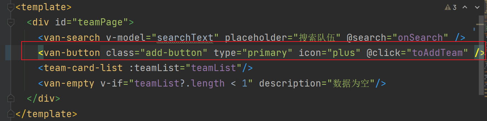  
写一个全局样式  
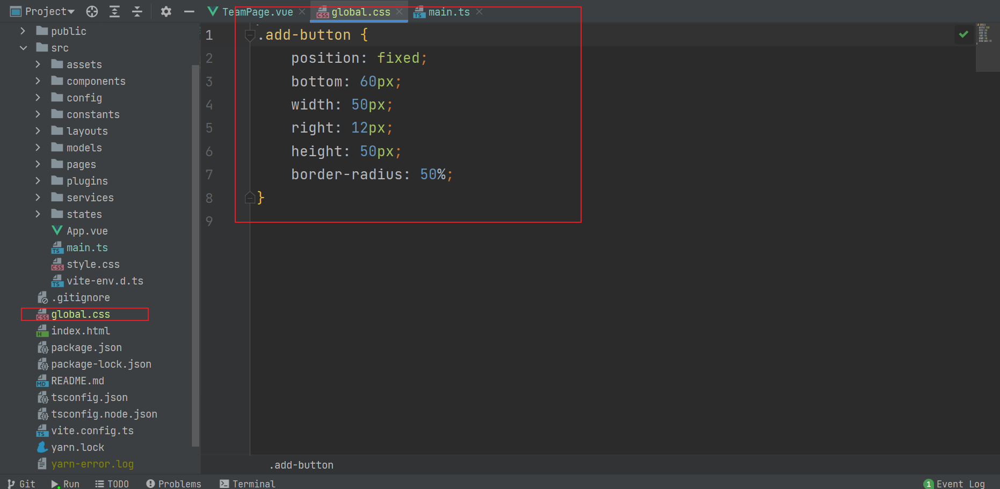


在main.ts中引入  
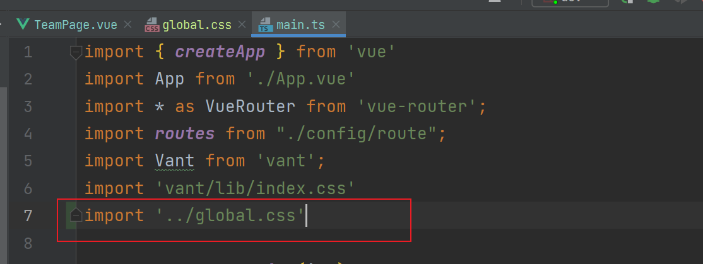


右下角的按钮：


### 3.区分公开和加密房间；加入有密码的房间，要指定密码


在TeamPage页面加入tabs标签，来区分公开还是加密  
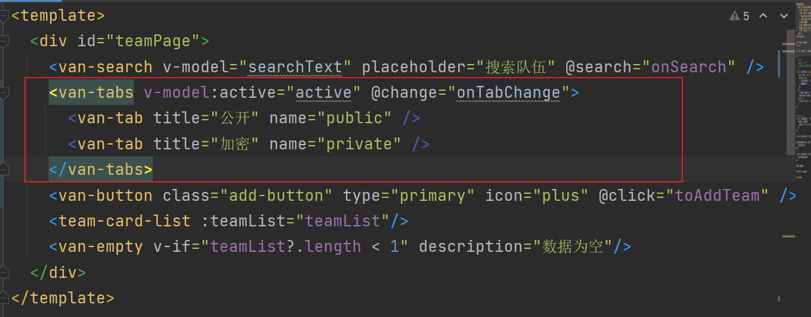


后端我们以前根据状态查询只查询公开，现在修改为当不是管理员和私人才会报权限错误


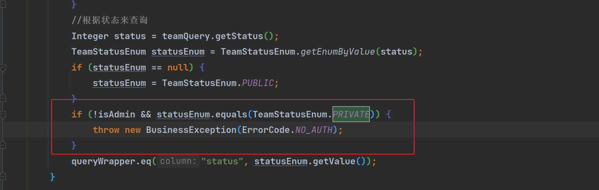


回到前端，我们在TeamPage页面实现onTabChange方法


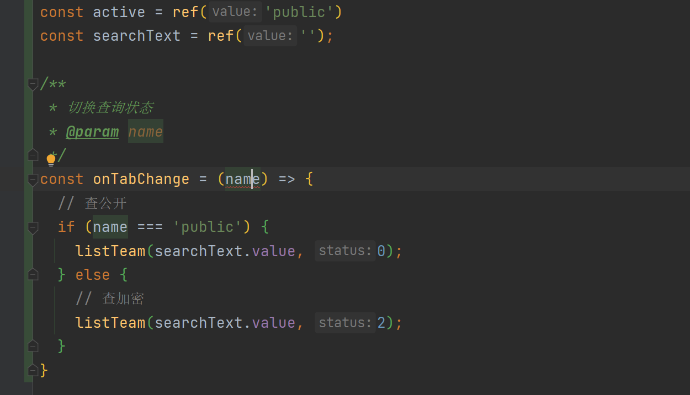


上面定义的active是为了页面默认显示公开队伍  
修改搜索队伍，传入状态


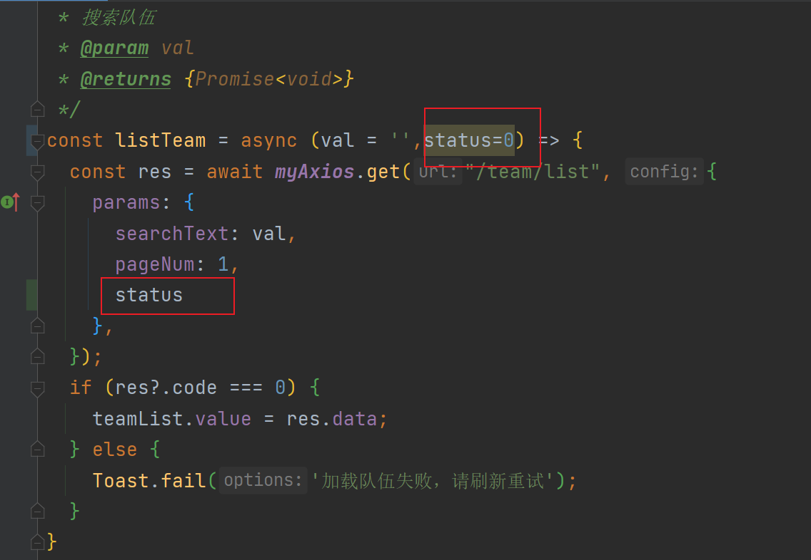


现在点击公开和加密可以切换查看不同类型的队伍  
加密队伍需要输入密码才可以加入，我们这使用Dialog 弹出框组件，把它放入`team-card-list.vue`里（最下面的位置)


```vue
    <van-dialog v-model:show="showPasswordDialog" title="请输入密码" show-cancel-button @confirm="doJoinTeam" @cancel="doJoinCancel">
      <van-field v-model="password" placeholder="请输入密码"/>
    </van-dialog>
```


在里面修改加入doJoinTeam方法，实现doJoinCancel方法和判断是不是加密房间preJoinTeam方法


```javascript
/**
 * 加入队伍
 */
const doJoinTeam = async () => {
  if (!joinTeamId.value){
    return;
  }
  const res = await myAxios.post('/team/join', {
    teamId: joinTeamId.value,
    password: password.value
  });
  if (res?.code === 0) {
    Toast.success('加入成功');
    doJoinCancel();
  } else {
    Toast.fail('加入失败' + (res.description ? `，${res.description}` : ''));
  }
}

const showPasswordDialog = ref(false);
const password = ref('');
const joinTeamId = ref(0);
  
/**
 * 判断是不是加密房间，是的话显示密码框
 * @param team
 */
const preJoinTeam = (team: TeamType) => {
  joinTeamId.value = team.id;
  if (team.status === 0) {
    doJoinTeam()
  } else {
    showPasswordDialog.value = true;
  }
}

const doJoinCancel = () => {
  joinTeamId.value = 0;
  password.value = '';
}
```


测试加入队伍（加密)功能是否正常  
前提：更新测试队伍是id为55007创建的，现在登录的id是4  
点击加入队伍，输入密码  
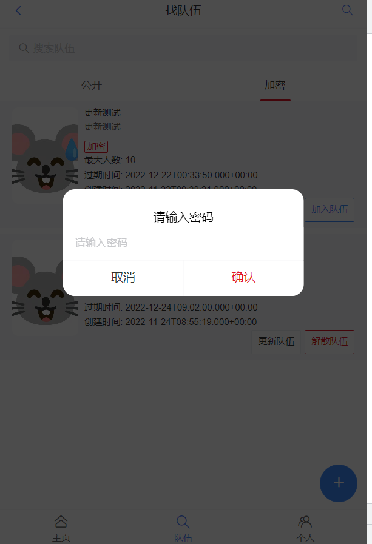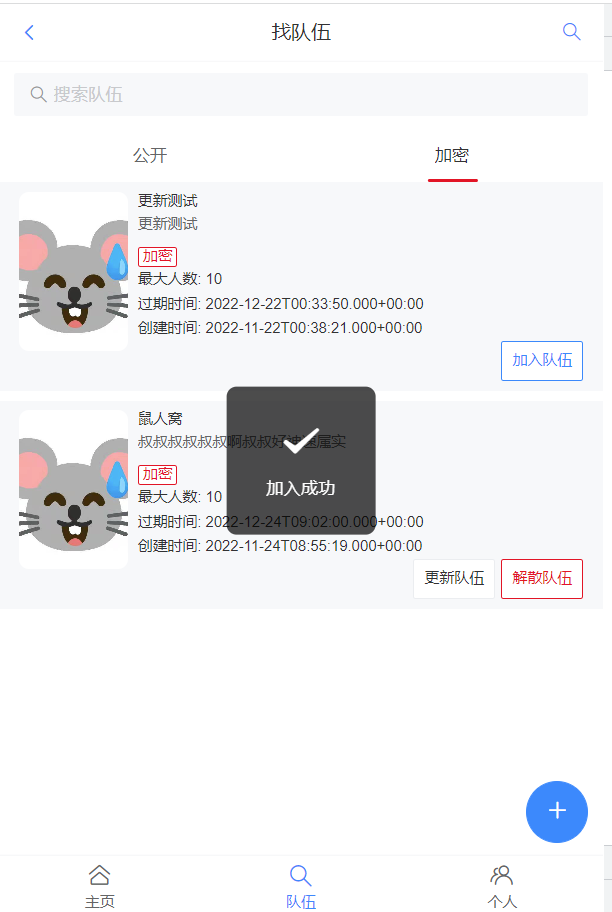  
刷新一下，显示退出队伍，功能正常  
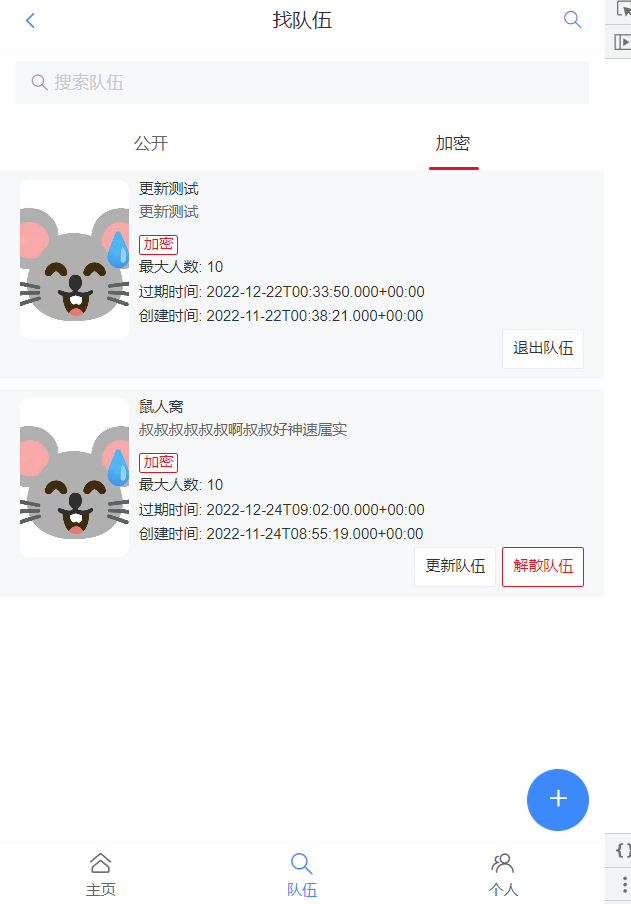


### 4.展示已加入队伍人数


这个我们后端还未实现，所以在获取队伍列表接口，获取这个参数  
首先在封装类里添加字段（TeamUserVO）  
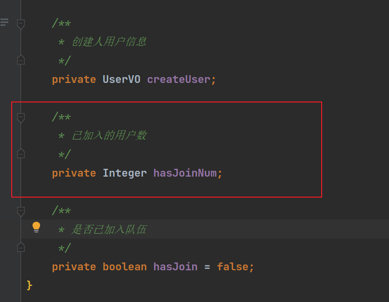  
修改listTeams接口，修改整理为如下


```java
@GetMapping("/list")
    public BaseResponse<List<TeamUserVO>> listTeams(TeamQuery teamQuery, HttpServletRequest request) {
        if (teamQuery == null) {
            throw new BusinessException(ErrorCode.PARAMS_ERROR);
        }
        boolean isAdmin = userService.isAdmin(request);
        // 1、查询队伍列表
        List<TeamUserVO> teamList = teamService.listTeams(teamQuery, isAdmin);
        final List<Long> teamIdList = teamList.stream().map(TeamUserVO::getId).collect(Collectors.toList());
        // 2、判断当前用户是否已加入队伍
        QueryWrapper<UserTeam> userTeamQueryWrapper = new QueryWrapper<>();
        try {
            User loginUser = userService.getLoginUser(request);
            userTeamQueryWrapper.eq("userId", loginUser.getId());
            userTeamQueryWrapper.in("teamId", teamIdList);
            List<UserTeam> userTeamList = userTeamService.list(userTeamQueryWrapper);
            // 已加入的队伍 id 集合
            Set<Long> hasJoinTeamIdSet = userTeamList.stream().map(UserTeam::getTeamId).collect(Collectors.toSet());
            teamList.forEach(team -> {
                boolean hasJoin = hasJoinTeamIdSet.contains(team.getId());
                team.setHasJoin(hasJoin);
            });
        } catch (Exception e) {}
        // 3、查询已加入队伍的人数
        QueryWrapper<UserTeam> userTeamJoinQueryWrapper = new QueryWrapper<>();
        userTeamJoinQueryWrapper.in("teamId", teamIdList);
        List<UserTeam> userTeamList = userTeamService.list(userTeamJoinQueryWrapper);
        // 队伍 id => 加入这个队伍的用户列表
        Map<Long, List<UserTeam>> teamIdUserTeamList = userTeamList.stream().collect(Collectors.groupingBy(UserTeam::getTeamId));
        teamList.forEach(team -> team.setHasJoinNum(teamIdUserTeamList.getOrDefault(team.getId(), new ArrayList<>()).size()));
        return ResultUtils.success(teamList);
    }
```


在前端的TeamCardList里修改原来的最大人数为已加入人数  
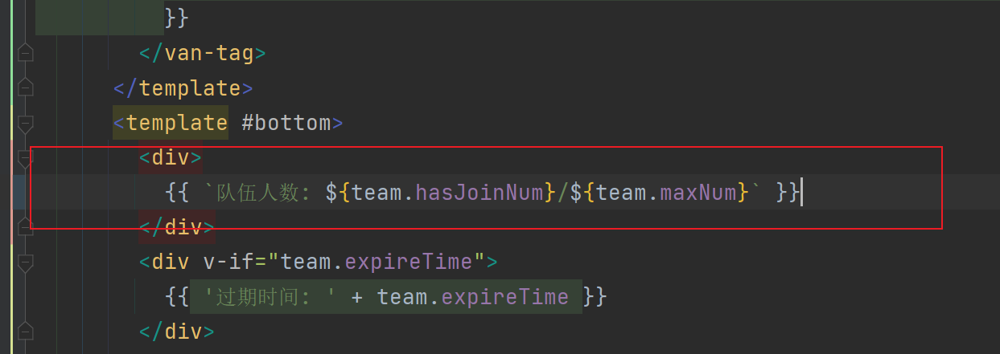


如果爆红的在队伍规范类型里添加字段  
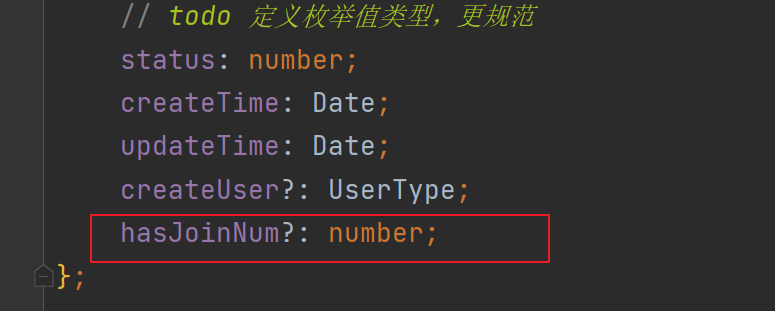  
刷新页面，成功显示还当前队伍人数和最大人数  
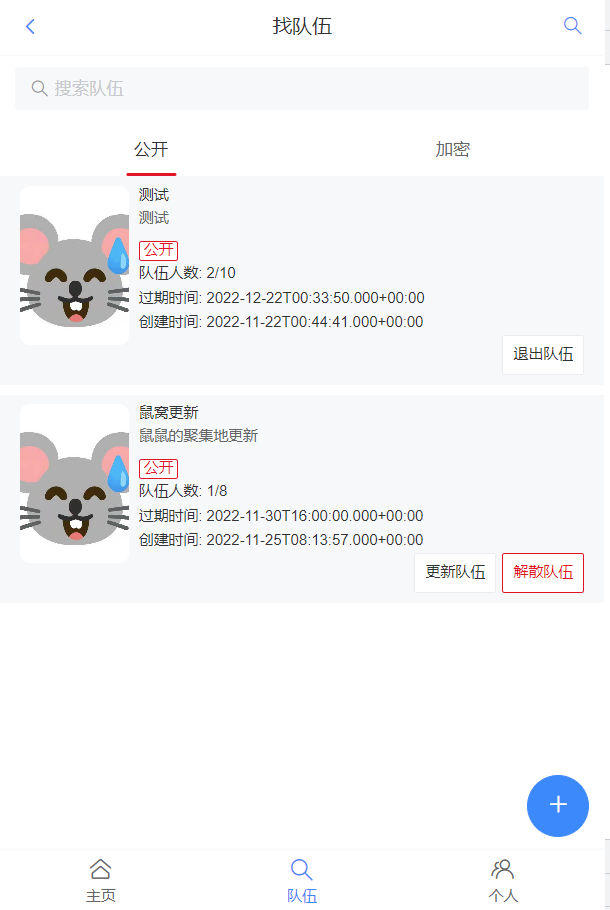


### 5.重复加入队伍的问题（加锁、分布式锁）并发请求时可能出现问题


只要我们点的足够快，就可以在同一时间内往数据库插入多条同样的数据，所以这里我们使用分布式锁（推荐）  
使用两把锁，一把锁锁队伍，一把锁锁用户（实现较难，不推荐）  
修改jointeam的实现方法


```java
    @Override
    public boolean joinTeam(TeamJoinRequest teamJoinRequest, User loginUser) {
        if (teamJoinRequest == null) {
            throw new BusinessException(ErrorCode.PARAMS_ERROR);
        }
        Long teamId = teamJoinRequest.getTeamId();
        Team team = getTeamById(teamId);
        Date expireTime = team.getExpireTime();
        if (expireTime != null && expireTime.before(new Date())) {
            throw new BusinessException(ErrorCode.PARAMS_ERROR, "队伍已过期");
        }
        Integer status = team.getStatus();
        TeamStatusEnum teamStatusEnum = TeamStatusEnum.getEnumByValue(status);
        if (TeamStatusEnum.PRIVATE.equals(teamStatusEnum)) {
            throw new BusinessException(ErrorCode.PARAMS_ERROR, "禁止加入私有队伍");
        }
        String password = teamJoinRequest.getPassword();
        if (TeamStatusEnum.SECRET.equals(teamStatusEnum)) {
            if (StringUtils.isBlank(password) || !password.equals(team.getPassword())) {
                throw new BusinessException(ErrorCode.PARAMS_ERROR, "密码错误");
            }
        }
        // 该用户已加入的队伍数量
        long userId = loginUser.getId();
        // 只有一个线程能获取到锁
        RLock lock = redissonClient.getLock("yupao:join_team");
        try {
            // 抢到锁并执行
            while (true) {
                if (lock.tryLock(0, -1, TimeUnit.MILLISECONDS)) {
                    System.out.println("getLock: " + Thread.currentThread().getId());
                    QueryWrapper<UserTeam> userTeamQueryWrapper = new QueryWrapper<>();
                    userTeamQueryWrapper.eq("userId", userId);
                    long hasJoinNum = userTeamService.count(userTeamQueryWrapper);
                    if (hasJoinNum > 5) {
                        throw new BusinessException(ErrorCode.PARAMS_ERROR, "最多创建和加入 5 个队伍");
                    }
                    // 不能重复加入已加入的队伍
                    userTeamQueryWrapper = new QueryWrapper<>();
                    userTeamQueryWrapper.eq("userId", userId);
                    userTeamQueryWrapper.eq("teamId", teamId);
                    long hasUserJoinTeam = userTeamService.count(userTeamQueryWrapper);
                    if (hasUserJoinTeam > 0) {
                        throw new BusinessException(ErrorCode.PARAMS_ERROR, "用户已加入该队伍");
                    }
                    // 已加入队伍的人数
                    long teamHasJoinNum = this.countTeamUserByTeamId(teamId);
                    if (teamHasJoinNum >= team.getMaxNum()) {
                        throw new BusinessException(ErrorCode.PARAMS_ERROR, "队伍已满");
                    }
                    // 修改队伍信息 
                    UserTeam userTeam = new UserTeam();
                    userTeam.setUserId(userId);
                    userTeam.setTeamId(teamId);
                    userTeam.setJoinTime(new Date());
                    return userTeamService.save(userTeam);
                }
            }
        } catch (InterruptedException e) {
            log.error("doCacheRecommendUser error", e);
            return false;
        } finally {
            // 只能释放自己的锁
            if (lock.isHeldByCurrentThread()) {
                System.out.println("unLock: " + Thread.currentThread().getId());
                lock.unlock();
            }
        }
    }
```


别忘了引入    RedissonClient  
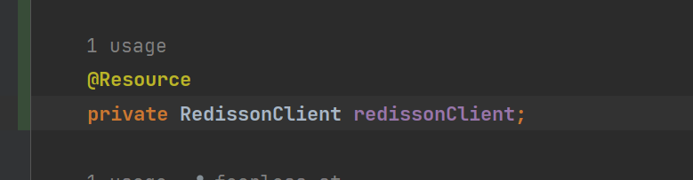  
**项目基本完成**


## 二、部署上线


先区分多环境：前端区分开发和线上接口，后端 prod 改为用线上公网可访问的数据库  
前端：Vercel（免费）  
[https://vercel.com/](https://vercel.com/)  
后端：微信云托管（部署容器的平台，付费）  
[https://cloud.weixin.qq.com/cloudrun/service](https://cloud.weixin.qq.com/cloudrun/service)  
**（免备案！！！）**


**这里就不演示了（可以看用户中心直播和国庆七天的直播学习）**  
注意如果后端使用微信云托管，一定要写一个dokerfile


```vue
FROM maven:3.5-jdk-8-alpine as builder

# Copy local code to the container image.
WORKDIR /app
COPY pom.xml .
COPY src ./src

# Build a release artifact.
RUN mvn package -DskipTests

# Run the web service on container startup.
CMD ["java","-jar","/app/target/yupao-backend-0.0.1-SNAPSHOT.jar","--spring.profiles.active=prod"]
```


前端部署需要区分线上和本地环境  
首先打包如果报错（大概率是因为ts语法的检查），在packjson里修改build  
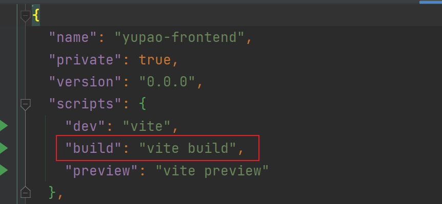  
区分环境  
在myAxios里配置（实现自动根据环境来更换地址）  
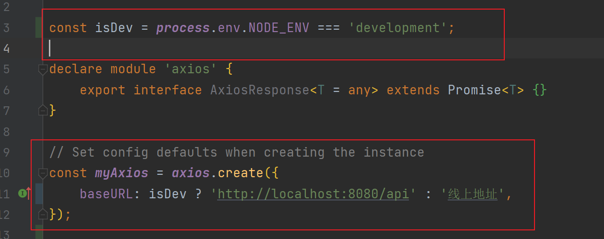


## 第十四期 伙伴匹配系统笔记完结🎉🎉🎉🎉🎉🎉🎉🎉🎉🎉🎉🎉🎉🎉


> 更新: 2023-02-10 10:10:34  
> 原文: <https://www.yuque.com/shierkcs/catstudy/cxu6sg2ebml2y3w6>