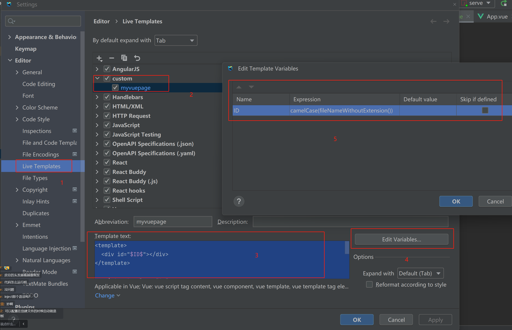

## 计划

以开发前端页面为主：

1）用户注册页面

2）创建题目页面（管理员）

3）题目管理页面（管理员）

- 查看（搜索）
- 删除
- 修改
- 快捷创建

4）题目列表页（用户）

5）题目详情页（在线做题页）

- 判题状态的查看

6）题目提交列表页

> 扩展：提交统计页、用户个人页

## 接入要用到的组件

先接入可能用到的组件，再去写页面，避免因为后续依赖冲突、整合组件失败带来的返工。

### Markdown 编辑器

为什么用 Markdown？

一套通用的文本编辑语法，可以在各大网站上统一标准、渲染出统一的样式，比较简单易学。

推荐的 Md 编辑器：https://github.com/bytedance/bytemd   (ByteMD)

阅读官方文档，下载编辑器主体、以及 gfm（表格支持）插件、highlight 代码高亮插件

```shell
npm i @bytemd/vue-next
npm i @bytemd/plugin-highlight @bytemd/plugin-gfm  
```

新建 MdEditor 组件，编写代码：

```vue
<template>
  <Editor :value="value" :plugins="plugins" @change="handleChange" />
</template>

<script setup lang="ts">
import gfm from "@bytemd/plugin-gfm";
import highlight from "@bytemd/plugin-highlight";
import { Editor, Viewer } from "@bytemd/vue-next";
import { ref } from "vue";

const plugins = [
  gfm(),
  highlight(),
  // Add more plugins here
];

const value = ref("");

const handleChange = (v: string) => {
  value.value = v;
};
</script>

<style scoped></style>
```

隐藏编辑器中不需要的操作图标（比如 GitHub 图标）：

```css
.bytemd-toolbar-icon.bytemd-tippy.bytemd-tippy-right:last-child {
    display: none;
}
```

要把 MdEditor 当前输入的值暴露给父组件，便于父组件去使用，同时也是提高组件的通用性，需要定义属性，把 value 和 handleChange 事件交给父组件去管理：

MdEditor 示例代码：

```js
/**
 * 定义组件属性类型
 */
interface Props {
  value: string;
  handleChange: (v: string) => void;
}

/**
 * 给组件指定初始值
 */
const props = withDefaults(defineProps<Props>(), {
  value: () => "",
  handleChange: (v: string) => {
    console.log(v);
  },
});
```

### 代码编辑器

微软官方编辑器：https://github.com/microsoft/monaco-editor

官方提供的整合教程：https://github.com/microsoft/monaco-editor/blob/main/docs/integrate-esm.md

1）安装编辑器

```shell
npm install monaco-editor
```

2）vue-cli 项目（webpack 项目）整合 monaco-editor。

先安装 monaco-editor-webpack-plugin（https://github.com/microsoft/monaco-editor/blob/main/webpack-plugin/README.md）：

```shell
npm install monaco-editor-webpack-plugin
```

在 vue.config.js 中配置 webpack 插件：

全量加载：

```typescript
//vue.config.js 
const { defineConfig } = require("@vue/cli-service");
const MonacoWebpackPlugin = require("monaco-editor-webpack-plugin");

module.exports = defineConfig({
  transpileDependencies: true,
  chainWebpack(config) {
    config.plugin("monaco").use(new MonacoWebpackPlugin());
  },
});
```

按需加载：

```typescript
const MonacoWebpackPlugin = require('monaco-editor-webpack-plugin')
module.exports = {
  chainWebpack: config => {
    config.plugin('monaco-editor').use(MonacoWebpackPlugin, [
      {
        // Languages are loaded on demand at runtime
        languages: ['json', 'go', 'css', 'html', 'java', 'javascript', 'less', 'markdown', 'mysql', 'php', 'python', 'scss', 'shell', 'redis', 'sql', 'typescript', 'xml'], // ['abap', 'apex', 'azcli', 'bat', 'cameligo', 'clojure', 'coffee', 'cpp', 'csharp', 'csp', 'css', 'dart', 'dockerfile', 'ecl', 'fsharp', 'go', 'graphql', 'handlebars', 'hcl', 'html', 'ini', 'java', 'javascript', 'json', 'julia', 'kotlin', 'less', 'lexon', 'lua', 'm3', 'markdown', 'mips', 'msdax', 'mysql', 'objective-c', 'pascal', 'pascaligo', 'perl', 'pgsql', 'php', 'postiats', 'powerquery', 'powershell', 'pug', 'python', 'r', 'razor', 'redis', 'redshift', 'restructuredtext', 'ruby', 'rust', 'sb', 'scala', 'scheme', 'scss', 'shell', 'solidity', 'sophia', 'sql', 'st', 'swift', 'systemverilog', 'tcl', 'twig', 'typescript', 'vb', 'xml', 'yaml'],

        features: ['format', 'find', 'contextmenu', 'gotoError', 'gotoLine', 'gotoSymbol', 'hover' , 'documentSymbols'] //['accessibilityHelp', 'anchorSelect', 'bracketMatching', 'caretOperations', 'clipboard', 'codeAction', 'codelens', 'colorPicker', 'comment', 'contextmenu', 'coreCommands', 'cursorUndo', 'dnd', 'documentSymbols', 'find', 'folding', 'fontZoom', 'format', 'gotoError', 'gotoLine', 'gotoSymbol', 'hover', 'iPadShowKeyboard', 'inPlaceReplace', 'indentation', 'inlineHints', 'inspectTokens', 'linesOperations', 'linkedEditing', 'links', 'multicursor', 'parameterHints', 'quickCommand', 'quickHelp', 'quickOutline', 'referenceSearch', 'rename', 'smartSelect', 'snippets', 'suggest', 'toggleHighContrast', 'toggleTabFocusMode', 'transpose', 'unusualLineTerminators', 'viewportSemanticTokens', 'wordHighlighter', 'wordOperations', 'wordPartOperations']
      }
    ])
  }
}
```

如何使用 Monaco Editor？查看示例教程：

https://microsoft.github.io/monaco-editor/playground.html?source=v0.40.0#example-creating-the-editor-hello-world

整合教程参考：[http://chart.zhenglinglu.cn/pages/2244bd/#%E5%9C%A8-vue-%E4%B8%AD%E4%BD%BF%E7%94%A8](http://chart.zhenglinglu.cn/pages/2244bd/#在-vue-中使用)

注意，monaco editor 在读写值的时候，要使用 toRaw(编辑器实例）的语法来执行操作，否则会卡死。

示例整合代码如下：

```vue
<template>
  <div id="code-editor" ref="codeEditorRef" style="min-height: 400px" />
  {{ value }}
  <a-button @click="fillValue">填充值</a-button>
</template>

<script setup lang="ts">
import * as monaco from "monaco-editor";
import { onMounted, ref, toRaw } from "vue";

const codeEditorRef = ref();
const codeEditor = ref();
const value = ref("hello world");

const fillValue = () => {
  if (!codeEditor.value) {
    return;
  }
  // 改变值
  toRaw(codeEditor.value).setValue("新的值");
};

onMounted(() => {
  if (!codeEditorRef.value) {
    return;
  }
  // Hover on each property to see its docs!
  codeEditor.value = monaco.editor.create(codeEditorRef.value, {
    value: value.value,
    language: "java",
    automaticLayout: true,
    colorDecorators: true,
    minimap: {
      enabled: true,
    },
    readOnly: false,
    theme: "vs-dark",
    // lineNumbers: "off",
    // roundedSelection: false,
    // scrollBeyondLastLine: false,
  });

  // 编辑 监听内容变化
  codeEditor.value.onDidChangeModelContent(() => {
    console.log("目前内容为：", toRaw(codeEditor.value).getValue());
  });
});
</script>

<style scoped></style>
```

通 Md 编辑器一样，也要接受父组件的传值，把显示的输入交给父组件去控制，从而能够让父组件实时得到用户输入的代码：

```js
/**
 * 定义组件属性类型
 */
interface Props {
  value: string;
  handleChange: (v: string) => void;
}

/**
 * 给组件指定初始值
 */
const props = withDefaults(defineProps<Props>(), {
  value: () => "",
  handleChange: (v: string) => {
    console.log(v);
  },
});
```

> 项目扩展：用 diff editor 对比用户代码和标准答案的区别

## 页面开发

### 创建题目页面

重新根据后端生成前端请求代码：

```shell
openapi --input http://localhost:8121/api/v2/api-docs --output ./generated --client axios
```

注意 - 用户登录后仍显示未登录：

是因为代码生成后，OpenAPI 文件的 CREDENTIALS 参数重置了，应该改为 true。

示例代码：

```typescript
export const OpenAPI: OpenAPIConfig = {
  BASE: 'http://localhost:8121',
  VERSION: '1.0',
  WITH_CREDENTIALS: true,
  CREDENTIALS: 'include',
  TOKEN: undefined,
  USERNAME: undefined,
  PASSWORD: undefined,
  HEADERS: undefined,
  ENCODE_PATH: undefined,
};
```

需要用户输入的值：

```json
{
  "answer": "暴力破解",
  "content": "题目内容",
  "judgeCase": [
    {
      "input": "1 2",
      "output": "3 4"
    }
  ],
  "judgeConfig": {
    "memoryLimit": 1000,
    "stackLimit": 1000,
    "timeLimit": 1000
  },
  "tags": [
      "栈", "简单"
],
  "title": "A + B"
}
```

#### 小知识 - 自定义代码模板

在 JetBrains 系列编辑器中打开设置，搜索 live Templates，先创建一个自定义模板组，在组下创建代码模板。

效果：输入缩写，即可生成模板代码。

示例模板：

```vue
<template>
  <div id="$ID$"></div>
</template>

<script setup lang="ts">
$END$
</script>

<style scoped>
#$ID$ {
}
</style>
```

注意，其中的 ID 是根据表达式自动生成的：camelCase(fileNameWithoutExtension())



使用表单组件，先复制示例代码，再修改：https://arco.design/vue/component/form

此处我们用到了

- 嵌套表单：https://arco.design/vue/component/form#nest
- 动态增减表单：https://arco.design/vue/component/form#dynamic

注意，我们自定义的代码编辑器组件不会被组件库识别，需要手动指定 value 和 handleChange 函数。

### 题目管理页面开发

1）使用表格组件：https://arco.design/vue/component/table#custom（需要找到自定义操作的示例）

2）查询数据

3）定义表格列

4）加载数据

5）调整格式

比如 json 格式不好看，有 2 种方法调整：

1. 使用组件库自带的语法，自动格式化（更方便）
2. 完全自定义渲染，想展示什么就展示什么（更灵活）

6）添加删除、更新操作

删除后要执行 loadData 刷新数据

> 如果想学习 React And Design 框架的管理页面开发，去看用户中心项目

### 更新页面开发

策略：由于更新和创建都是相同的表单，所以完全没必要开发 / 复制 2 遍，可以直接复用创建页面。

关键实现：如何区分两个页面？

1. 路由（/add/question 和 /update/question）
2. 请求参数（id = 1）

更新页面相比于创建页面，多了 2 个改动：

1）在加载页面时，更新页面需要加载出之前的数据

2）在提交时，请求的地址不同

## 本期成果

引入了文本编辑器、代码编辑器，完成题目创建页面、题目更新页面、题目管理页面。


## 本期作业

1. 完成前端页面的开发
2. 引入文档编辑器、代码编辑器，并且通过阅读官方文档来自定义编辑器的样式或功能