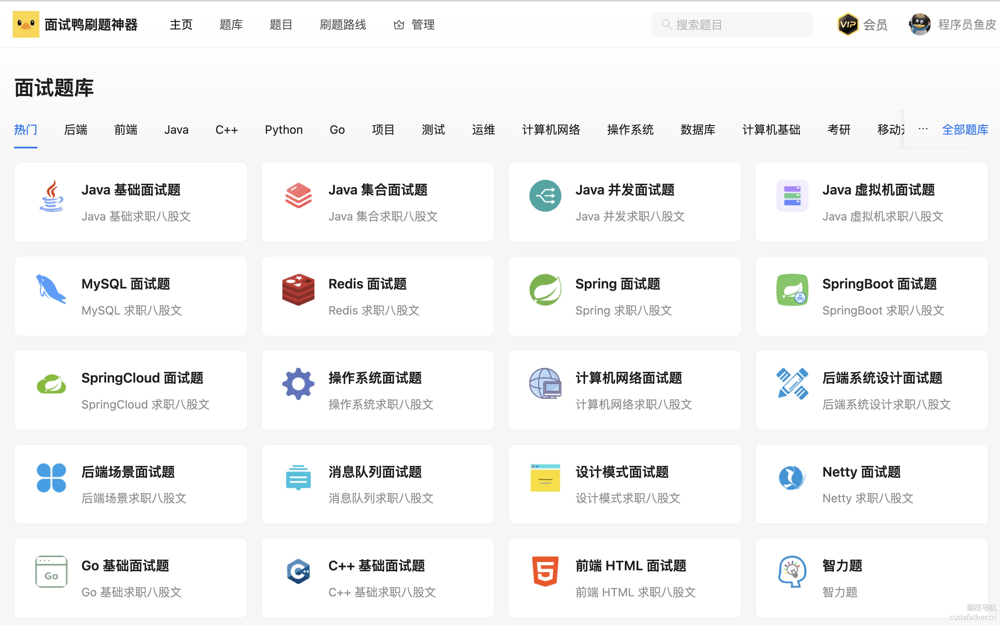
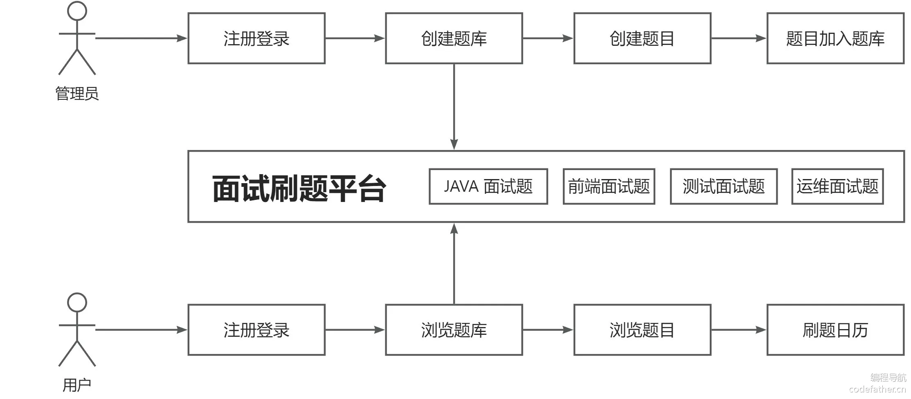
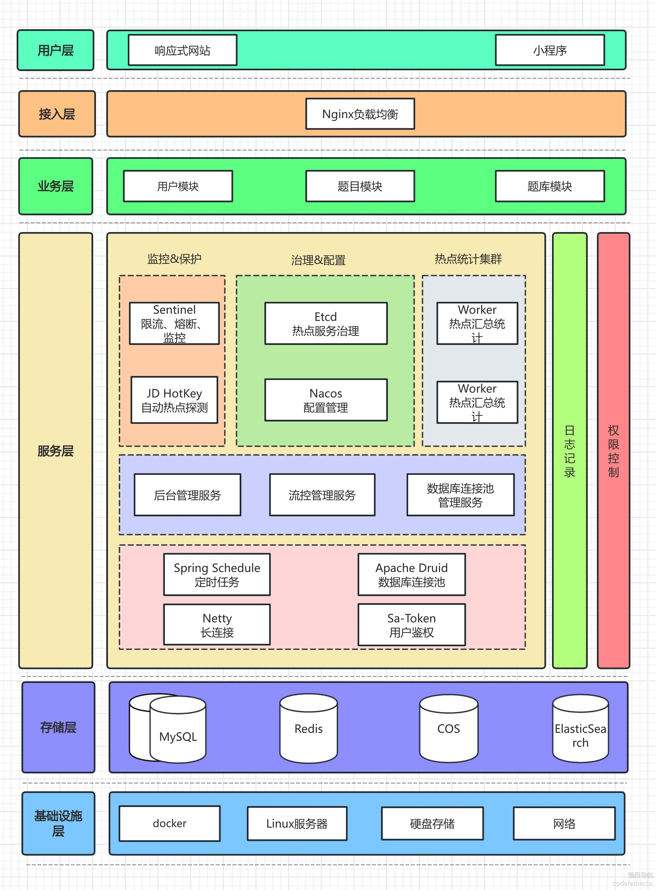

## 一、项目介绍

面试鸭是一款基于 Next.js + Spring Boot + Redis + MySQL + Elasticsearch 的 **面试刷题平台**，运用 Druid + HotKey + Sa-Token + Sentinel 提高了系统的性能和安全性。

成品项目参考：[https://mianshiya.com](https://mianshiya.com/)

管理员可以创建题库、题目和题解；用户可以注册登录、分词检索题目、在线刷题并查看刷题记录日历图。

此外，系统使用数据库连接池、热 Key 探测、缓存、高级数据结构等来提升性能。通过流量控制、熔断、动态 IP 黑白名单过滤、同端登录冲突检测、分级反爬虫策略来提升系统和内容的安全性。从 0 到 1 的真实企业级项目设计开发，绝对让你收获满满！

### 项目三大阶段

为了帮大家循序渐进地学习，鱼皮将项目设计为三个阶段，可以根据自己的时间和水平按需学习。

1）第一阶段，开发基础的刷题平台，带大家熟悉项目开发流程，实战 Next.js 服务端渲染 + Spring Boot 应用的快速开发。

2）第二阶段，对项目功能进行扩展，精选 4 个真实业务场景，实战企业主流后端技术如 Redis 缓存和高级数据结构、Elasticsearch 搜索引擎、Druid 连接池、并发编程、热 key 探测的应用。

3）第三阶段，对项目安全性进行优化，比如基于 Sentinel 进行网站流量控制和熔断、基于 Nacos 实现动态的 IP 黑白名单、基于 Sa-Token 实现同端登录冲突检测、基于 Redis 实现分级反爬虫策略等。最终将项目上线并保证可用性。

## 二、项目优势

### 项目收获

本项目是线上刷题网站[《面试鸭》](https://mianshiya.com/)的教学版本，业务真实典型，基于主流的前端 Next.js 服务端渲染和后端经典技术栈实现。区别于增删改查的 “烂大街” 项目，本项目中鱼皮会带你实战大量新技术和企业级场景、掌握系统设计和优化方案，给你的简历大幅增加竞争力。

鱼皮给大家讲的都是 **通用的项目开发方法和架构设计套路**，从这个项目中你可以学到：

- 如何拆解复杂业务，从 0 开始设计实现系统？
- 如何快速构建 Next.js 服务端渲染网站和后端项目？
- 如何结合 Redis + Caffeine + Hotkey 构建高性能实时缓存？
- 如何利用 Elasticsearch 实现灵活高效的内容搜索？
- 如何巧用 Redisson 高级数据结构，实现高性能的接口？
- 如何实现流量控制和动态 IP 黑白名单，增强网站安全性？
- 如何实现登录冲突检测和分级反爬虫策略，保护网站内容？
- 如何快速上线项目并增强可用性？

此外，还能学会很多作图、思考问题、对比方案的方法，提升排查问题、自主解决 Bug 的能力。

## 三、核心业务流程

如下图：

## 四、项目功能梳理

### 基础功能

- 用户模块
- - 用户注册
  - 用户登录（账号密码）
  - 【管理员】管理用户 - 增删改查
- 题库模块
- - 查看题库列表
  - 查看题库详情（展示题库下的题目）
  - 【管理员】管理题库 - 增删改查
- 题目模块
- - 题目搜索
  - 查看题目详情（进入刷题页面）
  - 【管理员】管理题目 - 增删改查（比如按照题库查询题目、修改题目所属题库等）

### 高级功能

- 题目批量管理
- - 【管理员】批量向题库添加题目
  - 【管理员】批量从题库移除题目
  - 【管理员】批量删除题目
- 分词题目搜索
- 用户刷题记录日历图
- 自动缓存热门题目
- 网站流量控制和熔断
- 动态 IP 黑白名单过滤
- 同端登录冲突检测
- 分级题目反爬虫策略

## 五、技术选型

### 前端

- React 18 框架
- ⭐️ Next.js 服务端渲染
- ⭐️ Redux 状态管理
- Ant Design 组件库
- 富文本编辑器组件
- ⭐️ 前端工程化：ESLint + Prettier + TypeScript
- ⭐️ OpenAPI 前端代码生成

### 后端

- Java Spring Boot 框架 + Maven 多模块构建
- MySQL 数据库 + MyBatis-Plus 框架 + MyBatis X
- Redis 分布式缓存 + Caffeine 本地缓存
- Redission 分布式锁 + BitMap + BloomFilter
- ⭐️ Elasticsearch 搜索引擎
- ⭐️ Druid 数据库连接池 + 并发编程
- ⭐️ Sa-Token 权限控制
- ⭐️ HotKey 热点探测
- ⭐️ Sentinel 流量控制
- ⭐️ Nacos 配置中心
- ⭐️ 多角度项目优化：性能、安全性、可用性

## 六、架构设计

## 环境准备

后端 JDK 版本需要使用 8、11 或 17，**不能超过 17！**

推荐使用 11 版本，因为 Caffeine 缓存要求使用 11 版本。

前端 Node.js 版本 >= 18.18。

## 新建代码仓库

搭建仓库，点 star 的都是精神股东

代码仓库：https://github.com/liyupi/mianshiya-next

## 教程计划

### 第一阶段 - 基础功能

第 1 期：项目介绍。包括介绍项目背景、项目优势、核心业务流程、项目功能、技术选型、架构设计、教程计划等。

第 2 期：平台后端开发

- 需求分析
- 库表设计
- 后端项目初始化（万用模板讲解）
- 后端基础功能开发（增删改查）
- 后端核心业务流程开发

第 3 期：平台前端模板开发

- 需求分析
- Web 前端技术选型（服务端渲染讲解）
- 前端项目初始化（Next.js 前端万用模板开发）
- 前端基础页面开发
- - 用户模块
  - 管理页面

第 4 期：平台前端核心开发

- 核心页面开发
- - 主页
  - 题库列表页
  - 题库详情页
  - 题目详情页
  - 题目搜索页
- 前后端联调，跑通核心业务流程

### 第二阶段 - 功能扩展

第 5 期：面向用户的扩展功能

- 用户刷题记录日历：需求分析 + 方案设计 + 前后端开发 + 性能优化
- 分词题目搜索：需求分析 + 方案设计 + 前后端开发

第 6 期：面向管理的扩展功能

- 题目批量管理：需求分析 + 方案设计 + 前后端开发 + 性能优化
- 自动缓存热门题目：需求分析 + 方案设计 + 前后端开发

### 第三阶段 - 优化上线

第 7 期：流量安全性优化

- 网站流量控制和熔断
- 动态 IP 黑白名单过滤

第 8 期：内容安全性优化

- 同端登录冲突检测
- 分级题目反爬虫策略

第 9 期：部署上线

- 前后端部署
- 可用性优化