## 本节重点

面向用户的扩展功能

- 用户刷题记录日历：需求分析 + 方案设计 + 前后端开发 + 性能优化
- 分词题目搜索：需求分析 + 方案设计 + 前后端开发

## 一、用户刷题记录日历

### 需求分析

为了鼓励用户多在网站上刷题，并且能自主复盘学习情况，增加成就感，需要支持用户刷题记录日历功能。

每个用户有自己的签到记录，具体拆解为 2 个子需求：

1. 用户每日首次浏览题目，算作是签到，会记录在系统中。
2. 用户可以在前端以图表的形式查看自己在 **某个年份** 的刷题签到记录（每天是否有签到）。

### 方案设计

后端实现关键在于如何快速存储和获取刷题记录；前端实现关键在于如何展示刷题记录。

#### 后端方案 - 基于数据库

在数据库中设计一张签到表，记录用户每次签到的日期及其他相关信息。然后通过时间范围查询得到用户的签到记录。

示例表结构如下：

```sql
CREATE TABLE user_sign_in (
  id BIGINT AUTO_INCREMENT PRIMARY KEY,  -- 主键，自动递增
  userId BIGINT NOT NULL,               -- 用户ID，关联用户表
  signDate DATE NOT NULL,            -- 签到日期
  createdTime TIMESTAMP DEFAULT CURRENT_TIMESTAMP,  -- 记录创建时间
  UNIQUE KEY uq_user_date (userId, signDate)  -- 用户ID和签到日期的唯一性约束
);
```

通过唯一索引，可以确保同一用户在同一天内只能签到一次。

通过下面的 SQL 即可查询用户的签到记录：

```sql
SELECT signDate FROM user_sign_in 
WHERE userId = ? AND signDate BETWEEN ？AND ?;
```

优点：原理简单，容易实现，适用于用户量较小的系统。

缺点：随着用户量和数据量增大，对数据库的压力增大，直接查询数据库性能较差。除了单接口的响应会增加，可能整个系统都会被其拖垮。

💡 试想一下，每天 1 万个用户签到，1 个月就 30 万条数据，3 个月就接近百万的数据量了，占用硬盘空间大概 50 MB。**存储 100 万个用户 365 天的签到记录，需要 17.52 GB 左右。**

#### 后端方案 - 基于缓存 Redis Set

可以利用内存缓存加速读写，常用的本地缓存是 Caffeine，分布式缓存是 Redis。

由于每个用户会有多个签到记录，很适合使用 Redis 的 Set 类型存储，每个用户对应一个键，Set 内的每个元素为签到的具体日期。

Redis Key 的设计为：`user:signins:{userId}`

其中：

- user 是业务领域前缀
- signins 是具体操作或功能
- {userId} 表示每个用户，是动态值

如果 Redis 被多个项目公用，还可以在开头增加项目前缀区分，比如 `mianshiya:user:signins:{userId}`。

💡 扩展知识：Redis 键设计规范

- 明确性：键名称应明确表示数据的含义和结构。例如，通过使用 `signins` 可以清楚地知道这个键与用户的签到记录有关。
- 层次结构：使用冒号 `:` 分隔不同的部分，可以使键结构化，便于管理和查询。
- 唯一性：确保键的唯一性，避免不同数据使用相同的键前缀。
- 一致性：在整个系统中保持键设计的一致性，使得管理和维护变得更加简单。
- 长度：避免过长的键名称，以防影响性能和存储效率。

具体示例如下，可以使用 Redis 命令行工具添加值到集合中：

```shell
SADD user:signins:123 "2024-09-01"
SADD user:signins:123 "2024-09-02"
```

使用命令查找集合中的值：

```java
SMEMBERS user:signins:123
```

可以利用可视化工具查看和管理 Redis，比如 IDEA 自带的、或者 [RESP](https://github.com/RedisInsight/RedisDesktopManager)：

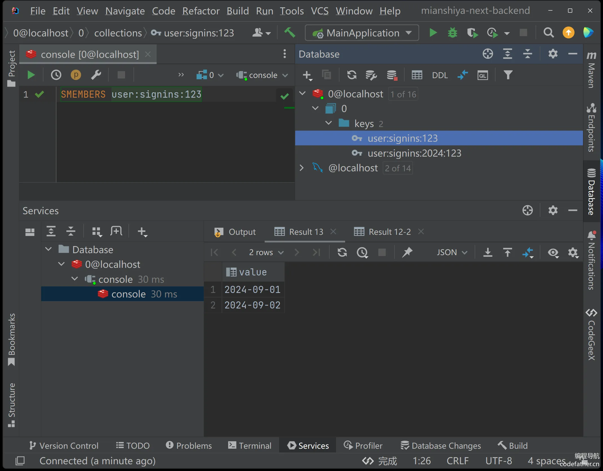

该方案的优点：Set 数据结构天然支持去重，适合存储和检索打卡记录。

缺点：上述设计显然存储了很多重复的字符串，针对海量数据场景，需要考虑内存的占用量。

比如下列数据：

```shell
key = user:signins:123
value = ["2024-09-01", "2024-09-02", "2024-10-01", "2024-10-02"]
```

其中，年份被重复存储。

为了减少内存占用，还可以在 key 中增加更多日期层级，比如 `user:signins:{year}:{userId}`。示例命令如下：

```shell
SADD user:signins:2024:123 "09-01"
SADD user:signins:2024:123 "10-01"
```

这样一来，不仅节约了内存，也便于管理，可以轻松查询某个用户在某个年份的签到情况。

💡 存储 **100 万个用户** 的 **365 天** 签到记录，使用 Redis 集合类型来存储每个用户的签到信息，每个用户需要大约 **1880 字节** 的空间，总共需要大约 **1.88GB** 的内存空间，相比数据库节约了 10 倍左右。

有没有更节约内存的方式呢？

#### 后端方案 - Bitmap 位图

Bitmap 位图，是一种使用位（bit）来表示数据的 **紧凑** 数据结构。每个位可以存储两个值：0 或 1，常用于表示某种状态或标志。因为每个位仅占用 1 位内存，Bitmap 在大规模存储二值数据（如布尔值）时，非常高效且节约空间。

核心思想：与其存储用户签到的具体日期，不如存储用户在今年的第 N 天是否签到。

```java
2024-01-01 => 1（第一天）
2024-01-03 => 3（第三天）
```

使用位图类型存储，每个用户对应一个键，Bitmap 的 **每一位** 来表示用户在 **某一天** 是否打卡。

举个例子，我们签到的状态可以用 0 和 1 表示，0 代表未签到，1 代表签到。

```java
0101 表示第 1 天和第 3 天已签到
1010 表示第 2 天和第 4 天已签到
```

如果不用 Bitmap，最传统的方式，我们可以先试着用 int 类型来存储签到状态：

```java
int status = 0; // 未签到
int status = 1; // 已签到
```

而 int 类型占用的空间为 4 个字节（byte），一个字节占 8 位（bit），即一个 int 占 32 位。

在这种仅存储二值（0 或 1）的场景，就可以使用 Bitmap 位图来优化存储，因为一个 bit 就可以表示 0 和 1。

把 int 优化成用 bit 存储，那么占用的空间可以优化 32 倍！假设原先占用的大小需要 32 G，那么改造后仅需 1 G。如图：

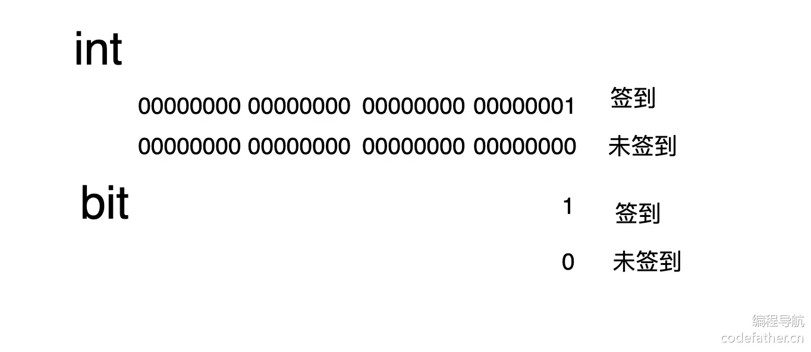

这里需要注意：现代计算机体系结构通常以字节（8位）作为最小寻址单位，那么上述的 bit 是如何存储的呢？

答案就是 **打包**。

通过将多个 bit 打包到一个字节（或者其他更大的数据类型，如 int、long）中来实现的。每个字节（或数据类型）被视为一个桶，里面可以存放若干个布尔值（0 或 1）。

对每一位操作时，要使用位运算进行访问，所以上述的图实际应该改成：

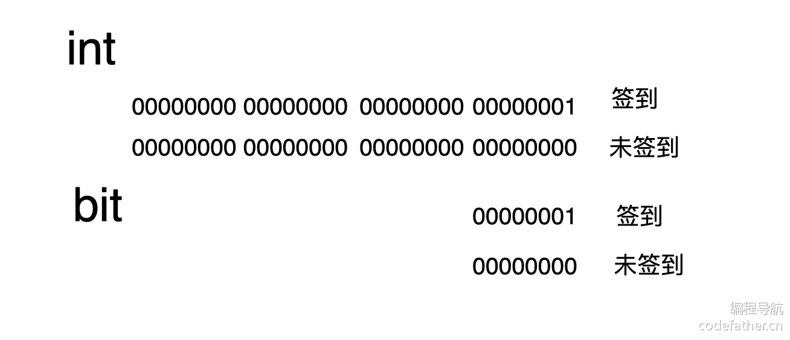

💡 对于刷题签到记录场景，一个用户存储一年的数据仅需占用 46 字节，因为 46 * 8 = 368，能覆盖 365 天的记录。那一百万用户也才占用 43.8 MB，相比于 Redis Set 结构节约了 40 多倍存储空间！

1000w 个用户也才占用 438 MB！恭喜你，设计出了一个低成本支持千万用户的系统！

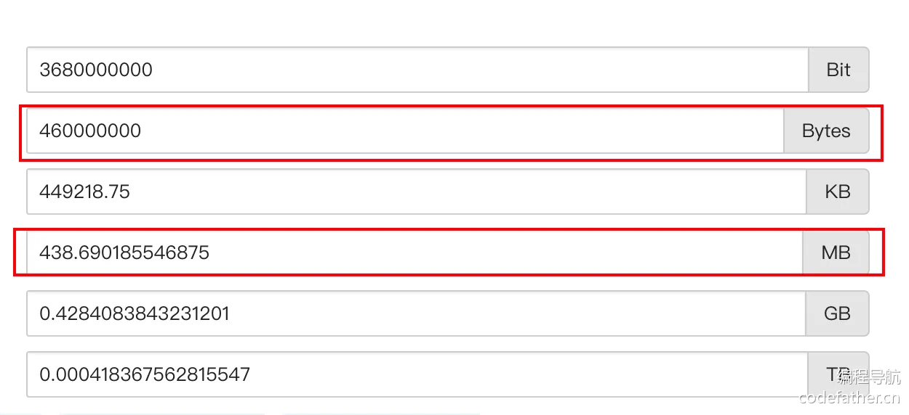

当然，我们没必要自己通过 int 等类型实现 Bitmap，JDK 自带了 BitSet 类、Redis 也支持 Bitmap 高级数据结构。考虑到项目的分布式、可扩展性，采用 Redis 的 Bitmap 实现。

Redis Key 的设计为：`user:signins:{年份}:{userId}`

设置某一个 bit 值的命令如下：

```shell
-- 表示用户在第 240 天打卡
SETBIT user:signins:2024:123 240 1
-- 表示用户在第 241 天打卡
SETBIT user:signins:2024:123 241 1
```

查询某一个 bit 值的命令：

```shell
GETBIT user:signins:2024:123 240
```

在 Java 程序中，还可以使用 Redisson 库提供的现成的 RBitSet，开发成本也很低。

这种方案的优点：内存占用极小，适合大规模用户和日期的场景。

缺点：需要熟悉位图操作，不够直观。

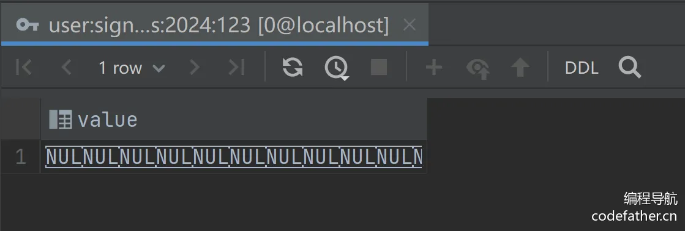

但这个缺点无关痛痒，因此本项目采用这种方案实现。

总结一下：	

- 基于性能的考虑，我们选用 Redis 中间件来存储用户的签到记录。
- 基于空间的考虑，我们选用 Bitmap 数据结构来存储用户的签到记录。

#### 前端方案

要明确前端展示签到记录日历所需的数据类型，后端才好设计接口的返回值，因此方案设计阶段要考虑全面。

复杂的展示组件肯定不用自己开发，只要是图表（可视化），就可以优先考虑使用 Apache ECharts 前端可视化库，有 3 种可行的组件：

1. 基础日历图：https://echarts.apache.org/examples/zh/editor.html?c=calendar-simple
2. 日历热力图：https://echarts.apache.org/examples/zh/editor.html?c=calendar-heatmap，跟上一个图的区别就是鼠标放上去可以展示具体的热力值，热力值越高，图块的颜色越深。
3. 日历图：https://echarts.apache.org/examples/zh/editor.html?c=calendar-charts

本项目选择基础日历图即可，不涉及热力数值的区分（只有 0 和 1 签到 / 未签到的区别）：


可以通过官方的 Demo 观察所需的数据格式，官方生成数据的循环代码如下：

```javascript
for (let time = date; time <= end; time += dayTime) {
  data.push([
    echarts.time.format(time, '{yyyy}-{MM}-{dd}', false),
    Math.floor(Math.random() * 10000)
  ]);
}
```

显然，得到的数据是一个二维数组，每个元素表示一个日期和对应的数值：

```javascript
[
  ['2017-01-01', 3456],
  ['2017-01-02', 8975],
  ...
]
```

但回归我们的项目，用 Bitmap 每天最多只有一次记录，相当于只有 0 和 1。因此可以调整 Apache ECharts 图表的配置来调整热力值的范围，从而控制颜色深浅。还支持调整颜色：

```javascript
visualMap: {
  show: false,
    min: 0,
    max: 1,
    inRange: {
    color: ['#efefef', 'lightgreen']  // 颜色从灰色到浅绿色
  },
},
```

效果如图：

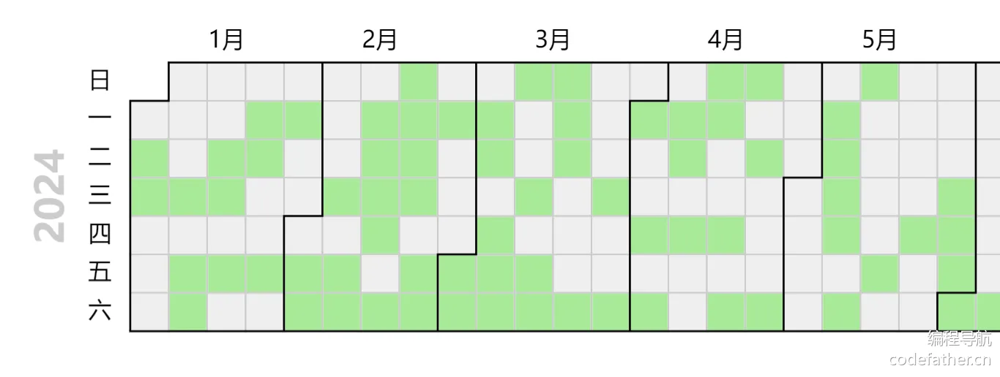

因此，后端只需要返回下列结构即可：

```javascript
[
  ['2024-01-01', 0],
  ['2024-01-02', 1],
  ...
]
```

### 后端开发

需要开发 2 个接口：

1. 添加刷题签到记录
2. 查询刷题签到记录

在此之前，需要先引入 Redisson 依赖，以实现 Bitmap 存储。

#### 1、引入 Redisson

[Redisson](https://github.com/redisson/redisson) 是一个基于 Redis 的开源分布式 Java 数据库客户端，提供了类似 Java 标准库的数据结构（如 Map、Set、List、BitSet 等）在分布式环境下的实现。它不仅支持基本的 Redis 操作，还提供了高级功能，如分布式锁、同步器、限流器、缓存等，简化了在分布式系统中使用 Redis 进行数据共享和并发控制的复杂性。

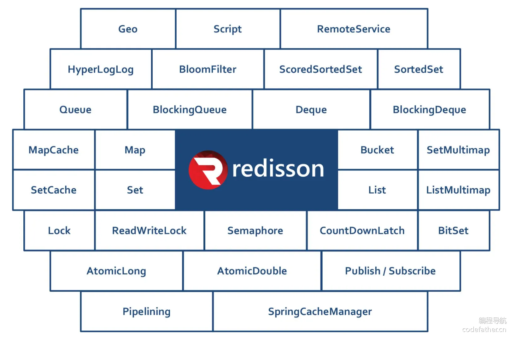

1）在 pom.xml 文件中引入 Redisson：

```xml
<dependency>
  <groupId>org.redisson</groupId>
  <artifactId>redisson</artifactId>
  <version>3.21.0</version>
</dependency>
```

2）在 config 目录下编写 Redisson 客户端配置类，会自动读取项目中的 Redis 配置，初始化客户端 Bean。代码如下：

```java
@Configuration
@ConfigurationProperties(prefix = "spring.redis")
@Data
public class RedissonConfig {

    private String host;

    private Integer port;

    private Integer database;

    private String password;

    @Bean
    public RedissonClient redissonClient() {
        Config config = new Config();
        config.useSingleServer()
        .setAddress("redis://" + host + ":" + port)
        .setDatabase(database)
        .setPassword(password);
        return Redisson.create(config);
    }
}
```

3）项目的 yml 配置文件中补充 Redis 配置，没有密码就可以注释掉：

```java
# Redis 配置
spring:
  redis:
    database: 0
    host: xxxx
    port: xxx
    timeout: 2000
    password: xxx
```

然后尝试启动项目。如果用的是编程导航的万用后端模板，**记得取消启动类对 Redis 的移除**。

#### 2、添加刷题签到记录接口

触发时机：已登录用户进入题目详情页时，调用接口，触发签到。

接口逻辑：判断目前用户当天是否签到

- 如果已签到，则忽略
- 如果未签到，则在 Bitmap 中设置记录

1）因为读写 Redis 使用的是相同的 key，可以将所有 Redis 的 key 单独定义成常量，放在 constant 目录下，还可以提供拼接完整 key 的方法。代码如下：

```java
public interface RedisConstant {

    /**
     * 用户签到记录的 Redis Key 前缀
     */
    String USER_SIGN_IN_REDIS_KEY_PREFIX = "user:signins";

    /**
     * 获取用户签到记录的 Redis Key
     * @param year 年份
     * @param userId 用户 id
     * @return 拼接好的 Redis Key
     */
    static String getUserSignInRedisKey(int year, long userId) {
        return String.format("%s:%s:%s", USER_SIGN_IN_REDIS_KEY_PREFIX, year, userId);
    }

}
```

2）在 UserService 中编写接口：

```java
/**
 * 添加用户签到记录
 *
 * @param userId 用户 id
 * @return 当前是否已签到成功
 */
boolean addUserSignIn(long userId);
```

编写实现类：

```java
/**
 * 添加用户签到记录
 *
 * @param userId 用户签到
 * @return 当前是否已签到成功
 */
public boolean addUserSignIn(long userId) {
    LocalDate date = LocalDate.now();
    String key = RedisConstant.getUserSignInRedisKey(date.getYear(), userId);
    RBitSet signInBitSet = redissonClient.getBitSet(key);
    // 获取当前日期是一年中的第几天，作为偏移量（从 1 开始计数）
    int offset = date.getDayOfYear();
    // 检查当天是否已经签到
    if (!signInBitSet.get(offset)) {
        // 如果当天还未签到，则设置
        return signInBitSet.set(offset, true);
    }
    // 当天已签到
    return true;
}
```

3）在 Controller 中编写 API 接口：

```java
/**
 * 添加用户签到记录
 *
 * @param request
 * @return 当前是否已签到成功
 */
@PostMapping("/add/sign_in")
public BaseResponse<Boolean> addUserSignIn(HttpServletRequest request) {
    // 必须要登录才能签到
    User loginUser = userService.getLoginUser(request);
    boolean result = userService.addUserSignIn(loginUser.getId());
    return ResultUtils.success(result);
}
```

💡 思考：这个接口的签到操作能否异步执行呢？

#### 3、查询刷题签到记录接口

实现思路：

1. 通过 userId 和当前年份从 Redis 中获取对应的 Bitmap
2. 获取当前年份的总天数
3. 循环天数拼接日期，根据日期去 Bitmap 中判断是否有签到记录，并记录到数组中
4. 最后，将拼接好的、一年的签到记录返回给前端

1）在 UserService 中定义接口：

```java
/**
 * 获取用户某个年份的签到记录
 *
 * @param userId 用户 id
 * @param year   年份（为空表示当前年份）
 * @return 签到记录映射
 */
Map<LocalDate, Boolean> getUserSignInRecord(long userId, Integer year);
```

为什么使用 Map 而不是 List 呢？下面会揭晓答案。

2）编写实现类，依次获取每一天的签到状态：

```java
@Override
public Map<LocalDate, Boolean> getUserSignInRecord(long userId, Integer year) {
    if (year == null) {
        LocalDate date = LocalDate.now();
        year = date.getYear();
    }
    String key = RedisConstant.getUserSignInRedisKey(year, userId);
    RBitSet signInBitSet = redissonClient.getBitSet(key);
    // LinkedHashMap 保证有序
    Map<LocalDate, Boolean> result = new LinkedHashMap<>();
    // 获取当前年份的总天数
    int totalDays = Year.of(year).length();
    // 依次获取每一天的签到状态
    for (int dayOfYear = 1; dayOfYear <= totalDays; dayOfYear++) {
        // 获取 key：当前日期
        LocalDate currentDate = LocalDate.ofYearDay(year, dayOfYear);
        // 获取 value：当天是否有刷题
        boolean hasRecord = signInBitSet.get(dayOfYear);
        // 将结果放入 map
        result.put(currentDate, hasRecord);
    }
    return result;
}
```

注意，我们使用了 LinkedHashMap 来保证了键值对映射的有序性，相当于直接得到了映射列表，符合前端要求的返回值格式。

3）编写 Controller 接口代码：

```java
/**
 * 获取用户签到记录
 *
 * @param year    年份（为空表示当前年份）
 * @param request
 * @return 签到记录映射
 */
@GetMapping("/get/sign_in")
public BaseResponse<Map<LocalDate, Boolean>> getUserSignInRecord(Integer year, HttpServletRequest request) {
    // 必须要登录才能获取
    User loginUser = userService.getLoginUser(request);
    Map<LocalDate, Boolean> userSignInRecord = userService.getUserSignInRecord(loginUser.getId(), year);
    return ResultUtils.success(userSignInRecord);
}
```

4）通过 Swagger 接口文档调用接口进行测试，得到的示例结果如下：

```java
{2024-01-01=false, 2024-01-02=false, 2024-01-03=false, 2024-01-04=false, 2024-01-05=false, 2024-01-06=false, 2024-01-07=false, 2024-01-08=false, 2024-01-09=false, 2024-01-10=false, 2024-01-11=false, 2024-01-12=false, 2024-01-13=false, 2024-01-14=false, 2024-01-15=false, 2024-01-16=false, 2024-01-17=false, 2024-01-18=false, 2024-01-19=false, 2024-01-20=false, 2024-01-21=false, 2024-01-22=false, 2024-01-23=false, 2024-01-24=false, 2024-01-25=false, 2024-01-26=false, 2024-01-27=false, 2024-01-28=false, 2024-01-29=false,
 2024-01-30=false, 2024-01-31=false, 2024-02-01=false, 2024-02-02=false, 2024-02-03=false, 2024-02-04=false, 2024-02-05=false, 2024-02-06=false, 2024-02-07=false, 2024-02-08=false, 2024-02-09=false, 2024-02-10=false, 2024-02-11=false, 2024-02-12=false, 2024-02-13=false, 2024-02-14=false, 2024-02-15=false, 2024-02-16=false, 2024-02-17=false, 2024-02-18=false, 2024-02-19=false, 2024-02-20=false, 2024-02-21=false, 2024-02-22=false, 2024-02-23=false, 2024-02-24=false, 2024-02-25=false, 2024-02-26=false, 2024-02-27=false, 
 2024-02-28=false, 2024-02-29=false, 2024-03-01=false, 2024-03-02=false, 2024-03-03=false, 2024-03-04=false, 2024-03-05=false, 2024-03-06=false, 2024-03-07=false, 2024-03-08=false, 2024-03-09=false, 2024-03-10=false, 2024-03-11=false, 2024-03-12=false, 2024-03-13=false, 2024-03-14=false, 2024-03-15=false, 2024-03-16=false, 2024-03-17=false, 2024-03-18=false, 2024-03-19=false, 2024-03-20=false, 2024-03-21=false, 2024-03-22=false, 2024-03-23=false, 2024-03-24=false, 2024-03-25=false, 2024-03-26=false, 2024-03-27=false, 
 2024-03-28=false, 2024-03-29=false, 2024-03-30=false, 2024-03-31=false, 2024-04-01=false, 2024-04-02=false, 2024-04-03=false, 2024-04-04=false, 2024-04-05=false, 2024-04-06=false, 2024-04-07=false, 2024-04-08=false, 2024-04-09=false, 2024-04-10=false, 2024-04-11=false, 2024-04-12=false, 2024-04-13=false, 2024-04-14=false, 2024-04-15=false, 2024-04-16=false, 2024-04-17=false, 2024-04-18=false, 2024-04-19=false, 2024-04-20=false, 2024-04-21=false, 2024-04-22=false, 2024-04-23=false, 2024-04-24=false, 2024-04-25=false, 
 2024-04-26=false, 2024-04-27=false, 2024-04-28=false, 2024-04-29=false, 2024-04-30=false, 2024-05-01=false, 2024-05-02=false, 2024-05-03=false, 2024-05-04=false, 2024-05-05=false, 2024-05-06=false, 2024-05-07=false, 2024-05-08=false, 2024-05-09=false, 2024-05-10=false, 2024-05-11=false, 2024-05-12=false, 2024-05-13=false, 2024-05-14=false, 2024-05-15=false, 2024-05-16=false, 2024-05-17=false, 2024-05-18=false, 2024-05-19=false, 2024-05-20=false, 2024-05-21=false, 2024-05-22=false, 2024-05-23=false, 2024-05-24=false, 
 2024-05-25=false, 2024-05-26=false, 2024-05-27=false, 2024-05-28=false, 2024-05-29=false, 2024-05-30=false, 2024-05-31=false, 2024-06-01=false, 2024-06-02=false, 2024-06-03=false, 2024-06-04=false, 2024-06-05=false, 2024-06-06=false, 2024-06-07=false, 2024-06-08=false, 2024-06-09=false, 2024-06-10=false, 2024-06-11=false, 2024-06-12=false, 2024-06-13=false, 2024-06-14=false, 2024-06-15=false, 2024-06-16=false, 2024-06-17=false, 2024-06-18=false, 2024-06-19=false, 2024-06-20=false, 2024-06-21=false, 2024-06-22=false, 
2024-06-23=false, 2024-06-24=false, 2024-06-25=false, 2024-06-26=false, 2024-06-27=false, 2024-06-28=false, 2024-06-29=false, 2024-06-30=false, 2024-07-01=false, 2024-07-02=false, 2024-07-03=false, 2024-07-04=false, 2024-07-05=false, 2024-07-06=false, 2024-07-07=false, 2024-07-08=false, 2024-07-09=false, 2024-07-10=false, 2024-07-11=false, 2024-07-12=false, 2024-07-13=false, 2024-07-14=false, 2024-07-15=false, 2024-07-16=false, 2024-07-17=false, 2024-07-18=false, 2024-07-19=false, 2024-07-20=false, 2024-07-21=false, 
2024-07-22=false, 2024-07-23=false, 2024-07-24=false, 2024-07-25=false, 2024-07-26=false, 2024-07-27=false, 2024-07-28=false, 2024-07-29=false, 2024-07-30=false, 2024-07-31=false, 2024-08-01=false, 2024-08-02=false, 2024-08-03=false, 2024-08-04=false, 2024-08-05=false, 2024-08-06=false, 2024-08-07=false, 2024-08-08=false, 2024-08-09=false, 2024-08-10=false, 2024-08-11=false, 2024-08-12=false, 2024-08-13=true, 2024-08-14=true, 2024-08-15=false, 2024-08-16=false, 2024-08-17=false, 2024-08-18=false, 2024-08-19=false, 
2024-08-20=false, 2024-08-21=false, 2024-08-22=false, 2024-08-23=false, 2024-08-24=false, 2024-08-25=false, 2024-08-26=false, 2024-08-27=false, 2024-08-28=false, 2024-08-29=false, 2024-08-30=false, 2024-08-31=false, 2024-09-01=false, 2024-09-02=false, 2024-09-03=false, 2024-09-04=false, 2024-09-05=false, 2024-09-06=false, 2024-09-07=false, 2024-09-08=false, 2024-09-09=false, 2024-09-10=false, 2024-09-11=false, 2024-09-12=false, 2024-09-13=false, 2024-09-14=false, 2024-09-15=false, 2024-09-16=false, 2024-09-17=false, 
2024-09-18=false, 2024-09-19=false, 2024-09-20=false, 2024-09-21=false, 2024-09-22=false, 2024-09-23=false, 2024-09-24=false, 2024-09-25=false, 2024-09-26=false, 2024-09-27=false, 2024-09-28=false, 2024-09-29=false, 2024-09-30=false, 2024-10-01=false, 2024-10-02=false, 2024-10-03=false, 2024-10-04=false, 2024-10-05=false, 2024-10-06=false, 2024-10-07=false, 2024-10-08=false, 2024-10-09=false, 2024-10-10=false, 2024-10-11=false, 2024-10-12=false, 2024-10-13=false, 2024-10-14=false, 2024-10-15=false, 2024-10-16=false,
2024-10-17=false, 2024-10-18=false, 2024-10-19=false, 2024-10-20=false, 2024-10-21=false, 2024-10-22=false, 2024-10-23=false, 2024-10-24=false, 2024-10-25=false, 2024-10-26=false, 2024-10-27=false, 2024-10-28=false, 2024-10-29=false, 2024-10-30=false, 2024-10-31=false, 2024-11-01=false, 2024-11-02=false, 2024-11-03=false, 2024-11-04=false, 2024-11-05=false, 2024-11-06=false, 2024-11-07=false, 2024-11-08=false, 2024-11-09=false, 2024-11-10=false, 2024-11-11=false, 2024-11-12=false, 2024-11-13=false, 2024-11-14=false, 
2024-11-15=false, 2024-11-16=false, 2024-11-17=false, 2024-11-18=false, 2024-11-19=false, 2024-11-20=false, 2024-11-21=false, 2024-11-22=false, 2024-11-23=false, 2024-11-24=false, 2024-11-25=false, 2024-11-26=false, 2024-11-27=false, 2024-11-28=false, 2024-11-29=false, 2024-11-30=false, 2024-12-01=false, 2024-12-02=false, 2024-12-03=false, 2024-12-04=false, 2024-12-05=false, 2024-12-06=false, 2024-12-07=false, 2024-12-08=false, 2024-12-09=false, 2024-12-10=false, 2024-12-11=false, 2024-12-12=false, 2024-12-13=false, 
2024-12-14=false, 2024-12-15=false, 2024-12-16=false, 2024-12-17=false, 2024-12-18=false, 2024-12-19=false, 2024-12-20=false, 2024-12-21=false, 2024-12-22=false, 2024-12-23=false, 2024-12-24=false, 2024-12-25=false, 2024-12-26=false, 2024-12-27=false, 2024-12-28=false, 2024-12-29=false, 2024-12-30=false, 2024-12-31=false}
```

### 性能优化

目前的代码逻辑虽然看起来很简单，但是存在很大的优化空间！

#### 1、判断每天是否刷题逻辑优化

不知道大家对上面这段代码是否敏感？循环内部需要判断当天是否有刷题，实际上每次判断都会去与 Redis 交互，一个循环需要交互 365 次 Redis，效率极低！

```java
// 依次获取每一天的签到状态
for (int dayOfYear = 1; dayOfYear <= totalDays; dayOfYear++) {
    // 获取 key：当前日期
    LocalDate currentDate = LocalDate.ofYearDay(year, dayOfYear);
    // 获取 value：当天是否有刷题
    boolean hasRecord = signInBitSet.get(dayOfYear);
    // 将结果放入 map
    result.put(currentDate, hasRecord);
}
```

具体来说，`signInBitSet` 是通过 Redisson 客户端与 Redis 交互的 `RBitSet` 对象，而 `RBitSet.get(int bitIndex)` 这个方法会触发一次 Redis 请求来获取对应位的值，并没有在本地做缓存。

通过 WireShark 等抓包工具可以看到，客户端发了一大堆请求给 redis 实例。仔细观察右下角的抓包数据，可以看到执行的操作：

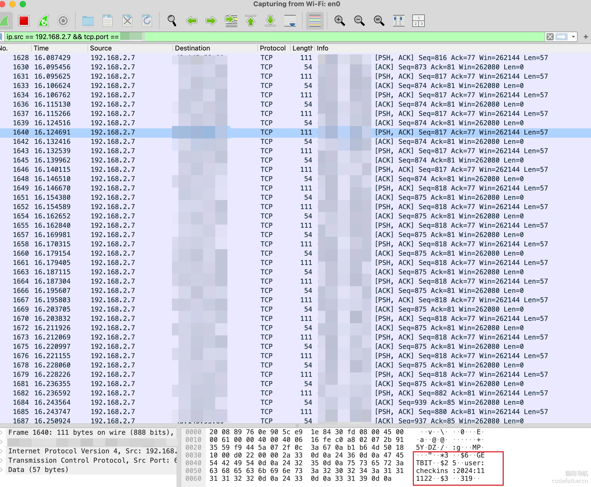

因此，我们在循环外缓存一下 Bitmap 的数据，即可大大提升这个方法的效率：

```java
// 加载 BitSet 到内存中，避免后续读取时发送多次请求
BitSet bitSet = signInBitSet.asBitSet();
```

循环内部使用 `bitSet.get` 即可：

```java
// 获取 value：当天是否有刷题
boolean hasRecord = bitSet.get(dayOfYear);
```

#### 2、刷题记录返回值优化

从示例结果我们可以看到 **传输的数据较多、计算时间耗时、带宽占用多、效率低**。

实际上没必要完全组装好数据传输给前端，仅需告诉前端哪天有刷题就行（大部分同学不可能一年 365 天每天都刷题），这样能大大减少传输的数据量以及后端服务的 CPU 占用，将部分计算压力均摊到用户的客户端（浏览器身上）。

修改代码如下：

```tsx
@Override
public List<Integer> getUserSignInRecord(long userId, Integer year) {
    if (year == null) {
        LocalDate date = LocalDate.now();
        year = date.getYear();
    }
    String key = RedisConstant.getUserSignInRedisKey(year, userId);
    RBitSet signInBitSet = redissonClient.getBitSet(key);
    // 加载 BitSet 到内存中，避免后续读取时发送多次请求
    BitSet bitSet = signInBitSet.asBitSet();
    // 统计签到的日期
    List<Integer> dayList = new ArrayList<>();
    // 获取当前年份的总天数
    int totalDays = Year.of(year).length();
    // 依次获取每一天的签到状态
    for (int dayOfYear = 1; dayOfYear <= totalDays; dayOfYear++) {
        // 获取 value：当天是否有刷题
        boolean hasRecord = bitSet.get(dayOfYear);
        if (hasRecord) {
          dayList.add(dayOfYear);
        }
    }
    return dayList;
}
```

#### 3、计算优化

上述代码中，我们使用循环来遍历所有年份，而循环是需要消耗 CPU 计算资源的。

在 Java 中的 `BitSet` 类中，可以使用 `nextSetBit(int fromIndex)` 和 `nextClearBit(int fromIndex)` 方法来获取从指定索引开始的下一个 **已设置（即为 1）** 或 **未设置（即为 0）** 的位。

主要是 2 个方法：

- `nextSetBit(int fromIndex)`：从 `fromIndex` 开始（包括 `fromIndex` 本身）寻找下一个被设置为 1 的位。如果找到了，返回该位的索引；如果没有找到，返回 -1。
- `nextClearBit(int fromIndex)`：从 `fromIndex` 开始（包括 `fromIndex` 本身）寻找下一个为 0 的位。如果找到了，返回该位的索引；如果没有找到，返回一个大的整数值。

使用 nextSetBit，可以跳过无意义的循环检查，通过位运算来获取被设置为 1 的位置，性能更高。

修改后的代码如下：

```java
@Override
public List<Integer> getUserSignInRecord(long userId, Integer year) {
    if (year == null) {
        LocalDate date = LocalDate.now();
        year = date.getYear();
    }
    String key = RedisConstant.getUserSignInRedisKey(year, userId);
    RBitSet signInBitSet = redissonClient.getBitSet(key);
    // 加载 BitSet 到内存中，避免后续读取时发送多次请求
    BitSet bitSet = signInBitSet.asBitSet();
    // 统计签到的日期
    List<Integer> dayList = new ArrayList<>();
    // 从索引 0 开始查找下一个被设置为 1 的位
    int index = bitSet.nextSetBit(0);
    while (index >= 0) {
        dayList.add(index);
        // 查找下一个被设置为 1 的位
        index = bitSet.nextSetBit(index + 1);
    }
    return dayList;
}
```

得到结果示例如下：

```java
[1, 226]
```

注意，需要同步修改 Controller 接口返回值。

#### 优化小结

本功能的性能优化也是有代表性的，总结出来几个实用优化思路：

1. 减少网络请求或调用次数
2. 减少接口传输数据的体积
3. 减少循环和计算
4. 通过客户端计算减少服务端的压力

#### 扩展

大家可以通过 JMeter 压测工具来测试下性能优化前后的接口 QPS 和平均响应时长，应该会有意外之喜。

### 前端开发

#### 1、引入 ECharts 组件库

安装 ECharts：https://echarts.apache.org/zh/index.html

和 React ECharts 可视化库：https://github.com/hustcc/echarts-for-react

```shell
npm install --save echarts
npm install --save echarts-for-react
```

安装失败的话，在命令后加 `--force`。

#### 2、用户中心页面开发

在 app 目录下新建 `user/center` 页面。该页面依赖用户登录态来展示登录用户信息和签到记录，所以应该声明为客户端组件。

在导航栏右侧的下拉菜单中补充到该页面的跳转：

```tsx
<Dropdown
  menu={{
    items: [
      {
        key: "userCenter",
        icon: <UserOutlined />,
        label: "个人中心",
      },
      {
        key: "logout",
        icon: <LogoutOutlined />,
        label: "退出登录",
      },
    ],
    onClick: async (event: { key: React.Key }) => {
      const { key } = event;
      if (key === "logout") {
        userLogout();
      } else if (key === "userCenter") {
        router.push("/user/center");
      }
    },
  }}
>
  {dom}
</Dropdown>
```

页面结构可以通过如下组件快速完成：

- 栅格响应式布局：https://ant-design.antgroup.com/components/grid-cn#grid-demo-responsive
- 左侧用户信息，Card.Meta 组件：https://ant-design.antgroup.com/components/card-cn#card-demo-meta
- 右侧内容区域，带页签的卡片：https://ant-design.antgroup.com/components/card-cn#card-demo-tabs

页面代码如下：

```tsx
"use client";
import { Avatar, Card, Col, Row } from "antd";
import Meta from "antd/es/card/Meta";
import Paragraph from "antd/es/typography/Paragraph";
import Title from "antd/es/typography/Title";
import { useSelector } from "react-redux";
import { RootState } from "@/stores";
import { useState } from "react";
import "./index.css";

/**
 * 用户中心页面
 * @constructor
 */
export default function UserCenterPage() {
  const loginUser = useSelector((state: RootState) => state.loginUser);
  // 便于复用，新起一个变量
  const user = loginUser;
  // 控制菜单栏 Tab
  const [activeTabKey, setActiveTabKey] = useState<string>("record");

  return (
    <div id="userCenterPage" className="max-width-content">
      <Row gutter={[16, 16]}>
        <Col xs={24} md={6}>
          <Card style={{ textAlign: "center" }}>
            <Avatar src={user.userAvatar} size={72} />
            <div style={{ marginBottom: 16 }} />
            <Meta
              title={
                <Title level={4} style={{ marginBottom: 0 }}>
                  {user.userName}
                </Title>
              }
              description={
                <>
                  <Paragraph type="secondary">{user.userProfile}</Paragraph>
                </>
              }
            />
          </Card>
        </Col>
        <Col xs={24} md={18}>
          <Card
            tabList={[
              {
                key: "record",
                label: "刷题记录",
              },
              {
                key: "others",
                label: "其他",
              },
            ]}
            activeTabKey={activeTabKey}
            onTabChange={(key: string) => {
              setActiveTabKey(key);
            }}
          >
            {activeTabKey === "record" && <>aaa</>}
            {activeTabKey === "others" && <>bbb</>}
          </Card>
        </Col>
      </Row>
    </div>
  );
}
```

效果如图：


#### 3、封装日历图组件

在用户中心页面的 components 目录下新增日历图组件，因为不需要复用：


1）参考 React ECharts 的 [官方文档](https://git.hust.cc/echarts-for-react/) 来使用 ECharts 组件，把 Demo 代码复制到新建的组件文件中。

2）在用户中心页面中引入组件，便于查看效果：

```tsx
{activeTabKey === "record" && <>
    <CalendarChart />
</>}
```

3）定义签到日期数组变量，将数组转换为图表需要的数据。其中，对日期的处理需要用到 dayjs 库：

```tsx
// 签到日期列表（[1, 200]，表示第 1 和第 200 天有签到记录）
const [dataList, setDataList] = useState<number[]>([]);

// 计算图表需要的数据
const year = new Date().getFullYear();
const optionsData = dataList.map((dayOfYear, index) => {
  // 计算日期字符串
  const dateStr = dayjs(`${year}-01-01`)
    .add(dayOfYear - 1, "day")
    .format("YYYY-MM-DD");
  return [dateStr, 1];
});
```

4）参考 Echarts 的官方 Demo 开发前端日历图：https://echarts.apache.org/examples/zh/editor.html?c=calendar-simple

先在 Demo 页面里调整好效果，得到 options 选项。

💡 小技巧：可以通过配置项或者询问 AI 得到需要的配置

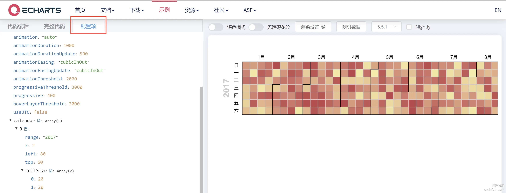

调整好的图表配置如下：

```tsx
// 图表配置
const options = {
  visualMap: {
    show: false,
    min: 0,
    max: 1,
    inRange: {
      // 颜色从灰色到浅绿色
      color: ["#efefef", "lightgreen"],
    },
  },
  calendar: {
    range: year,
    left: 20,
    // 单元格自动宽度，高度为 16 像素
    cellSize: ['auto', 16],
    yearLabel: {
      position: "top",
      formatter: `${year} 年刷题记录`,
    }
  },
  series: {
    type: "heatmap",
    coordinateSystem: "calendar",
    data: optionsData,
  },
};
```

效果如下：

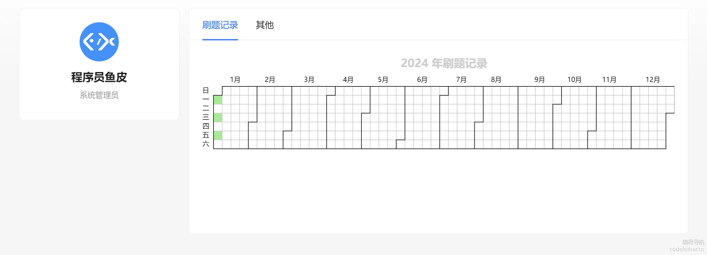

5）获取数据：前端调用 OpenAPI 生成新的刷题签到记录相关接口，调用并得到 dataList 即可。

代码如下：

```tsx
// 请求后端获取数据
const fetchDataList = async () => {
  try {
    const res = await getUserSignInRecordUsingGet({
      year,
    });
    setDataList(res.data || []);
  } catch (e) {
    message.error("获取刷题签到记录失败，" + e.message);
  }
};

useEffect(() => {
  fetchDataList();
}, []);
```

#### 4、执行签到

由于获取题目详情接口是在服务端渲染，拿不到用户登录态，所以建议在客户端额外发送请求来执行签到。

编写一个 hooks 钩子，便于在多个题目详情页中复用：

```tsx
import { useEffect, useState } from "react";
import { message } from "antd";
import { addUserSignInUsingPost } from "@/api/userController";

/**
 * 添加用户签到记录钩子
 */
const useAddUserSignInRecord = () => {
  const [loading, setLoading] = useState(false);

  // 请求后端执行签到
  const doFetch = async () => {
    setLoading(true);
    try {
      await addUserSignInUsingPost();
    } catch (e) {
      message.error("添加刷题签到记录失败，" + e.message);
    } finally {
      setLoading(false);
    }
  };

  useEffect(() => {
    doFetch();
  }, []);

  return { loading };
};

export default useAddUserSignInRecord;
```

注意，该钩子需要在客户端组件中执行，因为用到了 useEffect 防止重复请求、并且还需要获取到用户登录态。

可以在题目详情卡片 QuestionCard 这一客户端组件里使用钩子，这样所有题目详情页都会触发签到。代码如下：

```tsx
const QuestionCard = (props: Props) => {
  const { question } = props;
  
  // 签到
  useAddUserSignInRecord();

  // ...
}
```

#### 前端扩展

1）用户中心是否需要实现服务端渲染？如何实现服务端渲染？

思路：先通过 userId 获取基础信息（未登录也可获取），再到客户端携带 Cookie 获取登录用户可见的信息。

2）用户中心页面添加权限校验

思路：可以通过 menu 菜单项配置，利用全局权限校验实现仅登录用户可见。

3）优化：如果前端签到成功，可以保存到 LocalStorage 等位置，防止每次刷题都重复发送签到请求。

### 扩展

#### 1、过期时间

问：Redis 中的 Bitmap 如何设置过期时间？需要设置一年的过期时间吗？

答：如果用户有看往年记录的需求，可以用单次任务（或定时任务）将往年 Redis 数据落库，确保入库成功后，清理 Redis 即可。

比如 2025 年 1 月 1 号，就可以将 2024 年的签到记录入库了。

除非是非常重要的数据，否则最好还是设置下过期时间，一年多即可。

再问：Bitmap 一年落库一次吗？不怕数据丢失吗？

答：Redis 本身有持久化机制，虽然无法完全保证数据不丢失，但是至少数据不会全部丢失。根据我们的刷题逻辑，即使 Redis 意外宕机，丢失前几秒的部分签到，但是用户当天刷题后又会补回来。

如果想保证数据完全不丢失，那么需要在获取题目详情的时候，同步将刷题记录落库，这样性能相对而言就比较差，在一些重要的数据场景需要这样设计。或者再加一个消息队列来提高性能，但架构复杂度和系统维护成本就更高了。

#### 2、按月份查看记录

如果要实现按月份查看签到记录，后端可以给 Redis BitMap 的 key 多加个月份层级，前端可以改为使用 [Ant Design 的日历组件](https://ant-design.antgroup.com/components/calendar-cn#calendar-demo-notice-calendar) 。

Ant Design 的日历组件适用于展示更多内容、需要切换月份和年份的场景：


#### 3、更详细的刷题记录

如果要实现详细的刷题记录，比如什么时候刷题，可以用数据库或者 Redis 的 Set 方式实现，因为 BitMap 只能用于判断，不适用于记录额外的信息。

参考效果：

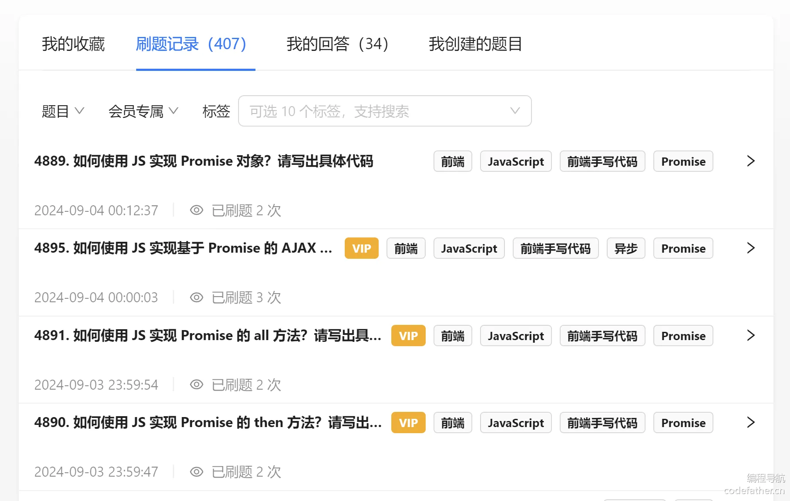

## 二、分词题目搜索

### 需求分析

用户能够更灵活地搜索出题目，分词搜索

### 方案设计

使用 Elasticsearch 实现题目数据的存储和分词搜索，需要将数据库的数据同步到 Elasticsearch。

### Elasticsearch 入门

可参考 [编程导航 - 聚合搜索项目](https://www.code-nav.cn/course/1790979621621641217/section/1790981171370831874) 的笔记，该项目系统讲解过 Elasticsearch。

#### 1、什么是 Elasticsearch？

Elasticsearch 是一个分布式、开源的搜索引擎，专门用于处理大规模的数据搜索和分析。它基于 Apache Lucene 构建，具有实时搜索、分布式计算和高可扩展性，广泛用于 **全文检索、日志分析、监控数据分析** 等场景。

官方文档：https://www.elastic.co/docs，建议入门后阅读一遍，了解更多它的特性。

#### 2、Elasticsearch 生态

Elasticsearch 生态系统非常丰富，包含了一系列工具和功能，帮助用户处理、分析和可视化数据，Elastic Stack 是其核心组成部分。

Elastic Stack（也称为 ELK Stack）由以下几部分组成：

- Elasticsearch：核心搜索引擎，负责存储、索引和搜索数据。
- Kibana：可视化平台，用于查询、分析和展示 Elasticsearch 中的数据。
- Logstash：数据处理管道，负责数据收集、过滤、增强和传输到 Elasticsearch。
- Beats：轻量级的数据传输工具，收集和发送数据到 Logstash 或 Elasticsearch。

Kibana 是 Elastic Stack 的可视化组件，允许用户通过图表、地图和仪表盘来展示存储在 Elasticsearch 中的数据。它提供了简单的查询接口、数据分析和实时监控功能。


Logstash 是一个强大的数据收集管道工具，能够从多个来源收集、过滤、转换数据，然后将数据发送到 Elasticsearch。Logstash 支持丰富的输入、过滤和输出插件。


Beats 是一组轻量级的数据采集代理，负责从不同来源收集数据并发送到 Elasticsearch 或 Logstash。常见的 Beats 包括：

- Filebeat：收集日志文件。
- Metricbeat：收集系统和服务的指标。
- Packetbeat：监控网络流量。


上面这张图，也是标准的 Elastic Stack 技术栈的交互图。

#### 3、Elasticsearch 的核心概念

索引（Index）：类似于关系型数据库中的表，索引是数据存储和搜索的 **基本单位**。每个索引可以存储多条文档数据。

文档（Document）：索引中的每条记录，类似于数据库中的行。文档以 JSON 格式存储。

字段（Field）：文档中的每个键值对，类似于数据库中的列。

映射（Mapping）：用于定义 Elasticsearch 索引中文档字段的数据类型及其处理方式，类似于关系型数据库中的 Schema 表结构，帮助控制字段的存储、索引和查询行为。

集群（Cluster）：多个节点组成的群集，用于存储数据并提供搜索功能。集群中的每个节点都可以处理数据。

分片（Shard）：为了实现横向扩展，ES 将索引拆分成多个分片，每个分片可以分布在不同节点上。

副本（Replica）：分片的复制品，用于提高可用性和容错性。


和数据库类比：

| **Elasticsearch 概念** | **关系型数据库类比** |
| ---------------------- | -------------------- |
| Index                  | Table                |
| Document               | Row                  |
| Field                  | Column               |
| Mapping                | Schema               |
| Shard                  | Partition            |
| Replica                | Backup               |

#### 4、Elasticsearch 实现全文检索的原理

1）分词：Elasticsearch 的分词器会将输入文本拆解成独立的词条（tokens），方便进行索引和搜索。分词的具体过程包括以下几步：

- 字符过滤：去除特殊字符、HTML 标签或进行其他文本清理。
- 分词：根据指定的分词器（analyzer），将文本按规则拆分成一个个词条。例如，英文可以按空格拆分，中文使用专门的分词器处理。
- 词汇过滤：对分词结果进行过滤，如去掉停用词（常见但无意义的词，如 "the"、"is" 等）或进行词形归并（如将动词变为原形）。

Elasticsearch 内置了很多分词器，比如按照空格分词等，默认只支持英文，可以在 [官方文档](https://www.elastic.co/guide/en/elasticsearch/reference/7.17/analysis-analyzers.html) 了解。

2）倒排索引：

倒排索引是 Elasticsearch 实现高效搜索的核心数据结构。它将文档中的词条映射到文档 ID，实现快速查找。

工作原理：

- 每个文档在被索引时，分词器会将文档内容拆解为多个词条。
- 然后，Elasticsearch 为每个词条生成一个倒排索引，记录该词条在哪些文档中出现。

举个例子，假设有两个文档：

- 文档 1：鱼皮是帅锅
- 文档 2：鱼皮是好人

中文分词后，生成的倒排索引大致如下：

| 词条 | 文档 ID |
| ---- | ------- |
| 鱼皮 | 1, 2    |
| 是   | 1, 2    |
| 帅锅 | 1       |
| 好人 | 2       |

通过这种结构，查询某个词时，可以快速找到包含该词的所有文档。

#### 5、Elasticsearch 打分规则

实际应用 Elasticsearch 来实现搜索功能时，我们不仅要求能搜到内容，而且还要把和用户搜索最相关的内容展示在前面。这就需要我们了解 Elasticsearch 的打分规则。

打分规则（_Score）是用于衡量每个文档与查询条件的匹配度的评分机制。搜索结果的默认排序方式是按相关性得分（_score）从高到低。Elasticsearch 使用 **BM25 算法** 来计算每个文档的得分，它是基于词频、反向文档频率、文档长度等因素来评估文档和查询的相关性。

打分的主要因素：

1. 词频（TF, Term Frequency）：查询词在文档中出现的次数，出现次数越多，得分越高。
2. 反向文档频率（IDF, Inverse Document Frequency）：查询词在所有文档中出现的频率。词在越少的文档中出现，IDF 值越高，得分越高。
3. 文档长度：较短的文档往往被认为更相关，因为查询词在短文档中占的比例更大。

下面举一个例子：假设要在 Elasticsearch 中查询 `鱼皮` 这个关键词，索引中有以下三个文档：

文档 1：

```plain
鱼皮是个帅小伙，鱼皮非常聪明，鱼皮很喜欢编程。
```

分析：

- 查询词 `鱼皮` 出现了 3 次。
- 该文档较短，查询词 `鱼皮` 的密度很高。

由于 `鱼皮` 在文档中多次出现且文档较短，因此得分较高，相关性较强。

文档 2：

```plain
鱼皮是个帅小伙。
```

分析：

- 查询词 `鱼皮` 出现了 1 次。
- 文档非常短

尽管文档短，但是查询词出现的次数少，因此得分中等，相关性较普通。

文档 3：

```plain
鱼皮是个帅小伙，他喜欢写代码。他的朋友们也很喜欢编程和技术讨论，大家经常一起参与各种技术会议，讨论分布式系统、机器学习和人工智能等主题。
```

分析：

- 查询词 `鱼皮` 出现了 1 次。
- 文档较长，且 `鱼皮` 只在文档开头出现，词条密度较低。

由于文档很长，`鱼皮` 出现的次数少，密度也低，因此得分较低，相关性不强。

再举个例子，什么是反向文档频率？

假如说 ES 中有 10 个文档，都包含了“鱼皮”这个关键词；只有 1 个文档包含了“帅锅”这个关键词。

现在用户搜索“鱼皮帅锅”，大概率会把后面这条文档搜出来，因为更稀有。

当然，以上只是简单举例，实际上 ES 计算打分规则时，会有一套较为复杂的公式，感兴趣的同学可以阅读下面资料来了解：

- 鱼皮文章：https://liyupi.blog.csdn.net/article/details/119176943
- 官方文章：https://www.elastic.co/guide/en/elasticsearch/guide/master/controlling-relevance.html

#### 6、Elasticsearch 查询语法

Elasticsearch 支持多种查询语法，用于不同的场景和需求，主要包括查询 DSL、EQL、SQL 等。

**1）DSL 查询（\**\*\*Domain Specific Language\*\**\*）**

一种基于 JSON 的查询语言，它是 Elasticsearch 中最常用的查询方式。

示例：

```json
{
  "query": {
    "match": {
      "message": "Elasticsearch 是强大的"
    }
  }
}
```

这个查询会对 `message` 字段进行分词，并查找包含 "Elasticsearch" 和 "强大" 词条的文档。

**2）EQL**

EQL 全称 Event Query Language，是一种用于检测和检索时间序列 **事件** 的查询语言，常用于日志和安全监控场景。

示例：查找特定事件

```plain
process where process.name == "malware.exe"
```

这个查询会查找 `process.name` 为 "malware.exe" 的所有进程事件，常用于安全检测中的恶意软件分析。

**3）SQL 查询**

Elasticsearch 提供了类似于传统数据库的 SQL 查询语法，允许用户以 SQL 的形式查询 Elasticsearch 中的数据，对熟悉 SQL 的用户来说非常方便。

示例 SQL 查询：

```sql
SELECT name, age FROM users WHERE age > 30 ORDER BY age DESC
```

这个查询会返回 `users` 索引中 `age` 大于 30 的所有用户，并按年龄降序排序。

------

以下几种简单了解即可：

**4）Lucene 查询语法**

Lucene 是 Elasticsearch 底层的搜索引擎，Elasticsearch 支持直接使用 Lucene 的查询语法，适合简单的字符串查询。

示例 Lucene 查询：

```plain
name:Elasticsearch AND age:[30 TO 40]
```

这个查询会查找 `name` 字段为 "Elasticsearch" 且 `age` 在 30 到 40 之间的文档。

**5）Kuery（KQL: Kibana Query Language）**

KQL 是 Kibana 的查询语言，专门用于在 Kibana 界面上执行搜索查询，常用于仪表盘和数据探索中。

示例 KQL 查询：

```plain
name: "Elasticsearch" and age > 30
```

这个查询会查找 `name` 为 "Elasticsearch" 且 `age` 大于 30 的文档。

**6）Painless 脚本查询**

Painless 是 Elasticsearch 的内置脚本语言，用于执行自定义的脚本操作，常用于排序、聚合或复杂计算场景。

示例 Painless 脚本：

```json
{
  "query": {
    "script_score": {
      "query": {
        "match": { "message": "Elasticsearch" }
      },
      "script": {
        "source": "doc['popularity'].value * 2"
      }
    }
  }
}
```

这个查询会基于 `popularity` 字段的值进行动态评分，将其乘以 2。

总结一下，DSL 是最通用的，EQL 和 KQL 则适用于特定场景，如日志分析和 Kibana 查询，而 SQL 则便于数据库开发人员上手。

#### 7、Elasticsearch 查询条件

如何利用 Elasticsearch 实现数据筛选呢？需要了解其查询条件，以 ES 的 DSL 语法为例：

| **查询条件**   | **介绍**                                                     | **示例**                                                     | **用途**                                           |
| -------------- | ------------------------------------------------------------ | ------------------------------------------------------------ | -------------------------------------------------- |
| `match`        | 用于全文检索，将查询字符串进行分词并匹配文档中对应的字段。   | `{ "match": { "content": "鱼皮是帅小伙" } }`                 | 适用于全文检索，分词后匹配文档内容。               |
| `term`         | 精确匹配查询，不进行分词。通常用于结构化数据的精确匹配，如数字、日期、关键词等。 | `{ "term": { "status": "active" } }`                         | 适用于字段的精确匹配，如状态、ID、布尔值等。       |
| `terms`        | 匹配多个值中的任意一个，相当于多个 `term` 查询的组合。       | `{ "terms": { "status": ["active", "pending"] } }`           | 适用于多值匹配的场景。                             |
| `range`        | 范围查询，常用于数字、日期字段，支持大于、小于、区间等查询。 | `{ "range": { "age": { "gte": 18, "lte": 30 } } }`           | 适用于数值或日期的范围查询。                       |
| `bool`         | 组合查询，通过 `must`、`should`、`must_not` 等组合多个查询条件。 | `{ "bool": { "must": [ { "term": { "status": "active" } }, { "range": { "age": { "gte": 18 } } } ] } }` | 适用于复杂的多条件查询，可以灵活组合。             |
| `wildcard`     | 通配符查询，支持 `*` 和 `?`，前者匹配任意字符，后者匹配单个字符。 | `{ "wildcard": { "name": "鱼*" } }`                          | 适用于部分匹配的查询，如模糊搜索。                 |
| `prefix`       | 前缀查询，匹配以指定前缀开头的字段内容。                     | `{ "prefix": { "name": "鱼" } }`                             | 适用于查找以指定字符串开头的内容。                 |
| `fuzzy`        | 模糊查询，允许指定程度的拼写错误或字符替换。                 | `{ "fuzzy": { "name": "yupi~2" } }`                          | 适用于处理拼写错误或不完全匹配的查询。             |
| `exists`       | 查询某字段是否存在。                                         | `{ "exists": { "field": "name" } }`                          | 适用于查找字段存在或缺失的文档。                   |
| `match_phrase` | 短语匹配查询，要求查询的词语按顺序完全匹配。                 | `{ "match_phrase": { "content": "鱼皮 帅小伙" } }`           | 适用于严格的短语匹配，词语顺序和距离都严格控制。   |
| `match_all`    | 匹配所有文档。                                               | `{ "match_all": {} }`                                        | 适用于查询所有文档，通常与分页配合使用。           |
| `ids`          | 基于文档 ID 查询，支持查询特定 ID 的文档。                   | `{ "ids": { "values": ["1", "2", "3"] } }`                   | 适用于根据文档 ID 查找特定文档。                   |
| `geo_distance` | 地理位置查询，基于地理坐标和指定距离查询。                   | `{ "geo_distance": { "distance": "12km", "location": { "lat": 40.73, "lon": -74.1 } } }` | 适用于根据距离计算查找地理位置附近的文档。         |
| `aggregations` | 聚合查询，用于统计、计算和分组查询，类似 SQL 中的 `GROUP BY`。 | `{ "aggs": { "age_stats": { "stats": { "field": "age" } } } }` | 适用于统计和分析数据，比如求和、平均值、最大值等。 |

其中的几个关键：

1. 精确匹配 vs. 全文检索：`term` 是精确匹配，不分词；`match` 用于全文检索，会对查询词进行分词。
2. 组合查询：`bool` 查询可以灵活组合多个条件，适用于复杂的查询需求。
3. 模糊查询：`fuzzy` 和 `wildcard` 提供了灵活的模糊匹配方式，适用于拼写错误或不完全匹配的场景。

了解上面这些一般就足够了，更多可以随用随查，参考 [官方文档](https://www.elastic.co/guide/en/elasticsearch/reference/7.17/query-dsl.html) 。

#### 8、Elasticsearch 客户端

前面了解了 Elasticsearch 的概念和查询语法，但是如何执行 Elasticsearch 操作呢？还需要了解下 ES 的客户端，列举一些常用的：

1）HTTP API：Elasticsearch 提供了 RESTful HTTP API，用户可以通过直接发送 HTTP 请求来执行索引、搜索和管理集群的操作。[官方文档](https://www.elastic.co/guide/en/elasticsearch/reference/7.17/rest-apis.html)

2）Kibana：Kibana 是 Elasticsearch 官方提供的可视化工具，用户可以通过 Kibana 控制台使用查询语法（如 DSL、KQL）来执行搜索、分析和数据可视化。

3）Java REST Client：Elasticsearch 官方提供的 Java 高级 REST 客户端库，用于 Java 程序中与 Elasticsearch 进行通信，支持索引、查询、集群管理等操作。[官方文档](https://www.elastic.co/guide/en/elasticsearch/client/java-api-client/7.17/introduction.html)

4）Spring Data Elasticsearch：Spring 全家桶的一员，用于将 Elasticsearch 与 Spring 框架集成，通过简化的 Repository 方式进行索引、查询和数据管理操作。[官方文档](https://spring.io/projects/spring-data-elasticsearch)

5）Elasticsearch SQL CLI：命令行工具，允许通过类 SQL 语法直接在命令行中查询 Elasticsearch 数据，适用于熟悉 SQL 的用户。

此外，Elasticsearch 当然不只有 Java 的客户端，Python、PHP、Node.js、Go 的客户端都是支持的。

💡 在选择客户端时，要格外注意版本号！！！要跟 Elasticsearch 的版本保持兼容。

#### 9、ES 数据同步方案

一般情况下，如果做查询搜索功能，使用 ES 来模糊搜索，但是数据是存放在数据库 MySQL 里的，所以说我们需要把 MySQL 中的数据和 ES 进行同步，保证数据一致（以 MySQL 为主）。

数据流向：MySQL => ES （单向）

数据同步一般有 2 个过程：全量同步（首次）+ 增量同步（新数据）

总共有 4 种主流方案：

**1）定时任务**

比如 1 分钟 1 次，找到 MySQL 中过去几分钟内（至少是定时周期的 2 倍）发生改变的数据，然后更新到 ES。

优点：

- 简单易懂，开发、部署、维护相对容易。
- 占用资源少，不需要引入复杂的第三方中间件。
- 不用处理复杂的并发和实时性问题。

缺点：

- **有时间差**：无法做到实时同步，数据存在滞后。
- 数据频繁变化时，无法确保数据完全同步，容易出现错过更新的情况。
- 对大数据量的更新处理不够高效，可能会引入重复更新逻辑。

应用场景：

- 数据实时性要求不高：适合数据短时间内不同步不会带来重大影响的场景。
- 数据基本不发生修改：适合数据几乎不修改、修改不频繁的场景。
- 数据容忍丢失

**2）双写**

写数据的时候，必须也去写 ES；更新删除数据库同理。

可以通过事务保证数据一致性，使用事务时，要先保证 MySQL 写成功，因为如果 ES 写入失败了，不会触发回滚，但是可以通过定时任务 + 日志 + 告警进行检测和修复（补偿）。

优点：

- 方案简单易懂，业务逻辑直接控制数据同步。
- 可以利用事务部分保证 MySQL 和 ES 的数据一致性。
- 同步的时延较短，理论上可以接近实时更新 ES。

缺点：

- **影响性能**：每次写 MySQL 时，需要同时操作 ES，增加了业务写入延迟，影响性能。
- **一致性问题**：如果 ES 写入失败，MySQL 事务提交成功后，ES 可能会丢失数据；或者 ES 写入成功，MySQL 事务提交失败，ES 无法回滚。因此必须额外设计监控、补偿机制来检测同步失败的情况（如通过定时任务、日志和告警修复）。
- 代码复杂度增加，需要对每个写操作都进行双写处理。

应用场景：

- 实时性要求较高
- 业务写入频率较低：适合写操作不频繁的场景，这样对性能的影响较小。

**3）用 Logstash 数据同步管道**

一般要配合 kafka 消息队列 + beats 采集器：


优点：

- **配置驱动**：基于配置文件，减少了手动编码，数据同步逻辑和业务代码解耦。
- **扩展性好**：可以灵活引入 Kafka 等消息队列实现异步数据同步，并可处理高吞吐量数据。
- 支持多种数据源：Logstash 支持丰富的数据源，方便扩展其他同步需求。

缺点：

- **灵活性差**：需要通过配置文件进行同步，复杂的业务逻辑可能难以在配置中实现，无法处理细粒度的定制化需求。
- 引入额外组件，维护成本高：通常需要引入 Kafka、Beats 等第三方组件，增加了系统的复杂性和运维成本。

应用场景：

- **大数据同步**：适合大规模、分布式数据同步场景。
- **对实时性要求不高**：适合数据流处理或延迟容忍较大的系统。
- 系统已有 Kafka 或类似的消息队列架构：如果系统中已经使用了 Kafka 等中间件，使用 Logstash 管道会变得很方便。

**4）监听 MySQL Binlog**

有任何数据变更时都能够实时监听到，并且同步到 Elasticsearch。一般不需要自己监听，可以使用现成的技术，比如 [Canal](https://github.com/alibaba/canal/) 。

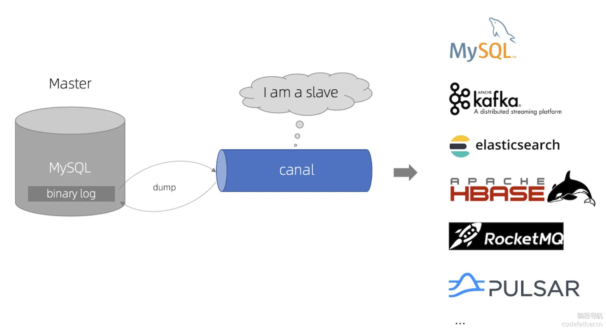

💡 Canal 的核心原理：数据库每次修改时，会修改 binlog 文件，只要监听该文件的修改，就能第一时间得到消息并处理

优点：

- **实时性强**：能够在 MySQL 数据发生变更的第一时间同步到 ES，做到真正的实时同步。
- 轻量级：Binlog 是数据库自带的日志功能，不需要修改核心业务代码，只需要新增监听逻辑。

缺点：

- 引入外部依赖：需要引入像 Canal 这样的中间件，增加了系统的复杂性和维护成本。
- 运维难度增加：需要确保 Canal 或者其他 Binlog 监听器的稳定运行，并且对 MySQL 的 Binlog 配置要求较高。
- 一致性问题：如果 Canal 服务出现问题或暂停，数据可能会滞后或丢失，必须设计补偿机制。

应用场景：

- **实时同步要求高**：适合需要实时数据同步的场景，通常用于高并发、高数据一致性要求的系统。
- **数据频繁变化**：适合数据变更频繁且需要高效增量同步的场景。

最终方案：对于本项目，由于数据量不大，题目更新也不频繁，容忍丢失和不一致，所以选用方案一，实现成本最低。

### 后端开发（ES 实战）

#### 1、Elasticsearch 搭建

目标：安装 Elasticsearch 和 Kibana，能够在 Kibana 查看到 Elasticsearch 存储的数据。

💡 也可以直接使用云 Elasticsearch 服务，省去自主搭建的时间，推荐使用 Serverless 版本，学完关掉就行。

**Elasticsearch 更新迭代非常快，所以安装时，一定要注意慎重选择版本号！**

由于我们自己的项目用的 Spring Boot 2.x 版本，对应的 [Spring Data Elasticsearch](https://spring.io/projects/spring-data-elasticsearch) 客户端版本是 4.x，支持的 Elasticsearch 是 7.x，所以建议 Elasticsearch 使用 7.x 的版本。

鱼皮教程中使用的是 7.17 版本，这是 7.x 系列的最后一个版本，包含了该系列所有的 bug 修复和改进，被广泛认为是最稳定的。

💡 可以在 [官方文档](https://docs.spring.io/spring-data/elasticsearch/reference/elasticsearch/versions.html) 了解到版本兼容情况：比如 Spring 6 才支持 Elasticsearch 8.x

1）安装 Elasticsearch

参考官方文档：https://www.elastic.co/guide/en/elasticsearch/reference/7.17/setup.html

Windows 解压安装：https://www.elastic.co/guide/en/elasticsearch/reference/7.17/zip-windows.html

其他操作系统安装：https://www.elastic.co/guide/en/elasticsearch/reference/7.17/targz.html

如果官网下不动，可以用鱼皮已经下载好的：https://pan.baidu.com/s/1u73-Nlolrs8Rzb1_b6X6HA ，提取码：c2sd

**注意，安装路径不要包含中文！**

安装完成后进入 es 目录并执行启动命令：

```plain
.\bin\elasticsearch.bat
```

可以用 CURL 测试是否启动成功：

```shell
curl -X GET "localhost:9200/?pretty"
```

正常输出如图：

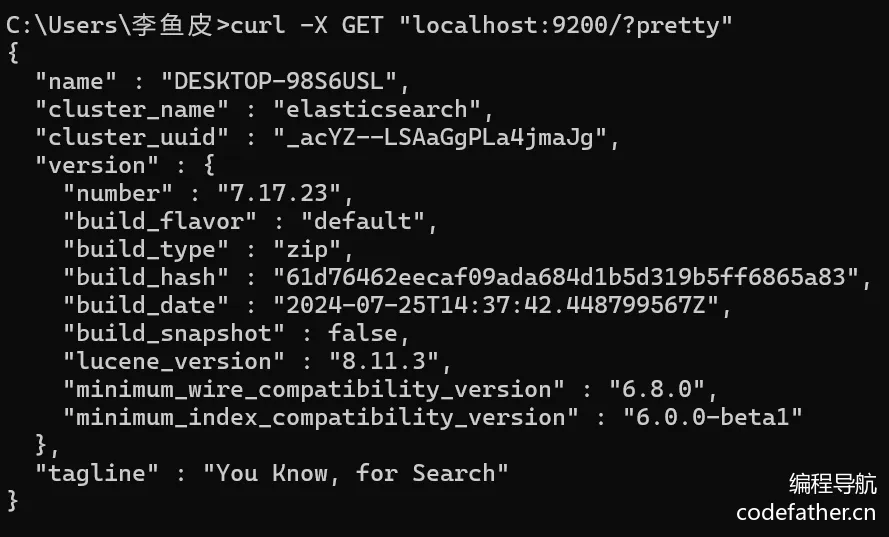

在 Windows 系统上，你还可以选择是否安装为服务，方便启动和管理。

```plain
.\bin\elasticsearch-service.bat

Usage: elasticsearch-service.bat install|remove|start|stop|manager [SERVICE_ID]
```

2）安装 Kibana

**注意，只要是同一套技术，所有版本必须一致！此处都用 7.17 版本！**

参考官方文档：https://www.elastic.co/guide/en/kibana/7.17/introduction.html

安装 Kibana：https://www.elastic.co/guide/en/kibana/7.17/install.html

安装完成后进入 kibana 目录并执行启动命令：

```plain
.\bin\kibana.bat
```

正常输出如图：


访问 http://localhost:5601/，即可开始使用。


但 kibana 默认是英文，不变阅读，可以修改 `config/kibana.yml` 中的国际化配置：


然后重启 kibana 即可。

**注意，目前 Kibana 面板没有增加权限校验，所有人都能访问，所以请勿在线上直接部署！**

3）测试

尝试利用 Kibana 的开发工具来操作 Elasticsearch 的数据，比如查询：


验证下分词器的效果，比如使用标准分词器：

```json
POST /_analyze
{
  "analyzer": "standard", 
  "text": "鱼皮是个帅小伙，非常喜欢编程"
}
```

效果如图，英文被识别为了一个词，但中文未被识别：


默认支持的分词器如下：

- standard：标准分词器。
- simple：简单分词器。
- whitespace：按空格分词。
- stop：带停用词的分词器。
- keyword：不分词，将整个字段作为一个词条。
- pattern：基于正则表达式的分词器。
- ngram 和 edge_ngram：n-gram 分词器。

由于这些分词器都不支持中文，所以需要安装 IK 中文分词器，以满足我们的业务需要。

4）安装 IK 中文分词器（ES 插件）

开源地址：https://github.com/medcl/elasticsearch-analysis-ik

直接按照官方指引安装即可，注意下载和我们 Elasticsearch 一致的版本，可以在这里找到各版本的插件包：https://release.infinilabs.com/analysis-ik/stable/

在 ES 安装目录下执行：

```plain
.\bin\elasticsearch-plugin.bat install https://release.infinilabs.com/analysis-ik/stable/elasticsearch-analysis-ik-7.17.23.zip
```

安装成功，需要重启 ES：


IK 分词器插件为我们提供了两个分词器：`ik_smart` 和 `ik_max_word`。

- ik_smart 是智能分词，尽量选择最像一个词的拆分方式，比如“好学生”会被识别为一个词
- ik_max_word 尽可能地分词，可以包括组合词，比如“好学生”会被识别为 3 个词：好学生、好学、学生

测试一下：

```plain
POST /_analyze
{
  "analyzer": "ik_smart", 
  "text": "鱼皮是好学生"
}
```

如图：


这两种分词器如何选用呢？其实可以结合：

- `ik_smart`：适用于 **搜索分词**，即在查询时使用，保证性能的同时提供合理的分词精度。
- `ik_max_word`：适用于 **底层索引分词**，确保在建立索引时尽可能多地分词，提高查询时的匹配度和覆盖面。

下面就来实战下 ES 索引的设计吧~

💡 思考：有些时候 IK 识别词汇不准，比如不认识“程序员鱼皮”，怎么样让 IK 按自己的规则分词？

解决方案：插件支持自定义词典。可以按照 [官方文档](https://github.com/infinilabs/analysis-ik/tree/v7.17.18?tab=readme-ov-file#dictionary-configuration) 配置。

#### 2、设计 ES 索引

为了将 MySQL 题目表数据导入到 Elasticsearch 中并实现分词搜索，需要为 ES 索引定义 `mapping`。ES 的 `mapping` 用于定义字段的类型、分词器及其索引方式。

相当于数据库的建表，数据库建表时我们要考虑索引，同样 Elasticsearch 建立索引时，要考虑到字段选取、分词器、字段格式等问题。

基于我们数据库的表结构和需求，我们可以定义 title、content、answer 等字段使用分词搜索，同时为其他字段指定适当的类型。以下是本项目的 `mapping` 定义：

```json
{
  "mappings": {
    "properties": {
      "title": {
        "type": "text",
        "analyzer": "ik_max_word",
        "search_analyzer": "ik_smart",
        "fields": {
          "keyword": {
            "type": "keyword",
            "ignore_above": 256
          }
        }
      },
      "content": {
        "type": "text",
        "analyzer": "ik_max_word",
        "search_analyzer": "ik_smart"
      },
      "tags": {
        "type": "keyword"
      },
      "answer": {
        "type": "text",
        "analyzer": "ik_max_word",
        "search_analyzer": "ik_smart"
      },
      "userId": {
        "type": "long"
      },
      "editTime": {
        "type": "date",
        "format": "yyyy-MM-dd HH:mm:ss"
      },
      "createTime": {
        "type": "date",
        "format": "yyyy-MM-dd HH:mm:ss"
      },
      "updateTime": {
        "type": "date",
        "format": "yyyy-MM-dd HH:mm:ss"
      },
      "isDelete": {
        "type": "keyword"
      }
    }
  }
}
```

**各字段的类型选择和考虑：**

1）title、content、answer：

这些字段被定义为 `text` 类型，适合存储较长的、需要全文搜索的内容。由于会有中文内容，所以使用了 IK 中文分词器进行分词处理，以提高查询的灵活性和匹配度。

- `analyzer: ik_max_word`：用于索引时进行最大粒度的分词，生成较多词语，适合在查询时提高召回率。
- `search_analyzer: ik_smart`：用于搜索时进行较智能的分词，生成较少的词语，通常用于提高搜索精度。

2）title.keyword：为 `title` 字段增加了一个子字段 `keyword`，用于存储未分词的标题，支持精确匹配。它还配置了 `ignore_above: 256`，表示如果 title 字段的长度超过 256 个字符，将不会为 keyword 字段进行索引。因为题目的标题一般不会很长，很少会对过长的标题进行精确匹配，所以用这一设置来避免过长文本导致的性能问题。

3）tags：标签通常是预定义的、用于分类或标签筛选的关键字，通常不需要分词。设置为 `keyword` 类型以便支持精确匹配和聚合操作（例如统计某标签的出现频次）。`keyword` 不进行分词，因此适合存储不变的、结构化的数据。

4）userId：用来唯一标识用户的数值字段。在 Elasticsearch 中，数值类型（如 `long`）非常适合用于精确查询、排序和范围过滤。与字符串相比，数值类型的查询和存储效率更高，尤其是对于大量用户数据的查询。

5）editTime、createTime、updateTime：时间字段被定义为 `date` 类型，并指定了格式 `"yyyy-MM-dd HH:mm:ss"`。这样做的好处是 Elasticsearch 可以基于这些字段进行时间范围查询、排序和聚合操作，如按时间过滤或统计某时间段的数据。

6）isDelete：使用 keyword 类型，表示是否被删除。 因为 keyword 是为精确匹配设计的，适用于枚举值精确查询的场景，性能好且清晰。

为什么不用 boolean 类型呢？因为 MySQL 数据库存储的是 0 和 1，写入 ES 时需要转换类型。

**为什么不显示指定 id 字段？**

在 Elasticsearch 中，每个文档都有一个唯一的 `_id` 字段来标识文档，该字段用于文档的主键索引和唯一标识。通常，开发者并不需要显式定义 `id` 字段，因为 Elasticsearch 会自动生成 `_id`，或者在插入数据时，你可以手动指定 `_id`。

由于 `_id` 是 Elasticsearch 内部的系统字段，它默认存在并作为主键使用，因此在 mappings 中通常不需要显式定义。如果你想让某个字段（如 userId 或其他唯一标识）作为 `_id`，可以在插入文档时指定该字段的值作为 `_id`。比如：

```bash
PUT /index/_doc/<custom_id>
{
  "userId": 1001,
  "title": "Example"
}
```

**日期字段为什么要格式化？**

日期字段的格式化（`format: "yyyy-MM-dd HH:mm:ss"`）有以下几个考虑：

1. 一致性：定义日期字段的格式可以确保所有插入的日期数据都是一致的，避免因不同的日期格式导致解析错误。例如，Elasticsearch 默认可以支持多种日期格式，但如果不定义明确的格式，可能会导致不一致的日期解析。
2. 优化查询：格式化日期后，Elasticsearch 知道该如何存储和索引这些时间数据，从而可以高效地执行基于日期的范围查询、过滤和排序操作。明确的格式定义还可以帮助 Elasticsearch 进行更优化的存储和压缩。
3. 避免歧义：没有明确格式的日期可能导致歧义，比如 `"2023-09-03"` 是日期，还是年份？加上时间部分（如 `"yyyy-MM-dd HH:mm:ss"`）可以更明确地表明时间的精度，便于进行更精确的查询。

**tags 支持数组么？为什么**

在 Elasticsearch 中，所有的字段类型（包括 `keyword` 和 `text`）默认都支持数组。你可以直接插入一个包含多个值的数组，Elasticsearch 会自动将其视为多个值的集合。例如，以下文档中，tags 字段是一个数组：

```json
{
  "title": "How to learn Elasticsearch",
  "tags": ["Elasticsearch", "Search", "Database"]
}
```

在查询时，Elasticsearch 会将数组中的每个值视为独立的 `keyword`，可以进行精确匹配。

#### 3、新建 ES 索引

可以通过如下命令创建索引，在 Kibana 开发者工具中执行、或者用 CURL 调用 Elasticsearch 执行均可：

```bash
PUT /question_v1
{
  "mappings": {
    "properties": {
      ...
    }
  }
}
```

但是有一点要注意，推荐在创建索引时添加 alias（别名） ，因为它提供了灵活性和简化索引管理的能力。具体原因如下：

1. 零停机切换索引：在更新索引或重新索引数据时，你可以创建一个新索引并使用 alias 切换到新索引，而不需要修改客户端查询代码，避免停机或中断服务。
2. 简化查询：通过 alias，可以使用一个统一的名称进行查询，而不需要记住具体的索引名称（尤其当索引有版本号或时间戳时）。
3. 索引分组：alias 可以指向多个索引，方便对多个索引进行联合查询，例如用于跨时间段的日志查询或数据归档。

其中，第一个是重点，举个例子，在创建索引时添加 alias：

```json
PUT /my_index_v1
{
  "aliases": {
    "my_index": {}
  }
}
```

这个 alias 可以在后续版本中指向新的索引（如 my_index_v2），无需更改查询逻辑，查询时仍然使用 my_index。

所以，我们要执行的完整命令如下，可以放到后端项目目录中进行备份：

```json
PUT /question_v1
{
  "aliases": {
    "question": {}
  },
  "mappings": {
    "properties": {
      "title": {
        "type": "text",
        "analyzer": "ik_max_word",
        "search_analyzer": "ik_smart",
        "fields": {
          "keyword": {
            "type": "keyword",
            "ignore_above": 256
          }
        }
      },
      "content": {
        "type": "text",
        "analyzer": "ik_max_word",
        "search_analyzer": "ik_smart"
      },
      "tags": {
        "type": "keyword"
      },
      "answer": {
        "type": "text",
        "analyzer": "ik_max_word",
        "search_analyzer": "ik_smart"
      },
      "userId": {
        "type": "long"
      },
      "editTime": {
        "type": "date",
        "format": "yyyy-MM-dd HH:mm:ss"
      },
      "createTime": {
        "type": "date",
        "format": "yyyy-MM-dd HH:mm:ss"
      },
      "updateTime": {
        "type": "date",
        "format": "yyyy-MM-dd HH:mm:ss"
      },
      "isDelete": {
        "type": "keyword"
      }
    }
  }
}
```

创建索引成功：

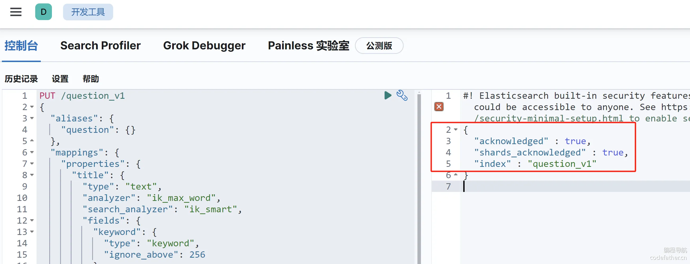

#### 4、引入 ES 客户端

在 Spring Boot 项目中，可以通过 Starter 快速引入 Elasticsearch，非常方便：

1）在 pom.xml 中引入：

```xml
<!-- elasticsearch-->
<dependency>
    <groupId>org.springframework.boot</groupId>
    <artifactId>spring-boot-starter-data-elasticsearch</artifactId>
</dependency>
```

2）修改项目 yml 配置：

```yaml
spring:
  elasticsearch:
    uris: http://xxx:9200
    username: elastic
    password: coder_yupi_swag
```

3）使用 Spring Data Elasticsearch 提供的 Bean 即可操作 Elasticsearch，可以直接通过 @Resource 注解引入：

```java
@Resource
private ElasticsearchRestTemplate elasticsearchRestTemplate;
```

4）编写一个单元测试文件，验证对于 Elasticsearch 的增删改查基本操作。像鱼皮是使用了 AI 工具来自动生成了单元测试文件：

```java
package com.yupi.mianshiya.es;

import org.junit.jupiter.api.Test;
import org.springframework.beans.factory.annotation.Autowired;
import org.springframework.boot.test.context.SpringBootTest;
import org.springframework.data.elasticsearch.core.ElasticsearchRestTemplate;
import org.springframework.data.elasticsearch.core.IndexOperations;
import org.springframework.data.elasticsearch.core.document.Document;
import org.springframework.data.elasticsearch.core.query.*;
import org.springframework.data.elasticsearch.core.mapping.IndexCoordinates;

import java.util.HashMap;
import java.util.Map;

import static org.assertj.core.api.Assertions.assertThat;

@SpringBootTest
public class ElasticsearchRestTemplateTest {

    @Autowired
    private ElasticsearchRestTemplate elasticsearchRestTemplate;

    private final String INDEX_NAME = "test_index";

    // Index (Create) a document
    @Test
    public void indexDocument() {
        Map<String, Object> doc = new HashMap<>();
        doc.put("title", "Elasticsearch Introduction");
        doc.put("content", "Learn Elasticsearch basics and advanced usage.");
        doc.put("tags", "elasticsearch,search");
        doc.put("answer", "Yes");
        doc.put("userId", 1L);
        doc.put("editTime", "2023-09-01 10:00:00");
        doc.put("createTime", "2023-09-01 09:00:00");
        doc.put("updateTime", "2023-09-01 09:10:00");
        doc.put("isDelete", false);

        IndexQuery indexQuery = new IndexQueryBuilder().withId("1").withObject(doc).build();
        String documentId = elasticsearchRestTemplate.index(indexQuery, IndexCoordinates.of(INDEX_NAME));

        assertThat(documentId).isNotNull();
    }

    // Get (Retrieve) a document by ID
    @Test
    public void getDocument() {
        String documentId = "1";  // Replace with the actual ID of an indexed document

        Map<String, Object> document = elasticsearchRestTemplate.get(documentId, Map.class, IndexCoordinates.of(INDEX_NAME));

        assertThat(document).isNotNull();
        assertThat(document.get("title")).isEqualTo("Elasticsearch Introduction");
    }

    // Update a document
    @Test
    public void updateDocument() {
        String documentId = "1";  // Replace with the actual ID of an indexed document

        Map<String, Object> updates = new HashMap<>();
        updates.put("title", "Updated Elasticsearch Title");
        updates.put("updateTime", "2023-09-01 10:30:00");

        UpdateQuery updateQuery = UpdateQuery.builder(documentId)
                .withDocument(Document.from(updates))
                .build();

        elasticsearchRestTemplate.update(updateQuery, IndexCoordinates.of(INDEX_NAME));

        Map<String, Object> updatedDocument = elasticsearchRestTemplate.get(documentId, Map.class, IndexCoordinates.of(INDEX_NAME));
        assertThat(updatedDocument.get("title")).isEqualTo("Updated Elasticsearch Title");
    }

    // Delete a document
    @Test
    public void deleteDocument() {
        String documentId = "1";  // Replace with the actual ID of an indexed document

        String result = elasticsearchRestTemplate.delete(documentId, IndexCoordinates.of(INDEX_NAME));
        assertThat(result).isNotNull();
    }

    // Delete the entire index
    @Test
    public void deleteIndex() {
        IndexOperations indexOps = elasticsearchRestTemplate.indexOps(IndexCoordinates.of(INDEX_NAME));
        boolean deleted = indexOps.delete();
        assertThat(deleted).isTrue();
    }
}
```

由于单元测试的执行顺序问题，批量执行时，可能会有部分报错，是正常现象，也可以一个一个手动执行测试。


可以使用 Kibana 开发者工具来查看数据情况：


几个注意事项：

1. 当你向一个不存在的索引中插入数据时，Elasticsearch 会根据文档内容自动推断字段类型，并为这些字段创建映射。这就是 ES 的 **动态映射**（Dynamic Mapping）功能。然而，这种自动生成的映射有一些局限性，可能导致字段类型不够规范。
2. ES 中，_开头的字段表示系统默认字段，比如 _id，如果系统不指定，会自动生成。但是不会在 _source 字段中补充 id 的值，所以建议大家手动指定，让数据更完整。
3. ES 插入和更新数据没有 MySQL 那么严格，尤其是在动态 Mapping 模式下，只要指定了相同的文档 id，ES 允许动态添加字段和更新文档。

------

通过这个单元测试，我们也能基本了解 Spring Data Elasticsearch 操作 ES 的方法：

1. 构造一个 Query 对象，比如插入数据使用 IndexQuery，更新数据使用 UpdateQuery
2. 调用 elasticsearchRestTemplate 的增删改查方法，传入 Query 对象和要操作的索引作为参数
3. 对返回值进行处理

示例代码如下：

```java
Map<String, Object> updates = new HashMap<>();
updates.put("title", "Updated Elasticsearch Title");
updates.put("updateTime", "2023-09-01 10:30:00");

UpdateQuery updateQuery = UpdateQuery.builder(documentId)
        .withDocument(Document.from(updates))
        .build();

elasticsearchRestTemplate.update(updateQuery, IndexCoordinates.of(INDEX_NAME));

Map<String, Object> updatedDocument = elasticsearchRestTemplate.get(documentId, Map.class, IndexCoordinates.of(INDEX_NAME));
```

但是有个问题，我们上述代码都是用 Map 来传递数据。记得之前使用 MyBatis 操作数据库的时候，都要定义一个数据库实体类，然后把参数传给这个实体类的对象就可以了，会更方便和规范。

没错，Spring Data Elasticsearch 也是支持这种标准 Dao 层开发方式的，下面就来使用一下。

#### 5、编写 ES Dao 层

1）在 `model.dto.question` 包中定义和 ES 对应的实体类：

```java
@Document(indexName = "question")
@Data
public class QuestionEsDTO implements Serializable {

    private static final String DATE_TIME_PATTERN = "yyyy-MM-dd HH:mm:ss";

    /**
     * id
     */
    @Id
    private Long id;

    /**
     * 标题
     */
    private String title;

    /**
     * 内容
     */
    private String content;

    /**
     * 答案
     */
    private String answer;

    /**
     * 标签列表
     */
    private List<String> tags;

    /**
     * 创建用户 id
     */
    private Long userId;

    /**
     * 创建时间
     */
    @Field(type = FieldType.Date, format = {}, pattern = DATE_TIME_PATTERN)
    private Date createTime;

    /**
     * 更新时间
     */
    @Field(type = FieldType.Date, format = {}, pattern = DATE_TIME_PATTERN)
    private Date updateTime;

    /**
     * 是否删除
     */
    private Integer isDelete;

    private static final long serialVersionUID = 1L;

    /**
     * 对象转包装类
     *
     * @param question
     * @return
     */
    public static QuestionEsDTO objToDto(Question question) {
        if (question == null) {
            return null;
        }
        QuestionEsDTO questionEsDTO = new QuestionEsDTO();
        BeanUtils.copyProperties(question, questionEsDTO);
        String tagsStr = question.getTags();
        if (StringUtils.isNotBlank(tagsStr)) {
            questionEsDTO.setTags(JSONUtil.toList(tagsStr, String.class));
        }
        return questionEsDTO;
    }

    /**
     * 包装类转对象
     *
     * @param questionEsDTO
     * @return
     */
    public static Question dtoToObj(QuestionEsDTO questionEsDTO) {
        if (questionEsDTO == null) {
            return null;
        }
        Question question = new Question();
        BeanUtils.copyProperties(questionEsDTO, question);
        List<String> tagList = questionEsDTO.getTags();
        if (CollUtil.isNotEmpty(tagList)) {
            question.setTags(JSONUtil.toJsonStr(tagList));
        }
        return question;
    }
}
```

2）定义 Dao 层

可以在 esdao 包中统一存放对 Elasticsearch 的操作，只需要继承 ElasticsearchRepository 类即可。

代码如下：

```java
/**
 * 题目 ES 操作
 */
public interface QuestionEsDao 
    extends ElasticsearchRepository<QuestionEsDTO, Long> {

}
```

ElasticsearchRepository 类为我们提供了大量现成的 CRUD 操作：

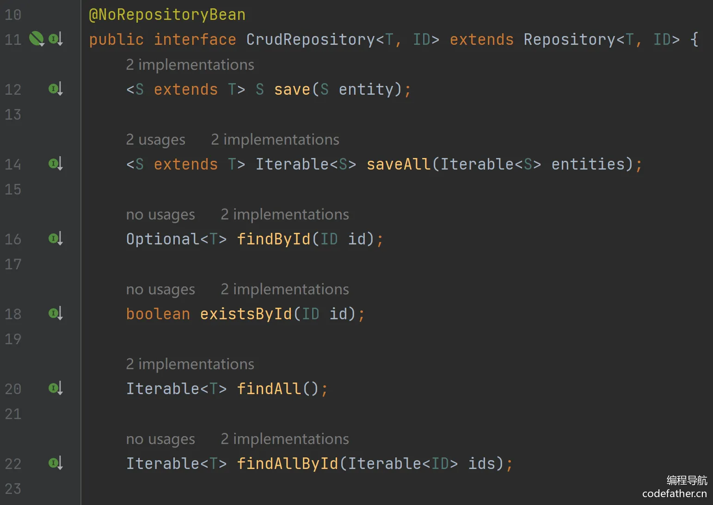

而且还支持根据方法名自动映射为查询操作，比如在 QuestionEsDao 中定义下列方法，就会自动根据 userId 查询数据。

```java
/**
 * 根据用户 id 查询
 * @param userId
 * @return
 */
List<QuestionEsDTO> findByUserId(Long userId);
```

可以编写一个单元测试来验证：

```java
@SpringBootTest
class QuestionEsDaoTest {

    @Resource
    private QuestionEsDao questionEsDao;

    @Test
    void findByUserId() {
        questionEsDao.findByUserId(1L);
    }
}
```

具体的方法名和查询条件的映射规则见 [官方文档](https://docs.spring.io/spring-data/elasticsearch/docs/4.4.2/reference/html/#repositories)。

------

目前我们学到了 2 种 Spring Data Elasticsearch 的使用方法，应该如何选择呢？

- 第 1 种方式：Spring 默认给我们提供的操作 es 的客户端对象 ElasticsearchRestTemplate，也提供了增删改查，它的增删改查更灵活，**适用于更复杂的操作**，返回结果更完整，但需要自己解析。
- 第 2 种方式：ElasticsearchRepository<Entity, IdType>，默认提供了更简单易用的增删改查，返回结果也更直接。**适用于可预期的、相对简单的操作** 。

#### 6、向 ES 全量写入数据

可以通过编写单次执行的任务，将 MySQL 中题目表的数据，全量写入到 Elasticsearch。

可以通过实现 CommandLineRunner 接口定义单次任务，也可以编写一个仅管理员可用的接口，根据需要选择就好。

在 `job/once` 目录下编写任务：

```java
// todo 取消注释开启任务
@Component
@Slf4j
public class FullSyncQuestionToEs implements CommandLineRunner {

    @Resource
    private QuestionService questionService;

    @Resource
    private QuestionEsDao questionEsDao;

    @Override
    public void run(String... args) {
        // 全量获取题目（数据量不大的情况下使用）
        List<Question> questionList = questionService.list();
        if (CollUtil.isEmpty(questionList)) {
            return;
        }
        // 转为 ES 实体类
        List<QuestionEsDTO> questionEsDTOList = questionList.stream()
                .map(QuestionEsDTO::objToDto)
                .collect(Collectors.toList());
        // 分页批量插入到 ES
        final int pageSize = 500;
        int total = questionEsDTOList.size();
        log.info("FullSyncQuestionToEs start, total {}", total);
        for (int i = 0; i < total; i += pageSize) {
            // 注意同步的数据下标不能超过总数据量
            int end = Math.min(i + pageSize, total);
            log.info("sync from {} to {}", i, end);
            questionEsDao.saveAll(questionEsDTOList.subList(i, end));
        }
        log.info("FullSyncQuestionToEs end, total {}", total);
    }
}
```

启动项目，然后用 Kibana 开发工具查看所有数据，发现写入成功：


#### 7、开发 ES 搜索

1）QuestionService 新增查询接口：

```java
/**
 * 从 ES 查询题目
 *
 * @param questionQueryRequest
 * @return
 */
Page<Question> searchFromEs(QuestionQueryRequest questionQueryRequest);
```

2）编写实现方法

由于查询逻辑较为复杂，为了保证灵活性，选用 ElasticsearchRestTemplate 开发。

需要支持现有的题目查询条件，搜索方法代码如下：

```java
@Override
public Page<Question> searchFromEs(QuestionQueryRequest questionQueryRequest) {
    // 获取参数
    Long id = questionQueryRequest.getId();
    Long notId = questionQueryRequest.getNotId();
    String searchText = questionQueryRequest.getSearchText();
    List<String> tags = questionQueryRequest.getTags();
    Long questionBankId = questionQueryRequest.getQuestionBankId();
    Long userId = questionQueryRequest.getUserId();
    // 注意，ES 的起始页为 0
    int current = questionQueryRequest.getCurrent() - 1;
    int pageSize = questionQueryRequest.getPageSize();
    String sortField = questionQueryRequest.getSortField();
    String sortOrder = questionQueryRequest.getSortOrder();

    // 构造查询条件
    BoolQueryBuilder boolQueryBuilder = QueryBuilders.boolQuery();
    // 过滤
    boolQueryBuilder.filter(QueryBuilders.termQuery("isDelete", 0));
    if (id != null) {
        boolQueryBuilder.filter(QueryBuilders.termQuery("id", id));
    }
    if (notId != null) {
        boolQueryBuilder.mustNot(QueryBuilders.termQuery("id", notId));
    }
    if (userId != null) {
        boolQueryBuilder.filter(QueryBuilders.termQuery("userId", userId));
    }
    if (questionBankId != null) {
        boolQueryBuilder.filter(QueryBuilders.termQuery("questionBankId", questionBankId));
    }
    // 必须包含所有标签
    if (CollUtil.isNotEmpty(tags)) {
        for (String tag : tags) {
            boolQueryBuilder.filter(QueryBuilders.termQuery("tags", tag));
        }
    }
    // 按关键词检索
    if (StringUtils.isNotBlank(searchText)) {
        boolQueryBuilder.should(QueryBuilders.matchQuery("title", searchText));
        boolQueryBuilder.should(QueryBuilders.matchQuery("content", searchText));
        boolQueryBuilder.should(QueryBuilders.matchQuery("answer", searchText));
        boolQueryBuilder.minimumShouldMatch(1);
    }
    // 排序
    SortBuilder<?> sortBuilder = SortBuilders.scoreSort();
    if (StringUtils.isNotBlank(sortField)) {
        sortBuilder = SortBuilders.fieldSort(sortField);
        sortBuilder.order(CommonConstant.SORT_ORDER_ASC.equals(sortOrder) ? SortOrder.ASC : SortOrder.DESC);
    }
    // 分页
    PageRequest pageRequest = PageRequest.of(current, pageSize);
    // 构造查询
    NativeSearchQuery searchQuery = new NativeSearchQueryBuilder()
            .withQuery(boolQueryBuilder)
            .withPageable(pageRequest)
            .withSorts(sortBuilder)
            .build();
    SearchHits<QuestionEsDTO> searchHits = elasticsearchRestTemplate.search(searchQuery, QuestionEsDTO.class);
    // 复用 MySQL 的分页对象，封装返回结果
    Page<Question> page = new Page<>();
    page.setTotal(searchHits.getTotalHits());
    List<Question> resourceList = new ArrayList<>();
    if (searchHits.hasSearchHits()) {
        List<SearchHit<QuestionEsDTO>> searchHitList = searchHits.getSearchHits();
        for (SearchHit<QuestionEsDTO> questionEsDTOSearchHit : searchHitList) {
            resourceList.add(QuestionEsDTO.dtoToObj(questionEsDTOSearchHit.getContent()));
        }
    }
    page.setRecords(resourceList);
    return page;
}
```

虽然看上去复杂，但不涉及什么逻辑，根据查询需求选择合适的搜索方法，不断构造搜索条件即可。

3）在 QuestionController 编写新的搜索接口：

```java
@PostMapping("/search/page/vo")
public BaseResponse<Page<QuestionVO>> searchQuestionVOByPage(@RequestBody QuestionQueryRequest questionQueryRequest,
                                                     HttpServletRequest request) {
    long size = questionQueryRequest.getPageSize();
    // 限制爬虫
    ThrowUtils.throwIf(size > 200, ErrorCode.PARAMS_ERROR);
    Page<Question> questionPage = questionService.searchFromEs(questionQueryRequest);
    return ResultUtils.success(questionService.getQuestionVOPage(questionPage, request));
}
```

4）然后可以通过 Swagger 接口文档进行测试。

#### 8、数据同步

根据之前的方案设计，通过定时任务进行增量同步，每分钟同步过去 5 分钟内数据库发生修改的题目数据。

注意，如果使用 MyBatis Plus 提供的 mapper 方法，查询时会默认过滤掉 isDelete = 1（逻辑已删除）的数据，而我们的需求是让 ES 和 MySQL 完全同步，所以需要在 QuestionMapper 中编写一个能查询出 isDelete = 1 数据的方法。

1）编写查询某个时间后更新的所有题目的方法：

```java
public interface QuestionMapper extends BaseMapper<Question> {

    /**
     * 查询题目列表（包括已被删除的数据）
     */
    @Select("select * from question where updateTime >= #{minUpdateTime}")
    List<Question> listQuestionWithDelete(Date minUpdateTime);
}
```

2）在 `job/cycle` 下编写增量同步到 ES 的定时任务：

```java
// todo 取消注释开启任务
//@Component
@Slf4j
public class IncSyncQuestionToEs {

    @Resource
    private QuestionMapper questionMapper;

    @Resource
    private QuestionEsDao questionEsDao;

    /**
     * 每分钟执行一次
     */
    @Scheduled(fixedRate = 60 * 1000)
    public void run() {
        // 查询近 5 分钟内的数据
        long FIVE_MINUTES = 5 * 60 * 1000L;
        Date fiveMinutesAgoDate = new Date(new Date().getTime() - FIVE_MINUTES);
        List<Question> questionList = questionMapper.listQuestionWithDelete(fiveMinutesAgoDate);
        if (CollUtil.isEmpty(questionList)) {
            log.info("no inc question");
            return;
        }
        List<QuestionEsDTO> questionEsDTOList = questionList.stream()
                .map(QuestionEsDTO::objToDto)
                .collect(Collectors.toList());
        final int pageSize = 500;
        int total = questionEsDTOList.size();
        log.info("IncSyncQuestionToEs start, total {}", total);
        for (int i = 0; i < total; i += pageSize) {
            int end = Math.min(i + pageSize, total);
            log.info("sync from {} to {}", i, end);
            questionEsDao.saveAll(questionEsDTOList.subList(i, end));
        }
        log.info("IncSyncQuestionToEs end, total {}", total);
    }
}
```

3）尝试修改部分数据，通过日志查看定时任务同步是否生效：


### 前端开发

由于新增了接口，需要调用 OpenAPI 重新生成请求代码。

修改题目列表页（questions）和题目表格组件（QuestionTable）请求的接口为新增的搜索接口：

```tsx
const res = await searchQuestionVoByPageUsingPost({
  searchText,
  pageSize: 12,
  sortField: "createTime",
  sortOrder: "descend",
});
```

还要修改题目表格的列配置，搜索框的字段索引改为使用 searchText 而不是 title：

```tsx
{
  title: "搜索",
  dataIndex: "searchText",
  valueType: "text",
  hideInTable: true,
},
{
  title: "标题",
  dataIndex: "title",
  valueType: "text",
  hideInSearch: true,
  render: (_, record) => {
    return <Link href={`/question/${record.id}`}>{record.title}</Link>;
  },
},
```

### 测试

验证分词效果：

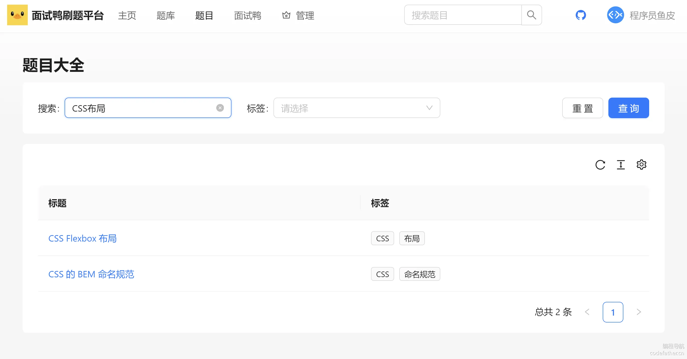

Elasticsearch 支持按照分数（_score）排序，直接修改 sortField 传递的值即可。

### 扩展

#### 1、根据业务自定义 ES 词典，提高分词准确度

思路：可以参考 IK 分词插件的官方文档：https://github.com/infinilabs/analysis-ik/tree/v7.17.18?tab=readme-ov-file#dictionary-configuration

#### 2、使用 ES 查询时，关联获取题目的动态数据

思路：先查 ES，再从 DB 查询其他的数据

#### 3、ES 接口支持降级

需求：ES 挂了、或者未搭建 ES 环境时，照样能把项目跑起来。

思路：ES 如果查询报错，改为调用数据库查询；还可以根据 ES 客户端是否正确初始化来判断是否应该使用 ES。

#### 4、防止重复执行定时任务

可以自定义实现一个分布式锁注解，以下仅供参考：

1）创建一个自定义注解 @DistributedLock

```java
@Target(ElementType.METHOD)
@Retention(RetentionPolicy.RUNTIME)
public @interface DistributedLock {

    /**
     * 锁的名称
     */
    String key();

    /**
     * 持锁时间，默认30秒
     */
    long leaseTime() default 30000;

    /**
     * 等待时间，默认10秒
     */
    long waitTime() default 10000;

    /**
     * 时间单位，默认为毫秒
     */
    TimeUnit timeUnit() default java.util.concurrent.TimeUnit.MILLISECONDS;
}
```

2）创建一个切面类，用来处理 @DistributedLock 注解

```java
@Aspect
@Component
public class DistributedLockAspect {

    @Resource
    private RedissonClient redissonClient;

    @Around("@annotation(distributedLock)")
    public Object around(ProceedingJoinPoint joinPoint, DistributedLock distributedLock) throws Exception {
        String lockKey = distributedLock.key();
        long waitTime = distributedLock.waitTime();
        long leaseTime = distributedLock.leaseTime();
        TimeUnit timeUnit = distributedLock.timeUnit();

        RLock lock = redissonClient.getLock(lockKey);

        boolean acquired = false;
        try {
            // 尝试获取锁
            acquired = lock.tryLock(waitTime, leaseTime, timeUnit);
            if (acquired) {
                // 获取锁成功，执行目标方法
                return joinPoint.proceed();
            } else {
                // 获取锁失败，抛出异常或处理逻辑
                throw new RuntimeException("Could not acquire lock: " + lockKey);
            }
        } catch (Throwable e) {
            throw new Exception(e);
        } finally {
            if (acquired) {
                // 释放锁
                lock.unlock();
            }
        }
    }
}
```

3）在需要加锁的方法上使用 @DistributedLock 注解即可，例如：

```java
@Override
@DistributedLock(key = "testLock", leaseTime = 20000, waitTime = 5000)
public void testLock() throws InterruptedException {
    System.out.println("print print");
    Thread.sleep(5000L);
}
```