##  1. ElasticSearch概述


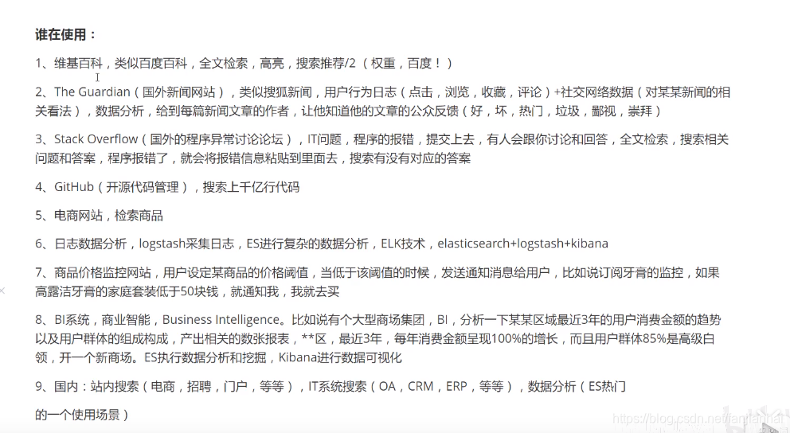

## 2. ES与Solr的差别

### 2.1. Solr简介

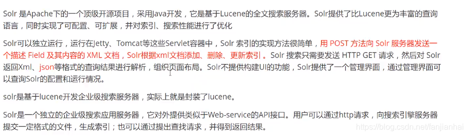

### 2.2. Lucene简介

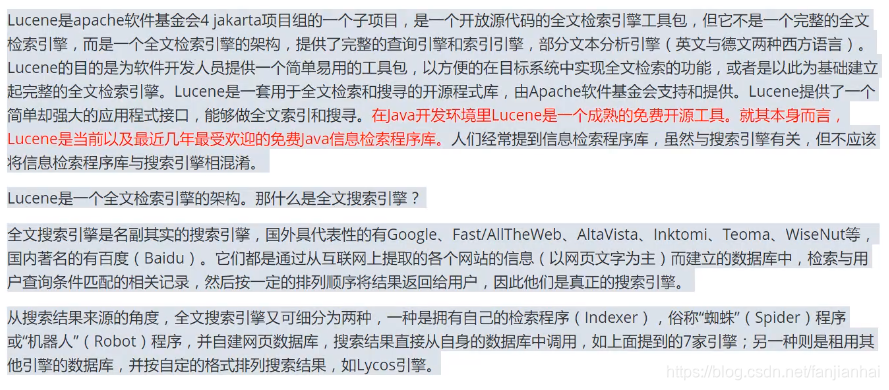

### 2.3. ES VS Solr

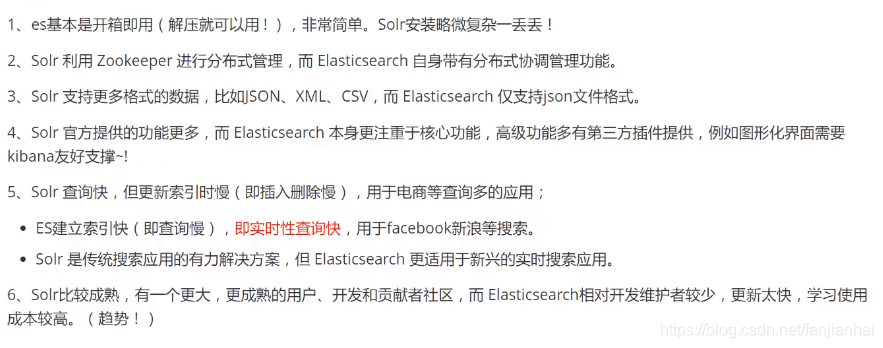

## 3. ElasticSearch 安装

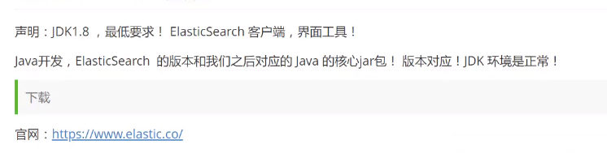

logstash: https://mirrors.huaweicloud.com/logstash/?C=N&O=D 

kibana: https://mirrors.huaweicloud.com/kibana/?C=N&O=D

- 认识目录


启动elasticsearch:

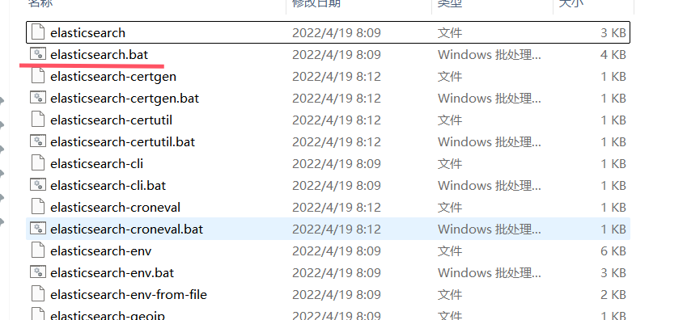

>启动时出现错误：
>
>[[2024-09-19T13:57:31,679 ]][ERROR][o.e.i.g.GeoIpDownloader ] [BALDBODY] error updating geoip database [GeoLite2-ASN.mmdb]
>java.net.SocketTimeoutException: Read timed out
>at java.net.SocketInputStream.socketRead0(Native Method) ~[?:?]
>
>​		...
>
>解决方法：
>
>修改config目录下的elasticsearch.yml文件
>
>添加配置：
>
>```yaml
>ingest.geoip.downloader.enabled: false
>```

启动成功界面：9200是公网端口， 9300是通信端口

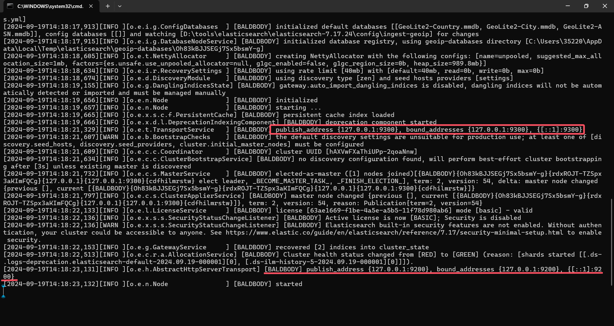

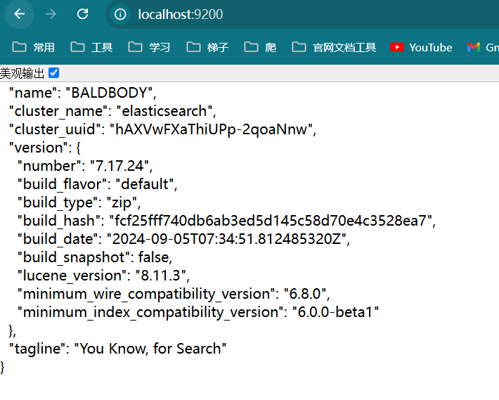

### es head安装


上图第3步配置es时，在config/elasticsearch.yml目录下添加配置

添加配置后启动成功：

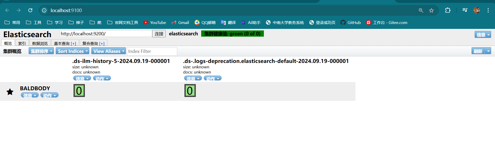

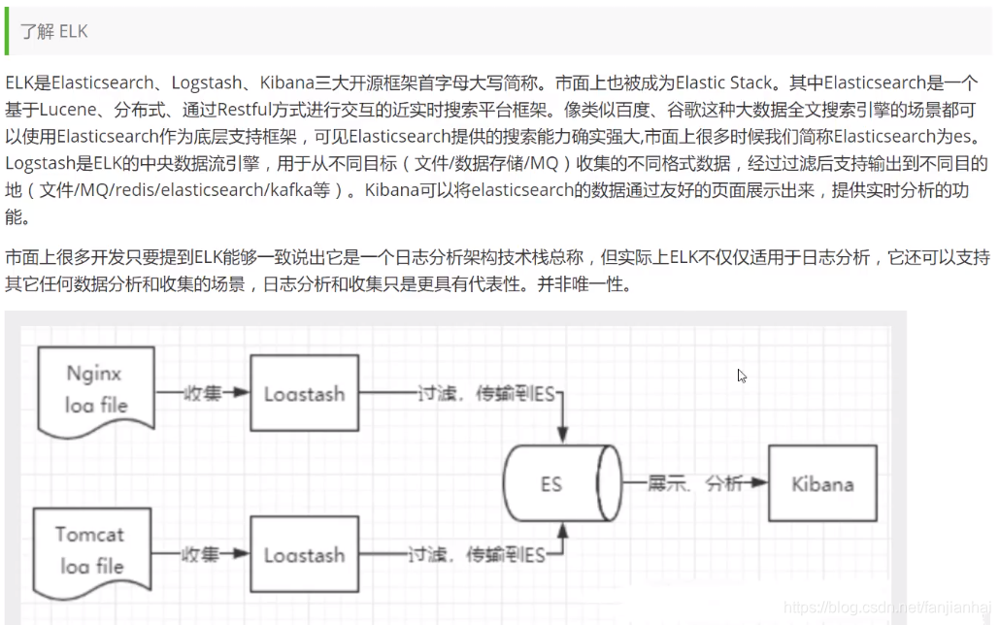

## 4. Kibana安装


kaban版本要和elasticsearch版本相对应。

下载解压后，运行bin目录下的kabana.bat来启动kabana

启动成功后，可以根据启动信息发现kabana运行在5601端口：

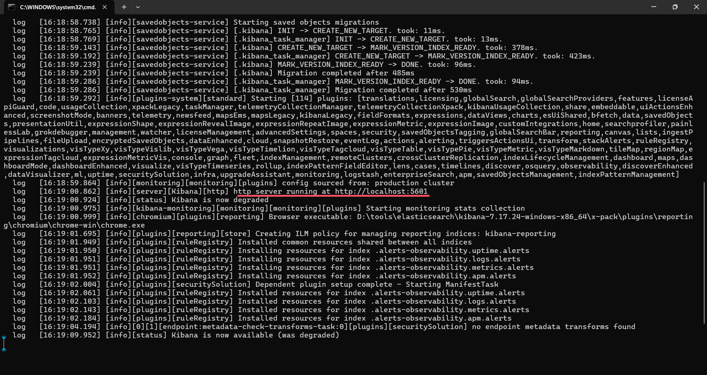


访问测试


将kabana改为中文

在config/kanaba.yml中加上下面的配置

> i18n.locale:"zh-CN"

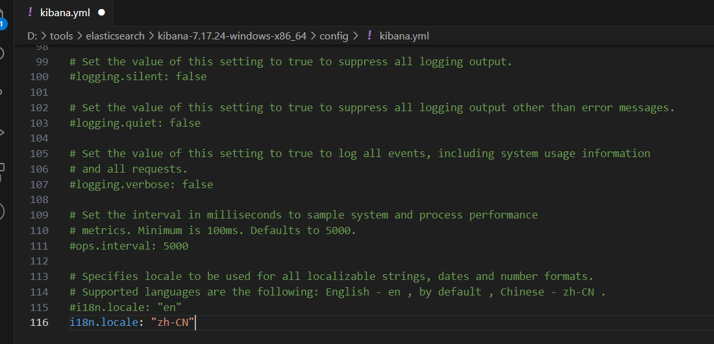

中英文词汇对应文件地址:

> x-pack\plugins\translations\translations\zh-CN.json

## 5. ES核心概念

- 索引
- 字段类型（mapping）
- 文档（document）

> elasticsearch是面向文档。

关系型数据库和elasticsraech的客观对比

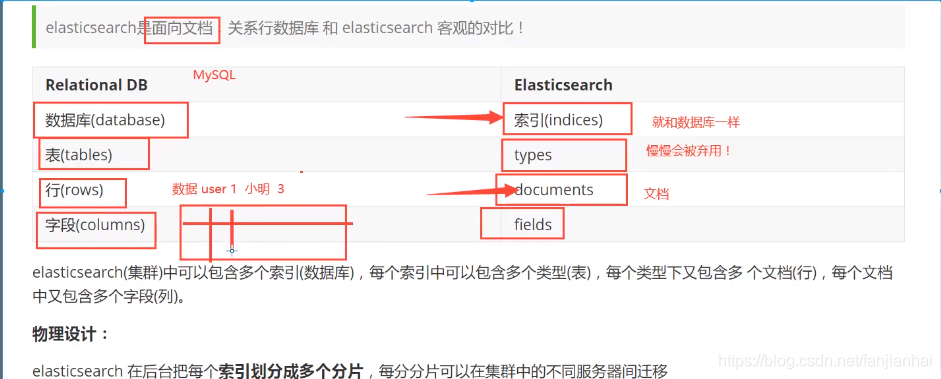

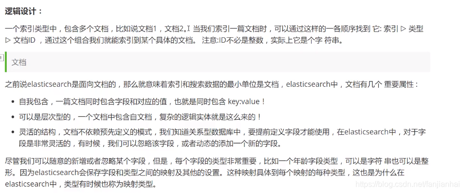

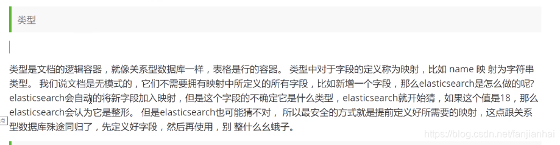


在上图中，p0 p1 p2 p3 p4是主分片，r0 r1 r2 r3 r4是副本（复制分片）

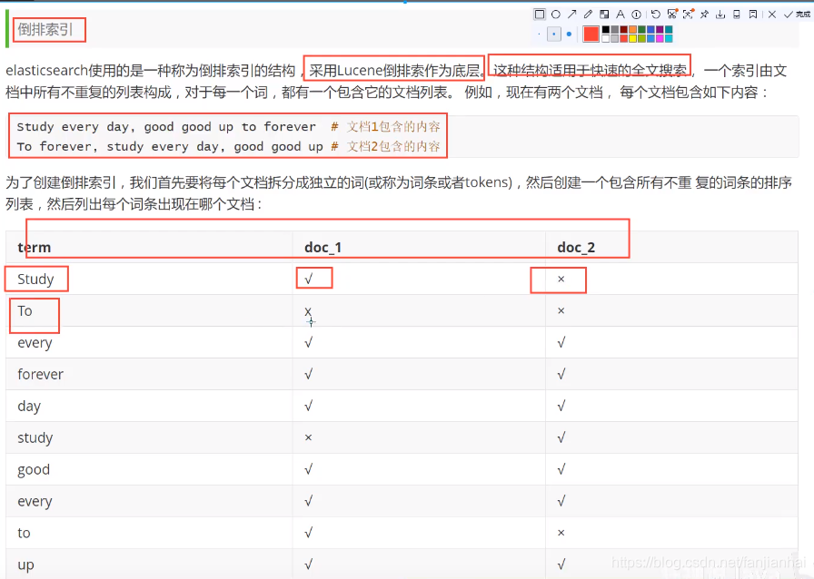

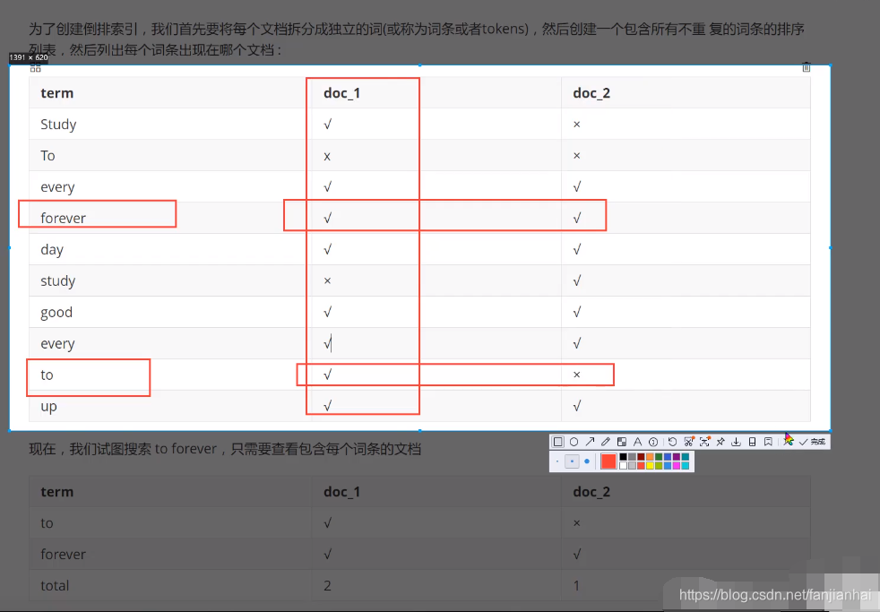


## 6. IK分词器

- [github地址](https://github.com/infinilabs/analysis-ik) 
- [下载方式](https://release.infinilabs.com/)（注意ik分词器版本和elasticsearch版本一致）：


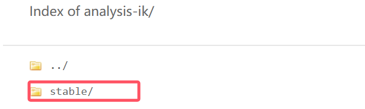


- 在es的plugins目录下新建一个文件夹。将解压后的分词器放在新建的文件夹下

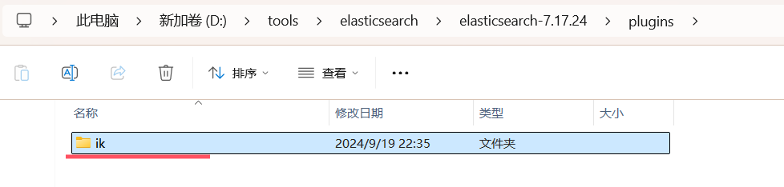


- 重启观察ES，发现ik插件被加载了

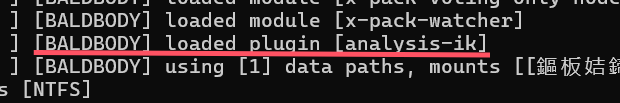

- 也可以在控制台切换到bin目录下，使用`elasticsearch-plugin list` 查看已经加载的插件


- 使用kibana测试

  - ik_smart: 最少切分

  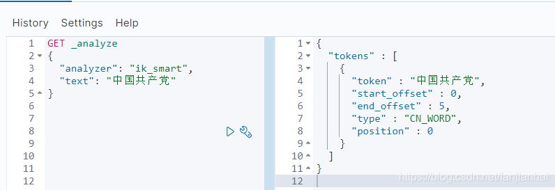

  - ik_max_word为最细粒度划分！穷尽词库的可能， 字典！

  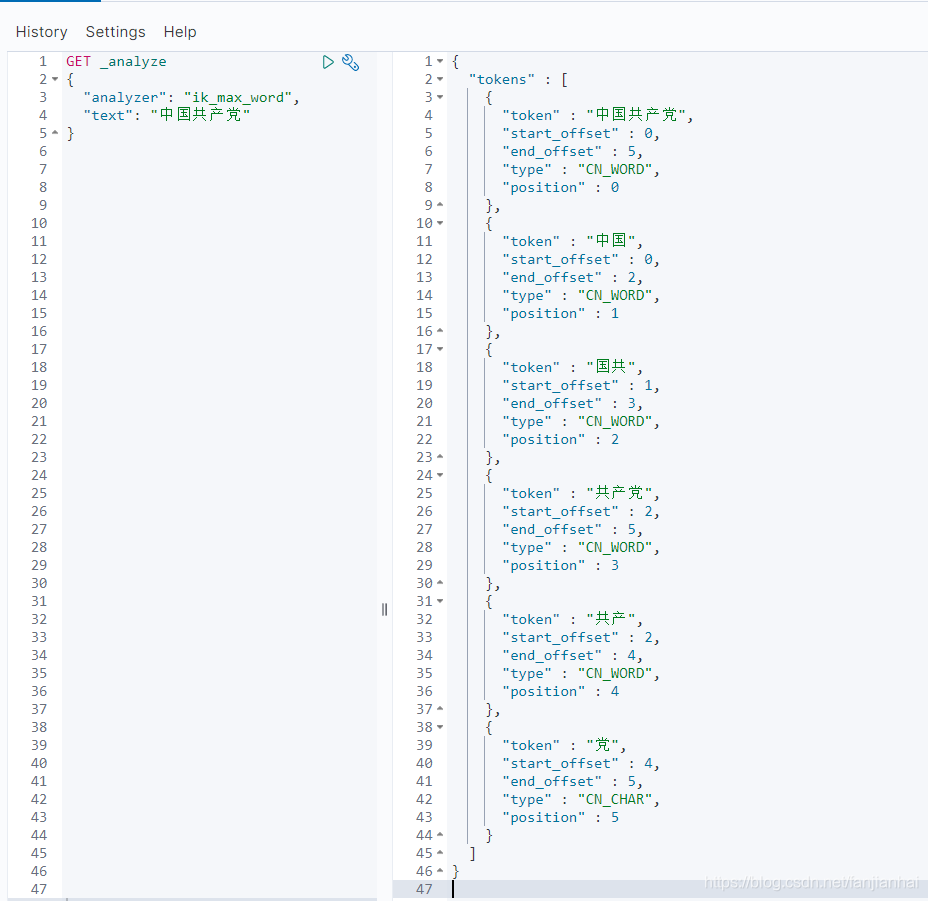

- ik分词器增加自己的配置！

打开es目录中的plugins/ik/config/IKAnalyzer.cfg.xml

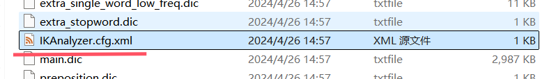

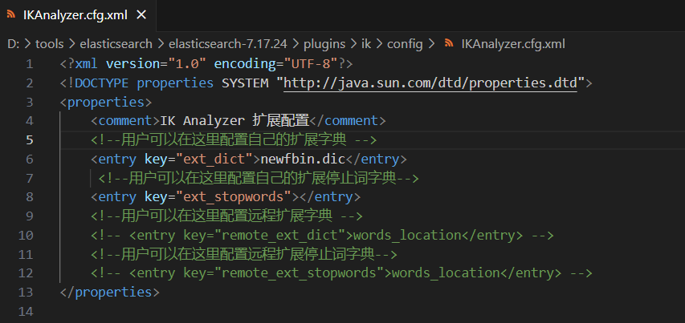

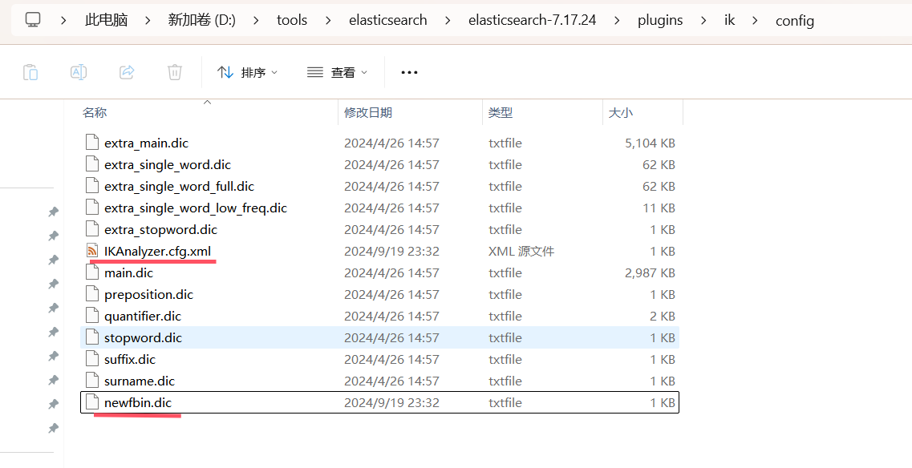

- 重启ES 和 Kibana

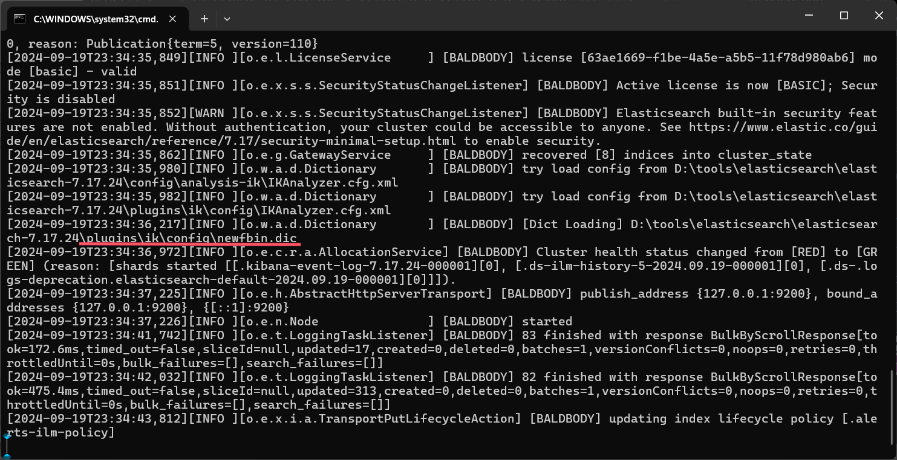


## 7. Restful风格说明


ElasticSearch新版本Rest命令

> 更详细的命令使用方式和新老命令的对比，见 "拓展" 的 "Elasticsearch新老版本RestAPI"

| method                 | url地址                  | 描述                                                         |
| ---------------------- | ------------------------ | ------------------------------------------------------------ |
| PUT、GET、POST、DELETE | /索引名称/_ doc/文档id   | **GET**：检索文档。 <br />**PUT**：更新或创建文档。 **<br />POST**：部分更新文档（一般不推荐用在指定ID上）。 <br />**DELETE**：删除文档。 |
| POST                   | /索引名称/_ doc,         | **POST**：创建新文档，ID自动生成。                           |
| PUT                    | /索引名称/_create/文档id | **GET**：不支持，返回404错误。 <br />**POST**：不推荐，通常会导致错误。<br />**PUT**：用于创建文档，如果ID已存在则返回409错误。<br /> **DELETE**：不支持，返回404错误。 |


> 基础测试

- 创建一个索引！

```yml
# 语法
PUT /索引名/~类型名~/文档id
{请求体}

# PUT 创建命令  test1:索引 type1:类型 1:id
PUT test1/type1/1
{
  "name": "xiaofan",
  "age": 28
}

# 返回结果
# 警告信息： 不支持在文档索引请求中的指定类型
# 而是使用无类型的断点(/{index}/_doc/{id}, /{index}/_doc, or /{index}/_create/{id}).
{
  "_index" : "test1",   # 索引
  "_type" : "type1",    # 类型（已经废弃）
  "_id" : "1",          # id
  "_version" : 1,       # 版本
  "result" : "created", # 操作类型
  "_shards" : {         # 分片信息
    "total" : 2,
    "successful" : 1,
    "failed" : 0
  },
  "_seq_no" : 0,
  "_primary_term" : 1
}
```

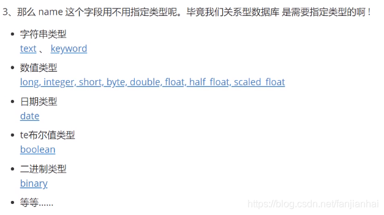

- 指定字段的类型（创建规则）


- 获取具体的索引规则

```yml
# GET test2

{
  "test2" : {
    "aliases" : { },
    "mappings" : {
      "properties" : {
        "age" : {
          "type" : "integer"
        },
        "birthday" : {
          "type" : "date"
        },
        "name" : {
          "type" : "text"
        }
      }
    },
    "settings" : {
      "index" : {
        "creation_date" : "1599708623941",
        "number_of_shards" : "1",
        "number_of_replicas" : "1",
        "uuid" : "ANWnhwArSMSl8k8iipgH1Q",
        "version" : {
          "created" : "7080099"
        },
        "provided_name" : "test2"
      }
    }
  }
}

# 查看默认的规则
PUT /test3/_doc/1
{
  "name": "狂神说Java",
  "age": 28,
  "birthday": "1997-01-05"
}

# GET test3

{
  "test3" : {
    "aliases" : { },
    "mappings" : {
      "properties" : {
        "age" : {
          "type" : "long"
        },
        "birthday" : {
          "type" : "date"
        },
        "name" : {
          "type" : "text",
          "fields" : {
            "keyword" : {
              "type" : "keyword",
              "ignore_above" : 256
            }
          }
        }
      }
    },
    "settings" : {
      "index" : {
        "creation_date" : "1599708906181",
        "number_of_shards" : "1",
        "number_of_replicas" : "1",
        "uuid" : "LzPLCDgeQn6tdKo3xBBpbw",
        "version" : {
          "created" : "7080099"
        },
        "provided_name" : "test3"
      }
    }
  }
}
```


- 修改索引 POST

```
# 只会修改指定项，其他内容保证不变
POST /test3/_doc/1/_update
{
  "doc": {
    "name":"暴徒狂神"
  }
}

# GET test3/_doc/1

{
  "_index" : "test3",
  "_type" : "_doc",
  "_id" : "1",
  "_version" : 2,
  "_seq_no" : 1,
  "_primary_term" : 1,
  "found" : true,
  "_source" : {
    "name" : "暴徒狂神",
    "age" : 28,
    "birthday" : "1997-01-05"
  }
}
```


## 8. 关于文档的基本操作

### 基本操作（简单的查询）

#### 插入命令

```json
put /kuangshen/user/1
{
  "name": "狂神说",
  "age": 23,
  "desc": "一顿操作猛如虎，一看工资2500",
  "tags": ["码农", "技术宅", "直男"]
}

put /kuangshen/user/2
{
  "name": "张三",
  "age": 28,
  "desc": "法外狂徒",
  "tags": ["旅游", "渣男", "交友"]
}

put /kuangshen/user/3
{
  "name": "李四",
  "age": 30,
  "desc": "不知道怎么描述",
  "tags": ["旅游", "靓女", "唱歌"]
}


```

#### 更新数据

> PUT命令更新数据

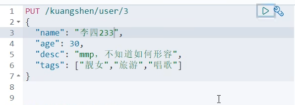

使用PUT更新，如果参数不完整，那么只会更新参数中有的值，参数中没有的值索引中会清空。

> POST _update命令更新数据 （推荐）


使用PUT更新，如果参数不完整，那么只会更新参数中有的值，参数中没有的值索引中不会清空。

#### 查询（搜索）

（搜索都是用GET请求完成的，这是规范）

> 简单的搜索

```
GET kuangshen/user/1
```

> 简单的条件搜索

```
GET kuangshen/user/_search?q=name:狂神
```

### 复杂操作(排序、分页、高亮、模糊查询、标准查询！)


#### 模糊查询

```json
GET kuangshen/user/_search
{
  "query": {
    "match": {
      "name": "狂神"
    }
  }
}
```

#### 对查询结果进行字段过滤

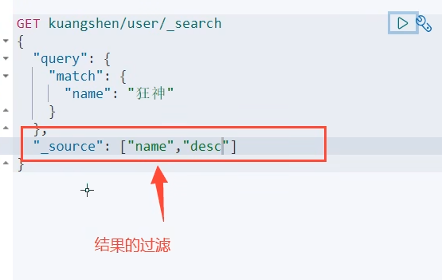


这样查询出来的结果只会有name和desc字段

#### 对查询结果进行排序

对age进行升序排列

> asc是升序，desc是降序。查询得到的结果中，score的值变为了null，因为我们已经指定了排序方式，不需要再通过score进行排序  

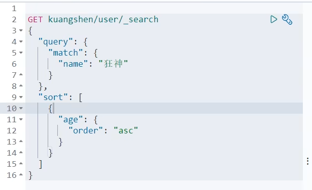


#### 分页查询（用的很多）


除了将参数放在json对象中进行分页，也可以将参数放在查询参数中

```
/search/{current}/{pagesize}
```

ElasticSearch数据下标从0开始，和我们学的数据结构一样

#### 布尔值条件查询

 **多条件查询 must 相当于and**


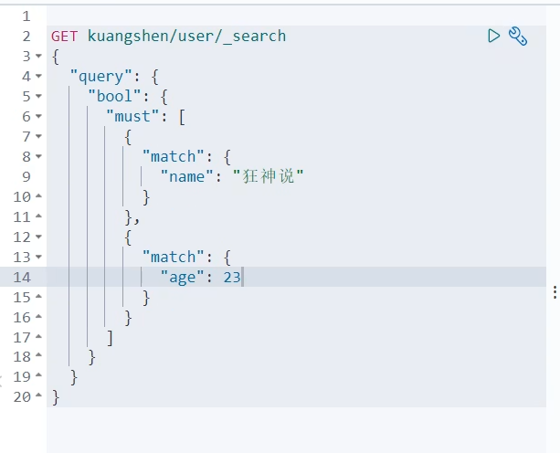

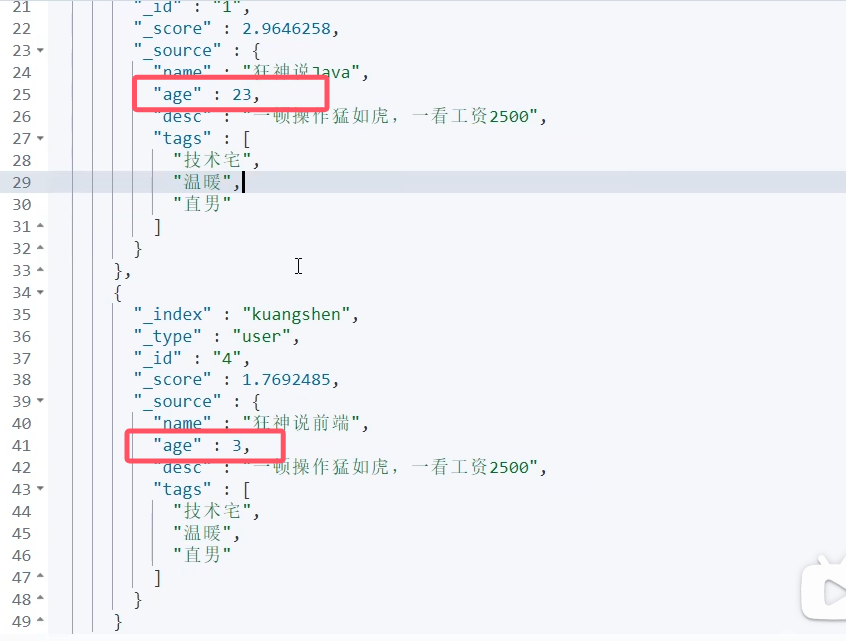

虽然第二个结果的age为3，但他的name中满足“包含狂神说”这个条件

**多条件查询 should 相当于or**

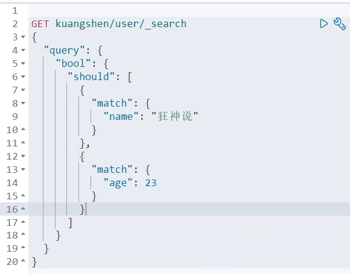

**多条件查询 must_not 相当于 not**


**过滤查询1 age > 10**


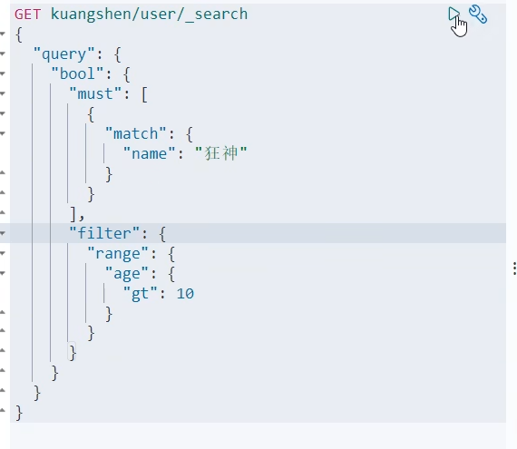

**过滤器2  10<= age <= 25**		 

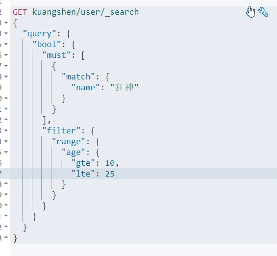

#### 多条件查询

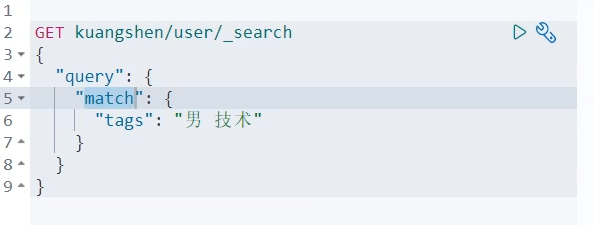

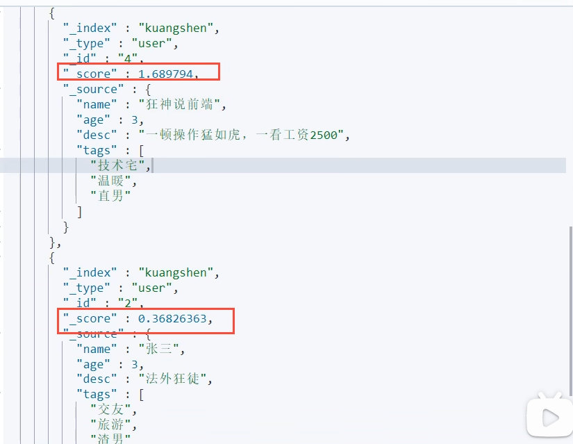

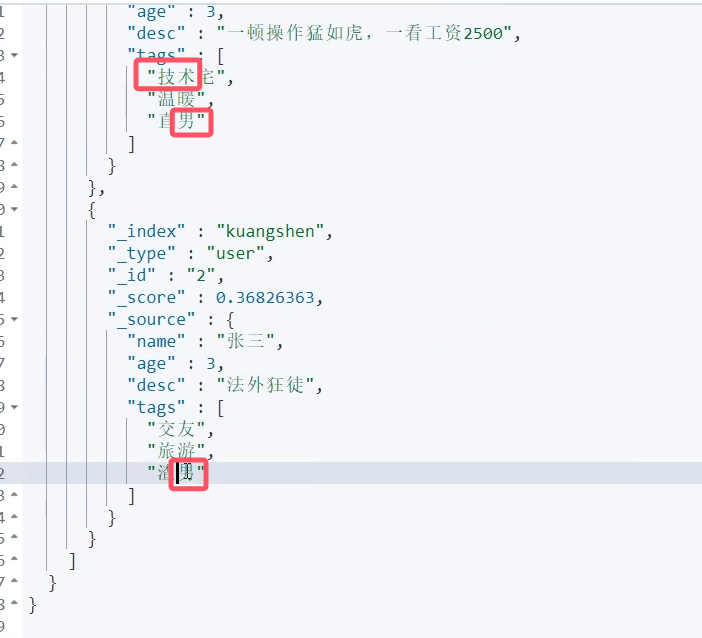

#### 精确查询


term不会做分词

> keyword类型不会被分词器解析
>
> text类型会被分词器解析

查询KeyWord类型，得到的是一个完整的整体


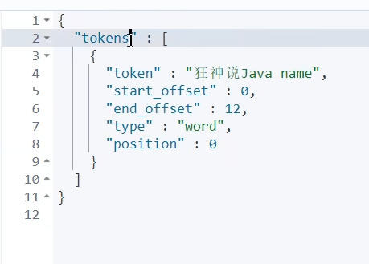

查询standard类型，内容会被分词器分析


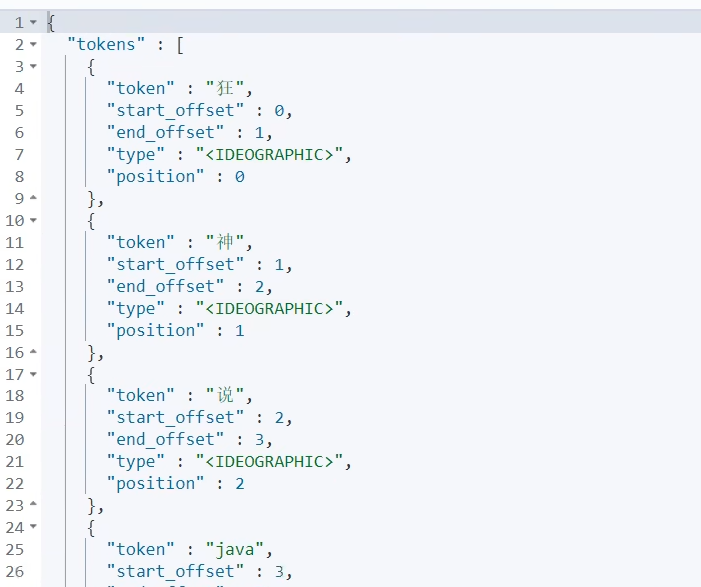

**term精确查询测试**

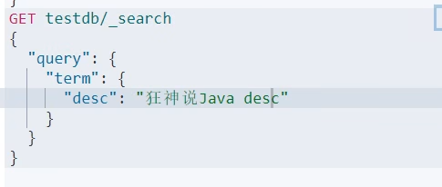

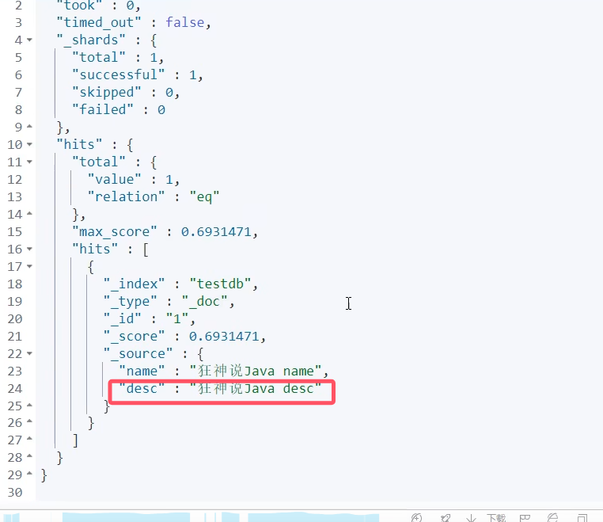

**多个值匹配精确查询**

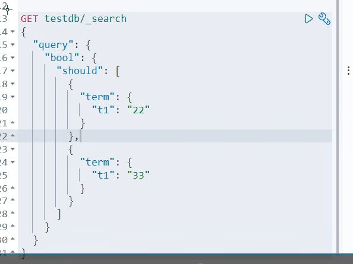

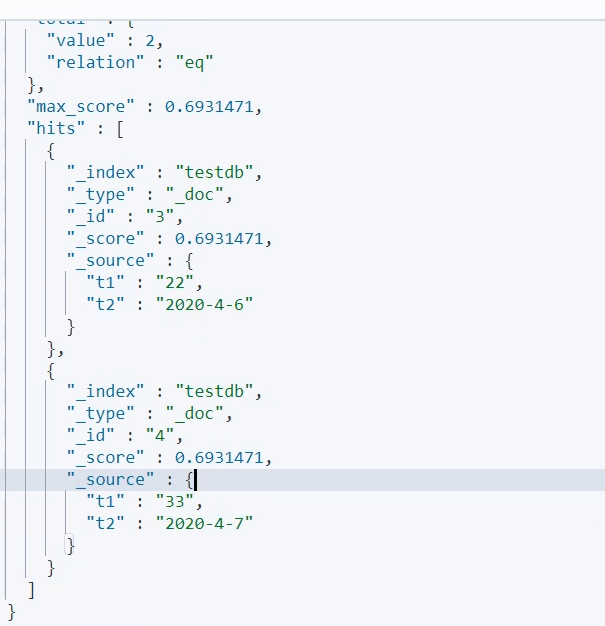   

**高亮查询**

查询结果默认会被<em></em>标签包裹

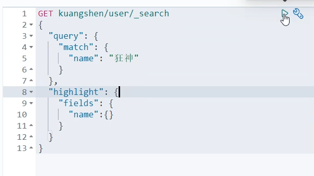

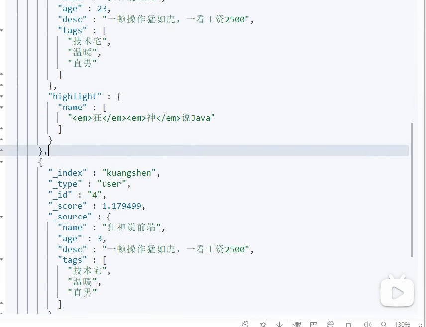

可以自定义标签

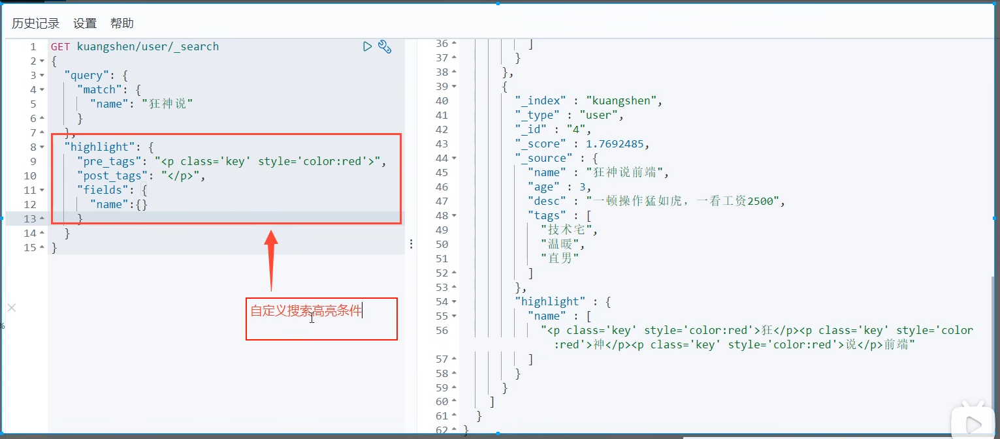

## 9. 集成SpringBoot

**官网文档位置：**

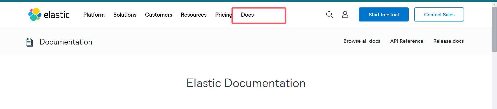

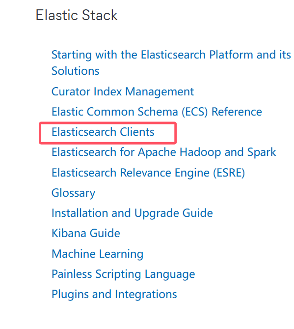

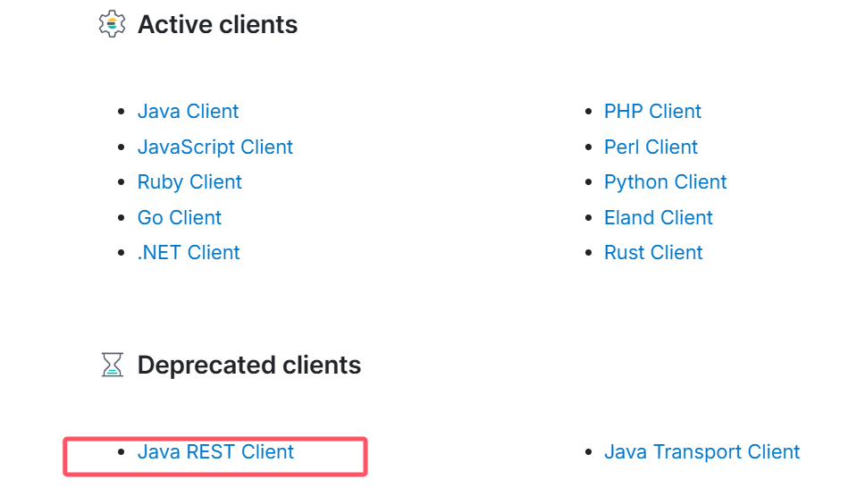

在7.x版本，Java REST是推荐的客户端。

- 添加依赖

```xml
<dependency>
    <groupId>org.springframework.boot</groupId>
    <artifactId>spring-boot-starter-data-elasticsearch</artifactId>
</dependency>
```

- 自定义配置

```java
package com.xiaofan.config;

import org.apache.http.HttpHost;
import org.elasticsearch.client.RestClient;
import org.elasticsearch.client.RestHighLevelClient;
import org.springframework.context.annotation.Bean;
import org.springframework.context.annotation.Configuration;

@Configuration
public class ElasticSearchClientConfig {

    @Bean
    public RestHighLevelClient restHighLevelClient() {
        RestHighLevelClient client = new RestHighLevelClient(
            RestClient.builder(
                new HttpHost("192.168.1.30", 9201, "http")
            )
        );

        return client;
    }


}
```

- 编写测试类

```java
package com.xiaofan;

import com.alibaba.fastjson.JSON;
import com.xiaofan.pojo.User;
import org.apache.http.entity.ContentType;
import org.elasticsearch.action.admin.indices.delete.DeleteIndexRequest;
import org.elasticsearch.action.bulk.BulkRequest;
import org.elasticsearch.action.bulk.BulkResponse;
import org.elasticsearch.action.delete.DeleteRequest;
import org.elasticsearch.action.delete.DeleteResponse;
import org.elasticsearch.action.get.GetRequest;
import org.elasticsearch.action.get.GetResponse;
import org.elasticsearch.action.index.IndexRequest;
import org.elasticsearch.action.index.IndexResponse;
import org.elasticsearch.action.search.SearchRequest;
import org.elasticsearch.action.search.SearchResponse;
import org.elasticsearch.action.support.master.AcknowledgedResponse;
import org.elasticsearch.action.update.UpdateRequest;
import org.elasticsearch.action.update.UpdateResponse;
import org.elasticsearch.client.RequestOptions;
import org.elasticsearch.client.RestHighLevelClient;
import org.elasticsearch.client.indices.CreateIndexRequest;
import org.elasticsearch.client.indices.CreateIndexResponse;
import org.elasticsearch.client.indices.GetIndexRequest;
import org.elasticsearch.common.unit.TimeValue;
import org.elasticsearch.common.xcontent.XContentType;
import org.elasticsearch.index.query.MatchAllQueryBuilder;
import org.elasticsearch.index.query.QueryBuilders;
import org.elasticsearch.index.query.TermQueryBuilder;
import org.elasticsearch.search.SearchHit;
import org.elasticsearch.search.builder.SearchSourceBuilder;
import org.elasticsearch.search.fetch.subphase.FetchSourceContext;
import org.junit.jupiter.api.Test;
import org.springframework.beans.factory.annotation.Autowired;
import org.springframework.beans.factory.annotation.Qualifier;
import org.springframework.boot.test.context.SpringBootTest;

import java.io.IOException;
import java.util.ArrayList;
import java.util.concurrent.TimeUnit;

@SpringBootTest
class EsApiApplicationTests {

    public static final String INDEX = "xiaofan_test_index";

    @Autowired
    @Qualifier(value = "restHighLevelClient")
    private RestHighLevelClient client;

    // 创建索引
    @Test
    void testCreateIndex() throws IOException {
        // 1. 创建索引请求
        CreateIndexRequest request = new CreateIndexRequest(INDEX);
        // 2. 客户端执行请求， IndicesClient，请求后获得响应
        CreateIndexResponse createIndexResponse = client.indices().create(request, RequestOptions.DEFAULT);
        System.out.println(createIndexResponse);
    }

    // 测试索引存在a7
    @Test
    void testExistsIndex() throws IOException {
        GetIndexRequest request = new GetIndexRequest(INDEX);
        boolean exists = client.indices().exists(request, RequestOptions.DEFAULT);
        System.out.println(exists);
    }

    // 删除索引
    @Test
    void testDeleteIndex() throws IOException {
        DeleteIndexRequest request = new DeleteIndexRequest(INDEX);
        AcknowledgedResponse acknowledgedResponse = client.indices().delete(request, RequestOptions.DEFAULT);
        System.out.println(acknowledgedResponse.isAcknowledged());
    }

    // 添加文档
    @Test
    void testAddDocument() throws IOException {
        User user = new User("狂神说", 28);
        IndexRequest request = new IndexRequest(INDEX);
        // 规则 PUT /index/_doc/1
        request.id("1");
        request.timeout(TimeValue.timeValueSeconds(1));
        // 将数据放入请求 json
        request.source(JSON.toJSONString(user), XContentType.JSON);
        IndexResponse response = client.index(request, RequestOptions.DEFAULT);
        System.out.println(response.toString());
        System.out.println(response.status());
    }

    // 获取文档 判断是否存在 GET /index/_doc/1
    @Test
    void testIsExists() throws IOException {
        GetRequest request = new GetRequest(INDEX, "1");
        // 不获取返回的 _source 的上下文了
        request.fetchSourceContext(new FetchSourceContext(false));
        request.storedFields("_none_");

        boolean exists = client.exists(request, RequestOptions.DEFAULT);
        System.out.println(exists);
    }

    // 获取文档

    /**
     * 返回结果：
     * {"age":28,"name":"狂神说"}
     * {"_index":"xiaofan_test_index","_type":"_doc","_id":"1","_version":1,"_seq_no":0,"_primary_term":1,"found":true,"_source":{"age":28,"name":"狂神说"}}
     */
    @Test
    void testGetDocument() throws IOException {
        GetRequest request = new GetRequest(INDEX, "1");
        GetResponse response = client.get(request, RequestOptions.DEFAULT);
        System.out.println(response.getSourceAsString());
        System.out.println(response);
    }

    // 更新文档
    @Test
    void testUpdateDocument() throws IOException {
        UpdateRequest request = new UpdateRequest(INDEX, "1");
        request.timeout("1s");

        User user = new User("小范说Java", 18);
        request.doc(JSON.toJSONString(user), XContentType.JSON);

        UpdateResponse updateResponse = client.update(request, RequestOptions.DEFAULT);
        System.out.println(updateResponse);
    }

    // 删除文档
    @Test
    void testDeleteDocument() throws IOException {
        DeleteRequest request = new DeleteRequest(INDEX, "1");
        request.timeout("1s");

        DeleteResponse deleteResponse = client.delete(request, RequestOptions.DEFAULT);
        System.out.println(deleteResponse);

    }

    // 批量插入数据（修改，删除类似操作）
    @Test
    void testBulkRequest() throws IOException {
        BulkRequest request = new BulkRequest();
        request.timeout("10s");

        ArrayList<User> users = new ArrayList<>();
        users.add(new User("kuangshen1", 21));
        users.add(new User("kuangshen2", 22));
        users.add(new User("kuangshen3", 23));
        users.add(new User("xiaofan1", 18));
        users.add(new User("xiaofan2", 19));

        // 批处理请求， 修改，删除，只要在这里修改相应的请求就可以
        for (int i = 0; i < users.size(); i++) {
            request.add(new IndexRequest(INDEX)
                    .id(String.valueOf(i + 1))
                    .source(JSON.toJSONString(users.get(i)), XContentType.JSON));
        }

        BulkResponse bulkResponse = client.bulk(request, RequestOptions.DEFAULT);
        //是否失败，返回false表示成功
        System.out.println(bulkResponse.hasFailures());
    }

    // 查询文档
    @Test
    void testSearch() throws IOException {
        SearchRequest searchRequest = new SearchRequest(INDEX);
        // 构建搜索条件
        SearchSourceBuilder sourceBuilder = new SearchSourceBuilder();

        // 查询条件， 可以使用QueryBuilders工具类实现
        // QueryBuilders.termQuery 精确
        // QueryBuilders.matchLLQuery() 匹配所有
        TermQueryBuilder termQueryBuilder = QueryBuilders.termQuery("name", "kuangshen1");
        // MatchAllQueryBuilder matchAllQueryBuilder = QueryBuilders.matchAllQuery();
        sourceBuilder.query(termQueryBuilder);
        sourceBuilder.timeout(new TimeValue(60, TimeUnit.SECONDS));

        searchRequest.source(sourceBuilder);

        SearchResponse searchResponse = client.search(searchRequest, RequestOptions.DEFAULT);
        System.out.println(JSON.toJSON(searchResponse.getHits()));
        System.out.println("======================================");
        for (SearchHit documentFields : searchResponse.getHits().getHits()) {
            System.out.println(documentFields.getSourceAsMap());
        }

    }

}
```

## 10. 实战：模拟全文搜索-京东搜索

- github链接：https://github.com/fanjianhai/CODE/tree/main/SpringBoot/springboot-11-elasticsearch-jd
- 搭建springboot项目，添加依赖，修改es版本

### 爬虫

> ElasticSearch的数据源：数据库、消息队列、**爬虫**

爬取数据的方式：获取请求返回的页面信息，筛选出我们想要的数据。在Java中可以使用Jsoup包实现这一功能

> Jsoup包只可以爬取网页内容，不可以爬电影音乐内容。
> Tika包可以爬取电影音乐

企业中很多图片是懒加载的。控制台中显示图片为 src = "xxx"，这是图片加载完之后的代码。
在图片尚未加载完的时候，会在图片的位置展示一张简单的图片。等图片完全加载之后，再将简单的图片更换为原本的图片。这种加载方式就是懒加载。而在控制台看到代码时，图片早就加载完了，无法看到图片懒加载完成之前被存放在哪个属性里边。
只能通过在Java中打印懒加载完成之前的代码。


通过打印，可以看到图片在加载完成之前被存放在“data-lazy-img”属性中。

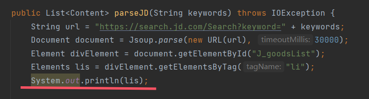


通过访问接口测试效果：可以看到数据被存入到ElasticSearch中

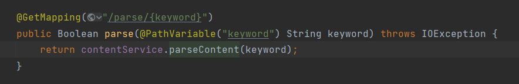


- 整体效果


## EX1.实战：智能面试刷题平台--鱼皮

#### 1、什么是 Elasticsearch？

Elasticsearch 是一个分布式、开源的搜索引擎，专门用于处理大规模的数据搜索和分析。它基于 Apache Lucene 构建，具有实时搜索、分布式计算和高可扩展性，广泛用于 **全文检索、日志分析、监控数据分析** 等场景。

官方文档：https://www.elastic.co/docs，建议入门后阅读一遍，了解更多它的特性。

#### 2、Elasticsearch 生态

Elasticsearch 生态系统非常丰富，包含了一系列工具和功能，帮助用户处理、分析和可视化数据，Elastic Stack 是其核心组成部分。

Elastic Stack（也称为 ELK Stack）由以下几部分组成：

- Elasticsearch：核心搜索引擎，负责存储、索引和搜索数据。
- Kibana：可视化平台，用于查询、分析和展示 Elasticsearch 中的数据。
- Logstash：数据处理管道，负责数据收集、过滤、增强和传输到 Elasticsearch。
- Beats：轻量级的数据传输工具，收集和发送数据到 Logstash 或 Elasticsearch。

Kibana 是 Elastic Stack 的可视化组件，允许用户通过图表、地图和仪表盘来展示存储在 Elasticsearch 中的数据。它提供了简单的查询接口、数据分析和实时监控功能。


Logstash 是一个强大的数据收集管道工具，能够从多个来源收集、过滤、转换数据，然后将数据发送到 Elasticsearch。Logstash 支持丰富的输入、过滤和输出插件。


Beats 是一组轻量级的数据采集代理，负责从不同来源收集数据并发送到 Elasticsearch 或 Logstash。常见的 Beats 包括：

- Filebeat：收集日志文件。
- Metricbeat：收集系统和服务的指标。
- Packetbeat：监控网络流量。


上面这张图，也是标准的 Elastic Stack 技术栈的交互图。

#### 3、Elasticsearch 的核心概念

索引（Index）：类似于关系型数据库中的表，索引是数据存储和搜索的 **基本单位**。每个索引可以存储多条文档数据。

文档（Document）：索引中的每条记录，类似于数据库中的行。文档以 JSON 格式存储。

字段（Field）：文档中的每个键值对，类似于数据库中的列。

映射（Mapping）：用于定义 Elasticsearch 索引中文档字段的数据类型及其处理方式，类似于关系型数据库中的 Schema 表结构，帮助控制字段的存储、索引和查询行为。

集群（Cluster）：多个节点组成的群集，用于存储数据并提供搜索功能。集群中的每个节点都可以处理数据。

分片（Shard）：为了实现横向扩展，ES 将索引拆分成多个分片，每个分片可以分布在不同节点上。

副本（Replica）：分片的复制品，用于提高可用性和容错性。


和数据库类比：

| **Elasticsearch 概念** | **关系型数据库类比** |
| ---------------------- | -------------------- |
| Index                  | Table                |
| Document               | Row                  |
| Field                  | Column               |
| Mapping                | Schema               |
| Shard                  | Partition            |
| Replica                | Backup               |

#### 4、Elasticsearch 实现全文检索的原理

1）分词：Elasticsearch 的分词器会将输入文本拆解成独立的词条（tokens），方便进行索引和搜索。分词的具体过程包括以下几步：

- 字符过滤：去除特殊字符、HTML 标签或进行其他文本清理。
- 分词：根据指定的分词器（analyzer），将文本按规则拆分成一个个词条。例如，英文可以按空格拆分，中文使用专门的分词器处理。
- 词汇过滤：对分词结果进行过滤，如去掉停用词（常见但无意义的词，如 "the"、"is" 等）或进行词形归并（如将动词变为原形）。

Elasticsearch 内置了很多分词器，比如按照空格分词等，默认只支持英文，可以在 [官方文档](https://www.elastic.co/guide/en/elasticsearch/reference/7.17/analysis-analyzers.html) 了解。

2）倒排索引：

倒排索引是 Elasticsearch 实现高效搜索的核心数据结构。它将文档中的词条映射到文档 ID，实现快速查找。

工作原理：

- 每个文档在被索引时，分词器会将文档内容拆解为多个词条。
- 然后，Elasticsearch 为每个词条生成一个倒排索引，记录该词条在哪些文档中出现。

举个例子，假设有两个文档：

- 文档 1：鱼皮是帅锅
- 文档 2：鱼皮是好人

中文分词后，生成的倒排索引大致如下：

| 词条 | 文档 ID |
| ---- | ------- |
| 鱼皮 | 1, 2    |
| 是   | 1, 2    |
| 帅锅 | 1       |
| 好人 | 2       |

通过这种结构，查询某个词时，可以快速找到包含该词的所有文档。

#### 5、Elasticsearch 打分规则

实际应用 Elasticsearch 来实现搜索功能时，我们不仅要求能搜到内容，而且还要把和用户搜索最相关的内容展示在前面。这就需要我们了解 Elasticsearch 的打分规则。

打分规则（_Score）是用于衡量每个文档与查询条件的匹配度的评分机制。搜索结果的默认排序方式是按相关性得分（_score）从高到低。Elasticsearch 使用 **BM25 算法** 来计算每个文档的得分，它是基于词频、反向文档频率、文档长度等因素来评估文档和查询的相关性。

打分的主要因素：

1. 词频（TF, Term Frequency）：查询词在文档中出现的次数，出现次数越多，得分越高。
2. 反向文档频率（IDF, Inverse Document Frequency）：查询词在所有文档中出现的频率。词在越少的文档中出现，IDF 值越高，得分越高。
3. 文档长度：较短的文档往往被认为更相关，因为查询词在短文档中占的比例更大。

下面举一个例子：假设要在 Elasticsearch 中查询 `鱼皮` 这个关键词，索引中有以下三个文档：

文档 1：

```plain
鱼皮是个帅小伙，鱼皮非常聪明，鱼皮很喜欢编程。
```

分析：

- 查询词 `鱼皮` 出现了 3 次。
- 该文档较短，查询词 `鱼皮` 的密度很高。

由于 `鱼皮` 在文档中多次出现且文档较短，因此得分较高，相关性较强。

文档 2：

```plain
鱼皮是个帅小伙。
```

分析：

- 查询词 `鱼皮` 出现了 1 次。
- 文档非常短

尽管文档短，但是查询词出现的次数少，因此得分中等，相关性较普通。

文档 3：

```plain
鱼皮是个帅小伙，他喜欢写代码。他的朋友们也很喜欢编程和技术讨论，大家经常一起参与各种技术会议，讨论分布式系统、机器学习和人工智能等主题。
```

分析：

- 查询词 `鱼皮` 出现了 1 次。
- 文档较长，且 `鱼皮` 只在文档开头出现，词条密度较低。

由于文档很长，`鱼皮` 出现的次数少，密度也低，因此得分较低，相关性不强。

再举个例子，什么是反向文档频率？

假如说 ES 中有 10 个文档，都包含了“鱼皮”这个关键词；只有 1 个文档包含了“帅锅”这个关键词。

现在用户搜索“鱼皮帅锅”，大概率会把后面这条文档搜出来，因为更稀有。

当然，以上只是简单举例，实际上 ES 计算打分规则时，会有一套较为复杂的公式，感兴趣的同学可以阅读下面资料来了解：

- 鱼皮文章：https://liyupi.blog.csdn.net/article/details/119176943
- 官方文章：https://www.elastic.co/guide/en/elasticsearch/guide/master/controlling-relevance.html

#### 6、Elasticsearch 查询语法

Elasticsearch 支持多种查询语法，用于不同的场景和需求，主要包括查询 DSL、EQL、SQL 等。

**1）DSL 查询（\**\*\*Domain Specific Language\*\**\*）**

一种基于 JSON 的查询语言，它是 Elasticsearch 中最常用的查询方式。

示例：

```json
{
  "query": {
    "match": {
      "message": "Elasticsearch 是强大的"
    }
  }
}
```

这个查询会对 `message` 字段进行分词，并查找包含 "Elasticsearch" 和 "强大" 词条的文档。

**2）EQL**

EQL 全称 Event Query Language，是一种用于检测和检索时间序列 **事件** 的查询语言，常用于日志和安全监控场景。

示例：查找特定事件

```plain
process where process.name == "malware.exe"
```

这个查询会查找 `process.name` 为 "malware.exe" 的所有进程事件，常用于安全检测中的恶意软件分析。

**3）SQL 查询**

Elasticsearch 提供了类似于传统数据库的 SQL 查询语法，允许用户以 SQL 的形式查询 Elasticsearch 中的数据，对熟悉 SQL 的用户来说非常方便。

示例 SQL 查询：

```sql
SELECT name, age FROM users WHERE age > 30 ORDER BY age DESC
```

这个查询会返回 `users` 索引中 `age` 大于 30 的所有用户，并按年龄降序排序。

------

以下几种简单了解即可：

**4）Lucene 查询语法**

Lucene 是 Elasticsearch 底层的搜索引擎，Elasticsearch 支持直接使用 Lucene 的查询语法，适合简单的字符串查询。

示例 Lucene 查询：

```plain
name:Elasticsearch AND age:[30 TO 40]
```

这个查询会查找 `name` 字段为 "Elasticsearch" 且 `age` 在 30 到 40 之间的文档。

**5）Kuery（KQL: Kibana Query Language）**

KQL 是 Kibana 的查询语言，专门用于在 Kibana 界面上执行搜索查询，常用于仪表盘和数据探索中。

示例 KQL 查询：

```plain
name: "Elasticsearch" and age > 30
```

这个查询会查找 `name` 为 "Elasticsearch" 且 `age` 大于 30 的文档。

**6）Painless 脚本查询**

Painless 是 Elasticsearch 的内置脚本语言，用于执行自定义的脚本操作，常用于排序、聚合或复杂计算场景。

示例 Painless 脚本：

```json
{
  "query": {
    "script_score": {
      "query": {
        "match": { "message": "Elasticsearch" }
      },
      "script": {
        "source": "doc['popularity'].value * 2"
      }
    }
  }
}
```

这个查询会基于 `popularity` 字段的值进行动态评分，将其乘以 2。

总结一下，DSL 是最通用的，EQL 和 KQL 则适用于特定场景，如日志分析和 Kibana 查询，而 SQL 则便于数据库开发人员上手。

#### 7、Elasticsearch 查询条件

如何利用 Elasticsearch 实现数据筛选呢？需要了解其查询条件，以 ES 的 DSL 语法为例：

| **查询条件**   | **介绍**                                                     | **示例**                                                     | **用途**                                           |
| -------------- | ------------------------------------------------------------ | ------------------------------------------------------------ | -------------------------------------------------- |
| `match`        | 用于全文检索，将查询字符串进行分词并匹配文档中对应的字段。   | `{ "match": { "content": "鱼皮是帅小伙" } }`                 | 适用于全文检索，分词后匹配文档内容。               |
| `term`         | 精确匹配查询，不进行分词。通常用于结构化数据的精确匹配，如数字、日期、关键词等。 | `{ "term": { "status": "active" } }`                         | 适用于字段的精确匹配，如状态、ID、布尔值等。       |
| `terms`        | 匹配多个值中的任意一个，相当于多个 `term` 查询的组合。       | `{ "terms": { "status": ["active", "pending"] } }`           | 适用于多值匹配的场景。                             |
| `range`        | 范围查询，常用于数字、日期字段，支持大于、小于、区间等查询。 | `{ "range": { "age": { "gte": 18, "lte": 30 } } }`           | 适用于数值或日期的范围查询。                       |
| `bool`         | 组合查询，通过 `must`、`should`、`must_not` 等组合多个查询条件。 | `{ "bool": { "must": [ { "term": { "status": "active" } }, { "range": { "age": { "gte": 18 } } } ] } }` | 适用于复杂的多条件查询，可以灵活组合。             |
| `wildcard`     | 通配符查询，支持 `*` 和 `?`，前者匹配任意字符，后者匹配单个字符。 | `{ "wildcard": { "name": "鱼*" } }`                          | 适用于部分匹配的查询，如模糊搜索。                 |
| `prefix`       | 前缀查询，匹配以指定前缀开头的字段内容。                     | `{ "prefix": { "name": "鱼" } }`                             | 适用于查找以指定字符串开头的内容。                 |
| `fuzzy`        | 模糊查询，允许指定程度的拼写错误或字符替换。                 | `{ "fuzzy": { "name": "yupi~2" } }`                          | 适用于处理拼写错误或不完全匹配的查询。             |
| `exists`       | 查询某字段是否存在。                                         | `{ "exists": { "field": "name" } }`                          | 适用于查找字段存在或缺失的文档。                   |
| `match_phrase` | 短语匹配查询，要求查询的词语按顺序完全匹配。                 | `{ "match_phrase": { "content": "鱼皮 帅小伙" } }`           | 适用于严格的短语匹配，词语顺序和距离都严格控制。   |
| `match_all`    | 匹配所有文档。                                               | `{ "match_all": {} }`                                        | 适用于查询所有文档，通常与分页配合使用。           |
| `ids`          | 基于文档 ID 查询，支持查询特定 ID 的文档。                   | `{ "ids": { "values": ["1", "2", "3"] } }`                   | 适用于根据文档 ID 查找特定文档。                   |
| `geo_distance` | 地理位置查询，基于地理坐标和指定距离查询。                   | `{ "geo_distance": { "distance": "12km", "location": { "lat": 40.73, "lon": -74.1 } } }` | 适用于根据距离计算查找地理位置附近的文档。         |
| `aggregations` | 聚合查询，用于统计、计算和分组查询，类似 SQL 中的 `GROUP BY`。 | `{ "aggs": { "age_stats": { "stats": { "field": "age" } } } }` | 适用于统计和分析数据，比如求和、平均值、最大值等。 |

其中的几个关键：

1. 精确匹配 vs. 全文检索：`term` 是精确匹配，不分词；`match` 用于全文检索，会对查询词进行分词。
2. 组合查询：`bool` 查询可以灵活组合多个条件，适用于复杂的查询需求。
3. 模糊查询：`fuzzy` 和 `wildcard` 提供了灵活的模糊匹配方式，适用于拼写错误或不完全匹配的场景。

了解上面这些一般就足够了，更多可以随用随查，参考 [官方文档](https://www.elastic.co/guide/en/elasticsearch/reference/7.17/query-dsl.html) 。

#### 8、Elasticsearch 客户端

前面了解了 Elasticsearch 的概念和查询语法，但是如何执行 Elasticsearch 操作呢？还需要了解下 ES 的客户端，列举一些常用的：

1）HTTP API：Elasticsearch 提供了 RESTful HTTP API，用户可以通过直接发送 HTTP 请求来执行索引、搜索和管理集群的操作。[官方文档](https://www.elastic.co/guide/en/elasticsearch/reference/7.17/rest-apis.html)

2）Kibana：Kibana 是 Elasticsearch 官方提供的可视化工具，用户可以通过 Kibana 控制台使用查询语法（如 DSL、KQL）来执行搜索、分析和数据可视化。

3）Java REST Client：Elasticsearch 官方提供的 Java 高级 REST 客户端库，用于 Java 程序中与 Elasticsearch 进行通信，支持索引、查询、集群管理等操作。[官方文档](https://www.elastic.co/guide/en/elasticsearch/client/java-api-client/7.17/introduction.html)

4）Spring Data Elasticsearch：Spring 全家桶的一员，用于将 Elasticsearch 与 Spring 框架集成，通过简化的 Repository 方式进行索引、查询和数据管理操作。[官方文档](https://spring.io/projects/spring-data-elasticsearch)

5）Elasticsearch SQL CLI：命令行工具，允许通过类 SQL 语法直接在命令行中查询 Elasticsearch 数据，适用于熟悉 SQL 的用户。

此外，Elasticsearch 当然不只有 Java 的客户端，Python、PHP、Node.js、Go 的客户端都是支持的。

💡 在选择客户端时，要格外注意版本号！！！要跟 Elasticsearch 的版本保持兼容。

#### 9、ES 数据同步方案

一般情况下，如果做查询搜索功能，使用 ES 来模糊搜索，但是数据是存放在数据库 MySQL 里的，所以说我们需要把 MySQL 中的数据和 ES 进行同步，保证数据一致（以 MySQL 为主）。

数据流向：MySQL => ES （单向）

数据同步一般有 2 个过程：全量同步（首次）+ 增量同步（新数据）

总共有 4 种主流方案：

**1）定时任务**

比如 1 分钟 1 次，找到 MySQL 中过去几分钟内（至少是定时周期的 2 倍）发生改变的数据，然后更新到 ES。

优点：

- 简单易懂，开发、部署、维护相对容易。
- 占用资源少，不需要引入复杂的第三方中间件。
- 不用处理复杂的并发和实时性问题。

缺点：

- **有时间差**：无法做到实时同步，数据存在滞后。
- 数据频繁变化时，无法确保数据完全同步，容易出现错过更新的情况。
- 对大数据量的更新处理不够高效，可能会引入重复更新逻辑。

应用场景：

- 数据实时性要求不高：适合数据短时间内不同步不会带来重大影响的场景。
- 数据基本不发生修改：适合数据几乎不修改、修改不频繁的场景。
- 数据容忍丢失

**2）双写**

写数据的时候，必须也去写 ES；更新删除数据库同理。

可以通过事务保证数据一致性，使用事务时，要先保证 MySQL 写成功，因为如果 ES 写入失败了，不会触发回滚，但是可以通过定时任务 + 日志 + 告警进行检测和修复（补偿）。

优点：

- 方案简单易懂，业务逻辑直接控制数据同步。
- 可以利用事务部分保证 MySQL 和 ES 的数据一致性。
- 同步的时延较短，理论上可以接近实时更新 ES。

缺点：

- **影响性能**：每次写 MySQL 时，需要同时操作 ES，增加了业务写入延迟，影响性能。
- **一致性问题**：如果 ES 写入失败，MySQL 事务提交成功后，ES 可能会丢失数据；或者 ES 写入成功，MySQL 事务提交失败，ES 无法回滚。因此必须额外设计监控、补偿机制来检测同步失败的情况（如通过定时任务、日志和告警修复）。
- 代码复杂度增加，需要对每个写操作都进行双写处理。

应用场景：

- 实时性要求较高
- 业务写入频率较低：适合写操作不频繁的场景，这样对性能的影响较小。

**3）用 Logstash 数据同步管道**

一般要配合 kafka 消息队列 + beats 采集器：


优点：

- **配置驱动**：基于配置文件，减少了手动编码，数据同步逻辑和业务代码解耦。
- **扩展性好**：可以灵活引入 Kafka 等消息队列实现异步数据同步，并可处理高吞吐量数据。
- 支持多种数据源：Logstash 支持丰富的数据源，方便扩展其他同步需求。

缺点：

- **灵活性差**：需要通过配置文件进行同步，复杂的业务逻辑可能难以在配置中实现，无法处理细粒度的定制化需求。
- 引入额外组件，维护成本高：通常需要引入 Kafka、Beats 等第三方组件，增加了系统的复杂性和运维成本。

应用场景：

- **大数据同步**：适合大规模、分布式数据同步场景。
- **对实时性要求不高**：适合数据流处理或延迟容忍较大的系统。
- 系统已有 Kafka 或类似的消息队列架构：如果系统中已经使用了 Kafka 等中间件，使用 Logstash 管道会变得很方便。

**4）监听 MySQL Binlog**

有任何数据变更时都能够实时监听到，并且同步到 Elasticsearch。一般不需要自己监听，可以使用现成的技术，比如 [Canal](https://github.com/alibaba/canal/) 。

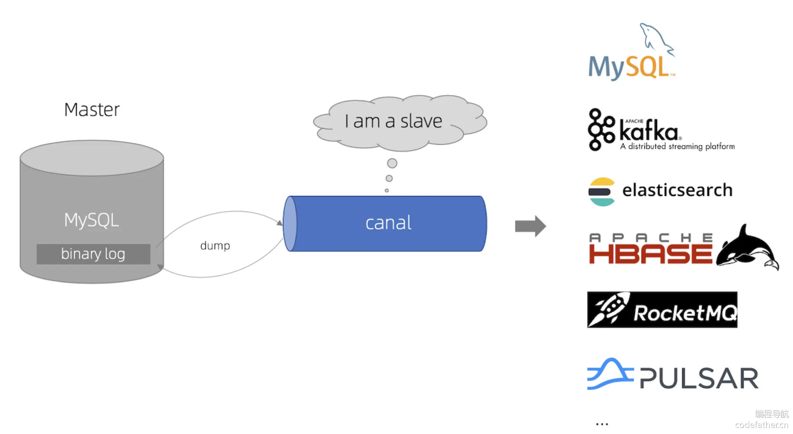

💡 Canal 的核心原理：数据库每次修改时，会修改 binlog 文件，只要监听该文件的修改，就能第一时间得到消息并处理

优点：

- **实时性强**：能够在 MySQL 数据发生变更的第一时间同步到 ES，做到真正的实时同步。
- 轻量级：Binlog 是数据库自带的日志功能，不需要修改核心业务代码，只需要新增监听逻辑。

缺点：

- 引入外部依赖：需要引入像 Canal 这样的中间件，增加了系统的复杂性和维护成本。
- 运维难度增加：需要确保 Canal 或者其他 Binlog 监听器的稳定运行，并且对 MySQL 的 Binlog 配置要求较高。
- 一致性问题：如果 Canal 服务出现问题或暂停，数据可能会滞后或丢失，必须设计补偿机制。

应用场景：

- **实时同步要求高**：适合需要实时数据同步的场景，通常用于高并发、高数据一致性要求的系统。
- **数据频繁变化**：适合数据变更频繁且需要高效增量同步的场景。

最终方案：对于本项目，由于数据量不大，题目更新也不频繁，容忍丢失和不一致，所以选用方案一，实现成本最低。

### 后端开发（ES 实战）

#### 1、Elasticsearch 搭建

目标：安装 Elasticsearch 和 Kibana，能够在 Kibana 查看到 Elasticsearch 存储的数据。

💡 也可以直接使用云 Elasticsearch 服务，省去自主搭建的时间，推荐使用 Serverless 版本，学完关掉就行。

**Elasticsearch 更新迭代非常快，所以安装时，一定要注意慎重选择版本号！**

由于我们自己的项目用的 Spring Boot 2.x 版本，对应的 [Spring Data Elasticsearch](https://spring.io/projects/spring-data-elasticsearch) 客户端版本是 4.x，支持的 Elasticsearch 是 7.x，所以建议 Elasticsearch 使用 7.x 的版本。

鱼皮教程中使用的是 7.17 版本，这是 7.x 系列的最后一个版本，包含了该系列所有的 bug 修复和改进，被广泛认为是最稳定的。

💡 可以在 [官方文档](https://docs.spring.io/spring-data/elasticsearch/reference/elasticsearch/versions.html) 了解到版本兼容情况：比如 Spring 6 才支持 Elasticsearch 8.x

1）安装 Elasticsearch

参考官方文档：https://www.elastic.co/guide/en/elasticsearch/reference/7.17/setup.html

Windows 解压安装：https://www.elastic.co/guide/en/elasticsearch/reference/7.17/zip-windows.html

其他操作系统安装：https://www.elastic.co/guide/en/elasticsearch/reference/7.17/targz.html

如果官网下不动，可以用鱼皮已经下载好的：https://pan.baidu.com/s/1u73-Nlolrs8Rzb1_b6X6HA ，提取码：c2sd

**注意，安装路径不要包含中文！**

安装完成后进入 es 目录并执行启动命令：

```plain
.\bin\elasticsearch.bat
```

可以用 CURL 测试是否启动成功：

```shell
curl -X GET "localhost:9200/?pretty"
```

正常输出如图：


在 Windows 系统上，你还可以选择是否安装为服务，方便启动和管理。

```plain
.\bin\elasticsearch-service.bat

Usage: elasticsearch-service.bat install|remove|start|stop|manager [SERVICE_ID]
```

2）安装 Kibana

**注意，只要是同一套技术，所有版本必须一致！此处都用 7.17 版本！**

参考官方文档：https://www.elastic.co/guide/en/kibana/7.17/introduction.html

安装 Kibana：https://www.elastic.co/guide/en/kibana/7.17/install.html

安装完成后进入 kibana 目录并执行启动命令：

```plain
.\bin\kibana.bat
```

正常输出如图：

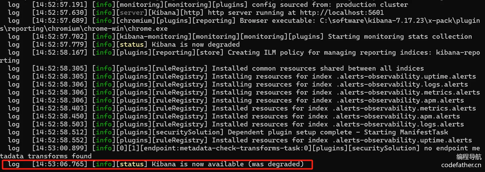

访问 http://localhost:5601/，即可开始使用。


但 kibana 默认是英文，不变阅读，可以修改 `config/kibana.yml` 中的国际化配置：


然后重启 kibana 即可。

**注意，目前 Kibana 面板没有增加权限校验，所有人都能访问，所以请勿在线上直接部署！**

3）测试

尝试利用 Kibana 的开发工具来操作 Elasticsearch 的数据，比如查询：


验证下分词器的效果，比如使用标准分词器：

```json
POST /_analyze
{
  "analyzer": "standard", 
  "text": "鱼皮是个帅小伙，非常喜欢编程"
}
```

效果如图，英文被识别为了一个词，但中文未被识别：


默认支持的分词器如下：

- standard：标准分词器。
- simple：简单分词器。
- whitespace：按空格分词。
- stop：带停用词的分词器。
- keyword：不分词，将整个字段作为一个词条。
- pattern：基于正则表达式的分词器。
- ngram 和 edge_ngram：n-gram 分词器。

由于这些分词器都不支持中文，所以需要安装 IK 中文分词器，以满足我们的业务需要。

4）安装 IK 中文分词器（ES 插件）

开源地址：https://github.com/medcl/elasticsearch-analysis-ik

直接按照官方指引安装即可，注意下载和我们 Elasticsearch 一致的版本，可以在这里找到各版本的插件包：https://release.infinilabs.com/analysis-ik/stable/

在 ES 安装目录下执行：

```plain
.\bin\elasticsearch-plugin.bat install https://release.infinilabs.com/analysis-ik/stable/elasticsearch-analysis-ik-7.17.23.zip
```

安装成功，需要重启 ES：


IK 分词器插件为我们提供了两个分词器：`ik_smart` 和 `ik_max_word`。

- ik_smart 是智能分词，尽量选择最像一个词的拆分方式，比如“好学生”会被识别为一个词
- ik_max_word 尽可能地分词，可以包括组合词，比如“好学生”会被识别为 3 个词：好学生、好学、学生

测试一下：

```plain
POST /_analyze
{
  "analyzer": "ik_smart", 
  "text": "鱼皮是好学生"
}
```

如图：

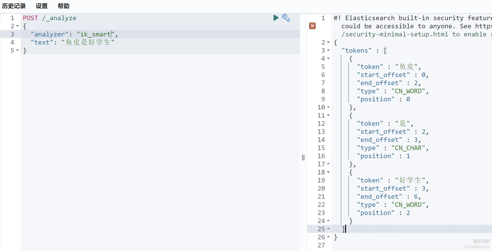

这两种分词器如何选用呢？其实可以结合：

- `ik_smart`：适用于 **搜索分词**，即在查询时使用，保证性能的同时提供合理的分词精度。
- `ik_max_word`：适用于 **底层索引分词**，确保在建立索引时尽可能多地分词，提高查询时的匹配度和覆盖面。

下面就来实战下 ES 索引的设计吧~

💡 思考：有些时候 IK 识别词汇不准，比如不认识“程序员鱼皮”，怎么样让 IK 按自己的规则分词？

解决方案：插件支持自定义词典。可以按照 [官方文档](https://github.com/infinilabs/analysis-ik/tree/v7.17.18?tab=readme-ov-file#dictionary-configuration) 配置。

#### 2、设计 ES 索引

为了将 MySQL 题目表数据导入到 Elasticsearch 中并实现分词搜索，需要为 ES 索引定义 `mapping`。ES 的 `mapping` 用于定义字段的类型、分词器及其索引方式。

相当于数据库的建表，数据库建表时我们要考虑索引，同样 Elasticsearch 建立索引时，要考虑到字段选取、分词器、字段格式等问题。

基于我们数据库的表结构和需求，我们可以定义 title、content、answer 等字段使用分词搜索，同时为其他字段指定适当的类型。以下是本项目的 `mapping` 定义：

```json
{
  "mappings": {
    "properties": {
      "title": {
        "type": "text",
        "analyzer": "ik_max_word",
        "search_analyzer": "ik_smart",
        "fields": {
          "keyword": {
            "type": "keyword",
            "ignore_above": 256
          }
        }
      },
      "content": {
        "type": "text",
        "analyzer": "ik_max_word",
        "search_analyzer": "ik_smart"
      },
      "tags": {
        "type": "keyword"
      },
      "answer": {
        "type": "text",
        "analyzer": "ik_max_word",
        "search_analyzer": "ik_smart"
      },
      "userId": {
        "type": "long"
      },
      "editTime": {
        "type": "date",
        "format": "yyyy-MM-dd HH:mm:ss"
      },
      "createTime": {
        "type": "date",
        "format": "yyyy-MM-dd HH:mm:ss"
      },
      "updateTime": {
        "type": "date",
        "format": "yyyy-MM-dd HH:mm:ss"
      },
      "isDelete": {
        "type": "keyword"
      }
    }
  }
}
```

**各字段的类型选择和考虑：**

1）title、content、answer：

这些字段被定义为 `text` 类型，适合存储较长的、需要全文搜索的内容。由于会有中文内容，所以使用了 IK 中文分词器进行分词处理，以提高查询的灵活性和匹配度。

- `analyzer: ik_max_word`：用于索引时进行最大粒度的分词，生成较多词语，适合在查询时提高召回率。
- `search_analyzer: ik_smart`：用于搜索时进行较智能的分词，生成较少的词语，通常用于提高搜索精度。

2）title.keyword：为 `title` 字段增加了一个子字段 `keyword`，用于存储未分词的标题，支持精确匹配。它还配置了 `ignore_above: 256`，表示如果 title 字段的长度超过 256 个字符，将不会为 keyword 字段进行索引。因为题目的标题一般不会很长，很少会对过长的标题进行精确匹配，所以用这一设置来避免过长文本导致的性能问题。

3）tags：标签通常是预定义的、用于分类或标签筛选的关键字，通常不需要分词。设置为 `keyword` 类型以便支持精确匹配和聚合操作（例如统计某标签的出现频次）。`keyword` 不进行分词，因此适合存储不变的、结构化的数据。

4）userId：用来唯一标识用户的数值字段。在 Elasticsearch 中，数值类型（如 `long`）非常适合用于精确查询、排序和范围过滤。与字符串相比，数值类型的查询和存储效率更高，尤其是对于大量用户数据的查询。

5）editTime、createTime、updateTime：时间字段被定义为 `date` 类型，并指定了格式 `"yyyy-MM-dd HH:mm:ss"`。这样做的好处是 Elasticsearch 可以基于这些字段进行时间范围查询、排序和聚合操作，如按时间过滤或统计某时间段的数据。

6）isDelete：使用 keyword 类型，表示是否被删除。 因为 keyword 是为精确匹配设计的，适用于枚举值精确查询的场景，性能好且清晰。

为什么不用 boolean 类型呢？因为 MySQL 数据库存储的是 0 和 1，写入 ES 时需要转换类型。

**为什么不显示指定 id 字段？**

在 Elasticsearch 中，每个文档都有一个唯一的 `_id` 字段来标识文档，该字段用于文档的主键索引和唯一标识。通常，开发者并不需要显式定义 `id` 字段，因为 Elasticsearch 会自动生成 `_id`，或者在插入数据时，你可以手动指定 `_id`。

由于 `_id` 是 Elasticsearch 内部的系统字段，它默认存在并作为主键使用，因此在 mappings 中通常不需要显式定义。如果你想让某个字段（如 userId 或其他唯一标识）作为 `_id`，可以在插入文档时指定该字段的值作为 `_id`。比如：

```bash
PUT /index/_doc/<custom_id>
{
  "userId": 1001,
  "title": "Example"
}
```

**日期字段为什么要格式化？**

日期字段的格式化（`format: "yyyy-MM-dd HH:mm:ss"`）有以下几个考虑：

1. 一致性：定义日期字段的格式可以确保所有插入的日期数据都是一致的，避免因不同的日期格式导致解析错误。例如，Elasticsearch 默认可以支持多种日期格式，但如果不定义明确的格式，可能会导致不一致的日期解析。
2. 优化查询：格式化日期后，Elasticsearch 知道该如何存储和索引这些时间数据，从而可以高效地执行基于日期的范围查询、过滤和排序操作。明确的格式定义还可以帮助 Elasticsearch 进行更优化的存储和压缩。
3. 避免歧义：没有明确格式的日期可能导致歧义，比如 `"2023-09-03"` 是日期，还是年份？加上时间部分（如 `"yyyy-MM-dd HH:mm:ss"`）可以更明确地表明时间的精度，便于进行更精确的查询。

**tags 支持数组么？为什么**

在 Elasticsearch 中，所有的字段类型（包括 `keyword` 和 `text`）默认都支持数组。你可以直接插入一个包含多个值的数组，Elasticsearch 会自动将其视为多个值的集合。例如，以下文档中，tags 字段是一个数组：

```json
{
  "title": "How to learn Elasticsearch",
  "tags": ["Elasticsearch", "Search", "Database"]
}
```

在查询时，Elasticsearch 会将数组中的每个值视为独立的 `keyword`，可以进行精确匹配。

#### 3、新建 ES 索引

可以通过如下命令创建索引，在 Kibana 开发者工具中执行、或者用 CURL 调用 Elasticsearch 执行均可：

```bash
PUT /question_v1
{
  "mappings": {
    "properties": {
      ...
    }
  }
}
```

但是有一点要注意，推荐在创建索引时添加 alias（别名） ，因为它提供了灵活性和简化索引管理的能力。具体原因如下：

1. 零停机切换索引：在更新索引或重新索引数据时，你可以创建一个新索引并使用 alias 切换到新索引，而不需要修改客户端查询代码，避免停机或中断服务。
2. 简化查询：通过 alias，可以使用一个统一的名称进行查询，而不需要记住具体的索引名称（尤其当索引有版本号或时间戳时）。
3. 索引分组：alias 可以指向多个索引，方便对多个索引进行联合查询，例如用于跨时间段的日志查询或数据归档。

其中，第一个是重点，举个例子，在创建索引时添加 alias：

```json
PUT /my_index_v1
{
  "aliases": {
    "my_index": {}
  }
}
```

这个 alias 可以在后续版本中指向新的索引（如 my_index_v2），无需更改查询逻辑，查询时仍然使用 my_index。

所以，我们要执行的完整命令如下，可以放到后端项目目录中进行备份：

```json
PUT /question_v1
{
  "aliases": {
    "question": {}
  },
  "mappings": {
    "properties": {
      "title": {
        "type": "text",
        "analyzer": "ik_max_word",
        "search_analyzer": "ik_smart",
        "fields": {
          "keyword": {
            "type": "keyword",
            "ignore_above": 256
          }
        }
      },
      "content": {
        "type": "text",
        "analyzer": "ik_max_word",
        "search_analyzer": "ik_smart"
      },
      "tags": {
        "type": "keyword"
      },
      "answer": {
        "type": "text",
        "analyzer": "ik_max_word",
        "search_analyzer": "ik_smart"
      },
      "userId": {
        "type": "long"
      },
      "editTime": {
        "type": "date",
        "format": "yyyy-MM-dd HH:mm:ss"
      },
      "createTime": {
        "type": "date",
        "format": "yyyy-MM-dd HH:mm:ss"
      },
      "updateTime": {
        "type": "date",
        "format": "yyyy-MM-dd HH:mm:ss"
      },
      "isDelete": {
        "type": "keyword"
      }
    }
  }
}
```

创建索引成功：

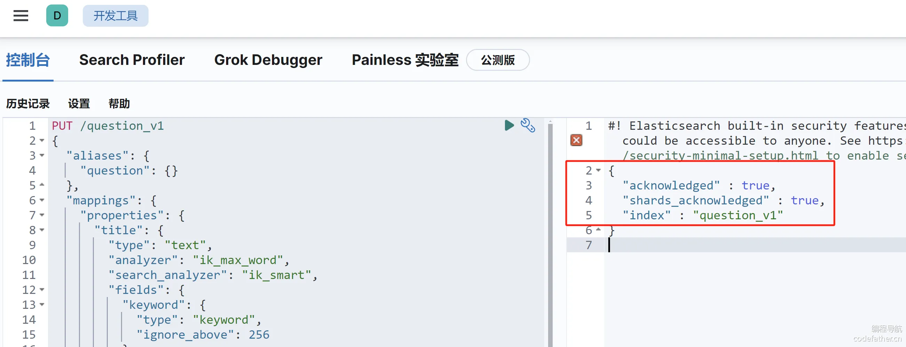

#### 4、引入 ES 客户端

在 Spring Boot 项目中，可以通过 Starter 快速引入 Elasticsearch，非常方便：

1）在 pom.xml 中引入：

```xml
<!-- elasticsearch-->
<dependency>
    <groupId>org.springframework.boot</groupId>
    <artifactId>spring-boot-starter-data-elasticsearch</artifactId>
</dependency>
```

2）修改项目 yml 配置：

```yaml
spring:
  elasticsearch:
    uris: http://xxx:9200
    username: elastic
    password: coder_yupi_swag
```

3）使用 Spring Data Elasticsearch 提供的 Bean 即可操作 Elasticsearch，可以直接通过 @Resource 注解引入：

```java
@Resource
private ElasticsearchRestTemplate elasticsearchRestTemplate;
```

4）编写一个单元测试文件，验证对于 Elasticsearch 的增删改查基本操作。像鱼皮是使用了 AI 工具来自动生成了单元测试文件：

```java
package com.yupi.mianshiya.es;

import org.junit.jupiter.api.Test;
import org.springframework.beans.factory.annotation.Autowired;
import org.springframework.boot.test.context.SpringBootTest;
import org.springframework.data.elasticsearch.core.ElasticsearchRestTemplate;
import org.springframework.data.elasticsearch.core.IndexOperations;
import org.springframework.data.elasticsearch.core.document.Document;
import org.springframework.data.elasticsearch.core.query.*;
import org.springframework.data.elasticsearch.core.mapping.IndexCoordinates;

import java.util.HashMap;
import java.util.Map;

import static org.assertj.core.api.Assertions.assertThat;

@SpringBootTest
public class ElasticsearchRestTemplateTest {

    @Autowired
    private ElasticsearchRestTemplate elasticsearchRestTemplate;

    private final String INDEX_NAME = "test_index";

    // Index (Create) a document
    @Test
    public void indexDocument() {
        Map<String, Object> doc = new HashMap<>();
        doc.put("title", "Elasticsearch Introduction");
        doc.put("content", "Learn Elasticsearch basics and advanced usage.");
        doc.put("tags", "elasticsearch,search");
        doc.put("answer", "Yes");
        doc.put("userId", 1L);
        doc.put("editTime", "2023-09-01 10:00:00");
        doc.put("createTime", "2023-09-01 09:00:00");
        doc.put("updateTime", "2023-09-01 09:10:00");
        doc.put("isDelete", false);

        IndexQuery indexQuery = new IndexQueryBuilder().withId("1").withObject(doc).build();
        String documentId = elasticsearchRestTemplate.index(indexQuery, IndexCoordinates.of(INDEX_NAME));

        assertThat(documentId).isNotNull();
    }

    // Get (Retrieve) a document by ID
    @Test
    public void getDocument() {
        String documentId = "1";  // Replace with the actual ID of an indexed document

        Map<String, Object> document = elasticsearchRestTemplate.get(documentId, Map.class, IndexCoordinates.of(INDEX_NAME));

        assertThat(document).isNotNull();
        assertThat(document.get("title")).isEqualTo("Elasticsearch Introduction");
    }

    // Update a document
    @Test
    public void updateDocument() {
        String documentId = "1";  // Replace with the actual ID of an indexed document

        Map<String, Object> updates = new HashMap<>();
        updates.put("title", "Updated Elasticsearch Title");
        updates.put("updateTime", "2023-09-01 10:30:00");

        UpdateQuery updateQuery = UpdateQuery.builder(documentId)
                .withDocument(Document.from(updates))
                .build();

        elasticsearchRestTemplate.update(updateQuery, IndexCoordinates.of(INDEX_NAME));

        Map<String, Object> updatedDocument = elasticsearchRestTemplate.get(documentId, Map.class, IndexCoordinates.of(INDEX_NAME));
        assertThat(updatedDocument.get("title")).isEqualTo("Updated Elasticsearch Title");
    }

    // Delete a document
    @Test
    public void deleteDocument() {
        String documentId = "1";  // Replace with the actual ID of an indexed document

        String result = elasticsearchRestTemplate.delete(documentId, IndexCoordinates.of(INDEX_NAME));
        assertThat(result).isNotNull();
    }

    // Delete the entire index
    @Test
    public void deleteIndex() {
        IndexOperations indexOps = elasticsearchRestTemplate.indexOps(IndexCoordinates.of(INDEX_NAME));
        boolean deleted = indexOps.delete();
        assertThat(deleted).isTrue();
    }
}
```

由于单元测试的执行顺序问题，批量执行时，可能会有部分报错，是正常现象，也可以一个一个手动执行测试。


可以使用 Kibana 开发者工具来查看数据情况：

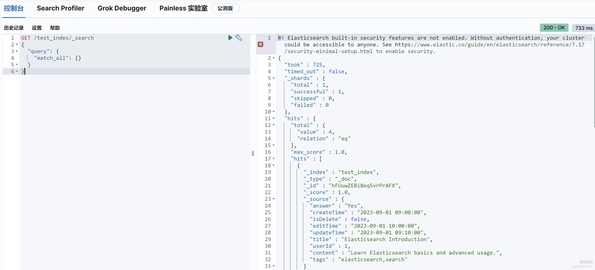

几个注意事项：

1. 当你向一个不存在的索引中插入数据时，Elasticsearch 会根据文档内容自动推断字段类型，并为这些字段创建映射。这就是 ES 的 **动态映射**（Dynamic Mapping）功能。然而，这种自动生成的映射有一些局限性，可能导致字段类型不够规范。
2. ES 中，_开头的字段表示系统默认字段，比如 _id，如果系统不指定，会自动生成。但是不会在 _source 字段中补充 id 的值，所以建议大家手动指定，让数据更完整。
3. ES 插入和更新数据没有 MySQL 那么严格，尤其是在动态 Mapping 模式下，只要指定了相同的文档 id，ES 允许动态添加字段和更新文档。

------

通过这个单元测试，我们也能基本了解 Spring Data Elasticsearch 操作 ES 的方法：

1. 构造一个 Query 对象，比如插入数据使用 IndexQuery，更新数据使用 UpdateQuery
2. 调用 elasticsearchRestTemplate 的增删改查方法，传入 Query 对象和要操作的索引作为参数
3. 对返回值进行处理

示例代码如下：

```java
Map<String, Object> updates = new HashMap<>();
updates.put("title", "Updated Elasticsearch Title");
updates.put("updateTime", "2023-09-01 10:30:00");

UpdateQuery updateQuery = UpdateQuery.builder(documentId)
        .withDocument(Document.from(updates))
        .build();

elasticsearchRestTemplate.update(updateQuery, IndexCoordinates.of(INDEX_NAME));

Map<String, Object> updatedDocument = elasticsearchRestTemplate.get(documentId, Map.class, IndexCoordinates.of(INDEX_NAME));
```

但是有个问题，我们上述代码都是用 Map 来传递数据。记得之前使用 MyBatis 操作数据库的时候，都要定义一个数据库实体类，然后把参数传给这个实体类的对象就可以了，会更方便和规范。

没错，Spring Data Elasticsearch 也是支持这种标准 Dao 层开发方式的，下面就来使用一下。

#### 5、编写 ES Dao 层

1）在 `model.dto.question` 包中定义和 ES 对应的实体类：

```java
@Document(indexName = "question")
@Data
public class QuestionEsDTO implements Serializable {

    private static final String DATE_TIME_PATTERN = "yyyy-MM-dd HH:mm:ss";

    /**
     * id
     */
    @Id
    private Long id;

    /**
     * 标题
     */
    private String title;

    /**
     * 内容
     */
    private String content;

    /**
     * 答案
     */
    private String answer;

    /**
     * 标签列表
     */
    private List<String> tags;

    /**
     * 创建用户 id
     */
    private Long userId;

    /**
     * 创建时间
     */
    @Field(type = FieldType.Date, format = {}, pattern = DATE_TIME_PATTERN)
    private Date createTime;

    /**
     * 更新时间
     */
    @Field(type = FieldType.Date, format = {}, pattern = DATE_TIME_PATTERN)
    private Date updateTime;

    /**
     * 是否删除
     */
    private Integer isDelete;

    private static final long serialVersionUID = 1L;

    /**
     * 对象转包装类
     *
     * @param question
     * @return
     */
    public static QuestionEsDTO objToDto(Question question) {
        if (question == null) {
            return null;
        }
        QuestionEsDTO questionEsDTO = new QuestionEsDTO();
        BeanUtils.copyProperties(question, questionEsDTO);
        String tagsStr = question.getTags();
        if (StringUtils.isNotBlank(tagsStr)) {
            questionEsDTO.setTags(JSONUtil.toList(tagsStr, String.class));
        }
        return questionEsDTO;
    }

    /**
     * 包装类转对象
     *
     * @param questionEsDTO
     * @return
     */
    public static Question dtoToObj(QuestionEsDTO questionEsDTO) {
        if (questionEsDTO == null) {
            return null;
        }
        Question question = new Question();
        BeanUtils.copyProperties(questionEsDTO, question);
        List<String> tagList = questionEsDTO.getTags();
        if (CollUtil.isNotEmpty(tagList)) {
            question.setTags(JSONUtil.toJsonStr(tagList));
        }
        return question;
    }
}
```

2）定义 Dao 层

可以在 esdao 包中统一存放对 Elasticsearch 的操作，只需要继承 ElasticsearchRepository 类即可。

代码如下：

```java
/**
 * 题目 ES 操作
 */
public interface QuestionEsDao 
    extends ElasticsearchRepository<QuestionEsDTO, Long> {

}
```

ElasticsearchRepository 类为我们提供了大量现成的 CRUD 操作：


而且还支持根据方法名自动映射为查询操作，比如在 QuestionEsDao 中定义下列方法，就会自动根据 userId 查询数据。

```java
/**
 * 根据用户 id 查询
 * @param userId
 * @return
 */
List<QuestionEsDTO> findByUserId(Long userId);
```

可以编写一个单元测试来验证：

```java
@SpringBootTest
class QuestionEsDaoTest {

    @Resource
    private QuestionEsDao questionEsDao;

    @Test
    void findByUserId() {
        questionEsDao.findByUserId(1L);
    }
}
```

具体的方法名和查询条件的映射规则见 [官方文档](https://docs.spring.io/spring-data/elasticsearch/docs/4.4.2/reference/html/#repositories)。

------

目前我们学到了 2 种 Spring Data Elasticsearch 的使用方法，应该如何选择呢？

- 第 1 种方式：Spring 默认给我们提供的操作 es 的客户端对象 ElasticsearchRestTemplate，也提供了增删改查，它的增删改查更灵活，**适用于更复杂的操作**，返回结果更完整，但需要自己解析。
- 第 2 种方式：ElasticsearchRepository<Entity, IdType>，默认提供了更简单易用的增删改查，返回结果也更直接。**适用于可预期的、相对简单的操作** 。

#### 6、向 ES 全量写入数据

可以通过编写单次执行的任务，将 MySQL 中题目表的数据，全量写入到 Elasticsearch。

可以通过实现 CommandLineRunner 接口定义单次任务，也可以编写一个仅管理员可用的接口，根据需要选择就好。

在 `job/once` 目录下编写任务：

```java
// todo 取消注释开启任务
@Component
@Slf4j
public class FullSyncQuestionToEs implements CommandLineRunner {

    @Resource
    private QuestionService questionService;

    @Resource
    private QuestionEsDao questionEsDao;

    @Override
    public void run(String... args) {
        // 全量获取题目（数据量不大的情况下使用）
        List<Question> questionList = questionService.list();
        if (CollUtil.isEmpty(questionList)) {
            return;
        }
        // 转为 ES 实体类
        List<QuestionEsDTO> questionEsDTOList = questionList.stream()
                .map(QuestionEsDTO::objToDto)
                .collect(Collectors.toList());
        // 分页批量插入到 ES
        final int pageSize = 500;
        int total = questionEsDTOList.size();
        log.info("FullSyncQuestionToEs start, total {}", total);
        for (int i = 0; i < total; i += pageSize) {
            // 注意同步的数据下标不能超过总数据量
            int end = Math.min(i + pageSize, total);
            log.info("sync from {} to {}", i, end);
            questionEsDao.saveAll(questionEsDTOList.subList(i, end));
        }
        log.info("FullSyncQuestionToEs end, total {}", total);
    }
}
```

启动项目，然后用 Kibana 开发工具查看所有数据，发现写入成功：


#### 7、开发 ES 搜索

1）QuestionService 新增查询接口：

```java
/**
 * 从 ES 查询题目
 *
 * @param questionQueryRequest
 * @return
 */
Page<Question> searchFromEs(QuestionQueryRequest questionQueryRequest);
```

2）编写实现方法

由于查询逻辑较为复杂，为了保证灵活性，选用 ElasticsearchRestTemplate 开发。

需要支持现有的题目查询条件，搜索方法代码如下：

```java
@Override
public Page<Question> searchFromEs(QuestionQueryRequest questionQueryRequest) {
    // 获取参数
    Long id = questionQueryRequest.getId();
    Long notId = questionQueryRequest.getNotId();
    String searchText = questionQueryRequest.getSearchText();
    List<String> tags = questionQueryRequest.getTags();
    Long questionBankId = questionQueryRequest.getQuestionBankId();
    Long userId = questionQueryRequest.getUserId();
    // 注意，ES 的起始页为 0
    int current = questionQueryRequest.getCurrent() - 1;
    int pageSize = questionQueryRequest.getPageSize();
    String sortField = questionQueryRequest.getSortField();
    String sortOrder = questionQueryRequest.getSortOrder();

    // 构造查询条件
    BoolQueryBuilder boolQueryBuilder = QueryBuilders.boolQuery();
    // 过滤
    boolQueryBuilder.filter(QueryBuilders.termQuery("isDelete", 0));
    if (id != null) {
        boolQueryBuilder.filter(QueryBuilders.termQuery("id", id));
    }
    if (notId != null) {
        boolQueryBuilder.mustNot(QueryBuilders.termQuery("id", notId));
    }
    if (userId != null) {
        boolQueryBuilder.filter(QueryBuilders.termQuery("userId", userId));
    }
    if (questionBankId != null) {
        boolQueryBuilder.filter(QueryBuilders.termQuery("questionBankId", questionBankId));
    }
    // 必须包含所有标签
    if (CollUtil.isNotEmpty(tags)) {
        for (String tag : tags) {
            boolQueryBuilder.filter(QueryBuilders.termQuery("tags", tag));
        }
    }
    // 按关键词检索
    if (StringUtils.isNotBlank(searchText)) {
        boolQueryBuilder.should(QueryBuilders.matchQuery("title", searchText));
        boolQueryBuilder.should(QueryBuilders.matchQuery("content", searchText));
        boolQueryBuilder.should(QueryBuilders.matchQuery("answer", searchText));
        boolQueryBuilder.minimumShouldMatch(1);
    }
    // 排序
    SortBuilder<?> sortBuilder = SortBuilders.scoreSort();
    if (StringUtils.isNotBlank(sortField)) {
        sortBuilder = SortBuilders.fieldSort(sortField);
        sortBuilder.order(CommonConstant.SORT_ORDER_ASC.equals(sortOrder) ? SortOrder.ASC : SortOrder.DESC);
    }
    // 分页
    PageRequest pageRequest = PageRequest.of(current, pageSize);
    // 构造查询
    NativeSearchQuery searchQuery = new NativeSearchQueryBuilder()
            .withQuery(boolQueryBuilder)
            .withPageable(pageRequest)
            .withSorts(sortBuilder)
            .build();
    SearchHits<QuestionEsDTO> searchHits = elasticsearchRestTemplate.search(searchQuery, QuestionEsDTO.class);
    // 复用 MySQL 的分页对象，封装返回结果
    Page<Question> page = new Page<>();
    page.setTotal(searchHits.getTotalHits());
    List<Question> resourceList = new ArrayList<>();
    if (searchHits.hasSearchHits()) {
        List<SearchHit<QuestionEsDTO>> searchHitList = searchHits.getSearchHits();
        for (SearchHit<QuestionEsDTO> questionEsDTOSearchHit : searchHitList) {
            resourceList.add(QuestionEsDTO.dtoToObj(questionEsDTOSearchHit.getContent()));
        }
    }
    page.setRecords(resourceList);
    return page;
}
```

虽然看上去复杂，但不涉及什么逻辑，根据查询需求选择合适的搜索方法，不断构造搜索条件即可。

3）在 QuestionController 编写新的搜索接口：

```java
@PostMapping("/search/page/vo")
public BaseResponse<Page<QuestionVO>> searchQuestionVOByPage(@RequestBody QuestionQueryRequest questionQueryRequest,
                                                     HttpServletRequest request) {
    long size = questionQueryRequest.getPageSize();
    // 限制爬虫
    ThrowUtils.throwIf(size > 200, ErrorCode.PARAMS_ERROR);
    Page<Question> questionPage = questionService.searchFromEs(questionQueryRequest);
    return ResultUtils.success(questionService.getQuestionVOPage(questionPage, request));
}
```

4）然后可以通过 Swagger 接口文档进行测试。

#### 8、数据同步

根据之前的方案设计，通过定时任务进行增量同步，每分钟同步过去 5 分钟内数据库发生修改的题目数据。

注意，如果使用 MyBatis Plus 提供的 mapper 方法，查询时会默认过滤掉 isDelete = 1（逻辑已删除）的数据，而我们的需求是让 ES 和 MySQL 完全同步，所以需要在 QuestionMapper 中编写一个能查询出 isDelete = 1 数据的方法。

1）编写查询某个时间后更新的所有题目的方法：

```java
public interface QuestionMapper extends BaseMapper<Question> {

    /**
     * 查询题目列表（包括已被删除的数据）
     */
    @Select("select * from question where updateTime >= #{minUpdateTime}")
    List<Question> listQuestionWithDelete(Date minUpdateTime);
}
```

2）在 `job/cycle` 下编写增量同步到 ES 的定时任务：

```java
// todo 取消注释开启任务
//@Component
@Slf4j
public class IncSyncQuestionToEs {

    @Resource
    private QuestionMapper questionMapper;

    @Resource
    private QuestionEsDao questionEsDao;

    /**
     * 每分钟执行一次
     */
    @Scheduled(fixedRate = 60 * 1000)
    public void run() {
        // 查询近 5 分钟内的数据
        long FIVE_MINUTES = 5 * 60 * 1000L;
        Date fiveMinutesAgoDate = new Date(new Date().getTime() - FIVE_MINUTES);
        List<Question> questionList = questionMapper.listQuestionWithDelete(fiveMinutesAgoDate);
        if (CollUtil.isEmpty(questionList)) {
            log.info("no inc question");
            return;
        }
        List<QuestionEsDTO> questionEsDTOList = questionList.stream()
                .map(QuestionEsDTO::objToDto)
                .collect(Collectors.toList());
        final int pageSize = 500;
        int total = questionEsDTOList.size();
        log.info("IncSyncQuestionToEs start, total {}", total);
        for (int i = 0; i < total; i += pageSize) {
            int end = Math.min(i + pageSize, total);
            log.info("sync from {} to {}", i, end);
            questionEsDao.saveAll(questionEsDTOList.subList(i, end));
        }
        log.info("IncSyncQuestionToEs end, total {}", total);
    }
}
```

3）尝试修改部分数据，通过日志查看定时任务同步是否生效：


# 扩展

## ES版本选择


不同版本的ES差异非常大，包括不局限于ES语 法、架构、API、集群搭建等等。这些差异足以导致不同版本是否能满足你的业务场景以及后续开发维护成本等各种问题。

**先说结论，以个人实践经验及综合考虑推荐使用 7.x 版本中的 7.10版本**

### ES版本对比

以下是通过网上大量资料搜索整理对比了对各个版本差异汇总出的一个表格

| **类型\版本**     | **6.x**                        | **7.x**                                                      | **8.x**                                                      | **建议**                                                     |
| ----------------- | ------------------------------ | ------------------------------------------------------------ | ------------------------------------------------------------ | ------------------------------------------------------------ |
| Licence           | Apache 2.0                     | 7.0 ~ 7.10 Apache 2.07.11++ SSPL                             | SSPL                                                         | 建议选择更友好的Apache2.0版本,SSPL协议对于想要让ES做为PAAS对外提供服务的话，将会面临es厂商的限制 |
| 云厂商支持程度    | 腾讯、阿里云均支持，华为不支持 | 腾讯云支持7.10.1、7.14.2阿里云ES普通版支持7.7、7.10、7.16阿里云ES Serverless只支持7.10.x华为云支持7.6.2, 7.10.2 | 腾讯支持 8.11.3阿里云ES普通版支持8.5、8.9华为不支持          | 各云厂商也主要在推广7.x版本，稳定性及占用率更高，建议选择7.x中的7.10.0版本 |
| 发版时间          | 初版2016                       | 2019年                                                       | 2021年底                                                     | 建议选择7.x版本，经历将近4年，稳定性已经经过验证，6.x和8.x一个太老一个太新 |
| 特性差异          | /                              | 集群配置简化，master选举进行了优化，能够避免集群脑裂问题;索引创建已经去除了type，更加简化;索引查询算法升级，查询性能有优化;提供安全策略;Kibana更轻量化，更易用; | ES API进行了升级方便后续升级使用;更加安全，es默认开启了一些安全功能;新的搜索API 特性，比如支持NLP等; | 7.x基本也能满足目前需求,稳定性也更有保障                     |
| JDK版本           | Java 8                         | 7.0.x-7.4.x 支持87.5.x-7.14.x 支持8-117.15.x-7.17.x 支持8/11/17 |                                                              |                                                              |
| Spring Boot兼容性 | 2.1 ~ 2.2版本对6.x支持         | 2.3 ~ 2.7版本对7.x支持                                       | /                                                            | 这块主要看你Spring Boot框架版本了                            |

### ES客户端SDK版本选择

**结论 ：使用spring官方提供的spring-boot-es-starter**

**以下为各种客户端对比**

| **客户端**                      | **适用版本** | **优点**                                                     | **缺点**                                                     | **建议**          |
| ------------------------------- | ------------ | ------------------------------------------------------------ | ------------------------------------------------------------ | ----------------- |
| TransportClient                 | 5.x6.x       | 启动速度快，轻量级，可创建极多连接，与应用程序解耦；推荐使用原生的，ES本身就很简单，灵活性很高 | 分发或查询数据速度较慢，不能获取指定节点数据，高版本已经废弃 | 不建议使用        |
| JestClient                      | 5.x6.x7.x    | 提供Restful API， 原生ES API不具备；若ES集群使用不同的ES版本，使用原生ES API会有问题，而Jest不会；更安全（可以在Http层添加安全处理）；JestClient是ElasticSearch的Java HTTP Rest客户端； JestClient填补了 ElasticSearch缺少HttpRest接口客户端的空白; JestClient可以跨版本 | 18年已经停止更新，7.x、8.x版本兼容性存疑                     | 不建议使用        |
| RestClientlow-level-rest-client | 5.0+         | 基于Http Client 进行的简单封装，RestClient可以跨版本，支持到目前8.x所有版本。 | HttpClient和Jsoup都不直接支持发送DELETE方法带参数的请求（官方高版本已经放弃使用）。使用成本较高 | 不推荐            |
| high-level-rest-client          | 7.2.0-7.16.x | 官方基于RestClient进行的封装，提供一系列API方便对ES的使用    | 在7.17版本后官方又废弃了                                     | 7部分版本推荐使用 |
| New ElasticsearchClient         | 7.17+        | 为最新官方提供的版本                                         | 较高版本es适用                                               | 8.x官方推荐使用   |
| spring-boot-es-starter          | 3.0+         | spring官方封装的ES api，使用起来相对简单,也spring兼容性也能保障，教程也比较多。 | 需要与使用的es版本进行匹配                                   | 推荐使用          |


## Elasticsearch新老版本RestAPI

### 版本

版本内容基于`elasticsearch-7.6.1`。部分API可能会和低版本不一致，而且低版本的elasticsearch 支持多个type，7.0 之后已经移除type概念，默认情况下type有且只能有一个： `_doc`。 应该是为了兼容以前的版本，部分关于type的API依旧可以使用，通常还会会给出Deprecation提示。 在elasticsearch8.X中已经移除了类型（type）

### 创建文档

_index、_type（7.x 已固定）、_id三者唯一确定一个具体文档。 如同数据库数据一样，数据库库、表、主键值唯一确定一条数据。

对于elasticsearch 因为是分布式服务，没有提供自增主键，故需要我们手动指定主键ID或者 es使用特定算法生成主键

#### 自动生成唯一_id

上面提到过 7.0后仅支持 _doc 这一种type， 实际使用时会发现依旧可以创建一个额外的type，但是会有Deprecation提示，不建议这么做，先以创建为例 自动生成ID 为例

##### 7.0 以后

```java
POST  person/_doc
{
    "name":"test",
    "age":256,
    "sex":"男"
}
```

返回结果

```json
{
  "_index" : "person",
  "_type" : "_doc",
  "_id" : "F1YBNH8B6e0WzfSClmq1",
  "_version" : 1,
  "result" : "created",
  "_shards" : {
    "total" : 2,
    "successful" : 1,
    "failed" : 0
  },
  "_seq_no" : 0,
  "_primary_term" : 1
}
```

##### 7.0 版本之前

```json
POST  person/doc
{
    "name":"test",
    "age":20,
    "sex":"男"
}
```

因为现在是elasticsearch-7.6.1 版本，故在Kibana上操作上述语句，则会出现以下提示。 但是依旧执行成功了

> \#! Deprecation: [types removal] Specifying types in search requests is deprecated, use the typeless endpoints instead (/{index}/_doc/{id}, /{index}/_doc, or /{index}/_create/{id})

```json
{
  "_index" : "person",
  "_type" : "doc",
  "_id" : "FFbwM38B6e0WzfSCzGrE",
  "_version" : 1,
  "result" : "created",
  "_shards" : {
    "total" : 2,
    "successful" : 1,
    "failed" : 0
  },
  "_seq_no" : 0,
  "_primary_term" : 1
}
```

使用搜索语句时也会提示 type 已移除

> GET person/doc/_search

> \#! Deprecation: [types removal] Specifying types in document get requests is deprecated, use the /{index}/_doc/{id} endpoint instead.

并且会发现使用 _doc 确实可以访问到数据

```yml
GET person/_doc/FFbwM38B6e0WzfSCzGrE
{
  "_index" : "person",
  "_type" : "_doc",
  "_id" : "FFbwM38B6e0WzfSCzGrE",
  "_version" : 1,
  "_seq_no" : 0,
  "_primary_term" : 1,
  "found" : true,
  "_source" : {
    "name" : "test",
    "age" : 256,
    "sex" : "男"
  }
}
```

#### 自定义 _id

这三种写法都支持PUT请求方式

**第一种写法**

```java
POST  person/_create/2
{
    "name":"test",
    "age":256,
    "sex":"男"
}
```

返回结果

```json
{
  "_index" : "person",
  "_type" : "_doc",
  "_id" : "2",
  "_version" : 1,
  "result" : "created",
  "_shards" : {
    "total" : 2,
    "successful" : 1,
    "failed" : 0
  },
  "_seq_no" : 2,
  "_primary_term" : 1
}
```

- 当文档id不存在时，创建文档
- 当文档Id存在时，抛出异常

**第二种写法**

```curl
POST person/_doc/1/_create
```

**第三种写法**

```curl
POST person/_doc/2?op_type=create
```

**第四种写法**
该方式， id不存在是创建文档，存在时更新文档

```java
POST  person/_doc/2
{ "name":"test"}
```

##### 异常

前三种方式调用多次，会抛出以下异常信息

> **version conflict, document already exists (current version [1])**

因为如果ID已存在，再次调用则会报错。 状态码409

```json
{
  "error": {
    "root_cause": [
      {
        "type": "version_conflict_engine_exception",
        "reason": "[2]: version conflict, document already exists (current version [1])",
        "index_uuid": "rkGDBwl6SCuWSX2UbrVm7Q",
        "shard": "0",
        "index": "person"
      }
    ],
    "type": "version_conflict_engine_exception",
    "reason": "[2]: version conflict, document already exists (current version [1])",
    "index_uuid": "rkGDBwl6SCuWSX2UbrVm7Q",
    "shard": "0",
    "index": "person"
  },
  "status": 409
}
```

> [2]: version conflict, document already exists (current version [1])

【2】中的就是自定义ID

#### 批量插入

批量操作语法

```yml
POST _bulk
{"actionName":{"_index":"indexName","_type":"_doc", "_id":"id"}}
{"field1":"value1","field2":"value2"}
```

actionName 为操作类型：

- create： 创建文档。文档id已存在会冲突抛出异常
- index： 替换文档（创建|更新）。id已存在会替换
- delete：删除文档
- update: 局部更新

批量操作可以同时操作多个不同的索引。 如果是操作某个固定的索引，可以将索引添加中url中，同时在请求体中可以省略这一部分。

**第一种写法**

```java
POST person/_bulk
{"index":{"_id":"6"}}
{"name":"a","age":25,"sex":"男"}
{"index":{"_id":"6"}}
{"name":"b","age":25,"sex":"女"}
```

id为6的数据执行了两次，两次执行都成功。且最后的结果为最后一条数据。

```json
  "_source" : {
    "name" : "b",
    "age" : 25,
    "sex" : "女"
  }
```

**第二种写法**

```java
POST person/_bulk
{"create":{"_id":"7"}}
{"name":"a","age":25,"sex":"男"}
{"create":{"_id":"7"}}
{"name":"b","age":25,"sex":"女"}
```

id为7 的执行了两此，第一条指定成功， 第二条执行失败

```json
{
  "took" : 5,
  "errors" : true,
  "items" : [
    {
      "create" : {
        "_index" : "person",
        "_type" : "_doc",
        "_id" : "7",
        "_version" : 1,
        "result" : "created",
        "_shards" : {
          "total" : 2,
          "successful" : 1,
          "failed" : 0
        },
        "_seq_no" : 12,
        "_primary_term" : 3,
        "status" : 201
      }
    },
    {
      "create" : {
        "_index" : "person",
        "_type" : "_doc",
        "_id" : "7",
        "status" : 409,
        "error" : {
          "type" : "version_conflict_engine_exception",
          "reason" : "[7]: version conflict, document already exists (current version [3])",
          "index_uuid" : "QN2oJb_FSF-2ePQesU11aQ",
          "shard" : "0",
          "index" : "person"
        }
      }
    }
  ]
}
```

### 删除文档

```
DELETE  person/_doc/1
```

同样的7.0后的版本， 如果指定了其他 type类型。删除会存在提示

> \#! Deprecation: [types removal] Specifying types in document index requests is deprecated, use the /{index}/_doc/{id} endpoint instead.

#### 批量删除

**第一种写法**

```java
POST person/_bulk
{"delete":{"_id":1}}
{"delete":{"_id":2}}
{"delete":{"_id":3}}
```

或

```java
POST _bulk
{"delete":{"_index":"person","_id":1}}
{"delete":{"_index":"person","_id":2}}
{"delete":{"_index":"person","_id":3}}
```

**第二种写法**

批量删除符合特定查询条件的文档

```java
POST person/_delete_by_query
{
  "query":{
    "term": {
      "age": {
        "value": 256
      }
    }
  }
}
```

### 更新文档

#### 单文档更新

##### 覆盖更新

```json
POST person/_doc/2
{
    "name":"test2",
    "age":28,
    "sex":"男",
    "address":"山东"
}
```

更新操作结果

```java
{
  "_index" : "person",
  "_type" : "_doc",
  "_id" : "2",
  "_version" : 2,
  "result" : "updated",
  "_shards" : {
    "total" : 2,
    "successful" : 1,
    "failed" : 0
  },
  "_seq_no" : 6,
  "_primary_term" : 1
}
```

该操作 实际的功能是upsert, id不存在时新增，id存在时更新。 可以通过返回的数据判断是何种操作，

> “result”: “updated” , 更新操作
> “result”: “created”， 新增操作

##### 局部更新

如果文档包含数据特别多，信息量比较大，仅仅只是更改某个字段，却需要把整个文档数据传输过去，无疑是不合理的。 比如更新user 表的age字段，却要把user的全部字段信息都传递，造成了无意义的带宽浪费。

当然这个更新不仅仅是对已有字段的更新，还可以添加之前不存在的字段
**语法一**
更新文档2 的sex为 女

```java
POST person/_update/2
{
  "doc":{
    "sex" :"女"
  }
}
```

**语法二**
添加一个手机号字段

```java
POST /person/doc/2/_update

{
    "doc": {
        "phone": "12345678901"
    }
}
```

> \#! Deprecation: [types removal] Specifying types in document update requests is deprecated, use the endpoint /{index}/_update/{id} instead.

当使用其他类型时，可以看到这种方式已经不推荐

经过上述的操作，现在文档结果为：

```json
{
  "_index" : "person",
  "_type" : "_doc",
  "_id" : "2",
  "_version" : 4,
  "_seq_no" : 8,
  "_primary_term" : 1,
  "found" : true,
  "_source" : {
    "name" : "test2",
    "age" : 28,
    "sex" : "女",
    "phone" : "11111111"
  }
}
```

#### 批量更新

相对的批量更新也分为局部和全局更新两种。

一般来说局部更新用的更多一些， 比如新增字段， city

批量覆盖更新

```java
POST person/_bulk
{"index":{"_id":"6"}}
{"name":"a","age":25,"sex":"男", "city":"临沂"}
```

批量局部更新

```java
POST person/_bulk
{"update":{"_id":"6"}}
{"doc":{"city":"临沂"}}
```

### 总结

在 7.0以后的版本，推荐使用以下API

#### 新增

1. 自动生成ID

   根据REST定义PUT请求是幂等操作。如下API每次调用都会生成新的文档，故必须是POST请求

   ```java
   POST user/_doc
   ```

2. 自定义ID

   POST /PUT 都可以

   ```java
   POST user/_doc/1
   ```

   ```java
   POST  user/_create/2
   ```

   ```java
   POST  user/_doc/3/_create
   ```

3. 批量插入

   ```java
   POST person/_bulk
   {"index":{"_id":"6"}}
   {"name":"a","age":25,"sex":"男"}
   ```

   或者如下

   ```java
   POST _bulk
   {"index":{"_index":"person","_id":"6"}}
   {"name":"a","age":25,"sex":"男"}
   ```

#### 更新

1. 覆盖更新

   ```java
   POST user/_doc/1
   ```

2. 局部更新

   ```java
   POST  user/_update/1
   {
   	"doc":{
   		"filed_name" :"filed_value"
   	}
   }
   ```

3. 批量更新

   ```java
   POST person/_bulk
   {"index":{"_id":"6"}}
   {"name":"a","age":25,"sex":"男"}
   ```

4. 批量局部更新

   ```java
   POST person/_bulk
   {"update":{"_id":"6"}}
   {"doc":{"sex":"女"}}
   ```

#### 删除

1. 删除单个文档

   ```java
   DELETE  user/_doc/1
   ```

2. 批量删除

   ```java
   POST user/_delete_by_query
   ```

   ```java
   POST _bulk
   {"delete":{"_index":"person","_id":1}}
   ```

### 其他异常

**mapper_parsing_exception： failed to parse field [age] of type [long] in document with id ‘2’. Preview of field’s value: ‘q1’**

当创建索引时， 如果未指定字段类型。 那么Elasticsearch为对字段类型进行猜测，动态生成了字段和类型的映射关系。

```yml
GET   person/_mapping
{
  "person" : {
    "mappings" : {
      "properties" : {
        "age" : {
          "type" : "long"
        },
        "name" : {
          "type" : "text",
          "fields" : {
            "keyword" : {
              "type" : "keyword",
              "ignore_above" : 256
            }
          }
        },
        "phone" : {
          "type" : "text",
          "fields" : {
            "keyword" : {
              "type" : "keyword",
              "ignore_above" : 256
            }
          }
        },
        "sex" : {
          "type" : "text",
          "fields" : {
            "keyword" : {
              "type" : "keyword",
              "ignore_above" : 256
            }
          }
        }
      }
    }
  }
}   
```

可以看到 age 类型为long 类型。当我试图把age修改为非数字的字符串时，则会报错。 es会先尝试把字符串解析成数字

```java
POST person/_update/2
{
  "doc":{
    "age":"q1"
  }
}
{
  "error": {
    "root_cause": [
      {
        "type": "mapper_parsing_exception",
        "reason": "failed to parse field [age] of type [long] in document with id '2'. Preview of field's value: 'q1'"
      }
    ],
    "type": "mapper_parsing_exception",
    "reason": "failed to parse field [age] of type [long] in document with id '2'. Preview of field's value: 'q1'",
    "caused_by": {
      "type": "illegal_argument_exception",
      "reason": "For input string: \"q1\""
    }
  },
  "status": 400
}
```

参看文档： [elasticsearch 官方文档](https://www.elastic.co/guide/cn/elasticsearch/guide/current/index.html)