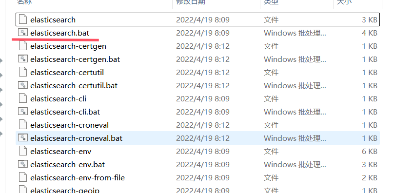

## ElasticSearch 安装


logstash: https://mirrors.huaweicloud.com/logstash/?C=N&O=D 

kibana: https://mirrors.huaweicloud.com/kibana/?C=N&O=D

- 认识目录


启动elasticsearch:



>启动时出现错误：
>
>[[2024-09-19T13:57:31,679 ]][ERROR][o.e.i.g.GeoIpDownloader ] [BALDBODY] error updating geoip database [GeoLite2-ASN.mmdb]
>java.net.SocketTimeoutException: Read timed out
>at java.net.SocketInputStream.socketRead0(Native Method) ~[?:?]
>
>​		...
>
>解决方法：
>
>修改config目录下的elasticsearch.yml文件
>
>添加配置：
>
>```yaml
>ingest.geoip.downloader.enabled: false
>```

启动成功界面：9200是公网端口， 9300是通信端口


### es head安装


上图第3步配置es时，在config/elasticsearch.yml目录下添加配置

添加配置后启动成功：


