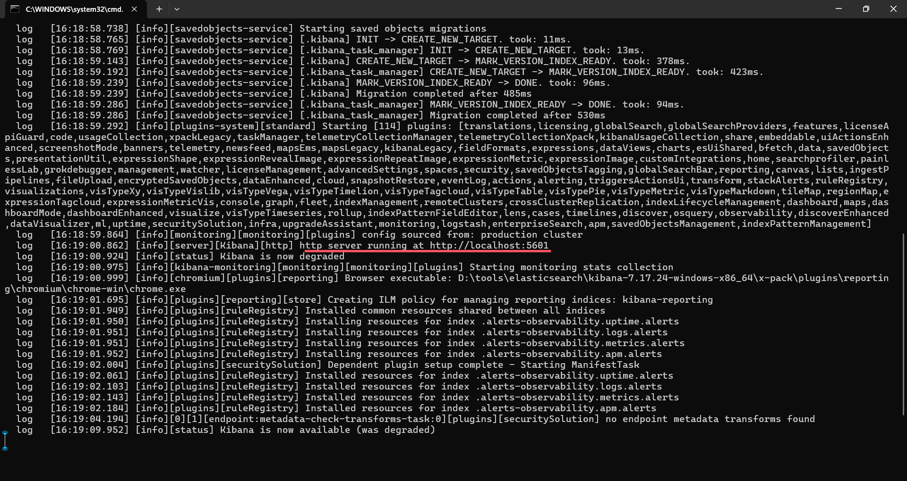
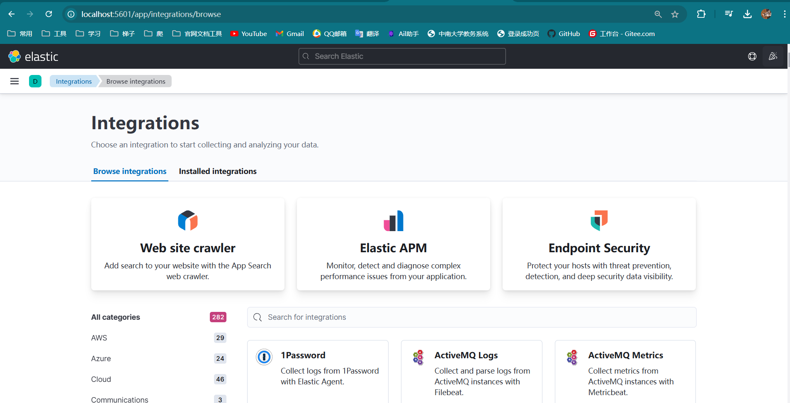
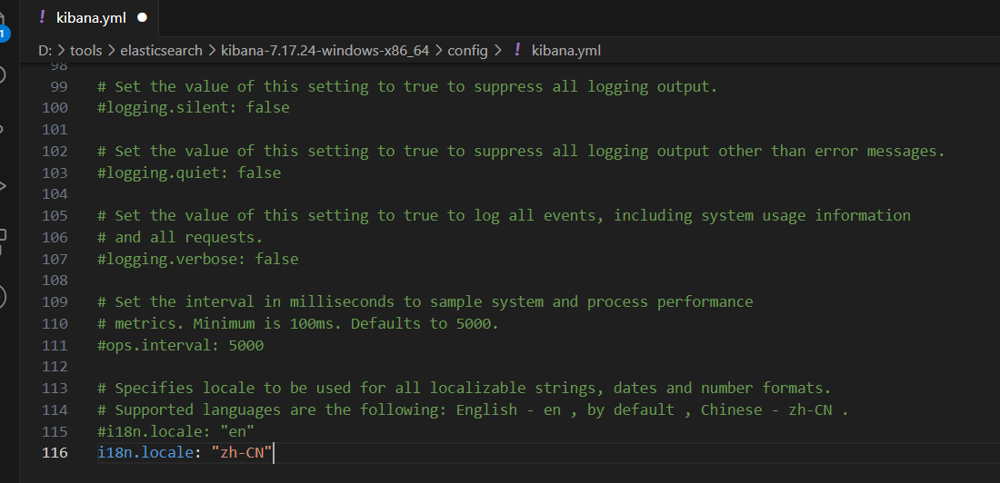

## Kibana安装

kaban版本要和elasticsearch版本相对应。

下载解压后，运行bin目录下的kabana.bat来启动kabana

启动成功后，可以根据启动信息发现kabana运行在5601端口：

访问测试

将kabana改为中文

在config/kanaba.yml中加上下面的配置

> i18n.locale:"zh-CN"

中英文词汇对应文件地址:

> x-pack\plugins\translations\translations\zh-CN.json

