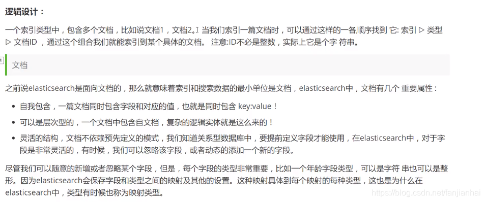

## ES核心概念

索引（Index）：类似于关系型数据库中的表，索引是数据存储和搜索的 **基本单位**。每个索引可以存储多条文档数据。

文档（Document）：索引中的每条记录，类似于数据库中的行。文档以 JSON 格式存储。

字段（Field）：文档中的每个键值对，类似于数据库中的列。

映射（Mapping）：用于定义 Elasticsearch 索引中文档字段的数据类型及其处理方式，类似于关系型数据库中的 Schema 表结构，帮助控制字段的存储、索引和查询行为。

集群（Cluster）：多个节点组成的群集，用于存储数据并提供搜索功能。集群中的每个节点都可以处理数据。

分片（Shard）：为了实现横向扩展，ES 将索引拆分成多个分片，每个分片可以分布在不同节点上。

副本（Replica）：分片的复制品，用于提高可用性和容错性。

和数据库类比：

| **Elasticsearch 概念** | **关系型数据库类比** |
| ---------------------- | -------------------- |
| Index                  | Table                |
| Document               | Row                  |
| Field                  | Column               |
| Mapping                | Schema               |
| Shard                  | Partition            |
| Replica                | Backup               |

> elasticsearch是面向文档。

关系型数据库和elasticsraech的客观对比

在上图中，p0 p1 p2 p3 p4是主分片，r0 r1 r2 r3 r4是副本（复制分片）

