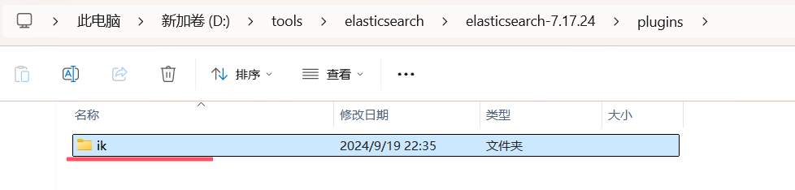
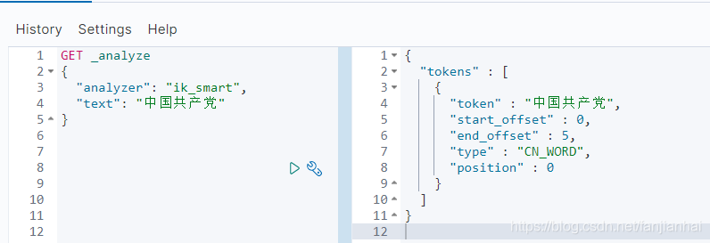
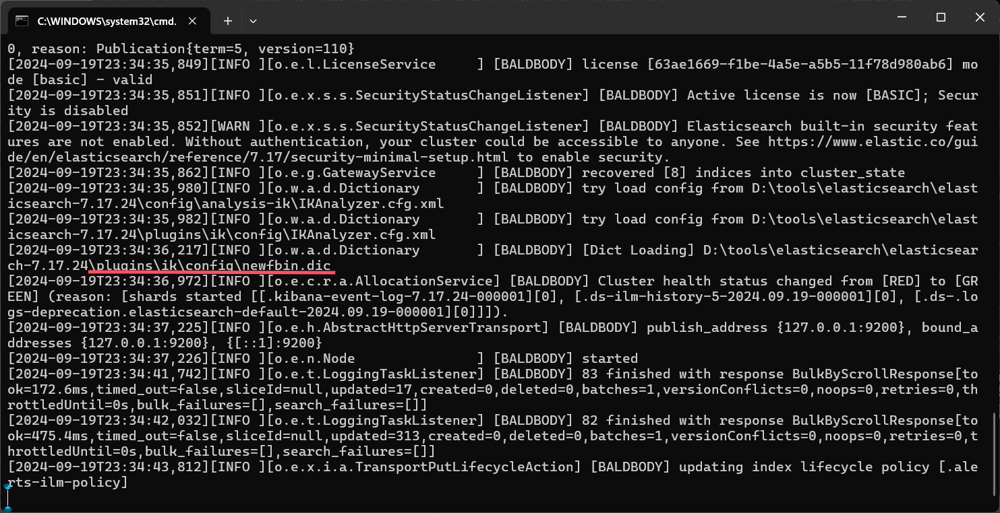

## IK分词器

- [github地址](https://github.com/infinilabs/analysis-ik) 
- [下载方式](https://release.infinilabs.com/)（注意ik分词器版本和elasticsearch版本一致）：

- 在es的plugins目录下新建一个文件夹。将解压后的分词器放在新建的文件夹下

- 重启观察ES，发现ik插件被加载了

- 也可以在控制台切换到bin目录下，使用`elasticsearch-plugin list` 查看已经加载的插件

- 使用kibana测试

  - ik_smart: 最少切分

  

  - ik_max_word为最细粒度划分！穷尽词库的可能， 字典！

  

- ik分词器增加自己的配置！

打开es目录中的plugins/ik/config/IKAnalyzer.cfg.xml

- 重启ES 和 Kibana

