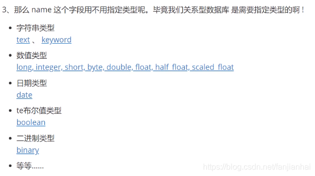
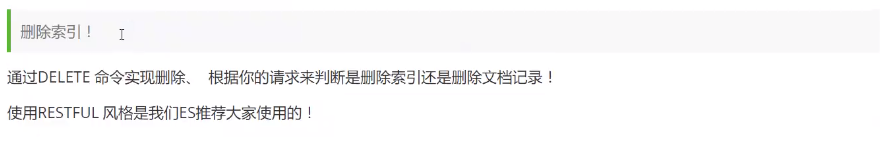

## Restful风格说明


ElasticSearch新版本Rest命令

> 更详细的命令使用方式和新老命令的对比，见 "拓展" 的 "Elasticsearch新老版本RestAPI"

| method                 | url地址                  | 描述                                                         |
| ---------------------- | ------------------------ | ------------------------------------------------------------ |
| PUT、GET、POST、DELETE | /索引名称/_ doc/文档id   | **GET**：检索文档。 <br />**PUT**：更新或创建文档。 **<br />POST**：部分更新文档（一般不推荐用在指定ID上）。 <br />**DELETE**：删除文档。 |
| POST                   | /索引名称/_ doc,         | **POST**：创建新文档，ID自动生成。                           |
| PUT                    | /索引名称/_create/文档id | **GET**：不支持，返回404错误。 <br />**POST**：不推荐，通常会导致错误。<br />**PUT**：用于创建文档，如果ID已存在则返回409错误。<br /> **DELETE**：不支持，返回404错误。 |


> 基础测试

- 创建一个索引！

```yml
# 语法
PUT /索引名/~类型名~/文档id
{请求体}

# PUT 创建命令  test1:索引 type1:类型 1:id
PUT test1/type1/1
{
  "name": "xiaofan",
  "age": 28
}

# 返回结果
# 警告信息： 不支持在文档索引请求中的指定类型
# 而是使用无类型的断点(/{index}/_doc/{id}, /{index}/_doc, or /{index}/_create/{id}).
{
  "_index" : "test1",   # 索引
  "_type" : "type1",    # 类型（已经废弃）
  "_id" : "1",          # id
  "_version" : 1,       # 版本
  "result" : "created", # 操作类型
  "_shards" : {         # 分片信息
    "total" : 2,
    "successful" : 1,
    "failed" : 0
  },
  "_seq_no" : 0,
  "_primary_term" : 1
}
```



- 指定字段的类型（创建规则）


- 获取具体的索引规则

```yml
# GET test2

{
  "test2" : {
    "aliases" : { },
    "mappings" : {
      "properties" : {
        "age" : {
          "type" : "integer"
        },
        "birthday" : {
          "type" : "date"
        },
        "name" : {
          "type" : "text"
        }
      }
    },
    "settings" : {
      "index" : {
        "creation_date" : "1599708623941",
        "number_of_shards" : "1",
        "number_of_replicas" : "1",
        "uuid" : "ANWnhwArSMSl8k8iipgH1Q",
        "version" : {
          "created" : "7080099"
        },
        "provided_name" : "test2"
      }
    }
  }
}

# 查看默认的规则
PUT /test3/_doc/1
{
  "name": "狂神说Java",
  "age": 28,
  "birthday": "1997-01-05"
}

# GET test3

{
  "test3" : {
    "aliases" : { },
    "mappings" : {
      "properties" : {
        "age" : {
          "type" : "long"
        },
        "birthday" : {
          "type" : "date"
        },
        "name" : {
          "type" : "text",
          "fields" : {
            "keyword" : {
              "type" : "keyword",
              "ignore_above" : 256
            }
          }
        }
      }
    },
    "settings" : {
      "index" : {
        "creation_date" : "1599708906181",
        "number_of_shards" : "1",
        "number_of_replicas" : "1",
        "uuid" : "LzPLCDgeQn6tdKo3xBBpbw",
        "version" : {
          "created" : "7080099"
        },
        "provided_name" : "test3"
      }
    }
  }
}
```


- 修改索引 POST

```
# 只会修改指定项，其他内容保证不变
POST /test3/_doc/1/_update
{
  "doc": {
    "name":"暴徒狂神"
  }
}

# GET test3/_doc/1

{
  "_index" : "test3",
  "_type" : "_doc",
  "_id" : "1",
  "_version" : 2,
  "_seq_no" : 1,
  "_primary_term" : 1,
  "found" : true,
  "_source" : {
    "name" : "暴徒狂神",
    "age" : 28,
    "birthday" : "1997-01-05"
  }
}
```



