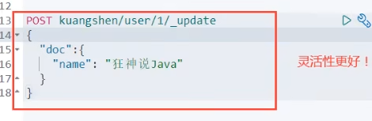
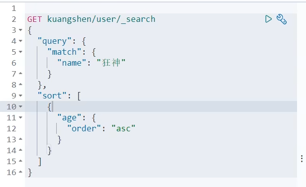
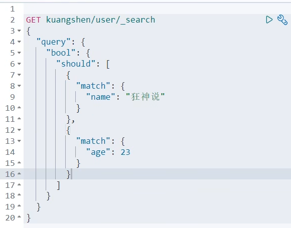
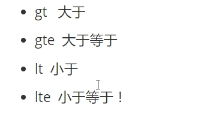
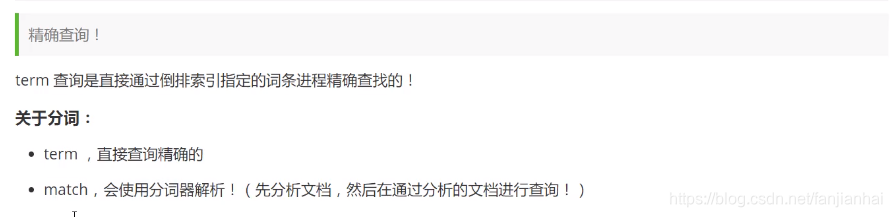
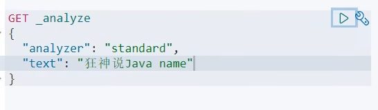
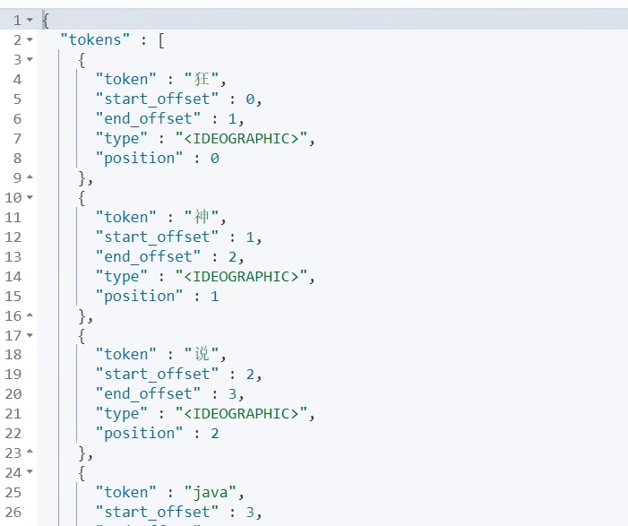
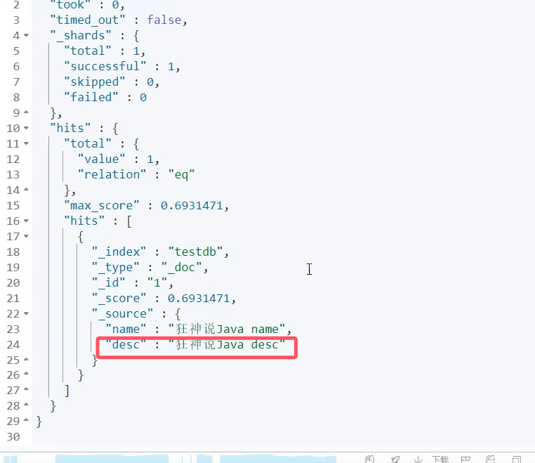
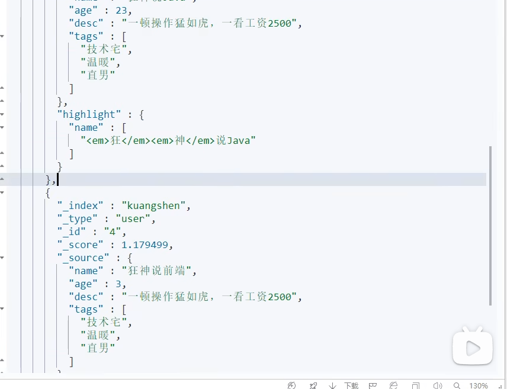

## 关于文档的基本操作

### 基本操作（简单的查询）

#### 插入命令

```json
put /kuangshen/user/1
{
  "name": "狂神说",
  "age": 23,
  "desc": "一顿操作猛如虎，一看工资2500",
  "tags": ["码农", "技术宅", "直男"]
}

put /kuangshen/user/2
{
  "name": "张三",
  "age": 28,
  "desc": "法外狂徒",
  "tags": ["旅游", "渣男", "交友"]
}

put /kuangshen/user/3
{
  "name": "李四",
  "age": 30,
  "desc": "不知道怎么描述",
  "tags": ["旅游", "靓女", "唱歌"]
}


```

#### 更新数据

> PUT命令更新数据


使用PUT更新，如果参数不完整，那么只会更新参数中有的值，参数中没有的值索引中会清空。

> POST _update命令更新数据 （推荐）



使用PUT更新，如果参数不完整，那么只会更新参数中有的值，参数中没有的值索引中不会清空。

#### 查询（搜索）

（搜索都是用GET请求完成的，这是规范）

> 简单的搜索

```
GET kuangshen/user/1
```

> 简单的条件搜索

```
GET kuangshen/user/_search?q=name:狂神
```

### 复杂操作(排序、分页、高亮、模糊查询、标准查询！)


#### 模糊查询

```json
GET kuangshen/user/_search
{
  "query": {
    "match": {
      "name": "狂神"
    }
  }
}
```

#### 对查询结果进行字段过滤


这样查询出来的结果只会有name和desc字段

#### 对查询结果进行排序

对age进行升序排列

> asc是升序，desc是降序。查询得到的结果中，score的值变为了null，因为我们已经指定了排序方式，不需要再通过score进行排序  




#### 分页查询（用的很多）


除了将参数放在json对象中进行分页，也可以将参数放在查询参数中

```
/search/{current}/{pagesize}
```

ElasticSearch数据下标从0开始，和我们学的数据结构一样

#### 布尔值条件查询

 **多条件查询 must 相当于and**


虽然第二个结果的age为3，但他的name中满足“包含狂神说”这个条件

**多条件查询 should 相当于or**



**多条件查询 must_not 相当于 not**


**过滤查询1 age > 10**




**过滤器2  10<= age <= 25**		 


#### 多条件查询


#### 精确查询



term不会做分词

> keyword类型不会被分词器解析
>
> text类型会被分词器解析

查询KeyWord类型，得到的是一个完整的整体


查询standard类型，内容会被分词器分析





**term精确查询测试**




**多个值匹配精确查询**


   

**高亮查询**

查询结果默认会被<em></em>标签包裹




可以自定义标签


