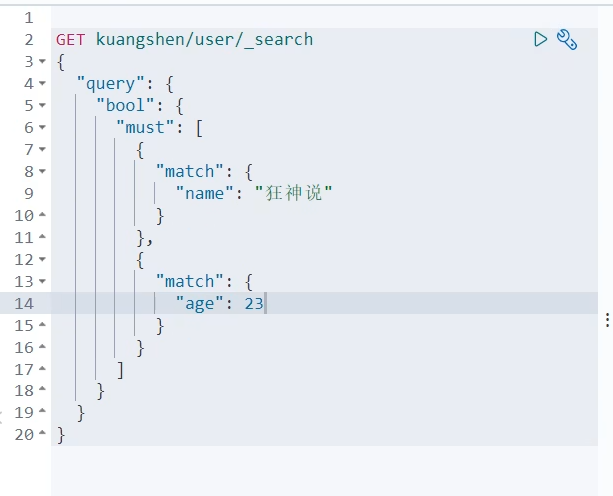
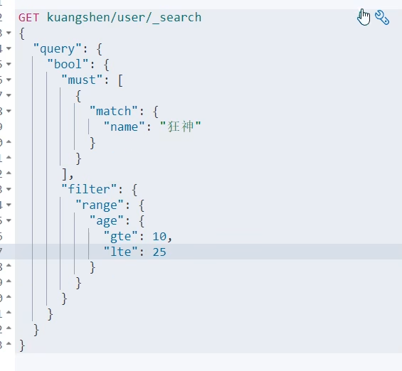
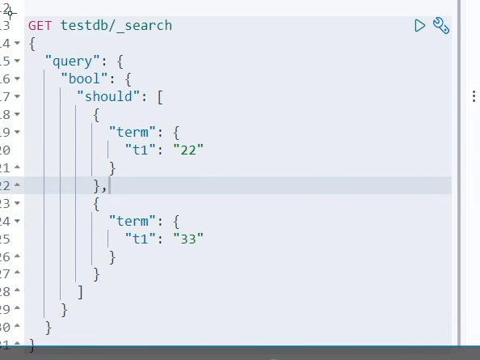
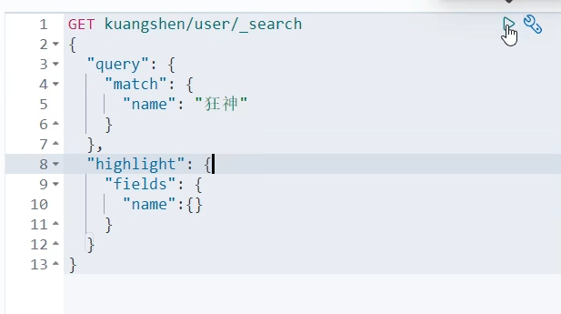

## 关于文档的基本操作

### Elasticsearch 查询语法

Elasticsearch 支持多种查询语法，用于不同的场景和需求，主要包括查询 DSL、EQL、SQL 等。

**1）DSL 查询（Domain Specific Language）**

一种基于 JSON 的查询语言，它是 Elasticsearch 中最常用的查询方式。

示例：

```json
{
  "query": {
    "match": {
      "message": "Elasticsearch 是强大的"
    }
  }
}
```

这个查询会对 `message` 字段进行分词，并查找包含 "Elasticsearch" 和 "强大" 词条的文档。

**2）EQL**

EQL 全称 Event Query Language，是一种用于检测和检索时间序列 **事件** 的查询语言，常用于日志和安全监控场景。

示例：查找特定事件

```plain
process where process.name == "malware.exe"
```

这个查询会查找 `process.name` 为 "malware.exe" 的所有进程事件，常用于安全检测中的恶意软件分析。

**3）SQL 查询**

Elasticsearch 提供了类似于传统数据库的 SQL 查询语法，允许用户以 SQL 的形式查询 Elasticsearch 中的数据，对熟悉 SQL 的用户来说非常方便。

示例 SQL 查询：

```sql
SELECT name, age FROM users WHERE age > 30 ORDER BY age DESC
```

这个查询会返回 `users` 索引中 `age` 大于 30 的所有用户，并按年龄降序排序。

------

以下几种简单了解即可：

**4）Lucene 查询语法**

Lucene 是 Elasticsearch 底层的搜索引擎，Elasticsearch 支持直接使用 Lucene 的查询语法，适合简单的字符串查询。

示例 Lucene 查询：

```plain
name:Elasticsearch AND age:[30 TO 40]
```

这个查询会查找 `name` 字段为 "Elasticsearch" 且 `age` 在 30 到 40 之间的文档。

**5）Kuery（KQL: Kibana Query Language）**

KQL 是 Kibana 的查询语言，专门用于在 Kibana 界面上执行搜索查询，常用于仪表盘和数据探索中。

示例 KQL 查询：

```plain
name: "Elasticsearch" and age > 30
```

这个查询会查找 `name` 为 "Elasticsearch" 且 `age` 大于 30 的文档。

**6）Painless 脚本查询**

Painless 是 Elasticsearch 的内置脚本语言，用于执行自定义的脚本操作，常用于排序、聚合或复杂计算场景。

示例 Painless 脚本：

```json
{
  "query": {
    "script_score": {
      "query": {
        "match": { "message": "Elasticsearch" }
      },
      "script": {
        "source": "doc['popularity'].value * 2"
      }
    }
  }
}
```

这个查询会基于 `popularity` 字段的值进行动态评分，将其乘以 2。

总结一下，DSL 是最通用的，EQL 和 KQL 则适用于特定场景，如日志分析和 Kibana 查询，而 SQL 则便于数据库开发人员上手。

### Elasticsearch 查询条件

如何利用 Elasticsearch 实现数据筛选呢？需要了解其查询条件，以 ES 的 DSL 语法为例：

| **查询条件**   | **介绍**                                                     | **示例**                                                     | **用途**                                           |
| -------------- | ------------------------------------------------------------ | ------------------------------------------------------------ | -------------------------------------------------- |
| `match`        | 用于全文检索，将查询字符串进行分词并匹配文档中对应的字段。   | `{ "match": { "content": "鱼皮是帅小伙" } }`                 | 适用于全文检索，分词后匹配文档内容。               |
| `term`         | 精确匹配查询，不进行分词。通常用于结构化数据的精确匹配，如数字、日期、关键词等。 | `{ "term": { "status": "active" } }`                         | 适用于字段的精确匹配，如状态、ID、布尔值等。       |
| `terms`        | 匹配多个值中的任意一个，相当于多个 `term` 查询的组合。       | `{ "terms": { "status": ["active", "pending"] } }`           | 适用于多值匹配的场景。                             |
| `range`        | 范围查询，常用于数字、日期字段，支持大于、小于、区间等查询。 | `{ "range": { "age": { "gte": 18, "lte": 30 } } }`           | 适用于数值或日期的范围查询。                       |
| `bool`         | 组合查询，通过 `must`、`should`、`must_not` 等组合多个查询条件。 | `{ "bool": { "must": [ { "term": { "status": "active" } }, { "range": { "age": { "gte": 18 } } } ] } }` | 适用于复杂的多条件查询，可以灵活组合。             |
| `wildcard`     | 通配符查询，支持 `*` 和 `?`，前者匹配任意字符，后者匹配单个字符。 | `{ "wildcard": { "name": "鱼*" } }`                          | 适用于部分匹配的查询，如模糊搜索。                 |
| `prefix`       | 前缀查询，匹配以指定前缀开头的字段内容。                     | `{ "prefix": { "name": "鱼" } }`                             | 适用于查找以指定字符串开头的内容。                 |
| `fuzzy`        | 模糊查询，允许指定程度的拼写错误或字符替换。                 | `{ "fuzzy": { "name": "yupi~2" } }`                          | 适用于处理拼写错误或不完全匹配的查询。             |
| `exists`       | 查询某字段是否存在。                                         | `{ "exists": { "field": "name" } }`                          | 适用于查找字段存在或缺失的文档。                   |
| `match_phrase` | 短语匹配查询，要求查询的词语按顺序完全匹配。                 | `{ "match_phrase": { "content": "鱼皮 帅小伙" } }`           | 适用于严格的短语匹配，词语顺序和距离都严格控制。   |
| `match_all`    | 匹配所有文档。                                               | `{ "match_all": {} }`                                        | 适用于查询所有文档，通常与分页配合使用。           |
| `ids`          | 基于文档 ID 查询，支持查询特定 ID 的文档。                   | `{ "ids": { "values": ["1", "2", "3"] } }`                   | 适用于根据文档 ID 查找特定文档。                   |
| `geo_distance` | 地理位置查询，基于地理坐标和指定距离查询。                   | `{ "geo_distance": { "distance": "12km", "location": { "lat": 40.73, "lon": -74.1 } } }` | 适用于根据距离计算查找地理位置附近的文档。         |
| `aggregations` | 聚合查询，用于统计、计算和分组查询，类似 SQL 中的 `GROUP BY`。 | `{ "aggs": { "age_stats": { "stats": { "field": "age" } } } }` | 适用于统计和分析数据，比如求和、平均值、最大值等。 |

其中的几个关键：

1. 精确匹配 vs. 全文检索：`term` 是精确匹配，不分词；`match` 用于全文检索，会对查询词进行分词。
2. 组合查询：`bool` 查询可以灵活组合多个条件，适用于复杂的查询需求。
3. 模糊查询：`fuzzy` 和 `wildcard` 提供了灵活的模糊匹配方式，适用于拼写错误或不完全匹配的场景。

了解上面这些一般就足够了，更多可以随用随查，参考 [官方文档](https://www.elastic.co/guide/en/elasticsearch/reference/7.17/query-dsl.html) 。

### 基本操作（简单的查询）

#### 插入命令

```json
put /kuangshen/user/1
{
  "name": "狂神说",
  "age": 23,
  "desc": "一顿操作猛如虎，一看工资2500",
  "tags": ["码农", "技术宅", "直男"]
}

put /kuangshen/user/2
{
  "name": "张三",
  "age": 28,
  "desc": "法外狂徒",
  "tags": ["旅游", "渣男", "交友"]
}

put /kuangshen/user/3
{
  "name": "李四",
  "age": 30,
  "desc": "不知道怎么描述",
  "tags": ["旅游", "靓女", "唱歌"]
}


```

> **动态映射**：
>
> 当你向一个不存在的索引中插入数据时，Elasticsearch 会根据文档内容自动推断字段类型，并为这些字段创建映射。这就是 ES 的 **动态映射**（Dynamic Mapping）功能。然而，这种自动生成的映射有一些局限性，可能导致字段类型不够规范。

#### 更新数据

> PUT命令更新数据


使用PUT更新，如果参数不完整，那么只会更新参数中有的值，参数中没有的值索引中会清空。

> POST _update命令更新数据 （推荐）


使用PUT更新，如果参数不完整，那么只会更新参数中有的值，参数中没有的值索引中不会清空。

#### 查询（搜索）

（搜索都是用GET请求完成的，这是规范）

> 简单的搜索

```
GET kuangshen/user/1
```

> 简单的条件搜索

```
GET kuangshen/user/_search?q=name:狂神
```

### 复杂操作(排序、分页、高亮、模糊查询、标准查询！)


#### 模糊查询

```json
GET kuangshen/user/_search
{
  "query": {
    "match": {
      "name": "狂神"
    }
  }
}
```

#### 对查询结果进行字段过滤


这样查询出来的结果只会有name和desc字段

#### 对查询结果进行排序

对age进行升序排列

> asc是升序，desc是降序。查询得到的结果中，score的值变为了null，因为我们已经指定了排序方式，不需要再通过score进行排序  


#### 分页查询（用的很多）


除了将参数放在json对象中进行分页，也可以将参数放在查询参数中

```
/search/{current}/{pagesize}
```

ElasticSearch数据下标从0开始，和我们学的数据结构一样

#### 布尔值条件查询

 **多条件查询 must 相当于and**





虽然第二个结果的age为3，但他的name中满足“包含狂神说”这个条件

**多条件查询 should 相当于or**


**多条件查询 must_not 相当于 not**


**过滤查询1 age > 10**


**过滤器2  10<= age <= 25**		 



#### 多条件查询


#### 精确查询


term不会做分词

> keyword类型不会被分词器解析
>
> text类型会被分词器解析

查询KeyWord类型，得到的是一个完整的整体


查询standard类型，内容会被分词器分析


**term精确查询测试**


**多个值匹配精确查询**



   

**高亮查询**

查询结果默认会被<em></em>标签包裹




可以自定义标签


