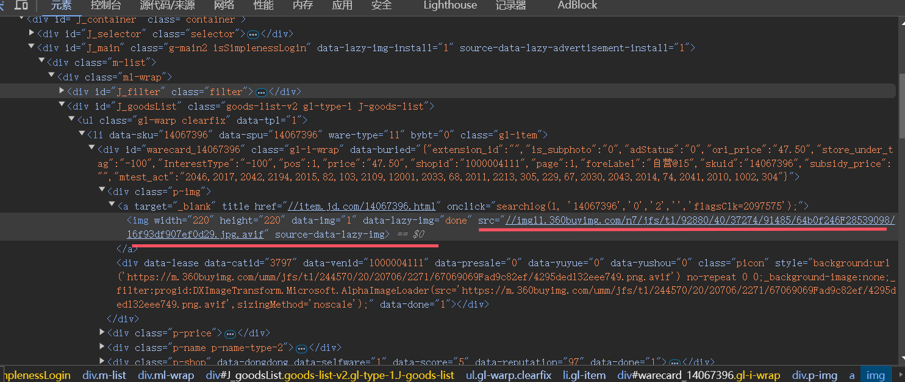
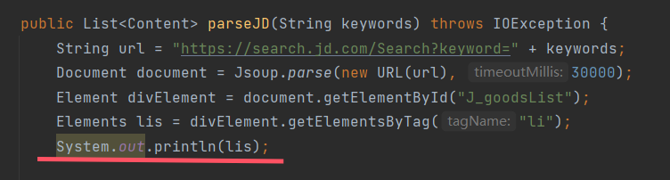
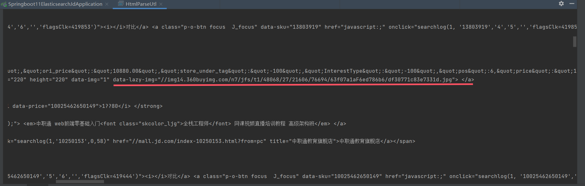
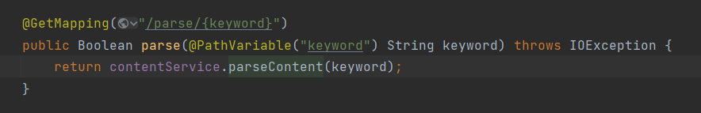
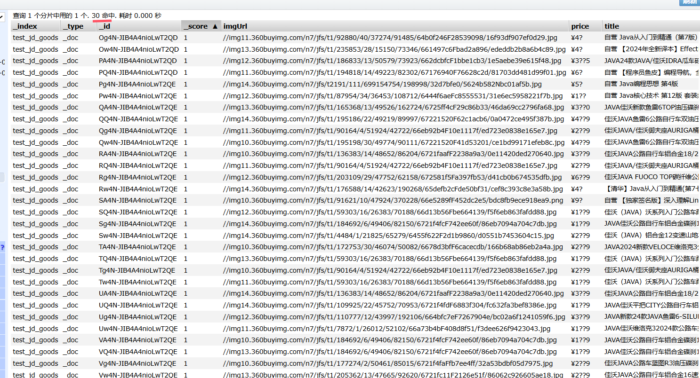
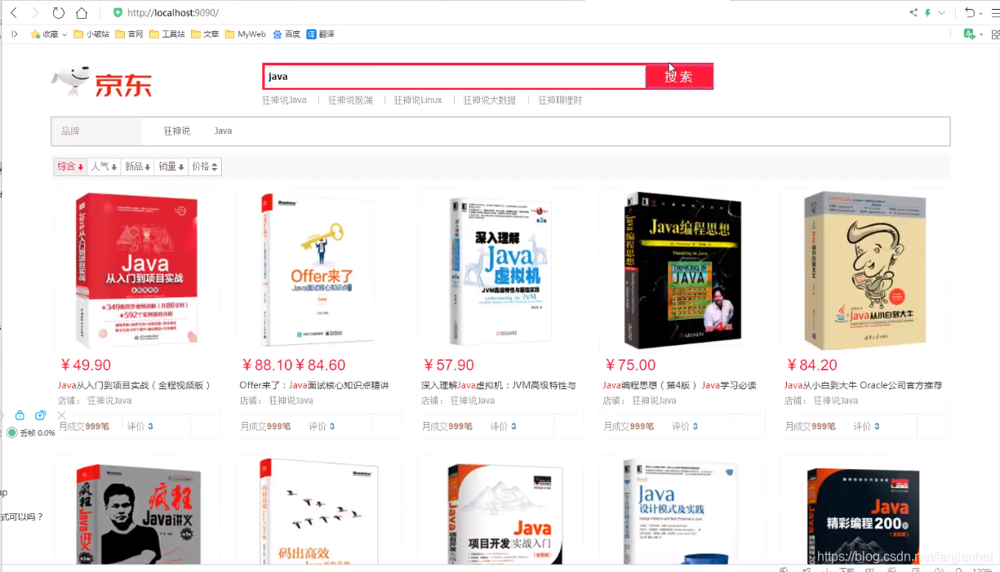

## 实战：模拟全文搜索-京东搜索

- github链接：https://github.com/fanjianhai/CODE/tree/main/SpringBoot/springboot-11-elasticsearch-jd
- 搭建springboot项目，添加依赖，修改es版本

### 爬虫

> ElasticSearch的数据源：数据库、消息队列、**爬虫**

爬取数据的方式：获取请求返回的页面信息，筛选出我们想要的数据。在Java中可以使用Jsoup包实现这一功能

> Jsoup包只可以爬取网页内容，不可以爬电影音乐内容。
> Tika包可以爬取电影音乐

企业中很多图片是懒加载的。控制台中显示图片为 src = "xxx"，这是图片加载完之后的代码。
在图片尚未加载完的时候，会在图片的位置展示一张简单的图片。等图片完全加载之后，再将简单的图片更换为原本的图片。这种加载方式就是懒加载。而在控制台看到代码时，图片早就加载完了，无法看到图片懒加载完成之前被存放在哪个属性里边。
只能通过在Java中打印懒加载完成之前的代码。

通过打印，可以看到图片在加载完成之前被存放在“data-lazy-img”属性中。

通过访问接口测试效果：可以看到数据被存入到ElasticSearch中

- 整体效果

