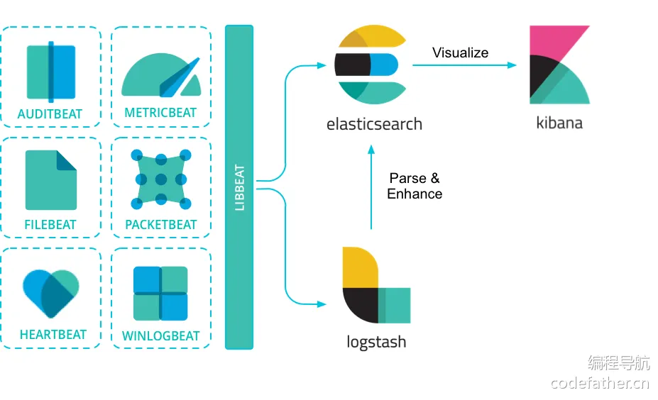
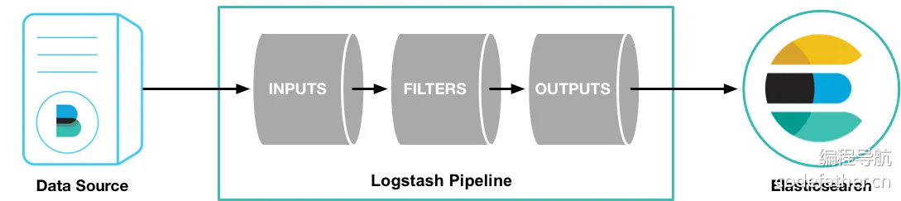
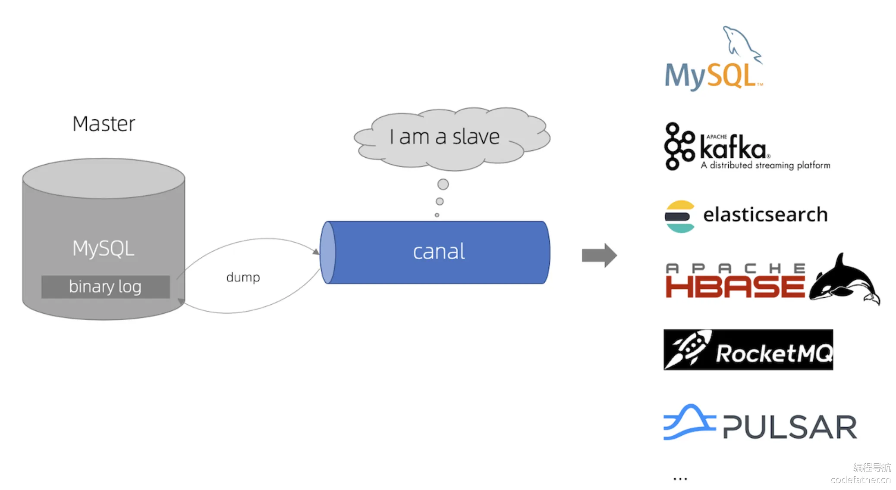

### 基础概念

#### 1、什么是 Elasticsearch？

Elasticsearch 是一个分布式、开源的搜索引擎，专门用于处理大规模的数据搜索和分析。它基于 Apache Lucene 构建，具有实时搜索、分布式计算和高可扩展性，广泛用于 **全文检索、日志分析、监控数据分析** 等场景。

官方文档：https://www.elastic.co/docs，建议入门后阅读一遍，了解更多它的特性。

#### 2、Elasticsearch 生态

Elasticsearch 生态系统非常丰富，包含了一系列工具和功能，帮助用户处理、分析和可视化数据，Elastic Stack 是其核心组成部分。

Elastic Stack（也称为 ELK Stack）由以下几部分组成：

- Elasticsearch：核心搜索引擎，负责存储、索引和搜索数据。
- Kibana：可视化平台，用于查询、分析和展示 Elasticsearch 中的数据。
- Logstash：数据处理管道，负责数据收集、过滤、增强和传输到 Elasticsearch。
- Beats：轻量级的数据传输工具，收集和发送数据到 Logstash 或 Elasticsearch。

Kibana 是 Elastic Stack 的可视化组件，允许用户通过图表、地图和仪表盘来展示存储在 Elasticsearch 中的数据。它提供了简单的查询接口、数据分析和实时监控功能。


Logstash 是一个强大的数据收集管道工具，能够从多个来源收集、过滤、转换数据，然后将数据发送到 Elasticsearch。Logstash 支持丰富的输入、过滤和输出插件。


Beats 是一组轻量级的数据采集代理，负责从不同来源收集数据并发送到 Elasticsearch 或 Logstash。常见的 Beats 包括：

- Filebeat：收集日志文件。
- Metricbeat：收集系统和服务的指标。
- Packetbeat：监控网络流量。



上面这张图，也是标准的 Elastic Stack 技术栈的交互图。

#### 3、Elasticsearch 的核心概念

索引（Index）：类似于关系型数据库中的表，索引是数据存储和搜索的 **基本单位**。每个索引可以存储多条文档数据。

文档（Document）：索引中的每条记录，类似于数据库中的行。文档以 JSON 格式存储。

字段（Field）：文档中的每个键值对，类似于数据库中的列。

映射（Mapping）：用于定义 Elasticsearch 索引中文档字段的数据类型及其处理方式，类似于关系型数据库中的 Schema 表结构，帮助控制字段的存储、索引和查询行为。

集群（Cluster）：多个节点组成的群集，用于存储数据并提供搜索功能。集群中的每个节点都可以处理数据。

分片（Shard）：为了实现横向扩展，ES 将索引拆分成多个分片，每个分片可以分布在不同节点上。

副本（Replica）：分片的复制品，用于提高可用性和容错性。


和数据库类比：

| **Elasticsearch 概念** | **关系型数据库类比** |
| ---------------------- | -------------------- |
| Index                  | Table                |
| Document               | Row                  |
| Field                  | Column               |
| Mapping                | Schema               |
| Shard                  | Partition            |
| Replica                | Backup               |

#### 4、Elasticsearch 实现全文检索的原理

1）分词：Elasticsearch 的分词器会将输入文本拆解成独立的词条（tokens），方便进行索引和搜索。分词的具体过程包括以下几步：

- 字符过滤：去除特殊字符、HTML 标签或进行其他文本清理。
- 分词：根据指定的分词器（analyzer），将文本按规则拆分成一个个词条。例如，英文可以按空格拆分，中文使用专门的分词器处理。
- 词汇过滤：对分词结果进行过滤，如去掉停用词（常见但无意义的词，如 "the"、"is" 等）或进行词形归并（如将动词变为原形）。

Elasticsearch 内置了很多分词器，比如按照空格分词等，默认只支持英文，可以在 [官方文档](https://www.elastic.co/guide/en/elasticsearch/reference/7.17/analysis-analyzers.html) 了解。

2）倒排索引：

倒排索引是 Elasticsearch 实现高效搜索的核心数据结构。它将文档中的词条映射到文档 ID，实现快速查找。

工作原理：

- 每个文档在被索引时，分词器会将文档内容拆解为多个词条。
- 然后，Elasticsearch 为每个词条生成一个倒排索引，记录该词条在哪些文档中出现。

举个例子，假设有两个文档：

- 文档 1：鱼皮是帅锅
- 文档 2：鱼皮是好人

中文分词后，生成的倒排索引大致如下：

| 词条 | 文档 ID |
| ---- | ------- |
| 鱼皮 | 1, 2    |
| 是   | 1, 2    |
| 帅锅 | 1       |
| 好人 | 2       |

通过这种结构，查询某个词时，可以快速找到包含该词的所有文档。

#### 5、Elasticsearch 打分规则

实际应用 Elasticsearch 来实现搜索功能时，我们不仅要求能搜到内容，而且还要把和用户搜索最相关的内容展示在前面。这就需要我们了解 Elasticsearch 的打分规则。

打分规则（_Score）是用于衡量每个文档与查询条件的匹配度的评分机制。搜索结果的默认排序方式是按相关性得分（_score）从高到低。Elasticsearch 使用 **BM25 算法** 来计算每个文档的得分，它是基于词频、反向文档频率、文档长度等因素来评估文档和查询的相关性。

打分的主要因素：

1. 词频（TF, Term Frequency）：查询词在文档中出现的次数，出现次数越多，得分越高。
2. 反向文档频率（IDF, Inverse Document Frequency）：查询词在所有文档中出现的频率。词在越少的文档中出现，IDF 值越高，得分越高。
3. 文档长度：较短的文档往往被认为更相关，因为查询词在短文档中占的比例更大。

下面举一个例子：假设要在 Elasticsearch 中查询 `鱼皮` 这个关键词，索引中有以下三个文档：

文档 1：

```plain
鱼皮是个帅小伙，鱼皮非常聪明，鱼皮很喜欢编程。
```

分析：

- 查询词 `鱼皮` 出现了 3 次。
- 该文档较短，查询词 `鱼皮` 的密度很高。

由于 `鱼皮` 在文档中多次出现且文档较短，因此得分较高，相关性较强。

文档 2：

```plain
鱼皮是个帅小伙。
```

分析：

- 查询词 `鱼皮` 出现了 1 次。
- 文档非常短

尽管文档短，但是查询词出现的次数少，因此得分中等，相关性较普通。

文档 3：

```plain
鱼皮是个帅小伙，他喜欢写代码。他的朋友们也很喜欢编程和技术讨论，大家经常一起参与各种技术会议，讨论分布式系统、机器学习和人工智能等主题。
```

分析：

- 查询词 `鱼皮` 出现了 1 次。
- 文档较长，且 `鱼皮` 只在文档开头出现，词条密度较低。

由于文档很长，`鱼皮` 出现的次数少，密度也低，因此得分较低，相关性不强。

再举个例子，什么是反向文档频率？

假如说 ES 中有 10 个文档，都包含了“鱼皮”这个关键词；只有 1 个文档包含了“帅锅”这个关键词。

现在用户搜索“鱼皮帅锅”，大概率会把后面这条文档搜出来，因为更稀有。

当然，以上只是简单举例，实际上 ES 计算打分规则时，会有一套较为复杂的公式，感兴趣的同学可以阅读下面资料来了解：

- 鱼皮文章：https://liyupi.blog.csdn.net/article/details/119176943
- 官方文章：https://www.elastic.co/guide/en/elasticsearch/guide/master/controlling-relevance.html

#### 6、Elasticsearch 查询语法

Elasticsearch 支持多种查询语法，用于不同的场景和需求，主要包括查询 DSL、EQL、SQL 等。

**1）DSL 查询（\**\*\*Domain Specific Language\*\**\*）**

一种基于 JSON 的查询语言，它是 Elasticsearch 中最常用的查询方式。

示例：

```json
{
  "query": {
    "match": {
      "message": "Elasticsearch 是强大的"
    }
  }
}
```

这个查询会对 `message` 字段进行分词，并查找包含 "Elasticsearch" 和 "强大" 词条的文档。

**2）EQL**

EQL 全称 Event Query Language，是一种用于检测和检索时间序列 **事件** 的查询语言，常用于日志和安全监控场景。

示例：查找特定事件

```plain
process where process.name == "malware.exe"
```

这个查询会查找 `process.name` 为 "malware.exe" 的所有进程事件，常用于安全检测中的恶意软件分析。

**3）SQL 查询**

Elasticsearch 提供了类似于传统数据库的 SQL 查询语法，允许用户以 SQL 的形式查询 Elasticsearch 中的数据，对熟悉 SQL 的用户来说非常方便。

示例 SQL 查询：

```sql
SELECT name, age FROM users WHERE age > 30 ORDER BY age DESC
```

这个查询会返回 `users` 索引中 `age` 大于 30 的所有用户，并按年龄降序排序。

------

以下几种简单了解即可：

**4）Lucene 查询语法**

Lucene 是 Elasticsearch 底层的搜索引擎，Elasticsearch 支持直接使用 Lucene 的查询语法，适合简单的字符串查询。

示例 Lucene 查询：

```plain
name:Elasticsearch AND age:[30 TO 40]
```

这个查询会查找 `name` 字段为 "Elasticsearch" 且 `age` 在 30 到 40 之间的文档。

**5）Kuery（KQL: Kibana Query Language）**

KQL 是 Kibana 的查询语言，专门用于在 Kibana 界面上执行搜索查询，常用于仪表盘和数据探索中。

示例 KQL 查询：

```plain
name: "Elasticsearch" and age > 30
```

这个查询会查找 `name` 为 "Elasticsearch" 且 `age` 大于 30 的文档。

**6）Painless 脚本查询**

Painless 是 Elasticsearch 的内置脚本语言，用于执行自定义的脚本操作，常用于排序、聚合或复杂计算场景。

示例 Painless 脚本：

```json
{
  "query": {
    "script_score": {
      "query": {
        "match": { "message": "Elasticsearch" }
      },
      "script": {
        "source": "doc['popularity'].value * 2"
      }
    }
  }
}
```

这个查询会基于 `popularity` 字段的值进行动态评分，将其乘以 2。

总结一下，DSL 是最通用的，EQL 和 KQL 则适用于特定场景，如日志分析和 Kibana 查询，而 SQL 则便于数据库开发人员上手。

#### 7、Elasticsearch 查询条件

如何利用 Elasticsearch 实现数据筛选呢？需要了解其查询条件，以 ES 的 DSL 语法为例：

| **查询条件**   | **介绍**                                                     | **示例**                                                     | **用途**                                           |
| -------------- | ------------------------------------------------------------ | ------------------------------------------------------------ | -------------------------------------------------- |
| `match`        | 用于全文检索，将查询字符串进行分词并匹配文档中对应的字段。   | `{ "match": { "content": "鱼皮是帅小伙" } }`                 | 适用于全文检索，分词后匹配文档内容。               |
| `term`         | 精确匹配查询，不进行分词。通常用于结构化数据的精确匹配，如数字、日期、关键词等。 | `{ "term": { "status": "active" } }`                         | 适用于字段的精确匹配，如状态、ID、布尔值等。       |
| `terms`        | 匹配多个值中的任意一个，相当于多个 `term` 查询的组合。       | `{ "terms": { "status": ["active", "pending"] } }`           | 适用于多值匹配的场景。                             |
| `range`        | 范围查询，常用于数字、日期字段，支持大于、小于、区间等查询。 | `{ "range": { "age": { "gte": 18, "lte": 30 } } }`           | 适用于数值或日期的范围查询。                       |
| `bool`         | 组合查询，通过 `must`、`should`、`must_not` 等组合多个查询条件。 | `{ "bool": { "must": [ { "term": { "status": "active" } }, { "range": { "age": { "gte": 18 } } } ] } }` | 适用于复杂的多条件查询，可以灵活组合。             |
| `wildcard`     | 通配符查询，支持 `*` 和 `?`，前者匹配任意字符，后者匹配单个字符。 | `{ "wildcard": { "name": "鱼*" } }`                          | 适用于部分匹配的查询，如模糊搜索。                 |
| `prefix`       | 前缀查询，匹配以指定前缀开头的字段内容。                     | `{ "prefix": { "name": "鱼" } }`                             | 适用于查找以指定字符串开头的内容。                 |
| `fuzzy`        | 模糊查询，允许指定程度的拼写错误或字符替换。                 | `{ "fuzzy": { "name": "yupi~2" } }`                          | 适用于处理拼写错误或不完全匹配的查询。             |
| `exists`       | 查询某字段是否存在。                                         | `{ "exists": { "field": "name" } }`                          | 适用于查找字段存在或缺失的文档。                   |
| `match_phrase` | 短语匹配查询，要求查询的词语按顺序完全匹配。                 | `{ "match_phrase": { "content": "鱼皮 帅小伙" } }`           | 适用于严格的短语匹配，词语顺序和距离都严格控制。   |
| `match_all`    | 匹配所有文档。                                               | `{ "match_all": {} }`                                        | 适用于查询所有文档，通常与分页配合使用。           |
| `ids`          | 基于文档 ID 查询，支持查询特定 ID 的文档。                   | `{ "ids": { "values": ["1", "2", "3"] } }`                   | 适用于根据文档 ID 查找特定文档。                   |
| `geo_distance` | 地理位置查询，基于地理坐标和指定距离查询。                   | `{ "geo_distance": { "distance": "12km", "location": { "lat": 40.73, "lon": -74.1 } } }` | 适用于根据距离计算查找地理位置附近的文档。         |
| `aggregations` | 聚合查询，用于统计、计算和分组查询，类似 SQL 中的 `GROUP BY`。 | `{ "aggs": { "age_stats": { "stats": { "field": "age" } } } }` | 适用于统计和分析数据，比如求和、平均值、最大值等。 |

其中的几个关键：

1. 精确匹配 vs. 全文检索：`term` 是精确匹配，不分词；`match` 用于全文检索，会对查询词进行分词。
2. 组合查询：`bool` 查询可以灵活组合多个条件，适用于复杂的查询需求。
3. 模糊查询：`fuzzy` 和 `wildcard` 提供了灵活的模糊匹配方式，适用于拼写错误或不完全匹配的场景。

了解上面这些一般就足够了，更多可以随用随查，参考 [官方文档](https://www.elastic.co/guide/en/elasticsearch/reference/7.17/query-dsl.html) 。

#### 8、Elasticsearch 客户端

前面了解了 Elasticsearch 的概念和查询语法，但是如何执行 Elasticsearch 操作呢？还需要了解下 ES 的客户端，列举一些常用的：

1）HTTP API：Elasticsearch 提供了 RESTful HTTP API，用户可以通过直接发送 HTTP 请求来执行索引、搜索和管理集群的操作。[官方文档](https://www.elastic.co/guide/en/elasticsearch/reference/7.17/rest-apis.html)

2）Kibana：Kibana 是 Elasticsearch 官方提供的可视化工具，用户可以通过 Kibana 控制台使用查询语法（如 DSL、KQL）来执行搜索、分析和数据可视化。

3）Java REST Client：Elasticsearch 官方提供的 Java 高级 REST 客户端库，用于 Java 程序中与 Elasticsearch 进行通信，支持索引、查询、集群管理等操作。[官方文档](https://www.elastic.co/guide/en/elasticsearch/client/java-api-client/7.17/introduction.html)

4）Spring Data Elasticsearch：Spring 全家桶的一员，用于将 Elasticsearch 与 Spring 框架集成，通过简化的 Repository 方式进行索引、查询和数据管理操作。[官方文档](https://spring.io/projects/spring-data-elasticsearch)

5）Elasticsearch SQL CLI：命令行工具，允许通过类 SQL 语法直接在命令行中查询 Elasticsearch 数据，适用于熟悉 SQL 的用户。

此外，Elasticsearch 当然不只有 Java 的客户端，Python、PHP、Node.js、Go 的客户端都是支持的。

💡 在选择客户端时，要格外注意版本号！！！要跟 Elasticsearch 的版本保持兼容。

#### 9、ES 数据同步方案

一般情况下，如果做查询搜索功能，使用 ES 来模糊搜索，但是数据是存放在数据库 MySQL 里的，所以说我们需要把 MySQL 中的数据和 ES 进行同步，保证数据一致（以 MySQL 为主）。

数据流向：MySQL => ES （单向）

数据同步一般有 2 个过程：全量同步（首次）+ 增量同步（新数据）

总共有 4 种主流方案：

**1）定时任务**

比如 1 分钟 1 次，找到 MySQL 中过去几分钟内（至少是定时周期的 2 倍）发生改变的数据，然后更新到 ES。

优点：

- 简单易懂，开发、部署、维护相对容易。
- 占用资源少，不需要引入复杂的第三方中间件。
- 不用处理复杂的并发和实时性问题。

缺点：

- **有时间差**：无法做到实时同步，数据存在滞后。
- 数据频繁变化时，无法确保数据完全同步，容易出现错过更新的情况。
- 对大数据量的更新处理不够高效，可能会引入重复更新逻辑。

应用场景：

- 数据实时性要求不高：适合数据短时间内不同步不会带来重大影响的场景。
- 数据基本不发生修改：适合数据几乎不修改、修改不频繁的场景。
- 数据容忍丢失

**2）双写**

写数据的时候，必须也去写 ES；更新删除数据库同理。

可以通过事务保证数据一致性，使用事务时，要先保证 MySQL 写成功，因为如果 ES 写入失败了，不会触发回滚，但是可以通过定时任务 + 日志 + 告警进行检测和修复（补偿）。

优点：

- 方案简单易懂，业务逻辑直接控制数据同步。
- 可以利用事务部分保证 MySQL 和 ES 的数据一致性。
- 同步的时延较短，理论上可以接近实时更新 ES。

缺点：

- **影响性能**：每次写 MySQL 时，需要同时操作 ES，增加了业务写入延迟，影响性能。
- **一致性问题**：如果 ES 写入失败，MySQL 事务提交成功后，ES 可能会丢失数据；或者 ES 写入成功，MySQL 事务提交失败，ES 无法回滚。因此必须额外设计监控、补偿机制来检测同步失败的情况（如通过定时任务、日志和告警修复）。
- 代码复杂度增加，需要对每个写操作都进行双写处理。

应用场景：

- 实时性要求较高
- 业务写入频率较低：适合写操作不频繁的场景，这样对性能的影响较小。

**3）用 Logstash 数据同步管道**

一般要配合 kafka 消息队列 + beats 采集器：



优点：

- **配置驱动**：基于配置文件，减少了手动编码，数据同步逻辑和业务代码解耦。
- **扩展性好**：可以灵活引入 Kafka 等消息队列实现异步数据同步，并可处理高吞吐量数据。
- 支持多种数据源：Logstash 支持丰富的数据源，方便扩展其他同步需求。

缺点：

- **灵活性差**：需要通过配置文件进行同步，复杂的业务逻辑可能难以在配置中实现，无法处理细粒度的定制化需求。
- 引入额外组件，维护成本高：通常需要引入 Kafka、Beats 等第三方组件，增加了系统的复杂性和运维成本。

应用场景：

- **大数据同步**：适合大规模、分布式数据同步场景。
- **对实时性要求不高**：适合数据流处理或延迟容忍较大的系统。
- 系统已有 Kafka 或类似的消息队列架构：如果系统中已经使用了 Kafka 等中间件，使用 Logstash 管道会变得很方便。

**4）监听 MySQL Binlog**

有任何数据变更时都能够实时监听到，并且同步到 Elasticsearch。一般不需要自己监听，可以使用现成的技术，比如 [Canal](https://github.com/alibaba/canal/) 。



💡 Canal 的核心原理：数据库每次修改时，会修改 binlog 文件，只要监听该文件的修改，就能第一时间得到消息并处理

优点：

- **实时性强**：能够在 MySQL 数据发生变更的第一时间同步到 ES，做到真正的实时同步。
- 轻量级：Binlog 是数据库自带的日志功能，不需要修改核心业务代码，只需要新增监听逻辑。

缺点：

- 引入外部依赖：需要引入像 Canal 这样的中间件，增加了系统的复杂性和维护成本。
- 运维难度增加：需要确保 Canal 或者其他 Binlog 监听器的稳定运行，并且对 MySQL 的 Binlog 配置要求较高。
- 一致性问题：如果 Canal 服务出现问题或暂停，数据可能会滞后或丢失，必须设计补偿机制。

应用场景：

- **实时同步要求高**：适合需要实时数据同步的场景，通常用于高并发、高数据一致性要求的系统。
- **数据频繁变化**：适合数据变更频繁且需要高效增量同步的场景。

最终方案：对于本项目，由于数据量不大，题目更新也不频繁，容忍丢失和不一致，所以选用方案一，实现成本最低。

