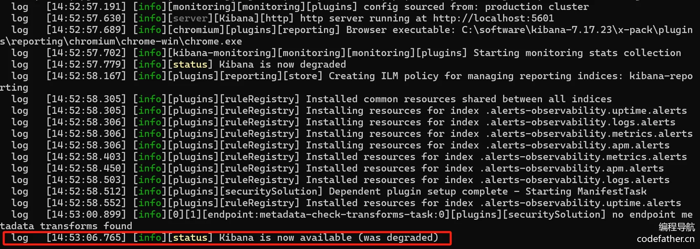
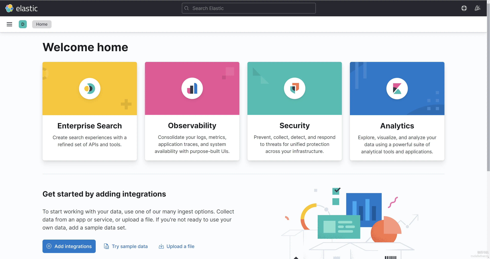
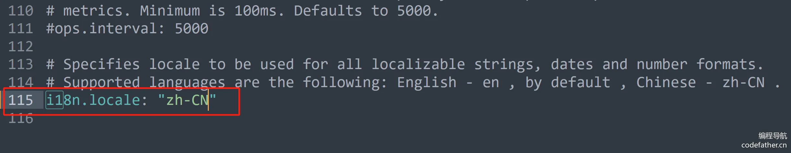
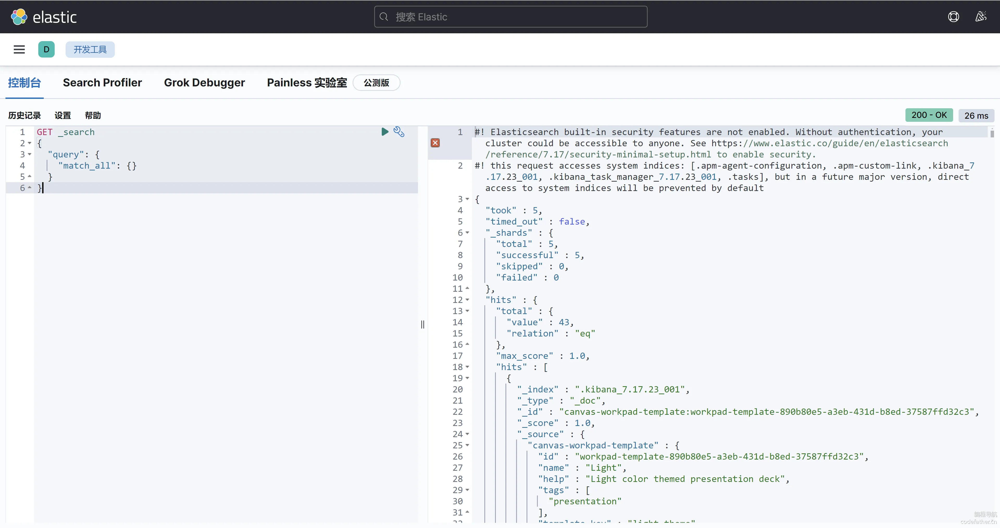
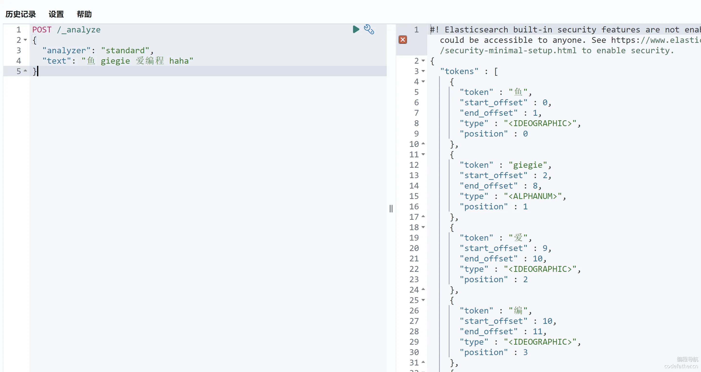
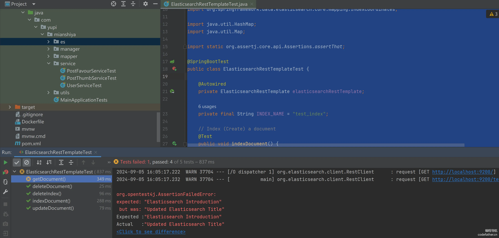
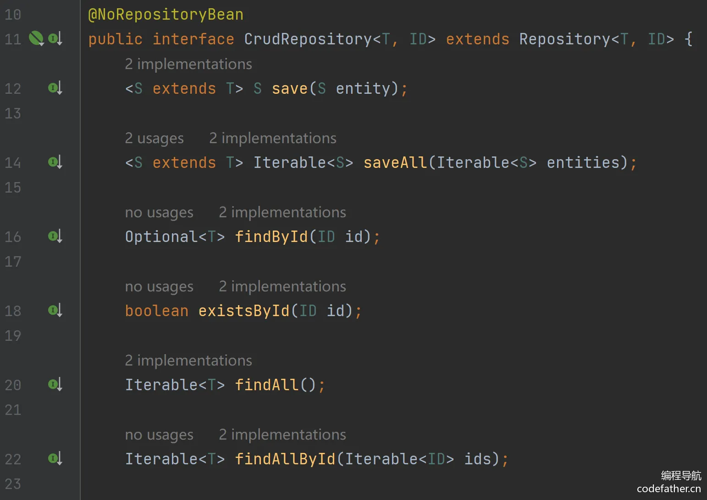
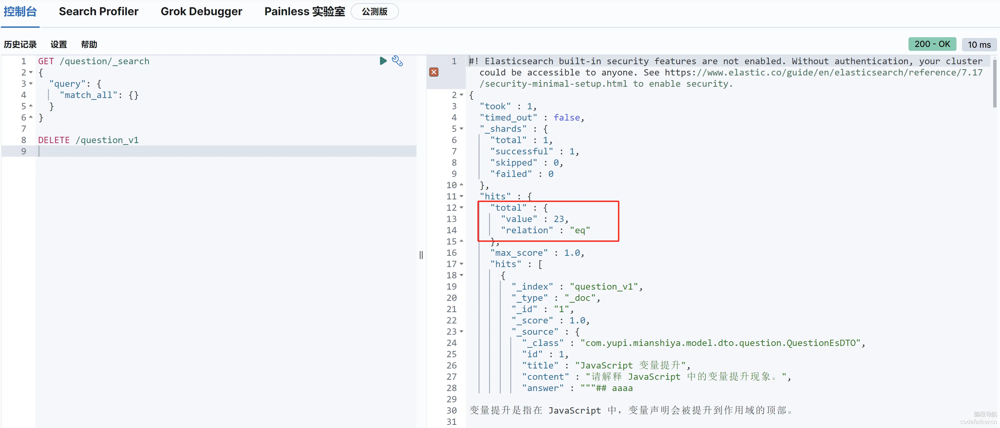
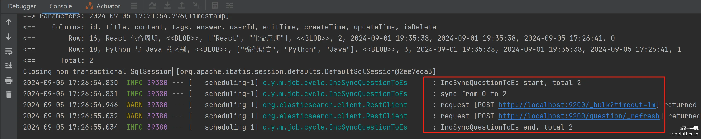

### 后端开发（ES 实战）

#### 1、Elasticsearch 搭建

目标：安装 Elasticsearch 和 Kibana，能够在 Kibana 查看到 Elasticsearch 存储的数据。

💡 也可以直接使用云 Elasticsearch 服务，省去自主搭建的时间，推荐使用 Serverless 版本，学完关掉就行。

**Elasticsearch 更新迭代非常快，所以安装时，一定要注意慎重选择版本号！**

由于我们自己的项目用的 Spring Boot 2.x 版本，对应的 [Spring Data Elasticsearch](https://spring.io/projects/spring-data-elasticsearch) 客户端版本是 4.x，支持的 Elasticsearch 是 7.x，所以建议 Elasticsearch 使用 7.x 的版本。

鱼皮教程中使用的是 7.17 版本，这是 7.x 系列的最后一个版本，包含了该系列所有的 bug 修复和改进，被广泛认为是最稳定的。

💡 可以在 [官方文档](https://docs.spring.io/spring-data/elasticsearch/reference/elasticsearch/versions.html) 了解到版本兼容情况：比如 Spring 6 才支持 Elasticsearch 8.x

1）安装 Elasticsearch

参考官方文档：https://www.elastic.co/guide/en/elasticsearch/reference/7.17/setup.html

Windows 解压安装：https://www.elastic.co/guide/en/elasticsearch/reference/7.17/zip-windows.html

其他操作系统安装：https://www.elastic.co/guide/en/elasticsearch/reference/7.17/targz.html

如果官网下不动，可以用鱼皮已经下载好的：https://pan.baidu.com/s/1u73-Nlolrs8Rzb1_b6X6HA ，提取码：c2sd

**注意，安装路径不要包含中文！**

安装完成后进入 es 目录并执行启动命令：

```plain
.\bin\elasticsearch.bat
```

可以用 CURL 测试是否启动成功：

```shell
curl -X GET "localhost:9200/?pretty"
```

正常输出如图：


在 Windows 系统上，你还可以选择是否安装为服务，方便启动和管理。

```plain
.\bin\elasticsearch-service.bat

Usage: elasticsearch-service.bat install|remove|start|stop|manager [SERVICE_ID]
```

2）安装 Kibana

**注意，只要是同一套技术，所有版本必须一致！此处都用 7.17 版本！**

参考官方文档：https://www.elastic.co/guide/en/kibana/7.17/introduction.html

安装 Kibana：https://www.elastic.co/guide/en/kibana/7.17/install.html

安装完成后进入 kibana 目录并执行启动命令：

```plain
.\bin\kibana.bat
```

正常输出如图：



访问 http://localhost:5601/，即可开始使用。



但 kibana 默认是英文，不变阅读，可以修改 `config/kibana.yml` 中的国际化配置：



然后重启 kibana 即可。

**注意，目前 Kibana 面板没有增加权限校验，所有人都能访问，所以请勿在线上直接部署！**

3）测试

尝试利用 Kibana 的开发工具来操作 Elasticsearch 的数据，比如查询：



验证下分词器的效果，比如使用标准分词器：

```json
POST /_analyze
{
  "analyzer": "standard", 
  "text": "鱼皮是个帅小伙，非常喜欢编程"
}
```

效果如图，英文被识别为了一个词，但中文未被识别：



默认支持的分词器如下：

- standard：标准分词器。
- simple：简单分词器。
- whitespace：按空格分词。
- stop：带停用词的分词器。
- keyword：不分词，将整个字段作为一个词条。
- pattern：基于正则表达式的分词器。
- ngram 和 edge_ngram：n-gram 分词器。

由于这些分词器都不支持中文，所以需要安装 IK 中文分词器，以满足我们的业务需要。

4）安装 IK 中文分词器（ES 插件）

开源地址：https://github.com/medcl/elasticsearch-analysis-ik

直接按照官方指引安装即可，注意下载和我们 Elasticsearch 一致的版本，可以在这里找到各版本的插件包：https://release.infinilabs.com/analysis-ik/stable/

在 ES 安装目录下执行：

```plain
.\bin\elasticsearch-plugin.bat install https://release.infinilabs.com/analysis-ik/stable/elasticsearch-analysis-ik-7.17.23.zip
```

安装成功，需要重启 ES：


IK 分词器插件为我们提供了两个分词器：`ik_smart` 和 `ik_max_word`。

- ik_smart 是智能分词，尽量选择最像一个词的拆分方式，比如“好学生”会被识别为一个词
- ik_max_word 尽可能地分词，可以包括组合词，比如“好学生”会被识别为 3 个词：好学生、好学、学生

测试一下：

```plain
POST /_analyze
{
  "analyzer": "ik_smart", 
  "text": "鱼皮是好学生"
}
```

如图：


这两种分词器如何选用呢？其实可以结合：

- `ik_smart`：适用于 **搜索分词**，即在查询时使用，保证性能的同时提供合理的分词精度。
- `ik_max_word`：适用于 **底层索引分词**，确保在建立索引时尽可能多地分词，提高查询时的匹配度和覆盖面。

下面就来实战下 ES 索引的设计吧~

💡 思考：有些时候 IK 识别词汇不准，比如不认识“程序员鱼皮”，怎么样让 IK 按自己的规则分词？

解决方案：插件支持自定义词典。可以按照 [官方文档](https://github.com/infinilabs/analysis-ik/tree/v7.17.18?tab=readme-ov-file#dictionary-configuration) 配置。

#### 2、设计 ES 索引

为了将 MySQL 题目表数据导入到 Elasticsearch 中并实现分词搜索，需要为 ES 索引定义 `mapping`。ES 的 `mapping` 用于定义字段的类型、分词器及其索引方式。

相当于数据库的建表，数据库建表时我们要考虑索引，同样 Elasticsearch 建立索引时，要考虑到字段选取、分词器、字段格式等问题。

基于我们数据库的表结构和需求，我们可以定义 title、content、answer 等字段使用分词搜索，同时为其他字段指定适当的类型。以下是本项目的 `mapping` 定义：

```json
{
  "mappings": {
    "properties": {
      "title": {
        "type": "text",
        "analyzer": "ik_max_word",
        "search_analyzer": "ik_smart",
        "fields": {
          "keyword": {
            "type": "keyword",
            "ignore_above": 256
          }
        }
      },
      "content": {
        "type": "text",
        "analyzer": "ik_max_word",
        "search_analyzer": "ik_smart"
      },
      "tags": {
        "type": "keyword"
      },
      "answer": {
        "type": "text",
        "analyzer": "ik_max_word",
        "search_analyzer": "ik_smart"
      },
      "userId": {
        "type": "long"
      },
      "editTime": {
        "type": "date",
        "format": "yyyy-MM-dd HH:mm:ss"
      },
      "createTime": {
        "type": "date",
        "format": "yyyy-MM-dd HH:mm:ss"
      },
      "updateTime": {
        "type": "date",
        "format": "yyyy-MM-dd HH:mm:ss"
      },
      "isDelete": {
        "type": "keyword"
      }
    }
  }
}
```

**各字段的类型选择和考虑：**

1）title、content、answer：

这些字段被定义为 `text` 类型，适合存储较长的、需要全文搜索的内容。由于会有中文内容，所以使用了 IK 中文分词器进行分词处理，以提高查询的灵活性和匹配度。

- `analyzer: ik_max_word`：用于索引时进行最大粒度的分词，生成较多词语，适合在查询时提高召回率。
- `search_analyzer: ik_smart`：用于搜索时进行较智能的分词，生成较少的词语，通常用于提高搜索精度。

2）title.keyword：为 `title` 字段增加了一个子字段 `keyword`，用于存储未分词的标题，支持精确匹配。它还配置了 `ignore_above: 256`，表示如果 title 字段的长度超过 256 个字符，将不会为 keyword 字段进行索引。因为题目的标题一般不会很长，很少会对过长的标题进行精确匹配，所以用这一设置来避免过长文本导致的性能问题。

3）tags：标签通常是预定义的、用于分类或标签筛选的关键字，通常不需要分词。设置为 `keyword` 类型以便支持精确匹配和聚合操作（例如统计某标签的出现频次）。`keyword` 不进行分词，因此适合存储不变的、结构化的数据。

4）userId：用来唯一标识用户的数值字段。在 Elasticsearch 中，数值类型（如 `long`）非常适合用于精确查询、排序和范围过滤。与字符串相比，数值类型的查询和存储效率更高，尤其是对于大量用户数据的查询。

5）editTime、createTime、updateTime：时间字段被定义为 `date` 类型，并指定了格式 `"yyyy-MM-dd HH:mm:ss"`。这样做的好处是 Elasticsearch 可以基于这些字段进行时间范围查询、排序和聚合操作，如按时间过滤或统计某时间段的数据。

6）isDelete：使用 keyword 类型，表示是否被删除。 因为 keyword 是为精确匹配设计的，适用于枚举值精确查询的场景，性能好且清晰。

为什么不用 boolean 类型呢？因为 MySQL 数据库存储的是 0 和 1，写入 ES 时需要转换类型。

**为什么不显示指定 id 字段？**

在 Elasticsearch 中，每个文档都有一个唯一的 `_id` 字段来标识文档，该字段用于文档的主键索引和唯一标识。通常，开发者并不需要显式定义 `id` 字段，因为 Elasticsearch 会自动生成 `_id`，或者在插入数据时，你可以手动指定 `_id`。

由于 `_id` 是 Elasticsearch 内部的系统字段，它默认存在并作为主键使用，因此在 mappings 中通常不需要显式定义。如果你想让某个字段（如 userId 或其他唯一标识）作为 `_id`，可以在插入文档时指定该字段的值作为 `_id`。比如：

```bash
PUT /index/_doc/<custom_id>
{
  "userId": 1001,
  "title": "Example"
}
```

**日期字段为什么要格式化？**

日期字段的格式化（`format: "yyyy-MM-dd HH:mm:ss"`）有以下几个考虑：

1. 一致性：定义日期字段的格式可以确保所有插入的日期数据都是一致的，避免因不同的日期格式导致解析错误。例如，Elasticsearch 默认可以支持多种日期格式，但如果不定义明确的格式，可能会导致不一致的日期解析。
2. 优化查询：格式化日期后，Elasticsearch 知道该如何存储和索引这些时间数据，从而可以高效地执行基于日期的范围查询、过滤和排序操作。明确的格式定义还可以帮助 Elasticsearch 进行更优化的存储和压缩。
3. 避免歧义：没有明确格式的日期可能导致歧义，比如 `"2023-09-03"` 是日期，还是年份？加上时间部分（如 `"yyyy-MM-dd HH:mm:ss"`）可以更明确地表明时间的精度，便于进行更精确的查询。

**tags 支持数组么？为什么**

在 Elasticsearch 中，所有的字段类型（包括 `keyword` 和 `text`）默认都支持数组。你可以直接插入一个包含多个值的数组，Elasticsearch 会自动将其视为多个值的集合。例如，以下文档中，tags 字段是一个数组：

```json
{
  "title": "How to learn Elasticsearch",
  "tags": ["Elasticsearch", "Search", "Database"]
}
```

在查询时，Elasticsearch 会将数组中的每个值视为独立的 `keyword`，可以进行精确匹配。

#### 3、新建 ES 索引

可以通过如下命令创建索引，在 Kibana 开发者工具中执行、或者用 CURL 调用 Elasticsearch 执行均可：

```bash
PUT /question_v1
{
  "mappings": {
    "properties": {
      ...
    }
  }
}
```

但是有一点要注意，推荐在创建索引时添加 alias（别名） ，因为它提供了灵活性和简化索引管理的能力。具体原因如下：

1. 零停机切换索引：在更新索引或重新索引数据时，你可以创建一个新索引并使用 alias 切换到新索引，而不需要修改客户端查询代码，避免停机或中断服务。
2. 简化查询：通过 alias，可以使用一个统一的名称进行查询，而不需要记住具体的索引名称（尤其当索引有版本号或时间戳时）。
3. 索引分组：alias 可以指向多个索引，方便对多个索引进行联合查询，例如用于跨时间段的日志查询或数据归档。

其中，第一个是重点，举个例子，在创建索引时添加 alias：

```json
PUT /my_index_v1
{
  "aliases": {
    "my_index": {}
  }
}
```

这个 alias 可以在后续版本中指向新的索引（如 my_index_v2），无需更改查询逻辑，查询时仍然使用 my_index。

所以，我们要执行的完整命令如下，可以放到后端项目目录中进行备份：

```json
PUT /question_v1
{
  "aliases": {
    "question": {}
  },
  "mappings": {
    "properties": {
      "title": {
        "type": "text",
        "analyzer": "ik_max_word",
        "search_analyzer": "ik_smart",
        "fields": {
          "keyword": {
            "type": "keyword",
            "ignore_above": 256
          }
        }
      },
      "content": {
        "type": "text",
        "analyzer": "ik_max_word",
        "search_analyzer": "ik_smart"
      },
      "tags": {
        "type": "keyword"
      },
      "answer": {
        "type": "text",
        "analyzer": "ik_max_word",
        "search_analyzer": "ik_smart"
      },
      "userId": {
        "type": "long"
      },
      "editTime": {
        "type": "date",
        "format": "yyyy-MM-dd HH:mm:ss"
      },
      "createTime": {
        "type": "date",
        "format": "yyyy-MM-dd HH:mm:ss"
      },
      "updateTime": {
        "type": "date",
        "format": "yyyy-MM-dd HH:mm:ss"
      },
      "isDelete": {
        "type": "keyword"
      }
    }
  }
}
```

创建索引成功：


#### 4、引入 ES 客户端

在 Spring Boot 项目中，可以通过 Starter 快速引入 Elasticsearch，非常方便：

1）在 pom.xml 中引入：

```xml
<!-- elasticsearch-->
<dependency>
    <groupId>org.springframework.boot</groupId>
    <artifactId>spring-boot-starter-data-elasticsearch</artifactId>
</dependency>
```

2）修改项目 yml 配置：

```yaml
spring:
  elasticsearch:
    uris: http://xxx:9200
    username: elastic
    password: coder_yupi_swag
```

3）使用 Spring Data Elasticsearch 提供的 Bean 即可操作 Elasticsearch，可以直接通过 @Resource 注解引入：

```java
@Resource
private ElasticsearchRestTemplate elasticsearchRestTemplate;
```

4）编写一个单元测试文件，验证对于 Elasticsearch 的增删改查基本操作。像鱼皮是使用了 AI 工具来自动生成了单元测试文件：

```java
package com.yupi.mianshiya.es;

import org.junit.jupiter.api.Test;
import org.springframework.beans.factory.annotation.Autowired;
import org.springframework.boot.test.context.SpringBootTest;
import org.springframework.data.elasticsearch.core.ElasticsearchRestTemplate;
import org.springframework.data.elasticsearch.core.IndexOperations;
import org.springframework.data.elasticsearch.core.document.Document;
import org.springframework.data.elasticsearch.core.query.*;
import org.springframework.data.elasticsearch.core.mapping.IndexCoordinates;

import java.util.HashMap;
import java.util.Map;

import static org.assertj.core.api.Assertions.assertThat;

@SpringBootTest
public class ElasticsearchRestTemplateTest {

    @Autowired
    private ElasticsearchRestTemplate elasticsearchRestTemplate;

    private final String INDEX_NAME = "test_index";

    // Index (Create) a document
    @Test
    public void indexDocument() {
        Map<String, Object> doc = new HashMap<>();
        doc.put("title", "Elasticsearch Introduction");
        doc.put("content", "Learn Elasticsearch basics and advanced usage.");
        doc.put("tags", "elasticsearch,search");
        doc.put("answer", "Yes");
        doc.put("userId", 1L);
        doc.put("editTime", "2023-09-01 10:00:00");
        doc.put("createTime", "2023-09-01 09:00:00");
        doc.put("updateTime", "2023-09-01 09:10:00");
        doc.put("isDelete", false);

        IndexQuery indexQuery = new IndexQueryBuilder().withId("1").withObject(doc).build();
        String documentId = elasticsearchRestTemplate.index(indexQuery, IndexCoordinates.of(INDEX_NAME));

        assertThat(documentId).isNotNull();
    }

    // Get (Retrieve) a document by ID
    @Test
    public void getDocument() {
        String documentId = "1";  // Replace with the actual ID of an indexed document

        Map<String, Object> document = elasticsearchRestTemplate.get(documentId, Map.class, IndexCoordinates.of(INDEX_NAME));

        assertThat(document).isNotNull();
        assertThat(document.get("title")).isEqualTo("Elasticsearch Introduction");
    }

    // Update a document
    @Test
    public void updateDocument() {
        String documentId = "1";  // Replace with the actual ID of an indexed document

        Map<String, Object> updates = new HashMap<>();
        updates.put("title", "Updated Elasticsearch Title");
        updates.put("updateTime", "2023-09-01 10:30:00");

        UpdateQuery updateQuery = UpdateQuery.builder(documentId)
                .withDocument(Document.from(updates))
                .build();

        elasticsearchRestTemplate.update(updateQuery, IndexCoordinates.of(INDEX_NAME));

        Map<String, Object> updatedDocument = elasticsearchRestTemplate.get(documentId, Map.class, IndexCoordinates.of(INDEX_NAME));
        assertThat(updatedDocument.get("title")).isEqualTo("Updated Elasticsearch Title");
    }

    // Delete a document
    @Test
    public void deleteDocument() {
        String documentId = "1";  // Replace with the actual ID of an indexed document

        String result = elasticsearchRestTemplate.delete(documentId, IndexCoordinates.of(INDEX_NAME));
        assertThat(result).isNotNull();
    }

    // Delete the entire index
    @Test
    public void deleteIndex() {
        IndexOperations indexOps = elasticsearchRestTemplate.indexOps(IndexCoordinates.of(INDEX_NAME));
        boolean deleted = indexOps.delete();
        assertThat(deleted).isTrue();
    }
}
```

由于单元测试的执行顺序问题，批量执行时，可能会有部分报错，是正常现象，也可以一个一个手动执行测试。



可以使用 Kibana 开发者工具来查看数据情况：


几个注意事项：

1. 当你向一个不存在的索引中插入数据时，Elasticsearch 会根据文档内容自动推断字段类型，并为这些字段创建映射。这就是 ES 的 **动态映射**（Dynamic Mapping）功能。然而，这种自动生成的映射有一些局限性，可能导致字段类型不够规范。
2. ES 中，_开头的字段表示系统默认字段，比如 _id，如果系统不指定，会自动生成。但是不会在 _source 字段中补充 id 的值，所以建议大家手动指定，让数据更完整。
3. ES 插入和更新数据没有 MySQL 那么严格，尤其是在动态 Mapping 模式下，只要指定了相同的文档 id，ES 允许动态添加字段和更新文档。

------

通过这个单元测试，我们也能基本了解 Spring Data Elasticsearch 操作 ES 的方法：

1. 构造一个 Query 对象，比如插入数据使用 IndexQuery，更新数据使用 UpdateQuery
2. 调用 elasticsearchRestTemplate 的增删改查方法，传入 Query 对象和要操作的索引作为参数
3. 对返回值进行处理

示例代码如下：

```java
Map<String, Object> updates = new HashMap<>();
updates.put("title", "Updated Elasticsearch Title");
updates.put("updateTime", "2023-09-01 10:30:00");

UpdateQuery updateQuery = UpdateQuery.builder(documentId)
        .withDocument(Document.from(updates))
        .build();

elasticsearchRestTemplate.update(updateQuery, IndexCoordinates.of(INDEX_NAME));

Map<String, Object> updatedDocument = elasticsearchRestTemplate.get(documentId, Map.class, IndexCoordinates.of(INDEX_NAME));
```

但是有个问题，我们上述代码都是用 Map 来传递数据。记得之前使用 MyBatis 操作数据库的时候，都要定义一个数据库实体类，然后把参数传给这个实体类的对象就可以了，会更方便和规范。

没错，Spring Data Elasticsearch 也是支持这种标准 Dao 层开发方式的，下面就来使用一下。

#### 5、编写 ES Dao 层

1）在 `model.dto.question` 包中定义和 ES 对应的实体类：

```java
@Document(indexName = "question")
@Data
public class QuestionEsDTO implements Serializable {

    private static final String DATE_TIME_PATTERN = "yyyy-MM-dd HH:mm:ss";

    /**
     * id
     */
    @Id
    private Long id;

    /**
     * 标题
     */
    private String title;

    /**
     * 内容
     */
    private String content;

    /**
     * 答案
     */
    private String answer;

    /**
     * 标签列表
     */
    private List<String> tags;

    /**
     * 创建用户 id
     */
    private Long userId;

    /**
     * 创建时间
     */
    @Field(type = FieldType.Date, format = {}, pattern = DATE_TIME_PATTERN)
    private Date createTime;

    /**
     * 更新时间
     */
    @Field(type = FieldType.Date, format = {}, pattern = DATE_TIME_PATTERN)
    private Date updateTime;

    /**
     * 是否删除
     */
    private Integer isDelete;

    private static final long serialVersionUID = 1L;

    /**
     * 对象转包装类
     *
     * @param question
     * @return
     */
    public static QuestionEsDTO objToDto(Question question) {
        if (question == null) {
            return null;
        }
        QuestionEsDTO questionEsDTO = new QuestionEsDTO();
        BeanUtils.copyProperties(question, questionEsDTO);
        String tagsStr = question.getTags();
        if (StringUtils.isNotBlank(tagsStr)) {
            questionEsDTO.setTags(JSONUtil.toList(tagsStr, String.class));
        }
        return questionEsDTO;
    }

    /**
     * 包装类转对象
     *
     * @param questionEsDTO
     * @return
     */
    public static Question dtoToObj(QuestionEsDTO questionEsDTO) {
        if (questionEsDTO == null) {
            return null;
        }
        Question question = new Question();
        BeanUtils.copyProperties(questionEsDTO, question);
        List<String> tagList = questionEsDTO.getTags();
        if (CollUtil.isNotEmpty(tagList)) {
            question.setTags(JSONUtil.toJsonStr(tagList));
        }
        return question;
    }
}
```

2）定义 Dao 层

可以在 esdao 包中统一存放对 Elasticsearch 的操作，只需要继承 ElasticsearchRepository 类即可。

代码如下：

```java
/**
 * 题目 ES 操作
 */
public interface QuestionEsDao 
    extends ElasticsearchRepository<QuestionEsDTO, Long> {

}
```

ElasticsearchRepository 类为我们提供了大量现成的 CRUD 操作：



而且还支持根据方法名自动映射为查询操作，比如在 QuestionEsDao 中定义下列方法，就会自动根据 userId 查询数据。

```java
/**
 * 根据用户 id 查询
 * @param userId
 * @return
 */
List<QuestionEsDTO> findByUserId(Long userId);
```

可以编写一个单元测试来验证：

```java
@SpringBootTest
class QuestionEsDaoTest {

    @Resource
    private QuestionEsDao questionEsDao;

    @Test
    void findByUserId() {
        questionEsDao.findByUserId(1L);
    }
}
```

具体的方法名和查询条件的映射规则见 [官方文档](https://docs.spring.io/spring-data/elasticsearch/docs/4.4.2/reference/html/#repositories)。

------

目前我们学到了 2 种 Spring Data Elasticsearch 的使用方法，应该如何选择呢？

- 第 1 种方式：Spring 默认给我们提供的操作 es 的客户端对象 ElasticsearchRestTemplate，也提供了增删改查，它的增删改查更灵活，**适用于更复杂的操作**，返回结果更完整，但需要自己解析。
- 第 2 种方式：ElasticsearchRepository<Entity, IdType>，默认提供了更简单易用的增删改查，返回结果也更直接。**适用于可预期的、相对简单的操作** 。

#### 6、向 ES 全量写入数据

可以通过编写单次执行的任务，将 MySQL 中题目表的数据，全量写入到 Elasticsearch。

可以通过实现 CommandLineRunner 接口定义单次任务，也可以编写一个仅管理员可用的接口，根据需要选择就好。

在 `job/once` 目录下编写任务：

```java
// todo 取消注释开启任务
@Component
@Slf4j
public class FullSyncQuestionToEs implements CommandLineRunner {

    @Resource
    private QuestionService questionService;

    @Resource
    private QuestionEsDao questionEsDao;

    @Override
    public void run(String... args) {
        // 全量获取题目（数据量不大的情况下使用）
        List<Question> questionList = questionService.list();
        if (CollUtil.isEmpty(questionList)) {
            return;
        }
        // 转为 ES 实体类
        List<QuestionEsDTO> questionEsDTOList = questionList.stream()
                .map(QuestionEsDTO::objToDto)
                .collect(Collectors.toList());
        // 分页批量插入到 ES
        final int pageSize = 500;
        int total = questionEsDTOList.size();
        log.info("FullSyncQuestionToEs start, total {}", total);
        for (int i = 0; i < total; i += pageSize) {
            // 注意同步的数据下标不能超过总数据量
            int end = Math.min(i + pageSize, total);
            log.info("sync from {} to {}", i, end);
            questionEsDao.saveAll(questionEsDTOList.subList(i, end));
        }
        log.info("FullSyncQuestionToEs end, total {}", total);
    }
}
```

启动项目，然后用 Kibana 开发工具查看所有数据，发现写入成功：



#### 7、开发 ES 搜索

1）QuestionService 新增查询接口：

```java
/**
 * 从 ES 查询题目
 *
 * @param questionQueryRequest
 * @return
 */
Page<Question> searchFromEs(QuestionQueryRequest questionQueryRequest);
```

2）编写实现方法

由于查询逻辑较为复杂，为了保证灵活性，选用 ElasticsearchRestTemplate 开发。

需要支持现有的题目查询条件，搜索方法代码如下：

```java
@Override
public Page<Question> searchFromEs(QuestionQueryRequest questionQueryRequest) {
    // 获取参数
    Long id = questionQueryRequest.getId();
    Long notId = questionQueryRequest.getNotId();
    String searchText = questionQueryRequest.getSearchText();
    List<String> tags = questionQueryRequest.getTags();
    Long questionBankId = questionQueryRequest.getQuestionBankId();
    Long userId = questionQueryRequest.getUserId();
    // 注意，ES 的起始页为 0
    int current = questionQueryRequest.getCurrent() - 1;
    int pageSize = questionQueryRequest.getPageSize();
    String sortField = questionQueryRequest.getSortField();
    String sortOrder = questionQueryRequest.getSortOrder();

    // 构造查询条件
    BoolQueryBuilder boolQueryBuilder = QueryBuilders.boolQuery();
    // 过滤
    boolQueryBuilder.filter(QueryBuilders.termQuery("isDelete", 0));
    if (id != null) {
        boolQueryBuilder.filter(QueryBuilders.termQuery("id", id));
    }
    if (notId != null) {
        boolQueryBuilder.mustNot(QueryBuilders.termQuery("id", notId));
    }
    if (userId != null) {
        boolQueryBuilder.filter(QueryBuilders.termQuery("userId", userId));
    }
    if (questionBankId != null) {
        boolQueryBuilder.filter(QueryBuilders.termQuery("questionBankId", questionBankId));
    }
    // 必须包含所有标签
    if (CollUtil.isNotEmpty(tags)) {
        for (String tag : tags) {
            boolQueryBuilder.filter(QueryBuilders.termQuery("tags", tag));
        }
    }
    // 按关键词检索
    if (StringUtils.isNotBlank(searchText)) {
        boolQueryBuilder.should(QueryBuilders.matchQuery("title", searchText));
        boolQueryBuilder.should(QueryBuilders.matchQuery("content", searchText));
        boolQueryBuilder.should(QueryBuilders.matchQuery("answer", searchText));
        boolQueryBuilder.minimumShouldMatch(1);
    }
    // 排序
    SortBuilder<?> sortBuilder = SortBuilders.scoreSort();
    if (StringUtils.isNotBlank(sortField)) {
        sortBuilder = SortBuilders.fieldSort(sortField);
        sortBuilder.order(CommonConstant.SORT_ORDER_ASC.equals(sortOrder) ? SortOrder.ASC : SortOrder.DESC);
    }
    // 分页
    PageRequest pageRequest = PageRequest.of(current, pageSize);
    // 构造查询
    NativeSearchQuery searchQuery = new NativeSearchQueryBuilder()
            .withQuery(boolQueryBuilder)
            .withPageable(pageRequest)
            .withSorts(sortBuilder)
            .build();
    SearchHits<QuestionEsDTO> searchHits = elasticsearchRestTemplate.search(searchQuery, QuestionEsDTO.class);
    // 复用 MySQL 的分页对象，封装返回结果
    Page<Question> page = new Page<>();
    page.setTotal(searchHits.getTotalHits());
    List<Question> resourceList = new ArrayList<>();
    if (searchHits.hasSearchHits()) {
        List<SearchHit<QuestionEsDTO>> searchHitList = searchHits.getSearchHits();
        for (SearchHit<QuestionEsDTO> questionEsDTOSearchHit : searchHitList) {
            resourceList.add(QuestionEsDTO.dtoToObj(questionEsDTOSearchHit.getContent()));
        }
    }
    page.setRecords(resourceList);
    return page;
}
```

虽然看上去复杂，但不涉及什么逻辑，根据查询需求选择合适的搜索方法，不断构造搜索条件即可。

3）在 QuestionController 编写新的搜索接口：

```java
@PostMapping("/search/page/vo")
public BaseResponse<Page<QuestionVO>> searchQuestionVOByPage(@RequestBody QuestionQueryRequest questionQueryRequest,
                                                     HttpServletRequest request) {
    long size = questionQueryRequest.getPageSize();
    // 限制爬虫
    ThrowUtils.throwIf(size > 200, ErrorCode.PARAMS_ERROR);
    Page<Question> questionPage = questionService.searchFromEs(questionQueryRequest);
    return ResultUtils.success(questionService.getQuestionVOPage(questionPage, request));
}
```

4）然后可以通过 Swagger 接口文档进行测试。

#### 8、数据同步

根据之前的方案设计，通过定时任务进行增量同步，每分钟同步过去 5 分钟内数据库发生修改的题目数据。

注意，如果使用 MyBatis Plus 提供的 mapper 方法，查询时会默认过滤掉 isDelete = 1（逻辑已删除）的数据，而我们的需求是让 ES 和 MySQL 完全同步，所以需要在 QuestionMapper 中编写一个能查询出 isDelete = 1 数据的方法。

1）编写查询某个时间后更新的所有题目的方法：

```java
public interface QuestionMapper extends BaseMapper<Question> {

    /**
     * 查询题目列表（包括已被删除的数据）
     */
    @Select("select * from question where updateTime >= #{minUpdateTime}")
    List<Question> listQuestionWithDelete(Date minUpdateTime);
}
```

2）在 `job/cycle` 下编写增量同步到 ES 的定时任务：

```java
// todo 取消注释开启任务
//@Component
@Slf4j
public class IncSyncQuestionToEs {

    @Resource
    private QuestionMapper questionMapper;

    @Resource
    private QuestionEsDao questionEsDao;

    /**
     * 每分钟执行一次
     */
    @Scheduled(fixedRate = 60 * 1000)
    public void run() {
        // 查询近 5 分钟内的数据
        long FIVE_MINUTES = 5 * 60 * 1000L;
        Date fiveMinutesAgoDate = new Date(new Date().getTime() - FIVE_MINUTES);
        List<Question> questionList = questionMapper.listQuestionWithDelete(fiveMinutesAgoDate);
        if (CollUtil.isEmpty(questionList)) {
            log.info("no inc question");
            return;
        }
        List<QuestionEsDTO> questionEsDTOList = questionList.stream()
                .map(QuestionEsDTO::objToDto)
                .collect(Collectors.toList());
        final int pageSize = 500;
        int total = questionEsDTOList.size();
        log.info("IncSyncQuestionToEs start, total {}", total);
        for (int i = 0; i < total; i += pageSize) {
            int end = Math.min(i + pageSize, total);
            log.info("sync from {} to {}", i, end);
            questionEsDao.saveAll(questionEsDTOList.subList(i, end));
        }
        log.info("IncSyncQuestionToEs end, total {}", total);
    }
}
```

3）尝试修改部分数据，通过日志查看定时任务同步是否生效：



