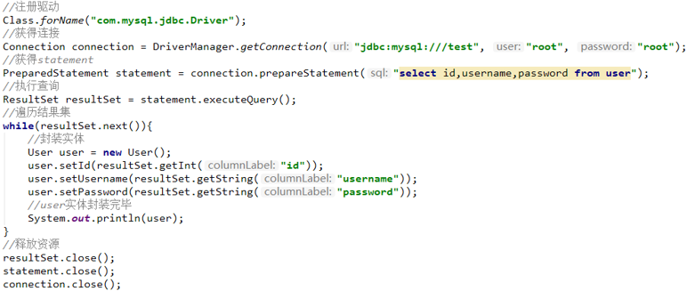
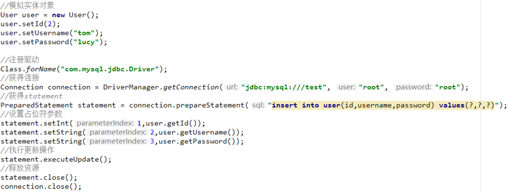

# 第06章   MyBatis基本使用

## 1. 教学内容

- 数据持久化概述
- MyBatis基本使用
- MyBatisPlus初体验

## 2. 知识目标

- 了解什么是持久化？
- 掌握ORM原理
- 掌握常用ORM框架
- 了解MyBatisPlus特性

## 3. 技能目标

-  熟练配置MyBatisPlus运行环境，为后期编码打好基础

----

## 第01节  数据持久化概述 

### 1. 什么是持久化？

- 持久化（Persistence），即把数据（如内存中的对象）保存到可永久保存的存储设备中（如磁盘）。
- 持久化的主要应用是将内存中的数据存储在关系型的数据库中，当然也可以存储在磁盘文件中、XML数据文件中等。

### 2. ORM原理 

- 即Object-Relationl Mapping，它的作用是在关系型数据库和对象之间作一个映射，这样在具体的操作数据库的时候，就不需要再去和复杂的SQL语句打交道，只要像平时操作对象一样操作它就可以了 。

### 3. 常用的ORM框架

- Hibernate：全自动需要些hql语句
- iBATIS：半自动自己写sql语句,可操作性强,小巧
- MyBatis：是一个半自动的ORM持久层框架，内部封装了JDBC。
- MyBatisPlus：是一个Mybatis的增强工具，它在Mybatis的基础上做了增强。

### 4. Mybatis简介

#### 4.1原始jdbc操作（查询数据）



#### 4.2原始jdbc操作（插入数据）



#### 4.3 原始jdbc操作的分析

原始jdbc开发存在的问题如下：

①数据库连接创建、释放频繁造成系统资源浪费从而影响系统性能

②sql 语句在代码中硬编码，造成代码不易维护，实际应用 sql 变化的可能较大，sql 变动需要改变java代码。

③查询操作时，需要手动将结果集中的数据手动封装到实体中。插入操作时，需要手动将实体的数据设置到sql语句的占位符位置

应对上述问题给出的解决方案：

①使用数据库连接池初始化连接资源

②将sql语句抽取到xml配置文件中

③使用反射、内省等底层技术，自动将实体与表进行属性与字段的自动映射

#### 4.4 什么是Mybatis

mybatis 是一个优秀的基于java的持久层框架，它内部封装了jdbc，使开发者只需要关注sql语句本身，而不需要花费精力去处理加载驱动、创建连接、创建statement等繁杂的过程。

mybatis通过xml或注解的方式将要执行的各种 statement配置起来，并通过java对象和statement中sql的动态参数进行映射生成最终执行的sql语句。

最后mybatis框架执行sql并将结果映射为java对象并返回。采用ORM思想解决了实体和数据库映射的问题，对jdbc 进行了封装，屏蔽了jdbc api 底层访问细节，使我们不用与jdbc api 打交道，就可以完成对数据库的持久化操作。

## 第03节  环境准备 

### 1. 数据库准备

构建数据表，用户表和订单表的关系为，一个用户有多个订单，一个订单只从属于一个用户

~~~sql
CREATE TABLE `user` (
  `id` int(11) NOT NULL AUTO_INCREMENT,
  `username` varchar(50) DEFAULT NULL,
  `password` varchar(50) DEFAULT NULL,
  `birthday` varchar(50) DEFAULT NULL,
  PRIMARY KEY (`id`)
) ENGINE=InnoDB DEFAULT CHARSET=utf8;
-- 数据----------------------------
INSERT INTO `user` VALUES ('1', 'lucy', '123', '2018-12-12');
INSERT INTO `user` VALUES ('2', 'haohao', '123', '2019-12-12');
~~~

~~~sql
DROP TABLE IF EXISTS `orders`;
CREATE TABLE `orders` (
  `id` int(11) NOT NULL AUTO_INCREMENT,
  `ordertime` varchar(255) DEFAULT NULL,
  `total` double DEFAULT NULL,
  `uid` int(11) DEFAULT NULL,
  PRIMARY KEY (`id`)
) ENGINE=InnoDB DEFAULT CHARSET=utf8;
-- 数据-----------------------------
INSERT INTO `orders` VALUES ('1', '2018-12-12', '3000', '1');
INSERT INTO `orders` VALUES ('2', '2018-12-12', '4000', '1');
INSERT INTO `orders` VALUES ('3', '2018-12-12', '5000', '2');
~~~

### 2. 添加依赖

```xml
<!--  MyBatisPlus依赖  -->
<dependency>
    <groupId>com.baomidou</groupId>
    <artifactId>mybatis-plus-boot-starter</artifactId>
    <version>3.4.2</version>
</dependency>
<!-- mysql驱动依赖  -->
<dependency>
     <groupId>mysql</groupId>
     <artifactId>mysql-connector-java</artifactId>
     <version>5.1.47</version>
</dependency>
<!--    数据连接池 druid    -->
<dependency>
     <groupId>com.alibaba</groupId>
     <artifactId>druid-spring-boot-starter</artifactId>
     <version>1.1.20</version>
</dependency>
```

### 3. 添加全局配置

```properties
spring.datasource.type=com.alibaba.druid.pool.DruidDataSource
spring.datasource.driver-class-name=com.mysql.jdbc.Driver
spring.datasource.url=jdbc:mysql://localhost:3306/mydb?useSSL=false
spring.datasource.username=root
spring.datasource.password=root
mybatis-plus.configuration.log-impl=org.apache.ibatis.logging.stdout.StdOutImpl

```

### 4. 添加`@MapperScan` 注解

- 在 Spring Boot 启动类中添加 `@MapperScan` 注解，扫描 Mapper 文件夹

```java
@SpringBootApplication
@MapperScan("com.xx.mapper")
public class MybatisplusDemoApplication {
    public static void main(String[] args) {
        SpringApplication.run(MybatisplusDemoApplication.class, args);
    }
}
```

## 第04节 Mybatis的注解开发

###  1. MyBatis的常用注解 

我们先围绕一些基本的CRUD来学习，再学习复杂映射多表操作， MyBatis用于数据表CRUD操作常见注解如下：

| 注解     | 功能                                   |
| -------- | -------------------------------------- |
| @Insert  | 实现插入                               |
| @Update  | 实现更新                               |
| @Delete  | 实现删除                               |
| @Select  | 实现查询                               |
| @Result  | 实现结果集封装                         |
| @Results | 可以与@Result 一起使用，封装多个结果集 |
| @One     | 实现一对一结果集封装                   |
| @Many    | 实现一对多结果集封装                   |

### 2. Mapper实现

接下来完成简单的user表的增删改查的操作

编写实体类User.java

```java
public class User {   
    private int id;
    private String username;
    private String password;
    private String birthday;
}
```

编写UserMapper接口，加入以下增删改查方法

```java
@Mapper
public interface UserMapper {
    @Insert("insert into user values(#{id},#{username},#{password},#{birthday})")
    int add(User user);

    @Update("update user set username=#{username},password=#{password},birthday=#{birthday} where id=#{id}")
    int update(User user);

    @Delete("delete from user where id=#{id}")
    int delete(int id);

    @Select("select * from user where id=#{id}")
    User findById(int id);

    @Select("select * from user")
    List<User> getAll();
}
```

### 3. 控制器实现

创建UserController控制器，在控制器中注入UserMapper实例，注意！一定要添加第3节中的@MapperScan注解，否则无法注入mapper实例。

~~~java
public class UserController {

    @Autowired  //自动注入，Spring会自动实例化UserMapper，并注入此属性中（依赖注入）
    private UserMapper userMapper;
	
}
~~~

添加控制器方法，测试增删改查操作。

~~~java
//  添加用户：localhost:8080/add?id=100&username=zhangsan&password=123&birthday=2020-11-12
    @GetMapping("add")
    public String add(User user){
        int i = userMapper.add(user);
        System.out.println(user);
        if(i > 0){
            return "添加成功";
        }else{
            return "添加失败";
        }
    }
//  更新用户：localhost:8080/update?id=100&username=lisi&password=123&birthday=2020-11-12
    @GetMapping("update")
    public  String update(User user){
        int i = userMapper.update(user);
        if(i > 0){
            return "更新成功";
        }else{
            return "更新失败";
        }
    }

//  删除用户：localhost:8080/del?id=100
    @GetMapping("del")
    public String del(int id){
        int i = userMapper.delete(id);
        if(i > 0){
            return "删除成功";
        }else{
            return "删除失败";
        }
    }

//  查询单个用户：localhost:8080/find?id=1
    @GetMapping("find")
    public User findById(int id){
        User user = userMapper.findById(id);
        return user;
    }
//  查询所有用户：localhost:8080/findAll
    @GetMapping("findAll")
    public List findAll(){
        return userMapper.getAll();
    }
~~~

## 第05节 MyBatis的注解实现复杂映射开发

实现复杂关系映射，可以使用@Results注解，@Result注解，@One注解，@Many注解组合完成复杂关系的配置

| 注解     | 说明                                                         |
| -------- | ------------------------------------------------------------ |
| @Results | 代替<resultMap>标签，该注解中可以加入单个或多个@Result注解   |
| @Result  | 代替<id>标签和<Result>标签，@Result中可以使用以下属性：<br />- column：数据表的字段名称<br />- property: 类中对应的属性名<br />- one: 与@One注解配合，进行一对一的映射<br />- many: 与@Many注解配合，进行一对多的映射 |
| @One     | 代替<assocation>标签，用于指定查询中返回的单一对象<br />通过select属性指定用于多表查询的方法<br />使用格式：@Result(column="",property="",one=@One(select="")) |
| @Many    | 代替<collection>标签,用于指定查询中返回的集合对象<br />使用格式：@Result(column="",property="",many=@Many(select="")) |

### 1. 一对一查询模型

用户表和订单表的关系为，一个用户有多个订单，一个订单只从属于一个用户

一对一查询的需求：查询一个订单，与此同时查询出该订单所属的用户

对应的sql语句：

~~~sql
select * from orders;
select * from user where id=查询出订单的uid;
~~~

创建Order和User实体

~~~java
public class Order {
    private int id;
    private Date ordertime;
    private double total;
    //代表当前订单从属于哪一个客户
    private User user;
}
public class User {   
    private int id;
    private String username;
    private String password;
    private String birthday;
}
~~~

使用注解配置OrderMapper

~~~java
@Mapper
public interface OrderMapper {
    @Select("select * from orders")
    @Results({
            @Result(column = "id",property = "id"),
            @Result(column = "ordertime",property = "ordertime"),
            @Result(column = "total",property = "total"),
            @Result(column = "uid",property = "user",javaType = User.class,
                one = @One(select = "com.xx.mapper.UserMapper.findById")
            ),
    })
    List<Order> findAll();
}
~~~

UserMapper

~~~java
public interface UserMapper {
    @Select("select * from user where id=#{id}")
    User findById(int id);
}
~~~

创建OrderController测试

~~~java
@RestController
public class OrderController {

    @Autowired
    private OrderMapper orderMapper;

    @GetMapping("order")
    public List<Order> find(){

        return orderMapper.findAll();
    }
}
~~~

### 2. 一对多查询模型

用户表和订单表的关系为，一个用户有多个订单，一个订单只从属于一个用户

一对多查询的需求：查询一个用户，与此同时查询出该用户具有的订单

对应的sql语句：

~~~sql
select * from user;
select * from orders where uid=查询出用户的id;
~~~

修改User实体

~~~java
public class Order {
    private int id;
    private String ordertime;
    private double total;
    //代表当前订单从属于哪一个客户
    private User user;
}
public class User {   
    private int id;
    private String username;
    private String password;
    private String birthday;
    //代表当前用户具备哪些订单
    private List<Order> orders;
}
~~~

使用注解配置Mapper

~~~java
public interface UserMapper {
    @Select("select * from user")
    @Results({
            @Result(column = "id",property = "id"),
            @Result(column = "username",property = "username"),
            @Result(column = "password",property = "password"),
            @Result(column = "id",property = "orders",javaType = List.class,
                many=@Many(select = "com.xx.mapper.OrderMapper.findByUid")
            )
    })
    List<User> findAllUserAndOrder();
}

public interface OrderMapper {
    @Select("select * from orders where uid=#{uid}")
    List<Order> findByUid(int uid);
}
~~~

在UserController中测试

~~~java
//  查询所有用户：localhost:8080/findAll
@GetMapping("findAll")
public List findAll(){
    return userMapper.findAllUserAndOrder();
}
~~~