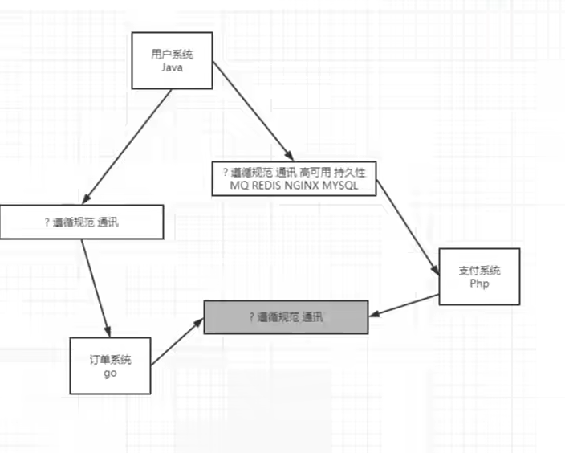

## 什么是中间件

### 1、什么是中间件

我国企业从20世纪80年代开始就逐渐进行信息化建设，由于方法和体系的不成熟，以及企业业务和市场需求的不断变化，一个企业可能同时运行着多个不同的业务系统，这些系统可能基于不同的操作系统、不同的数据库、异构的网络环境。现在的问题是，如何把这些信息系统结合成一个有机地协同工作的整体，真正实现企业跨平台、分布式应用。中间件便是解决之道，它用自己的复杂换取了企业应用的简单。

```
中间件（Middleware）是处于操作系统和应用程序之间的软件，也有人认为它应该属于操作系统中的一部分。
人们在使用中间件时，往往是一组中间件集成在一起，构成一个平台（包括开发平台和运行平台），但在这组中间件中必须要有一个通信中间件，即中间件=平台+通信，这个定义也限定了只有用于分布式系统中才能称为中间件，同时还可以把它与支撑软件和实用软件区分开来。
```

举例：
1，RMI（Remote Method Invocations, 远程调用）
2，Load Balancing(负载均衡，将访问负荷分散到各个服务器中)
3，Transparent Fail-over(透明的故障切换)
4，Clustering(集群,用多个小的服务器代替大型机）
5，Back-end-Integration(后端集成，用现有的、新开发的系统如何去集成遗留的系统)
6，Transaction事务（全局/局部）全局事务（分布式事务）局部事务（在同一数据库联接内的事务）
7，Dynamic Redeployment(动态重新部署,在不停止原系统的情况下，部署新的系统）
8，System Management(系统管理)
9，Threading(多线程处理)
10，Message-oriented Middleware面向消息的中间件（异步的调用编程）
11，Component Life Cycle(组件的生命周期管理)
12，Resource pooling（资源池）
13，Security（安全）
14，Caching（缓存）

### 2、为什么需要使用消息中间件

具体地说，中间件屏蔽了底层操作系统的复杂性，使程序开发人员面对一个简单而统一的开发环境，减少程序设计的复杂性，将注意力集中在自己的业务上，不必再为程序在不同系统软件上的移植而重复工作，从而大大减少了技术上的负担。中间件带给应用系统的，不只是开发的简便、开发周期的缩短，也减少了系统的维护、运行和管理的工作量，还减少了计算机总体费用的投入。

### 3、中间件特点

为解决分布异构问题，人们提出了中间件(middleware)的概念。中间件是位于平台(硬件和操作系统)和应用之间的通用服务，如下图所示，这些服务具有标准的程序接口和协议。针对不同的操作系统和硬件平台，它们可以有符合接口和协议规范的多种实现。


也许很难给中间件一个严格的定义，但中间件应具有如下的一些特点：
（1）满足大量应用的需要
（2）运行于多种硬件和OS平台
（3）支持分布计算，提供跨网络、硬件和OS平台的透明性的应用或服务的交互
（4）支持标准的协议
（5）支持标准的接口

由于标准接口对于可移植性和标准协议对于互操作性的重要性，中间件已成为许多标准化工作的主要部分。对于应用软件开发，中间件远比操作系统和网络服务更为重要，中间件提供的程序接口定义了一个相对稳定的高层应用环境，不管底层的计算机硬件和系统软件怎样更新换代，只要将中间件升级更新，并保持中间件对外的接口定义不变，应用软件几乎不需任何修改，从而保护了企业在应用软件开发和维护中的重大投资。

> 简单说：中间件有个很大的特点，是脱离于具体设计目标，而具备提供普遍独立功能需求的模块。这使得中间件一定是可替换的。如果一个系统设计中，中间件是不可替换的，不是架构、框架设计有问题，那么就是这个中间件，在别处可能是个中间件，在这个系统内是引擎。哈。

### 4、在项目中什么时候使用中间件技术

在项目的架构和重构中，使用任何技术和架构的改变我们都需要谨慎斟酌和思考，因为任何技术的融入和变化都可能人员，技术，和成本的增加，中间件的技术一般现在一些互联网公司或者项目中使用比较多，如果你仅仅还只是一个初创公司建议还是使用单体架构，最多加个缓存中间件即可，不要盲目追求新或者所谓的高性能，而追求的背后一定是业务的驱动和项目的驱动，因为一旦追求就意味着你的学习成本，公司的人员结构以及服务器成本，维护和运维的成本都会增加，所以需要谨慎选择和考虑。

但是作为一个开放人员，一定要有学习中间件技术的能力和思维，否则很容易当项目发展到一个阶段再去掌握估计或者在面试中提及，就会给自己带来不小的困扰，在当今这个时代这些技术也并不是什么新鲜的东西，如果去掌握和挖掘最关键的还是自己花时间和花精力去探讨和研究。

> 如果不使用中间件，而是开发单体应用，就无法做到用Java开发用户系统，用Php开发支付系统，用Go开发订单系统。



