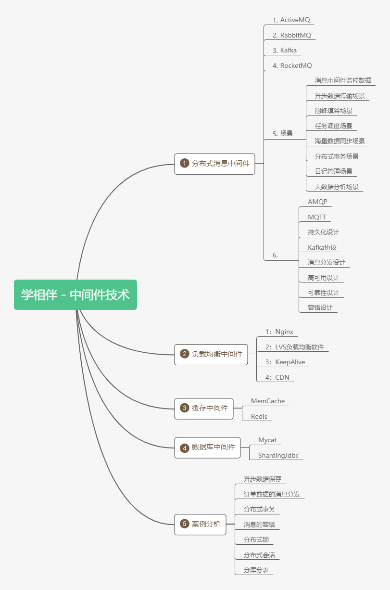

## 中间件技术及架构的概述

中间件技术：

### 01、学习中间件的方式和技巧

**1：理解中间件在项目架构中的作用，以及各中间件的底层实现。**
2：可以使用一些类比的生活概念去理解中间件，
3：使用一些流程图或者脑图的方式去梳理各个中间件在架构中的作用
**4：尝试用java技术去实现中间件的原理**
5：静下来去思考中间件在项目中设计的和使用的原因
6：如果找到对应的替代总结方案
7：尝试编写博文总结类同中间件技术的对比和使用场景。
**8：学会查看中间件的源码以及开开源项目和博文。**

### 02、学习目标

- 什么是消息中间件
- 什么是协议
- 什么是持久化
- 消息分发
- 消息的高可用
- 消息的集群
- 消息的容错
- 消息的冗余

### 03、企业早期单体架构

在实际的项目中，大部分的企业项目开发中，在早期都采用的是单体的架构模式，如下图：

### 04、单体架构

在企业开发的中，大部分的初期架构都采用的是单体架构的模式进行架构，而这种架构的典型的特点：就是把所有的业务和模块，源代码，静态资源文件等都放在一个工程中，如果其中的一个模块升级或者迭代发生一个很小变动都会重新编译和重新部署项目。 这种的架构存在的问题就是：
1：耦合度太高
2：运维的成本过高
3：不易维护
4：服务器的成本高
5：以及升级架构的复杂度也会增大
这样就有后续的分布式架构系统。如下

### 05、分布式架构

何谓分布式系统呢：

> 通俗一点：就是一个请求由服务器端的多个服务（服务或者系统）协同处理完成

和单体架构不同的是，单体架构是一个请求发起jvm调度线程（确切的是tomcat线程池）分配线程Thread来处理请求直到释放，而分布式是系统是：一个请求是由多个系统共同来协同完成，jvm和环境都可能是独立。
如果生活中的比喻的话，单体架构就像建设一个小房子很快就能够搞定，如果你要建设一个鸟巢或者大型的建筑，你就必须是各个环节的协同和分布，这样目的也是项目发展都后期的时候要去部署和思考的问题。

我们也不难看出来：分布式架构系统存在的特点和问题如下：

**存在问题**
1：学习成本高，技术栈过多
2：运维成本和服务器成本增高
3：人员的成本也会增高
4：项目的负载度也会上升
5：面临的错误和容错性也会成倍增加
6：占用的服务器端口和通讯的选择的成本高
7：安全性的考虑和因素逼迫可能选择RMI/MQ相关的服务器端通讯。

**好处**
1：服务系统的独立，占用的服务器资源减少和占用的硬件成本减少，
确切的说是：可以合理的分配服务资源，不造成服务器资源的浪费
2：系统的独立维护和部署，耦合度降低，可插拔性。
3：系统的架构和技术栈的选择可以变的灵活（而不是单纯的选择java）
4：弹性的部署，不会造成平台因部署	造成的瘫痪和停服的状态。

