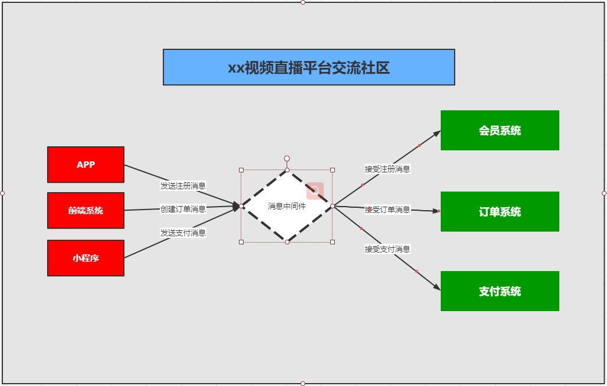
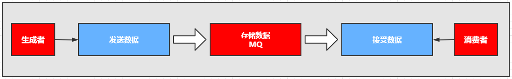

## 基于消息中间件的分布式系统的架构

### 01、基于消息中间件的分布式系统的架构

从上图中可以看出来，消息中间件的是
1：利用可靠的消息传递机制进行系统和系统直接的通讯
2：通过提供消息传递和消息的排队机制，它可以在分布式系统环境下扩展进程间的通讯。

### 02、消息中间件应用的场景

1:跨系统数据传递
2:高并发的流量削峰
3:数据的分发和异步处理
4:大数据分析与传递
5:分布式事务
比如你有一个数据要进行迁移或者请求并发过多的时候，比如你有10W的并发请求下订单，我们可以在这些订单入库之前，我们可以把订单请求堆积到消息队列中，让它稳健可靠的入库和执行。

### 03、常见的消息中间件

ActiveMQ、RabbitMQ、Kafka、RocketMQ等。

### 04、消息中间件的本质及设计

它是一种接受数据，接受请求、存储数据、发送数据等功能的技术服务。

> MQ消息队列：负责数据的接受，存储和传递，所以性能要高于普通服务和技术。

谁来生产消息，存储消息和消费消息呢？

### 05、消息中间件的核心组成部分

1：消息的协议
2：消息的持久化机制
3：消息的分发策略
4：消息的高可用，高可靠
5：消息的容错机制

### 06、小结

其实不论选择单体架构还是分布式架构都是项目开发的一个阶段，在什么阶段选择适合的架构方式，而不能盲目追求，最后造成的后果和问题都需要自己买单。但是作为一个开发人员学习和探讨新的技术是我们每个程序开发者都应该去保持和思考的问题。当我们没办法去改变社会和世界的时候，我们为了生活和生存那就必须要迎合企业和市场的需求，发挥你的价值和所学的才能，创造价值和实现自我。

