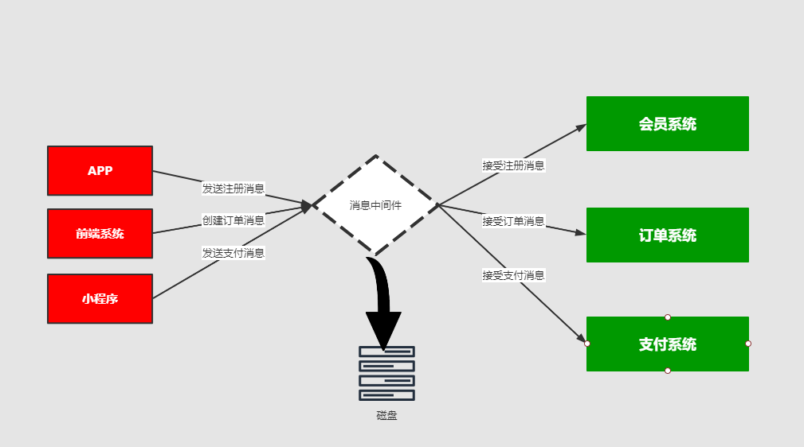

## 消息队列持久化

### 01、持久化

简单来说就是将数据存入磁盘，而不是存在内存中随服务器重启断开而消失，使数据能够永久保存。

### 02、常见的持久化方式

|          | ActiveMQ | RabbitMQ | Kafka | RocketMQ |
| -------- | -------- | -------- | ----- | -------- |
| 文件存储 | 支持     | 支持     | 支持  | 支持     |
| 数据库   | 支持     | /        | /     | /        |

