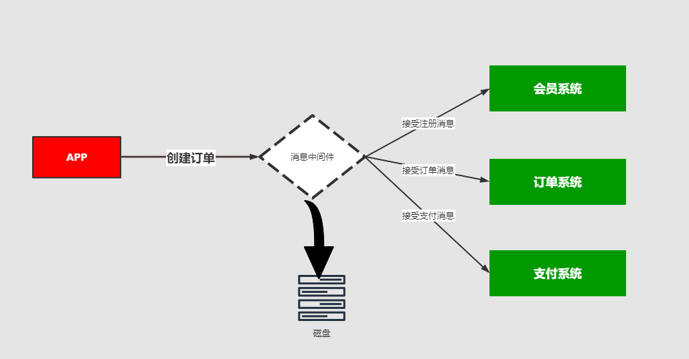
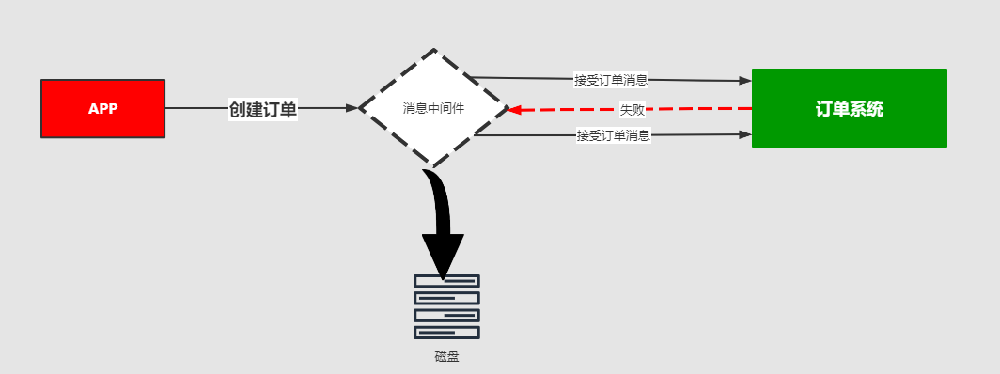

## 消息的分发策略

### 01、消息的分发策略

MQ消息队列有如下几个角色
1：生产者
2：存储消息
3：消费者
那么生产者生成消息以后，MQ进行存储，消费者是如何获取消息的呢？一般获取数据的方式无外乎推（push）或者拉（pull）两种方式，典型的git就有推拉机制，我们发送的http请求就是一种典型的拉取数据库数据返回的过程。而消息队列MQ是一种推送的过程，而这些推机制会适用到很多的业务场景，也有很多对应推机制策略。

### 02、场景分析一

> 比如我在APP上下了一个订单，我们的系统和服务很多，我们如何得知这个消息被那个系统或者那些服务或者系统进行消费，那这个时候就需要一个分发的策略。这就需要消费策略。或者称之为消费的方法论。

### 03、场景分析二

> 在发送消息的过程中可能会出现异常，或者网络的抖动，故障等等原因造成消息的无法消费，比如用户在下订单，消费MQ接受，订单系统出现故障，导致用户支付失败，那么这个时候就需要消息中间件就必须支持消息重试机制策略。也就是支持：出现问题和故障的情况下，消息不丢失还可以进行重发。

### 04、消息分发策略的机制和对比

|          | ActiveMQ | RabbitMQ | Kafka | RocketMQ |
| -------- | -------- | -------- | ----- | -------- |
| 发布订阅 | 支持     | 支持     | 支持  | 支持     |
| 轮询分发 | 支持     | 支持     | 支持  | /        |
| 公平分发 | /        | 支持     | 支持  | /        |
| 重发     | 支持     | 支持     | /     | 支持     |
| 消息拉取 | /        | 支持     | 支持  | 支持     |

