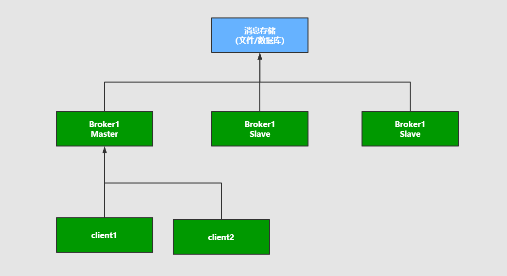
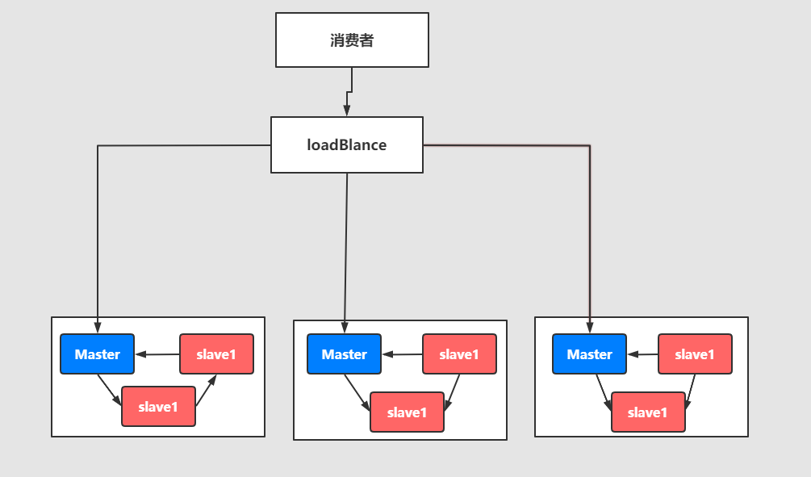

## 消息队列高可用和高可靠

### 01、什么是高可用机制

所谓高可用：是指产品在规定的条件和规定的时刻或时间内处于可执行规定功能状态的能力。
当业务量增加时，请求也过大，一台消息中间件服务器的会触及硬件（CPU,内存，磁盘）的极限，一台消息服务器你已经无法满足业务的需求，所以消息中间件必须支持集群部署。来达到高可用的目的。

### 02、集群模式1 - Master-slave主从共享数据的部署方式

解说：生产者将消费发送到Master节点，所有的都连接这个消息队列共享这块数据区域，Master节点负责写入，一旦Master挂掉，slave节点继续服务。从而形成高可用，

### 03、集群模式2 - Master- slave主从同步部署方式

解释：这种模式写入消息同样在Master主节点上，但是主节点会同步数据到slave节点形成副本，和zookeeper或者redis主从机制很类同。这样可以达到负载均衡的效果，如果消费者有多个，就可以去不同的节点就行消费，因为消息的拷贝和同步会占用很大的带宽和网络资源。在后续的RabbitMQ中会有使用。

### 04、集群模式3 - Breoker-cluster多主集群同步部署模式

解释：和上面的区别不是特别的大，但是它的写入可以往任意节点去写入。

### 05、集群模式4 - Breoker-cluster多主集群转发部署模式

解释：如果你插入数据到broker-1中，元数据信息会存储 数据的相关描述 和 记录存放的位置（队列）。
它会对描述信息也就是元数据信息就行同步，如果消费者在broker-2中进行消费，发现自己几点没有对应的消息，可以从对应的元数据信息中去查询，然后返回对应的消息信息。
场景：比如买火车票或者黄牛买演唱会门票，比如第一个黄牛有顾客说要买的演唱会门票，但是这个黄牛没有票了，然后他会去联系其他的黄牛询问，如果有就返回。

### 06、集群模式5 Master-slave与Breoker-cluster组合的方案

解释：实现多主多从的热备机制来完成消息的高可用以及数据的热备机制，在生产规模达到一定的阶段的时候，这种使用的频率比较高。

这么集群模式，具体在后续的课程中会进行一个分析和讲解。他们的最终目的都是为保证：消息服务器不会挂掉，出现了故障依然可以抱着消息服务继续使用。

反正终归三句话：
1：要么消息共享，
2：要么消息同步
3：要么元数据共享

### 07、什么是高可靠机制

所谓高可靠是指：是指系统可以无故障低持续运行，比如一个系统突然崩溃，报错，异常等等并不影响线上业务的正常运行，出错的几率极低，就称之为：高可靠。
在高并发的业务场景中，如果不能保证系统的高可靠，那造成的隐患和损失是非常严重的。
如何保证中间件消息的可靠性呢？可以从两个方面考虑：
1：消息的传输：通过协议来保证系统间数据解析的正确性。
2：消息的存储可靠：通过持久化来保证消息的可靠性。

