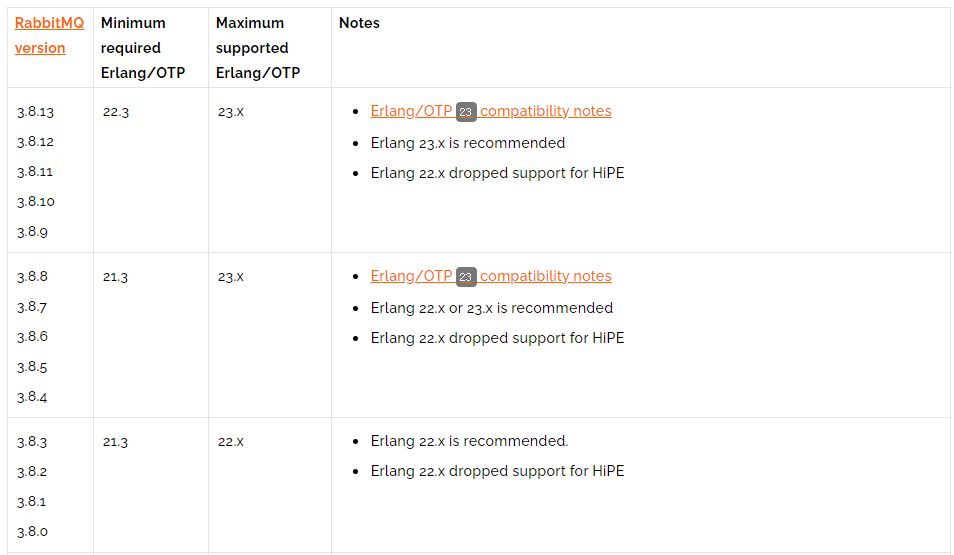
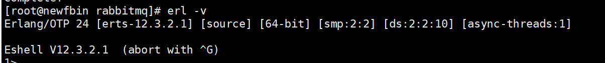
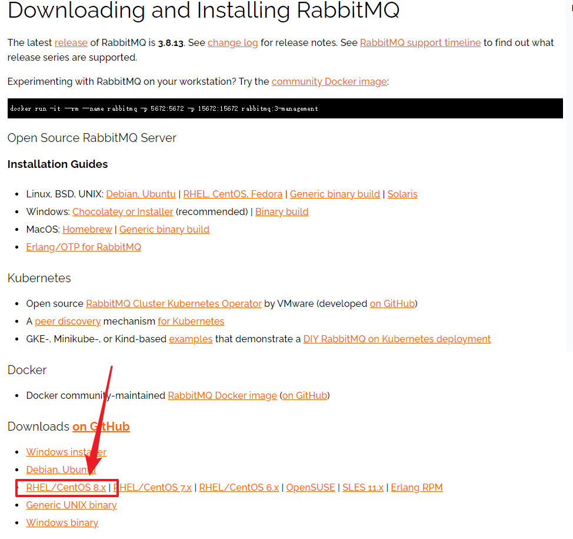
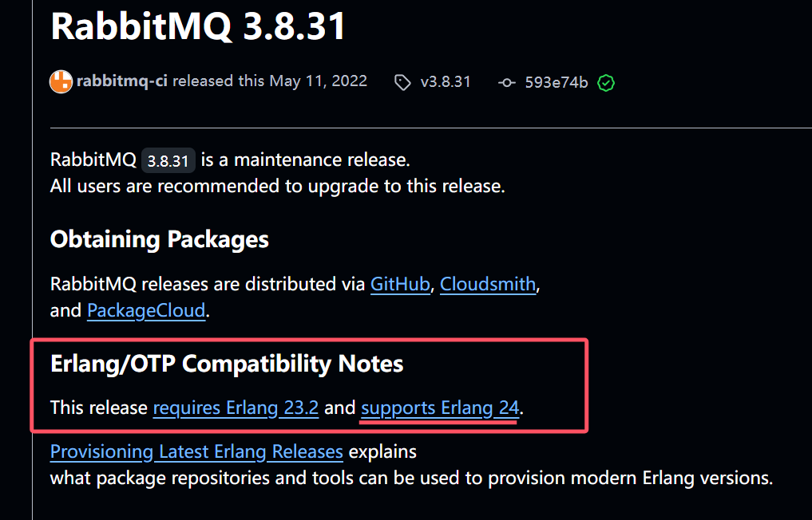

## RabbitMQ入门及安装

### 00、RabbitMQ各部分简单介绍（By 鱼皮智能BI项目）


### 01、概述

官网：https://www.rabbitmq.com/
什么是RabbitMQ,官方给出来这样的解释：

> RabbitMQ is the most widely deployed open source message broker.
> With tens of thousands of users, RabbitMQ is one of the most popular open source message brokers. From T-Mobile to Runtastic, RabbitMQ is used worldwide at small startups and large enterprises.
> RabbitMQ is lightweight and easy to deploy on premises and in the cloud. It supports multiple messaging protocols. RabbitMQ can be deployed in distributed and federated configurations to meet high-scale, high-availability requirements.
> RabbitMQ runs on many operating systems and cloud environments, and provides a wide range of developer tools for most popular languages.
> 翻译以后：
> RabbitMQ是部署最广泛的开源消息代理。
> RabbitMQ拥有成千上万的用户，是最受欢迎的开源消息代理之一。从T-Mobile 到Runtastic，RabbitMQ在全球范围内的小型初创企业和大型企业中都得到使用。
> RabbitMQ轻巧，易于在内部和云中部署。它支持多种消息传递协议。RabbitMQ可以部署在分布式和联合配置中，以满足大规模，高可用性的要求。
> RabbitMQ可在许多操作系统和云环境上运行，并为大多数流行语言提供了广泛的开发人员工具。

简单概述：
RabbitMQ是一个开源的遵循AMQP协议实现的基于Erlang语言编写，支持多种客户端（语言）。用于在分布式系统中存储消息，转发消息，具有高可用，高可扩性，易用性等特征。

### 02、安装RabbitMQ

1：下载地址：https://www.rabbitmq.com/download.html
2：环境准备：CentOS7.x+ / Erlang
RabbitMQ是采用Erlang语言开发的，所以系统环境必须提供Erlang环境，第一步就是安装Erlang。

> erlang和RabbitMQ版本的按照比较: https://www.rabbitmq.com/which-erlang.html
> 

### 03、 Erlang安装

查看系统版本号

```shell
[root@iZm5eauu5f1ulwtdgwqnsbZ ~]# lsb_release -a
LSB Version:    :core-4.1-amd64:core-4.1-noarch
Distributor ID: CentOS
Description:    CentOS Linux release 8.3.2011
Release:        8.3.2011
Codename:       n/a
```

#### 3-1:安装下载

参考地址：https://www.erlang-solutions.com/downloads/

```shell
wget https://packages.erlang-solutions.com/erlang-solutions-2.0-1.noarch.rpm
rpm -Uvh erlang-solutions-2.0-1.noarch.rpm
```

#### 3-2：安装成功

```shell
# 在上一步中，仅安装erlang-solutions包并不足以提供Erlang本身。这个包是一个软件源配置文件，指向Erlang的各种版本和依赖项。
# 安装此包是为了提供 Erlang 的软件源，这样你可以使用 yum 来安装 Erlang 及其相关依赖项。
yum install -y erlang
```

#### 3-3：安装成功

```
erl -v
```



### 04、安装socat

```shell
yum install -y socat
```

### 05、安装rabbitmq

下载地址：https://www.rabbitmq.com/download.html


#### 5-1:下载rabbitmq

>  由于我下载的erlang版本为24，而RabbitMQ 3.8.31版本支持erlang24,因此这里使用 3.8.31版本
>
>  

```shell
# 如果服务器没有开梯子，不要使用wget下载。因为下载的地址再github，下载速度将会很慢
> wget https://github.com/rabbitmq/rabbitmq-server/releases/download/v3.8.31/rabbitmq-server-3.8.31-1.el8.noarch.rpm

> rpm -Uvh rabbitmq-server-3.8.31-1.el8.noarch.rpm
```

> 也通过将文件下载到本地，再上传到服务器


#### 5-2:启动rabbitmq服务

```shell
# 启动服务
> systemctl start rabbitmq-server
# 查看服务状态
> systemctl status rabbitmq-server
# 停止服务
> systemctl stop rabbitmq-server
# 开机启动服务
> systemctl enable rabbitmq-server
```

### 06、RabbitMQ的配置

RabbitMQ默认情况下有一个配置文件，定义了RabbitMQ的相关配置信息，默认情况下能够满足日常的开发需求。如果需要修改需要，需要自己创建一个配置文件进行覆盖。
参考官网：
1:https://www.rabbitmq.com/documentation.html
2:https://www.rabbitmq.com/configure.html
3:https://www.rabbitmq.com/configure.html#config-items
4：https://github.com/rabbitmq/rabbitmq-server/blob/add-debug-messages-to-quorum_queue_SUITE/docs/rabbitmq.conf.example

#### 06-1、相关端口

> 5672:RabbitMQ的通讯端口
> 25672:RabbitMQ的节点间的CLI通讯端口是
> 15672:RabbitMQ HTTP_API的端口，管理员用户才能访问，用于管理RabbitMQ,需要启动Management插件。
> 1883，8883：MQTT插件启动时的端口。
> 61613、61614：STOMP客户端插件启用的时候的端口。
> 15674、15675：基于webscoket的STOMP端口和MQTT端口

一定要注意：RabbitMQ 在安装完毕以后，会绑定一些端口，如果你购买的是阿里云或者腾讯云相关的服务器一定要在安全组中把对应的端口添加到防火墙。

