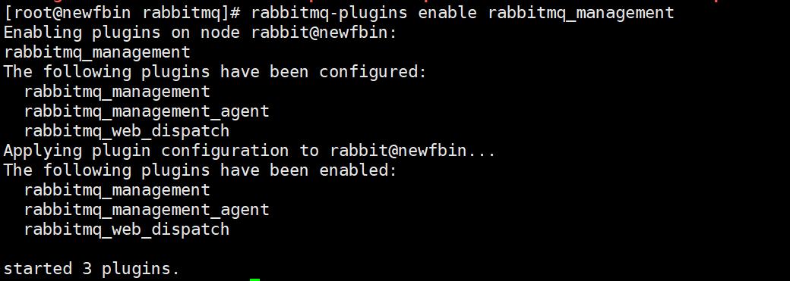
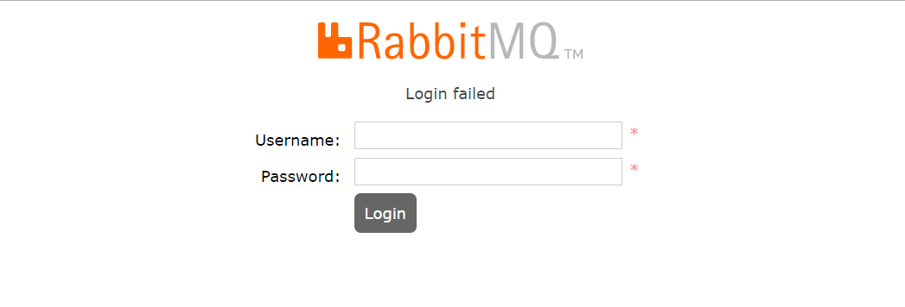

## RabbitMQWeb管理界面及授权操作

### 01、RabbitMQ管理界面

#### 01-1：默认情况下，rabbitmq是没有安装web端的客户端插件，需要安装才可以生效

```shell
rabbitmq-plugins enable rabbitmq_management
```



> 说明：rabbitmq有一个默认**账号和密码**是：`guest` 默认情况只能在localhost本机下访问，所以需要添加一个远程登录的用户。

#### 01-2：安装完毕以后，重启服务即可

```shell
systemctl restart rabbitmq-server
```

> 一定要记住，在对应服务器(阿里云，腾讯云等)的安全组中开放`15672`的端口。

#### 01-3：在浏览器访问

> 如果要访问远程服务器的RabbitMQ，需要添加一个远程登录的用户。详细见02步

http://ip:15672/ 如下：


### 02、授权账号和密码

#### 2-1：新增用户

```shell
rabbitmqctl add_user admin admin
```

#### 2-2:设置用户分配操作权限

```shell
rabbitmqctl set_user_tags admin administrator
```

用户级别：

- 1、administrator 可以登录控制台、查看所有信息、可以对rabbitmq进行管理
- 2、monitoring 监控者 登录控制台，查看所有信息
- 3、policymaker 策略制定者 登录控制台,指定策略
- 4、managment 普通管理员 登录控制台

#### 2-3：为用户添加资源权限

```shell
# 由于admin用户已经是administrator,自然拥有所有资源的权限，因此不需要执行这段命令
rabbitmqctl.bat set_permissions -p / admin ".*" ".*" ".*"
```

### 03、小结：

```shell
rabbitmqctl add_user 账号 密码
rabbitmqctl set_user_tags 账号 administrator
rabbitmqctl change_password Username Newpassword 修改密码
rabbitmqctl delete_user Username 删除用户
rabbitmqctl list_users 查看用户清单
rabbitmqctl set_permissions -p / 用户名 ".*" ".*" ".*" 为用户设置administrator角色
rabbitmqctl set_permissions -p / root ".*" ".*" ".*"
```

