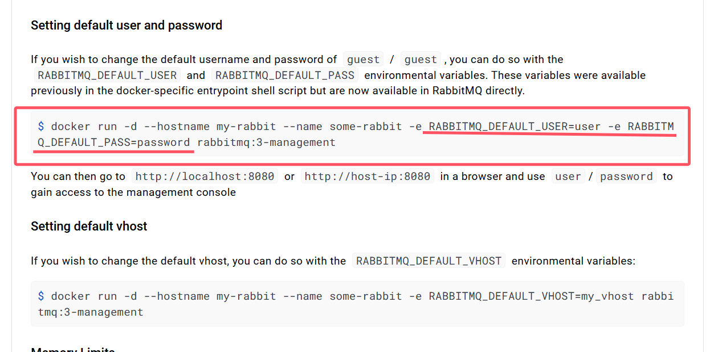

## RabbitMQ之Docker安装

> 有关Docker的安装和操作，见03-01-Docker

### 01、Docker安装RabbitMQ

#### 1-1、虚拟化容器技术—Docker的安装

```shell
（1）yum 包更新到最新
> yum update
（2）安装需要的软件包， yum-util 提供yum-config-manager功能，另外两个是devicemapper驱动依赖的
> yum install -y yum-utils device-mapper-persistent-data lvm2
（3）设置yum源为阿里云
> yum-config-manager --add-repo http://mirrors.aliyun.com/docker-ce/linux/centos/docker-ce.repo
（4）安装docker
> yum install docker-ce -y
（5）安装后查看docker版本
> docker -v
 (6) 安装加速镜像
 sudo mkdir -p /etc/docker
 sudo tee /etc/docker/daemon.json <<-'EOF'
 {
  "registry-mirrors": ["https://0wrdwnn6.mirror.aliyuncs.com"]
 }
 EOF
 sudo systemctl daemon-reload
 sudo systemctl restart docker
```

#### 1-2、docker的相关命令

```shell
# 启动docker：
systemctl start docker
# 停止docker：
systemctl stop docker
# 重启docker：
systemctl restart docker
# 查看docker状态：
systemctl status docker
# 开机启动：  
systemctl enable docker
systemctl unenable docker
# 查看docker概要信息
docker info
# 查看docker帮助文档
docker --help
```

#### 1-3、安装rabbitmq

参考网站：
1：https://www.rabbitmq.com/download.html
2：https://registry.hub.docker.com/_/rabbitmq/

#### 1-4、获取rabbit镜像：

```shell
docker pull rabbitmq:management
```

#### 1-5、创建并运行容器

```shell
docker run -di --name=myrabbit -p 15672:15672 rabbitmq:management
```

--hostname：指定容器主机名称
--name:指定容器名称
-p:将mq端口号映射到本地
或者运行时设置用户和密码

```shell
docker run -di --name myrabbit -e RABBITMQ_DEFAULT_USER=admin -e RABBITMQ_DEFAULT_PASS=admin -p 15672:15672 -p 5672:5672 -p 25672:25672 -p 61613:61613 -p 1883:1883 rabbitmq:management
```

> 根据DockerHub上的rabbitmq官方镜像文档可以看到，启动容器时设置用户和密码的方法
>
> 

查看日志

```shell
docker logs -f myrabbit
```

#### 1-6、容器运行正常

使用 `http://你的IP地址:15672` 访问rabbit控制台

### 02、额外Linux相关排查命令

```shell
> more xxx.log  查看日记信息> netstat -naop | grep 5672 查看端口是否被占用> ps -ef | grep 5672  查看进程> systemctl stop 服务
```

