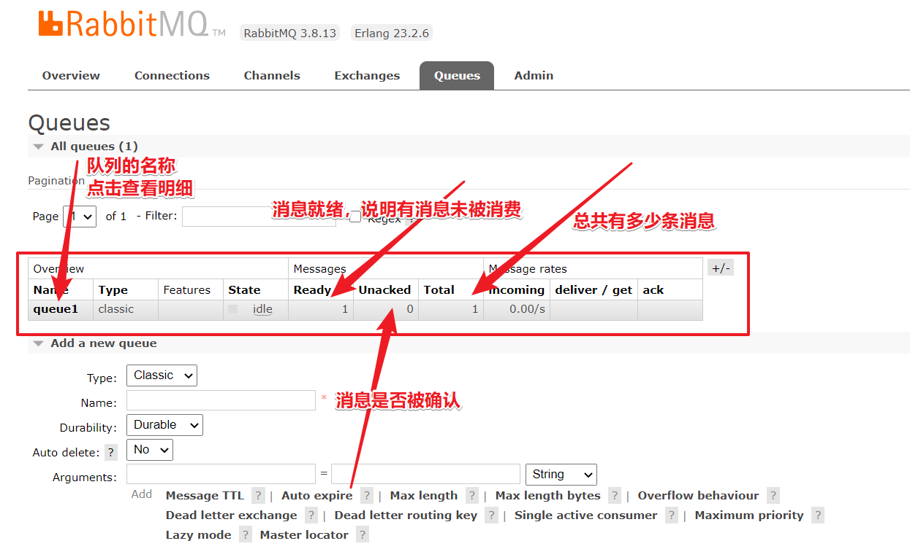
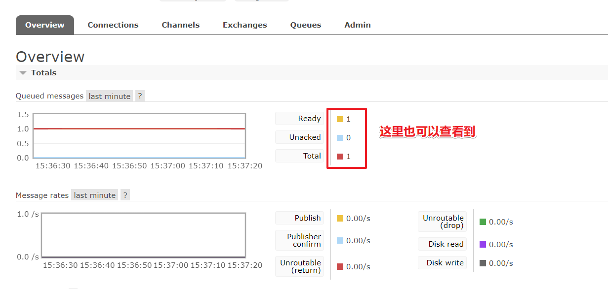

## RabbitMQ入门案例 - Simple 简单模式

### 01、实现步骤

1：jdk1.8
2：构建一个maven工程
3：导入rabbitmq的maven依赖
4：启动rabbitmq-server服务
5：定义生产者
6：定义消费者
7：观察消息在rabbitmq-server服务中的过程

### 02、构建一个maven工程


### 03、导入rabbitmq的maven依赖

#### 03-1：Java原生依赖

```xml
<dependency>
    <groupId>com.rabbitmq</groupId>
    <artifactId>amqp-client</artifactId>
    <version>5.10.0</version>
</dependency>
```

#### 03-2：spring依赖

```xml
<dependency>
    <groupId>org.springframework.amqp</groupId>
    <artifactId>spring-amqp</artifactId>
    <version>2.2.5.RELEASE</version>
</dependency>
<dependency>
    <groupId>org.springframework.amqp</groupId>
    <artifactId>spring-rabbit</artifactId>
    <version>2.2.5.RELEASE</version>
</dependency>
```

###### 03-3、springboot依赖

```xml
<dependency>
    <groupId>org.springframework.boot</groupId>
    <artifactId>spring-boot-starter-amqp</artifactId>
</dependency>
```

上面根据自己的项目环境进行选择即可。

> 番外：rabbitmq和spring同属一个公司开放的产品，所以他们的支持也是非常完善，这也是为什么推荐使用rabbitmq的一个原因。

### 04、启动rabbitmq-server服务

```shell
systemctl start rabbitmq-server
或者
docker start myrabbit
```

### 05、定义生产者

```java
package com.xuexiangban.rabbitmq.simple;
import com.rabbitmq.client.Channel;
import com.rabbitmq.client.Connection;
import com.rabbitmq.client.ConnectionFactory;
/**
 * @author: 学相伴-飞哥
 * @description: Producer 简单队列生产者
 * @Date : 2021/3/2
 */
public class Producer {
    public static void main(String[] args) {
        // 1: 创建连接工厂
        ConnectionFactory connectionFactory = new ConnectionFactory();
        // 2: 设置连接属性
        connectionFactory.setHost("47.97.4.188");
        connectionFactory.setPort(5672);
        connectionFactory.setVirtualHost("/");
        connectionFactory.setUsername("admin");
        connectionFactory.setPassword("admin");
        Connection connection = null;
        Channel channel = null;
        try {
            // 3: 从连接工厂中获取连接
            connection = connectionFactory.newConnection("生产者");
            // 4: 从连接中获取通道channel
            channel = connection.createChannel();
            // 5: 申明队列queue存储消息
            /*
             *  如果队列不存在，则会创建
             *  Rabbitmq不允许创建两个相同的队列名称，否则会报错。
             *
             *  @params1： queue 队列的名称
             *  @params2： durable 队列是否持久化
             *  @params3： exclusive 是否排他，即是否私有的，如果为true,会对当前队列加锁，其他的通道不能访问，并且连接自动关闭
             *  @params4： autoDelete 是否自动删除，当最后一个消费者断开连接之后是否自动删除消息。
             *  @params5： arguments 可以设置队列附加参数，设置队列的有效期，消息的最大长度，队列的消息生命周期等等。
             * */
            channel.queueDeclare("queue1", false, false, false, null);
            // 6： 准备发送消息的内容
            String message = "你好，学相伴！！！";
            // 7: 发送消息给中间件rabbitmq-server
            // @params1: 交换机exchange
            // @params2: 队列名称/routing
            // @params3: 属性配置
            // @params4: 发送消息的内容
            channel.basicPublish("", "queue1", null, message.getBytes());
            System.out.println("消息发送成功!");
        } catch (Exception ex) {
            ex.printStackTrace();
            System.out.println("发送消息出现异常...");
        } finally {
            // 7: 释放连接关闭通道
            if (channel != null && channel.isOpen()) {
                try {
                    channel.close();
                } catch (Exception ex) {
                    ex.printStackTrace();
                }
            }
            if (connection != null) {
                try {
                    connection.close();
                } catch (Exception ex) {
                    ex.printStackTrace();
                }
            }
        }
    }
}
```

1：执行发送，这个时候可以在web控制台查看到这个队列queue的信息

断点执行到这一行时，可以看到创建了一个新的连接：






2：我们可以进行对队列的消息进行预览和测试如下：


3:进行预览和获取消息进行测试


### 06、定义消费者

```java
package com.xuexiangban.rabbitmq.simple;
import com.rabbitmq.client.Channel;
import com.rabbitmq.client.Connection;
import com.rabbitmq.client.ConnectionFactory;
/**
 * @author: 学相伴-飞哥
 * @description: Producer 简单队列生产者
 * @Date : 2021/3/2
 */
public class Consumer {
    public static void main(String[] args) {
        // 1: 创建连接工厂
        ConnectionFactory connectionFactory = new ConnectionFactory();
        // 2: 设置连接属性
        connectionFactory.setHost("47.97.4.188");
        connectionFactory.setPort(5672);
        connectionFactory.setVirtualHost("/");
        connectionFactory.setUsername("admin");
        connectionFactory.setPassword("admin");
        Connection connection = null;
        Channel channel = null;
        try {
            // 3: 从连接工厂中获取连接
            connection = connectionFactory.newConnection("消费者");
            // 4: 从连接中获取通道channel
            channel = connection.createChannel();
            // 5: 申明队列queue存储消息
            /*
             *  如果队列不存在，则会创建
             *  Rabbitmq不允许创建两个相同的队列名称，否则会报错。
             *
             *  @params1： queue 队列的名称
             *  @params2： durable 队列是否持久化
             *  @params3： exclusive 是否排他，即是否私有的，如果为true,会对当前队列加锁，其他的通道不能访问，并且连接自动关闭
             *  @params4： autoDelete 是否自动删除，当最后一个消费者断开连接之后是否自动删除消息。
             *  @params5： arguments 可以设置队列附加参数，设置队列的有效期，消息的最大长度，队列的消息生命周期等等。
             * */
            channel.basicConsume("queue1", false, false, false, null);
            // 6： 准备发送消息的内容
            String message = "你好，学相伴！！！";
            // 7: 发送消息给中间件rabbitmq-server
            // @params1: 交换机exchange
            // @params2: 队列名称/routing
            // @params3: 属性配置
            // @params4: 发送消息的内容
            channel.basicPublish("", "queue1", null, message.getBytes());
            System.out.println("消息发送成功!");
        } catch (Exception ex) {
            ex.printStackTrace();
            System.out.println("发送消息出现异常...");
        } finally {
            // 7: 释放连接关闭通道
            if (channel != null && channel.isOpen()) {
                try {
                    channel.close();
                } catch (Exception ex) {
                    ex.printStackTrace();
                }
            }
            if (connection != null) {
                try {
                    connection.close();
                } catch (Exception ex) {
                    ex.printStackTrace();
                }
            }
        }
    }
}
```

### 07、观察消息的在rabbitmq-server服务中的过程

- 具体详细视频教程

