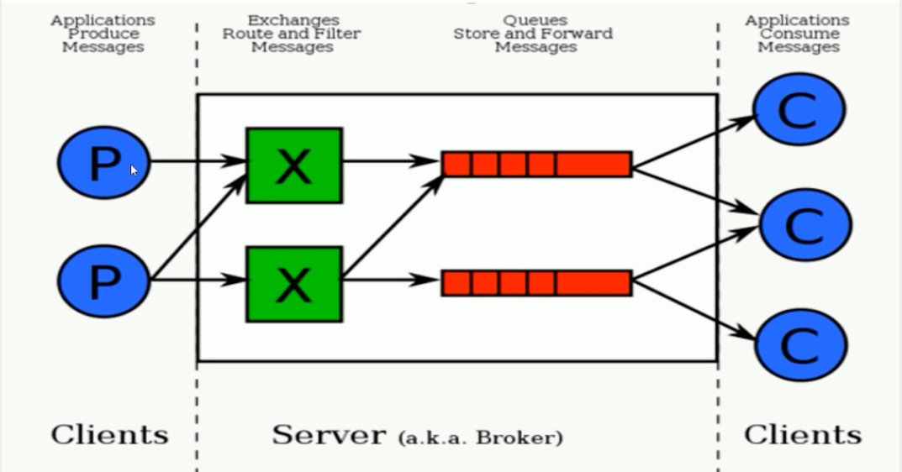
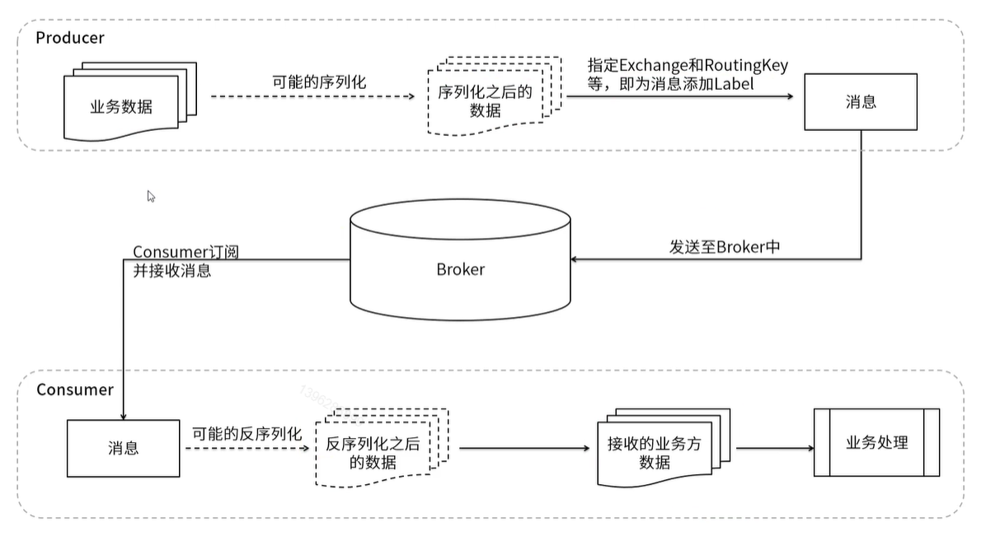

## RabbitMQ的核心组成部分

### 01、RabbitMQ的核心组成部分

核心概念：
**Server**：又称Broker ,接受客户端的连接，实现AMQP实体服务。 安装rabbitmq-server
**Connection**：连接，应用程序与Broker的网络连接 TCP/IP/ 三次握手和四次挥手
**Channel**：网络信道，几乎所有的操作都在Channel中进行，Channel是进行消息读写的通道，客户端可以建立对各Channel，每个Channel代表一个会话任务。
**Message** :消息：服务与应用程序之间传送的数据，由Properties和body组成，Properties可是对消息进行修饰，比如消息的优先级，延迟等高级特性，Body则就是消息体的内容。
**Virtual Host** 虚拟地址，用于进行逻辑隔离，最上层的消息路由，一个虚拟主机里可以有若干个Exhange和Queueu，同一个虚拟主机里面不能有相同名字的Exchange
**Exchange**：交换机，接受消息，根据路由键（Routingkey）发送消息到绑定的队列。(==不具备消息存储的能力==)
**Bindings**：Exchange和Queue之间的虚拟连接，binding中可以保护多个routing key.
**Routing key**：是一个路由规则，虚拟机可以用它来确定如何路由一个特定消息。
**Queue**：队列：也称为Message Queue,消息队列，保存消息并将它们转发给消费者。

### 02、RabbitMQ整体架构是什么样子的？

### 03、RabbitMQ的运行流程

> 可能的序列化是指，如果Producer发送的是一个对象，因为Broker无法存储对象，就需要先对对象进行序列化。

### 04、RabbitMQ支持消息的模式

参考官网：https://www.rabbitmq.com/getstarted.html

#### 04-1、简单模式 Simple

- 参考第12章节

#### 04-2、工作模式 Work

- web操作查看视频
- 类型：无
- 特点：分发机制

#### 04-3、发布订阅模式fanout

- web操作查看视频
- 类型：fanout
- 特点：生产者将消息发送到X交换机，发送到交换机的消息都会被转发到与该交换机绑定的所有队列上（Fanout交换机转发消息是最快的）

图解：

创建fanout-exchange交换机：

创建三个队列，并将三个队列绑定到fanout-exchange上

#### 04-4、路由模式direct

- web操作查看视频
- 类型：direct
- 特点：有routing-key的匹配模式，所有发送到Direct Exchange的消息被转发到routing-key中指定的Queue。消息传递时，routing-key必须完全匹配才会被队列接收，否则该消息会被抛弃。

#### 04-5、主题模式topic

- web操作查看视频
- 类型：topic
- 特点：队列需要绑定一个Topic，Exchange将routing-key和Topic进行模糊匹配，并将消息转发给所有Topic相符的队列

图解：

新建一个topic模式交换机

交换机绑定四个模糊匹配Routingkey

#### 04-6、参数模式headers

- web操作查看视频
- 类型：headers
- 特点：参数匹配模式

创建一个类型为header的交换机

向交换机中添加队列，添加队列时填充参数

发布消息，发布时填上参数。最后参数为x=1的队列queue1接收到了消息

### 小结

- rabbitmq发送消息一定有一个交换机
- 如果队列没有指定交换机会默认绑定一个交换机
  

- 如果在图形化界面中想要==预览==，一定要选择==Nack==，因为Nack不会应答，也就是说Consume不会向Broker发送确认信号。Broker接收不到确认信号，就认为Consumer没有接收到消息，就不会把消息从队列中移除。
  而Ack会应答，Broker接收到应答信号，会把消息从队列中移除。

