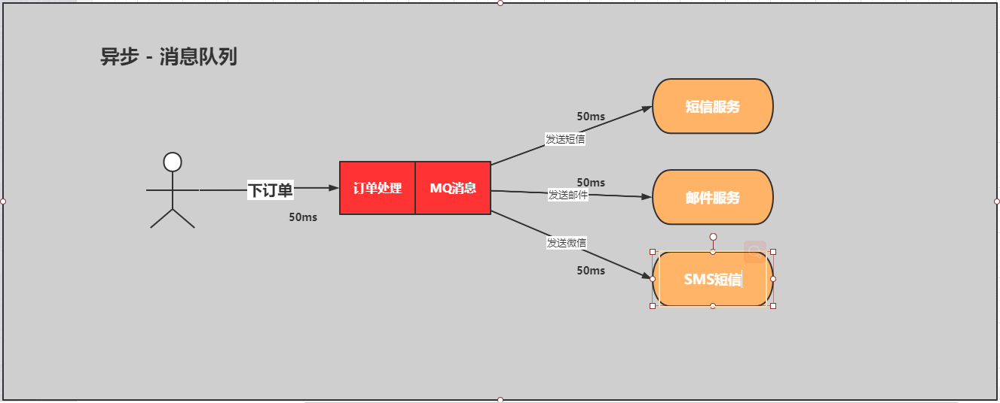

## RabbitMQ使用场景

### 01、解耦、削峰、异步

#### 01-1、同步异步的问题（串行）

串行方式：将订单信息写入数据库成功后，发送注册邮件，再发送注册短信。以上三个任务全部完成后，返回给客户端


**代码**

```java
public void makeOrder(){
    // 1 :保存订单 
    orderService.saveOrder();
    // 2： 发送短信服务
    messageService.sendSMS("order");//1-2 s
    // 3： 发送email服务
    emailService.sendEmail("order");//1-2 s
    // 4： 发送APP服务
    appService.sendApp("order");    
}
```

#### 01-2、并行方式 异步线程池

并行方式：将订单信息写入数据库成功后，发送注册邮件的同时，发送注册短信。以上三个任务完成后，返回给客户端。与串行的差别是，并行的方式可以提高处理的时间


**代码**

```java
public void makeOrder(){
    // 1 :保存订单 
    orderService.saveOrder();
   // 相关发送
   relationMessage();
}
public void relationMessage(){
    // 异步
     theadpool.submit(new Callable<Object>{
         public Object call(){
             // 2： 发送短信服务  
             messageService.sendSMS("order");
         }
     })
    // 异步
     theadpool.submit(new Callable<Object>{
         public Object call(){
              // 3： 发送email服务
            emailService.sendEmail("order");
         }
     })
      // 异步
     theadpool.submit(new Callable<Object>{
         public Object call(){
             // 4： 发送短信服务
             appService.sendApp("order");
         }
     })
      // 异步
         theadpool.submit(new Callable<Object>{
         public Object call(){
             // 4： 发送短信服务
             appService.sendApp("order");
         }
     })
}
```

存在问题：
1：耦合度高
2：需要自己写线程池自己维护成本太高
3：出现了消息可能会丢失，需要你自己做消息补偿
4：如何保证消息的可靠性你自己写
5：如果服务器承载不了，你需要自己去写高可用

#### 01-3、异步消息队列的方式



**好处**
1：完全解耦，用MQ建立桥接
2：有独立的线程池和运行模型
3：出现了消息可能会丢失，MQ有持久化功能
4：如何保证消息的可靠性，死信队列和消息转移的等
5：如果服务器承载不了，你需要自己去写高可用，HA镜像模型高可用。
按照以上约定，用户的响应时间相当于是订单信息写入数据库的时间，也就是50毫秒。注册邮件，发送短信写入消息队列后，直接返回，因此写入消息队列的速度很快，基本可以忽略，因此用户的响应时间可能是50毫秒。因此架构改变后，系统的吞吐量提高到每秒20 QPS。比串行提高了3倍，比并行提高了两倍

**代码**

```java
public void makeOrder(){
    // 1 :保存订单 
    orderService.saveOrder();   
    rabbitTemplate.convertSend("ex","2","消息内容");
}
```

02、高内聚，低耦合


03、流量的削峰


04、分布式事务的可靠消费和可靠生产
05、索引、缓存、静态化处理的数据同步
06、流量监控
07、日志监控（ELK）
08、下单、订单分发、抢票

