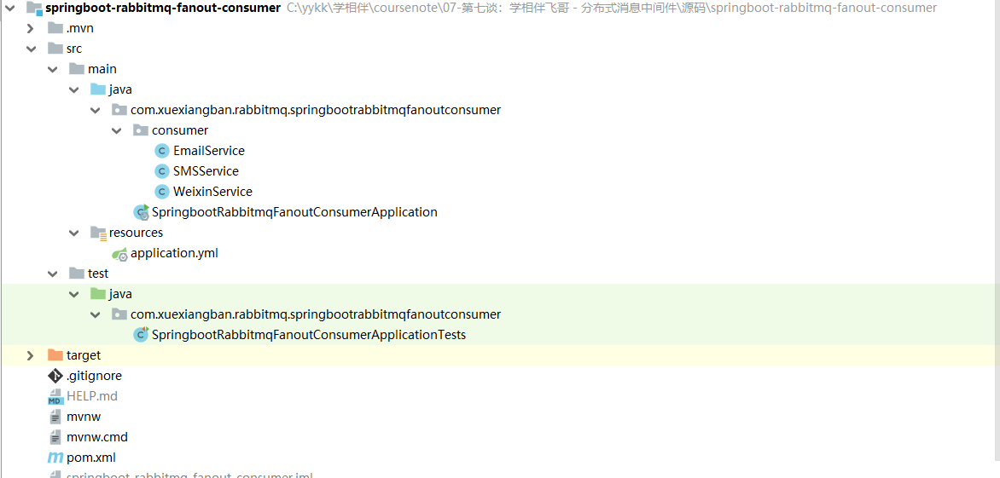

## RabbitMQ-SpringBoot案例 -direct模式

### 整体核心


### 01、目标

使用springboot完成rabbitmq的消费模式-Direct

### 02、实现步骤

1. 创建生产者工程：sspringboot-rabbitmq-direct-producer
2. 创建消费者工程：springboot-rabbitmq-direct-consumer
3. 引入spring-boot-rabbitmq的依赖
4. 进行消息的分发和测试
5. 查看和观察web控制台的状况

### 具体实现

### 03、生产者

#### 1、创建生产者工程：sspringboot-rabbitmq-direct-producer

#### 2、在pom.xml中引入依赖

```xml
        <dependency>
            <groupId>org.springframework.boot</groupId>
            <artifactId>spring-boot-starter-amqp</artifactId>
        </dependency>
        <dependency>
            <groupId>org.springframework.boot</groupId>
            <artifactId>spring-boot-starter-web</artifactId>
        </dependency>

        <dependency>
            <groupId>org.springframework.boot</groupId>
            <artifactId>spring-boot-starter-test</artifactId>
        </dependency>

        <dependency>
            <groupId>org.springframework.amqp</groupId>
            <artifactId>spring-rabbit-test</artifactId>
            <scope>test</scope>
        </dependency>
```

#### 3、在application.yml进行配置

```yml
# 服务端口
server:
  port: 8080
# 配置rabbitmq服务
spring:
  rabbitmq:
    username: admin
    password: admin
    virtual-host: /
    host: 47.97.4.188
    port: 5672
```

#### 4：定义订单的生产者

```java
package com.xuexiangban.rabbitmq.springbootrabbitmqfanoutproducer.service;
import org.springframework.amqp.rabbit.core.RabbitTemplate;
import org.springframework.beans.factory.annotation.Autowired;
import org.springframework.stereotype.Component;
import java.util.UUID;
/**
 * @author: 学相伴-飞哥
 * @description: OrderService
 * @Date : 2021/3/4
 */
@Component
public class OrderService {
    @Autowired
    private RabbitTemplate rabbitTemplate;
    // 1: 定义交换机
    private String exchangeName = "direct_order_exchange";
    // 2: 路由key
    public void makeOrder(Long userId, Long productId, int num) {
        // 1： 模拟用户下单
        String orderNumer = UUID.randomUUID().toString();
        // 2: 根据商品id productId 去查询商品的库存
        // int numstore = productSerivce.getProductNum(productId);
        // 3:判断库存是否充足
        // if(num >  numstore ){ return  "商品库存不足..."; }
        // 4: 下单逻辑
        // orderService.saveOrder(order);
        // 5: 下单成功要扣减库存
        // 6: 下单完成以后
        System.out.println("用户 " + userId + ",订单编号是：" + orderNumer);
        // 发送订单信息给RabbitMQ fanout
        rabbitTemplate.convertAndSend(exchangeName, "sms", orderNumer);
        rabbitTemplate.convertAndSend(exchangeName, "duanxin", orderNumer);
    }
}
```

#### 4、绑定关系

```java
package com.example.direct.config;

import org.springframework.amqp.core.Binding;
import org.springframework.amqp.core.BindingBuilder;
import org.springframework.amqp.core.DirectExchange;
import org.springframework.amqp.core.Queue;
import org.springframework.context.annotation.Bean;
import org.springframework.context.annotation.Configuration;

@Configuration
public class DirectRabbitConfig {

    //1.声明注册direct模式的交换机
    @Bean
    public DirectExchange directOrderExchange() {
        //  return new DirectExchange("TestDirectExchange",true,true);
        return new DirectExchange("direct_order_exchange", true, false);
    }

    //2.声明队列 sms.direct.queue  email.direct.queue  duanxin.direct.queue
    @Bean
    public Queue emailQueue() {
        // durable:是否持久化,默认是false,持久化队列：会被存储在磁盘上，当消息代理重启时仍然存在，暂存队列：当前连接有效
        // exclusive:默认也是false，只能被当前创建的连接使用，而且当连接关闭后队列即被删除。此参考优先级高于durable
        // autoDelete:是否自动删除，当没有生产者或者消费者使用此队列，该队列会自动删除。
        //   return new Queue("TestDirectQueue",true,true,false);
        //一般设置一下队列的持久化就好,其余两个就是默认false
        return new Queue("email.direct.queue", true);
    }
    @Bean
    public Queue smsQueue() {
        return new Queue("sms.direct.queue", true);
    }
    @Bean
    public Queue duanxinQueue() {
        return new Queue("duanxin.direct.queue", true);
    }

    //3.完成绑定关系（队列和交换机完成绑定关系）
    @Bean
    public Binding duanxinBinding() {
        return BindingBuilder.bind(duanxinQueue()).to(directOrderExchange()).with("duanxin");
    }
    @Bean
    public Binding smsBinding() {
        return BindingBuilder.bind(smsQueue()).to(directOrderExchange()).with("sms");
    }
    @Bean
    public Binding emailBinding() {
        return BindingBuilder.bind(emailQueue()).to(directOrderExchange()).with("email");
    }
}
```

#### 5、进行测试

```java
package com.xuexiangban.rabbitmq.springbootrabbitmqfanoutproducer;
import com.xuexiangban.rabbitmq.springbootrabbitmqfanoutproducer.service.OrderService;
import org.junit.jupiter.api.Test;
import org.springframework.beans.factory.annotation.Autowired;
import org.springframework.boot.test.context.SpringBootTest;
@SpringBootTest
class SpringbootRabbitmqFanoutProducerApplicationTests {
    @Autowired
    OrderService orderService;
    @Test
    public void contextLoads() throws Exception {
        for (int i = 0; i < 10; i++) {
            Thread.sleep(1000);
            Long userId = 100L + i;
            Long productId = 10001L + i;
            int num = 10;
            orderService.makeOrder(userId, productId, num);
        }
    }
}
```

### 04、定义消费者

#### 1、创建消费者工程：springboot-rabbitmq-fanout-consumer



#### 2、引入依赖pom.xml

```xml
<dependency>
    <groupId>org.springframework.boot</groupId>
    <artifactId>spring-boot-starter-amqp</artifactId>
</dependency>
<dependency>
    <groupId>org.springframework.boot</groupId>
    <artifactId>spring-boot-starter-web</artifactId>
</dependency>
```

#### 3、在application.yml进行配置

```yml
# 服务端口
server:
  port: 8081
# 配置rabbitmq服务
spring:
  rabbitmq:
    username: admin
    password: admin
    virtual-host: /
    host: 47.97.4.188
    port: 5672
```

#### 4、消费者 - 邮件服务

```java
package com.example.fanout.service.direct;

import org.springframework.amqp.rabbit.annotation.RabbitHandler;
import org.springframework.amqp.rabbit.annotation.RabbitListener;
import org.springframework.stereotype.Component;

@RabbitListener(queues = {"email.direct.queue"})
@Component
public class DirectEmailConsumer {
    @RabbitHandler
    public void receiveMessages(String message){
        System.out.println("email direct--接收到了订单：" + message);
    }
}

```

#### 5、消费者 - 短信服务

```java
package com.example.fanout.service.direct;

import org.springframework.amqp.rabbit.annotation.RabbitHandler;
import org.springframework.amqp.rabbit.annotation.RabbitListener;
import org.springframework.stereotype.Component;

@RabbitListener(queues = ("duanxin.direct.queue"))
@Component
public class DirectDuanxinConsumer {

    @RabbitHandler
    public void receiveMessages(String message){
        System.out.println("duanxin direct--接收到了订单：" + message);
    }
}

```

#### 6、消费者 - SMS服务

```java
package com.example.fanout.service.direct;

import org.springframework.amqp.rabbi	t.annotation.RabbitHandler;
import org.springframework.amqp.rabbit.annotation.RabbitListener;
import org.springframework.stereotype.Component;

@RabbitListener(queues = {"sms.direct.queue"})
@Component
public class DirectSMSConsumer {
    @RabbitHandler
    public void receiveMessages(String message){
        System.out.println("sms direct--接收到了订单：" + message);
    }
}

```

#### 7、启动服务SpringbootRabbitmqFanoutConsumerApplication，查看效果


> 如果先启动Producer工程，再启动Consumer工程，项目可以正常运行。
> 但是如果先启动Consumer工程，再启动Producer工程，项目会报错。原因是Producer未启动时而Consumer已经启动时，交换机和队列还没有绑定，应该等到交换机和队列绑定后再启动Consumer。
>
> 以下两种方法的思路都是：在Consumer工程启动时，如果交换机和队列还没有绑定，就在Consumer工程中进行绑定
>
> 解决方法：
>
> **方案1:**
>
> 完善Consumer类上的注解的信息：
>
> ```java
> @RabbitListener(queues = {"sms.direct.queue"})
> ```
>
> 换成
>
> ```java
> // bindings其实就是用来确定队列和交换机绑定关系
> @RabbitListener(bindings =@QueueBinding(
>   // email.topic.queue 是队列名字，这个名字你可以自定随便定义。
>   value = @Queue(value = "sms.direct.queue",autoDelete = "false"),
>   // order.topic 交换机的名字 必须和生产者保持一致
>   exchange = @Exchange(value = "direct_order_exchange",
>           // 这里是确定的rabbitmq模式是：topic 是以广播模式 、 发布订阅模式
>           type = ExchangeTypes.topic),
> 	key = "#.sms.#"
> ))
> ```
>
> **方案2：**
>
> 将在Producer工程中编写的DirectRabbitConfig配置类复制到Consumer工程中
>
> 

