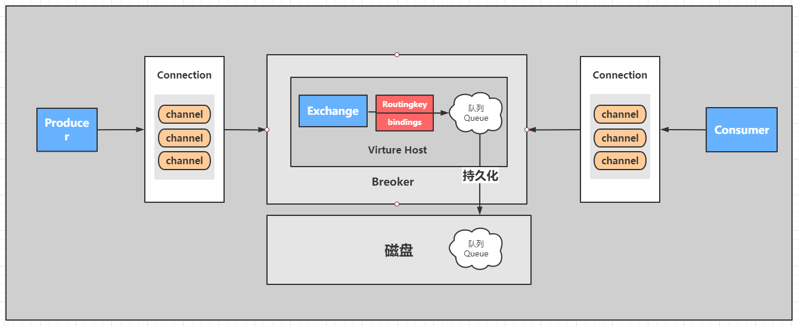
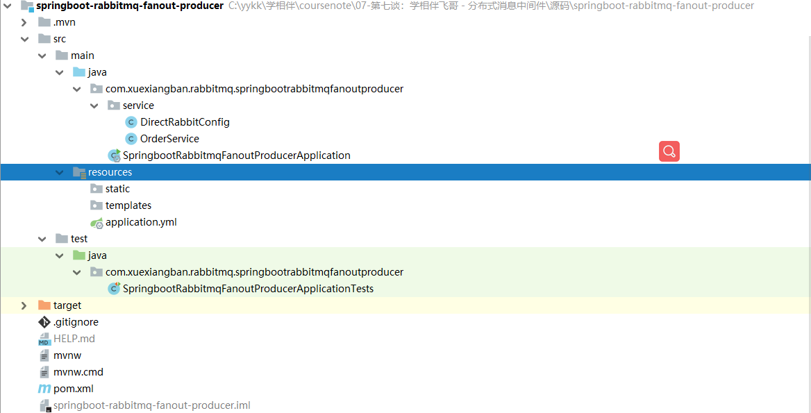
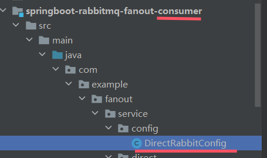

## RabbitMQ-SpringBoot案例 -topic模式

### 整体核心



### 01、目标

使用springboot完成rabbitmq的消费模式-Topic


### 02、实现步骤

1：创建生产者工程：sspringboot-rabbitmq-topic-producer
2：创建消费者工程：springboot-rabbitmq-topic-consumer
3：引入spring-boot-rabbitmq的依赖
4：进行消息的分发和测试
5：查看和观察web控制台的状况

### 具体实现

### 03、生产者

#### 1、创建生产者工程：sspringboot-rabbitmq-topic-producer



#### 2、在pom.xml中引入依赖

```xml
<dependency>
    <groupId>org.springframework.boot</groupId>
    <artifactId>spring-boot-starter-amqp</artifactId>
</dependency>
<dependency>
    <groupId>org.springframework.boot</groupId>
    <artifactId>spring-boot-starter-web</artifactId>
</dependency>
```

#### 3、在application.yml进行配置

```yml
# 服务端口
server:
  port: 8080
# 配置rabbitmq服务
spring:
  rabbitmq:
    username: admin
    password: admin
    virtual-host: /
    host: 47.97.4.188
    port: 5672
```

#### 4：定义订单的生产者

```java
package com.xuexiangban.rabbitmq.springbootrabbitmqtopicproducer.service;
import org.springframework.amqp.rabbit.core.RabbitTemplate;
import org.springframework.beans.factory.annotation.Autowired;
import org.springframework.stereotype.Component;
import java.util.UUID;
/**
 * @author: 学相伴-飞哥
 * @description: OrderService
 * @Date : 2021/3/4
 */
@Component
public class OrderService {
    @Autowired
    private RabbitTemplate rabbitTemplate;
    // 1: 定义交换机
    private String exchangeName = "Topic_order_exchange";
    // 2: 路由key
    private String routeKey = "";
    public void makeOrder(Long userId, Long productId, int num) {
        // 1： 模拟用户下单
        String orderNumer = UUID.randomUUID().toString();
        // 2: 根据商品id productId 去查询商品的库存
        // int numstore = productSerivce.getProductNum(productId);
        // 3:判断库存是否充足
        // if(num >  numstore ){ return  "商品库存不足..."; }
        // 4: 下单逻辑
        // orderService.saveOrder(order);
        // 5: 下单成功要扣减库存
        // 6: 下单完成以后
        System.out.println("用户 " + userId + ",订单编号是：" + orderNumer);
        // 发送订单信息给RabbitMQ topic
        rabbitTemplate.convertAndSend(exchangeName, routeKey, orderNumer);
	    rabbitTemplate.convertAndSend(exchangeName, routeKey, orderNumer);
    }
}
```

#### 4、绑定关系

```java
package com.xuexiangban.rabbitmq.springbootrabbitmqtopicproducer.service;
import org.springframework.amqp.core.Binding;
import org.springframework.amqp.core.BindingBuilder;
import org.springframework.amqp.core.TopicExchange;
import org.springframework.amqp.core.Queue;
import org.springframework.context.annotation.Bean;
import org.springframework.context.annotation.Configuration;
/**
 * @Author : JCccc
 * @CreateTime : 2019/9/3
 * @Description :
 **/
@Configuration
public class TopicRabbitConfig {
    //队列 起名：TestTopicQueue
    @Bean
    public Queue emailQueue() {
        // durable:是否持久化,默认是false,持久化队列：会被存储在磁盘上，当消息代理重启时仍然存在，暂存队列：当前连接有效
        // exclusive:默认也是false，只能被当前创建的连接使用，而且当连接关闭后队列即被删除。此参考优先级高于durable
        // autoDelete:是否自动删除，当没有生产者或者消费者使用此队列，该队列会自动删除。
        //   return new Queue("TestTopicQueue",true,true,false);
        //一般设置一下队列的持久化就好,其余两个就是默认false
        return new Queue("email.topic.queue", true);
    }
    @Bean
    public Queue smsQueue() {
        return new Queue("sms.topic.queue", true);
    }
    @Bean
    public Queue weixinQueue() {
        return new Queue("weixin.topic.queue", true);
    }
    //Topic交换机 起名：TestTopicExchange
    @Bean
    public TopicExchange TopicOrderExchange() {
        //  return new TopicExchange("TestTopicExchange",true,true);
        return new TopicExchange("Topic_order_exchange", true, false);
    }
    //绑定  将队列和交换机绑定, 并设置用于匹配键：TestTopicRouting
    @Bean
    public Binding bindingTopic1() {
        return BindingBuilder.bind(weixinQueue()).to(TopicOrderExchange()).with("");
    }
    @Bean
    public Binding bindingTopic2() {
        return BindingBuilder.bind(smsQueue()).to(TopicOrderExchange()).with("");
    }
    @Bean
    public Binding bindingTopic3() {
        return BindingBuilder.bind(emailQueue()).to(TopicOrderExchange()).with("");
    }
}
```

#### 5、进行测试

```java
package com.xuexiangban.rabbitmq.springbootrabbitmqfanoutproducer;
import com.xuexiangban.rabbitmq.springbootrabbitmqfanoutproducer.service.OrderService;
import org.junit.jupiter.api.Test;
import org.springframework.beans.factory.annotation.Autowired;
import org.springframework.boot.test.context.SpringBootTest;
@SpringBootTest
class SpringbootRabbitmqFanoutProducerApplicationTests {
    @Autowired
    OrderService orderService;
    @Test
    public void contextLoads() throws Exception {
        for (int i = 0; i < 10; i++) {
            Thread.sleep(1000);
            Long userId = 100L + i;
            Long productId = 10001L + i;
            int num = 10;
            orderService.makeOrder(userId, productId, num);
        }
    }
}
```

### 04、定义消费者

#### 1、创建消费者工程：springboot-rabbitmq-topic-consumer


#### 2、引入依赖pom.xml

```xml
<dependency>
    <groupId>org.springframework.boot</groupId>
    <artifactId>spring-boot-starter-amqp</artifactId>
</dependency>
<dependency>
    <groupId>org.springframework.boot</groupId>
    <artifactId>spring-boot-starter-web</artifactId>
</dependency>
```

#### 3、在application.yml进行配置

```yml
# 服务端口
server:
  port: 8081
# 配置rabbitmq服务
spring:
  rabbitmq:
    username: admin
    password: admin
    virtual-host: /
    host: 47.97.4.188
    port: 5672
```

#### 4、消费者 - 邮件服务

```java
package com.xuexiangban.rabbitmq.springbootrabbitmqtopicconsumer.consumer;
import org.springframework.amqp.core.ExchangeTypes;
import org.springframework.amqp.rabbit.annotation.*;
import org.springframework.stereotype.Component;
// bindings其实就是用来确定队列和交换机绑定关系
@RabbitListener(bindings =@QueueBinding(
        // email.topic.queue 是队列名字，这个名字你可以自定随便定义。
        value = @Queue(value = "email.topic.queue",autoDelete = "false"),
        // order.topic 交换机的名字 必须和生产者保持一致
        exchange = @Exchange(value = "topic_order_exchange",
                // 这里是确定的rabbitmq模式是：topic 是以广播模式 、 发布订阅模式
                type = ExchangeTypes.topic),
    	key = "#.email.#"
))
@Component
public class EmailService {
    // @RabbitHandler 代表此方法是一个消息接收的方法。该不要有返回值
    @RabbitHandler
    public void messagerevice(String message){
        // 此处省略发邮件的逻辑
        System.out.println("email-------------->" + message);
    }
}
```

#### 5、消费者 - 短信服务

```java
package com.xuexiangban.rabbitmq.springbootrabbitmqtopicconsumer.consumer;
import org.springframework.amqp.core.ExchangeTypes;
import org.springframework.amqp.rabbit.annotation.*;
import org.springframework.stereotype.Component;
// bindings其实就是用来确定队列和交换机绑定关系
@RabbitListener(bindings =@QueueBinding(
        // email.topic.queue 是队列名字，这个名字你可以自定随便定义。
        value = @Queue(value = "sms.topic.queue",autoDelete = "false"),
        // order.topic 交换机的名字 必须和生产者保持一致
        exchange = @Exchange(value = "topic_order_exchange",
                // 这里是确定的rabbitmq模式是：topic 是以广播模式 、 发布订阅模式
                type = ExchangeTypes.topic),
    	key = "#.sms.#"
))
@Component
public class SMSService {
    // @RabbitHandler 代表此方法是一个消息接收的方法。该不要有返回值
    @RabbitHandler
    public void messagerevice(String message){
        // 此处省略发邮件的逻辑
        System.out.println("sms-------------->" + message);
    }
}
```

#### 6、消费者 - 微信服务

```java
package com.xuexiangban.rabbitmq.springbootrabbitmqtopicconsumer.consumer;
import org.springframework.amqp.core.ExchangeTypes;
import org.springframework.amqp.rabbit.annotation.*;
import org.springframework.stereotype.Component;
// bindings其实就是用来确定队列和交换机绑定关系
@RabbitListener(bindings =@QueueBinding(
        // email.topic.queue 是队列名字，这个名字你可以自定随便定义。
        value = @Queue(value = "weixin.topic.queue",autoDelete = "false"),
        // order.topic 交换机的名字 必须和生产者保持一致
        exchange = @Exchange(value = "topic_order_exchange",
                // 这里是确定的rabbitmq模式是：topic 是以广播模式 、 发布订阅模式
                type = ExchangeTypes.topic),
    	key = "#.weixin.#"
))
@Component
public class WeixinService {
    // @RabbitHandler 代表此方法是一个消息接收的方法。该不要有返回值
    @RabbitHandler
    public void messagerevice(String message){
        // 此处省略发邮件的逻辑
        System.out.println("weixin-------------->" + message);
    }
}
```

#### 7、启动服务SpringbootRabbitmqtopicConsumerApplication，查看效果


> 如果先启动Producer工程，再启动Consumer工程，项目可以正常运行。
> 但是如果先启动Consumer工程，再启动Producer工程，项目会报错。原因是Producer未启动时而Consumer已经启动时，交换机和队列还没有绑定，应该等到交换机和队列绑定后再启动Consumer。
>
> 以下两种方法的思路都是：在Consumer工程启动时，如果交换机和队列还没有绑定，就在Consumer工程中进行绑定
>
> 解决方法：
>
> **方案1:**
>
> 完善Consumer类上的注解的信息：
>
> ```java
> @RabbitListener(queues = {"sms.topic.queue"})
> ```
>
> 换成
>
> ```java
> // bindings其实就是用来确定队列和交换机绑定关系
> @RabbitListener(bindings =@QueueBinding(
>   // email.topic.queue 是队列名字，这个名字你可以自定随便定义。
>   value = @Queue(value = "sms.topic.queue",autoDelete = "false"),
>   // order.topic 交换机的名字 必须和生产者保持一致
>   exchange = @Exchange(value = "topic_order_exchange",
>           // 这里是确定的rabbitmq模式是：topic 是以广播模式 、 发布订阅模式
>           type = ExchangeTypes.topic),
> 	key = "#.sms.#"
> ))
> ```
>
> **方案2：**
>
> 将在Producer工程中编写的DirectRabbitConfig配置类复制到Consumer工程中
>
> 

