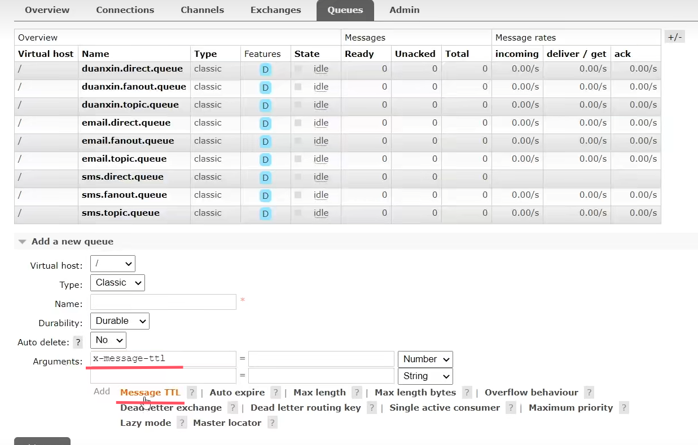
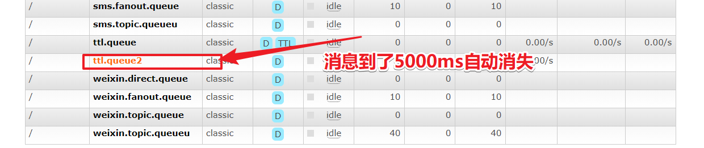

## RabbitMQ高级-过期时间TTL

### 1、概述

过期时间TTL表示可以对消息设置预期的时间，在这个时间内都可以被消费者接收获取；过了之后消息将自动被删除。RabbitMQ可以对**消息和队列**设置TTL。目前有两种方法可以设置。

- 第一种方法是通过队列属性设置，队列中所有消息都有相同的过期时间。
- 第二种方法是对消息进行单独设置，每条消息TTL可以不同。

如果上述两种方法同时使用，则消息的过期时间以两者之间TTL较小的那个数值为准。消息在队列的生存时间一旦超过设置的TTL值，就称为dead message被投递到死信队列， 消费者将无法再收到该消息。

### 1-1、 设置队列TTL

#### 代码设置

```java
package com.xuexiangban.rabbitmq.ttl;
import com.rabbitmq.client.AMQP;
import com.rabbitmq.client.Channel;
import com.rabbitmq.client.Connection;
import com.rabbitmq.client.ConnectionFactory;
import org.springframework.amqp.core.Message;
import org.springframework.amqp.core.MessageProperties;
import java.util.HashMap;
import java.util.Map;
/**
 * @author: 学相伴-飞哥
 * @description: Producer 简单队列生产者
 * @Date : 2021/3/2
 */
public class Producer {
    public static void main(String[] args) {
        // 1: 创建连接工厂
        ConnectionFactory connectionFactory = new ConnectionFactory();
        // 2: 设置连接属性
        connectionFactory.setHost("47.104.141.27");
        connectionFactory.setPort(5672);
        connectionFactory.setVirtualHost("/");
        connectionFactory.setUsername("admin");
        connectionFactory.setPassword("admin");
        Connection connection = null;
        Channel channel = null;
        try {
            // 3: 从连接工厂中获取连接
            connection = connectionFactory.newConnection("生产者");
            // 4: 从连接中获取通道channel
            channel = connection.createChannel();
            // 5: 申明队列queue存储消息
            /*
             *  如果队列不存在，则会创建
             *  Rabbitmq不允许创建两个相同的队列名称，否则会报错。
             *
             *  @params1： queue 队列的名称
             *  @params2： durable 队列是否持久化
             *  @params3： exclusive 是否排他，即是否私有的，如果为true,会对当前队列加锁，其他的通道不能访问，并且连接自动关闭
             *  @params4： autoDelete 是否自动删除，当最后一个消费者断开连接之后是否自动删除消息。
             *  @params5： arguments 可以设置队列附加参数，设置队列的有效期，消息的最大长度，队列的消息生命周期等等。
             * */
            Map<String,Object> args2 = new HashMap<>();
            args2.put("x-message-ttl",5000);
            channel.queueDeclare("ttl.queue", true, false, false, args2);
            // 6： 准备发送消息的内容
            String message = "你好，学相伴！！！";
            Map<String, Object> headers = new HashMap<String, Object>();
            headers.put("x", "1");
            headers.put("y", "1");
            AMQP.BasicProperties basicProperties = new AMQP.BasicProperties().builder()
                    .deliveryMode(2) // 传送方式
                    .priority(1)
                    .contentEncoding("UTF-8") // 编码方式
                    .expiration("3000") // 过期时间
                    .headers(headers).build(); //自定义属性
            // 7: 发送消息给中间件rabbitmq-server
            // @params1: 交换机exchange
            // @params2: 队列名称/routing
            // @params3: 属性配置
            // @params4: 发送消息的内容
            for (int i = 0; i <100 ; i++) {
                channel.basicPublish("", "ttl.queue", basicProperties, message.getBytes());
                System.out.println("消息发送成功!");
                Thread.sleep(1000);
            }
        } catch (Exception ex) {
            ex.printStackTrace();
            System.out.println("发送消息出现异常...");
        } finally {
            // 7: 释放连接关闭通道
            if (channel != null && channel.isOpen()) {
                try {
                    channel.close();
                } catch (Exception ex) {
                    ex.printStackTrace();
                }
            }
            if (connection != null && connection.isOpen()) {
                try {
                    connection.close();
                } catch (Exception ex) {
                    ex.printStackTrace();
                }
            }
        }
    }
}
```

> ” x-message-ttl  “ 这个参数来自图形化界面：
>
> 

#### 测试类

```java
package com.xuexiangban.rabbitmq.ttl;
import com.rabbitmq.client.*;
import java.io.IOException;
/**
 * @author: 学相伴-飞哥
 * @description: Consumer
 * @Date : 2021/3/2
 */
public class Consumer {
    public static void main(String[] args) {
        // 1: 创建连接工厂
        ConnectionFactory connectionFactory = new ConnectionFactory();
        // 2: 设置连接属性
        connectionFactory.setHost("47.104.141.27");
        connectionFactory.setPort(5672);
        connectionFactory.setVirtualHost("/");
        connectionFactory.setUsername("admin");
        connectionFactory.setPassword("admin");
        Connection connection = null;
        Channel channel = null;
        try {
            // 3: 从连接工厂中获取连接
            connection = connectionFactory.newConnection("消费者");
            // 4: 从连接中获取通道channel
            channel = connection.createChannel();
            // 5: 申明队列queue存储消息
            /*
             *  如果队列不存在，则会创建
             *  Rabbitmq不允许创建两个相同的队列名称，否则会报错。
             *
             *  @params1： queue 队列的名称
             *  @params2： durable 队列是否持久化
             *  @params3： exclusive 是否排他，即是否私有的，如果为true,会对当前队列加锁，其他的通道不能访问，并且连接自动关闭
             *  @params4： autoDelete 是否自动删除，当最后一个消费者断开连接之后是否自动删除消息。
             *  @params5： arguments 可以设置队列附加参数，设置队列的有效期，消息的最大长度，队列的消息生命周期等等。
             * */
            // 这里如果queue已经被创建过一次了，可以不需要定义
            //channel.queueDeclare("queue1", false, false, false, null);
            // 6： 定义接受消息的回调
            Channel finalChannel = channel;
            finalChannel.basicConsume("ttl.queue", true, new DefaultConsumer(channel){
                @Override
                public void handleDelivery(String consumerTag, Envelope envelope, AMQP.BasicProperties properties, byte[] body) throws IOException {
                    System.out.println(properties);
                    System.out.println("获取的消息是：" + new String(body,"UTF-8"));
                }
            });
            System.out.println("开始接受消息");
            System.in.read();
        } catch (Exception ex) {
            ex.printStackTrace();
            System.out.println("发送消息出现异常...");
        } finally {
            // 7: 释放连接关闭通道
            if (channel != null && channel.isOpen()) {
                try {
                    channel.close();
                } catch (Exception ex) {
                    ex.printStackTrace();
                }
            }
            if (connection != null && connection.isOpen()) {
                try {
                    connection.close();
                } catch (Exception ex) {
                    ex.printStackTrace();
                }
            }
        }
    }
}
```

> 参数 x-message-ttl 的值 必须是非负 32 位整数 (0 <= n <= 2^32-1) ，以毫秒为单位表示 TTL 的值。这样，值 6000 表示存在于 队列 中的当前 消息 将最多只存活 6 秒钟。


### 1-2、 设置消息TTL

消息的过期时间；只需要在发送消息（可以发送到任何队列，不管该队列是否属于某个交换机）的时候设置过期时间即可。在测试类中编写如下方法发送消息并设置过期时间到队列：

```java
package com.xuexiangban.rabbitmq.ttl;
import com.rabbitmq.client.AMQP;
import com.rabbitmq.client.Channel;
import com.rabbitmq.client.Connection;
import com.rabbitmq.client.ConnectionFactory;
import java.util.HashMap;
import java.util.Map;
/**
 * @author: 学相伴-飞哥
 * @description: Producer 简单队列生产者
 * @Date : 2021/3/2
 */
public class MessageTTLProducer {
    public static void main(String[] args) {
        // 1: 创建连接工厂
        ConnectionFactory connectionFactory = new ConnectionFactory();
        // 2: 设置连接属性
        connectionFactory.setHost("47.104.141.27");
        connectionFactory.setPort(5672);
        connectionFactory.setVirtualHost("/");
        connectionFactory.setUsername("admin");
        connectionFactory.setPassword("admin");
        Connection connection = null;
        Channel channel = null;
        try {
            // 3: 从连接工厂中获取连接
            connection = connectionFactory.newConnection("生产者");
            // 4: 从连接中获取通道channel
            channel = connection.createChannel();
            // 5: 申明队列queue存储消息
            /*
             *  如果队列不存在，则会创建
             *  Rabbitmq不允许创建两个相同的队列名称，否则会报错。
             *
             *  @params1： queue 队列的名称
             *  @params2： durable 队列是否持久化
             *  @params3： exclusive 是否排他，即是否私有的，如果为true,会对当前队列加锁，其他的通道不能访问，并且连接自动关闭
             *  @params4： autoDelete 是否自动删除，当最后一个消费者断开连接之后是否自动删除消息。
             *  @params5： arguments 可以设置队列附加参数，设置队列的有效期，消息的最大长度，队列的消息生命周期等等。
             * */
            channel.queueDeclare("ttl.queue2", true, false, false, null);
            // 6： 准备发送消息的内容
            String message = "你好，学相伴！！！";
            Map<String, Object> headers = new HashMap<String, Object>();
            headers.put("x", "1");
            headers.put("y", "1");
            AMQP.BasicProperties basicProperties = new AMQP.BasicProperties().builder()
                    .deliveryMode(2) // 传送方式
                    .priority(1)
                    .contentEncoding("UTF-8") // 编码方式
                    .expiration("5000") // 过期时间
                    .headers(headers).build(); //自定义属性
            // 7: 发送消息给中间件rabbitmq-server
            // @params1: 交换机exchange
            // @params2: 队列名称/routing
            // @params3: 属性配置
            // @params4: 发送消息的内容
            for (int i = 0; i <10 ; i++) {
                channel.basicPublish("", "ttl.queue2", basicProperties, message.getBytes());
                System.out.println("消息发送成功!");
            }
        } catch (Exception ex) {
            ex.printStackTrace();
            System.out.println("发送消息出现异常...");
        } finally {
            // 7: 释放连接关闭通道
            if (channel != null && channel.isOpen()) {
                try {
                    channel.close();
                } catch (Exception ex) {
                    ex.printStackTrace();
                }
            }
            if (connection != null && connection.isOpen()) {
                try {
                    connection.close();
                } catch (Exception ex) {
                    ex.printStackTrace();
                }
            }
        }
    }
}
```



> expiration 字段以微秒为单位表示 TTL 值。且与 x-message-ttl 具有相同的约束条件。因为 expiration 字段必须为字符串类型，broker 将只会接受以字符串形式表达的数字。
> 当同时指定了 queue 和 message 的 TTL 值，则两者中较小的那个才会起作用。

