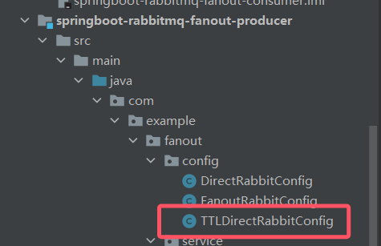
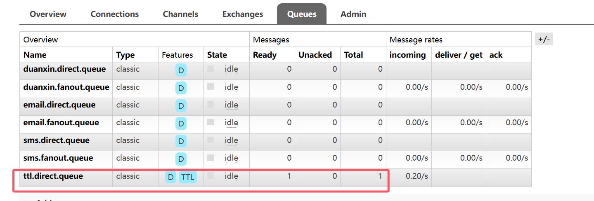
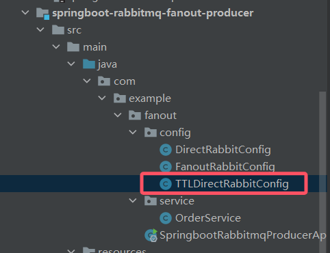
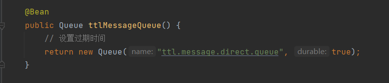
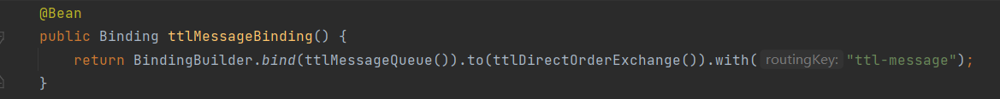
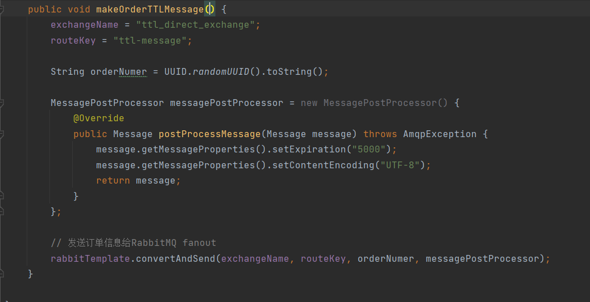
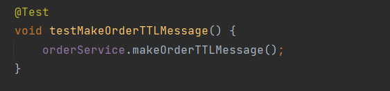
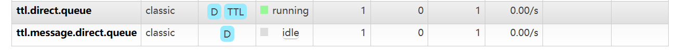
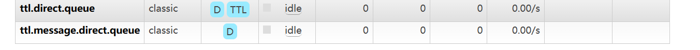

## 24-1.RabbitMQ高级-过期时间TTL-SpringBoot写法

### 1-1、设置队列TTL

首先新增一个配置类：



```java
package com.example.fanout.config;

import org.springframework.amqp.core.Binding;
import org.springframework.amqp.core.BindingBuilder;
import org.springframework.amqp.core.DirectExchange;
import org.springframework.amqp.core.Queue;
import org.springframework.context.annotation.Bean;
import org.springframework.context.annotation.Configuration;

import java.util.HashMap;
import java.util.Map;

@Configuration
public class TTLDirectRabbitConfig {

    //1.声明注册direct模式的交换机
    @Bean
    public DirectExchange ttlDirectOrderExchange() {
        //  return new DirectExchange("TestDirectExchange",true,true);
        return new DirectExchange("ttl_direct_exchange", true, false);
    }

    //2.声明队列 sms.direct.queue  email.direct.queue  duanxin.direct.queue
    @Bean
    public Queue ttlQueue() {
        // 设置过期时间
        Map<String,Object> args = new HashMap<>();
        args.put("x-message-ttl", 5000);
        return new Queue("ttl.direct.queue", true, false, false, args);
    }

    //3.完成绑定关系（队列和交换机完成绑定关系）
    @Bean
    public Binding ttlBinding() {
        return BindingBuilder.bind(ttlQueue()).to(ttlDirectOrderExchange()).with("ttl");
    }
}
```

向OrderService中新增一个方法：


```java
    public void makeOrderTTL(String userId, String productId, int num) {
        exchangeName = "ttl_direct_exchange";
        routeKey = "ttl";

        String orderNumer = UUID.randomUUID().toString();

        // 发送订单信息给RabbitMQ fanout
        rabbitTemplate.convertAndSend(exchangeName, routeKey, orderNumer);
    }
```

运行测试用例：

```java
@Test
void testMakeOrderTTL() {
    orderService.makeOrderTTL("1", "1", 12);
}
```

#### 运行结果：

交换机创建成功：


队列创建成功，且队列内的消息5秒后消失


### 1-2、设置消息TTL

在TTLDirectRabbitConfig中添加如下代码：







在OrderSservice中添加如下方法：




执行测试用例：

	

#### 运行结果：

两个队列同时出现消息，消息同时消失。





