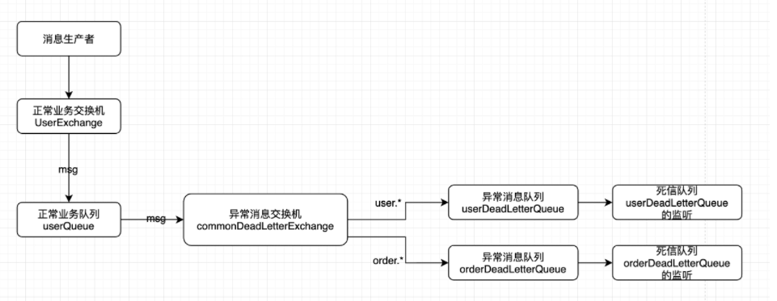
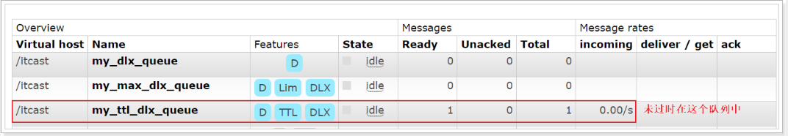

## RabbitMQ高级-死信队列

DLX，全称为Dead-Letter-Exchange , 可以称之为死信交换机，也有人称之为死信邮箱。当消息在一个队列中变成死信(dead message)之后，它能被重新发送到另一个交换机中，这个交换机就是DLX ，绑定DLX的队列就称之为死信队列。
消息变成死信，可能是由于以下的原因：

- 消息被拒绝
- 消息过期
- 队列达到最大长度

DLX也是一个正常的交换机，和一般的交换机没有区别，它能在任何的队列上被指定，实际上就是设置某一个队列的属性。当这个队列中存在死信时，Rabbitmq就会自动地将这个消息重新发布到设置的DLX上去，进而被路由到另一个队列，即死信队列。
要想使用死信队列，只需要在定义队列的时候设置队列参数 `x-dead-letter-exchange` 指定交换机即可。



### 在rabbitMQ管理界面中结果

未过期：



过期后：


流程


### 用SpringBoot方式测试死信队列

新建一个死信队列的配置类：


```java
package com.example.fanout.config;

import org.springframework.amqp.core.Binding;
import org.springframework.amqp.core.BindingBuilder;
import org.springframework.amqp.core.DirectExchange;
import org.springframework.amqp.core.Queue;
import org.springframework.context.annotation.Bean;
import org.springframework.context.annotation.Configuration;

@Configuration
public class DeadRabbitConfig {

    //1.声明注册direct模式的交换机
    @Bean
    public DirectExchange deadDirectExchange() {
        //  return new DirectExchange("TestDirectExchange",true,true);
        return new DirectExchange("dead_direct_exchange", true, false);
    }

    //2.声明队列 sms.direct.queue  email.direct.queue  duanxin.direct.queue
    @Bean
    public Queue deadQueue() {
        return new Queue("dead.direct.queue", true);
    }

    //3.完成绑定关系（队列和交换机完成绑定关系）
    @Bean
    public Binding deadBinding() {
        return BindingBuilder.bind(deadQueue()).to(deadDirectExchange()).with("dead");
    }
}
```

修改过期时间的配置类，让 “过期时间配置类 的 过期时间队列” 和 “死信队列配置类 的 死信队列” 产生联系
并且注意：在ttlQueue方法中添加配置之后，需要在控制台将 ttl.direct.queue删除掉，再运行代码。因为原ttl.direct.queue的配置和现在的ttl.direct.queue的配置不一样，导致队列无法成功创建，进而导致程序报错
如果未来线上出现这种情况，不要删除掉正在使用的队列，应该重新为队列命名，添加一个新的队列。


其中x-dead-letter-exchange 和 x-dead-letter-routing-key来自控制台


最后运行测试方法执行测试用例：


#### 运行结果

消息首先进入正常的TTL队列


五秒后消息过期，消息从原来的TTL队列 进入死信队列


